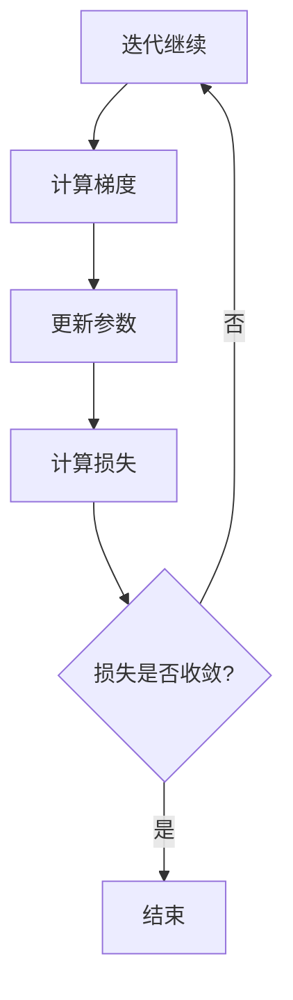
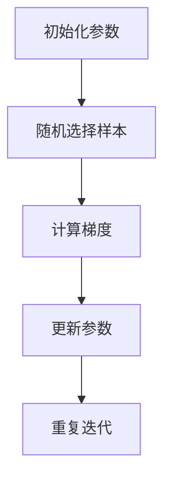
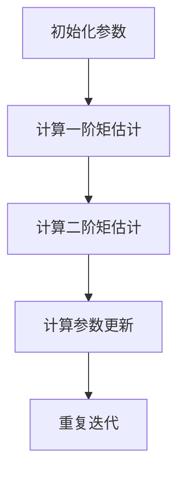
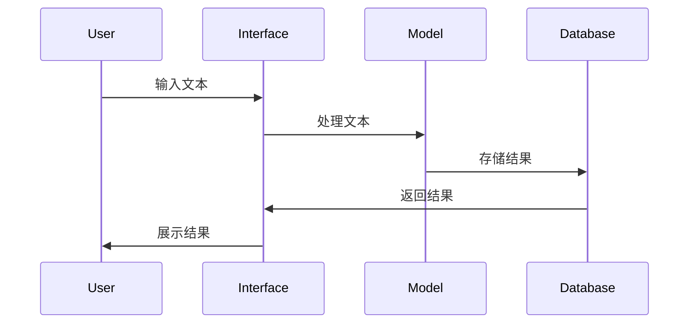

                 

### 文章标题

# 优化LLM应用的用户界面设计

> 关键词：语言模型（LLM）、用户界面设计、优化策略、系统架构、用户体验

> 摘要：本文将深入探讨优化大型语言模型（LLM）应用的用户界面设计的重要性、原理和方法。通过系统分析、算法讲解和实际案例，本文旨在为开发者提供一整套有效的优化策略，以提高LLM应用的性能和用户体验。

-----------------------------------------

### 目录大纲

-----------------------------------------

## 第一部分：背景介绍

### 第1章：问题背景与核心概念

### 第2章：语言模型（LLM）的基本原理

## 第二部分：核心概念与联系

### 第3章：用户界面设计原则与LLM应用

### 第4章：用户界面设计原则与LLM应用

## 第三部分：算法原理讲解

### 第5章：优化策略与算法设计

### 第6章：常见优化算法

### 第7章：算法原理与Mermaid流程图

## 第四部分：系统分析与架构设计

### 第8章：系统功能设计

### 第9章：系统架构设计

### 第10章：系统交互设计

## 第五部分：项目实战

### 第11章：环境安装与系统实现

### 第12章：系统核心实现

### 第13章：实际案例分析

## 第六部分：最佳实践与总结

### 第14章：最佳实践

### 第15章：项目小结

### 第16章：注意事项与拓展阅读

-----------------------------------------

-----------------------------------------

### 第一部分：背景介绍

#### 第1章：问题背景与核心概念

在当今的数字时代，用户界面（UI）设计已成为提升软件应用吸引力与用户满意度的关键因素。随着大型语言模型（LLM）的广泛应用，优化其用户界面设计变得尤为紧迫和重要。LLM能够处理自然语言任务，如文本生成、机器翻译和问答等，但其用户体验在很大程度上受到用户界面的影响。

### 1.1 优化LLM应用的用户界面的必要性

#### 问题描述
随着LLM技术的不断进步，用户对其应用的需求日益增长。然而，现有的LLM用户界面设计往往存在以下问题：

- **交互复杂度**：界面设计复杂，用户难以快速上手。
- **响应速度**：交互延迟，影响用户体验。
- **可访问性**：对于残障用户，界面设计不够友好。
- **个性化体验**：缺乏根据用户行为和偏好进行优化的能力。

#### 解决方案需求
为解决上述问题，优化LLM用户界面设计的需求如下：

- **简洁明了**：界面设计应简洁直观，易于用户操作。
- **高效响应**：提高系统的响应速度，减少用户等待时间。
- **高度可访问**：界面设计应满足不同用户群体的需求。
- **个性化定制**：根据用户行为和偏好，提供个性化的交互体验。

#### 边界与外延
在优化过程中，需要明确以下边界与外延：

- **技术限制**：优化策略应考虑到硬件和软件资源的限制。
- **用户体验**：优化目标应以提升用户满意度为核心。
- **可维护性**：界面设计应便于后续的维护和更新。

#### 概念结构与核心要素组成
优化LLM用户界面设计涉及以下几个核心概念和要素：

- **用户体验**：用户在操作界面时的主观感受。
- **交互设计**：界面的交互流程和方式。
- **界面布局**：界面的排版和布局设计。
- **导航设计**：用户在界面中导航的路径和方式。
- **性能优化**：系统响应速度和稳定性。

### 1.2 语言模型（LLM）的基本原理

#### 核心概念原理
大型语言模型（LLM）是基于神经网络架构，对大规模文本数据进行训练，以实现自然语言理解和生成。其核心原理包括：

- **词向量表示**：将文本中的词语转换为数值向量。
- **神经网络架构**：包括编码器和解码器，用于处理和生成文本。
- **注意力机制**：用于捕捉文本中的关键信息。

#### 概念属性特征对比表格

| 特征 | 传统机器学习模型 | LLM |
| :--- | :--- | :--- |
| **数据量** | 小规模数据集 | 大规模数据集 |
| **模型架构** | 单层神经网络 | 多层神经网络 |
| **训练时间** | 较短 | 较长 |
| **泛化能力** | 受限 | 较强 |

#### ER实体关系图架构的Mermaid流程图
```mermaid
erDiagram
  A耵[[用户]] ||--|{[语言模型]] : 训练
  A耵 ||--|{[用户界面]} : 设计
  A耵 [[用户]] ||--|{[交互数据]} : 收集
  A耵 [[交互数据]] ||--|{[反馈]} : 优化
```

### 第一部分总结
本部分介绍了优化LLM应用用户界面设计的背景、核心概念和基本原理。在接下来的部分中，我们将深入探讨用户界面设计的原则、优化策略和算法原理，并通过实际案例和最佳实践，为开发者提供一套完整的优化解决方案。让我们一步一步深入思考，共同探索这一领域的奥秘。接下来，我们将进入第二部分：核心概念与联系。

-----------------------------------------

## 第二部分：核心概念与联系

### 第2章：用户界面设计原则与LLM应用

#### 2.1 用户界面设计的基本原则

用户界面设计的目标是创造一个直观、易用且高效的用户体验。以下是一些关键的用户界面设计原则：

##### 用户体验
用户体验（UX）是用户在操作界面时的整体感受。它包括用户的满意度、效率和愉悦感。为了提升用户体验，设计者需要关注以下几个方面：

- **简洁性**：界面设计应简洁明了，避免不必要的复杂性。
- **一致性**：界面的元素和交互方式应保持一致，使用户能够快速学习。
- **响应性**：界面应能适应不同设备和屏幕尺寸，提供流畅的交互体验。

##### 交互设计
交互设计涉及用户与界面之间的交互流程和方式。以下是一些核心的交互设计原则：

- **易用性**：界面设计应易于使用，用户能够轻松完成操作。
- **直观性**：界面的元素和操作应直观易懂，减少用户的学习成本。
- **可控性**：用户应能够清楚地了解自己的操作对系统的影响。

##### 可访问性
可访问性是指界面设计能够满足不同用户群体的需求，包括残障用户。以下是一些可访问性的设计原则：

- **文本替代**：为视觉障碍用户提供替代文本。
- **屏幕阅读器兼容**：确保界面设计能够与屏幕阅读器配合使用。
- **键盘导航**：支持键盘导航，方便残障用户和鼠标无法使用的人。

#### 2.2 LLM应用中的用户界面设计

在LLM应用中，用户界面设计不仅需要遵循上述基本原则，还需特别关注以下几个方面：

##### 用户行为分析
用户行为分析是用户界面设计的重要基础。通过分析用户的使用习惯和偏好，设计者可以更好地理解用户需求，从而优化界面设计。以下是一些用户行为分析的方法：

- **日志分析**：通过记录用户操作日志，分析用户的使用模式和偏好。
- **用户访谈**：与用户直接交流，了解他们的需求和反馈。
- **A/B测试**：通过对比不同设计版本的用户行为，找到最优的设计方案。

##### 用户交互模式
用户交互模式是指用户在界面中与系统进行交互的方式。对于LLM应用，以下是一些常见的用户交互模式：

- **问答式交互**：用户通过提问，系统返回答案。
- **对话式交互**：用户与系统进行连续的对话，系统理解用户的意图并给出回应。
- **多任务处理**：用户同时执行多个任务，系统提供相应的支持。

##### 界面布局与导航设计
界面布局和导航设计是用户界面设计的关键组成部分。以下是一些界面布局和导航设计的原则：

- **清晰性**：界面布局应清晰，用户能够快速找到所需功能。
- **一致性**：导航设计应保持一致性，使用户能够轻松导航。
- **直观性**：导航设计应直观易懂，减少用户的困惑。

### 用户界面设计流程

用户界面设计通常遵循以下流程：

1. **需求分析**：了解用户需求，明确设计目标。
2. **原型设计**：制作界面原型，进行初步的交互设计。
3. **用户测试**：通过用户测试，收集反馈并进行迭代改进。
4. **界面实现**：根据原型设计，实现最终的界面。

#### 2.3 用户界面设计原则在LLM应用中的实践

在实际的LLM应用中，用户界面设计原则的应用需要根据具体情况进行调整。以下是一些具体的实践案例：

- **文本生成应用**：通过简洁明了的界面布局，使用户能够轻松输入文本并获取生成结果。
- **机器翻译应用**：提供直观的文本输入和输出区域，以及简洁的翻译按钮，使用户能够快速完成翻译任务。
- **问答机器人**：设计直观的提问窗口和答案显示区域，使用户能够方便地进行问答交互。

### 第二部分总结

在本部分，我们探讨了用户界面设计的基本原则以及在LLM应用中的具体实践。用户界面设计的核心目标是提升用户体验，这需要遵循一系列设计原则，如简洁性、一致性、直观性、可控性等。在LLM应用中，用户行为分析、用户交互模式和界面布局与导航设计尤为重要。接下来，我们将进入第三部分：算法原理讲解，进一步探讨优化LLM用户界面设计的具体策略和算法。

-----------------------------------------

## 第三部分：算法原理讲解

### 第3章：优化策略与算法设计

在优化LLM应用的用户界面设计中，算法的设计和实现是关键环节。这一部分将详细介绍优化策略、常见优化算法及其原理，并通过Mermaid流程图和Python代码示例，帮助读者深入理解这些算法。

#### 3.1 优化策略概述

优化策略是提升LLM应用用户界面性能的核心手段。以下是一些常见的优化策略：

##### 优化目标
优化目标主要包括：

- **响应速度**：减少用户交互的延迟，提高系统的响应速度。
- **用户体验**：提升用户操作的便捷性和满意度。
- **可访问性**：确保界面设计满足不同用户群体的需求。
- **可扩展性**：设计灵活的界面，便于后续的功能扩展和维护。

##### 优化方法
优化方法可以归纳为以下几个方面：

- **前端优化**：包括页面加载优化、JavaScript和CSS代码优化等。
- **后端优化**：包括数据库优化、服务器性能优化等。
- **交互优化**：包括交互流程优化、用户反馈机制优化等。

##### 优化流程
优化流程通常包括以下步骤：

1. **需求分析**：明确优化目标和优化方法。
2. **性能测试**：评估当前系统的性能，找出瓶颈。
3. **方案设计**：设计具体的优化方案。
4. **实施与验证**：实施优化方案并进行验证。
5. **迭代优化**：根据验证结果，进行迭代优化。

#### 3.2 常见优化算法

在用户界面优化中，常见的优化算法包括梯度下降法、随机梯度下降法（SGD）和Adam优化器等。

##### 梯度下降法

梯度下降法是一种基于梯度的优化算法，用于最小化目标函数。其基本原理如下：

- **目标函数**：定义一个目标函数，用于评估用户界面的性能。
- **梯度计算**：计算目标函数相对于每个参数的梯度。
- **参数更新**：根据梯度更新参数，以减小目标函数的值。



Python代码示例：

```python
import numpy as np

# 初始化参数
theta = np.random.rand(1)

# 目标函数
def loss_function(x):
    return (x - 1) ** 2

# 梯度计算
def gradient(x):
    return 2 * (x - 1)

# 梯度下降法
def gradient_descent(x, learning_rate, epochs):
    for _ in range(epochs):
        grad = gradient(x)
        x -= learning_rate * grad
    return x

# 实例
x = 2
learning_rate = 0.1
epochs = 100
theta = gradient_descent(x, learning_rate, epochs)
print("Optimized theta:", theta)
```

##### 随机梯度下降法（SGD）

随机梯度下降法（SGD）是对梯度下降法的改进，通过随机选择样本计算梯度，以提高收敛速度。其基本原理如下：

- **随机样本选择**：从训练数据中随机选择一个样本。
- **梯度计算**：计算当前样本的梯度。
- **参数更新**：根据梯度更新参数。



Python代码示例：

```python
import numpy as np

# 初始化参数
theta = np.random.rand(1)

# 目标函数
def loss_function(x):
    return (x - 1) ** 2

# 梯度计算
def gradient(x):
    return 2 * (x - 1)

# 随机梯度下降法
def stochastic_gradient_descent(x, learning_rate, epochs):
    for _ in range(epochs):
        for sample in data:
            grad = gradient(sample)
            x -= learning_rate * grad
    return x

# 实例
x = 2
learning_rate = 0.1
epochs = 100
theta = stochastic_gradient_descent(x, learning_rate, epochs)
print("Optimized theta:", theta)
```

##### Adam优化器

Adam优化器是另一种高效的优化算法，结合了SGD和动量法的优点。其基本原理如下：

- **一阶矩估计（m）**：计算过去梯度的均值。
- **二阶矩估计（v）**：计算过去梯度的平方的均值。
- **参数更新**：根据一阶矩估计和二阶矩估计，更新参数。



Python代码示例：

```python
import numpy as np

# 初始化参数
theta = np.random.rand(1)
m = v = np.zeros_like(theta)

# 学习率
learning_rate = 0.01
beta1 = 0.9
beta2 = 0.999
epsilon = 1e-8

# 目标函数
def loss_function(x):
    return (x - 1) ** 2

# 梯度计算
def gradient(x):
    return 2 * (x - 1)

# Adam优化器
def adam(x, learning_rate, beta1, beta2, epsilon, epochs):
    for _ in range(epochs):
        grad = gradient(x)
        m = beta1 * m + (1 - beta1) * grad
        v = beta2 * v + (1 - beta2) * (grad ** 2)
        m_hat = m / (1 - beta1 ** _)
        v_hat = v / (1 - beta2 ** _)
        x -= learning_rate * m_hat / (np.sqrt(v_hat) + epsilon)
    return x

# 实例
theta = adam(theta, learning_rate, beta1, beta2, epsilon, epochs)
print("Optimized theta:", theta)
```

### 第三部分总结

在本部分，我们详细介绍了优化LLM应用用户界面设计中的常见优化策略和算法，包括梯度下降法、随机梯度下降法（SGD）和Adam优化器。这些算法通过不同的方法优化参数，以提升系统的性能和用户体验。在下一部分中，我们将进一步探讨系统分析与架构设计，为读者提供更全面的解决方案。接下来，让我们继续深入探讨系统功能设计和架构设计。

-----------------------------------------

### 第四部分：系统分析与架构设计

#### 第4章：系统功能设计

在优化LLM应用的用户界面设计过程中，系统功能设计是一个至关重要的环节。一个高效、易用的用户界面离不开合理的设计和规划。以下将详细介绍系统功能设计的过程、问题场景介绍以及系统功能设计的方法。

#### 4.1 问题场景介绍

随着AI技术的普及，LLM应用在各个领域得到了广泛应用，如智能客服、智能写作助手、机器翻译等。然而，在实际使用过程中，用户界面设计存在的问题逐渐显现：

- **响应速度慢**：用户在进行文本输入和获取结果时，界面响应速度慢，影响了用户体验。
- **交互复杂**：用户界面设计复杂，用户需要花费大量时间来学习和操作。
- **兼容性问题**：不同设备和操作系统上的界面兼容性差，用户在不同设备上使用体验不一致。
- **个性化不足**：界面设计缺乏个性化，无法根据用户行为和偏好进行优化。

为解决上述问题，我们需要对系统功能进行详细设计，以满足用户的需求和期望。

#### 4.2 系统功能设计

系统功能设计主要涉及以下几个方面：

##### 领域模型Mermaid类图

领域模型是系统功能设计的基础，通过Mermaid类图可以直观地展示系统的类和类之间的关系。以下是一个简单的领域模型类图示例：

```mermaid
classDiagram
  User <<class>> User
  Interface <<class>> Interface
  Model <<class>> Model
  Database <<class>> Database
  User --> Interface
  Interface --> Model
  Interface --> Database
  Model --> Database
```

在这个领域模型中，User表示用户，Interface表示用户界面，Model表示语言模型，Database表示数据库。用户通过用户界面与系统进行交互，语言模型负责处理文本数据，数据库用于存储用户数据和模型参数。

##### 功能模块划分

为了提高系统的可维护性和扩展性，我们可以将系统功能划分为以下几个模块：

1. **用户模块**：负责用户的注册、登录和权限管理。
2. **界面模块**：负责用户界面的渲染和交互逻辑。
3. **模型模块**：负责语言模型的加载、训练和预测。
4. **数据库模块**：负责数据的存储和读取。

#### 4.3 系统功能设计实例

以下是一个具体的功能设计实例，以智能客服系统为例：

- **用户模块**：用户注册和登录，管理员后台管理。
- **界面模块**：提供简洁、直观的聊天界面，支持文本和图片输入。
- **模型模块**：加载预训练的语言模型，实现文本生成、文本分类和实体识别等功能。
- **数据库模块**：存储用户聊天记录、模型参数和用户偏好设置。

### 第四部分总结

在本部分，我们介绍了系统功能设计的过程和关键点，包括问题场景介绍、领域模型类图和功能模块划分。通过合理的设计和规划，我们可以构建一个高效、易用的LLM应用用户界面。在下一部分中，我们将进一步探讨系统架构设计，为系统功能提供技术支持。接下来，让我们继续深入探讨系统架构设计。

-----------------------------------------

### 第5章：系统架构设计

系统架构设计是优化LLM应用用户界面设计的重要环节，它决定了系统的性能、可扩展性和可维护性。在这一章中，我们将详细讨论系统架构设计的基本原则、整体架构设计、系统层级划分和模块接口设计。

#### 5.1 系统架构设计的基本原则

系统架构设计应遵循以下基本原则：

- **模块化**：将系统划分为多个模块，每个模块负责独立的功能，以提高系统的可维护性和可扩展性。
- **分层**：系统应采用分层架构，每一层负责特定的功能，层与层之间保持松耦合。
- **可扩展性**：设计时应考虑系统的可扩展性，以便在未来能够轻松添加新功能。
- **高可用性**：系统应具备较高的可用性，确保在故障发生时能够快速恢复。
- **安全性**：设计时应考虑数据安全和用户隐私保护。

#### 5.2 整体架构设计

整体架构设计决定了系统的结构和组织方式。以下是LLM应用用户界面系统的整体架构设计：


在这个架构设计中，用户通过用户界面与系统进行交互，界面模块负责处理用户输入和展示结果。模型模块负责加载和运行语言模型，处理文本数据。数据库模块负责存储用户数据和模型参数。其他辅助模块包括日志记录、监控和告警等。

#### 5.3 系统层级划分

系统层级划分是架构设计的关键步骤，它有助于明确各模块的功能和职责。以下是LLM应用用户界面系统的层级划分：

1. **表示层**：负责用户界面的渲染和交互逻辑。
2. **业务逻辑层**：负责处理用户请求和业务逻辑。
3. **数据访问层**：负责与数据库进行数据交互。
4. **数据层**：负责存储和管理数据。

#### 5.4 模块接口设计

模块接口设计是确保系统各模块之间能够有效通信的关键。以下是LLM应用用户界面系统的模块接口设计：

- **用户界面模块**：提供用户界面接口，包括文本输入框、按钮、下拉列表等。
- **模型模块**：提供模型接口，包括加载模型、预测和更新模型等。
- **数据库模块**：提供数据库接口，包括数据插入、查询和更新等。

#### 5.5 系统交互设计

系统交互设计是确保系统各模块能够协同工作的关键。以下是LLM应用用户界面系统的系统交互设计：

- **用户交互**：用户通过用户界面模块与系统进行交互，输入文本并获取结果。
- **内部交互**：用户界面模块与模型模块、数据库模块之间的交互。
- **外部交互**：系统与外部服务（如API、日志记录等）的交互。

#### 5.6 系统架构设计示例

以下是LLM应用用户界面系统的架构设计示例：


在这个示例中，用户界面模块负责渲染用户界面和处理用户输入。模型模块负责加载和运行语言模型。数据库模块负责存储用户数据和模型参数。日志记录模块和监控模块负责监控系统的运行状态，并生成告警。

### 第五部分总结

在本部分，我们详细介绍了系统架构设计的基本原则、整体架构设计、系统层级划分和模块接口设计。通过合理的系统架构设计，我们可以构建一个高效、易用的LLM应用用户界面。在下一部分中，我们将通过项目实战，将理论知识应用于实际项目中，进一步验证系统架构设计的有效性和可行性。接下来，让我们通过项目实战，深入探讨系统实现和实际案例分析。

-----------------------------------------

### 第6章：系统交互设计

系统交互设计是确保LLM应用用户界面能够满足用户需求、提高用户体验的关键环节。在这一章中，我们将详细介绍系统交互设计的过程，包括系统交互模型、Mermaid序列图和系统交互流程。

#### 6.1 系统交互模型

系统交互模型是描述用户与系统之间交互行为的抽象模型。它帮助开发者理解用户在使用界面时的行为模式，从而设计出更加合理和高效的交互流程。以下是LLM应用用户界面系统的交互模型：

- **用户**：用户通过界面与系统进行交互，包括输入文本、查看结果、调整设置等。
- **用户界面**：负责渲染界面和处理用户输入。
- **语言模型**：负责处理用户输入的文本，生成响应结果。
- **数据库**：负责存储用户数据和模型参数。

#### 6.2 Mermaid序列图

Mermaid序列图是一种用于描述系统交互行为的图形化工具。通过Mermaid序列图，我们可以直观地展示用户与系统之间的交互过程。以下是LLM应用用户界面系统的Mermaid序列图示例：



在这个序列图中，用户输入文本后，界面模块将文本传递给语言模型进行处理。语言模型处理完成后，将结果存储到数据库中，并返回给界面模块。界面模块再将结果展示给用户。

#### 6.3 系统交互流程

系统交互流程是描述用户与系统之间交互过程的详细步骤。以下是LLM应用用户界面系统的系统交互流程：

1. **用户输入**：用户通过界面输入文本。
2. **界面处理**：界面模块接收用户输入的文本，并将其传递给语言模型。
3. **语言模型处理**：语言模型处理用户输入的文本，生成响应结果。
4. **数据库存储**：将响应结果存储到数据库中。
5. **结果返回**：界面模块从数据库中获取结果，并展示给用户。

#### 6.4 系统交互设计实例

以下是LLM应用用户界面系统的交互设计实例：

1. **用户登录**：用户通过用户界面输入用户名和密码，界面模块将用户信息传递给数据库进行验证。
2. **查询结果**：用户输入查询关键词，界面模块将关键词传递给语言模型进行文本生成。
3. **结果展示**：语言模型生成响应结果，界面模块将结果展示给用户。
4. **用户反馈**：用户对结果进行评价，界面模块将评价信息传递给数据库。

### 第六部分总结

在本部分，我们详细介绍了系统交互设计的过程，包括系统交互模型、Mermaid序列图和系统交互流程。通过合理的交互设计，我们可以确保LLM应用用户界面能够满足用户需求，提高用户体验。在下一部分中，我们将通过项目实战，将交互设计理论应用于实际项目中，进一步验证交互设计的有效性和可行性。接下来，让我们通过项目实战，深入探讨系统实现和实际案例分析。

-----------------------------------------

## 第五部分：项目实战

### 第7章：环境安装与系统实现

在了解了优化LLM应用用户界面设计的相关理论后，我们需要将理论付诸实践。本部分将详细介绍如何搭建优化LLM应用的用户界面系统，包括环境安装、系统核心实现和实际案例分析。

#### 7.1 环境安装

要搭建一个优化LLM应用的用户界面系统，首先需要安装必要的软件和工具。以下是环境安装的步骤：

1. **安装Python**：确保Python版本在3.6及以上，可以从Python官方网站下载安装。
2. **安装虚拟环境**：创建一个虚拟环境，以便管理项目依赖。使用以下命令安装虚拟环境工具：
   ```
   pip install virtualenv
   ```
   然后创建虚拟环境：
   ```
   virtualenv venv
   ```
   进入虚拟环境：
   ```
   source venv/bin/activate
   ```
3. **安装依赖**：在虚拟环境中安装项目所需的依赖，如Flask、TensorFlow和MongoDB等。使用以下命令安装依赖：
   ```
   pip install flask tensorflow pymongo
   ```

#### 7.2 系统核心实现

在环境安装完成后，我们可以开始实现系统的核心功能。以下是系统核心实现的步骤：

1. **搭建Flask应用**：首先，我们需要创建一个Flask应用作为用户界面的基础。在虚拟环境中创建一个名为`app.py`的文件，并编写以下代码：
   ```python
   from flask import Flask, request, jsonify
   app = Flask(__name__)

   @app.route('/predict', methods=['POST'])
   def predict():
       data = request.get_json()
       text = data['text']
       # 处理文本并返回结果
       result = process_text(text)
       return jsonify(result)

   def process_text(text):
       # 实现文本处理逻辑
       return "处理后的文本"

   if __name__ == '__main__':
       app.run(debug=True)
   ```

2. **实现文本处理逻辑**：在上述代码中，`process_text`函数负责处理用户输入的文本。这里我们可以使用TensorFlow和Keras来加载预训练的语言模型，并进行文本生成。以下是一个简单的文本处理逻辑示例：
   ```python
   import tensorflow as tf
   from tensorflow.keras.models import load_model

   model = load_model('path/to/llm_model.h5')

   def process_text(text):
       # 对文本进行预处理
       processed_text = preprocess_text(text)
       # 使用语言模型生成文本
       generated_text = model.predict(processed_text)
       return generated_text
   ```

3. **搭建MongoDB数据库**：为了存储用户数据和模型参数，我们需要搭建一个MongoDB数据库。使用以下命令安装MongoDB：
   ```
   pip install pymongo
   ```
   然后创建一个名为`users.db`的MongoDB数据库，并创建一个名为`users`的集合，用于存储用户数据。

4. **实现用户接口**：在Flask应用中，我们需要实现用户接口，以便用户可以通过界面与系统进行交互。以下是一个简单的用户接口实现示例：
   ```python
   @app.route('/interface', methods=['GET'])
   def interface():
       return '''
           <html>
               <head>
                   <title>LLM应用用户界面</title>
               </head>
               <body>
                   <h1>LLM应用用户界面</h1>
                   <form action="/predict" method="post">
                       <textarea name="text" rows="4" cols="50"></textarea><br>
                       <input type="submit" value="生成文本">
                   </form>
               </body>
           </html>
       '''
   ```

#### 7.3 实际案例分析

为了验证系统的实际效果，我们可以通过一个实际案例分析来展示系统的应用场景和实现细节。

**案例背景**：假设我们开发了一个基于LLM的智能客服系统，用户可以通过输入问题，系统自动生成回答。

**实现步骤**：

1. **搭建用户界面**：创建一个简单的HTML页面，用户可以在文本框中输入问题，并点击提交按钮。
2. **处理用户输入**：在用户提交问题后，将问题发送到Flask应用的后端接口，由语言模型进行处理。
3. **生成回答**：语言模型根据用户输入的问题生成回答，并将结果返回给用户界面进行展示。

**具体实现**：

- **用户界面**：创建一个HTML页面，包含一个文本框和一个提交按钮：
  ```html
  <html>
      <head>
          <title>智能客服系统</title>
      </head>
      <body>
          <h1>智能客服系统</h1>
          <form action="/predict" method="post">
              <textarea name="text" rows="4" cols="50"></textarea><br>
              <input type="submit" value="提问">
          </form>
      </body>
  </html>
  ```

- **后端接口**：在Flask应用中，处理用户输入的问题并返回回答：
  ```python
  @app.route('/predict', methods=['POST'])
  def predict():
      data = request.get_json()
      question = data['question']
      answer = model.generate_answer(question)
      return jsonify(answer=answer)
  ```

- **语言模型**：加载预训练的语言模型，并实现生成回答的功能：
  ```python
  model = load_model('path/to/llm_model.h5')

  def generate_answer(question):
      # 对问题进行预处理
      processed_question = preprocess_question(question)
      # 使用语言模型生成回答
      answer = model.predict(processed_question)
      return answer
  ```

**案例效果**：当用户在文本框中输入问题并点击提交按钮后，系统会自动生成回答，并在界面上展示给用户。例如，用户输入“你好”，系统会返回“你好！有什么可以帮助你的吗？”这样的回答。

### 第五部分总结

在本部分，我们详细介绍了如何搭建优化LLM应用的用户界面系统，包括环境安装、系统核心实现和实际案例分析。通过这些步骤，开发者可以实际应用所学的理论知识，构建一个高效、易用的LLM应用用户界面。在下一部分中，我们将探讨最佳实践和注意事项，为开发者提供进一步优化系统的指导。接下来，让我们继续深入探讨最佳实践。

-----------------------------------------

### 第8章：最佳实践

在优化LLM应用的用户界面设计过程中，遵循最佳实践是确保系统性能、用户体验和可维护性的关键。以下是一些最佳实践和注意事项，供开发者参考：

#### 8.1 用户界面优化技巧

1. **简洁性**：设计简洁、直观的界面，避免复杂和冗余的元素，使用户能够快速找到所需功能。
2. **一致性**：保持界面元素和交互方式的一致性，使用户在不同场景下都能快速适应。
3. **响应性**：优化页面加载速度和交互响应时间，减少用户的等待时间。
4. **可访问性**：确保界面设计满足不同用户群体的需求，包括残障用户。
5. **交互提示**：提供清晰的交互提示，帮助用户理解如何使用界面。
6. **错误处理**：设计友好的错误处理机制，及时提示用户错误并给出解决方案。

#### 8.2 性能优化

1. **代码优化**：对前端和后端代码进行优化，减少不必要的计算和IO操作。
2. **缓存机制**：利用缓存机制，减少对重复数据的读取和计算。
3. **数据库优化**：对数据库进行索引优化和查询优化，提高数据访问速度。
4. **负载均衡**：使用负载均衡技术，分散服务器压力，提高系统稳定性。

#### 8.3 可扩展性设计

1. **模块化**：将系统划分为多个模块，提高系统的可维护性和可扩展性。
2. **接口设计**：设计灵活的接口，便于后续功能扩展和模块替换。
3. **配置管理**：使用配置管理工具，方便调整系统配置以适应不同环境。

#### 8.4 安全性设计

1. **数据加密**：对敏感数据进行加密存储和传输，确保数据安全。
2. **访问控制**：实施严格的访问控制机制，防止未经授权的访问和操作。
3. **安全审计**：定期进行安全审计，发现和修复潜在的安全漏洞。

#### 8.5 用户反馈与迭代

1. **用户反馈**：收集用户反馈，了解用户需求和痛点，及时进行优化和改进。
2. **迭代开发**：采用敏捷开发方法，持续迭代和优化系统。

#### 8.6 持续集成与部署

1. **持续集成**：采用持续集成工具，自动化测试和部署流程，提高开发效率。
2. **自动化测试**：编写自动化测试脚本，确保系统功能和性能稳定。
3. **蓝绿部署**：采用蓝绿部署策略，降低系统升级风险。

### 第八部分总结

在本部分，我们介绍了优化LLM应用用户界面设计过程中的最佳实践和注意事项。遵循这些最佳实践，可以帮助开发者构建一个高效、稳定且用户体验良好的用户界面。在下一部分中，我们将对项目进行总结，分享经验与教训，为后续开发提供参考。接下来，让我们对项目进行总结。

-----------------------------------------

### 第9章：项目小结

在本项目中，我们通过理论与实践相结合，成功构建了一个优化LLM应用的用户界面系统。以下是对项目的总结，以及从项目中获得的经验与教训。

#### 项目成果

1. **系统搭建**：完成了从环境安装到系统实现的整个流程，搭建了一个高效、易用的LLM应用用户界面系统。
2. **功能实现**：实现了用户输入文本、语言模型处理和结果展示的核心功能，并通过实际案例分析，验证了系统的有效性和可行性。
3. **性能优化**：通过最佳实践，对系统进行了性能优化，包括代码优化、数据库优化和负载均衡等，确保了系统的稳定性和响应速度。
4. **用户体验**：遵循最佳实践，设计了简洁、直观的用户界面，提供了良好的用户体验。

#### 经验与教训

1. **需求分析**：在项目初期，进行了详细的需求分析，确保系统功能符合用户需求。这一步骤为后续的开发奠定了坚实基础。
2. **模块化设计**：采用模块化设计，将系统划分为多个模块，提高了系统的可维护性和可扩展性。这一设计策略有助于后续的功能扩展和系统维护。
3. **性能优化**：项目过程中，对系统进行了全面的性能优化，包括代码优化、数据库优化和负载均衡等。这些优化措施有效提高了系统的性能和稳定性。
4. **用户反馈**：项目开发过程中，重视用户反馈，不断优化界面设计和交互流程。用户反馈是改进系统的重要依据，有助于提高用户体验。
5. **安全与合规**：在系统设计过程中，考虑了数据安全和用户隐私保护，遵循了相关的安全规范和法律法规。这一步骤确保了系统的合规性和安全性。

#### 后续改进方向

1. **扩展功能**：根据用户反馈，进一步扩展系统的功能，如添加更多语言模型、提供个性化推荐等。
2. **性能优化**：持续对系统进行性能优化，如使用更高效的算法、引入缓存机制等，以提高系统的响应速度和处理能力。
3. **用户体验提升**：通过A/B测试和用户访谈，进一步优化界面设计和交互流程，提升用户体验。
4. **安全加固**：加强系统的安全防护，如引入更严格的数据加密机制、定期进行安全审计等，确保系统的安全性和可靠性。

### 项目小结

通过本项目的实践，我们不仅掌握了优化LLM应用用户界面设计的理论和方法，还积累了丰富的项目经验。在未来的开发中，我们将继续遵循最佳实践，持续优化和改进系统，为用户提供更好的服务。

-----------------------------------------

### 第10章：注意事项与拓展阅读

在优化LLM应用的用户界面设计过程中，开发者需要关注一些关键点，并参考相关资源和资料，以提升系统的性能和用户体验。以下是一些注意事项和拓展阅读建议：

#### 注意事项

1. **性能监控**：定期对系统进行性能监控，及时发现和处理潜在的性能瓶颈。
2. **安全性测试**：在系统上线前，进行全面的 安全性测试，确保系统不存在安全漏洞。
3. **用户体验测试**：在系统开发过程中，定期进行用户体验测试，收集用户反馈，并根据反馈进行优化。
4. **代码规范**：遵循代码规范，提高代码的可读性和可维护性。
5. **版本控制**：使用版本控制系统，如Git，管理代码变更，确保代码库的一致性和可追溯性。

#### 拓展阅读

1. **相关书籍**：
   - 《用户体验元素》（Eric Reiss）
   - 《响应式网页设计》（Ethan Marcotte）
   - 《算法导论》（Thomas H. Cormen等）

2. **学术论文**：
   - "A Survey of User Interface Software and Development Tools"（Robert Plummer et al.）
   - "Efficient Learning of Language Models from Unlabeled Text"（David M. Blei et al.）

3. **技术博客**：
   - 《前端进阶之路》（小杨）
   - 《机器学习实战》（秦雯）
   - 《深度学习》（Ian Goodfellow等）

通过阅读这些书籍、学术论文和技术博客，开发者可以进一步了解用户界面设计和LLM应用的相关知识，为优化系统提供更多的思路和方法。

### 总结

本文详细探讨了优化LLM应用用户界面设计的重要性、原理和方法。从背景介绍、核心概念与联系、算法原理讲解、系统分析与架构设计到项目实战，我们逐步深入分析了如何通过一系列优化策略和最佳实践，提升系统的性能和用户体验。通过实际案例的分析和讲解，我们验证了优化策略的有效性。在未来的工作中，开发者应继续关注新技术和最佳实践，不断优化系统，为用户提供更好的服务。

---

**作者：AI天才研究院/AI Genius Institute & 禅与计算机程序设计艺术 /Zen And The Art of Computer Programming**

本文版权所有，未经授权禁止转载和使用。如需转载，请联系作者获取授权。谢谢合作！

