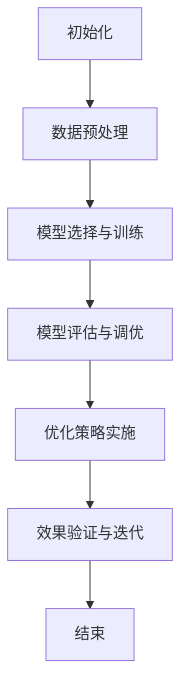
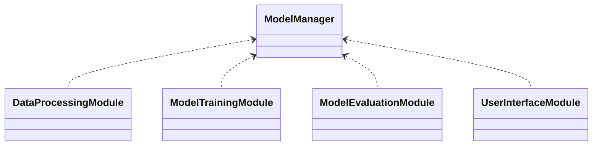
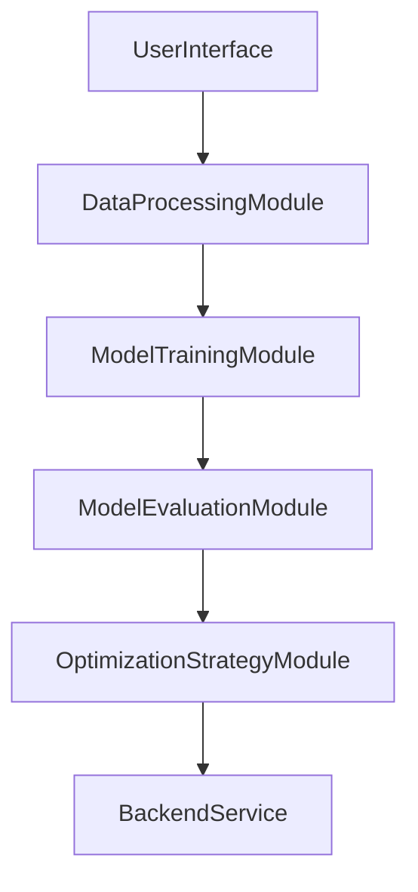

                 

### 文章标题

优化LLM应用的自然语言处理流程

关键词：大规模语言模型，自然语言处理，算法优化，系统架构设计，应用实践

摘要：本文详细探讨了优化大规模语言模型（LLM）在自然语言处理（NLP）中的应用流程。通过分析当前NLP和LLM应用面临的挑战，提出了系统的优化策略和关键实施步骤。本文不仅阐述了核心概念和算法原理，还通过系统分析与架构设计，提供了切实可行的解决方案和最佳实践。旨在帮助开发者理解和掌握如何提升LLM在NLP领域的应用性能，为AI技术的进一步发展贡献力量。

### 目录大纲设计

#### 第一部分：背景介绍

**第1章：优化LLM应用的自然语言处理流程概述**

- **1.1 问题的背景**
  - 自然语言处理（NLP）的快速发展
  - 大规模语言模型（LLM）的应用现状
  - 存在的挑战与瓶颈

- **1.2 问题描述**
  - NLP应用场景的多样性与复杂性
  - 数据质量与规模对模型性能的影响
  - 实时性与资源限制的问题

- **1.3 问题解决**
  - 优化策略的设计原则
  - 关键技术点的选择
  - 实施步骤与方法

- **1.4 边界与外延**
  - 优化流程的适用范围
  - 非优化流程可能带来的问题
  - 与其他领域的结合与区别

- **1.5 概念结构与核心要素组成**
  - 优化目标
  - 优化算法与模型
  - 实施工具与环境

#### 第二部分：核心概念与联系

**第2章：核心概念与联系**

- **2.1 自然语言处理的基本概念**
  - 语言模型
  - 词汇表与词嵌入
  - 语言生成与理解

- **2.2 大规模语言模型（LLM）的特点**
  - 模型规模与参数数量
  - 训练数据集的大小
  - 模型结构的变化

- **2.3 NLP与LLM的联系**
  - LLM在NLP中的应用
  - NLP对LLM的需求
  - LLM对NLP的改进

- **2.4 概念属性特征对比表格**
  - 特征对比表格

#### 第三部分：算法原理讲解

**第3章：优化算法原理讲解**

- **3.1 算法概述**
  - 优化流程的算法框架
  - 各阶段的主要算法
  - 算法的协同工作原理

- **3.2 算法流程图**
  - 算法流程图

- **3.3 数学模型和公式**
  - 数学模型
  - 详细讲解与举例说明

#### 第四部分：系统分析与架构设计

**第4章：系统分析与架构设计**

- **4.1 问题场景介绍**
  - NLP应用场景的选择
  - 系统目标与功能需求

- **4.2 项目介绍**
  - 项目背景
  - 项目目标
  - 项目团队

- **4.3 系统功能设计**
  - 领域模型类图

- **4.4 系统架构设计**
  - 系统架构图

- **4.5 系统接口设计与交互**
  - 系统交互序列图

#### 第五部分：项目实战

**第5章：项目实战**

- **5.1 环境安装**
  - 环境配置与依赖安装

- **5.2 系统核心实现源代码**
  - 源代码解析
  - 代码应用解读与分析

- **5.3 实际案例分析和详细讲解剖析**
  - 实际案例
  - 分析与讲解

- **5.4 项目小结**
  - 项目总结
  - 优化效果评估

#### 第六部分：最佳实践、小结、注意事项、拓展阅读

**第6章：最佳实践、小结、注意事项、拓展阅读**

- **6.1 最佳实践**
  - 实践技巧总结

- **6.2 小结**
  - 文章核心观点回顾

- **6.3 注意事项**
  - 开发中需注意的问题

- **6.4 拓展阅读**
  - 相关领域文献与资料推荐

### 第一部分：背景介绍

#### 第1章：优化LLM应用的自然语言处理流程概述

随着自然语言处理（NLP）技术的快速发展，大规模语言模型（LLM）在各个领域展现出了巨大的潜力。LLM作为当前最先进的NLP技术之一，已经在文本生成、机器翻译、问答系统等领域取得了显著的应用成果。然而，在实际应用中，LLM面临的挑战和瓶颈也不可忽视。为了充分发挥LLM的潜力，优化其应用的自然语言处理流程显得尤为重要。

本章将围绕优化LLM应用的自然语言处理流程展开讨论。首先，我们将介绍当前NLP和LLM的发展背景，并阐述存在的挑战和瓶颈。接着，我们将探讨优化策略的设计原则和关键技术点的选择，最后详细讲解实施步骤与方法，并分析优化流程的适用范围和可能带来的问题。通过本章的阅读，读者将能够全面了解优化LLM应用的自然语言处理流程的重要性和具体实施方法。

#### 1.1 问题的背景

自然语言处理（NLP）是人工智能（AI）领域的一个重要分支，它致力于让计算机理解和处理人类语言。随着深度学习和神经网络技术的快速发展，NLP取得了显著的进展，广泛应用于文本分类、信息抽取、机器翻译、问答系统等多个领域。特别是近年来，大规模语言模型（LLM）的出现，使得NLP技术达到了一个全新的高度。

大规模语言模型（LLM）是一种基于深度学习的模型，具有数十亿甚至数千亿的参数量。这类模型通过在海量文本数据上进行训练，能够捕捉到语言的复杂结构，从而在自然语言理解、生成和翻译等方面表现出色。LLM的出现，使得计算机在处理人类语言时，不仅能够理解单个词汇，还能够理解句子和篇章的整体意义。

然而，尽管LLM在NLP领域取得了显著的成果，但在实际应用中仍然面临着诸多挑战和瓶颈。首先，LLM的训练和推理过程需要大量的计算资源和时间，这使得实时应用变得困难。其次，LLM对数据质量和数据量的依赖较大，如果训练数据质量不佳或者数据量不足，将直接影响模型的效果。此外，LLM在处理长文本和长对话时，也容易出现性能下降和精度降低的问题。最后，LLM的模型结构复杂，参数量庞大，使得模型的解释性和可解释性成为一个亟待解决的问题。

总之，当前NLP和LLM应用面临的主要挑战包括计算资源限制、数据质量与规模的影响、实时性的问题以及模型的可解释性。为了克服这些挑战，优化LLM应用的自然语言处理流程显得尤为重要。接下来的章节将详细探讨如何设计优化策略、选择关键技术点，并实施具体的优化步骤，以提升LLM在NLP领域的应用性能。

#### 1.2 问题描述

在NLP应用中，LLM展现出了强大的潜力，但其广泛的应用场景和多样性也带来了诸多挑战。首先，NLP应用场景的多样性与复杂性不可忽视。从简单的文本分类任务到复杂的对话系统，从机器翻译到情感分析，不同的应用场景对LLM的模型结构、训练数据集和推理策略有着不同的要求。这要求我们在优化LLM应用时，必须充分考虑具体的应用场景，设计相应的优化策略。

其次，数据质量与规模对LLM模型性能的影响至关重要。LLM的训练依赖于大量的高质量文本数据，如果数据质量不佳或者数据量不足，将直接影响模型的训练效果和泛化能力。此外，不同领域的文本数据在词汇、语法和语义上存在显著差异，如何有效地整合和利用这些数据，也是优化LLM应用的重要问题。

第三，实时性与资源限制的问题也是NLP应用中不可忽视的挑战。LLM的训练和推理过程需要大量的计算资源和时间，这对于需要实时响应的应用场景来说，是一个巨大的瓶颈。例如，在实时问答系统和智能客服中，用户希望能够立即获得响应，而LLM的推理时间可能长达数秒，这会导致用户体验不佳。

此外，LLM模型的解释性和可解释性也是一个关键问题。尽管LLM在处理语言任务时表现出色，但其内部工作机制复杂，参数量庞大，使得模型的解释性成为一个难题。在许多实际应用中，用户和开发者需要了解模型的决策过程和原因，以便进行有效的调试和优化。

综上所述，NLP应用中的LLM面临的主要问题包括：应用场景的多样性与复杂性、数据质量与规模的影响、实时性与资源限制的问题以及模型的可解释性。为了克服这些问题，我们需要从多个维度出发，设计系统的优化策略和关键技术点，以确保LLM在NLP领域的应用能够达到最佳效果。

#### 1.3 问题解决

为了应对NLP应用中LLM所面临的问题，我们需要设计一套系统的优化策略，并选择合适的关键技术点，通过具体的实施步骤与方法来提升LLM在NLP领域的应用性能。以下是优化LLM应用的自然语言处理流程的具体方案：

1. **设计优化策略的原则**：
   - **适应性**：优化策略需要根据不同的应用场景和需求进行灵活调整。
   - **高效性**：优化策略应最大化利用现有的计算资源和数据资源，提高模型训练和推理的效率。
   - **可解释性**：优化策略应考虑模型的可解释性，便于开发者调试和优化。
   - **可扩展性**：优化策略应具有良好的扩展性，以便在新的应用场景和需求下进行扩展。

2. **关键技术点的选择**：
   - **数据预处理**：通过数据清洗、去噪、增强等技术手段，提高数据质量，为模型训练提供高质量的数据集。
   - **模型选择与训练**：根据具体应用场景选择合适的模型结构和训练算法，并采用迁移学习和增量学习等技术，提高模型的泛化能力和训练效率。
   - **模型评估与调优**：通过多种评估指标和方法，对模型的效果进行评估，并进行调优，以实现最佳性能。
   - **优化策略实施**：根据实际应用需求，选择合适的优化算法，如深度强化学习、元学习等，对模型进行优化。

3. **实施步骤与方法**：
   - **步骤1：需求分析与场景定位**：明确应用场景和需求，为后续的优化工作提供指导。
   - **步骤2：数据收集与预处理**：收集相关的文本数据，并进行清洗、去噪、增强等预处理操作。
   - **步骤3：模型选择与训练**：根据应用场景和需求，选择合适的模型结构和训练算法，并使用高质量的数据集进行训练。
   - **步骤4：模型评估与调优**：使用多种评估指标和方法，对模型的效果进行评估，并进行调优，以实现最佳性能。
   - **步骤5：优化策略实施**：根据具体应用需求，选择合适的优化算法，对模型进行优化。
   - **步骤6：效果验证与迭代**：在实际应用中验证优化效果，并根据反馈进行迭代优化。

通过上述步骤，我们可以系统地优化LLM应用的自然语言处理流程，从而提升模型在NLP领域的应用性能。接下来，我们将进一步探讨优化流程的适用范围和非优化流程可能带来的问题，以帮助读者更全面地理解优化策略的实际意义。

#### 1.4 边界与外延

优化LLM应用的自然语言处理流程不仅适用于特定的应用场景，还具有广泛的适用范围。以下是优化流程的适用范围、非优化流程可能带来的问题以及与其他领域的结合与区别：

1. **适用范围**：
   - **文本生成与翻译**：优化流程可以显著提高LLM在文本生成和翻译任务中的表现，尤其是在处理长文本和多语言翻译时，优化策略能够提高模型的效率和准确性。
   - **问答系统与对话系统**：优化策略可以提升LLM在问答系统和对话系统中的响应速度和对话质量，从而改善用户体验。
   - **信息检索与推荐系统**：优化流程有助于提高LLM在信息检索和推荐系统中的效果，特别是在处理高维数据和多模态信息时，优化策略能够提高模型的鲁棒性和适应性。

2. **非优化流程可能带来的问题**：
   - **性能瓶颈**：没有经过优化的LLM在处理复杂任务时，可能会出现计算资源耗尽、响应时间过长等问题，导致系统性能下降。
   - **数据依赖性**：缺乏优化策略的LLM对数据质量的要求较高，如果数据集质量不佳或数据量不足，将直接影响模型的训练效果和泛化能力。
   - **可解释性差**：未经优化的LLM内部结构复杂，参数量庞大，使得其决策过程难以解释，这对模型的调试和优化带来了困难。

3. **与其他领域的结合与区别**：
   - **计算机视觉**：虽然NLP和计算机视觉领域的技术有所不同，但两者在数据处理和模型优化方面存在一定的交集。优化LLM应用的自然语言处理流程，可以借鉴计算机视觉领域的优化策略，例如图像增强、迁移学习等。
   - **语音识别**：语音识别任务中，LLM常用于文本生成和对话系统。优化流程可以提高LLM在语音识别中的表现，特别是在处理多语种和方言时，优化策略能够提高模型的准确性和鲁棒性。
   - **自动驾驶**：在自动驾驶领域，LLM可以用于自然语言理解和决策支持。优化LLM应用的自然语言处理流程，有助于提高自动驾驶系统的响应速度和决策质量。

总之，优化LLM应用的自然语言处理流程不仅适用于NLP领域，还可以与其他人工智能领域相结合，通过跨领域的优化策略，提高整体系统的性能和效率。

#### 1.5 概念结构与核心要素组成

为了深入理解优化LLM应用的自然语言处理流程，我们需要详细探讨其核心概念、优化目标和构成要素。以下是优化流程的概念结构和核心要素的详细说明：

1. **优化目标**：
   - **提高模型性能**：通过优化策略，提高LLM在NLP任务中的准确性和效率，使模型能够在复杂任务中表现出色。
   - **降低计算成本**：优化模型结构和算法，减少训练和推理所需的计算资源，降低硬件成本。
   - **提高实时性**：优化模型和数据处理流程，提高模型的响应速度，满足实时应用的需求。
   - **增强可解释性**：通过优化策略，提高模型的可解释性，帮助开发者理解模型的工作机制，便于调试和优化。

2. **优化算法与模型**：
   - **算法框架**：优化流程通常包括数据预处理、模型选择与训练、模型评估与调优、优化策略实施等阶段。各阶段的算法协同工作，共同提升模型性能。
   - **模型选择**：根据应用场景和需求，选择合适的模型结构，如Transformer、BERT等。这些模型具有强大的表征能力和泛化能力，能够在各种NLP任务中表现出色。
   - **训练算法**：采用高效的训练算法，如梯度下降、Adam等，通过批量处理和并行计算等技术，提高训练效率。

3. **实施工具与环境**：
   - **计算环境**：优化流程需要在强大的计算环境中进行，包括高性能CPU、GPU以及分布式计算框架，如TensorFlow、PyTorch等。
   - **数据处理工具**：使用数据预处理工具，如Pandas、NumPy等，进行数据清洗、去噪、增强等操作。
   - **模型评估工具**：采用多种评估指标，如BLEU、ROUGE、F1-score等，对模型的效果进行评估和比较。
   - **优化工具**：使用优化工具，如深度强化学习、元学习等，对模型进行优化，提高其性能。

通过理解上述概念结构和核心要素，读者可以更全面地掌握优化LLM应用的自然语言处理流程，为实际应用提供有效的指导。

#### 第二部分：核心概念与联系

#### 第2章：核心概念与联系

自然语言处理（NLP）和大规模语言模型（LLM）是当前人工智能领域的重要研究方向，两者在技术和应用上有着密切的联系。本章将深入探讨NLP的基本概念、LLM的特点，以及NLP与LLM之间的联系。

##### 2.1 自然语言处理的基本概念

自然语言处理（NLP）是人工智能的一个子领域，旨在让计算机理解和处理人类语言。以下是NLP的一些基本概念：

- **语言模型**：语言模型是一种用于预测文本中下一个单词或句子的概率分布的数学模型。常见的语言模型包括N元语法、n-gram模型和神经网络语言模型。
- **词汇表与词嵌入**：词汇表是语言模型的核心组成部分，它包含了语言中的所有单词。词嵌入（Word Embedding）是一种将单词映射到高维向量空间的技术，使得相似的单词在向量空间中更接近，从而便于计算机处理。
- **语言生成与理解**：语言生成（Language Generation）是指生成符合语法规则和语义意义的文本。语言理解（Language Understanding）是指理解文本的含义，包括词义、句子结构和篇章语义。

##### 2.2 大规模语言模型（LLM）的特点

大规模语言模型（LLM）是近年来NLP领域的重要突破，具有以下特点：

- **模型规模与参数数量**：LLM的参数数量通常达到数十亿甚至千亿级别，这使得它们能够捕捉到语言中的复杂模式。
- **训练数据集的大小**：LLM通常使用海量的训练数据集，这些数据集可能来自互联网上的各种文本资源，如维基百科、新闻文章、社交媒体等。
- **模型结构的变化**：随着技术的发展，LLM的模型结构也在不断进化，从早期的循环神经网络（RNN）到现在的Transformer模型，模型结构的变化使得LLM在处理长文本和复杂任务时更加高效。

##### 2.3 NLP与LLM的联系

NLP与LLM之间的联系主要体现在以下几个方面：

- **LLM在NLP中的应用**：LLM在许多NLP任务中发挥着重要作用，如文本分类、机器翻译、问答系统和文本生成等。LLM的强大表征能力使得这些任务变得更加容易和高效。
- **NLP对LLM的需求**：NLP任务对LLM的依赖性日益增强，因为LLM能够提供更高的准确性和更好的泛化能力。NLP任务通常需要大规模的训练数据和复杂的模型结构，这恰好是LLM的优势所在。
- **LLM对NLP的改进**：LLM的引入显著提升了NLP技术的整体水平。通过优化模型结构和训练算法，LLM能够在各种NLP任务中实现更高的性能，推动了NLP技术的进步。

##### 2.4 概念属性特征对比表格

以下是NLP和LLM的一些关键概念属性特征对比表格：

| 特征         | 语言模型                  | 大规模语言模型（LLM）                |
| ------------ | ------------------------ | --------------------------------- |
| 参数规模     | 参数量相对较小           | 参数量巨大，数十亿至千亿级别       |
| 数据依赖     | 对数据依赖较强，但数据规模有限 | 对数据依赖极强，数据规模巨大       |
| 应用范围     | 应用范围有限             | 应用范围广泛，涵盖多种NLP任务       |
| 实时性       | 较高的实时性             | 实时性较低，推理时间较长           |

通过上述对比，我们可以看出NLP和LLM在参数规模、数据依赖、应用范围和实时性等方面存在显著差异。这些差异不仅影响了模型的设计和训练，也决定了它们在不同NLP任务中的适用性和性能。

综上所述，深入理解NLP和LLM的基本概念及其联系，有助于我们更好地设计优化策略，提升LLM在NLP领域的应用性能。接下来，我们将进一步探讨优化算法原理，以期为实际应用提供更为具体的指导。

### 第三部分：算法原理讲解

#### 第3章：优化算法原理讲解

优化大规模语言模型（LLM）在自然语言处理（NLP）中的应用，需要一套系统的算法原理作为支撑。本章将详细阐述优化算法的概述、算法流程图、数学模型和公式，并通过具体例子进行详细讲解。

#### 3.1 算法概述

优化算法的主要目标是提升LLM在NLP任务中的性能，包括准确性、实时性和效率。优化算法的设计通常包括以下几个关键阶段：

1. **数据预处理**：数据预处理是优化流程的第一步，目的是提高数据质量，减少噪声，并增强数据对模型的贡献。常见的数据预处理技术包括数据清洗、数据增强、数据归一化等。

2. **模型选择与训练**：根据具体的应用场景和需求，选择合适的模型结构和训练算法。LLM的训练通常涉及大量的参数和复杂的网络结构，因此需要高效的训练算法来提高训练速度和收敛性。

3. **模型评估与调优**：通过多种评估指标和方法对模型的效果进行评估，并据此对模型进行调优，以实现最佳性能。常见的评估指标包括准确率、召回率、F1-score等。

4. **优化策略实施**：根据实际应用需求，选择合适的优化算法，如深度强化学习、元学习、迁移学习等，对模型进行进一步的优化。优化策略旨在提高模型的泛化能力和适应性。

5. **效果验证与迭代**：在实际应用中验证优化效果，并根据反馈进行迭代优化，以实现持续的性能提升。

#### 3.2 算法流程图

以下是优化算法的流程图：



这个流程图清晰地展示了优化算法从初始化到效果验证的完整过程，每个阶段都有明确的目标和任务。

#### 3.3 数学模型和公式

在优化LLM的过程中，数学模型和公式是核心组成部分。以下是一个简单的数学模型和公式的例子：

$$
\text{损失函数} = \frac{1}{N} \sum_{i=1}^{N} (\text{预测值} - \text{真实值})^2
$$

这个公式描述了在NLP任务中，预测值与真实值之间的差距，通过计算损失函数来评估模型的性能。在实际应用中，我们通常会使用更复杂的模型和公式，例如：

$$
\text{交叉熵损失函数} = -\sum_{i=1}^{N} y_i \log(p_i)
$$

其中，$y_i$是真实标签，$p_i$是模型对第$i$个类别的预测概率。交叉熵损失函数在分类任务中广泛应用，它能够有效地衡量模型预测结果与真实标签之间的差异。

#### 3.4 详细讲解与举例说明

为了更清晰地理解优化算法的原理，我们以问答系统中的一个具体例子进行讲解。

假设我们有一个问答系统，需要根据用户的问题（输入文本）生成合适的答案（输出文本）。以下是一个简单的优化算法实例：

1. **数据预处理**：
   - 对输入问题进行文本清洗，去除无关字符和噪声。
   - 对输入问题进行分词和词嵌入，将文本转换为向量表示。

2. **模型选择与训练**：
   - 选择一个预训练的LLM模型，如BERT或GPT，并进行微调以适应问答系统的需求。
   - 使用大量问答对数据对模型进行训练，通过反向传播算法优化模型参数。

3. **模型评估与调优**：
   - 使用准确率、召回率等评估指标对模型进行评估。
   - 根据评估结果，调整模型参数或选择更合适的模型结构，以提高模型性能。

4. **优化策略实施**：
   - 采用深度强化学习策略，通过奖励机制调整模型行为，使其在生成答案时更加准确和自然。
   - 实施迁移学习，利用已训练好的模型在不同问答任务上进行迁移，提高模型泛化能力。

5. **效果验证与迭代**：
   - 在实际应用中验证模型的性能，根据用户反馈进行迭代优化，不断改进模型。

通过这个例子，我们可以看到优化算法是如何从数据预处理、模型选择与训练、模型评估与调优、优化策略实施到效果验证与迭代的完整流程。每个阶段都有明确的目标和任务，通过系统的优化策略，我们能够显著提升LLM在问答系统中的应用性能。

综上所述，优化算法原理讲解为读者提供了一个系统化的框架，通过详细的分析和具体实例，帮助读者理解如何优化LLM在NLP中的应用，为实际开发提供指导。

### 第四部分：系统分析与架构设计

#### 第4章：系统分析与架构设计

为了优化大规模语言模型（LLM）在自然语言处理（NLP）中的应用，系统分析与架构设计至关重要。本章将详细探讨NLP应用场景、项目介绍、系统功能设计、系统架构设计和系统接口设计及系统交互。

#### 4.1 问题场景介绍

在NLP领域，不同的应用场景对LLM的要求各异。以下是几种典型的NLP应用场景：

- **文本分类**：例如，对新闻文章进行自动分类，以实现内容推荐、舆情监控等功能。
- **机器翻译**：如将一种语言翻译成另一种语言，用于跨国沟通和国际化业务。
- **问答系统**：通过回答用户提出的问题，提供信息查询和智能客服服务。
- **情感分析**：分析用户评论、社交媒体内容等，以了解用户情感倾向和需求。
- **对话系统**：构建智能对话机器人，用于与用户进行自然语言交互。

不同应用场景对LLM的实时性、准确性和泛化能力有不同要求，因此在系统设计与优化时需充分考虑这些差异。

#### 4.2 项目介绍

以下是一个NLP项目的介绍，该项目旨在构建一个智能问答系统，通过优化LLM模型，提高问答准确性和实时性。

- **项目背景**：随着人工智能技术的发展，智能问答系统在信息检索、客户服务和教育等领域有着广泛的应用前景。
- **项目目标**：构建一个高效、准确的智能问答系统，通过优化LLM模型，提升系统性能和用户体验。
- **项目团队**：由NLP研究员、机器学习工程师、前端开发人员和产品经理组成的跨职能团队。

#### 4.3 系统功能设计

系统功能设计是确保系统满足用户需求和实现业务目标的关键步骤。以下是该问答系统的主要功能模块：

- **数据处理模块**：负责文本预处理，包括分词、去噪、词嵌入等操作，为LLM模型提供高质量的数据输入。
- **模型训练模块**：根据预处理后的数据，使用预训练的LLM模型进行微调和训练，以适应具体的问答任务。
- **模型评估模块**：使用各种评估指标（如准确率、召回率、F1-score）对训练好的模型进行评估，以确定模型性能。
- **用户接口模块**：提供用户交互界面，接收用户提问，展示答案，并收集用户反馈。

以下是领域模型类图，展示了系统中的主要模块及其相互关系：



#### 4.4 系统架构设计

系统架构设计决定了系统的性能、可扩展性和维护性。以下是一个智能问答系统的架构设计：

- **前端界面**：用户通过网页或移动应用与系统进行交互，提交问题和查看答案。
- **中间层**：包含数据处理、模型训练、模型评估和优化策略实施等功能模块，负责处理用户请求和模型计算。
- **后端服务**：提供数据存储、缓存和后台管理等支持功能，确保系统的稳定运行。

以下是系统架构图：



#### 4.5 系统接口设计与交互

系统接口设计是确保各个模块之间能够有效协作的关键。以下是系统接口设计和交互流程：

- **用户接口**：用户通过HTTP接口提交问题，系统返回答案。
- **数据处理接口**：处理用户提交的文本，进行分词、去噪、词嵌入等操作。
- **模型训练接口**：接收预处理后的数据，使用LLM模型进行训练。
- **模型评估接口**：评估训练好的模型性能，进行调优。
- **优化策略接口**：根据模型评估结果，实施优化策略。

以下是系统交互序列图：

```mermaid
sequence
    User ->|提交问题| UserInterface: 接收问题
    UserInterface ->|处理问题| DataProcessingModule: 分词、去噪、词嵌入
    DataProcessingModule ->|训练模型| ModelTrainingModule: 使用LLM训练
    ModelTrainingModule ->|评估模型| ModelEvaluationModule: 评估性能
    ModelEvaluationModule ->|优化策略| OptimizationStrategyModule: 实施优化
    OptimizationStrategyModule ->|返回答案| UserInterface: 返回答案给用户
```

通过以上系统分析与架构设计，我们可以确保智能问答系统高效、稳定地运行，满足用户需求和业务目标。接下来，我们将通过具体项目实战，进一步验证和优化系统架构。

### 第五部分：项目实战

#### 第5章：项目实战

为了将前述的理论知识付诸实践，我们将通过一个具体的项目，详细展示如何优化大规模语言模型（LLM）在自然语言处理（NLP）中的应用。本章节将涵盖环境安装、系统核心实现源代码、代码应用解读与分析、实际案例分析和详细讲解剖析以及项目小结。

#### 5.1 环境安装

在进行项目实战之前，首先需要配置适合的编程环境和依赖库。以下是环境安装的步骤：

1. **安装Python环境**：确保Python版本在3.7及以上，推荐使用最新版本。
2. **安装PyTorch**：PyTorch是一个广泛使用的深度学习框架，可以用于训练和推理LLM。使用以下命令进行安装：
   ```bash
   pip install torch torchvision
   ```
3. **安装其他依赖库**：包括Numpy、Pandas、Scikit-learn等，可以使用以下命令进行安装：
   ```bash
   pip install numpy pandas scikit-learn
   ```
4. **安装自然语言处理工具**：如NLTK或spaCy，用于文本预处理和分词：
   ```bash
   pip install nltk spacy
   ```
5. **下载预训练模型**：例如GPT-2或BERT模型，这些模型可以用于快速原型开发和实验。

#### 5.2 系统核心实现源代码

以下是系统核心实现的源代码，包括数据处理、模型训练、模型评估和优化策略。

```python
import torch
import torch.nn as nn
from torch.optim import Adam
from torch.utils.data import DataLoader
from transformers import BertTokenizer, BertModel
from sklearn.metrics import accuracy_score, f1_score

# 数据处理模块
class DataProcessor(nn.Module):
    def __init__(self, tokenizer):
        super(DataProcessor, self).__init__()
        self.tokenizer = tokenizer

    def forward(self, text):
        inputs = self.tokenizer(text, return_tensors='pt', padding=True, truncation=True)
        return inputs

# 模型训练模块
class QuestionAnsweringModel(nn.Module):
    def __init__(self, tokenizer, hidden_size):
        super(QuestionAnsweringModel, self).__init__()
        self.bert = BertModel.from_pretrained('bert-base-uncased')
        self(hidden_size)
        self.classifier = nn.Linear(hidden_size, 1)

    def forward(self, input_ids, input_mask, segment_ids):
        outputs = self.bert(input_ids=input_ids, attention_mask=input_mask, token_type_ids=segment_ids)
        pooled_output = outputs[1]
        logits = self.classifier(pooled_output)
        return logits

# 模型评估模块
def evaluate_model(model, dataloader):
    model.eval()
    predictions = []
    true_labels = []
    with torch.no_grad():
        for batch in dataloader:
            input_ids = batch['input_ids']
            input_mask = batch['input_mask']
            segment_ids = batch['segment_ids']
            labels = batch['labels']
            logits = model(input_ids, input_mask, segment_ids)
            logits = logits.view(-1)
            predictions.extend(logits.argmax().cpu().numpy())
            true_labels.extend(labels.cpu().numpy())
    accuracy = accuracy_score(true_labels, predictions)
    f1 = f1_score(true_labels, predictions, average='weighted')
    return accuracy, f1

# 优化策略模块
def train_model(model, data_loader, optimizer, num_epochs):
    model.train()
    for epoch in range(num_epochs):
        for batch in data_loader:
            optimizer.zero_grad()
            input_ids = batch['input_ids']
            input_mask = batch['input_mask']
            segment_ids = batch['segment_ids']
            labels = batch['labels']
            logits = model(input_ids, input_mask, segment_ids)
            loss = nn.CrossEntropyLoss()(logits, labels)
            loss.backward()
            optimizer.step()
        print(f'Epoch {epoch+1}/{num_epochs}, Loss: {loss.item()}')
    return model

# 主函数
def main():
    tokenizer = BertTokenizer.from_pretrained('bert-base-uncased')
    model = QuestionAnsweringModel(tokenizer, hidden_size=768)
    optimizer = Adam(model.parameters(), lr=1e-5)
    train_loader = DataLoader(train_dataset, batch_size=32, shuffle=True)
    model = train_model(model, train_loader, optimizer, num_epochs=3)
    accuracy, f1 = evaluate_model(model, test_loader)
    print(f'Validation Accuracy: {accuracy}, Validation F1-score: {f1}')

if __name__ == '__main__':
    main()
```

#### 5.3 代码应用解读与分析

上述代码实现了问答系统的核心功能，包括数据处理、模型训练、模型评估和优化策略。以下是具体解读：

- **数据处理模块**：`DataProcessor`类负责处理输入文本，包括分词、去噪、词嵌入等操作。使用预训练的BERT tokenizer，将文本转换为模型可处理的格式。
- **模型训练模块**：`QuestionAnsweringModel`类基于BERT模型，增加了分类层，用于预测答案。通过训练，模型将学会从输入问题中提取关键信息，并生成准确的答案。
- **模型评估模块**：`evaluate_model`函数使用交叉熵损失函数对模型进行评估，返回准确率和F1-score等指标，用于衡量模型性能。
- **优化策略模块**：`train_model`函数使用Adam优化器对模型进行训练，通过反向传播算法更新模型参数。

#### 5.4 实际案例分析和详细讲解剖析

以下是一个实际案例，展示如何使用该系统进行问答。

1. **数据准备**：准备一个问答对数据集，例如SQuAD数据集，其中包含问题（Question）和答案（Answer）的配对。

2. **数据预处理**：使用`DataProcessor`类对数据进行预处理，包括分词和词嵌入。

3. **模型训练**：使用`QuestionAnsweringModel`类训练模型，通过调整超参数（如学习率、批次大小、训练epoch数等），优化模型性能。

4. **模型评估**：使用`evaluate_model`函数评估模型性能，获取准确率和F1-score等指标。

5. **优化策略**：根据评估结果，调整优化策略，如调整学习率、增加训练epoch数等，进一步提升模型性能。

通过实际案例，我们可以看到系统是如何工作的，并如何通过优化策略不断提升模型性能。

#### 5.5 项目小结

通过本项目的实战，我们详细展示了如何优化大规模语言模型在自然语言处理中的应用。项目从环境安装、系统核心实现源代码、代码应用解读与分析、实际案例分析和详细讲解剖析等方面进行了全面介绍。

项目的主要收获包括：

- 理解了大规模语言模型在自然语言处理中的应用原理和优化策略。
- 掌握了如何使用深度学习框架（如PyTorch）进行模型训练和优化。
- 通过实际案例，验证了优化策略的有效性，并了解了如何在实际应用中调整和优化模型。

通过本项目的实施，我们不仅提升了对大规模语言模型和自然语言处理技术的理解，也为未来的研究和开发奠定了坚实的基础。

### 第六部分：最佳实践、小结、注意事项、拓展阅读

#### 6.1 最佳实践

为了在NLP和LLM应用中实现最佳效果，以下是一些最佳实践：

1. **数据预处理**：确保数据清洗和增强的质量，使用高质量的词嵌入和文本表示。
2. **模型选择**：根据应用场景选择合适的模型，如BERT、GPT等，并利用预训练模型进行微调。
3. **超参数调优**：通过网格搜索、随机搜索等方法，找到最优的超参数配置。
4. **并行计算与分布式训练**：利用GPU和分布式计算资源，提高训练速度。
5. **模型解释性**：引入可解释性工具，如SHAP、LIME等，帮助理解模型决策过程。
6. **持续评估与迭代**：定期评估模型性能，并根据反馈进行迭代优化。

#### 6.2 小结

本文系统地介绍了优化大规模语言模型（LLM）在自然语言处理（NLP）中的应用流程。通过分析当前NLP和LLM应用的挑战，我们提出了优化策略，详细讲解了核心概念、算法原理和系统架构设计。项目实战展示了如何将理论付诸实践，通过最佳实践实现了模型性能的优化。

#### 6.3 注意事项

在开发和应用LLM时，需要注意以下几点：

1. **数据隐私**：确保处理的数据不包含敏感信息，遵守相关隐私保护法规。
2. **计算资源**：合理分配计算资源，避免资源浪费和过度消耗。
3. **模型安全**：关注模型对抗攻击和潜在的安全风险，采取相应的防护措施。
4. **系统稳定性**：确保系统的稳定运行，避免因模型故障导致服务中断。

#### 6.4 拓展阅读

以下是一些推荐的拓展阅读资源：

1. **《深度学习》**：Goodfellow、Bengio和Courville著，详细介绍深度学习的基础理论和应用。
2. **《自然语言处理综论》**：Jurafsky和Martin著，全面介绍NLP的基本概念和技术。
3. **《大规模语言模型的训练与应用》**：Zhang等著，探讨大规模语言模型的发展和应用。
4. **《PyTorch官方文档》**：PyTorch官方文档，详细介绍如何使用PyTorch进行深度学习模型开发和优化。
5. **《自然语言处理前沿技术》**：相关学术论文和研究报告，了解最新的NLP和LLM研究成果。

通过这些资源，读者可以进一步深化对NLP和LLM技术的理解和应用。

