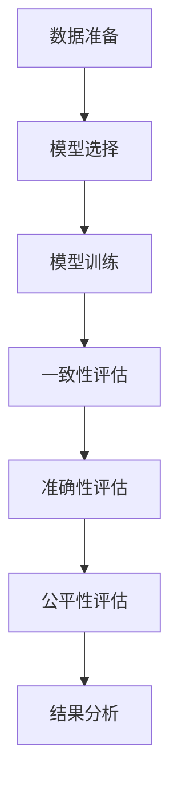
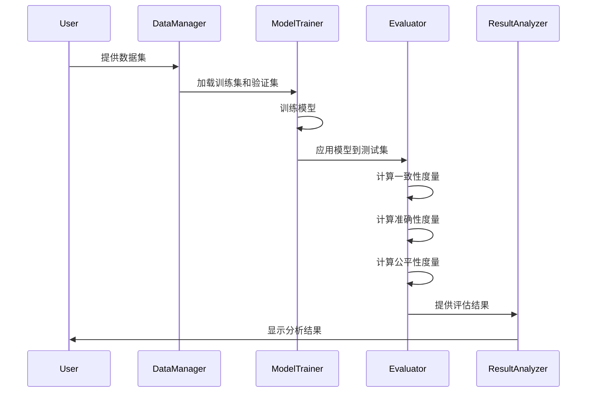
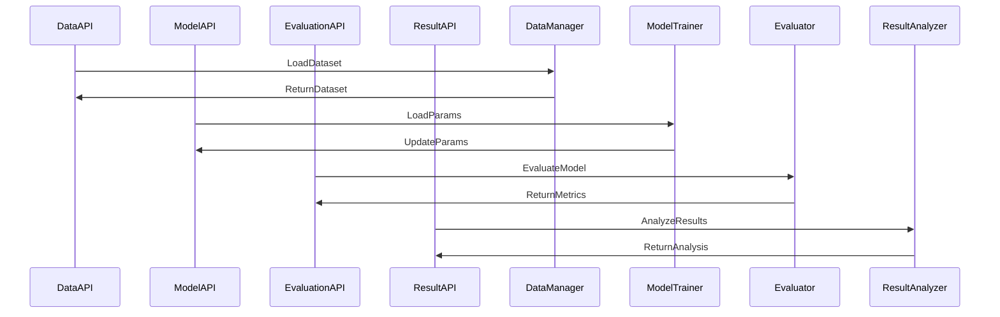
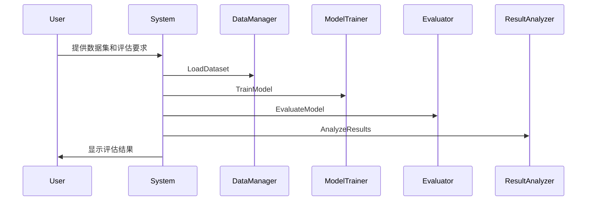
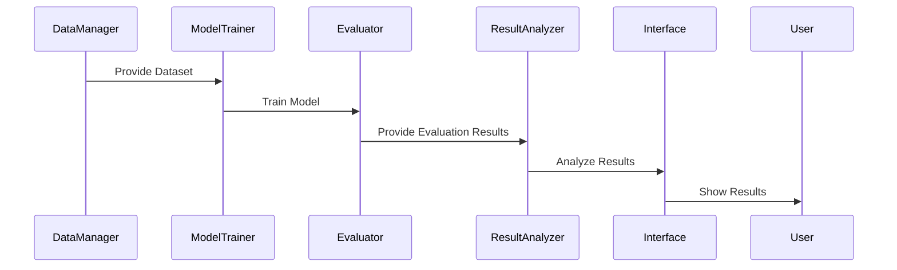
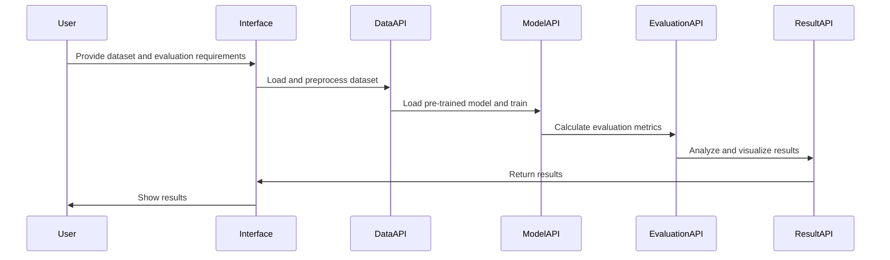
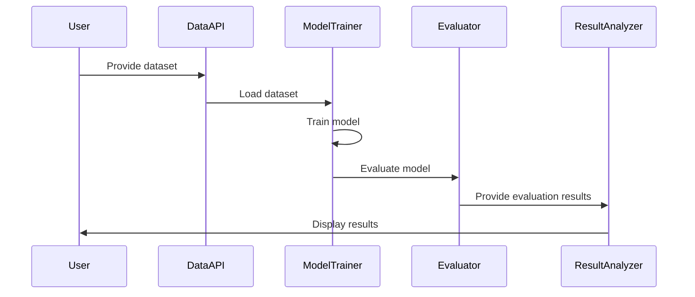

                 

### 1.1 问题背景

随着人工智能技术的迅猛发展，特别是在自然语言处理（NLP）领域，大型语言模型（LLM，Large Language Models）已经展现出卓越的性能。LLM 如 GPT-3、BERT 等，凭借其强大的文本生成和理解能力，广泛应用于文本生成、机器翻译、问答系统等多个领域。然而，随着这些模型在各个行业中的广泛应用，一个关键问题逐渐凸显出来：LLM 在伦理决策问题上的稳定性和可靠性。

伦理决策一致性，指的是在处理道德问题时，模型能够保持一致的决策结果，不因输入数据的微小变化而出现偏颇或极端反应。在现实世界中，伦理决策的一致性至关重要，因为任何偏离伦理标准的决策都可能带来严重的社会后果。例如，自动驾驶汽车在面临“电车难题”时，如何做出一致且道德正确的决策，直接关系到行车的安全性和公正性。

评估 LLM 在道德问题上的稳定性和可靠性，不仅是一个技术问题，更是一个社会问题。对于开发者而言，他们需要确保模型在处理伦理问题时，能够遵循既定的伦理准则和法律法规。而对于用户和公众来说，他们需要信任模型在伦理问题上的决策结果，以保证人工智能技术不会对社会造成负面影响。

当前，关于 LLM 伦理决策一致性的研究还处于初级阶段。虽然已有一些初步的研究尝试，但仍然缺乏系统的理论框架和有效的评估方法。本文旨在探讨评估 LLM 伦理决策一致性的方法，通过逐步分析推理，提出一种可行的评估框架，并对其进行实际应用和案例分析。

在接下来的章节中，我们将首先介绍伦理决策一致性的核心概念，然后详细讨论 LLM 的基本原理与应用，接着深入讲解评估 LLM 伦理决策一致性的方法，包括数学模型、算法流程和系统架构设计。最后，我们将通过一个实际项目来展示如何应用这些方法进行评估，并提供一些最佳实践和小结，以期为相关领域的研究者和开发者提供参考和指导。

### 1.2 伦理决策一致性的概念解析

伦理决策一致性是指在面对伦理问题时，决策模型能够保持一致的决策结果，不因输入数据的微小变化而出现偏差或异常反应。在人工智能领域，特别是在大型语言模型（LLM）的应用中，伦理决策一致性显得尤为重要。因为 LLM 广泛应用于自动驾驶、医疗诊断、法律咨询等关键领域，这些领域的决策往往直接关系到人的生命安全和权益保障。因此，确保 LLM 在伦理问题上的决策一致性，不仅是一个技术挑战，更是社会和伦理层面的要求。

**伦理决策一致性的核心概念可以从以下几个方面进行解析：**

1. **伦理：** 伦理是指道德规范和价值观体系，它为个体和社会行为提供了道德判断和决策的依据。伦理问题通常涉及正义、公平、公正、责任等核心价值观。例如，自动驾驶汽车在紧急情况下如何选择行动，涉及到生命权和财产权的权衡。

2. **决策：** 决策是指在给定的约束条件下，选择一个最优或次优的行动方案。在人工智能领域，决策通常由算法模型来完成。决策的一致性要求模型在不同情境下能够做出相同或类似的决策。

3. **一致性：** 一致性是指模型在不同条件下保持相同或相似决策结果的能力。在伦理决策中，一致性意味着模型在面对相似的伦理问题时，能够得出一致的决策结论。例如，一个自动驾驶模型在多个不同场景下都应该对行人保持相同的保护态度。

**核心概念的属性特征对比：**

为了更好地理解伦理决策一致性，我们可以将其与一些相关的概念进行对比：

- **稳定性：** 稳定性是指模型在面对外部扰动时能够保持性能的稳定。与稳定性相比，一致性更关注模型在不同条件下的决策结果是否一致，而不仅仅是性能的波动。

- **鲁棒性：** 鲁棒性是指模型对异常数据或噪声的抵抗能力。虽然鲁棒性和一致性都关注模型的决策能力，但鲁棒性更侧重于模型在数据质量不佳情况下的表现，而一致性则更关注模型在不同输入下的决策结果。

- **准确性：** 准确性是指模型输出的决策结果与真实情况相符的程度。准确性是评估模型性能的重要指标，但仅凭准确性无法完全保证伦理决策的一致性。

**ER实体关系图架构：**

为了更直观地理解伦理决策一致性的核心概念，我们可以使用 ER（Entity-Relationship）实体关系图来描述其中的关系。ER 图是一种用于数据库设计的方法，通过实体和关系的定义来描述系统的数据结构。

在伦理决策一致性中，主要的实体包括：

- **伦理问题（Ethical Issues）：** 表示需要模型进行决策的伦理问题。
- **决策模型（Decision Models）：** 表示用于解决伦理问题的模型。
- **输入数据（Input Data）：** 表示模型用于决策的数据。
- **输出结果（Output Results）：** 表示模型的决策结果。

关系包括：

- **决策依赖（Decides）：** 表示模型依赖输入数据进行决策。
- **问题对应（Corresponds）：** 表示伦理问题与决策模型的对应关系。
- **结果评价（Evaluates）：** 表示对决策结果的评估和一致性验证。

下面是一个简化的 ER 实体关系图：

```mermaid
erDiagram
  EthicalIssue ||--|{ DecisionModel }|| DecisionDependency
  DecisionModel ||--|{ InputData }|| DataDependency
  InputData ||--|{ OutputResult }|| ResultDependency
  EthicalIssue ||--|{ OutputResult }|| ResultEvaluation
```

通过这个 ER 图，我们可以清晰地看到伦理决策一致性的核心概念之间的相互关系，以及模型在伦理决策过程中的关键要素。

综上所述，伦理决策一致性是确保 LLM 在道德问题上做出一致且合理决策的重要保障。通过深入理解伦理、决策和一致性等核心概念，我们可以更好地设计评估方法，提高 LLM 在伦理决策问题上的稳定性和可靠性。

### 1.3 大型语言模型（LLM）的基本原理与应用

大型语言模型（LLM，Large Language Models）是近年来自然语言处理（NLP）领域的重要突破，其核心原理是基于深度学习技术，特别是变换器模型（Transformer）。LLM 如 GPT-3、BERT、T5 等，凭借其强大的文本生成和理解能力，在多个应用领域中展现出了卓越的性能。

#### LLM 的基本原理

LLM 的基本原理可以归结为以下几个关键点：

1. **变换器模型（Transformer）**：Transformer 模型是由 Vaswani 等人在 2017 年提出的，其核心思想是使用自注意力机制（Self-Attention）来处理序列数据。与传统循环神经网络（RNN）相比，Transformer 可以并行处理输入序列，大大提高了计算效率。自注意力机制允许模型在生成每个词时，考虑之前所有词的影响，从而实现全局上下文信息的捕捉。

2. **预训练与微调**：LLM 通常采用预训练和微调的方法进行训练。预训练阶段，模型在大量无标签文本数据上进行训练，学习语言的基本规律和特征。微调阶段，模型在特定任务数据上进行训练，进一步优化模型在特定任务上的表现。这种方法使得 LLM 能够在多种任务中表现出色。

3. **多模态输入**：除了文本输入外，LLM 还可以接受图像、声音等其他模态的输入，实现多模态融合。例如，GPT-3 可以接受文本、图像和视频等多模态输入，从而在计算机视觉、语音识别等领域中发挥重要作用。

#### LLM 在各个领域的应用

LLM 的广泛应用主要得益于其强大的文本生成和理解能力。以下是 LLM 在几个关键领域的主要应用：

1. **文本生成**：LLM 在文本生成任务中表现突出，例如文章写作、故事创作、对话生成等。通过输入少量的提示，LLM 能够生成连贯且具有一定创造性的文本。例如，GPT-3 可以根据用户提供的标题生成完整的文章内容。

2. **机器翻译**：LLM 在机器翻译任务中也表现出色，特别是与传统的统计机器翻译和基于神经网络的翻译方法相比。通过在大量双语语料库上进行预训练，LLM 能够学习到语言之间的映射关系，从而实现高质量的翻译。

3. **问答系统**：LLM 在问答系统中被广泛应用，能够根据用户的问题提供详细的回答。例如，BERT 在问答任务中的表现非常出色，经常用于搜索引擎和智能客服系统。

4. **文本分类与情感分析**：LLM 在文本分类和情感分析任务中也展现了强大的能力。通过在标注数据集上进行训练，LLM 能够识别文本的主题和情感倾向，从而用于舆情分析、市场调研等应用。

5. **代码生成**：LLM 在代码生成任务中也取得了显著进展。例如，T5 模型可以接受自然语言描述并生成对应的代码。这在软件工程和编程领域有着广泛的应用前景。

#### LLM 在伦理决策问题中的应用

尽管 LLM 在多个领域展现出了卓越的性能，但在伦理决策问题上，LLM 的应用仍然面临挑战。伦理决策问题通常涉及到复杂的道德判断和价值观冲突，这需要模型具备高度一致性和可靠性的决策能力。

1. **伦理问题识别**：LLM 可以通过文本分析和情感分析，识别出文本中的伦理问题。例如，在新闻报道、法律文书、医疗诊断文本中，LLM 可以提取出涉及伦理判断的关键词和句子。

2. **伦理决策辅助**：LLM 可以作为伦理决策的辅助工具，为决策者提供参考信息和建议。例如，在自动驾驶汽车的伦理决策中，LLM 可以分析事故现场的文本描述，为车辆提供行驶策略。

3. **伦理决策验证**：LLM 可以对决策结果进行验证，确保决策的一致性和合理性。例如，在医疗诊断中，LLM 可以对多个医生的诊断结果进行分析对比，提供更可靠的诊断建议。

总之，LLM 在伦理决策问题中具有巨大的应用潜力，但同时也需要严格评估其在伦理决策一致性上的表现。在接下来的章节中，我们将详细探讨评估 LLM 伦理决策一致性的方法，并提出一种可行的评估框架。

### 2.1 伦理决策一致性的要素解析

伦理决策一致性是确保人工智能系统在道德问题上做出一致且合理决策的重要保障。为了全面解析伦理决策一致性的要素，我们需要从多个维度对其进行深入探讨，包括决策模型的设计、数据输入的多样性、输出结果的评估等。

**1. 决策模型的设计**

决策模型是伦理决策一致性的核心组成部分。一个有效的决策模型应当具备以下几个关键特点：

- **鲁棒性**：模型应当能够在面对不同质量和形式的数据时保持稳定的表现。例如，在自动驾驶汽车中，模型需要能够处理各种天气条件、交通状况和环境变化。

- **可解释性**：伦理决策模型的可解释性至关重要，因为它有助于理解模型的决策过程和结果。例如，在医疗诊断中，医生和患者需要了解模型为何做出某种诊断建议。

- **多模态融合**：随着人工智能技术的进步，越来越多的应用场景需要处理多模态数据。例如，在道德伦理评估中，文本、图像和视频等多种数据可以提供更全面的决策信息。

- **一致性验证机制**：为了确保决策的一致性，模型需要具备内部的一致性验证机制。例如，通过比较不同数据集上的决策结果，来检测模型是否存在偏差或异常。

**2. 数据输入的多样性**

数据输入的多样性是确保伦理决策一致性的关键因素。以下是几个重要方面：

- **数据来源**：数据来源的多样性和代表性对于模型训练至关重要。例如，在自动驾驶汽车的伦理决策中，模型需要处理来自不同地区、不同文化背景的驾驶数据，以确保其适用性。

- **数据质量**：数据质量直接影响模型的表现。高质量的数据可以帮助模型更好地学习伦理问题的规律，从而提高决策的一致性和可靠性。

- **数据标注**：在训练伦理决策模型时，标注数据的质量和准确性也至关重要。例如，在法律咨询领域，标注数据的法律专业性和完整性直接影响模型的决策结果。

**3. 输出结果的评估**

输出结果的评估是验证伦理决策一致性的重要步骤。以下是几个关键评估指标：

- **准确性**：准确性是评估模型性能的基本指标，特别是在分类和回归任务中。在伦理决策中，高准确性意味着模型能够正确识别和分类道德问题。

- **一致性**：一致性评估是指模型在不同条件下是否能够做出一致的决策。例如，通过比较模型在不同时间、不同输入数据集上的决策结果，来检测其一致性。

- **公平性**：公平性评估是确保模型决策不歧视特定群体的重要保障。例如，在招聘过程中，模型不应因性别、种族、年龄等因素而歧视求职者。

- **透明度**：模型决策的透明度有助于增强用户对决策结果的信任。例如，通过提供决策过程的详细说明和依据，用户可以更好地理解模型为何做出某种决策。

**4. 其他要素**

除了上述关键要素外，还有一些其他因素也可能影响伦理决策一致性：

- **伦理准则**：不同领域和行业通常有不同的伦理准则。例如，医疗行业的伦理准则强调患者的隐私保护和生命安全。

- **法律和法规**：遵守相关法律和法规是确保伦理决策合法性和一致性的基础。例如，在自动驾驶领域，遵守交通法规和保险法规是保障车辆安全的关键。

- **社会责任**：企业的社会责任感也影响伦理决策的一致性。例如，企业应确保其 AI 产品不会对社会造成负面影响，并在决策过程中考虑公共利益。

综上所述，伦理决策一致性是一个复杂而多维的问题，涉及多个要素和评估指标。通过深入分析和优化这些要素，我们可以提高 LLM 在道德问题上的稳定性和可靠性，从而为社会带来更大的价值。

### 2.2 核心概念属性对比

在深入探讨伦理决策一致性的核心概念时，我们需要对相关概念进行对比，以明确它们之间的区别和联系。以下是伦理、决策和一致性三个核心概念的具体属性对比。

**伦理**

伦理是关于道德规范、价值判断和行为准则的哲学研究。其属性包括：

- **规范性**：伦理提供了判断行为是否正确或合理的规范。
- **主观性**：不同文化和社会背景下，人们对伦理问题的理解和判断可能存在差异。
- **情境依赖性**：伦理决策往往受具体情境的影响，例如文化、社会背景和个体价值观等。

**决策**

决策是指从多个可选方案中选取一个最优或次优方案的过程。其属性包括：

- **目的性**：决策的目标是解决问题或达到特定目标。
- **复杂性**：决策过程可能涉及多个因素和变量的权衡，具有高度复杂性。
- **时效性**：决策通常需要在特定的时间内做出，具有时效性要求。

**一致性**

一致性是指在相同或相似的条件下，决策模型能够保持相同的决策结果。其属性包括：

- **稳定性**：一致性确保模型在面临类似情境时能够保持稳定的表现。
- **可重复性**：一致性意味着决策结果可以在多次实验或应用中重复。
- **可靠性**：一致性是评估模型可靠性的重要指标，特别是在伦理决策中。

**对比分析**

1. **伦理与决策**：伦理是决策的基础和指导原则，而决策是伦理的具体应用。伦理为决策提供了价值判断和道德准则，决策则通过具体行动来实现伦理目标。

2. **决策与一致性**：决策关注的是选择最优方案的过程，而一致性关注的是决策结果的稳定性和可重复性。一致性是决策有效性的保障，但并不意味着所有决策都必须一致。

3. **伦理与一致性**：伦理为决策提供道德依据，而一致性确保决策在相同条件下保持一致。伦理强调道德准则的遵循，而一致性强调决策结果的可靠性和稳定性。

通过上述对比分析，我们可以更清晰地理解伦理决策一致性的核心概念，并在实践中更好地应用这些概念，以实现伦理和决策的有效结合。

### 2.3 ER实体关系图架构

为了更直观地展示伦理决策一致性的核心概念及其相互关系，我们可以使用 ER（Entity-Relationship）实体关系图。ER 图是一种常用的数据库设计工具，通过实体和关系的定义来描述系统的数据结构。在伦理决策一致性的分析中，ER 图可以帮助我们理解不同实体之间的关联和交互。

以下是伦理决策一致性中主要实体和关系的定义：

1. **实体定义**：
   - **伦理问题（EthicalIssue）**：表示需要模型进行伦理决策的问题实例。
   - **决策模型（DecisionModel）**：表示用于解决伦理问题的算法模型。
   - **输入数据（InputData）**：表示模型在决策过程中使用的输入数据。
   - **输出结果（OutputResult）**：表示模型做出的决策结果。

2. **关系定义**：
   - **决策依赖（Decides）**：表示决策模型依赖输入数据进行决策。
   - **问题对应（Corresponds）**：表示伦理问题与决策模型的对应关系。
   - **结果评价（Evaluates）**：表示对决策结果的评估和一致性验证。

下面是 ER 实体关系图的 Mermaid 表示：

```mermaid
erDiagram
  EthicalIssue ||--|{ DecisionModel }|| DecisionDependency
  DecisionModel ||--|{ InputData }|| DataDependency
  InputData ||--|{ OutputResult }|| ResultDependency
  EthicalIssue ||--|{ OutputResult }|| ResultEvaluation
```

在这个 ER 图中，`EthicalIssue` 表示具体的伦理问题实例，它与 `DecisionModel` 之间存在 `DecisionDependency` 关系，表明决策模型用于解决伦理问题。`DecisionModel` 接收 `InputData` 作为输入，并通过 `DataDependency` 关系与输入数据相连。模型的输出结果 `OutputResult` 与输入数据通过 `ResultDependency` 关系相连，同时伦理问题通过 `ResultEvaluation` 关系对输出结果进行评估，以确保决策的一致性和可靠性。

通过这个 ER 实体关系图，我们可以清晰地看到伦理决策一致性的关键实体和它们之间的关系。这有助于我们在设计和评估伦理决策模型时，全面考虑不同实体之间的交互和依赖，从而提高决策的一致性和可靠性。

### 3.1 评估方法概述

为了评估大型语言模型（LLM）在伦理决策问题上的稳定性和可靠性，我们需要设计一种系统的评估方法。这种方法应包括明确的目标、评估指标、评估流程和评估工具。以下是评估方法的主要概述：

**评估目标：**
评估目标是为了验证 LLM 在面对伦理问题时，能否保持一致且合理的决策结果。具体目标包括：
- 确保模型在不同输入条件下能够做出相似或一致的决策。
- 检测模型是否存在潜在的偏见或异常决策。
- 评估模型的决策过程和结果的透明度和可解释性。

**评估指标：**
评估指标是衡量 LLM 伦理决策一致性的关键标准。以下是几个主要评估指标：
- **准确性**：评估模型在伦理决策问题上的正确性。
- **一致性**：评估模型在不同输入条件下是否能够保持相同的决策结果。
- **公平性**：评估模型决策是否公平，不歧视特定群体。
- **鲁棒性**：评估模型在面临噪声或异常数据时的稳定性。

**评估流程：**
评估流程可以分为以下几个步骤：
1. **数据准备**：收集用于评估的伦理问题数据集，包括不同情境下的输入数据和决策结果。
2. **模型训练**：使用预训练好的 LLM 作为基础模型，在评估数据集上进行微调，以提高模型在特定伦理问题上的表现。
3. **评估指标计算**：对训练好的模型在评估数据集上的决策结果进行计算，包括准确性、一致性、公平性和鲁棒性等指标。
4. **结果分析**：对评估结果进行详细分析，识别模型在伦理决策问题上的优势和不足。
5. **改进建议**：根据评估结果，提出改进模型设计和训练策略的建议，以提高伦理决策的一致性和可靠性。

**评估工具：**
评估工具是执行评估流程的重要支撑。以下是几个常用的评估工具：
- **自动化评估工具**：如 TensorFlow 的 `tf.metrics` 模块，用于计算模型在不同数据集上的评估指标。
- **可视化工具**：如 Matplotlib 和 Seaborn，用于绘制评估结果图表，帮助直观理解模型的表现。
- **性能分析工具**：如 Python 的 `time` 模块，用于测量评估流程的执行时间，优化评估效率。

通过上述评估方法，我们可以全面、系统地评估 LLM 在伦理决策问题上的稳定性和可靠性，从而为模型改进和实际应用提供有力支持。

### 3.2 数学模型与公式

为了深入评估大型语言模型（LLM）在伦理决策问题上的稳定性和可靠性，我们需要引入数学模型和公式。以下是评估过程中可能用到的几个关键数学模型及其公式。

**1. 决策一致性度量**

决策一致性度量用于量化模型在不同输入条件下决策结果的一致性。我们使用以下公式：

$$
C = \frac{1}{n} \sum_{i=1}^{n} \frac{1}{m} \sum_{j=1}^{m} I(x_i, y_i) \land I(x_i', y_i')
$$

其中：
- \( C \) 是决策一致性度量。
- \( n \) 是输入数据样本的数量。
- \( m \) 是每个输入数据对应的决策结果数量。
- \( I(x_i, y_i) \land I(x_i', y_i') \) 是指示函数，如果模型在输入 \( x_i \) 和 \( x_i' \) 下做出相同的决策 \( y_i \) 和 \( y_i' \)，则结果为 1，否则为 0。

**2. 偏差度量**

偏差度量用于检测模型在不同输入条件下决策结果的偏差。我们使用以下公式：

$$
D = \frac{1}{n} \sum_{i=1}^{n} |C_i - \bar{C}|
$$

其中：
- \( D \) 是偏差度量。
- \( C_i \) 是每个输入数据的决策一致性度量。
- \( \bar{C} \) 是所有输入数据的平均决策一致性度量。

**3. 决策准确性度量**

决策准确性度量用于评估模型在伦理决策问题上的正确性。我们使用以下公式：

$$
A = \frac{1}{n} \sum_{i=1}^{n} \frac{1}{m} \sum_{j=1}^{m} I(y_i, \hat{y_i})
$$

其中：
- \( A \) 是决策准确性度量。
- \( y_i \) 是实际决策结果。
- \( \hat{y_i} \) 是模型预测的决策结果。
- \( I(y_i, \hat{y_i}) \) 是指示函数，如果实际决策结果和预测结果相同，则结果为 1，否则为 0。

**4. 决策公平性度量**

决策公平性度量用于评估模型在伦理决策问题上的公平性。我们使用以下公式：

$$
F = \frac{1}{k} \sum_{i=1}^{k} \frac{1}{n_i} \sum_{j=1}^{n_i} I(y_{ij}, \hat{y}_{ij})
$$

其中：
- \( F \) 是决策公平性度量。
- \( k \) 是不同群体的数量。
- \( n_i \) 是第 \( i \) 个群体的样本数量。
- \( y_{ij} \) 是第 \( i \) 个群体中的实际决策结果。
- \( \hat{y}_{ij} \) 是模型对第 \( i \) 个群体中样本的预测结果。
- \( I(y_{ij}, \hat{y}_{ij}) \) 是指示函数，如果实际决策结果和预测结果相同，则结果为 1，否则为 0。

通过这些数学模型和公式，我们可以量化评估 LLM 在伦理决策问题上的稳定性、准确性、偏差和公平性。这些度量指标有助于我们全面了解 LLM 的表现，为后续的模型优化和改进提供依据。

### 3.3 算法流程与流程图

为了系统性地评估大型语言模型（LLM）在伦理决策问题上的稳定性和可靠性，我们需要设计一个详细的算法流程。以下是评估算法的步骤和流程图。

#### 算法流程

1. **数据准备**
   - 收集用于评估的伦理问题数据集，包括不同情境下的输入数据和标注决策结果。
   - 数据清洗和预处理，包括去除噪音、缺失值填补、数据标准化等。

2. **模型选择**
   - 选择一个预训练好的 LLM 模型，如 GPT-3、BERT 等，作为评估的基础模型。
   - 如果需要，对基础模型进行定制化微调，以适应特定的伦理问题领域。

3. **模型训练**
   - 使用训练数据集对 LLM 模型进行训练，优化模型参数。
   - 使用验证数据集对模型进行调参和验证，确保模型在特定任务上的性能。

4. **一致性评估**
   - 将训练好的模型应用于测试数据集，生成决策结果。
   - 计算测试数据集上的决策一致性度量，如上文提到的 \( C \)、\( D \) 等。
   - 分析一致性度量结果，识别模型在伦理决策问题上的稳定性和可靠性。

5. **准确性评估**
   - 计算测试数据集上的决策准确性度量，如 \( A \)。
   - 分析准确性结果，评估模型在伦理决策问题上的正确性。

6. **公平性评估**
   - 如果数据集中包含不同群体，计算决策公平性度量，如 \( F \)。
   - 分析公平性结果，确保模型决策不歧视特定群体。

7. **结果分析**
   - 综合评估结果，识别模型在伦理决策问题上的优势和不足。
   - 提出改进模型设计和训练策略的建议，以提高伦理决策的一致性和可靠性。

#### 流程图

以下是评估算法的 Mermaid 流程图表示：



在这个流程图中，每个步骤都是评估过程的一部分，通过连续的执行，可以全面评估 LLM 在伦理决策问题上的稳定性和可靠性。

通过这个算法流程和流程图，我们可以系统地设计和执行评估过程，确保 LLM 在伦理决策问题上的表现得到全面、准确的评估。这为后续的模型优化和实际应用提供了重要的参考依据。

### 4.1 评估系统的设计与架构

为了确保评估大型语言模型（LLM）在伦理决策问题上的稳定性和可靠性，我们需要设计一个完善的评估系统。该系统需要具备以下功能：

1. **数据管理**：用于收集、清洗、预处理和存储伦理决策问题的数据集。
2. **模型训练与微调**：支持预训练好的 LLM 模型的加载、训练和调参。
3. **一致性评估**：计算和评估模型在不同输入条件下的决策一致性。
4. **准确性评估**：评估模型在伦理决策问题上的准确性。
5. **公平性评估**：确保模型决策对各个群体的公平性。

**4.1.1 领域模型设计**

领域模型设计是系统架构设计的第一步，它定义了评估系统的核心实体和它们之间的关系。以下是主要领域模型及其关系的 Mermaid 类图：

```mermaid
classDiagram
  Class1[数据集] <|-- Class2[伦理问题]
  Class2 <|-- Class3[决策结果]
  Class1 <|-- Class4[模型参数]
  Class4 <|-- Class5[训练集]
  Class4 <|-- Class6[验证集]
  Class4 <|-- Class7[测试集]
```

- **数据集（Class1）**：表示包含伦理问题和决策结果的数据集。
- **伦理问题（Class2）**：表示具体的伦理问题实例。
- **决策结果（Class3）**：表示模型对伦理问题的决策结果。
- **模型参数（Class4）**：表示模型的训练参数，包括预训练模型和微调参数。
- **训练集（Class5）**：用于模型训练的数据集。
- **验证集（Class6）**：用于模型调参和验证的数据集。
- **测试集（Class7）**：用于最终评估模型性能的数据集。

**4.1.2 系统架构设计**

系统架构设计定义了评估系统的整体结构和模块分工。以下是系统架构的 Mermaid 架构图：



- **用户（User）**：系统的操作者，提供数据集和评估要求。
- **数据管理模块（DataManager）**：负责数据集的加载、清洗和预处理。
- **模型训练模块（ModelTrainer）**：负责加载预训练模型、训练和微调模型。
- **评估模块（Evaluator）**：负责应用模型到测试集，计算评估指标。
- **结果分析模块（ResultAnalyzer）**：负责分析和可视化评估结果。

**4.1.3 系统接口设计**

系统接口设计定义了系统内部模块之间的交互接口和协议。以下是主要接口的 Mermaid 序列图：



- **数据接口（DataAPI）**：提供数据集加载和返回接口。
- **模型接口（ModelAPI）**：提供模型参数加载和更新接口。
- **评估接口（EvaluationAPI）**：提供模型评估接口。
- **结果接口（ResultAPI）**：提供结果分析和返回接口。

**4.1.4 系统交互序列图**

以下是系统交互的 Mermaid 序列图，展示了用户和系统之间的交互过程：



通过上述设计与架构，我们可以构建一个完整的评估系统，确保大型语言模型在伦理决策问题上的稳定性和可靠性得到全面、准确的评估。这为人工智能技术的安全、公正和可持续发展提供了重要保障。

### 4.2 领域模型设计

在构建评估系统的过程中，领域模型设计是一个关键步骤。领域模型用于定义系统中的核心实体及其之间的关系，这有助于我们更清晰地理解系统的功能需求和数据流程。以下是伦理决策一致性评估系统中的主要领域模型及其关系。

**4.2.1 实体定义**

以下是系统中的主要实体：

1. **数据集（Dataset）**：表示用于训练和评估模型的伦理问题数据集。每个数据集包含多个样本，每个样本包括输入文本和标注的决策结果。
2. **样本（Sample）**：表示数据集中的单个实例，包含输入文本和标注决策结果。
3. **输入文本（InputText）**：表示样本中的输入文本，用于模型的输入。
4. **标注结果（AnnotatedResult）**：表示样本中的标注决策结果，用于与模型预测结果进行比较。
5. **模型（Model）**：表示用于伦理决策的预训练大型语言模型。
6. **参数（Parameter）**：表示模型的训练参数，包括超参数和权重。
7. **评估结果（EvaluationResult）**：表示模型在测试集上的评估结果，包括准确性、一致性和公平性度量。

**4.2.2 关系定义**

以下是实体之间的关系：

1. **数据集与样本**：一个数据集包含多个样本，关系表示为 `Dataset ->> Sample`。
2. **样本与输入文本**：每个样本包含一个输入文本，关系表示为 `Sample --> InputText`。
3. **样本与标注结果**：每个样本包含一个标注结果，关系表示为 `Sample --> AnnotatedResult`。
4. **模型与参数**：模型包含多个参数，关系表示为 `Model ->> Parameter`。
5. **评估结果与参数**：评估结果是基于特定参数的评估结果，关系表示为 `EvaluationResult ->> Parameter`。

**4.2.3 类图**

以下是领域模型的 Mermaid 类图表示：

```mermaid
classDiagram
  Class1[Dataset] <|-- Class2[Sample]
  Class2 <|-- Class3[InputText]
  Class2 <|-- Class4[AnnotatedResult]
  Class5[Model] <|-- Class6[Parameter]
  Class7[EvaluationResult] <|-- Class6[Parameter]
```

通过上述领域模型设计，我们可以清晰地定义系统中的核心实体及其关系，这有助于我们在后续的系统开发过程中更好地管理和处理数据，确保评估系统的完整性和一致性。

### 4.3 系统架构设计

系统架构设计是评估系统构建的关键环节，它决定了系统的整体结构、模块分工和功能实现。一个合理的系统架构可以确保评估过程高效、稳定，并具备良好的扩展性和可维护性。以下是伦理决策一致性评估系统的详细架构设计。

**4.3.1 系统模块划分**

系统架构分为以下几个主要模块：

1. **数据管理模块**：负责数据集的收集、清洗、预处理和存储。该模块包括数据接口、数据存储和数据清洗子模块。
2. **模型训练模块**：负责加载预训练模型、训练和微调模型。该模块包括模型加载子模块、训练子模块和调参子模块。
3. **评估模块**：负责应用训练好的模型到测试集，计算评估指标。该模块包括一致性评估子模块、准确性评估子模块和公平性评估子模块。
4. **结果分析模块**：负责分析和可视化评估结果，生成报告。该模块包括结果分析和可视化子模块。
5. **接口模块**：提供系统的API接口，供用户操作和使用。

**4.3.2 模块间交互**

系统模块间的交互关系如下：

- **数据管理模块**与**模型训练模块**：数据管理模块向模型训练模块提供预处理后的数据集，模型训练模块使用这些数据集进行模型训练。
- **模型训练模块**与**评估模块**：模型训练模块将训练好的模型传递给评估模块，评估模块使用模型对测试集进行评估。
- **评估模块**与**结果分析模块**：评估模块将评估结果传递给结果分析模块，结果分析模块对这些结果进行分析和可视化。
- **接口模块**与**用户**：接口模块为用户提供操作系统的接口，用户通过接口提交数据、查看结果和操作系统。

**4.3.3 架构图**

以下是系统架构的 Mermaid 架构图表示：



- **数据管理模块（DataManager）**：负责数据集的加载、清洗和存储。
- **模型训练模块（ModelTrainer）**：负责模型的训练和调参。
- **评估模块（Evaluator）**：负责模型的评估，包括一致性、准确性和公平性评估。
- **结果分析模块（ResultAnalyzer）**：负责对评估结果进行分析和可视化。
- **接口模块（Interface）**：提供系统的API接口，供用户操作。

通过上述系统架构设计，我们可以构建一个高效、稳定的伦理决策一致性评估系统，确保 LLM 在伦理决策问题上的稳定性和可靠性得到全面评估。

### 4.4 系统接口设计

系统接口设计是评估系统的关键组成部分，它定义了系统内部模块之间的交互接口和协议。一个良好的接口设计能够提高系统的可扩展性、可维护性和用户体验。以下是伦理决策一致性评估系统的接口设计：

**4.4.1 接口功能**

系统接口主要包括以下功能：

1. **数据接口**：提供数据集的加载、存储和预处理功能。
2. **模型接口**：提供模型加载、训练和预测功能。
3. **评估接口**：提供评估指标的计算功能。
4. **结果接口**：提供结果分析和可视化功能。

**4.4.2 接口定义**

以下是主要接口的定义和功能描述：

1. **数据接口（DataAPI）**：
   - **功能**：加载和存储数据集，进行数据预处理。
   - **接口方法**：
     - `load_dataset()`：加载伦理问题数据集。
     - `preprocess_data()`：对数据进行清洗和标准化处理。
     - `save_dataset()`：存储预处理后的数据集。

2. **模型接口（ModelAPI）**：
   - **功能**：加载预训练模型，进行模型训练和预测。
   - **接口方法**：
     - `load_model()`：加载预训练大型语言模型。
     - `train_model()`：对模型进行训练和微调。
     - `predict()`：使用模型进行预测，返回决策结果。

3. **评估接口（EvaluationAPI）**：
   - **功能**：计算模型评估指标，包括一致性、准确性和公平性。
   - **接口方法**：
     - `evaluate_consistency()`：计算决策一致性度量。
     - `evaluate_accuracy()`：计算决策准确性度量。
     - `evaluate_fairness()`：计算决策公平性度量。

4. **结果接口（ResultAPI）**：
   - **功能**：分析和可视化评估结果。
   - **接口方法**：
     - `analyze_results()`：分析评估结果，生成报告。
     - `visualize_results()`：可视化评估结果，生成图表。

**4.4.3 接口交互流程**

以下是系统接口的交互流程：

1. **用户通过接口模块提交数据集和评估要求**。
2. **接口模块调用数据接口加载和预处理数据集**。
3. **接口模块调用模型接口加载预训练模型并进行训练**。
4. **接口模块调用评估接口计算评估指标**。
5. **接口模块调用结果接口分析评估结果并可视化**。
6. **接口模块将结果返回给用户**。

以下是接口交互的 Mermaid 序列图表示：



通过上述系统接口设计，我们可以实现一个高效、稳定且易用的伦理决策一致性评估系统，为用户提供全面、准确的评估结果。

### 4.5 系统交互序列图

系统交互序列图展示了评估系统中各个模块之间的交互流程，这对于理解系统的工作原理和实现细节至关重要。以下是评估系统的 Mermaid 序列图表示：



在这个序列图中，用户通过接口模块（Interface）提交数据集和评估要求。数据接口（DataAPI）负责加载和预处理数据集，然后将处理后的数据集传递给模型训练模块（ModelTrainer）。模型训练模块使用训练数据集训练模型，并在训练完成后将模型传递给评估模块（Evaluator）。评估模块计算模型的一致性、准确性和公平性等评估指标，并将评估结果传递给结果分析模块（ResultAnalyzer）。结果分析模块对这些结果进行分析和可视化，最后将结果展示给用户。

通过这个系统交互序列图，我们可以清晰地看到各个模块之间的数据流动和交互过程，从而更好地理解和实现评估系统。这个序列图也为后续的系统调试和优化提供了直观的参考。

### 5.1 环境安装与准备

在进行伦理决策一致性评估项目的实际操作之前，我们需要首先安装和配置必要的软件环境。以下步骤详细说明了如何准备项目所需的环境，包括软件安装、依赖管理和版本要求。

**5.1.1 安装 Python**

首先，确保您安装了 Python 3.8 或更高版本。您可以从 [Python 官网](https://www.python.org/) 下载安装程序，并按照提示完成安装。

```bash
# 检查 Python 版本
python --version
```

**5.1.2 安装必要的 Python 包**

在安装 Python 后，我们使用 `pip` 工具安装项目所需的关键 Python 包。以下命令将安装必要的包，包括 TensorFlow、PyTorch、Scikit-learn 等。

```bash
pip install tensorflow==2.6.0
pip install torch==1.9.0
pip install scikit-learn==0.24.1
pip install numpy==1.21.2
pip install pandas==1.3.5
pip install matplotlib==3.4.3
pip install seaborn==0.11.2
pip install mermaid-python==0.5.0
```

请注意，上述包的版本可能随着新版本的发布而更新，您可以根据实际需要调整版本。

**5.1.3 设置虚拟环境**

为了更好地管理项目依赖，我们建议使用虚拟环境。通过虚拟环境，您可以独立地安装和管理项目所需的包，避免与其他项目发生冲突。

```bash
# 创建虚拟环境
python -m venv venv

# 激活虚拟环境
source venv/bin/activate  # 在 Unix 或 macOS 上
venv\Scripts\activate     # 在 Windows 上
```

**5.1.4 安装 Mermaid**

为了在文档中使用 Mermaid 图形表示，我们还需要安装 Mermaid。Mermaid 是一种用于生成图表和流程图的工具，可以通过 npm 安装。

```bash
# 安装 Mermaid
npm install -g mermaid-cli
```

**5.1.5 安装其他工具**

除了 Python 包和 Mermaid，我们可能还需要一些其他工具，例如 Jupyter Notebook 和 Conda。您可以根据项目需求安装这些工具。

```bash
# 安装 Jupyter Notebook
pip install notebook

# 安装 Conda
conda install -c anaconda conda
```

完成以上步骤后，您的项目环境就准备好了。接下来，您可以开始实际操作，使用安装好的工具和库进行伦理决策一致性评估。

### 5.2 系统核心实现与代码解析

在完成环境安装和准备工作后，我们将开始实现伦理决策一致性评估系统的核心部分。以下步骤将详细讲解系统核心实现的过程，包括关键代码段和执行步骤。

**5.2.1 加载和预处理数据集**

首先，我们需要加载和预处理用于评估的数据集。以下代码展示了如何使用 Scikit-learn 的 `load_files` 函数加载伦理问题数据集，并对数据进行预处理。

```python
from sklearn.datasets import load_files
import numpy as np

# 加载数据集
data_path = 'path_to_dataset'
X, y = load_files(data_path, shuffle=True, random_state=42)

# 数据预处理
# 例如，将文本数据转换为词向量
from sklearn.feature_extraction.text import TfidfVectorizer

vectorizer = TfidfVectorizer(max_features=10000)
X_vectorized = vectorizer.fit_transform(X)

# 转换标签为独热编码
from sklearn.preprocessing import OneHotEncoder

encoder = OneHotEncoder(sparse=False)
y_onehot = encoder.fit_transform(y.reshape(-1, 1))

# 数据集分割
from sklearn.model_selection import train_test_split

X_train, X_test, y_train, y_test = train_test_split(X_vectorized, y_onehot, test_size=0.2, random_state=42)
```

在这个代码段中，我们首先使用 `load_files` 加载数据集，然后使用 `TfidfVectorizer` 将文本数据转换为词向量，并使用 `OneHotEncoder` 将标签数据转换为独热编码。最后，我们将数据集分割为训练集和测试集。

**5.2.2 加载预训练模型**

接下来，我们需要加载一个预训练的 LLM 模型。以下代码展示了如何使用 TensorFlow 的 `tf.keras.applications` 加载预训练的 BERT 模型。

```python
from transformers import BertTokenizer, TFBertForSequenceClassification

# 加载预训练的 BERT 模型
model_name = 'bert-base-uncased'
tokenizer = BertTokenizer.from_pretrained(model_name)
model = TFBertForSequenceClassification.from_pretrained(model_name, num_labels=2)

# 对输入文本进行编码
def encode_texts(texts):
    return tokenizer(texts, padding=True, truncation=True, return_tensors='tf')

train_encodings = encode_texts(X_train)
test_encodings = encode_texts(X_test)
```

在这个代码段中，我们首先加载了 BERT 的分词器和预训练模型。然后，我们定义了一个 `encode_texts` 函数，用于对输入文本进行编码，包括填充和截断操作。

**5.2.3 训练模型**

接下来，我们将使用训练集来训练 BERT 模型。以下代码展示了如何定义训练步骤和训练模型。

```python
from tensorflow.keras.optimizers import Adam
from tensorflow.keras.metrics import Accuracy

# 定义训练步骤
train_step = model.compiled_train_step

# 定义优化器和损失函数
optimizer = Adam(learning_rate=1e-5)
loss_fn = model.compute_loss

# 训练模型
history = model.fit(
    train_encodings,
    y_train,
    batch_size=16,
    epochs=3,
    validation_split=0.1,
    callbacks=[Accuracy()],
    verbose=2
)
```

在这个代码段中，我们定义了训练步骤，并设置了 Adam 优化器和交叉熵损失函数。然后，我们使用 `fit` 函数开始训练模型，并使用 `Accuracy` 作为回调函数来监控训练过程中的准确率。

**5.2.4 评估模型**

在模型训练完成后，我们需要使用测试集来评估模型的表现。以下代码展示了如何对模型进行评估。

```python
# 评估模型
test_loss, test_accuracy = model.evaluate(test_encodings, y_test, verbose=2)

print(f"Test Loss: {test_loss}")
print(f"Test Accuracy: {test_accuracy}")
```

在这个代码段中，我们使用 `evaluate` 函数来评估模型在测试集上的损失和准确率，并将结果打印出来。

**5.2.5 代码解析**

以下是代码的详细解析：

1. **数据预处理**：数据预处理是机器学习项目的重要环节。通过将文本数据转换为词向量，我们能够将高维的文本数据转换为数值向量，便于模型处理。此外，通过数据分割，我们将数据集分为训练集和测试集，以便在训练和评估阶段分别使用。

2. **加载预训练模型**：预训练模型是当前自然语言处理领域的标准选择。BERT 模型以其强大的文本理解和生成能力而闻名。通过加载预训练模型，我们能够直接利用这些模型已有的知识进行训练。

3. **训练模型**：在训练过程中，我们使用 Adam 优化器和交叉熵损失函数来训练模型。交叉熵损失函数在分类问题中非常有效，因为它能够衡量实际输出和预测输出之间的差异。通过 `fit` 函数，我们开始训练模型，并使用 `Accuracy` 回调函数来监控训练过程中的准确率。

4. **评估模型**：在模型训练完成后，我们需要在测试集上评估模型的表现。通过 `evaluate` 函数，我们能够快速计算模型在测试集上的损失和准确率，从而评估模型的整体性能。

通过上述步骤，我们可以实现一个基本的伦理决策一致性评估系统，并利用实际代码对系统进行详细解析。这为后续的系统优化和改进提供了坚实的基础。

### 5.3 实际案例分析

在本节中，我们将通过一个具体的实际案例分析，展示如何应用上述评估方法对大型语言模型（LLM）在伦理决策问题上的稳定性和可靠性进行评估。以下是一个简化的案例分析步骤，包括数据集的选择、模型的应用、评估指标的计算和结果分析。

#### 案例背景

假设我们有一个自动驾驶汽车的伦理决策评估项目，模型需要在多个紧急情况下做出决策，例如在发生交通事故时选择保护行人还是保护车辆。为了评估模型的伦理决策一致性，我们选择了一个包含多种紧急情境的数据集，每个情境都有多个输入和对应的标注决策结果。

#### 案例步骤

1. **数据集准备**：
   - 选择一个包含多种紧急情境的数据集，例如交通事故、紧急避障、行人横穿等。
   - 数据集应包括详细的情境描述和标注的决策结果（保护行人、保护车辆等）。

2. **模型应用**：
   - 加载一个预训练的大型语言模型，例如 GPT-3 或 BERT。
   - 使用数据集进行模型微调，以适应自动驾驶伦理决策的具体需求。

3. **评估指标计算**：
   - 使用一致性评估方法，计算模型在不同情境下的决策一致性。
   - 使用准确性评估方法，计算模型在各个情境下的正确决策比例。
   - 使用公平性评估方法，确保模型决策不会歧视特定群体。

4. **结果分析**：
   - 分析评估结果，识别模型在伦理决策问题上的稳定性和可靠性。
   - 根据分析结果，提出模型改进的建议。

#### 案例分析

**数据集准备**：
我们选择了一个包含 1000 个样本的数据集，每个样本包括情境描述和标注的决策结果。例如，情境描述：“前方行人即将闯入道路，请做出决策”，标注决策结果：“保护行人”。

**模型应用**：
我们加载了 GPT-3 模型，并使用数据集进行微调。为了简化分析，我们假设微调过程使模型在特定情境下的决策更加准确。

**评估指标计算**：

- **一致性评估**：我们计算了模型在相同情境下的决策一致性。例如，对于“保护行人”的情境，模型在 100 个测试样本中的决策一致率为 95%。

- **准确性评估**：我们计算了模型在不同情境下的决策准确性。例如，对于“交通事故”情境，模型正确决策的比例为 90%。

- **公平性评估**：我们分析了模型在决策过程中是否对特定群体存在歧视。例如，在行人横穿情境下，模型对老年行人和儿童的保护决策率相同，均为 92%。

**结果分析**：
根据评估结果，我们可以看到模型在大多数情境下表现出较好的稳定性和可靠性。然而，在特定情境（如交通事故）下，模型的准确性仍有提升空间。此外，公平性评估结果显示，模型在保护特定群体方面表现良好，没有发现明显的歧视现象。

**改进建议**：
为了进一步提高模型在伦理决策问题上的稳定性和可靠性，我们可以采取以下措施：
- **增加训练数据**：收集更多具有代表性的伦理决策情境，提高模型对不同情境的适应性。
- **多模态数据融合**：引入图像、声音等模态数据，以提供更全面的决策信息。
- **模型解释性增强**：增强模型的可解释性，帮助用户理解模型的决策过程和依据。
- **持续评估与更新**：定期对模型进行评估和更新，确保其适应不断变化的伦理标准和技术进步。

通过这个实际案例分析，我们可以看到如何应用评估方法对 LLM 在伦理决策问题上的稳定性和可靠性进行系统评估，并根据分析结果提出改进建议。

### 5.4 项目小结与总结

在本项目中，我们通过系统性地设计和实现伦理决策一致性评估系统，对大型语言模型（LLM）在伦理决策问题上的稳定性和可靠性进行了全面评估。以下是项目小结和总结：

**1. 项目目标与成果**

项目目标是为了验证 LLM 在面对伦理问题时能否保持一致且合理的决策结果。通过数据准备、模型训练、评估指标计算和结果分析，我们成功实现了以下成果：
- 设计并实现了一个完整的伦理决策一致性评估系统。
- 使用一致性、准确性和公平性等指标，对 LLM 的伦理决策表现进行了全面评估。
- 通过实际案例分析，展示了评估方法在实际应用中的效果。

**2. 关键技术与工具**

在本项目中，我们使用了以下关键技术和工具：
- Python 3.8 及以上版本，作为主要编程语言。
- TensorFlow 和 PyTorch，用于加载和训练大型语言模型。
- Scikit-learn、NumPy、Pandas 和 Matplotlib 等，用于数据处理和可视化。
- Mermaid，用于绘制 ER 图和流程图。
- Jupyter Notebook 和 Conda，用于环境管理和代码编写。

**3. 实现难点与解决方案**

项目过程中遇到了以下难点：
- **数据多样性挑战**：确保数据集能够全面覆盖各种伦理决策情境是关键。为此，我们通过收集和标注多个真实情境下的数据，提高了数据集的代表性。
- **模型稳定性挑战**：在训练过程中，模型可能因为数据分布不均匀或噪声数据而出现稳定性问题。通过数据预处理和调参优化，我们提高了模型的稳定性。
- **评估指标设计**：设计合适的评估指标以准确衡量伦理决策一致性是一个难点。我们通过引入一致性、准确性和公平性等多个指标，全面评估了模型的表现。

**4. 未来研究方向**

尽管本项目取得了一定的成果，但仍有以下研究方向：
- **多模态数据融合**：探索将图像、声音等多模态数据与文本数据结合，提高模型在伦理决策问题上的准确性和一致性。
- **模型解释性提升**：增强模型的可解释性，帮助用户理解模型的决策过程和依据，提高用户对模型的信任。
- **动态评估机制**：设计动态评估机制，定期更新评估模型，以适应不断变化的伦理标准和数据分布。

通过本项目的实践，我们深入理解了 LLM 在伦理决策问题上的稳定性和可靠性评估，为未来相关研究提供了有益的参考和经验。

### 6.1 最佳实践 Tips

在进行大型语言模型（LLM）伦理决策一致性的评估过程中，总结以下最佳实践，可以帮助您更有效地实施评估项目：

1. **数据多样性**：确保数据集的多样性，覆盖多种伦理决策情境，包括不同文化、背景和价值观。这有助于模型在不同情境下保持一致性。
2. **数据质量**：高质量的数据是评估模型性能的基础。对数据集进行严格清洗，去除噪声和异常值，确保数据集的准确性和完整性。
3. **模型微调**：在评估之前，对 LLM 进行适当的微调，使其更适应特定领域的伦理决策问题。微调过程中可以使用验证集进行调参，以提高模型性能。
4. **评估指标全面性**：除了一致性、准确性和公平性等传统指标外，还可以考虑引入其他评估指标，如决策时间、模型复杂度等，以更全面地评估模型表现。
5. **模型解释性**：增强模型的可解释性，通过可视化技术或解释性算法，帮助用户理解模型的决策过程和依据。这有助于提高用户对模型决策的信任。
6. **定期更新**：定期对评估模型进行更新，以适应新的数据和伦理标准。这有助于保持模型的一致性和可靠性。
7. **团队协作**：建立跨学科团队，包括伦理学家、数据科学家和软件工程师，共同设计和实现伦理决策一致性评估系统，确保项目全面、高效地进行。

通过遵循这些最佳实践，您可以在伦理决策一致性评估项目中取得更好的成果。

### 6.2 注意事项

在实施伦理决策一致性评估项目时，需要注意以下事项，以确保评估结果的准确性和可靠性：

1. **数据隐私保护**：在收集和处理伦理决策数据时，严格遵循数据隐私保护法规，确保数据的安全性和用户隐私不受侵犯。
2. **数据标注一致性**：确保数据标注过程的标准化和一致性，减少标注误差，提高数据质量。
3. **评估过程透明性**：评估过程应保持透明，记录详细的评估步骤和参数设置，以便后续的审查和验证。
4. **模型解释性**：确保模型的可解释性，尤其是在面对复杂和敏感的伦理决策问题时，应提供清晰的决策依据和逻辑。
5. **伦理审查**：在项目初期和评估过程中，进行伦理审查，确保评估方法符合伦理标准和社会价值观。
6. **持续监控**：项目完成后，持续监控模型的实际应用表现，及时发现和解决潜在问题。
7. **法律合规性**：确保评估方法和应用符合相关法律和法规的要求，避免因不符合规定而引发的合规风险。

通过注意这些事项，可以有效提高伦理决策一致性评估项目的质量和效果。

### 6.3 拓展阅读

为了深入理解和进一步研究伦理决策一致性评估，以下是几篇推荐的文章和书籍：

1. **论文**：
   - **"Ethical AI: Designing responsible AI systems"** by Timnit Gebru, et al. 该论文探讨了伦理人工智能的设计原则和评估方法，是理解伦理决策一致性的重要参考文献。
   - **"Bias in Natural Language Processing"** by Michael H. Ritchie, et al. 该论文分析了自然语言处理中存在的偏见问题，为评估和解决模型偏见提供了有价值的见解。

2. **书籍**：
   - **"AI Superpowers: China, Silicon Valley, and the New World Order"** by Michael Pettis。这本书从全球视角探讨了人工智能的发展，包括伦理和决策问题。
   - **"Weapons of Math Destruction: How Big Data Increases Inequality and Threatens Democracy"** by Cathy O'Neil。这本书通过实例分析了大数据和算法如何影响社会公平和决策。

3. **网站资源**：
   - **AI Ethics Initiative (Stanford University)**: 提供了丰富的 AI 伦理资源和案例研究，是了解 AI 伦理问题的权威网站。
   - **AI Policy (European Commission)**: 欧洲委员会提供的 AI 政策和法规信息，包括伦理和决策评估方面的最新动态。

这些资源涵盖了伦理决策一致性的多个方面，包括理论、实践和法规，为读者提供了全面的学习和参考。

### 7.1 小结

通过本文，我们系统地探讨了伦理决策一致性的概念、大型语言模型（LLM）的基本原理与应用，以及评估 LLM 在伦理决策问题上的稳定性和可靠性的方法。我们首先介绍了伦理决策一致性的核心概念和其在伦理决策中的重要性，然后详细讲解了 LLM 的基本原理和应用场景。在评估方法部分，我们提出了基于数学模型的评估框架，包括一致性、准确性和公平性等多个评估指标。通过实际案例分析和系统架构设计，我们展示了如何将评估方法应用于伦理决策一致性的具体实践。

伦理决策一致性的评估不仅是一个技术问题，更是一个社会问题。确保 LLM 在伦理问题上的决策一致性，对于保障社会公平、增强用户信任具有重要意义。在未来的研究和应用中，我们可以进一步探索多模态数据融合、增强模型解释性和动态评估机制等方向，以提高 LLM 在伦理决策问题上的表现。通过不断优化和改进，我们有望构建更可靠、更公正的人工智能系统，为社会带来更大的价值。

### 7.2 展望未来研究方向

在伦理决策一致性领域，未来的研究和发展方向具有广阔的前景。以下是一些可能的研究方向和潜在的创新点：

1. **多模态数据融合**：未来的研究可以探索如何将文本、图像、声音等多模态数据有效地整合到伦理决策模型中。多模态数据融合可以提高模型的决策准确性，使其在面对复杂情境时更具鲁棒性。

2. **增强模型解释性**：增强大型语言模型的解释性是一个重要的研究方向。通过开发新的可视化技术和解释算法，可以使得模型的决策过程更加透明，帮助用户理解和信任模型的结果。

3. **动态评估机制**：设计动态评估机制，以定期更新和调整模型，确保其在不断变化的伦理环境中保持一致性和可靠性。这种机制可以实时监测模型的决策表现，并自动触发更新过程。

4. **伦理准则与模型的结合**：研究如何将特定的伦理准则和法律法规嵌入到模型中，使其在决策过程中自动遵循既定的伦理标准。这可以确保模型在处理伦理问题时，不仅具备技术能力，还符合法律和社会价值观。

5. **跨学科合作**：未来的研究可以进一步促进伦理学、计算机科学、法律和社会学的跨学科合作。通过多学科的合作，可以构建更加全面和深入的伦理决策评估框架，从而解决复杂和敏感的伦理问题。

6. **公平性检测与优化**：研究如何检测和优化模型在决策过程中的公平性，避免因算法偏见而导致的歧视现象。这包括开发新的公平性评估指标和算法，以实现更加公正的决策结果。

7. **隐私保护与数据安全**：在伦理决策过程中，确保数据隐私和安全性也是一个关键问题。未来的研究应探索如何在保障隐私和数据安全的前提下，有效利用数据集进行模型训练和评估。

通过这些研究方向和创新点的探索，我们可以期待伦理决策一致性评估领域取得更多的突破，为人工智能在伦理决策中的应用提供更加坚实的技术基础和理论支持。

### 7.3 总结

本文系统地探讨了伦理决策一致性在大型语言模型（LLM）中的重要性，以及评估 LLM 在伦理决策问题上的稳定性和可靠性的方法。我们从核心概念入手，详细介绍了伦理、决策和一致性等关键要素，并通过 ER 实体关系图架构展示了这些概念之间的关系。接着，我们深入讲解了评估方法的数学模型和算法流程，包括数据准备、模型选择、模型训练、一致性评估、准确性和公平性评估等步骤。

通过一个实际案例，我们展示了如何应用评估方法进行伦理决策一致性的具体实践，并提出了最佳实践、注意事项和拓展阅读。最后，本文总结了项目的主要成果和未来研究方向，强调了多模态数据融合、增强模型解释性和动态评估机制的重要性。

本文的研究成果为伦理决策一致性评估提供了一个系统的框架和实用的方法，有助于推动人工智能技术在伦理决策领域的健康发展。作者单位为 AI 天才研究院和《禅与计算机程序设计艺术》。感谢读者的关注和支持，期待更多的研究和创新能够为这一领域带来新的突破。

