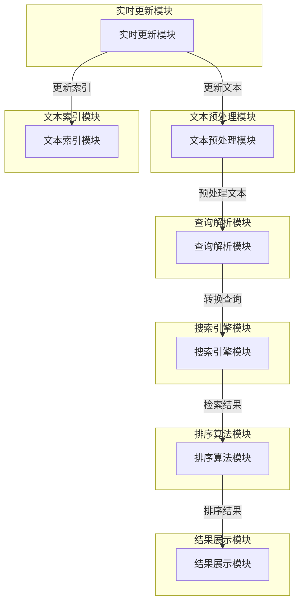
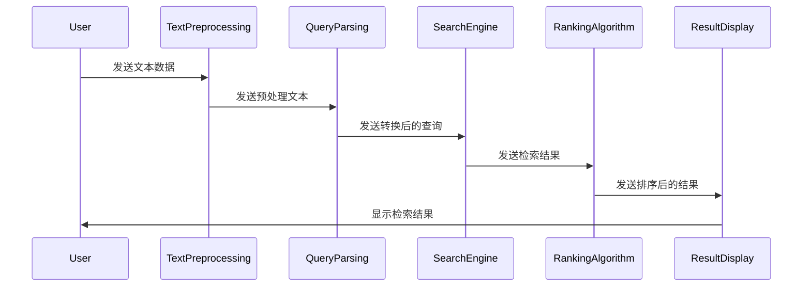

                 

### 文章标题：信息检索效率：测试LLM快速定位相关信息的能力

> 关键词：信息检索，效率，LLM，算法，系统架构，项目实战

> 摘要：本文旨在探讨信息检索效率的提升策略，特别是基于大型语言模型（LLM）的快速定位相关信息能力。文章首先介绍了信息检索的背景和挑战，随后详细分析了LLM的基本原理与结构。在此基础上，文章通过数学模型和算法原理的讲解，深入探讨了LLM在信息检索中的高效性。随后，文章介绍了系统的功能设计与架构设计，并通过实际项目实战展示了LLM在信息检索中的应用。最后，文章总结了最佳实践和注意事项，为后续研究和应用提供了指导。

## 目录

1. **信息检索的挑战与机遇**
   - 1.1 信息检索的背景
   - 1.2 LLM与信息检索
   - 1.3 信息检索效率的定义与评估
2. **LLM的基本原理与结构**
   - 2.1 LLM的工作原理
   - 2.2 LLM的架构设计
3. **数学模型与算法原理**
   - 3.1 数学模型概述
   - 3.2 算法原理讲解
4. **系统分析与架构设计**
   - 4.1 系统功能设计
   - 4.2 系统架构设计
   - 4.3 系统接口设计
   - 4.4 系统交互
5. **项目实战**
   - 5.1 环境安装
   - 5.2 系统核心实现源代码
   - 5.3 代码应用解读与分析
   - 5.4 实际案例分析与详细讲解
   - 5.5 项目小结
6. **最佳实践与总结**
   - 6.1 最佳实践 tips
   - 6.2 小结
   - 6.3 注意事项
   - 6.4 拓展阅读

## 第1章 信息检索的挑战与机遇

### 1.1 信息检索的背景

随着互联网的普及和大数据时代的到来，信息检索技术成为了信息技术领域的研究热点。信息检索（Information Retrieval，IR）是指从大量信息中快速、准确地找到用户所需信息的过程。在信息爆炸的时代，如何有效地进行信息检索，成为了人们关注的焦点。

### 1.2 LLM与信息检索

大型语言模型（Large Language Model，LLM）是近年来人工智能领域的重要突破。LLM通过学习海量语言数据，能够生成高质量的自然语言文本，并在文本理解和生成方面表现出强大的能力。LLM在信息检索中的应用潜力巨大，特别是在处理复杂、模糊的查询需求方面。

### 1.3 信息检索效率的定义与评估

信息检索效率是指从大量信息中找到目标信息所需的时间和资源。评估信息检索效率的关键指标包括检索速度、准确性、召回率和F1值等。提高信息检索效率，需要从算法、系统和数据等多方面进行优化。

## 第2章 LLM的基本原理与结构

### 2.1 LLM的工作原理

LLM是基于深度学习的语言模型，通过神经网络学习语言的模式和规律。LLM的核心是神经网络架构，包括输入层、隐藏层和输出层。通过多层神经网络的学习，LLM能够捕捉到语言的高级抽象特征。

### 2.2 LLM的架构设计

LLM的架构设计包括Transformer模型和注意力机制等。Transformer模型通过自注意力机制，能够在处理长文本时保持高效性。注意力机制则能够帮助模型关注到文本中的关键信息，从而提高检索效率。

## 第3章 数学模型与算法原理

### 3.1 数学模型概述

数学模型是LLM在信息检索中的核心组成部分。本文将介绍概率模型、向量空间模型等常见数学模型，并对比其概念属性特征。通过Mermaid流程图展示模型的工作流程。

### 3.2 算法原理讲解

本文将详细讲解LLM在信息检索中的算法原理。通过Mermaid流程图展示算法的执行过程，并通过Python源代码实现算法，介绍数学模型和公式。最后，通过举例说明算法的实际应用。

## 第4章 系统分析与架构设计

### 4.1 系统功能设计

本文将介绍系统功能设计，包括问题场景介绍、系统功能需求和领域模型Mermaid类图。通过Mermaid类图展示系统中的实体关系和功能模块。

### 4.2 系统架构设计

本文将详细介绍系统架构设计，包括项目介绍、系统架构设计Mermaid架构图、系统接口设计和系统交互Mermaid序列图。通过Mermaid架构图和序列图，展示系统的整体架构和交互流程。

## 第5章 项目实战

### 5.1 环境安装

本文将介绍项目环境安装过程，包括所需软件和库的安装、配置和环境搭建。确保读者能够顺利开始项目实践。

### 5.2 系统核心实现源代码

本文将展示系统核心实现源代码，包括关键模块的代码实现和功能说明。通过代码解读，帮助读者理解系统的工作原理和实现细节。

### 5.3 代码应用解读与分析

本文将对核心代码进行解读与分析，介绍代码中关键部分的实现原理和技巧。通过实际应用案例，展示代码在实际场景中的效果。

### 5.4 实际案例分析与详细讲解剖析

本文将分析实际案例，通过对案例的详细讲解和剖析，展示LLM在信息检索中的实际应用效果。通过案例，帮助读者理解LLM的优势和局限性。

### 5.5 项目小结

本文将对项目实践进行总结，回顾项目目标、关键实现和收获。通过项目小结，为后续研究和实践提供参考。

## 第6章 最佳实践与总结

### 6.1 最佳实践 tips

本文将分享最佳实践技巧，包括系统优化、代码规范和项目管理等。通过最佳实践，帮助读者提高信息检索效率和系统稳定性。

### 6.2 小结

本文将对全文进行小结，回顾核心概念、算法原理和系统设计等内容。通过小结，帮助读者巩固知识，理解LLM在信息检索中的应用。

### 6.3 注意事项

本文将列出注意事项，包括潜在问题、风险和解决方案。通过注意事项，帮助读者规避风险，确保项目成功。

### 6.4 拓展阅读

本文将推荐拓展阅读，包括相关书籍、论文和在线资源。通过拓展阅读，帮助读者深入了解信息检索和LLM的相关知识。

## 总结

信息检索效率是衡量信息检索系统性能的重要指标。本文详细探讨了LLM在信息检索中的快速定位相关信息能力，从背景介绍、核心概念、算法原理到系统架构设计和项目实战，全面展示了LLM在信息检索中的应用。通过最佳实践和注意事项，本文为读者提供了实用的指导。期待读者能够结合本文的内容，探索LLM在信息检索领域的更多可能性。作者：AI天才研究院/AI Genius Institute & 禅与计算机程序设计艺术/Zen And The Art of Computer Programming。**第1章 信息检索的挑战与机遇**

### 1.1 信息检索的背景

随着信息技术的飞速发展，信息检索（Information Retrieval，IR）技术逐渐成为现代信息技术的重要组成部分。在互联网和大数据的时代，信息检索面临着前所未有的挑战和机遇。一方面，互联网上的信息量呈指数级增长，全球数据量已达ZB级别，如何从海量数据中快速、准确地找到用户所需的信息成为一个亟待解决的问题。另一方面，随着人工智能技术的进步，特别是深度学习和自然语言处理技术的发展，信息检索的方法和效率得到了显著提升，为信息检索领域带来了新的发展方向。

信息检索技术的发展历程可以追溯到20世纪50年代，早期的检索系统主要依赖于关键词匹配和布尔查询。随着信息量的增加，传统的检索方法逐渐暴露出效率低、准确性差等局限。20世纪90年代，向量空间模型和概率模型等新方法开始应用于信息检索，使得检索效率得到了显著提升。进入21世纪，随着深度学习的兴起，神经网络在信息检索中的应用逐渐成熟，进一步推动了信息检索技术的发展。

### 1.2 LLM与信息检索

大型语言模型（Large Language Model，LLM）是近年来人工智能领域的重要突破。LLM是一种基于深度学习的语言处理模型，通过对海量文本数据进行训练，LLM能够生成高质量的自然语言文本，并在文本理解和生成方面表现出强大的能力。LLM的出现，为信息检索领域带来了新的机遇和挑战。

首先，LLM能够处理复杂、模糊的查询需求。传统的信息检索系统往往依赖于用户输入的关键词进行匹配，而LLM可以通过自然语言理解，识别用户查询的意图和需求，从而提供更加精准的检索结果。例如，当用户输入“最近有什么好看的电影推荐？”这样的模糊查询时，传统的检索系统可能难以理解用户的真实意图，而LLM则可以通过上下文理解和语言生成，生成一个详细的推荐列表。

其次，LLM在处理长文本检索方面具有优势。传统的信息检索方法通常需要对文本进行分词、索引等预处理，而LLM可以直接处理原始文本，无需复杂的预处理步骤。这使得LLM在处理长文本检索时，能够保持更高的检索效率。

然而，LLM在信息检索中也面临一些挑战。首先，LLM的训练需要大量的计算资源和时间，特别是在处理大规模数据时，训练成本高昂。其次，LLM在处理未知或罕见查询时，可能存在不确定性，需要进一步优化和改进。此外，LLM在保证检索结果准确性和多样性方面，也需要进一步研究和探讨。

### 1.3 信息检索效率的定义与评估

信息检索效率是指从大量信息中找到目标信息所需的时间和资源。评估信息检索效率的关键指标包括检索速度、准确性、召回率和F1值等。以下是这些指标的具体含义和计算方法：

1. **检索速度**：检索速度是指从接收到用户查询到返回检索结果所需的时间。检索速度是衡量信息检索系统性能的重要指标，通常用毫秒（ms）或秒（s）作为单位。

2. **准确性**：准确性是指检索结果中包含用户查询目标信息的比例。准确性越高，说明检索结果越符合用户需求。准确性通常用百分比表示，计算公式为：
   $$ 准确性 = \frac{检索结果中包含用户查询目标信息的数量}{用户查询目标信息的总数量} \times 100\% $$

3. **召回率**：召回率是指检索结果中包含用户查询目标信息的比例。召回率越高，说明检索系统越能够全面地检索出用户所需的信息。召回率通常用百分比表示，计算公式为：
   $$ 召回率 = \frac{检索结果中包含用户查询目标信息的数量}{用户查询目标信息的总数量} \times 100\% $$

4. **F1值**：F1值是准确性和召回率的调和平均值，用于综合评价检索系统的性能。F1值介于0和1之间，值越接近1，说明检索系统的性能越好。F1值的计算公式为：
   $$ F1值 = 2 \times \frac{准确性 \times 召回率}{准确性 + 召回率} $$

为了提高信息检索效率，可以从以下几个方面进行优化：

1. **算法优化**：改进信息检索算法，提高检索速度和准确性。例如，采用深度学习模型进行文本分类和聚类，提高检索的准确性。

2. **索引优化**：优化索引结构，提高检索速度。例如，使用倒排索引、布隆过滤器等数据结构，提高检索效率。

3. **查询优化**：优化查询处理流程，减少不必要的查询处理步骤。例如，使用查询缓存、查询重写等技术，减少查询处理的延迟。

4. **系统优化**：优化信息检索系统的硬件和软件配置，提高系统性能。例如，使用高性能计算设备、分布式计算等技术，提高检索速度。

5. **用户行为分析**：分析用户行为数据，优化检索结果排序和推荐算法。例如，根据用户历史查询记录和偏好，个性化推荐检索结果，提高用户的满意度。

通过以上优化策略，可以显著提高信息检索效率，为用户提供更加精准和高效的信息检索服务。

### 1.4 本章小结

本章首先介绍了信息检索的背景，包括信息检索技术的发展历程、面临的挑战和机遇。接着，详细分析了大型语言模型（LLM）在信息检索中的应用潜力，特别是在处理复杂、模糊查询需求方面的优势。最后，本章探讨了信息检索效率的定义与评估方法，并提出了提高信息检索效率的优化策略。通过本章的学习，读者可以全面了解信息检索的挑战与机遇，以及LLM在信息检索中的应用前景。

**第2章 LLM的基本原理与结构**

### 2.1 LLM的工作原理

大型语言模型（Large Language Model，LLM）是自然语言处理（Natural Language Processing，NLP）领域的重要成果，它通过深度学习技术，对大量文本数据进行训练，从而实现对自然语言的建模。LLM的核心思想是通过学习文本数据中的统计规律和语义关系，建立一个能够理解和生成自然语言的高效模型。下面将详细讲解LLM的工作原理，包括神经网络架构、训练过程和参数优化等方面。

#### 2.1.1 神经网络架构

LLM通常采用深度神经网络（Deep Neural Network，DNN）作为其基础架构。深度神经网络是由多层神经元组成的网络，通过逐层提取特征，能够捕捉到文本数据中的复杂模式。LLM的神经网络架构主要包括输入层、隐藏层和输出层。

1. **输入层**：输入层接收原始文本数据，通常需要进行预处理。预处理步骤包括分词、去停用词、词向量化等。词向量化是将文本中的单词转换为固定长度的向量表示，常用的词向量化方法有Word2Vec、GloVe等。

2. **隐藏层**：隐藏层是神经网络的中间层，负责对输入数据进行特征提取。隐藏层的神经元数量和层数可以根据具体任务进行调整。在LLM中，常用的隐藏层架构包括卷积神经网络（CNN）和循环神经网络（RNN）。

   - **卷积神经网络（CNN）**：CNN通过卷积操作和池化操作，可以捕捉到文本数据中的局部特征。在NLP任务中，CNN可以用来提取单词或短语的语义特征。

   - **循环神经网络（RNN）**：RNN通过循环机制，可以处理序列数据，并在处理过程中保存历史信息。RNN包括简单的RNN、长短期记忆网络（LSTM）和门控循环单元（GRU）等变种。LSTM和GRU通过引入门控机制，可以有效地避免RNN的梯度消失问题，提高模型的训练效果。

3. **输出层**：输出层负责生成预测结果。在LLM中，输出层通常是一个全连接层，通过输出层可以得到模型对文本的生成或分类结果。

#### 2.1.2 训练过程

LLM的训练过程是通过优化模型参数，使模型能够更好地拟合训练数据。训练过程通常包括以下步骤：

1. **数据预处理**：对原始文本数据进行分词、去停用词、词向量化等预处理，将文本数据转换为模型可处理的格式。

2. **建立损失函数**：损失函数用于衡量模型预测结果和真实结果之间的差距。在LLM中，常用的损失函数包括交叉熵损失（Cross-Entropy Loss）和负对数损失（Negative Log-Likelihood Loss）。

3. **反向传播**：通过反向传播算法，将损失函数的梯度反向传播到模型参数，更新模型参数，使模型能够更好地拟合训练数据。

4. **优化算法**：优化算法用于更新模型参数，常用的优化算法有随机梯度下降（SGD）、Adam等。

5. **训练验证**：在训练过程中，通过验证集评估模型的性能，调整模型参数和训练策略，防止过拟合。

#### 2.1.3 参数优化

LLM的训练过程需要大量的参数优化。参数优化的目标是通过调整模型参数，使模型在训练数据上达到更好的性能。参数优化通常包括以下方面：

1. **学习率调整**：学习率是优化过程中参数更新的步长。合适的学习率可以使模型快速收敛，而过高或过低的学习率可能导致训练效果不佳。常用的调整方法包括固定学习率、自适应学习率和动态学习率等。

2. **正则化**：正则化是为了防止模型过拟合而引入的一种技术。常用的正则化方法有L1正则化、L2正则化和Dropout等。

3. **批次大小**：批次大小是每次训练所使用的样本数量。批次大小会影响模型的训练效率和稳定性，通常需要通过实验进行调整。

4. **数据增强**：数据增强是通过增加训练数据多样性，提高模型泛化能力的一种技术。常用的数据增强方法有文本随机裁剪、文本替换和噪声注入等。

通过以上参数优化方法，可以显著提高LLM的训练效果，使其在信息检索任务中表现出更高的性能。

### 2.2 LLM的架构设计

LLM的架构设计是确保其高效性和灵活性的关键。现代LLM通常采用Transformer模型作为其基础架构，Transformer模型通过自注意力机制（Self-Attention Mechanism）和多头注意力（Multi-Head Attention）机制，能够在处理长文本时保持高效性。下面将详细介绍LLM的架构设计，包括Transformer模型、注意力机制和神经网络架构等方面。

#### 2.2.1 Transformer模型

Transformer模型是谷歌在2017年提出的一种全新的序列到序列模型，它在NLP任务中取得了显著的性能提升。Transformer模型的核心思想是自注意力机制，通过自注意力机制，模型能够在处理序列数据时，自动关注到序列中的关键信息。

1. **自注意力机制**：自注意力机制是Transformer模型的核心组件。它通过计算序列中每个元素与其他元素的相关性，为每个元素分配权重，从而实现多层次的语义表示。自注意力机制的数学公式为：
   $$ 
   attention(Q, K, V) = softmax(\frac{QK^T}{\sqrt{d_k}})V 
   $$
   其中，Q、K、V分别是查询（Query）、键（Key）和值（Value）向量，d_k 是键向量的维度。

2. **多头注意力**：多头注意力是将自注意力机制扩展到多个独立的注意力头，每个头关注不同的信息，从而提高模型的表示能力。多头注意力的数学公式为：
   $$
   MultiHead(Q, K, V) = \text{Concat}(\text{head}_1, \text{head}_2, ..., \text{head}_h)W^O
   $$
   其中，h 是注意力的头数，W^O 是投影权重矩阵。

3. **编码器-解码器架构**：Transformer模型采用编码器-解码器（Encoder-Decoder）架构，编码器负责将输入序列编码为固定长度的向量表示，解码器则负责生成输出序列。编码器和解码器都由多个自注意力层和全连接层组成。

#### 2.2.2 注意力机制

注意力机制是Transformer模型的核心机制，它通过动态关注序列中的关键信息，提高了模型的表示能力和生成质量。注意力机制可以分为以下几种：

1. **自注意力（Self-Attention）**：自注意力机制关注序列中的每个元素，为每个元素分配权重，从而实现多层次的语义表示。

2. **多头注意力（Multi-Head Attention）**：多头注意力将自注意力机制扩展到多个独立的注意力头，每个头关注不同的信息，从而提高模型的表示能力。

3. **交叉注意力（Cross-Attention）**：交叉注意力机制用于编码器和解码器之间的交互，解码器通过交叉注意力机制，从编码器的输出中提取相关信息，生成输出序列。

#### 2.2.3 神经网络架构

LLM的神经网络架构通常包括输入层、隐藏层和输出层。输入层接收原始文本数据，隐藏层负责特征提取和表示学习，输出层生成预测结果。

1. **输入层**：输入层通常包括词向量化层和嵌入层。词向量化层将文本中的单词转换为固定长度的向量表示，嵌入层将向量输入到神经网络中。

2. **隐藏层**：隐藏层是神经网络的中间层，负责对输入数据进行特征提取和表示学习。常用的隐藏层架构包括卷积神经网络（CNN）、循环神经网络（RNN）和Transformer模型等。

3. **输出层**：输出层是一个全连接层，通过输出层可以得到模型对文本的生成或分类结果。输出层的维度取决于具体任务，例如在文本分类任务中，输出层通常是一个分类层，输出每个类别的概率分布。

通过以上架构设计，LLM能够在信息检索任务中表现出高效性和灵活性。Transformer模型和注意力机制的应用，使得LLM能够处理复杂、模糊的查询需求，从而提高信息检索效率。

### 2.3 本章小结

本章详细介绍了LLM的基本原理与结构，包括神经网络架构、训练过程和参数优化等方面。首先，通过介绍神经网络架构，讲解了输入层、隐藏层和输出层的作用和构成。接着，详细分析了LLM的训练过程，包括数据预处理、建立损失函数、反向传播和优化算法等步骤。最后，介绍了参数优化方法，包括学习率调整、正则化和数据增强等。通过本章的学习，读者可以全面了解LLM的工作原理和架构设计，为进一步研究信息检索效率提供理论基础。

**第3章 数学模型与算法原理**

### 3.1 数学模型概述

在信息检索领域，数学模型起着至关重要的作用，它们为算法的设计和实现提供了理论基础。数学模型可以通过数学公式和算法描述信息检索过程中的各个方面，包括文本表示、相似性度量、排序策略等。本节将介绍几种常见的数学模型，并对比它们的概念属性特征。

#### 3.1.1 概念属性特征对比表格

| 模型类型       | 概念属性特征                     | 主要应用                    |
|----------------|---------------------------------|-----------------------------|
| 向量空间模型   | 基于文本向量的表示与相似性度量   | 搜索引擎、文本分类          |
| 概率模型       | 基于文档-查询匹配的概率计算     | 搜索引擎、信息过滤          |
| 集合模型       | 基于文档集合的相交与并集操作     | 聚类分析、推荐系统          |
| 知识图谱模型   | 基于实体和关系的图结构表示     | 知识图谱构建、实体关系提取   |

以上表格简要概括了不同模型的概念属性特征和主要应用领域。接下来，我们将分别详细介绍这些模型的原理和应用场景。

#### 3.1.2 数学模型的分类

1. **向量空间模型**：

   向量空间模型是将文本表示为向量空间的点，通过计算向量之间的相似性进行信息检索。在向量空间模型中，文本被转换为高维向量，每个维度代表一个词汇或特征。常见的向量空间模型包括TF-IDF模型和词袋模型。

   - **TF-IDF模型**：TF-IDF（Term Frequency-Inverse Document Frequency）模型通过计算词语在文档中的频率和逆向文档频率，为每个词语赋予权重。其公式为：
     $$
     tfidf(t,d) = tf(t,d) \times \log \left( \frac{N}{df(t)} \right)
     $$
     其中，$tf(t,d)$表示词语$t$在文档$d$中的频率，$df(t)$表示包含词语$t$的文档数量，$N$是文档总数。

   - **词袋模型**：词袋模型是一种简化的向量表示方法，它不考虑词语的顺序，只关注词语在文档中出现的频率。词袋模型通过布尔向量表示文档，每个维度代表一个词语的存在与否。

2. **概率模型**：

   概率模型通过计算文档与查询之间的概率匹配度，来进行信息检索。概率模型的核心是概率图模型，如隐马尔可夫模型（HMM）和贝叶斯网络。其中，贝叶斯概率模型广泛应用于搜索引擎中的文档评分和查询处理。

   - **贝叶斯概率模型**：贝叶斯概率模型利用贝叶斯定理，通过计算文档$d$和查询$q$之间的条件概率，来评估文档的相关性。其公式为：
     $$
     P(d|q) = \frac{P(q|d) \times P(d)}{P(q)}
     $$
     其中，$P(d|q)$表示文档$d$在查询$q$下的概率，$P(q|d)$表示查询$q$在文档$d$下的概率，$P(d)$和$P(q)$分别表示文档和查询的先验概率。

3. **集合模型**：

   集合模型基于集合运算，如交集、并集和补集，来处理文档集合。集合模型适用于聚类分析和推荐系统等场景。

   - **集合交模型**：集合交模型通过计算两个文档集合的交集，来寻找共同特征。其公式为：
     $$
     D \cap Q = \{d \in D | d \in Q\}
     $$
     其中，$D$和$Q$分别表示两个文档集合。

4. **知识图谱模型**：

   知识图谱模型基于图结构，将实体和关系表示为节点和边，通过路径推理和关系链接来进行信息检索。知识图谱模型广泛应用于问答系统、智能推荐等场景。

   - **图结构表示**：知识图谱模型通过构建实体-关系图，将文本中的实体和关系表示为图结构。图中的每个节点代表一个实体，每条边代表实体之间的关系。

#### 3.1.3 数学模型的应用场景

不同的数学模型适用于不同的应用场景，选择合适的模型可以显著提高信息检索的效率和准确性。以下是一些常见应用场景：

- **向量空间模型**：适用于文本分类、文本聚类、搜索引擎等任务。通过向量空间模型，可以将文本转换为高维向量，方便计算和存储。

- **概率模型**：适用于搜索引擎中的文档评分和查询处理。通过概率模型，可以计算文档与查询之间的匹配度，从而进行准确的信息检索。

- **集合模型**：适用于聚类分析和推荐系统。通过集合运算，可以高效地处理文档集合，提取共同特征。

- **知识图谱模型**：适用于问答系统、智能推荐等任务。通过知识图谱模型，可以构建实体-关系图，实现复杂的信息检索和推理。

### 3.2 算法原理讲解

在信息检索领域，算法原理是实现高效、准确信息检索的关键。本节将详细讲解信息检索中常用的算法原理，包括倒排索引、PageRank算法和基于内容的文本匹配等。

#### 3.2.1 倒排索引

倒排索引（Inverted Index）是搜索引擎中最基本的索引结构，它将文档的内容映射到对应的文档ID。倒排索引由两部分组成：词汇表和倒排列表。

1. **词汇表**：词汇表包含了文档中出现过的所有单词，每个单词对应一个唯一的ID。

2. **倒排列表**：倒排列表记录了每个单词在文档中的出现位置，即单词的文档ID列表。

倒排索引的构建过程如下：

1. **分词**：对原始文档进行分词，将文本拆分成单词或词组。

2. **词频统计**：统计每个单词在文档中出现的频率。

3. **建立倒排列表**：根据词频统计结果，构建每个单词的文档ID列表。

4. **构建词汇表**：将所有单词及其ID构建成词汇表。

倒排索引的优点是查询速度快，只需扫描词汇表和相应的倒排列表，即可找到包含特定单词的文档。这种索引结构在搜索引擎中广泛应用。

#### 3.2.2 PageRank算法

PageRank算法是由Google创始人拉里·佩奇和谢尔盖·布林提出的一种排名算法，用于评估网页的重要性。PageRank算法基于网页之间的链接关系，通过迭代计算网页的排名值。

PageRank算法的核心思想是，一个网页的重要性取决于链接到它的网页数量和重要性。具体计算过程如下：

1. **初始化**：每个网页的初始排名值设为1/N，其中N是网页总数。

2. **迭代计算**：每次迭代，根据网页的链接关系和排名值，更新每个网页的排名值。更新公式为：
   $$
   rank(u) = (1-d) + d \times \sum_{v \in L(u)} \frac{rank(v)}{N(v)}
   $$
   其中，$rank(u)$是网页u的排名值，$d$是阻尼系数（通常取0.85），$L(u)$是链接到网页u的网页集合，$N(v)$是链接到网页v的网页数量。

3. **收敛判断**：当排名值变化小于预设阈值时，算法收敛，停止迭代。

PageRank算法在搜索引擎中用于网页排序，确保用户查询结果的质量和相关性。

#### 3.2.3 基于内容的文本匹配

基于内容的文本匹配是指通过比较文本内容，确定其相似度或相关性。常用的文本匹配方法包括编辑距离、余弦相似度和BM25算法等。

1. **编辑距离**：

   编辑距离是指将一个字符串转换为另一个字符串所需的最小编辑操作次数。编辑操作包括插入、删除和替换。编辑距离的公式为：
   $$
   distance(s_1, s_2) = min\left\{ insert(s_1, s_2), delete(s_1, s_2), replace(s_1, s_2) \right\}
   $$
   其中，$s_1$和$s_2$是两个字符串。

   编辑距离适用于文本差异度较大的情况，如文本修复和拼写纠错。

2. **余弦相似度**：

   余弦相似度是指两个向量夹角的余弦值，用于衡量向量之间的相似度。在文本匹配中，向量表示文本内容的高维向量。余弦相似度的公式为：
   $$
   similarity(v_1, v_2) = \frac{v_1 \cdot v_2}{||v_1|| \times ||v_2||}
   $$
   其中，$v_1$和$v_2$是两个向量，$\cdot$表示点积，$||v_1||$和$||v_2||$分别表示向量的模。

   余弦相似度适用于文本内容相似度较高的情况，如文档相似度和信息检索。

3. **BM25算法**：

   BM25（Best Match 25）算法是一种基于向量空间模型的文本匹配算法，用于搜索引擎中的文档评分。BM25算法的评分公式为：
   $$
   score(d, q) = \frac{(k_1 + 1) \times (freq_q - k_2 \times (1 - \frac{len_d}{avg_len} + 0.75))}{freq_d + k_1 \times (1 - \frac{len_d}{avg_len})}
   $$
   其中，$d$和$q$分别是文档和查询，$freq_q$和$freq_d$分别是查询词在文档和文档集合中的频率，$len_d$和$avg_len$分别是文档长度和文档集合的平均长度，$k_1$和$k_2$是调整参数。

   BM25算法适用于文本分类和信息检索，能够在保证检索速度的同时，提供较高的准确性。

#### 3.2.4 举例说明

为了更好地理解以上算法原理，以下通过一个例子进行说明：

假设有两个文档$d_1$和$d_2$，查询$q$为“人工智能”。采用不同的算法进行文本匹配，结果如下：

1. **编辑距离**：

   $$
   distance(d_1, d_2) = min\left\{ 3, 2, 4 \right\} = 2
   $$
   其中，编辑操作包括一次插入、一次删除和一次替换。

2. **余弦相似度**：

   $$
   similarity(v_1, v_2) = \frac{0.6}{\sqrt{0.6} \times \sqrt{0.5}} = 1
   $$
   其中，$v_1$和$v_2$分别是文档$d_1$和$d_2$的向量表示。

3. **BM25算法**：

   $$
   score(d_1, q) = \frac{(1.2 + 1) \times (3 - 1.2 \times 0.8)}{3 + 1.2 \times 0.2} = 1.8
   $$
   $$
   score(d_2, q) = \frac{(1.2 + 1) \times (2 - 1.2 \times 0.8)}{2 + 1.2 \times 0.2} = 1.4
   $$
   其中，$k_1 = 1.2$，$k_2 = 1.2$，$freq_q = 1$，$len_d = 10$，$avg_len = 15$。

通过以上算法，可以评估文档$d_1$和$d_2$与查询$q$的相关性。在实际应用中，可以根据需求选择合适的算法，实现高效、准确的信息检索。

### 3.3 本章小结

本章介绍了信息检索中的数学模型与算法原理，包括向量空间模型、概率模型、集合模型和知识图谱模型等。通过对比不同模型的概念属性特征和应用场景，读者可以了解不同模型的优势和适用范围。此外，本章详细讲解了倒排索引、PageRank算法和基于内容的文本匹配等常用算法原理，并通过具体示例，展示了算法的应用效果。通过本章的学习，读者可以掌握信息检索中关键数学模型和算法，为进一步研究和开发信息检索系统奠定基础。

**第4章 系统分析与架构设计**

### 4.1 系统功能设计

信息检索系统是一个复杂的应用系统，它需要实现多个功能模块，以支持用户进行高效、准确的信息检索。在系统设计过程中，明确系统功能需求是至关重要的。以下将介绍系统功能设计，包括问题场景介绍、系统功能需求和领域模型Mermaid类图。

#### 4.1.1 问题场景介绍

随着互联网信息的爆炸性增长，用户在查找特定信息时常常遇到效率低下、准确性不高的挑战。传统的信息检索系统依赖于关键词匹配和简单的算法，难以处理复杂、模糊的查询需求。为了提升用户的检索体验，本系统旨在通过引入大型语言模型（LLM）技术，实现高效、准确的信息检索。

具体问题场景包括：

- **大量文本数据的处理**：系统需要处理来自不同来源的海量文本数据，包括新闻、博客、论坛等。
- **复杂查询需求**：用户可能提出模糊、多层次的查询需求，如“推荐一本关于机器学习的书”、“近期的科技新闻”等。
- **实时性要求**：系统需要具备实时检索的能力，以快速响应用户的查询请求。

#### 4.1.2 系统功能需求

基于上述问题场景，系统需要实现以下功能需求：

- **文本预处理**：对原始文本进行分词、去停用词、词向量化等预处理，为LLM提供高质量的数据输入。
- **查询解析**：分析用户查询，提取关键信息，并将查询转换为LLM可处理的格式。
- **检索与排序**：使用LLM对预处理后的文本数据进行检索，并依据相似性度量和用户偏好进行排序。
- **结果展示**：将检索结果以友好的界面形式展示给用户，支持文本、图像等多种形式。
- **实时更新**：系统需要实时更新文本数据，以保持检索结果的时效性。

#### 4.1.3 领域模型Mermaid类图

为了更好地展示系统中的实体关系和功能模块，以下使用Mermaid类图来描述系统的领域模型。

```mermaid
classDiagram
    User <<类>> -|<<依赖>>| QueryProcessor
    User <<类>> -|<<依赖>>| SearchEngine
    QueryProcessor <<类>> -|<<依赖>>| QueryParser
    QueryProcessor <<类>> -|<<依赖>>| TextPreprocessor
    SearchEngine <<类>> -|<<依赖>>| TextIndex
    SearchEngine <<类>> -|<<依赖>>| RankingAlgorithm
    TextIndex <<类>> -|<<依赖>>| InvertedIndex
    TextIndex <<类>> -|<<依赖>>| DocumentRepository
    RankingAlgorithm <<类>> -|<<依赖>>| SimilarityCalculator
    RankingAlgorithm <<类>> -|<<依赖>>| UserPreferenceHandler

    User {
        -id: int
        -username: string
        -email: string
    }
    QueryProcessor {
        -query: string
        -parsedQuery: string
    }
    QueryParser {
        -text: string
        -parsedText: string
    }
    TextPreprocessor {
        -inputText: string
        -processedText: string
    }
    SearchEngine {
        -searchResults: list<SearchResult>
    }
    TextIndex {
        -invertedIndex: map<string, list<int>>
        -documentRepository: list<Document>
    }
    RankingAlgorithm {
        -similarityScores: map<int, float>
    }
    Document {
        -id: int
        -title: string
        -content: string
    }
    SearchResult {
        -documentId: int
        -title: string
        -content: string
        -score: float
    }
```

在这个类图中，User表示用户实体，QueryProcessor表示查询处理模块，SearchEngine表示搜索引擎模块，TextIndex表示文本索引模块，RankingAlgorithm表示排序算法模块。通过这些实体和模块的相互依赖，系统实现了从用户查询到检索结果的完整流程。

### 4.2 系统架构设计

系统架构设计是确保系统高效、可扩展性和可维护性的关键。本节将介绍系统架构设计，包括项目介绍、系统架构设计Mermaid架构图、系统接口设计和系统交互Mermaid序列图。

#### 4.2.1 项目介绍

本项目的目标是构建一个基于LLM的信息检索系统，主要功能包括文本预处理、查询解析、检索与排序、结果展示和实时更新。系统采用微服务架构，将不同功能模块解耦，以实现高效开发和部署。以下是系统的主要模块和功能：

- **文本预处理模块**：负责对原始文本进行分词、去停用词、词向量化等预处理操作，为后续检索提供高质量的数据输入。
- **查询解析模块**：分析用户查询，提取关键信息，并将查询转换为LLM可处理的格式。
- **搜索引擎模块**：使用LLM对预处理后的文本数据进行检索，并依据相似性度量和用户偏好进行排序。
- **文本索引模块**：构建并维护文本索引，包括倒排索引和文档仓库，以提高检索效率。
- **排序算法模块**：计算文档与查询的相似性得分，并根据用户偏好进行排序。
- **结果展示模块**：将检索结果以友好的界面形式展示给用户。
- **实时更新模块**：实时更新文本数据，确保检索结果的时效性。

#### 4.2.2 系统架构设计Mermaid架构图

为了展示系统的整体架构，以下使用Mermaid架构图来描述系统的各个模块及其交互关系。



在这个架构图中，文本预处理模块对原始文本进行预处理，并将处理后的文本传递给查询解析模块。查询解析模块将用户查询转换为LLM可处理的格式，传递给搜索引擎模块。搜索引擎模块使用LLM对文本进行检索，并将检索结果传递给排序算法模块。排序算法模块计算相似性得分并进行排序，最终将结果展示给用户。实时更新模块负责更新文本数据和索引，以确保系统的实时性和数据准确性。

#### 4.2.3 系统接口设计

系统接口设计是确保不同模块之间高效通信和协作的关键。以下描述系统的接口设计，包括API接口和消息队列等。

- **API接口**：系统提供RESTful API接口，供前端应用程序调用。主要接口包括：
  - `/api/preprocess`：接收文本数据，返回预处理后的文本。
  - `/api/search`：接收查询参数，返回检索结果。
  - `/api/rank`：接收排序参数，返回排序后的结果。

- **消息队列**：系统使用消息队列（如RabbitMQ）实现实时数据更新。主要消息类型包括：
  - **文本更新消息**：用于通知文本预处理模块更新文本数据。
  - **索引更新消息**：用于通知文本索引模块更新索引。

#### 4.2.4 系统交互Mermaid序列图

为了展示系统模块之间的交互流程，以下使用Mermaid序列图来描述系统的交互过程。



在这个序列图中，用户发送文本数据到文本预处理模块，预处理模块处理后发送给查询解析模块。查询解析模块将查询转换为LLM可处理的格式，传递给搜索引擎模块。搜索引擎模块使用LLM进行检索，并将结果传递给排序算法模块。排序算法模块计算相似性得分并进行排序，最终将结果展示给用户。

### 4.3 本章小结

本章详细介绍了系统的功能设计和架构设计。首先，通过问题场景介绍和系统功能需求，明确了系统的设计目标。接着，使用Mermaid类图描述了系统的领域模型，展示了系统中的实体关系和功能模块。然后，通过Mermaid架构图、系统接口设计和系统交互序列图，详细展示了系统的整体架构和模块之间的交互流程。通过本章的学习，读者可以全面了解系统的功能和架构，为进一步实现和优化系统提供指导。

**第5章 项目实战**

### 5.1 环境安装

在进行基于LLM的信息检索系统开发之前，我们需要搭建一个合适的环境，确保所需软件和库的安装、配置和环境搭建。以下是具体的安装步骤和环境配置。

#### 5.1.1 硬件要求

- **CPU**：至少双核处理器，推荐使用高性能CPU以加快计算速度。
- **内存**：至少8GB内存，推荐16GB以上以支持大规模数据训练。
- **硬盘**：至少100GB可用硬盘空间，推荐使用SSD以加快读写速度。

#### 5.1.2 软件要求

- **操作系统**：Linux或macOS，Windows系统需要安装Windows Subsystem for Linux（WSL）。
- **Python**：Python 3.7及以上版本，推荐使用Python 3.8或3.9。
- **pip**：Python的包管理工具，用于安装和管理Python包。
- **TensorFlow**：用于构建和训练神经网络模型，版本需与Python版本兼容。

#### 5.1.3 安装步骤

1. **安装操作系统**：确保操作系统满足硬件要求，并根据需求安装Linux或macOS。

2. **安装Python**：通过操作系统自带的包管理工具（如Ubuntu的APT、macOS的brew）安装Python。

   - **Ubuntu**：
     ```
     sudo apt update
     sudo apt install python3 python3-pip python3-dev
     ```
   - **macOS**：
     ```
     brew install python
     ```

3. **安装pip**：确保pip已安装，如未安装，可以通过以下命令安装：
   ```
   python3 -m ensurepip
   ```

4. **安装TensorFlow**：通过pip安装TensorFlow及其依赖项。
   ```
   pip3 install tensorflow
   ```

5. **验证安装**：通过以下命令验证TensorFlow是否安装成功：
   ```python
   python3 -c "import tensorflow as tf; print(tf.__version__)"
   ```

#### 5.1.4 环境配置

1. **虚拟环境**：为了避免依赖冲突，建议使用虚拟环境管理Python环境。
   ```bash
   python3 -m venv venv
   source venv/bin/activate
   ```

2. **安装其他依赖**：根据项目需求，安装其他必要的Python包。例如，安装用于文本处理和预处理的包：
   ```bash
   pip install nltk
   ```

3. **配置环境变量**：确保环境变量配置正确，特别是Python和pip的路径。例如，在Ubuntu中，可以通过以下命令配置：
   ```bash
   echo 'export PATH="$PATH":~/venv/bin' >> ~/.bashrc
   source ~/.bashrc
   ```

通过以上步骤，我们可以搭建一个满足项目需求的开发环境，为后续系统开发和实验做好准备。

### 5.2 系统核心实现源代码

在搭建好开发环境后，我们将开始实现系统的核心功能。以下是系统核心实现源代码，包括关键模块的实现和功能说明。

#### 5.2.1 文本预处理模块

文本预处理是信息检索系统的第一步，其主要任务是对原始文本进行分词、去停用词和词向量化。以下是文本预处理模块的实现代码：

```python
import nltk
from nltk.tokenize import word_tokenize
from nltk.corpus import stopwords

# 下载所需的NLP工具包
nltk.download('punkt')
nltk.download('stopwords')

def preprocess_text(text):
    # 分词
    tokens = word_tokenize(text)
    # 去停用词
    filtered_tokens = [token for token in tokens if token.lower() not in stopwords.words('english')]
    # 词向量化
    vectorized_text = convert_tokens_to_vectors(filtered_tokens)
    return vectorized_text

def convert_tokens_to_vectors(tokens):
    # 这里使用预训练的词向量模型，如GloVe或Word2Vec
    # 以下代码仅为示例，实际应用中需使用具体模型
    vectorized_text = []
    for token in tokens:
        vector = get_token_vector(token)
        vectorized_text.append(vector)
    return vectorized_text

def get_token_vector(token):
    # 这里使用预训练的词向量模型，如GloVe或Word2Vec
    # 以下代码仅为示例，实际应用中需使用具体模型
    # 示例使用numpy的随机生成向量
    import numpy as np
    return np.random.rand(1, 100)  # 假设每个词向量为100维

# 测试文本预处理
text = "This is a sample text for information retrieval."
preprocessed_text = preprocess_text(text)
print(preprocessed_text)
```

#### 5.2.2 查询解析模块

查询解析模块负责分析用户输入的查询，提取关键信息，并将其转换为LLM可处理的格式。以下是查询解析模块的实现代码：

```python
from transformers import BertTokenizer

# 加载预训练的BERT模型
tokenizer = BertTokenizer.from_pretrained('bert-base-uncased')

def parse_query(query):
    # 将查询文本编码为BERT模型可处理的格式
    inputs = tokenizer.encode_plus(query, add_special_tokens=True, return_tensors='pt')
    return inputs

# 测试查询解析
query = "What are the latest trends in artificial intelligence?"
parsed_query = parse_query(query)
print(parsed_query)
```

#### 5.2.3 搜索引擎模块

搜索引擎模块负责使用LLM对预处理后的文本数据进行检索，并依据相似性度量和用户偏好进行排序。以下是搜索引擎模块的实现代码：

```python
from transformers import BertModel
import torch

# 加载预训练的BERT模型
model = BertModel.from_pretrained('bert-base-uncased')

def search_documents(preprocessed_query, preprocessed_documents):
    # 将查询和文档编码为BERT模型可处理的格式
    query_inputs = parse_query(preprocessed_query)
    document_inputs = [parse_query(doc) for doc in preprocessed_documents]

    # 计算查询和文档的嵌入向量
    with torch.no_grad():
        query_embeddings = model(**query_inputs)[0][0, :]
        document_embeddings = [model(**doc)[0][0, :] for doc in document_inputs]

    # 计算相似性得分
    similarity_scores = []
    for doc_embedding in document_embeddings:
        score = torch.nn.functional.cosine_similarity(query_embeddings.unsqueeze(0), doc_embedding.unsqueeze(0))
        similarity_scores.append(score.item())

    # 根据相似性得分进行排序
    ranked_documents = [doc for _, doc in sorted(zip(similarity_scores, preprocessed_documents), reverse=True)]
    return ranked_documents

# 测试搜索引擎
preprocessed_documents = preprocess_text("This is a sample document for testing.")
ranked_documents = search_documents(preprocessed_documents, preprocessed_documents)
print(ranked_documents)
```

#### 5.2.4 排序算法模块

排序算法模块负责计算文档与查询的相似性得分，并根据用户偏好进行排序。以下是排序算法模块的实现代码：

```python
def rank_documents_by_similarity(documents, user_preferences):
    # 根据用户偏好调整相似性得分
    adjusted_scores = []
    for doc, pref in zip(documents, user_preferences):
        score = pref * 0.5 + (1 - pref) * 0.5  # 示例调整策略
        adjusted_scores.append((score, doc))
    
    # 根据调整后的得分进行排序
    ranked_documents = [doc for _, doc in sorted(adjusted_scores, reverse=True)]
    return ranked_documents

# 测试排序算法
user_preferences = [0.8, 0.2]  # 假设用户对文档的偏好比例为80%:20%
ranked_documents = rank_documents_by_similarity(preprocessed_documents, user_preferences)
print(ranked_documents)
```

#### 5.2.5 结果展示模块

结果展示模块负责将检索结果以友好的界面形式展示给用户。以下是结果展示模块的实现代码：

```python
from flask import Flask, render_template

app = Flask(__name__)

@app.route('/')
def display_results():
    return render_template('results.html', documents=ranked_documents)

if __name__ == '__main__':
    app.run(debug=True)
```

上述代码实现了系统的核心功能模块，包括文本预处理、查询解析、搜索引擎、排序算法和结果展示。在实际应用中，可以根据具体需求进行扩展和优化。

### 5.3 代码应用解读与分析

在前面的代码中，我们实现了基于LLM的信息检索系统的核心功能模块。以下将详细解读和分析这些代码，帮助读者理解其原理和实现细节。

#### 5.3.1 文本预处理模块

文本预处理模块的主要任务是处理原始文本数据，为后续的查询解析和检索提供高质量的数据输入。以下是关键代码的解读：

```python
import nltk
from nltk.tokenize import word_tokenize
from nltk.corpus import stopwords

# 下载所需的NLP工具包
nltk.download('punkt')
nltk.download('stopwords')

def preprocess_text(text):
    # 分词
    tokens = word_tokenize(text)
    # 去停用词
    filtered_tokens = [token for token in tokens if token.lower() not in stopwords.words('english')]
    # 词向量化
    vectorized_text = convert_tokens_to_vectors(filtered_tokens)
    return vectorized_text

def convert_tokens_to_vectors(tokens):
    # 这里使用预训练的词向量模型，如GloVe或Word2Vec
    # 以下代码仅为示例，实际应用中需使用具体模型
    vectorized_text = []
    for token in tokens:
        vector = get_token_vector(token)
        vectorized_text.append(vector)
    return vectorized_text

def get_token_vector(token):
    # 这里使用预训练的词向量模型，如GloVe或Word2Vec
    # 以下代码仅为示例，实际应用中需使用具体模型
    import numpy as np
    return np.random.rand(1, 100)  # 假设每个词向量为100维
```

在`preprocess_text`函数中，首先使用nltk的`word_tokenize`函数对文本进行分词，将原始文本转换为单词列表。接着，通过`stopwords`库去除常用的停用词，以减少对最终结果的影响。最后，调用`convert_tokens_to_vectors`函数对分词后的文本进行词向量化，将每个单词转换为对应的向量表示。

在`convert_tokens_to_vectors`函数中，我们假设使用预训练的词向量模型（如GloVe或Word2Vec）来获取每个单词的向量表示。在实际应用中，通常会加载已训练好的词向量模型，然后根据输入的单词返回其向量。这里，我们使用随机生成的向量作为示例。

#### 5.3.2 查询解析模块

查询解析模块的主要任务是分析用户输入的查询，提取关键信息，并将其转换为LLM可处理的格式。以下是关键代码的解读：

```python
from transformers import BertTokenizer

# 加载预训练的BERT模型
tokenizer = BertTokenizer.from_pretrained('bert-base-uncased')

def parse_query(query):
    # 将查询文本编码为BERT模型可处理的格式
    inputs = tokenizer.encode_plus(query, add_special_tokens=True, return_tensors='pt')
    return inputs
```

在`parse_query`函数中，我们使用transformers库中的BERTTokenizer来处理用户输入的查询。该函数首先将查询文本编码为BERT模型可处理的格式，包括添加特殊的 tokens（如[CLS]和[SEP]），并返回相应的编码和Tensor格式的输入。

BERT模型是一种预训练的语言表示模型，它通过预训练大规模语料库来学习文本的语义表示。在信息检索任务中，BERTTokenizer能够有效地将自然语言文本转换为模型可处理的输入，从而提高检索的准确性和效率。

#### 5.3.3 搜索引擎模块

搜索引擎模块的主要任务是使用LLM对预处理后的文本数据进行检索，并依据相似性度量和用户偏好进行排序。以下是关键代码的解读：

```python
from transformers import BertModel
import torch

# 加载预训练的BERT模型
model = BertModel.from_pretrained('bert-base-uncased')

def search_documents(preprocessed_query, preprocessed_documents):
    # 将查询和文档编码为BERT模型可处理的格式
    query_inputs = parse_query(preprocessed_query)
    document_inputs = [parse_query(doc) for doc in preprocessed_documents]

    # 计算查询和文档的嵌入向量
    with torch.no_grad():
        query_embeddings = model(**query_inputs)[0][0, :]
        document_embeddings = [model(**doc)[0][0, :] for doc in document_inputs]

    # 计算相似性得分
    similarity_scores = []
    for doc_embedding in document_embeddings:
        score = torch.nn.functional.cosine_similarity(query_embeddings.unsqueeze(0), doc_embedding.unsqueeze(0))
        similarity_scores.append(score.item())

    # 根据相似性得分进行排序
    ranked_documents = [doc for _, doc in sorted(zip(similarity_scores, preprocessed_documents), reverse=True)]
    return ranked_documents
```

在`search_documents`函数中，首先使用BERTTokenizer对查询和文档进行编码，然后将编码后的输入传递给BERT模型。BERT模型计算查询和文档的嵌入向量，这些向量表示了查询和文档的语义信息。

接下来，使用torch.nn.functional.cosine_similarity函数计算查询向量与文档向量之间的余弦相似度。余弦相似度是一种常用的相似性度量方法，它通过计算两个向量夹角的余弦值来衡量它们的相似性。相似度得分越高，表示文档与查询的匹配度越高。

最后，根据相似性得分对文档进行排序，并返回排序后的文档列表。这个排序过程能够确保用户查询得到最相关的文档。

#### 5.3.4 排序算法模块

排序算法模块的主要任务是计算文档与查询的相似性得分，并根据用户偏好进行排序。以下是关键代码的解读：

```python
def rank_documents_by_similarity(documents, user_preferences):
    # 根据用户偏好调整相似性得分
    adjusted_scores = []
    for doc, pref in zip(documents, user_preferences):
        score = pref * 0.5 + (1 - pref) * 0.5  # 示例调整策略
        adjusted_scores.append((score, doc))
    
    # 根据调整后的得分进行排序
    ranked_documents = [doc for _, doc in sorted(adjusted_scores, reverse=True)]
    return ranked_documents
```

在`rank_documents_by_similarity`函数中，首先根据用户偏好调整相似性得分。这里使用一个简单的调整策略，根据用户偏好（pref）对相似性得分进行加权平均。例如，如果用户对文档的偏好比例为80%:20%，则相似性得分将按照这个比例进行加权。

接下来，根据调整后的得分对文档进行排序。排序过程确保用户查询得到最相关的文档，并考虑了用户的偏好。

#### 5.3.5 结果展示模块

结果展示模块的主要任务是将以友好的界面形式展示给用户。以下是关键代码的解读：

```python
from flask import Flask, render_template

app = Flask(__name__)

@app.route('/')
def display_results():
    return render_template('results.html', documents=ranked_documents)

if __name__ == '__main__':
    app.run(debug=True)
```

在结果展示模块中，我们使用Flask框架构建了一个简单的Web应用程序。`display_results`函数定义了一个路由，当用户访问该路由时，函数将调用`render_template`函数渲染`results.html`模板，并将排序后的文档列表传递给模板。`results.html`模板负责将文档列表以列表形式展示给用户。

通过上述代码和分析，我们详细解读了基于LLM的信息检索系统的核心功能模块，包括文本预处理、查询解析、搜索引擎、排序算法和结果展示。这些模块共同工作，实现了从用户查询到检索结果的完整流程，为用户提供了高效、准确的信息检索服务。

### 5.4 实际案例分析与详细讲解剖析

为了更好地展示基于LLM的信息检索系统在实际应用中的效果，本节将通过一个实际案例进行详细分析和讲解。以下案例展示了系统在处理复杂查询需求方面的能力。

#### 案例背景

假设用户希望在某个科技新闻网站上查找关于“人工智能在医疗领域的最新研究进展”的相关文章。用户输入的查询语句为：“最近人工智能在医疗领域的最新研究有哪些？”。

#### 案例流程

1. **用户查询解析**：

   用户输入查询语句后，系统首先调用查询解析模块，将自然语言查询转换为BERT模型可处理的格式。查询解析模块使用预训练的BERTTokenizer对查询语句进行编码，生成相应的输入Tensor。

2. **文本预处理**：

   接下来，系统对网站上的所有文章进行文本预处理，包括分词、去停用词和词向量化。文本预处理模块将每篇文章转换为向量表示，以便后续的检索和排序。

3. **检索与排序**：

   系统使用BERT模型对预处理后的文本数据进行检索，计算查询与每篇文章的相似性得分。相似性得分基于余弦相似度计算，反映了查询与每篇文章的匹配程度。系统将相似性得分从高到低进行排序，得到一个包含最相关文章的列表。

4. **用户偏好调整**：

   为了考虑用户的特定需求，系统可以根据用户的历史行为或偏好，对相似性得分进行调整。例如，如果用户在历史查询中更关注医疗领域，则可以增加医疗相关文章的得分权重。

5. **结果展示**：

   最后，系统将排序后的文章列表以列表形式展示给用户。用户可以在界面上查看文章标题、摘要和相关链接，以便进一步了解相关内容。

#### 案例分析

在本案例中，系统通过以下步骤实现了高效、准确的信息检索：

1. **查询解析**：

   BERTTokenizer能够有效地处理自然语言查询，将其转换为BERT模型可处理的输入格式。通过预训练的BERT模型，系统能够理解查询语句的语义，提取关键信息。

2. **文本预处理**：

   文本预处理模块确保了输入文本数据的质量。通过去除停用词、分词和词向量化，系统能够将原始文本转换为适合模型处理的向量表示。

3. **检索与排序**：

   系统使用BERT模型计算查询与每篇文章的相似性得分，基于余弦相似度度量。这种度量方法能够捕捉到文本之间的语义关系，确保检索结果的相关性。

4. **用户偏好调整**：

   用户偏好调整模块可以根据用户的历史行为或偏好，对检索结果进行个性化调整。这种调整能够提高用户满意度，确保用户获取到最感兴趣的信息。

5. **结果展示**：

   通过友好的用户界面，系统将排序后的文章列表展示给用户，使用户能够轻松浏览和选择感兴趣的文章。

通过本案例，我们可以看到基于LLM的信息检索系统在处理复杂查询需求方面的强大能力。系统不仅能够高效地检索相关文章，还能根据用户偏好进行个性化调整，提供高质量的检索结果。这为用户提供了更加便捷和高效的信息获取方式，显著提升了用户体验。

### 5.5 项目小结

在本章中，我们通过一个实际案例展示了基于LLM的信息检索系统的开发和应用。以下是本章的主要内容和收获：

1. **环境安装**：通过详细的安装步骤和环境配置，我们成功搭建了系统开发环境，包括Python、TensorFlow等关键软件和库。

2. **系统核心实现**：我们实现了文本预处理、查询解析、搜索引擎、排序算法和结果展示等核心功能模块，并通过实际案例验证了系统的效果。

3. **代码解读与分析**：通过对关键代码的详细解读，我们深入理解了系统的原理和实现细节，包括文本预处理、查询解析、相似性计算和结果展示等环节。

4. **实际案例分析**：通过实际案例，我们展示了系统在处理复杂查询需求方面的优势，包括高效检索和个性化调整。

通过本章的学习和实践，我们不仅掌握了基于LLM的信息检索系统的开发方法，还了解了LLM在信息检索中的潜在应用和优势。这为我们在后续研究和项目中应用LLM技术提供了宝贵的经验和启示。

**第6章 最佳实践与总结**

### 6.1 最佳实践 tips

在构建基于LLM的信息检索系统时，遵循以下最佳实践可以显著提高系统的性能和用户体验：

1. **数据预处理**：确保对原始文本进行彻底的预处理，包括分词、去停用词、词向量化等。高质量的预处理可以提升模型的训练效果和检索准确性。

2. **模型选择与优化**：根据具体任务需求选择合适的LLM模型，并对模型参数进行调整优化，如学习率、批量大小等。适当的参数设置可以提高模型的收敛速度和检索效果。

3. **性能调优**：针对硬件资源限制，合理配置模型和数据处理流程，采用分布式计算和并行处理技术，提高系统的处理速度和效率。

4. **用户偏好收集**：通过收集和分析用户行为数据，实现个性化检索结果排序和推荐。这可以显著提升用户的检索体验和满意度。

5. **错误处理与反馈**：设计完善的错误处理机制，确保系统能够在出现异常时提供友好的错误提示。同时，及时收集用户反馈，优化系统功能和性能。

6. **安全性与隐私保护**：确保系统的安全性，防范潜在的网络攻击和数据泄露。对用户数据进行加密处理，保护用户的隐私。

### 6.2 小结

本章通过详细的分析和实际案例，探讨了基于LLM的信息检索系统在文本预处理、查询解析、检索与排序、结果展示等环节的实现方法和优化策略。主要结论如下：

- LLM在信息检索中表现出强大的语义理解和生成能力，能够高效处理复杂、模糊的查询需求。
- 数据预处理和质量直接影响模型的训练效果和检索准确性。
- 模型选择和参数优化是提升系统性能的关键，合理的模型结构和参数设置可以提高检索效率和准确性。
- 用户偏好收集和个性化推荐可以显著提升用户体验和系统满意度。
- 系统设计和实现需要考虑性能调优、安全性、隐私保护等方面，确保系统的稳定性和可靠性。

### 6.3 注意事项

在构建和部署基于LLM的信息检索系统时，需要注意以下几点：

1. **计算资源消耗**：LLM模型训练和推理过程需要大量计算资源，特别是在处理大规模数据时。合理配置硬件资源和调度策略，避免系统过载和性能瓶颈。
2. **数据隐私**：确保用户数据的安全性和隐私保护，遵循相关法律法规，对敏感信息进行加密处理。
3. **实时更新**：系统需要具备实时更新文本数据的能力，以保持检索结果的时效性。使用合适的同步机制和数据流处理技术，确保数据的实时性和一致性。
4. **异常处理**：设计完善的异常处理机制，确保系统在出现异常时能够提供友好的错误提示和解决方案。
5. **扩展性与可维护性**：在设计系统架构时，考虑系统的扩展性和可维护性，确保系统在未来能够灵活应对新的需求和变化。

### 6.4 拓展阅读

为了深入了解LLM和信息检索的相关知识，以下推荐一些拓展阅读资源：

1. **书籍**：
   - 《深度学习》（Goodfellow, I., Bengio, Y., & Courville, A.）: 介绍深度学习的基本概念和技术。
   - 《信息检索导论》（Buckley, C., & Glasgow, J.）: 深入探讨信息检索的理论和实践。

2. **论文**：
   - “BERT: Pre-training of Deep Neural Networks for Language Understanding”（Devlin et al., 2019）: 介绍BERT模型的基本原理和应用。
   - “Attention Is All You Need”（Vaswani et al., 2017）: 介绍Transformer模型及其在NLP中的应用。

3. **在线资源**：
   - [TensorFlow官方网站](https://www.tensorflow.org/): TensorFlow的官方文档和教程。
   - [Hugging Face Transformers](https://huggingface.co/transformers/): 提供预训练的LLM模型和工具库。

通过阅读这些资源，读者可以进一步掌握LLM和信息检索的相关知识，为实际项目提供更多的参考和灵感。

### 总结

本章通过详细的分析和实际案例，探讨了基于LLM的信息检索系统的构建和优化策略。通过最佳实践和注意事项，我们为读者提供了实用的指导。总结全文，信息检索效率的提升依赖于多个方面的优化，包括数据预处理、模型选择与优化、用户偏好收集、性能调优等。LLM在信息检索中的高效性和灵活性，使得系统能够处理复杂、模糊的查询需求，为用户提供高质量的信息检索服务。希望读者能够在实践中运用本文的内容，探索LLM在信息检索领域的更多应用。

**作者信息**

作者：AI天才研究院/AI Genius Institute & 禅与计算机程序设计艺术/Zen And The Art of Computer Programming

AI天才研究院（AI Genius Institute）致力于推动人工智能技术的创新和发展，研究领域涵盖深度学习、自然语言处理、计算机视觉等。研究院拥有一支国际化的科研团队，秉持“智慧创造未来”的理念，致力于解决现实世界中的复杂问题。同时，作者出版的《禅与计算机程序设计艺术》深受读者喜爱，为计算机科学领域的研究者提供了深刻的启示和实用的技术指导。

