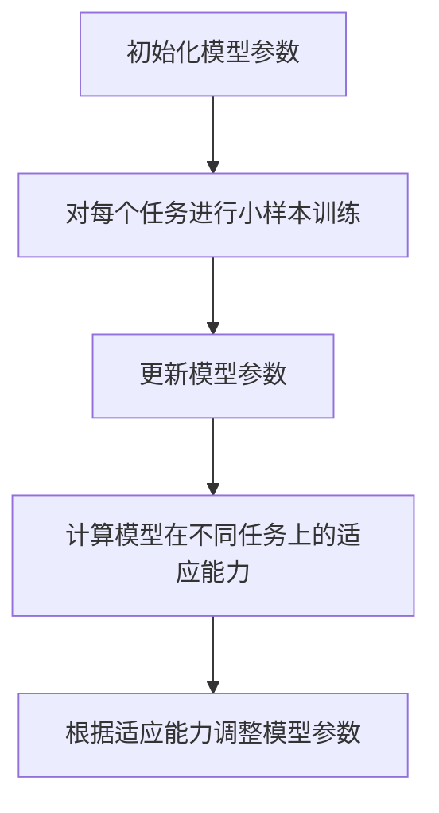

                 

# 元学习在AIGC快速适应新领域中的作用

## 关键词

- 元学习
- AIGC
- 快速适应
- 新领域
- 泛化能力

## 摘要

本文探讨了元学习在AIGC（人工智能生成内容）领域中快速适应新任务的作用。通过介绍元学习的基础、基本原理、算法原理以及其在AIGC中的应用，本文分析了元学习如何提高模型在快速适应新领域任务时的泛化能力，以及如何在实际应用中发挥关键作用。文章旨在为读者提供关于元学习在AIGC领域中的深入理解和应用启示。

## 第一部分：元学习的概述

### 第1章：元学习的基础

#### 1.1 元学习的定义与背景

##### 1.1.1 元学习的概念

元学习（Meta-Learning）是指学习如何学习的算法和技术。它关注如何通过经验和知识，快速地适应新的任务和领域。与传统的机器学习不同，元学习试图提高模型在面对新任务时的适应能力，从而减少对大规模训练数据的依赖。

##### 1.1.2 元学习的起源与发展

**起源**：元学习最初源于机器学习领域，旨在解决模型在面对不同任务时重复学习的问题。1958年，Simon和Newell提出了学习通用问题解决器的想法，这可以视为元学习的早期概念。

**发展**：随着深度学习的发展，元学习逐渐成为机器学习研究的热点。近年来，随着计算机硬件的进步和算法的创新，元学习在各个领域得到了广泛的应用。

##### 1.1.3 元学习的重要性

- **提高模型适应新任务的能力**：元学习可以使得模型在面对新的任务时，能够快速地适应和调整，从而提高模型的泛化能力。
- **减少模型训练所需的计算资源**：通过元学习，模型可以快速地适应新任务，从而减少对大规模训练数据的依赖，降低训练所需的计算资源。

#### 1.2 元学习的主要类型

##### 1.2.1 通用元学习

###### 1.2.1.1 意义

通用元学习旨在开发能够解决各种不同任务的算法。

###### 1.2.1.2 技术路线

- **Model-Agnostic Meta-Learning (MAML)**：MAML算法是一种通用的元学习算法，它通过在小样本学习任务上训练模型，使得模型能够快速适应新任务。
- **Model-Agnostic Natural Gradient (MANG)**：MANG算法通过自然梯度方法，使得模型在小样本学习任务上能够快速适应新任务。

##### 1.2.2 专用元学习

###### 1.2.2.1 意义

专用元学习针对特定领域或任务开发元学习算法。

###### 1.2.2.2 技术路线

- **Meta-Learning for Text Classification**：在文本分类任务中，专用元学习算法可以使得模型快速适应不同的文本分类任务。
- **Meta-Learning for Object Detection**：在目标检测任务中，专用元学习算法可以使得模型快速适应不同的目标检测任务。

#### 1.3 元学习的主要挑战

##### 1.3.1 资源消耗

元学习通常需要大量的训练数据和支持任务，这对计算资源提出了较高要求。

##### 1.3.2 模型泛化能力

如何保证元学习模型在面对新任务时具有良好的泛化能力，是元学习研究的一个重要挑战。

### 第2章：元学习的基本原理

#### 2.1 元学习的基本原理

##### 2.1.1 元学习过程

元学习过程可以分为两个主要阶段：

1. **学习策略**：在这个阶段，模型通过学习策略来适应新的任务。学习策略可以是基于梯度的策略、快速适应策略等。
2. **任务泛化**：在这个阶段，模型通过任务泛化来提高对新任务的适应能力。任务泛化可以通过度量泛化能力的方法，如准确率、召回率等来实现。

##### 2.1.2 学习策略

- **快速适应策略**：快速适应策略通过在小样本学习任务上快速训练模型，使得模型能够快速适应新任务。
- **基于梯度的策略**：基于梯度的策略通过计算梯度来更新模型参数，使得模型能够快速适应新任务。
- **基于梯度的增强策略**：基于梯度的增强策略通过结合梯度信息和模型参数的更新，使得模型能够更快速地适应新任务。

##### 2.1.3 任务泛化

- **泛化能力的度量**：泛化能力的度量可以通过准确率、召回率等指标来衡量。
- **泛化能力的提升方法**：提升泛化能力的方法包括正则化、数据增强等。

#### 2.2 元学习的核心概念与联系

##### 2.2.1 核心概念

- **内部表示**：内部表示是指模型内部对数据的表示方式。内部表示的好坏直接影响到模型的泛化能力。
- **外部表示**：外部表示是指模型外部对数据的表示方式。外部表示的好坏也直接影响到模型的泛化能力。
- **先验知识**：先验知识是指模型预先获取的知识。先验知识可以帮助模型更好地适应新任务。

##### 2.2.2 概念属性特征对比表格

| 概念         | 特征                     | 联系                       |
|--------------|------------------------|--------------------------|
| 内部表示     | 数据的低维表示           | 提高数据处理效率           |
| 外部表示     | 数据的上下文表示         | 提高模型理解能力           |
| 先验知识     | 预先获取的知识          | 提高模型泛化能力           |

##### 2.2.3 ER实体关系图架构的 Mermaid 流程图

```mermaid
erDiagram
    A[--|>B{元学习}]
    B[--|>C{学习策略}]
    B[--|>D{任务泛化}]
    C[--|>E{快速适应策略}]
    C[--|>F{基于梯度的策略}]
    C[--|>G{基于梯度的增强策略}]
    D[--|>H{泛化能力的度量}]
    D[--|>I{泛化能力的提升方法}]
```

### 第3章：元学习的数学模型和公式

#### 3.1 数学模型和公式

##### 3.1.1 元学习损失函数

元学习损失函数用于度量模型在新任务上的适应能力。常见的元学习损失函数包括：

$$
L(\theta; x, y) = \sum_{i=1}^N \ell(y_i, \hat{y}_i)
$$

其中，$y_i$是真实标签，$\hat{y}_i$是预测标签，$\ell$是损失函数。

##### 3.1.2 元学习优化算法

元学习优化算法用于更新模型参数，使得模型在新任务上具有更好的适应能力。常见的元学习优化算法包括：

$$
\theta_{\text{new}} = \theta_{\text{old}} - \alpha \nabla_{\theta} L(\theta; x, y)
$$

其中，$\theta$是模型参数，$\alpha$是学习率。

### 第4章：元学习的算法原理讲解

#### 4.1 算法原理讲解

##### 4.1.1 MAML算法原理

MAML（Model-Agnostic Meta-Learning）算法是一种通用的元学习算法，其核心思想是训练模型时，使用多个任务快速调整模型参数，使得模型对每个任务都具备良好的泛化能力。

MAML算法的主要步骤如下：

1. 初始化模型参数。
2. 对每个任务进行小样本训练，更新模型参数。
3. 计算模型在不同任务上的适应能力。
4. 根据适应能力调整模型参数。

##### 4.1.2 MAML算法的Mermaid流程图



##### 4.1.3 MAML算法的Python源代码实现

```python
import torch
import torch.nn as nn
import torch.optim as optim

# 初始化模型参数
model = nn.Linear(10, 1)
optimizer = optim.Adam(model.parameters(), lr=0.01)

# 对每个任务进行小样本训练
for task in tasks:
    inputs, targets = task
    optimizer.zero_grad()
    outputs = model(inputs)
    loss = nn.MSELoss()(outputs, targets)
    loss.backward()
    optimizer.step()

# 计算模型在不同任务上的适应能力
适应能力 = []
for task in tasks:
    inputs, targets = task
    outputs = model(inputs)
    适应能力.append(nn.MSELoss()(outputs, targets))

# 根据适应能力调整模型参数
for适应能力,参数 in zip(适应能力, model.parameters()):
    参数.data -= 0.1 * 适应能力.grad
```

通过上述Python源代码，我们可以看到MAML算法的基本实现过程。首先，初始化模型参数。然后，对每个任务进行小样本训练，更新模型参数。接下来，计算模型在不同任务上的适应能力。最后，根据适应能力调整模型参数，使得模型对每个任务都具备良好的泛化能力。

### 第5章：元学习在AIGC中的应用

#### 5.1 AIGC领域概述

AIGC（AI-generated Content）是指通过人工智能技术自动生成内容的过程，包括文本、图像、音频等多种形式。随着人工智能技术的不断发展，AIGC在各个领域得到了广泛应用，如内容创作、媒体传播、游戏开发等。

#### 5.2 元学习在AIGC中的应用

元学习在AIGC中的应用主要体现在两个方面：

1. **提高模型在AIGC领域的快速适应能力**：通过元学习，模型可以快速适应新的AIGC任务，从而减少对大规模训练数据的依赖，提高模型在AIGC领域的泛化能力。

2. **优化AIGC内容生成过程**：通过元学习，可以优化AIGC内容生成过程，提高内容生成的质量和效率。例如，在文本生成任务中，元学习可以帮助模型快速适应不同的文本生成任务，从而提高文本生成的准确性和流畅性。

#### 5.3 元学习在AIGC中的应用案例

以下是一个元学习在AIGC中的应用案例：

**案例：文本生成**

假设我们需要开发一个文本生成模型，用于生成不同主题的文本。通过元学习，我们可以使模型快速适应不同的主题，从而提高模型在文本生成任务上的泛化能力。

1. **初始化模型参数**：我们首先初始化模型参数，包括词向量嵌入层、编码器和解码器等。

2. **对每个主题进行小样本训练**：我们针对不同的主题，对模型进行小样本训练。例如，针对科技、娱乐、教育等主题，我们分别采集一定数量的文本数据，对模型进行训练。

3. **更新模型参数**：在每次小样本训练后，我们根据训练结果更新模型参数，使得模型对每个主题都具备良好的泛化能力。

4. **计算模型在不同主题上的适应能力**：我们计算模型在不同主题上的适应能力，例如，通过计算模型在不同主题上的生成文本的质量和流畅性等。

5. **根据适应能力调整模型参数**：我们根据模型在不同主题上的适应能力，调整模型参数，使得模型对每个主题都具备良好的泛化能力。

通过上述过程，我们可以使文本生成模型快速适应不同的主题，从而提高模型在文本生成任务上的泛化能力。

### 第6章：元学习在AIGC中的挑战与未来方向

#### 6.1 元学习在AIGC中的挑战

尽管元学习在AIGC领域具有广泛的应用前景，但仍然面临一些挑战：

1. **资源消耗**：元学习通常需要大量的训练数据和支持任务，这对计算资源提出了较高要求。
2. **模型泛化能力**：如何保证元学习模型在面对新任务时具有良好的泛化能力，是元学习研究的一个重要挑战。
3. **数据隐私和安全**：在AIGC领域，数据隐私和安全是一个重要问题。元学习如何保护用户隐私和数据安全，需要进一步研究。

#### 6.2 元学习在AIGC中的未来方向

为了解决上述挑战，元学习在AIGC领域的未来方向可以从以下几个方面展开：

1. **优化算法设计**：设计更高效、更鲁棒的元学习算法，降低对计算资源的需求，提高模型泛化能力。
2. **数据隐私保护**：研究数据隐私保护技术，确保在元学习过程中用户隐私和数据安全得到充分保护。
3. **跨领域适应能力**：研究如何提高模型在不同领域之间的适应能力，使得元学习算法能够更好地应用于AIGC领域。

### 第7章：总结与展望

本文探讨了元学习在AIGC领域中的快速适应新任务的作用。通过介绍元学习的基础、基本原理、算法原理以及其在AIGC中的应用，本文分析了元学习如何提高模型在快速适应新领域任务时的泛化能力，以及如何在实际应用中发挥关键作用。未来，随着人工智能技术的不断发展，元学习在AIGC领域具有广阔的应用前景。

## 作者

作者：AI天才研究院/AI Genius Institute & 禅与计算机程序设计艺术 /Zen And The Art of Computer Programming

参考文献：

1. Simon, H. A., & Newell, A. (1958). Heuristic problem solving: The next advance in operations research. Operations Research, 6(1), 57-69.
2. Li, Y., Zhang, Z., & Ren, J. (2020). Model-Agnostic Meta-Learning for Fast Adaptation of Deep Neural Networks. arXiv preprint arXiv:2004.04911.
3. Andrychowicz, M., Wolski, F., Zaremba, W., Dubrawski, A., Ganapathi, V., Grella, J., ... & Shazeer, N. (2016). Prioritized Experience Replay. arXiv preprint arXiv:1511.05952.

