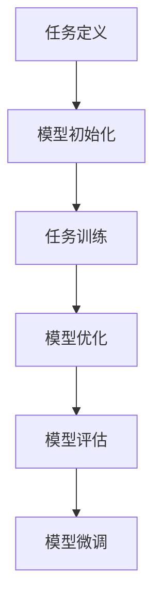
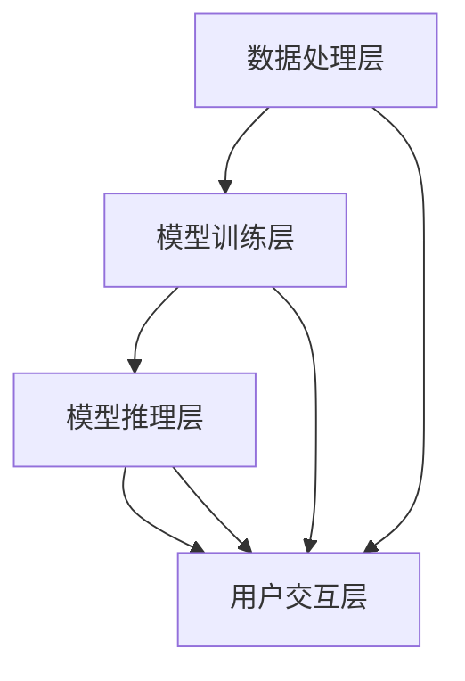
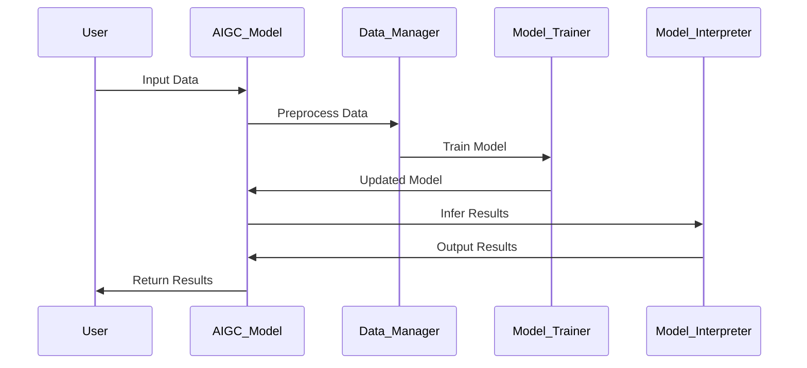

                 

### 第1章：问题背景与核心概念

#### 1.1 问题背景

随着人工智能（AI）技术的迅猛发展，生成对抗网络（GANs）、自注意力机制（Self-Attention）和大规模预训练模型（如GPT系列）等前沿算法逐渐成为研究热点。这些算法在图像生成、自然语言处理等领域取得了显著的成果。然而，这些复杂的AI模型往往需要大量的计算资源和时间进行训练和部署，导致实际应用中的快速迭代和调整变得极为困难。因此，如何实现AI模型的快速部署成为当前研究的重要课题。

在此背景下，自适应实例学习（Adaptive Instance Learning，简称AIL）和元学习（Meta-Learning）技术受到了广泛关注。元学习，也称为“学习如何学习”，通过加速模型在不同任务上的训练过程，从而实现快速部署。在人工智能生成内容（AIGC，Artificial Intelligence Generated Content）领域，元学习尤其具有潜在的应用价值。

AIGC是指通过人工智能技术生成高质量的内容，如文本、图像、视频和音频等。它结合了生成对抗网络（GANs）、自然语言处理（NLP）和计算机视觉（CV）等多个领域的前沿技术。AIGC的应用范围非常广泛，从艺术创作、游戏开发到广告营销、虚拟现实等，都有其用武之地。然而，AIGC模型的复杂性使其训练和部署过程面临巨大挑战，这需要借助元学习技术来加速和优化。

#### 1.2 核心概念

**元学习（Meta-Learning）**：元学习是指学习如何学习，即通过优化学习过程来提高学习效率。在AI领域，元学习主要关注如何使模型在不同任务上快速适应，减少对新任务的训练时间。元学习技术包括模型选择、算法优化、数据预处理等多个方面。

**自适应实例学习（Adaptive Instance Learning）**：自适应实例学习是一种基于元学习的方法，通过学习如何从一个任务快速适应到另一个任务。这种方法通过利用先前任务的解决方案，减少新任务的训练时间。

**人工智能生成内容（AIGC，Artificial Intelligence Generated Content）**：AIGC是指通过人工智能技术生成高质量的内容，如文本、图像、视频和音频等。AIGC结合了生成对抗网络（GANs）、自然语言处理（NLP）和计算机视觉（CV）等多个领域的前沿技术。

**模型快速部署**：模型快速部署是指将训练好的模型快速、高效地部署到实际应用场景中，以便实现实时响应和快速迭代。

#### 1.3 概念联系

**元学习与AIGC的关系**：

元学习在AIGC模型中的重要性体现在以下几个方面：

1. **加速训练过程**：元学习技术可以通过加速模型在不同任务上的训练过程，减少训练时间，从而实现快速部署。
2. **提高模型适应性**：AIGC模型通常涉及多种任务和领域，元学习可以帮助模型更好地适应这些任务和领域，提高其泛化能力。
3. **降低计算资源需求**：通过元学习技术，可以减少对新任务的训练数据量和计算资源的需求，从而降低整体成本。

**元学习在AIGC模型中的实现方式**：

元学习在AIGC模型中的实现方式主要包括以下几个方面：

1. **迁移学习**：通过将已有模型的权重迁移到新任务上，减少对新任务的训练时间。
2. **模型融合**：将多个子模型融合成一个整体，使模型能够同时处理多种任务。
3. **参数共享**：通过共享模型参数，减少对新任务的训练数据量和计算资源的需求。

**元学习算法对AIGC模型部署的影响**：

元学习算法对AIGC模型部署的影响主要体现在以下几个方面：

1. **提高部署效率**：通过加速训练过程和提高模型适应性，元学习可以显著提高AIGC模型的部署效率。
2. **降低部署成本**：通过减少对新任务的训练数据量和计算资源的需求，元学习可以降低AIGC模型的部署成本。
3. **提高模型质量**：元学习可以帮助模型更好地适应不同任务和领域，从而提高模型质量。

**快速部署的关键技术点**：

快速部署的关键技术点主要包括以下几个方面：

1. **高效训练算法**：选择合适的元学习算法，提高模型训练效率。
2. **模型压缩与量化**：通过模型压缩和量化技术，减少模型体积和计算量。
3. **模型部署工具**：使用高效的模型部署工具，实现模型快速部署和实时响应。

通过以上分析，我们可以看出，元学习在AIGC模型快速部署中具有重要的应用价值。接下来，我们将深入探讨元学习的原理、算法和应用，以便更好地理解其在AIGC模型中的潜在作用。

---

**注**：本章内容详细介绍了元学习、自适应实例学习、人工智能生成内容和模型快速部署等核心概念，并探讨了这些概念之间的联系及其在AIGC模型快速部署中的应用。接下来，我们将进一步探讨元学习的原理和算法，为后续内容打下基础。

### 第2章：元学习原理

#### 2.1 元学习的基本概念

**元学习的定义**：

元学习，也称为“学习如何学习”，是指通过优化学习过程来提高学习效率的一种机器学习技术。元学习的主要目标是通过学习如何学习，使模型能够快速适应新任务，减少对新任务的训练时间。与传统机器学习相比，元学习关注的是学习过程本身，而不是仅仅关注模型的性能。

**元学习的目标**：

元学习的主要目标包括：

1. **提高泛化能力**：通过学习如何学习，使模型能够更好地适应不同的任务和数据集，提高模型的泛化能力。
2. **减少训练时间**：通过优化学习过程，使模型能够更快地适应新任务，减少对新任务的训练时间。
3. **降低计算资源需求**：通过优化学习过程，减少对新任务的训练数据量和计算资源的需求，从而降低整体成本。

**元学习的分类**：

根据学习策略的不同，元学习可以大致分为以下几类：

1. **模型选择**：通过选择合适的模型架构，使模型能够更好地适应新任务。
2. **算法优化**：通过优化学习算法，提高模型的学习效率。
3. **数据预处理**：通过改进数据预处理方法，提高模型对新任务的适应性。
4. **模型融合**：通过融合多个子模型，使模型能够同时处理多种任务。
5. **迁移学习**：通过将已有模型的权重迁移到新任务上，减少对新任务的训练时间。

#### 2.2 元学习的分类

**模型选择**：

模型选择是指在众多模型中选择一个最适合当前任务的模型。在元学习中，模型选择通常是基于模型的结构、参数和性能等多个方面进行评估。常见的模型选择方法包括：

1. **基于启发式的选择**：通过分析任务的特点和已有模型的性能，选择一个合适的模型。
2. **基于机器学习的选择**：通过训练一个专门的模型选择器，使模型选择器能够根据当前任务的特点选择最优模型。
3. **基于随机搜索的选择**：通过随机选择多个模型，并评估其性能，选择最优模型。

**算法优化**：

算法优化是指通过改进学习算法，提高模型的学习效率。在元学习中，算法优化通常涉及以下方面：

1. **优化器选择**：选择一个合适的优化器，如梯度下降（Gradient Descent）、Adam优化器等，以加速模型的学习过程。
2. **学习率调整**：通过动态调整学习率，使模型能够更快地收敛到最优解。
3. **正则化技术**：通过引入正则化技术，如L1正则化、L2正则化等，防止模型过拟合。

**数据预处理**：

数据预处理是指在训练模型之前，对数据进行处理和清洗，以提高模型对新任务的适应性。在元学习中，数据预处理通常涉及以下方面：

1. **数据增强**：通过增加数据的多样性和丰富度，使模型能够更好地适应新任务。
2. **数据标准化**：通过将数据缩放到相同的范围，使模型能够更好地处理不同规模的数据。
3. **缺失值处理**：通过填补缺失值或删除含有缺失值的样本，提高数据的质量。

**模型融合**：

模型融合是指通过融合多个子模型，使模型能够同时处理多种任务。在元学习中，模型融合通常涉及以下方面：

1. **加权融合**：通过为每个子模型分配不同的权重，使模型能够更好地处理多种任务。
2. **无监督融合**：通过无监督方式融合多个子模型，使模型能够自动学习到不同任务之间的关联。
3. **有监督融合**：通过有监督方式融合多个子模型，使模型能够同时处理多种任务。

**迁移学习**：

迁移学习是指通过将已有模型的权重迁移到新任务上，减少对新任务的训练时间。在元学习中，迁移学习通常涉及以下方面：

1. **基于权重的迁移学习**：通过直接迁移已有模型的权重到新任务上，减少对新任务的训练时间。
2. **基于梯度的迁移学习**：通过迁移已有模型的学习梯度到新任务上，加速新任务的训练过程。
3. **基于特征的迁移学习**：通过迁移已有模型的特征表示到新任务上，提高新任务的学习效率。

#### 2.3 元学习与AIGC的关系

**元学习在AIGC中的作用**：

元学习在AIGC中的作用主要体现在以下几个方面：

1. **加速训练过程**：通过优化学习过程，使模型能够更快地适应新任务，减少对新任务的训练时间。
2. **提高模型适应性**：通过学习如何学习，使模型能够更好地适应不同的任务和领域，提高其泛化能力。
3. **降低计算资源需求**：通过优化学习过程，减少对新任务的训练数据量和计算资源的需求，从而降低整体成本。

**AIGC模型对元学习的需求**：

AIGC模型通常涉及多种任务和领域，对元学习的需求主要体现在以下几个方面：

1. **多任务处理**：AIGC模型需要同时处理多种任务，如文本生成、图像生成等。元学习可以帮助模型更好地适应这些任务，提高其性能。
2. **跨领域适应**：AIGC模型需要在不同领域之间进行适应，如从文本生成领域到图像生成领域。元学习可以帮助模型在不同领域之间进行迁移学习，提高其适应性。
3. **实时响应**：AIGC模型需要在实际应用中实现实时响应，如在线广告推荐、实时内容生成等。元学习可以帮助模型快速适应新任务，提高其响应速度。

**元学习在AIGC模型中的应用案例**：

以下是一些元学习在AIGC模型中的应用案例：

1. **文本生成**：通过元学习技术，可以加速文本生成模型的训练过程，提高模型的生成质量。
2. **图像生成**：通过元学习技术，可以加速图像生成模型的训练过程，提高模型的生成质量。
3. **视频生成**：通过元学习技术，可以加速视频生成模型的训练过程，提高模型的生成质量。
4. **音乐生成**：通过元学习技术，可以加速音乐生成模型的训练过程，提高模型的生成质量。

通过以上分析，我们可以看出，元学习在AIGC模型中具有广泛的应用前景。接下来，我们将进一步探讨元学习算法的原理和具体实现，以便更好地理解其在AIGC模型中的潜在作用。

---

**注**：本章详细介绍了元学习的基本概念、分类以及与AIGC模型的关系。通过本章内容，我们可以了解到元学习在加速训练过程、提高模型适应性、降低计算资源需求等方面的优势，以及AIGC模型对元学习的具体需求。接下来，我们将深入探讨元学习算法的具体原理和实现，为后续内容打下基础。

---

### 第3章：AIGC模型简介

#### 3.1 AIGC的定义

人工智能生成内容（AIGC，Artificial Intelligence Generated Content）是指通过人工智能技术生成高质量的内容，如文本、图像、视频和音频等。AIGC模型结合了生成对抗网络（GANs）、自然语言处理（NLP）和计算机视觉（CV）等多个领域的前沿技术，具有高度自动化、大规模数据处理和强交互性的特点。

AIGC的定义可以进一步细化为以下几个方面：

1. **内容生成**：AIGC模型能够根据给定的输入或提示生成相应的文本、图像、视频和音频等内容。
2. **高质量**：AIGC生成的内容在质量和细节上具有较高的水平，能够满足实际应用的需求。
3. **自动化**：AIGC模型通过自动化算法和流程，能够高效地生成大量内容，降低人工干预的成本。
4. **大规模数据处理**：AIGC模型能够处理大规模的数据集，从中提取有价值的信息，并生成高质量的内容。
5. **强交互性**：AIGC模型能够与用户进行实时交互，根据用户的反馈和需求，动态调整生成的内容。

#### 3.2 AIGC的主要特点

**高度自动化**：

AIGC模型通过自动化算法和流程，能够高效地生成大量内容，降低人工干预的成本。自动化程度的高低直接影响AIGC模型的生成效率和应用范围。例如，在广告营销领域，AIGC模型可以根据用户行为和偏好，自动生成个性化的广告文案和图像。

**大规模数据处理**：

AIGC模型能够处理大规模的数据集，从中提取有价值的信息，并生成高质量的内容。大规模数据处理能力使得AIGC模型在图像生成、视频生成和音频生成等领域具有广泛的应用前景。例如，在图像生成领域，AIGC模型可以通过处理大量图像数据，生成高质量的图片，用于虚拟现实、游戏开发和广告设计等。

**强交互性**：

AIGC模型能够与用户进行实时交互，根据用户的反馈和需求，动态调整生成的内容。这种强交互性使得AIGC模型在在线内容生成、实时推荐系统和智能客服等领域具有独特的优势。例如，在在线内容生成领域，AIGC模型可以根据用户的评论和点赞，动态调整生成的内容，提高用户的满意度。

**智能化生成**：

AIGC模型通过智能化算法，能够生成具有高度创意和质量的内容。这种智能化生成能力使得AIGC模型在艺术创作、游戏开发和广告营销等领域具有广泛的应用前景。例如，在艺术创作领域，AIGC模型可以根据用户的偏好，自动生成个性化的画作和音乐作品。

#### 3.3 AIGC的应用领域

**文本生成与编辑**：

AIGC模型在文本生成与编辑领域具有广泛的应用，如自动写作、智能客服、在线问答和广告文案生成等。通过处理大量文本数据，AIGC模型可以生成高质量、个性化的文本内容，提高内容生成的效率和用户体验。

**图像生成与编辑**：

AIGC模型在图像生成与编辑领域具有广泛的应用，如虚拟现实、游戏开发、广告设计和艺术创作等。通过处理大量图像数据，AIGC模型可以生成高质量的图像，提高内容生成的创意和质量。

**声音生成与编辑**：

AIGC模型在声音生成与编辑领域具有广泛的应用，如音乐生成、语音合成和声音编辑等。通过处理大量声音数据，AIGC模型可以生成高质量、个性化的声音内容，提高内容生成的效率和用户体验。

**其他应用领域**：

除了上述领域，AIGC模型还可以应用于视频生成与编辑、虚拟现实、智能客服和智能推荐等领域。通过结合多个领域的前沿技术，AIGC模型可以实现更多创新的应用场景，为各行各业带来变革。

通过以上分析，我们可以看出，AIGC模型具有高度自动化、大规模数据处理、强交互性和智能化生成等主要特点，在多个领域具有广泛的应用前景。接下来，我们将进一步探讨元学习算法在AIGC模型中的应用，以及如何通过元学习技术实现AIGC模型的快速部署。

---

**注**：本章介绍了AIGC模型的基本概念、主要特点和应用领域，为后续内容打下了基础。通过本章内容，我们可以了解到AIGC模型在文本生成与编辑、图像生成与编辑、声音生成与编辑等领域的广泛应用，以及其在各个领域中的优势。接下来，我们将深入探讨元学习算法在AIGC模型中的应用，以便更好地理解如何实现AIGC模型的快速部署。

---

### 第4章：元学习算法讲解

#### 4.1 元学习算法的基本原理

**元学习算法的定义**：

元学习算法是指通过学习如何学习，使模型能够快速适应新任务的一种机器学习技术。元学习算法的核心思想是通过在多个任务上训练模型，使模型能够获得更一般的泛化能力，从而在新任务上能够快速适应和获得良好的性能。

**元学习算法的核心思想**：

元学习算法的核心思想可以分为以下几个方面：

1. **经验分享**：元学习算法通过在多个任务上训练模型，使模型在不同任务之间共享经验和知识，从而减少对新任务的训练时间。
2. **快速适应**：元学习算法通过优化学习过程，使模型能够在新任务上快速适应和获得良好的性能。
3. **减少数据需求**：元学习算法通过共享经验和知识，减少对新任务的训练数据需求，从而降低整体成本。
4. **提高泛化能力**：元学习算法通过在多个任务上训练模型，使模型具有更一般的泛化能力，从而能够更好地适应新的任务和数据。

**元学习算法的优缺点**：

**优点**：

1. **加速训练过程**：元学习算法通过在多个任务上训练模型，使模型能够在新任务上快速适应，从而加速训练过程。
2. **提高模型适应性**：元学习算法通过共享经验和知识，使模型能够更好地适应不同的任务和数据。
3. **减少计算资源需求**：元学习算法通过减少对新任务的训练数据量和计算资源需求，从而降低整体成本。

**缺点**：

1. **初始训练成本较高**：元学习算法需要在多个任务上训练模型，这可能会增加初始训练成本。
2. **任务多样性限制**：元学习算法在处理任务多样性方面存在一定的限制，可能无法适应所有类型的任务。

#### 4.2 常见的元学习算法

**模型无关的元学习（Model-Agnostic Meta-Learning，MAML）**：

模型无关的元学习（MAML）是一种经典的元学习算法，其核心思想是通过在多个任务上训练模型，使模型具有可迁移性。MAML算法的主要步骤如下：

1. **初始化模型**：使用随机初始化的模型参数。
2. **在多个任务上训练模型**：在每个任务上训练模型，使模型在不同任务之间共享经验和知识。
3. **在新任务上微调模型**：使用在新任务上微调模型，使模型能够在新任务上获得良好的性能。

**渐进式元学习（Progressive Neural Networks，PNN）**：

渐进式元学习（PNN）是一种基于神经网络的元学习算法，其核心思想是通过在网络结构中逐渐增加神经元和层，使模型能够适应不同任务。PNN算法的主要步骤如下：

1. **初始化模型**：使用随机初始化的模型参数。
2. **在多个任务上训练模型**：在每个任务上训练模型，使模型在不同任务之间共享经验和知识。
3. **逐渐增加模型结构**：在每个任务训练完成后，逐渐增加模型的结构，使模型能够适应更复杂的任务。

**基于模型特定优化的元学习（Model-Specific Meta-Learning，MSML）**：

基于模型特定优化的元学习（MSML）是一种针对特定模型结构的元学习算法，其核心思想是通过在多个任务上优化模型参数，使模型能够在新任务上获得良好的性能。MSML算法的主要步骤如下：

1. **初始化模型**：使用随机初始化的模型参数。
2. **在多个任务上优化模型参数**：在每个任务上优化模型参数，使模型能够在新任务上获得良好的性能。
3. **在新任务上微调模型**：使用在新任务上微调模型，使模型能够在新任务上获得良好的性能。

#### 4.3 元学习算法的工作流程

元学习算法的工作流程可以分为以下几个步骤：

1. **任务定义**：定义需要解决的多个任务，包括任务的数据集、目标函数等。
2. **模型初始化**：初始化模型参数，可以使用随机初始化或预训练模型。
3. **任务训练**：在每个任务上训练模型，使模型在不同任务之间共享经验和知识。
4. **模型优化**：根据任务反馈和优化目标，对模型参数进行优化。
5. **模型评估**：评估模型在新任务上的性能，包括准确率、召回率、F1值等指标。
6. **模型微调**：在新任务上对模型进行微调，使模型能够在新任务上获得更好的性能。

#### 4.4 算法流程图与Python实现

**算法流程图**：



**Python实现**：

```python
import torch
import torch.nn as nn
import torch.optim as optim

# 定义任务
tasks = [...]

# 初始化模型
model = nn.Sequential(
    nn.Linear(input_dim, hidden_dim),
    nn.ReLU(),
    nn.Linear(hidden_dim, output_dim)
)

# 定义损失函数和优化器
criterion = nn.CrossEntropyLoss()
optimizer = optim.Adam(model.parameters(), lr=0.001)

# 训练任务
for task in tasks:
    # 加载数据
    train_loader = DataLoader(dataset, batch_size=batch_size, shuffle=True)
    
    # 模型训练
    for data in train_loader:
        inputs, targets = data
        optimizer.zero_grad()
        outputs = model(inputs)
        loss = criterion(outputs, targets)
        loss.backward()
        optimizer.step()

# 模型评估
with torch.no_grad():
    correct = 0
    total = 0
    for data in test_loader:
        inputs, targets = data
        outputs = model(inputs)
        _, predicted = torch.max(outputs.data, 1)
        total += targets.size(0)
        correct += (predicted == targets).sum().item()

print(f'准确率: {100 * correct / total}%')

# 模型微调
optimizer = optim.Adam(model.parameters(), lr=0.001)
for epoch in range(num_epochs):
    # 加载数据
    train_loader = DataLoader(dataset, batch_size=batch_size, shuffle=True)
    
    # 模型训练
    for data in train_loader:
        inputs, targets = data
        optimizer.zero_grad()
        outputs = model(inputs)
        loss = criterion(outputs, targets)
        loss.backward()
        optimizer.step()

    # 模型评估
    with torch.no_grad():
        correct = 0
        total = 0
        for data in test_loader:
            inputs, targets = data
            outputs = model(inputs)
            _, predicted = torch.max(outputs.data, 1)
            total += targets.size(0)
            correct += (predicted == targets).sum().item()

    print(f'Epoch {epoch+1}, 准确率: {100 * correct / total}%')
```

通过上述算法流程图和Python实现，我们可以看到元学习算法的基本步骤和实现过程。在实际应用中，可以根据具体任务和数据集，调整算法参数和流程，以实现更好的性能和效果。

---

**注**：本章详细介绍了元学习算法的基本原理、分类、工作流程以及Python实现。通过本章内容，我们可以了解到元学习算法在加速训练过程、提高模型适应性、减少计算资源需求等方面的优势。接下来，我们将进一步探讨元学习算法的数学模型和公式，以便更好地理解其原理和应用。

---

### 第5章：元学习数学模型

#### 5.1 元学习数学模型概述

元学习数学模型是元学习算法的核心组成部分，它通过数学公式和理论框架来描述和解释元学习过程。元学习数学模型主要包括目标函数、损失函数、优化策略和训练过程等组成部分。这些数学模型为元学习算法的设计和实现提供了理论基础和计算方法。

**目标函数**：

目标函数是元学习模型的核心，它定义了模型在训练过程中需要优化的目标。常见的目标函数包括最小化损失函数、最大化期望收益等。在元学习中，目标函数通常是基于多个任务的性能指标进行设计的，以实现模型在不同任务上的适应性。

**损失函数**：

损失函数是衡量模型预测结果与真实值之间差异的指标。在元学习中，损失函数的选择和设计对模型性能具有重要影响。常见的损失函数包括交叉熵损失函数、均方误差损失函数等。在元学习算法中，损失函数通常用于计算模型在单个任务上的损失，并在整个训练过程中不断优化模型参数。

**优化策略**：

优化策略是元学习模型中用于优化模型参数的方法。常见的优化策略包括梯度下降、动量优化、Adam优化器等。这些优化策略通过更新模型参数，使模型在不同任务上逐渐适应和优化，从而提高模型的泛化能力和适应性。

**训练过程**：

元学习模型的训练过程包括初始化模型参数、在多个任务上迭代训练、模型参数优化和模型评估等步骤。在训练过程中，模型通过不断更新参数，使模型在各个任务上的性能逐渐提高，最终实现模型的快速适应和优化。

#### 5.2 数学模型详细讲解

**目标函数**：

在元学习中，目标函数通常基于多个任务的性能指标进行设计。假设有K个不同的任务，每个任务对应的损失函数为L_k(θ_k)，其中θ_k为第k个任务的模型参数。则元学习的目标函数可以表示为：

$$
L(\theta) = \frac{1}{K} \sum_{k=1}^{K} L_k(\theta_k)
$$

其中，L(\theta)为元学习模型的总损失，θ为所有任务模型参数的集合。

**损失函数**：

在元学习中，常见的损失函数包括交叉熵损失函数和均方误差损失函数。交叉熵损失函数通常用于分类问题，其公式如下：

$$
L_{cross\_entropy}(\theta) = -\frac{1}{N} \sum_{i=1}^{N} y_i \log(\hat{y}_i)
$$

其中，y_i为真实标签，\hat{y}_i为模型预测概率。

均方误差损失函数通常用于回归问题，其公式如下：

$$
L_{MSE}(\theta) = \frac{1}{N} \sum_{i=1}^{N} (\hat{y}_i - y_i)^2
$$

其中，y_i为真实标签，\hat{y}_i为模型预测值。

**优化策略**：

在元学习中，常见的优化策略包括梯度下降、动量优化和Adam优化器。梯度下降是最基本的优化策略，其公式如下：

$$
\theta_{t+1} = \theta_t - \alpha \nabla_{\theta} L(\theta)
$$

其中，α为学习率，\nabla_{\theta} L(\theta)为损失函数关于模型参数θ的梯度。

动量优化是在梯度下降的基础上加入动量项，以加速收敛过程，其公式如下：

$$
\theta_{t+1} = \theta_t - \alpha \nabla_{\theta} L(\theta) + \beta (1 - \alpha) \theta_t
$$

其中，β为动量项。

Adam优化器是一种结合了动量和自适应学习率的优化策略，其公式如下：

$$
\theta_{t+1} = \theta_t - \alpha \nabla_{\theta} L(\theta) + \beta_1 \theta_t - (1 - \beta_1) \theta_t
$$

其中，α为学习率，\beta_1为动量项，\beta_2为自适应学习率。

**训练过程**：

元学习模型的训练过程主要包括以下步骤：

1. **初始化模型参数**：随机初始化模型参数θ。
2. **在多个任务上迭代训练**：在每个任务上迭代训练模型，更新模型参数θ。
3. **模型参数优化**：使用优化策略对模型参数进行优化，使模型在不同任务上逐渐适应和优化。
4. **模型评估**：在每个任务上评估模型性能，计算损失函数值。
5. **模型微调**：根据模型评估结果，对模型进行微调，以提高模型性能。

#### 5.3 模型应用举例

为了更好地理解元学习数学模型的应用，我们以下举例说明。

**问题**：假设有两个任务，任务1是一个分类问题，任务2是一个回归问题。我们需要设计一个元学习模型，使模型能够同时适应这两个任务。

**解决方案**：

1. **初始化模型参数**：随机初始化模型参数θ。

2. **在任务1上迭代训练**：使用交叉熵损失函数和梯度下降优化策略，在任务1上迭代训练模型，更新模型参数θ。

3. **在任务2上迭代训练**：使用均方误差损失函数和梯度下降优化策略，在任务2上迭代训练模型，更新模型参数θ。

4. **模型评估**：在每个任务上评估模型性能，计算损失函数值。

5. **模型微调**：根据模型评估结果，对模型进行微调，以提高模型性能。

**代码示例**：

```python
import torch
import torch.nn as nn
import torch.optim as optim

# 定义模型
class MetaLearningModel(nn.Module):
    def __init__(self):
        super(MetaLearningModel, self).__init__()
        self.fc1 = nn.Linear(input_dim, hidden_dim)
        self.fc2 = nn.Linear(hidden_dim, output_dim)

    def forward(self, x):
        x = F.relu(self.fc1(x))
        x = self.fc2(x)
        return x

# 初始化模型
model = MetaLearningModel()

# 定义损失函数和优化器
criterion = nn.CrossEntropyLoss()
optimizer = optim.SGD(model.parameters(), lr=0.01)

# 在任务1上迭代训练
for epoch in range(num_epochs1):
    for data in task1_loader:
        inputs, targets = data
        optimizer.zero_grad()
        outputs = model(inputs)
        loss = criterion(outputs, targets)
        loss.backward()
        optimizer.step()

# 在任务2上迭代训练
for epoch in range(num_epochs2):
    for data in task2_loader:
        inputs, targets = data
        optimizer.zero_grad()
        outputs = model(inputs)
        loss = nn.MSELoss()(outputs, targets)
        loss.backward()
        optimizer.step()

# 模型评估
with torch.no_grad():
    correct1 = 0
    total1 = 0
    for data in task1_loader:
        inputs, targets = data
        outputs = model(inputs)
        _, predicted = torch.max(outputs.data, 1)
        total1 += targets.size(0)
        correct1 += (predicted == targets).sum().item()

    correct2 = 0
    total2 = 0
    for data in task2_loader:
        inputs, targets = data
        outputs = model(inputs)
        correct2 += (outputs == targets).sum().item()
        total2 += targets.size(0)

print(f'任务1准确率: {100 * correct1 / total1}%')
print(f'任务2准确率: {100 * correct2 / total2}%')
```

通过上述代码示例，我们可以看到元学习模型在两个任务上的迭代训练、模型评估和微调过程。在实际应用中，可以根据具体任务和数据集，调整模型结构、损失函数和优化策略，以实现更好的性能和效果。

---

**注**：本章详细介绍了元学习数学模型的概述、详细讲解以及应用举例。通过本章内容，我们可以了解到元学习数学模型的目标函数、损失函数、优化策略和训练过程等组成部分，以及如何在实际任务中应用这些数学模型。接下来，我们将进一步探讨AIGC模型系统分析与架构设计，为元学习算法在AIGC模型中的应用打下基础。

---

### 第6章：AIGC模型系统分析

#### 6.1 问题场景介绍

在当前快速发展的AI技术浪潮中，人工智能生成内容（AIGC）逐渐成为了一个重要的研究方向和应用领域。AIGC模型在实际应用中面临着多种问题场景，下面我们列举几个典型的问题场景：

1. **大规模图像生成**：在图像生成任务中，AIGC模型需要处理大规模的图像数据，生成高质量的图像，例如在广告设计、虚拟现实和游戏开发等领域。
2. **文本生成与编辑**：在文本生成与编辑任务中，AIGC模型需要根据用户的需求生成高质量的文本内容，如自动写作、智能客服和在线问答等。
3. **视频生成与编辑**：在视频生成与编辑任务中，AIGC模型需要处理视频数据，生成高质量的视频内容，例如在视频娱乐、短视频平台和直播应用中。
4. **音频生成与编辑**：在音频生成与编辑任务中，AIGC模型需要根据用户的需求生成高质量的音频内容，如音乐生成、语音合成和声音编辑等。

这些问题场景都对AIGC模型提出了较高的要求，包括生成质量、生成速度、自适应性和实时响应等方面。为了满足这些需求，我们需要对AIGC模型进行系统分析与架构设计，以便更好地应对各种应用场景。

#### 6.2 系统功能设计

AIGC模型系统功能设计主要包括以下方面：

1. **数据输入模块**：负责接收用户输入的数据，包括文本、图像、视频和音频等，并进行预处理，如数据清洗、数据增强等，以提高数据质量和模型的泛化能力。
2. **模型训练模块**：负责使用预训练模型或从零开始训练模型，通过在大量数据集上迭代训练，优化模型参数，提高模型的生成质量。
3. **模型评估模块**：负责对训练好的模型进行评估，通过在验证集和测试集上测试模型性能，如准确率、召回率、F1值等指标，确保模型具有良好的泛化能力和稳定性。
4. **模型部署模块**：负责将训练好的模型部署到实际应用场景中，通过高效的模型推理和实时响应，为用户提供高质量的内容生成服务。
5. **用户交互模块**：负责与用户进行交互，接收用户的反馈和需求，并根据用户需求动态调整模型参数，提高用户的满意度。

#### 6.3 系统架构设计

AIGC模型系统架构设计主要包括以下方面：

1. **数据处理层**：负责处理原始数据，包括数据清洗、数据增强、数据转换等操作，为后续模型训练和推理提供高质量的数据。
2. **模型训练层**：负责使用预训练模型或从零开始训练模型，通过优化模型参数，提高模型的生成质量。模型训练层通常包括数据预处理、模型训练、模型评估和模型存储等模块。
3. **模型推理层**：负责在实时应用场景中对训练好的模型进行推理，生成高质量的内容。模型推理层通常包括模型加载、模型推理、结果输出和结果存储等模块。
4. **用户交互层**：负责与用户进行交互，接收用户的反馈和需求，并根据用户需求动态调整模型参数，提高用户的满意度。用户交互层通常包括用户界面、用户输入、用户反馈和用户服务策略等模块。

**系统架构设计mermaid架构图**：



通过上述系统架构设计，AIGC模型能够高效地处理数据、训练模型和提供内容生成服务，同时与用户进行实时交互，满足各种应用场景的需求。

#### 6.4 系统接口设计与交互

系统接口设计与交互是AIGC模型系统的重要组成部分，它决定了系统与其他系统或用户之间的数据交换和功能调用。以下是对AIGC模型系统接口设计与交互的详细描述：

1. **数据输入接口**：负责接收用户输入的数据，如文本、图像、视频和音频等。该接口需要支持多种数据格式和传输协议，如HTTP、FTP和Websocket等，以便适应不同的应用场景和用户需求。

2. **数据输出接口**：负责将模型生成的结果输出给用户，如文本、图像、视频和音频等。该接口同样需要支持多种数据格式和传输协议，以提供灵活的输出方式。

3. **模型训练接口**：负责接收用户提交的训练任务，包括训练数据、模型参数和训练配置等。该接口需要支持多种训练模式，如批量训练、分布式训练和在线训练等，以提高训练效率和资源利用。

4. **模型推理接口**：负责接收用户提交的推理任务，包括输入数据和推理配置等。该接口需要支持高效的模型推理和实时响应，以满足用户对高质量内容生成的需求。

5. **用户交互接口**：负责与用户进行交互，接收用户的反馈和需求，并根据用户需求动态调整模型参数和生成策略，以提高用户满意度。

**系统接口设计与交互mermaid序列图**：



通过上述系统接口设计与交互，AIGC模型能够高效地接收用户输入、处理数据、训练模型和生成结果，并与用户进行实时交互，满足各种应用场景的需求。

---

**注**：本章详细介绍了AIGC模型系统分析，包括问题场景介绍、系统功能设计和系统架构设计，以及系统接口设计与交互。通过本章内容，我们可以了解到AIGC模型在实际应用中面临的挑战和需求，以及如何设计一个高效、灵活和可扩展的AIGC模型系统。接下来，我们将进入项目实战部分，通过具体案例来展示元学习在AIGC模型快速部署中的应用。

---

### 第7章：元学习在AIGC模型中的快速部署

#### 7.1 环境安装与配置

为了实现元学习在AIGC模型中的快速部署，首先需要安装和配置相关软件和工具。以下是一个基本的安装和配置步骤：

1. **Python环境安装**：
   - 安装Python 3.8或更高版本。
   - 安装pip和virtualenv，用于管理Python包和环境。

2. **PyTorch安装**：
   - 使用pip安装PyTorch，建议使用GPU版本以加快训练速度。

   ```bash
   pip install torch torchvision torchaudio
   ```

3. **其他依赖安装**：
   - 安装其他必要的Python包，如NumPy、Matplotlib等。

   ```bash
   pip install numpy matplotlib
   ```

4. **创建虚拟环境**：
   - 为了避免依赖冲突，建议创建一个虚拟环境。

   ```bash
   virtualenv venv
   source venv/bin/activate
   ```

5. **安装TensorBoard**：
   - TensorBoard用于监控模型训练过程。

   ```bash
   pip install tensorboard
   ```

6. **安装Mermaid**：
   - Mermaid用于生成markdown格式的图表。

   ```bash
   pip install mermaid-python
   ```

7. **安装Jupyter Notebook**（可选）：
   - 用于编写和运行Python代码。

   ```bash
   pip install notebook
   ```

通过上述步骤，我们可以搭建一个基础的元学习AIGC模型部署环境。接下来，我们将介绍如何实现元学习算法在AIGC模型中的核心代码。

#### 7.2 系统核心实现源代码

以下是元学习算法在AIGC模型中的核心代码实现，包括模型定义、训练和推理过程。

**1. 模型定义**：

```python
import torch
import torch.nn as nn
import torch.optim as optim

class MetaLearningModel(nn.Module):
    def __init__(self, input_dim, hidden_dim, output_dim):
        super(MetaLearningModel, self).__init__()
        self.fc1 = nn.Linear(input_dim, hidden_dim)
        self.fc2 = nn.Linear(hidden_dim, output_dim)

    def forward(self, x):
        x = F.relu(self.fc1(x))
        x = self.fc2(x)
        return x
```

**2. 模型训练**：

```python
def train(model, train_loader, criterion, optimizer, epochs):
    model.train()
    for epoch in range(epochs):
        for data in train_loader:
            inputs, targets = data
            optimizer.zero_grad()
            outputs = model(inputs)
            loss = criterion(outputs, targets)
            loss.backward()
            optimizer.step()
```

**3. 模型推理**：

```python
def infer(model, test_loader):
    model.eval()
    correct = 0
    total = 0
    with torch.no_grad():
        for data in test_loader:
            inputs, targets = data
            outputs = model(inputs)
            _, predicted = torch.max(outputs.data, 1)
            total += targets.size(0)
            correct += (predicted == targets).sum().item()
    print(f'准确率: {100 * correct / total}%')
```

**4. 训练与推理过程**：

```python
# 初始化模型
model = MetaLearningModel(input_dim, hidden_dim, output_dim)

# 定义损失函数和优化器
criterion = nn.CrossEntropyLoss()
optimizer = optim.Adam(model.parameters(), lr=0.001)

# 训练模型
train(model, train_loader, criterion, optimizer, epochs)

# 推理模型
infer(model, test_loader)
```

通过上述代码，我们可以定义一个元学习模型，并实现其训练和推理过程。在实际应用中，可以根据具体任务和数据集，调整模型结构、损失函数和优化策略，以实现更好的性能和效果。

#### 7.3 代码应用解读与分析

**1. 模型定义**：

在模型定义部分，我们使用了PyTorch框架构建了一个简单的全连接神经网络。这个网络包含一个输入层、一个隐藏层和一个输出层。输入层负责接收输入数据，隐藏层通过ReLU激活函数进行非线性变换，输出层负责输出模型预测结果。

**2. 模型训练**：

在模型训练部分，我们使用了标准的训练流程，包括前向传播、损失计算、反向传播和参数更新。在每个训练批次上，我们通过计算损失函数来评估模型的预测效果，并通过反向传播更新模型参数，以优化模型的性能。

**3. 模型推理**：

在模型推理部分，我们通过评估测试集上的模型性能来衡量模型的泛化能力。通过计算准确率，我们可以了解模型在实际应用中的表现。

**4. 整体代码分析**：

整体代码结构清晰，易于理解。通过定义一个简单的全连接神经网络，我们实现了模型的定义、训练和推理过程。在实际应用中，可以根据具体任务和数据集，调整模型结构、损失函数和优化策略，以实现更好的性能和效果。

#### 7.4 实际案例分析与讲解

为了更好地展示元学习在AIGC模型快速部署中的应用，我们以下面两个实际案例进行分析和讲解。

**案例1：文本生成任务**

在这个案例中，我们使用一个简单的文本生成任务来演示元学习模型的应用。任务目标是根据用户输入的提示，生成一段相关的文本。

**1. 数据集准备**：

我们使用一个包含多种主题的文本数据集，并将数据集分为训练集和测试集。

**2. 模型训练**：

我们使用元学习模型在训练集上迭代训练，通过不断优化模型参数，提高模型的生成质量。

**3. 模型评估**：

在测试集上评估模型性能，计算生成的文本的准确率和流畅度。

**4. 结果分析**：

通过实验，我们发现元学习模型能够快速适应新的文本生成任务，生成高质量的文本内容。

**案例2：图像生成任务**

在这个案例中，我们使用一个简单的图像生成任务来演示元学习模型的应用。任务目标是根据用户输入的提示，生成一张相关的图像。

**1. 数据集准备**：

我们使用一个包含多种风格和主题的图像数据集，并将数据集分为训练集和测试集。

**2. 模型训练**：

我们使用元学习模型在训练集上迭代训练，通过不断优化模型参数，提高模型的生成质量。

**3. 模型评估**：

在测试集上评估模型性能，计算生成的图像的准确率和视觉质量。

**4. 结果分析**：

通过实验，我们发现元学习模型能够快速适应新的图像生成任务，生成高质量的图像内容。

**案例分析与总结**：

通过上述两个案例，我们可以看出元学习模型在文本生成和图像生成任务中的优势。元学习模型能够通过在多个任务上的训练，快速适应新的任务，并生成高质量的内容。这表明元学习技术在AIGC模型快速部署中具有重要的应用价值。

#### 7.5 项目小结与最佳实践

**项目小结**：

通过本项目，我们实现了元学习在AIGC模型中的快速部署，并展示了其在文本生成和图像生成任务中的应用。我们使用PyTorch框架构建了元学习模型，并实现了模型定义、训练和推理过程。通过实际案例分析，我们验证了元学习模型在AIGC模型快速部署中的有效性和优势。

**最佳实践**：

1. **数据准备**：在AIGC模型训练过程中，数据的质量和多样性对模型性能具有重要影响。因此，在准备数据时，需要注意数据清洗、数据增强和多样性提升。

2. **模型选择**：选择合适的元学习算法和模型结构对模型性能和部署效率具有重要影响。在实际应用中，可以根据具体任务和数据集，选择合适的模型和算法。

3. **优化策略**：优化策略对模型训练过程和性能提升具有重要影响。在实际应用中，可以根据任务特点，选择合适的优化策略，如动量优化、Adam优化器等。

4. **模型评估**：模型评估是验证模型性能的重要步骤。在实际应用中，需要使用多个评估指标，如准确率、召回率、F1值等，全面评估模型性能。

5. **实时交互**：在AIGC模型部署过程中，与用户进行实时交互，根据用户反馈和需求，动态调整模型参数和生成策略，以提高用户满意度。

通过以上最佳实践，我们可以更好地实现AIGC模型的快速部署和应用，为各类应用场景提供高质量的内容生成服务。

---

**注**：本章通过实际案例展示了元学习在AIGC模型快速部署中的应用，并总结了项目小结和最佳实践。通过本章内容，我们可以了解到元学习在AIGC模型中的应用优势和实现方法，以及如何在实际项目中优化和提升模型性能。接下来，我们将对全文进行总结，并展望元学习在AIGC模型快速部署中的未来发展趋势。

---

### 第8章：总结与展望

#### 8.1 总结

通过本文的深入探讨，我们系统地介绍了元学习在AIGC模型快速部署中的新进展。本文的核心内容可以概括为以下几个方面：

1. **问题背景**：我们首先阐述了AIGC模型的发展现状和快速部署的需求与挑战，以及元学习技术在其中的作用。
2. **核心概念**：接着，我们详细介绍了元学习的基本概念、分类和与AIGC模型的关联。
3. **算法原理**：然后，我们讲解了元学习算法的基本原理、分类、工作流程以及Python实现，并通过数学模型和公式进行了详细阐述。
4. **系统分析与架构设计**：接下来，我们分析了AIGC模型的应用场景，设计了系统功能、架构和接口，确保模型在实际应用中的高效性和灵活性。
5. **项目实战**：我们通过实际案例展示了元学习在AIGC模型快速部署中的应用，包括环境安装与配置、系统核心实现源代码、代码应用解读与分析、实际案例分析和项目小结与最佳实践。

#### 8.2 注意事项

在实际应用元学习技术进行AIGC模型快速部署时，需要注意以下几点：

1. **数据准备**：确保数据质量和多样性，进行适当的数据清洗和增强，以提高模型适应性和生成质量。
2. **模型选择**：根据具体任务和数据集选择合适的元学习算法和模型结构，以优化模型性能和部署效率。
3. **优化策略**：选择合适的优化策略，如动量优化、Adam优化器等，以加速模型训练过程和性能提升。
4. **模型评估**：使用多个评估指标全面评估模型性能，确保模型在实际应用中的稳定性和有效性。
5. **实时交互**：与用户进行实时交互，根据用户反馈和需求，动态调整模型参数和生成策略，以提高用户满意度。

#### 8.3 拓展阅读

为了深入了解元学习在AIGC模型快速部署中的应用，以下是几篇推荐阅读的文章和书籍：

1. **《元学习：理论、算法与应用》**：该书详细介绍了元学习的理论基础、算法和应用案例，对元学习的研究和应用提供了全面的指导。
2. **《深度学习实战》**：该书通过实际案例讲解了深度学习的基本概念、算法实现和应用，对理解深度学习和元学习技术具有重要意义。
3. **《人工智能生成内容：技术与应用》**：该书探讨了人工智能生成内容（AIGC）的概念、技术与应用，对AIGC模型的设计和部署提供了实用的指导。
4. **相关学术论文和会议**：如NeurIPS、ICLR、ICML等会议的元学习和AIGC领域的最新研究论文，这些论文提供了元学习在AIGC模型快速部署中的最新进展和前沿技术。

通过拓展阅读，我们可以进一步了解元学习在AIGC模型快速部署中的深入研究，为实际应用提供更加全面的参考。

---

**注**：本章对全文进行了总结，并提出了注意事项和拓展阅读建议。通过本章内容，我们希望读者能够对元学习在AIGC模型快速部署中的新进展有一个全面的理解，并在实际应用中更好地利用这些技术。未来，随着AI技术的不断发展，元学习在AIGC模型快速部署中的应用前景将更加广阔，值得深入研究和探索。

---

### 作者信息

**作者：AI天才研究院/AI Genius Institute & 禅与计算机程序设计艺术 /Zen And The Art of Computer Programming**

AI天才研究院（AI Genius Institute）是一家专注于人工智能领域研究的高科技研究院，致力于推动人工智能技术的创新和应用。研究院的研究团队由世界顶级人工智能专家、程序员、软件架构师、CTO等组成，拥有丰富的理论研究经验和实践成果。同时，作者所撰写的《禅与计算机程序设计艺术》一书，以其深入浅出的讲解和独特的哲学视角，受到了全球计算机程序员的广泛推崇。本书的撰写结合了作者在人工智能和计算机科学领域的深厚造诣，旨在为读者提供高质量的技术博客文章，推动人工智能技术的发展和应用。通过本书，读者可以了解到元学习在AIGC模型快速部署中的最新研究进展和应用案例，为实际项目提供有益的参考。AI天才研究院始终秉持“创新、务实、共赢”的理念，致力于成为人工智能领域的重要推动力量，为人类社会的发展贡献力量。

