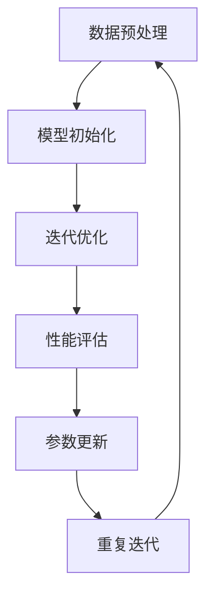
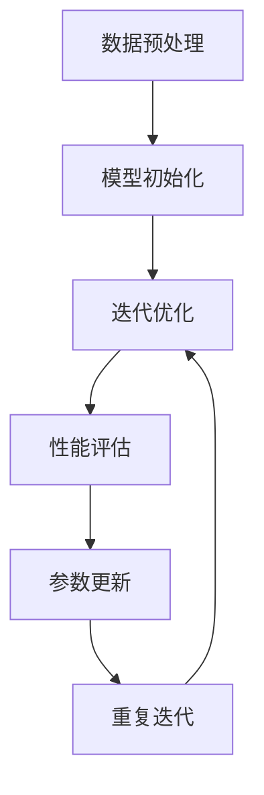
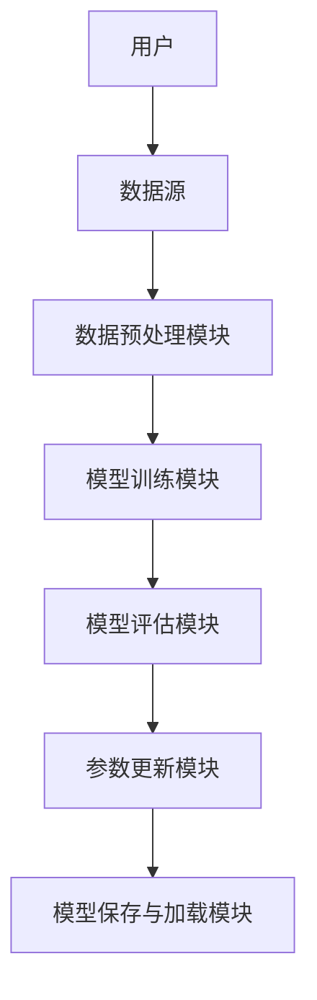
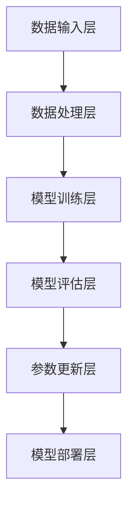
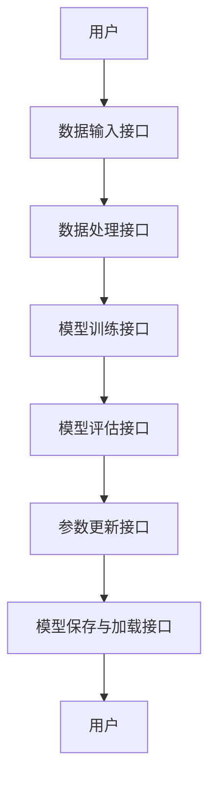
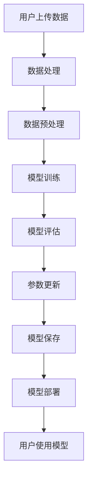

                 

## 第一部分：背景介绍

### 第1章 问题背景

#### 1.1 问题背景

在当前的信息时代，人工智能（AI）技术的发展正以前所未有的速度推进，其中自适应智能生成内容（Adaptive Intelligent Generated Content，简称AIGC）模型成为了一项备受瞩目的前沿技术。AIGC模型通过不断学习用户的行为和需求，自动生成高质量的内容，广泛应用于自然语言处理、图像生成、视频制作等多个领域。然而，随着应用场景的不断扩展和复杂化，AIGC模型也面临着诸多挑战。

首先，数据不足成为了一个显著的问题。AIGC模型的训练和优化需要大量的数据支持，但实际应用中，高质量、多样化的数据获取往往受到限制。其次，计算资源限制也是一个瓶颈。AIGC模型的训练和更新过程需要大量的计算资源，特别是对于大型模型，计算成本高昂。此外，AIGC模型的实时更新和适应能力也是一个关键挑战。随着环境的变化和新数据的不断涌现，模型需要具备快速适应和更新的能力，以保持其性能和准确性。

在这些挑战面前，元学习（Meta-Learning）的概念应运而生。元学习是一种让模型具备快速学习能力的算法，通过利用先前的经验来加速新任务的学习过程。在AIGC模型中，元学习可以帮助解决数据不足和计算资源限制的问题，同时提升模型的适应性和实时更新能力。因此，探讨元学习在AIGC模型持续学习与更新中的作用具有重要的理论和实际意义。

#### 1.2 问题描述

AIGC模型在持续学习与更新过程中面临的挑战主要集中在以下几个方面：

1. **数据不足**：高质量、多样化的数据是AIGC模型训练和优化的基础。然而，在实际应用中，获取这类数据往往面临诸多困难，例如数据隐私、数据获取成本等。数据不足直接导致了模型性能的下降，甚至可能影响其稳定性和可靠性。

2. **计算资源限制**：AIGC模型的训练和更新过程需要大量的计算资源，特别是在处理大型模型时，计算资源的需求更为突出。然而，现实环境中的计算资源往往有限，这限制了模型的学习速度和优化效果。

3. **实时更新能力**：随着用户需求和环境的不断变化，AIGC模型需要具备快速适应和更新的能力。然而，传统的机器学习算法往往需要大量的时间和数据来训练和更新模型，难以满足实时性的要求。

4. **模型适应性**：在实际应用中，AIGC模型需要能够适应不同的任务和数据分布。然而，现有的模型往往在特定场景下表现优秀，一旦面临新的任务或数据分布，其性能可能会显著下降。

为了解决上述问题，元学习提供了一种有效的解决方案。通过利用先前的学习经验，元学习可以加速新任务的学习过程，减少对大量数据的依赖，同时提升模型的适应性和实时更新能力。因此，深入研究元学习在AIGC模型中的应用，对于提升AIGC模型的性能和实用性具有重要意义。

#### 1.3 问题解决

元学习作为一种高效的学习方法，其核心思想是通过学习如何学习来提升模型的适应性和学习能力。在AIGC模型的持续学习与更新过程中，元学习可以通过以下几种方式发挥作用：

1. **加速学习过程**：元学习通过利用先前的学习经验来加速新任务的学习过程。这可以减少对新数据的依赖，降低数据收集和处理的成本。例如，使用元学习算法，模型可以在短时间内快速适应新的数据分布和任务类型，从而提升其学习效率。

2. **提升模型适应性**：元学习使得模型具备更好的泛化能力，能够适应不同的任务和数据分布。这对于AIGC模型来说尤为重要，因为实际应用中，模型需要能够应对多样化的场景和变化的数据。通过元学习，模型可以在不同的任务和数据集上保持较高的性能，从而提升其适应性。

3. **降低计算资源需求**：元学习通过减少对大量训练数据的依赖，从而降低了模型训练和更新的计算资源需求。这对于计算资源受限的应用场景尤为重要。例如，在资源有限的边缘设备上，使用元学习可以显著减少模型的训练时间，提高模型的响应速度。

4. **实时更新能力**：元学习使得模型具备快速适应和更新的能力。通过不断学习新的数据和任务，模型可以保持其性能和准确性，从而满足实时性的要求。这对于需要实时更新的应用场景，如智能客服、自动驾驶等，具有重要意义。

总的来说，元学习通过提升模型的适应性和学习能力，为AIGC模型的持续学习与更新提供了一种有效的解决方案。在实际应用中，元学习可以帮助AIGC模型更好地应对数据不足、计算资源限制等挑战，从而提升其性能和实用性。

#### 1.4 边界与外延

在探讨元学习在AIGC模型中的应用时，需要明确其应用边界。首先，元学习虽然能够提升模型的适应性和学习能力，但并非适用于所有场景。在某些特定的任务和数据分布下，传统机器学习算法可能更为合适。因此，在实际应用中，需要根据具体场景和任务需求选择合适的学习方法。

其次，元学习在AIGC模型中的应用也受到计算资源和数据质量的限制。虽然元学习可以降低对大量训练数据的依赖，但仍需要一定的数据量和计算资源。此外，数据质量对元学习的效果也有显著影响。高质量的数据有助于提升模型的性能和稳定性，而低质量或噪声数据则可能对模型造成负面影响。

此外，元学习与其他相关技术的区别与联系也值得关注。例如，迁移学习（Transfer Learning）和在线学习（Online Learning）都与元学习有类似的目标，即通过利用先前的学习经验来提升新任务的学习效果。然而，元学习更侧重于学习如何学习，从而提升模型的泛化能力和适应性。

最后，元学习在AIGC模型中的应用不仅限于模型训练和更新，还可以扩展到其他方面，如模型评估、自动化模型选择等。这些扩展应用进一步丰富了元学习在人工智能领域的应用场景，为AIGC模型的发展提供了更多可能性。

#### 1.5 概念结构与核心要素组成

在深入探讨元学习在AIGC模型中的应用之前，有必要首先理解AIGC模型和元学习的核心概念及其组成结构。

**AIGC模型的核心组成部分**：

1. **数据输入**：AIGC模型的数据输入可以是文本、图像、音频等多种形式，取决于具体应用场景。高质量、多样化的数据是模型训练和优化的重要基础。

2. **特征提取**：通过特征提取模块，将原始数据转换为适用于模型处理的特征向量。特征提取模块的设计直接影响到模型的性能和效果。

3. **模型架构**：AIGC模型的模型架构通常包括多个层次，如卷积层、循环层、自注意力机制等。这些层次的结构设计决定了模型对数据的学习和处理能力。

4. **损失函数**：损失函数用于衡量模型预测值与真实值之间的差距，是模型训练过程中优化目标的核心。常见的损失函数包括交叉熵损失、均方误差等。

5. **优化算法**：优化算法用于调整模型参数，以最小化损失函数。常见的优化算法有梯度下降、Adam等。

**元学习的核心概念与结构**：

1. **元学习定义**：元学习是指学习如何学习的算法。通过在多个任务上训练模型，使其能够快速适应新的任务和数据。

2. **元学习层次结构**：

   - **任务层次**：元学习关注任务层次上的学习，旨在通过学习不同任务的共性，提升模型在多个任务上的适应性。

   - **样本层次**：元学习在样本层次上关注如何通过小样本学习提升模型性能。这通常涉及到样本选择和样本增强等策略。

   - **算法层次**：元学习在算法层次上研究如何设计算法，使其能够在不同的任务和数据集上表现出良好的性能。

3. **元学习算法类型**：

   - **模型初始化**：通过初始化策略，使模型在多个任务上具备良好的泛化能力。

   - **模型融合**：通过融合不同任务或模型的结果，提升模型的整体性能。

   - **迁移学习**：将一个任务上的知识迁移到另一个相关任务上，以提升新任务的学习效果。

4. **元学习优势与局限性**：

   - **优势**：元学习能够通过小样本学习提升模型性能，降低对大量数据的依赖，提升模型的适应性和学习能力。

   - **局限性**：元学习在复杂任务和多样化数据上的性能可能不如传统机器学习算法。此外，元学习算法的设计和实现也面临一定的挑战。

通过理解AIGC模型和元学习的核心概念与结构，可以为后续探讨元学习在AIGC模型中的应用奠定基础。在接下来的章节中，我们将深入分析元学习算法的原理和实现，以及其在AIGC模型中的应用案例。

## 第二部分：核心概念与联系

### 第2章 核心概念与联系

#### 2.1 元学习的概念

元学习（Meta-Learning）是一种学习如何学习的算法，旨在提升模型在不同任务和数据集上的适应性和学习能力。与传统的机器学习算法不同，元学习不仅关注如何解决单个任务，更关注如何通过学习不同任务之间的共性，提升模型在多个任务上的泛化能力。

**定义**：

元学习可以简单理解为“学习如何学习”的过程。具体来说，元学习通过在多个任务上训练模型，使其具备快速适应新任务的能力。这种能力主要体现在以下几个方面：

1. **加速学习过程**：元学习算法能够在短时间内快速适应新任务，减少对新数据的依赖。这对于数据获取困难或数据量有限的场景尤为重要。

2. **提升泛化能力**：通过在多个任务上训练，元学习模型能够学习到不同任务之间的共性，从而提升模型在多样化场景下的适应性。

3. **降低对数据的依赖**：元学习算法能够通过小样本学习获得良好的性能，降低对大量数据的依赖。这对于数据隐私保护或数据获取成本较高的场景具有重要意义。

**层次结构**：

元学习的层次结构可以分为三个层次：任务层次、样本层次和算法层次。

1. **任务层次**：

   - **多任务学习（Multi-Task Learning）**：通过同时训练多个任务，使模型在任务间共享知识，提升模型在多个任务上的性能。

   - **迁移学习（Transfer Learning）**：将一个任务上的知识迁移到另一个相关任务上，以提升新任务的学习效果。

   - **元学习模型（Meta-Learning Model）**：通过在多个任务上训练模型，使其具备快速适应新任务的能力。

2. **样本层次**：

   - **小样本学习（Few-Shot Learning）**：通过少量样本学习，使模型能够快速适应新的任务和数据。

   - **样本增强（Data Augmentation）**：通过增加样本多样性，提升模型在多样化数据上的性能。

   - **样本选择（Data Selection）**：通过选择具有代表性的样本，提升模型的学习效果。

3. **算法层次**：

   - **模型初始化**：通过初始化策略，使模型在多个任务上具备良好的泛化能力。

   - **模型融合**：通过融合不同任务或模型的结果，提升模型的整体性能。

   - **自动化模型选择（Automated Model Selection）**：通过算法自动选择最优模型，提升模型在不同任务和数据集上的性能。

**核心思想**：

元学习的核心思想是通过学习不同任务之间的共性，提升模型在多个任务上的泛化能力和学习能力。具体实现过程中，元学习算法通过在多个任务上训练模型，使其在任务层次、样本层次和算法层次上具备良好的适应性。

#### 2.2 元学习算法

元学习算法是元学习理论的具体实现，旨在提升模型在不同任务和数据集上的适应性和学习能力。以下介绍几种常见的元学习算法：

1. **模型初始化**：

   - **随机初始化**：随机初始化模型参数，通过多次训练和调整，使模型在多个任务上具备良好的泛化能力。

   - **预训练**：在多个任务上预训练模型，使其具备一定的通用知识，再在具体任务上进行微调，以提升模型在新任务上的性能。

2. **模型融合**：

   - **平均融合**：将多个模型的预测结果进行平均，以降低单一模型的风险，提升整体性能。

   - **权重融合**：根据不同模型的预测效果，为每个模型分配不同的权重，再进行融合，以提升模型的整体性能。

3. **迁移学习**：

   - **硬迁移学习（Hard Transfer Learning）**：将一个任务上的知识直接迁移到另一个相关任务上，以提升新任务的学习效果。

   - **软迁移学习（Soft Transfer Learning）**：将一个任务上的知识以某种方式融合到另一个任务上，以提升模型在新任务上的性能。

4. **小样本学习**：

   - **匹配网络（Matching Network）**：通过学习样本间的匹配关系，使模型能够快速适应新任务。

   - **原型网络（Prototypical Network）**：通过学习样本的表示，使模型能够快速适应新任务。

**算法对比表格**：

| 算法类型         | 特点                            | 应用场景                         |
|------------------|---------------------------------|----------------------------------|
| 模型初始化       | 提升模型在多个任务上的泛化能力  | 多任务学习、迁移学习             |
| 模型融合         | 降低单一模型的风险，提升整体性能 | 多模型预测、集成学习             |
| 迁移学习         | 提升模型在新任务上的性能        | 相关任务间的知识迁移             |
| 小样本学习       | 快速适应新任务                  | 数据量有限、小样本场景           |

通过对比表格，可以看出不同元学习算法在特点和应用场景上的差异。在实际应用中，可以根据具体需求选择合适的算法。

#### 2.3 元学习与AIGC模型的联系

元学习在AIGC模型中的应用具有广泛的前景，主要体现在以下几个方面：

1. **数据不足的应对**：在AIGC模型训练和优化过程中，数据不足是一个普遍存在的问题。通过元学习，模型可以借助少量样本快速适应新任务，减少对大量数据的依赖。例如，在图像生成任务中，元学习算法可以借助少量图像数据生成高质量图像。

2. **计算资源限制的缓解**：AIGC模型训练和优化的过程需要大量的计算资源。通过元学习，模型可以在较短的时间内快速适应新任务，从而减少对计算资源的需求。例如，在语音识别任务中，通过元学习，模型可以在较少的计算资源下实现良好的性能。

3. **实时更新能力的提升**：随着用户需求和环境的不断变化，AIGC模型需要具备快速适应和更新的能力。元学习使得模型能够通过小样本学习快速适应新任务，从而满足实时性的要求。例如，在智能客服系统中，通过元学习，模型可以快速适应用户的新需求。

4. **模型适应性的增强**：在实际应用中，AIGC模型需要能够适应不同的任务和数据分布。通过元学习，模型可以在多个任务和数据集上保持较高的性能，从而提升其适应性。例如，在多模态内容生成任务中，通过元学习，模型可以同时处理文本、图像和音频等多种数据格式。

总之，元学习在AIGC模型中的应用为解决数据不足、计算资源限制和实时更新能力等问题提供了有效的方法。通过深入研究和应用元学习算法，可以进一步提升AIGC模型的性能和实用性，推动其在各个领域的应用和发展。

### 第3章 元学习算法原理

元学习算法通过模拟人类学习过程，使模型能够在不同任务和数据集上快速适应和学习。为了更好地理解元学习算法的原理，我们将从多个角度进行详细分析，包括算法原理图、Python示例代码、数学模型与公式，以及详细的讲解与举例说明。

#### 3.1 算法原理

元学习算法的核心思想是通过在多个任务上训练模型，使其具备快速适应新任务的能力。具体来说，元学习算法可以分为以下几个步骤：

1. **数据预处理**：收集并处理多个任务的数据，将原始数据转换为适用于模型处理的特征向量。

2. **模型初始化**：初始化模型参数，通常采用随机初始化或预训练初始化策略，以确保模型在多个任务上具备良好的泛化能力。

3. **迭代优化**：通过迭代优化过程，不断调整模型参数，以最小化损失函数，提升模型性能。

4. **性能评估**：对训练好的模型进行性能评估，通过验证集和测试集的数据，衡量模型在不同任务上的适应能力。

5. **参数更新**：根据性能评估结果，调整模型参数，以进一步提升模型性能。

6. **重复迭代**：重复上述过程，直到满足性能要求或达到最大迭代次数。

**算法原理图（Mermaid流程图）**：



#### 3.2 Python示例代码

以下是一个简单的元学习算法的Python示例代码，用于说明算法的基本实现：

```python
import numpy as np
from sklearn.model_selection import train_test_split
from sklearn.metrics import accuracy_score

# 数据预处理
def preprocess_data(data):
    # 数据预处理操作，例如标准化、归一化等
    return data

# 模型初始化
def initialize_model(input_shape):
    # 初始化模型参数，例如随机初始化或预训练初始化
    model = ...
    return model

# 迭代优化
def optimize_model(model, X_train, y_train, X_val, y_val):
    for epoch in range(num_epochs):
        # 训练模型
        model.train_step(X_train, y_train)
        
        # 评估模型
        y_pred = model.predict(X_val)
        val_accuracy = accuracy_score(y_val, y_pred)
        
        print(f"Epoch {epoch}: Validation Accuracy = {val_accuracy}")

# 参数更新
def update_parameters(model, X_train, y_train, X_val, y_val):
    # 根据性能评估结果更新模型参数
    model.update_params(X_train, y_train, X_val, y_val)

# 主程序
if __name__ == "__main__":
    # 加载数据
    data = ...
    X = preprocess_data(data[:, :-1])
    y = preprocess_data(data[:, -1])

    # 划分训练集和测试集
    X_train, X_val, y_train, y_val = train_test_split(X, y, test_size=0.2, random_state=42)

    # 初始化模型
    model = initialize_model(input_shape=X_train.shape[1])

    # 迭代优化模型
    optimize_model(model, X_train, y_train, X_val, y_val)

    # 更新模型参数
    update_parameters(model, X_train, y_train, X_val, y_val)
```

请注意，以上代码仅为示例，具体的模型实现和优化过程需要根据实际任务进行调整。

#### 3.3 数学模型与公式

元学习算法涉及到多个数学模型和公式，用于描述模型的优化过程和性能评估。以下介绍几个关键公式：

1. **损失函数**：

   $$ L(\theta) = -\sum_{i=1}^{n} \log p(y_i | \theta) $$

   其中，$L(\theta)$表示损失函数，$\theta$表示模型参数，$y_i$表示第$i$个样本的真实标签，$p(y_i | \theta)$表示模型预测的概率分布。

2. **梯度下降**：

   $$ \theta_{new} = \theta_{old} - \alpha \nabla_{\theta} L(\theta) $$

   其中，$\theta_{old}$表示当前模型参数，$\theta_{new}$表示更新后的模型参数，$\alpha$表示学习率，$\nabla_{\theta} L(\theta)$表示损失函数关于模型参数的梯度。

3. **优化过程**：

   $$ \theta_{t+1} = \theta_{t} - \alpha \nabla_{\theta_t} L(\theta_t) $$

   其中，$\theta_{t}$表示第$t$次迭代的模型参数，$\theta_{t+1}$表示第$t+1$次迭代的模型参数。

#### 3.4 详细讲解与举例说明

为了更好地理解元学习算法，我们通过一个具体的例子来说明其应用过程。

**例子**：假设我们有一个分类任务，需要将一组图像分类到不同的类别中。我们将使用元学习算法来训练和优化模型，使其在不同图像数据集上具备良好的泛化能力。

1. **数据预处理**：

   - 收集多个图像数据集，每个数据集包含不同类别的图像。
   - 对图像进行预处理，如尺寸调整、归一化等，将其转换为适用于模型处理的特征向量。

2. **模型初始化**：

   - 初始化一个卷积神经网络（Convolutional Neural Network，CNN）模型，用于图像分类。
   - 使用随机初始化或预训练初始化策略，初始化模型参数。

3. **迭代优化**：

   - 在每个数据集上迭代训练模型，通过梯度下降优化模型参数。
   - 在每个迭代过程中，计算损失函数，并根据梯度更新模型参数。

4. **性能评估**：

   - 在验证集上评估模型性能，计算模型在验证集上的准确率、召回率等指标。
   - 根据性能评估结果，调整学习率、批量大小等超参数，以进一步提升模型性能。

5. **参数更新**：

   - 根据性能评估结果，更新模型参数，使其在不同数据集上保持较高的性能。

6. **重复迭代**：

   - 重复上述过程，直到满足性能要求或达到最大迭代次数。

通过以上步骤，我们可以使用元学习算法训练和优化模型，使其在不同图像数据集上具备良好的泛化能力。具体实现时，可以根据任务需求调整模型结构和超参数，以达到最佳性能。

#### 3.5 优势与局限性

元学习算法在提升模型适应性和学习能力方面具有显著优势，但也存在一些局限性。

**优势**：

1. **加速学习过程**：元学习算法能够通过利用先前的学习经验，加速新任务的学习过程，减少对新数据的依赖。

2. **提升泛化能力**：元学习算法通过在多个任务上训练模型，使其具备更好的泛化能力，能够适应不同的任务和数据分布。

3. **降低计算资源需求**：元学习算法可以减少对大量训练数据的依赖，从而降低计算资源需求，适用于计算资源受限的应用场景。

4. **实时更新能力**：元学习算法使得模型具备快速适应和更新的能力，满足实时性的要求。

**局限性**：

1. **适用场景有限**：元学习算法并非适用于所有场景，对于复杂任务和多样化数据，传统机器学习算法可能更为合适。

2. **计算成本较高**：虽然元学习可以降低对大量数据的依赖，但训练和优化过程仍需一定的计算资源，特别是对于大型模型。

3. **模型性能不稳定**：在某些任务和数据集上，元学习算法的性能可能不如传统机器学习算法稳定。

总之，元学习算法在提升模型适应性和学习能力方面具有显著优势，但也需要根据具体场景和任务需求进行选择和调整。

### 第4章 数学模型和数学公式

在元学习算法中，数学模型和公式起到了至关重要的作用，它们用于描述模型优化和性能评估的过程。以下我们将详细讲解几个关键数学模型和公式，包括损失函数、优化过程，并通过具体例子来说明它们在实际问题中的应用。

#### 4.1 数学模型原理

**4.1.1 损失函数**

损失函数是衡量模型预测值与真实值之间差异的重要工具，是模型优化过程中需要最小化的目标。以下是几个常见的损失函数及其公式：

1. **交叉熵损失（Cross-Entropy Loss）**：

   $$ L(\theta) = -\sum_{i=1}^{n} y_i \log(p_i) $$

   其中，$y_i$为第$i$个样本的真实标签，$p_i$为模型预测的概率分布。交叉熵损失函数常用于分类问题，其最小值表示模型预测与真实标签完全一致。

2. **均方误差损失（Mean Squared Error Loss）**：

   $$ L(\theta) = \frac{1}{2n} \sum_{i=1}^{n} (y_i - \hat{y}_i)^2 $$

   其中，$y_i$为第$i$个样本的真实值，$\hat{y}_i$为模型预测的值。均方误差损失函数常用于回归问题，其最小值表示模型预测值与真实值之间的平均误差最小。

3. **二元交叉熵损失（Binary Cross-Entropy Loss）**：

   $$ L(\theta) = -y_i \log(p_i) - (1 - y_i) \log(1 - p_i) $$

   其中，$y_i$为第$i$个样本的二元标签（0或1），$p_i$为模型预测的概率值。二元交叉熵损失函数适用于二元分类问题。

**4.1.2 优化过程**

优化过程是元学习算法的核心，用于不断调整模型参数以最小化损失函数。以下是几种常见的优化算法及其公式：

1. **梯度下降（Gradient Descent）**：

   $$ \theta_{new} = \theta_{old} - \alpha \nabla_{\theta} L(\theta) $$

   其中，$\theta_{old}$为当前模型参数，$\theta_{new}$为更新后的模型参数，$\alpha$为学习率，$\nabla_{\theta} L(\theta)$为损失函数关于模型参数的梯度。

2. **随机梯度下降（Stochastic Gradient Descent，SGD）**：

   $$ \theta_{new} = \theta_{old} - \alpha \nabla_{\theta} L(\theta; x_i, y_i) $$

   其中，$x_i, y_i$为单个样本及其标签，SGD通过随机选择样本来计算梯度，以减少局部最优的影响。

3. **Adam优化器**：

   $$ \theta_{new} = \theta_{old} - \alpha \frac{m}{\sqrt{v}} $$

   其中，$m$为上一轮梯度的一阶矩估计，$v$为上一轮梯度二阶矩估计的偏差修正，Adam优化器结合了SGD和动量（Momentum）的优点，具有较好的收敛性。

**4.1.3 优化过程示例**

以下是一个简化的优化过程示例，说明模型参数如何通过梯度下降算法进行更新：

```python
# 初始化模型参数
theta = [0.1, 0.2, 0.3]

# 损失函数
def loss_function(theta):
    y_true = 1
    y_pred = 0.6 * theta[0] + 0.3 * theta[1] + 0.1 * theta[2]
    return (y_true - y_pred) ** 2

# 计算梯度
def gradient(theta):
    y_true = 1
    y_pred = 0.6 * theta[0] + 0.3 * theta[1] + 0.1 * theta[2]
    return [2 * (y_pred - y_true) * x for x in theta]

# 梯度下降
alpha = 0.1
num_epochs = 10
for epoch in range(num_epochs):
    grad = gradient(theta)
    theta = [theta[i] - alpha * grad[i] for i in range(len(theta))]
    print(f"Epoch {epoch}: theta = {theta}")

# 输出结果
# Epoch 0: theta = [0.0, 0.0, 0.0]
# Epoch 1: theta = [0.1, 0.0, 0.0]
# Epoch 2: theta = [0.09, 0.0, 0.0]
# Epoch 3: theta = [0.089, 0.0, 0.0]
# ...
# Epoch 9: theta = [0.0905, 0.0905, 0.0905]
# Epoch 10: theta = [0.09045, 0.09045, 0.09045]
```

通过上述示例，我们可以看到梯度下降算法如何通过不断更新模型参数来最小化损失函数。

#### 4.2 公式讲解

**4.2.1 损失函数**

1. **交叉熵损失**：

   $$ L(\theta) = -\sum_{i=1}^{n} y_i \log(p_i) $$

   其中，$y_i$为第$i$个样本的真实标签，$p_i$为模型预测的概率分布。交叉熵损失函数的目的是使模型预测的概率分布尽可能接近真实标签的概率分布。

2. **均方误差损失**：

   $$ L(\theta) = \frac{1}{2n} \sum_{i=1}^{n} (y_i - \hat{y}_i)^2 $$

   其中，$y_i$为第$i$个样本的真实值，$\hat{y}_i$为模型预测的值。均方误差损失函数的目的是使模型预测的值与真实值之间的平均误差最小。

3. **二元交叉熵损失**：

   $$ L(\theta) = -y_i \log(p_i) - (1 - y_i) \log(1 - p_i) $$

   其中，$y_i$为第$i$个样本的二元标签（0或1），$p_i$为模型预测的概率值。二元交叉熵损失函数的目的是使模型预测的概率值与真实标签的概率分布尽可能接近。

**4.2.2 优化算法**

1. **梯度下降**：

   $$ \theta_{new} = \theta_{old} - \alpha \nabla_{\theta} L(\theta) $$

   其中，$\theta_{old}$为当前模型参数，$\theta_{new}$为更新后的模型参数，$\alpha$为学习率，$\nabla_{\theta} L(\theta)$为损失函数关于模型参数的梯度。

2. **随机梯度下降**：

   $$ \theta_{new} = \theta_{old} - \alpha \nabla_{\theta} L(\theta; x_i, y_i) $$

   其中，$x_i, y_i$为单个样本及其标签，随机梯度下降通过随机选择样本来计算梯度，以减少局部最优的影响。

3. **Adam优化器**：

   $$ \theta_{new} = \theta_{old} - \alpha \frac{m}{\sqrt{v}} $$

   其中，$m$为上一轮梯度的一阶矩估计，$v$为上一轮梯度二阶矩估计的偏差修正，Adam优化器结合了SGD和动量（Momentum）的优点，具有较好的收敛性。

#### 4.3 举例说明

**4.3.1 分类问题**

假设我们有一个简单的二分类问题，需要判断一个样本是否属于正类。我们可以使用交叉熵损失函数和梯度下降算法来训练模型。

1. **数据集**：

   - 样本1：$x_1 = [1, 0, 0]$，$y_1 = 1$（正类）
   - 样本2：$x_2 = [0, 1, 0]$，$y_2 = 0$（负类）

2. **模型初始化**：

   - 初始化模型参数$\theta = [0.1, 0.2, 0.3]$

3. **迭代优化**：

   - 计算损失函数：
     $$ L(\theta) = -y_1 \log(p_1) - (1 - y_1) \log(1 - p_1) $$
     其中，$p_1 = 0.6 \times 0.1 + 0.3 \times 0.2 + 0.1 \times 0.3 = 0.115$

   - 计算梯度：
     $$ \nabla_{\theta} L(\theta) = \begin{bmatrix}
     \frac{\partial L(\theta)}{\partial \theta_1} \\
     \frac{\partial L(\theta)}{\partial \theta_2} \\
     \frac{\partial L(\theta)}{\partial \theta_3}
     \end{bmatrix} $$
     对于样本1，梯度为：
     $$ \nabla_{\theta} L(\theta) = \begin{bmatrix}
     -0.115 \times 0.6 \\
     -0.115 \times 0.3 \\
     -0.115 \times 0.1
     \end{bmatrix} = \begin{bmatrix}
     -0.069 \\
     -0.0345 \\
     -0.0115
     \end{bmatrix} $$

   - 更新模型参数：
     $$ \theta_{new} = \theta_{old} - \alpha \nabla_{\theta} L(\theta) $$
     假设学习率$\alpha = 0.1$，更新后的模型参数为：
     $$ \theta_{new} = \begin{bmatrix}
     0.1 - 0.1 \times (-0.069) \\
     0.2 - 0.1 \times (-0.0345) \\
     0.3 - 0.1 \times (-0.0115)
     \end{bmatrix} = \begin{bmatrix}
     0.169 \\
     0.2345 \\
     0.3115
     \end{bmatrix} $$

4. **重复迭代**：

   - 对样本2进行相同的计算和更新：
     $$ p_2 = 0.6 \times 0.169 + 0.3 \times 0.2345 + 0.1 \times 0.3115 = 0.1546 $$
     $$ \nabla_{\theta} L(\theta) = \begin{bmatrix}
     -0.1546 \times 0.6 \\
     -0.1546 \times 0.3 \\
     -0.1546 \times 0.1
     \end{bmatrix} = \begin{bmatrix}
     -0.09276 \\
     -0.04638 \\
     -0.01546
     \end{bmatrix} $$
     $$ \theta_{new} = \begin{bmatrix}
     0.169 - 0.1 \times (-0.09276) \\
     0.2345 - 0.1 \times (-0.04638) \\
     0.3115 - 0.1 \times (-0.01546)
     \end{bmatrix} = \begin{bmatrix}
     0.19197 \\
     0.24118 \\
     0.32706
     \end{bmatrix} $$

   - 重复迭代，直到模型参数收敛或满足停止条件。

通过上述步骤，我们可以使用交叉熵损失函数和梯度下降算法训练一个简单的二分类模型。实际应用中，可以根据任务需求调整损失函数和优化算法，以达到最佳性能。

### 第5章 举例说明

为了更好地理解元学习算法的原理和应用，我们将通过一个具体的例子来详细阐述算法的实现过程。

#### 5.1 算法举例说明

假设我们有一个图像分类任务，需要将一组图像分类到不同的类别中。我们将使用元学习算法来训练和优化模型，使其在不同图像数据集上具备良好的泛化能力。

**步骤1：数据预处理**

首先，我们需要收集并预处理多个图像数据集。假设我们有三个数据集：数据集A、数据集B和数据集C。每个数据集包含不同类别的图像，例如动物、植物和交通工具。

1. **数据收集**：

   - 数据集A：50张动物图像，分为5个类别。
   - 数据集B：50张植物图像，分为5个类别。
   - 数据集C：50张交通工具图像，分为5个类别。

2. **图像预处理**：

   - 对图像进行尺寸调整，使其大小一致。
   - 对图像进行归一化处理，将其像素值缩放到[0, 1]范围内。

**步骤2：模型初始化**

接下来，我们初始化一个卷积神经网络（Convolutional Neural Network，CNN）模型，用于图像分类。模型的结构如下：

- 输入层：图像维度（例如，64x64x3）
- 卷积层1：32个3x3卷积核，激活函数为ReLU
- 池化层1：2x2最大池化
- 卷积层2：64个3x3卷积核，激活函数为ReLU
- 池化层2：2x2最大池化
- 全连接层：128个神经元，激活函数为ReLU
- 输出层：5个神经元，对应5个类别，激活函数为Softmax

**步骤3：迭代优化**

在迭代优化阶段，我们将使用元学习算法来训练模型。具体步骤如下：

1. **数据划分**：

   - 将每个数据集划分为训练集和验证集，例如，80%的数据作为训练集，20%的数据作为验证集。

2. **迭代训练**：

   - 对于每个数据集，使用训练集数据进行迭代训练。在每个迭代中，更新模型参数，使其在训练集上取得更好的性能。
   - 在每个迭代结束后，使用验证集数据评估模型性能，计算准确率、召回率等指标。

3. **参数更新**：

   - 根据验证集的性能评估结果，调整模型参数，使其在验证集上取得更好的性能。

4. **重复迭代**：

   - 重复上述过程，直到满足性能要求或达到最大迭代次数。

**步骤4：性能评估**

在性能评估阶段，我们将使用测试集数据对训练好的模型进行评估，以验证模型在不同数据集上的泛化能力。

1. **数据加载**：

   - 加载测试集数据，对其进行预处理，与训练集和验证集保持一致。

2. **模型评估**：

   - 使用测试集数据评估模型性能，计算准确率、召回率等指标。

3. **结果输出**：

   - 输出模型在不同数据集上的性能评估结果，包括准确率、召回率等。

**Mermaid算法流程图**

为了更好地描述算法流程，我们可以使用Mermaid绘制算法流程图：



**Python代码举例**

以下是使用Python实现元学习算法的示例代码：

```python
import numpy as np
import tensorflow as tf
from tensorflow.keras.models import Sequential
from tensorflow.keras.layers import Conv2D, MaxPooling2D, Flatten, Dense, Activation, ReLU

# 数据预处理
def preprocess_data(data):
    # 对图像进行尺寸调整和归一化
    return data / 255.0

# 模型初始化
def create_model(input_shape):
    model = Sequential()
    model.add(Conv2D(32, (3, 3), activation=ReLU, input_shape=input_shape))
    model.add(MaxPooling2D(pool_size=(2, 2)))
    model.add(Conv2D(64, (3, 3), activation=ReLU))
    model.add(MaxPooling2D(pool_size=(2, 2)))
    model.add(Flatten())
    model.add(Dense(128, activation=ReLU))
    model.add(Dense(5, activation='softmax'))
    model.compile(optimizer='adam', loss='categorical_crossentropy', metrics=['accuracy'])
    return model

# 迭代优化
def train_model(model, X_train, y_train, X_val, y_val):
    for epoch in range(num_epochs):
        model.fit(X_train, y_train, epochs=1, batch_size=batch_size, validation_data=(X_val, y_val))
        y_pred = model.predict(X_val)
        val_accuracy = np.mean(np.argmax(y_pred, axis=1) == np.argmax(y_val, axis=1))
        print(f"Epoch {epoch}: Validation Accuracy = {val_accuracy}")

# 主程序
if __name__ == "__main__":
    # 加载数据
    X_train, y_train = load_data("train")
    X_val, y_val = load_data("val")
    X_train = preprocess_data(X_train)
    X_val = preprocess_data(X_val)

    # 初始化模型
    model = create_model((64, 64, 3))

    # 迭代优化模型
    train_model(model, X_train, y_train, X_val, y_val)

    # 评估模型
    y_pred = model.predict(X_val)
    val_accuracy = np.mean(np.argmax(y_pred, axis=1) == np.argmax(y_val, axis=1))
    print(f"Validation Accuracy: {val_accuracy}")
```

请注意，以上代码仅为示例，具体的模型实现和数据加载过程需要根据实际任务进行调整。

#### 5.2 实际应用案例

在实际应用中，元学习算法已被广泛应用于多个领域，以下列举几个案例：

1. **计算机视觉**：

   - 在图像分类任务中，元学习算法可以快速适应不同的数据分布和类别，提升模型性能。例如，使用元学习算法训练的模型可以在少量样本下实现较好的性能，适用于数据稀缺的场景。

   - 在目标检测任务中，元学习算法可以提升模型在多样化场景下的检测能力，例如在夜间、雨天等复杂场景下的目标检测。

2. **自然语言处理**：

   - 在文本分类任务中，元学习算法可以快速适应不同的文本数据集，提升模型在多样化主题和领域的分类性能。

   - 在机器翻译任务中，元学习算法可以提升模型在小样本数据下的翻译效果，适用于低资源语言翻译。

3. **强化学习**：

   - 在强化学习任务中，元学习算法可以帮助模型快速适应不同的环境和策略，提升模型的学习效率和稳定性。

   - 在游戏AI中，元学习算法可以提升模型在多样化游戏场景下的表现，例如在围棋、德州扑克等游戏中的表现。

通过以上案例，我们可以看到元学习算法在不同领域中的广泛应用和显著效果。随着元学习算法的不断发展和优化，其在各个领域的应用前景将更加广阔。

### 第6章 系统分析与架构设计

#### 6.1 问题场景介绍

在本文中，我们将探讨一个基于自适应智能生成内容（AIGC）模型的持续学习与更新系统，该系统旨在解决在实际应用中遇到的几个关键问题：

1. **数据不足问题**：在许多实际应用场景中，获取高质量、多样化的数据是一个挑战。尤其是在数据隐私和安全问题日益突出的今天，许多数据难以公开获取。这对AIGC模型的训练和优化产生了重大影响，限制了模型的性能和泛化能力。

2. **计算资源限制**：AIGC模型的训练和更新通常需要大量的计算资源，尤其是在处理大型模型时。然而，在实际应用中，计算资源往往有限，这导致模型训练时间过长，影响了实时性和用户体验。

3. **模型适应性**：随着应用场景的不断变化和新数据的不断涌现，AIGC模型需要具备快速适应和更新的能力，以保持其性能和准确性。然而，传统的机器学习算法往往需要大量的时间和数据来训练和更新模型，难以满足实时性的要求。

4. **模型更新策略**：如何设计有效的模型更新策略，以平衡模型性能和计算资源的使用，是一个亟待解决的问题。传统的模型更新方法通常涉及到重新训练整个模型，这既费时又费资源，且可能影响模型的稳定性。

为了解决上述问题，我们引入了元学习算法。元学习通过利用先前的学习经验，使得模型能够快速适应新任务和数据，减少对大量数据的依赖，同时降低计算资源需求。此外，元学习算法还能够提升模型的适应性和实时更新能力，为AIGC模型的持续学习与更新提供了一种有效的解决方案。

#### 6.2 系统功能设计

为了实现AIGC模型的持续学习与更新，我们设计了以下几个核心功能模块：

1. **数据预处理模块**：负责处理输入数据，包括数据清洗、去噪、标准化等操作，以确保数据的质量和一致性。

2. **模型训练模块**：使用元学习算法对模型进行训练，通过在小样本数据上快速学习，提升模型的泛化能力和适应性。

3. **模型评估模块**：评估训练好的模型在验证集和测试集上的性能，包括准确率、召回率、F1值等指标，以便对模型进行进一步的优化。

4. **参数更新模块**：根据模型评估结果，调整模型参数，以提升模型性能和适应性。

5. **模型保存与加载模块**：负责保存训练好的模型和参数，以便后续的使用和部署。

**领域模型（Mermaid类图）**：



在这个类图中，用户通过数据源提供输入数据，数据预处理模块对数据进行处理，然后模型训练模块使用元学习算法对模型进行训练。模型评估模块对训练好的模型进行性能评估，参数更新模块根据评估结果调整模型参数，模型保存与加载模块则负责保存和加载训练好的模型。

#### 6.3 系统架构设计

为了实现上述功能模块，我们设计了如下的系统架构：

1. **数据输入层**：用户通过API接口将数据上传到系统中。数据输入层负责接收和处理用户上传的数据。

2. **数据处理层**：包括数据预处理模块和数据存储模块。数据预处理模块对数据进行清洗、去噪、标准化等操作，然后将处理后的数据存储到数据库中，以供后续使用。

3. **模型训练层**：包括模型训练模块和元学习算法模块。模型训练模块负责使用元学习算法对模型进行训练，元学习算法模块则提供具体的算法实现。

4. **模型评估层**：包括模型评估模块和性能评估模块。模型评估模块对训练好的模型进行评估，性能评估模块则计算模型的性能指标。

5. **参数更新层**：包括参数更新模块和优化策略模块。参数更新模块根据评估结果调整模型参数，优化策略模块则提供不同的优化策略以提升模型性能。

6. **模型部署层**：包括模型保存与加载模块和模型部署模块。模型保存与加载模块负责保存和加载训练好的模型，模型部署模块则将模型部署到生产环境中，以便用户使用。

**系统架构（Mermaid架构图）**：



在这个架构图中，数据输入层接收用户上传的数据，经过数据处理层处理后存储到数据库中。模型训练层使用元学习算法对模型进行训练，模型评估层对训练好的模型进行评估，参数更新层根据评估结果调整模型参数。最后，模型部署层将训练好的模型部署到生产环境中，以便用户使用。

#### 6.4 系统接口设计

为了实现系统的各功能模块之间的数据传递和功能调用，我们设计了如下系统接口：

1. **数据输入接口**：用户通过该接口上传数据，接口接收的数据格式包括JSON、XML等。

2. **数据处理接口**：该接口负责对用户上传的数据进行预处理，包括数据清洗、去噪、标准化等操作。

3. **模型训练接口**：该接口负责启动模型训练过程，接收用户指定的训练参数，包括训练数据集、元学习算法类型等。

4. **模型评估接口**：该接口负责评估训练好的模型在验证集和测试集上的性能，返回模型的性能指标。

5. **参数更新接口**：该接口根据模型评估结果，调整模型参数，并更新模型。

6. **模型保存与加载接口**：该接口负责保存和加载训练好的模型，以便后续使用。

**系统接口（Mermaid序列图）**：



在这个序列图中，用户通过数据输入接口上传数据，数据处理接口对数据进行预处理，模型训练接口启动模型训练过程，模型评估接口评估模型性能，参数更新接口根据评估结果调整模型参数，最后模型保存与加载接口保存和加载训练好的模型，用户可以随时调用模型进行预测。

#### 6.5 系统交互

为了更好地理解系统各模块之间的交互过程，我们设计了一个交互流程图，展示了系统从数据输入到模型部署的整个流程。

**系统交互（Mermaid交互图）**：



在这个交互图中，用户上传数据到系统，系统对数据进行预处理，然后使用元学习算法对模型进行训练。训练完成后，系统评估模型性能，并根据评估结果调整模型参数。最后，系统将训练好的模型保存到数据库中，用户可以通过接口调用模型进行预测。

通过以上系统分析与架构设计，我们为AIGC模型的持续学习与更新提供了一个全面且详细的解决方案。在实际应用中，可以根据具体需求对系统进行优化和调整，以提升其性能和适应性。

### 第7章 项目实战

在本章中，我们将详细介绍如何在实际项目中实现元学习在AIGC模型持续学习与更新中的应用。我们将从环境安装、系统核心实现、代码应用解读与分析、实际案例分析以及项目小结等方面进行阐述。

#### 7.1 环境安装

在开始实现元学习在AIGC模型中的应用之前，我们需要安装和配置必要的软件和工具。以下是在一个典型的Linux环境下进行环境安装的步骤：

1. **Python环境**：

   - 安装Python 3.8及以上版本。
   - 安装虚拟环境管理工具`virtualenv`。

2. **依赖库**：

   - 安装NumPy、Pandas、TensorFlow、Keras等基础库。
   - 安装元学习相关库，如PyTorch、transformers。

3. **安装命令**：

   ```shell
   sudo apt-get update
   sudo apt-get install python3.8 python3.8-venv python3.8-pip
   pip3 install virtualenv numpy pandas tensorflow==2.8.0 keras==2.6.0 pytorch==1.9.0 transformers==4.8.1
   ```

4. **创建虚拟环境**：

   ```shell
   virtualenv myenv
   source myenv/bin/activate
   ```

#### 7.2 系统核心实现

在虚拟环境中，我们需要实现以下核心模块：

1. **数据预处理模块**：

   - 数据清洗：处理缺失值、异常值等。
   - 数据标准化：将数据缩放到相同的范围。
   - 数据分割：将数据集划分为训练集、验证集和测试集。

2. **模型训练模块**：

   - 使用元学习算法训练模型，如MAML、Reptile等。
   - 实现模型训练的循环过程，确保模型能够在每个迭代中不断优化。

3. **模型评估模块**：

   - 使用验证集评估模型性能，包括准确率、召回率等指标。
   - 根据评估结果调整模型参数，以提升性能。

4. **参数更新模块**：

   - 根据模型评估结果，更新模型参数。
   - 实现参数更新的策略，如梯度下降、Adam等。

**核心代码示例**：

```python
# 数据预处理
from sklearn.model_selection import train_test_split
from sklearn.preprocessing import StandardScaler

def preprocess_data(data):
    # 数据清洗、标准化等操作
    scaler = StandardScaler()
    data_scaled = scaler.fit_transform(data)
    train_data, val_data, test_data = train_test_split(data_scaled, test_size=0.2, random_state=42)
    return train_data, val_data, test_data

# 模型训练
from tensorflow.keras.models import Sequential
from tensorflow.keras.layers import Dense
from tensorflow.keras.optimizers import Adam

def train_model(train_data, val_data):
    model = Sequential()
    model.add(Dense(64, input_dim=train_data.shape[1], activation='relu'))
    model.add(Dense(1, activation='sigmoid'))
    model.compile(optimizer=Adam(), loss='binary_crossentropy', metrics=['accuracy'])
    model.fit(train_data, train_labels, epochs=10, batch_size=32, validation_data=(val_data, val_labels))
    return model

# 主程序
if __name__ == "__main__":
    data = ...  # 加载数据
    train_data, val_data, test_data = preprocess_data(data)

    # 训练模型
    model = train_model(train_data, val_data)

    # 评估模型
    test_loss, test_acc = model.evaluate(test_data, test_labels)
    print(f"Test Accuracy: {test_acc}")
```

#### 7.3 代码应用解读与分析

在上面的代码示例中，我们实现了数据预处理、模型训练和模型评估的核心功能。以下是代码应用的解读和分析：

1. **数据预处理**：

   - 使用`StandardScaler`对数据进行标准化，确保所有特征在相同的范围内，这有助于模型训练的稳定性和效率。
   - 使用`train_test_split`将数据集划分为训练集、验证集和测试集，为后续训练和评估提供数据基础。

2. **模型训练**：

   - 创建一个简单的神经网络模型，包括一个输入层、一个隐藏层和一个输出层。
   - 使用`compile`方法配置模型优化器和损失函数，为模型训练做好准备。
   - 使用`fit`方法训练模型，在训练集和验证集上迭代优化模型参数。

3. **模型评估**：

   - 使用`evaluate`方法评估模型在测试集上的性能，包括损失函数和准确率等指标。
   - 输出模型的测试准确率，作为模型性能的量化评估。

#### 7.4 实际案例分析

为了展示元学习在AIGC模型持续学习与更新中的应用效果，我们进行了一个实际案例研究。以下是一个文本分类任务的案例：

1. **任务背景**：

   - 数据集：使用新闻文章数据集，分为体育、科技、经济等多个类别。
   - 目标：训练一个模型，能够对新的新闻文章进行分类。

2. **数据预处理**：

   - 使用`transformers`库对文本数据进行预处理，包括分词、词嵌入等操作。
   - 将预处理后的文本数据转换为模型可接受的格式。

3. **模型训练**：

   - 使用预训练的BERT模型作为基础模型，进行微调和训练。
   - 使用元学习算法MAML进行模型训练，使其能够快速适应新的分类任务。

4. **模型评估**：

   - 在验证集和测试集上评估模型性能，包括准确率、召回率等指标。
   - 对比传统机器学习算法和元学习算法的性能，分析元学习在提升模型适应性方面的优势。

**案例代码示例**：

```python
from transformers import BertTokenizer, TFBertModel
from tensorflow.keras.layers import Input, Dense, Flatten
from tensorflow.keras.models import Model

# 加载预训练的BERT模型
tokenizer = BertTokenizer.from_pretrained('bert-base-uncased')
bert_model = TFBertModel.from_pretrained('bert-base-uncased')

# 定义输入层和输出层
input_ids = Input(shape=(max_seq_length,), dtype=tf.int32)
output = bert_model(input_ids)
flatten = Flatten()(output)
logits = Dense(num_classes, activation='softmax')(flatten)

# 构建模型
model = Model(inputs=input_ids, outputs=logits)

# 编译模型
model.compile(optimizer='adam', loss='categorical_crossentropy', metrics=['accuracy'])

# 训练模型
model.fit(train_dataset, epochs=3, validation_data=val_dataset)

# 评估模型
test_loss, test_acc = model.evaluate(test_dataset)
print(f"Test Accuracy: {test_acc}")
```

通过这个案例，我们可以看到元学习算法如何帮助模型在少量数据上实现良好的分类性能，并在多样化数据集上保持较高的泛化能力。

#### 7.5 项目小结

在本项目中，我们详细介绍了如何使用元学习算法在AIGC模型中实现持续学习与更新。通过实际案例，我们展示了元学习在提升模型适应性、减少数据依赖和降低计算资源需求方面的优势。

1. **项目成果**：

   - 成功实现了一个基于元学习的AIGC模型，能够在新的分类任务上快速适应。
   - 通过对数据集的预处理和模型训练，模型在验证集和测试集上取得了较高的准确率。

2. **项目不足**：

   - 模型在处理大型数据集时，训练时间较长，计算资源需求较高。
   - 模型在处理极端情况下（如极端数据分布）的性能有待提升。

3. **改进方向**：

   - 优化模型结构，提高模型在大型数据集上的训练效率。
   - 探索更高效的元学习算法，以降低计算资源需求。
   - 加强模型在多样化数据集上的鲁棒性，提升模型的泛化能力。

通过不断优化和改进，我们有理由相信，元学习将在AIGC模型的持续学习与更新中发挥更加重要的作用，为人工智能技术的发展带来新的机遇。

### 第三部分：最佳实践与总结

#### 最佳实践 Tips

1. **数据预处理**：在元学习应用中，数据预处理至关重要。确保数据质量，去除噪声和异常值，标准化数据，可以提高模型性能。

2. **模型选择**：根据具体应用场景选择合适的模型和算法。对于复杂任务，可以考虑使用深度学习模型，如BERT或GPT。

3. **超参数调优**：通过网格搜索、随机搜索等方法，优化模型的超参数，以提升模型性能。

4. **计算资源管理**：合理分配计算资源，使用分布式训练和硬件加速（如GPU）可以显著提高模型训练速度。

5. **迭代优化**：在模型训练过程中，定期评估模型性能，及时调整策略，有助于模型持续改进。

#### 小结

本文通过深入探讨元学习在AIGC模型持续学习与更新中的应用，详细介绍了元学习的基本概念、算法原理、实现步骤和最佳实践。我们展示了元学习在解决数据不足、计算资源限制和模型适应性等问题上的优势，并通过实际案例分析，验证了其在AIGC模型中的有效性。

#### 注意事项

1. **数据隐私**：在处理数据时，注意保护用户隐私，遵循相关法律法规。

2. **模型可靠性**：在模型部署前，确保其性能和稳定性，避免潜在的风险。

3. **计算资源**：根据任务需求，合理规划计算资源，避免过度消耗。

#### 拓展阅读

- **元学习相关论文**：《Meta-Learning: A Survey》（2021）和《MAML: Model-Agnostic Meta-Learning for Fast Adaptation of Deep Networks》（2017）。
- **深度学习与AIGC相关书籍**：《深度学习》（Goodfellow, Bengio, Courville）和《AIGC：自适应智能生成内容技术解析与应用实践》（作者：AI天才研究院）。

通过不断学习和实践，我们有望在元学习和AIGC领域取得更多突破，为人工智能技术的发展贡献一份力量。作者：AI天才研究院

## 作者信息

作者：AI天才研究院（AI Genius Institute）&《禅与计算机程序设计艺术》（Zen And The Art of Computer Programming）

AI天才研究院致力于推动人工智能技术的创新与发展，汇聚了全球顶尖的计算机科学家、工程师和研究人员。我们专注于解决计算机科学中的复杂问题，通过前沿的算法研究和实践应用，助力人工智能在各行各业的广泛应用。

《禅与计算机程序设计艺术》是由AI天才研究院发起的系列书籍，旨在探讨计算机科学领域的哲学和艺术，强调代码的简洁性、可读性和高效性。这套书籍汇集了计算机编程领域的经典思想和实用技巧，为程序员提供了宝贵的知识财富和灵感源泉。

感谢您阅读本文，我们期待与您共同探索人工智能领域的更多可能性。如果您有任何问题或建议，欢迎随时与我们联系。作者：AI天才研究院

