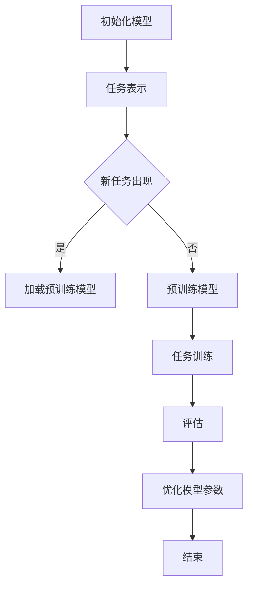
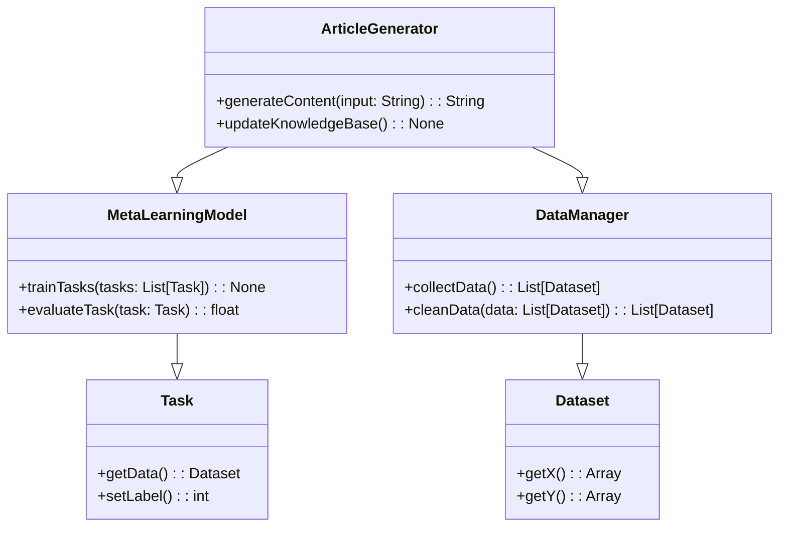
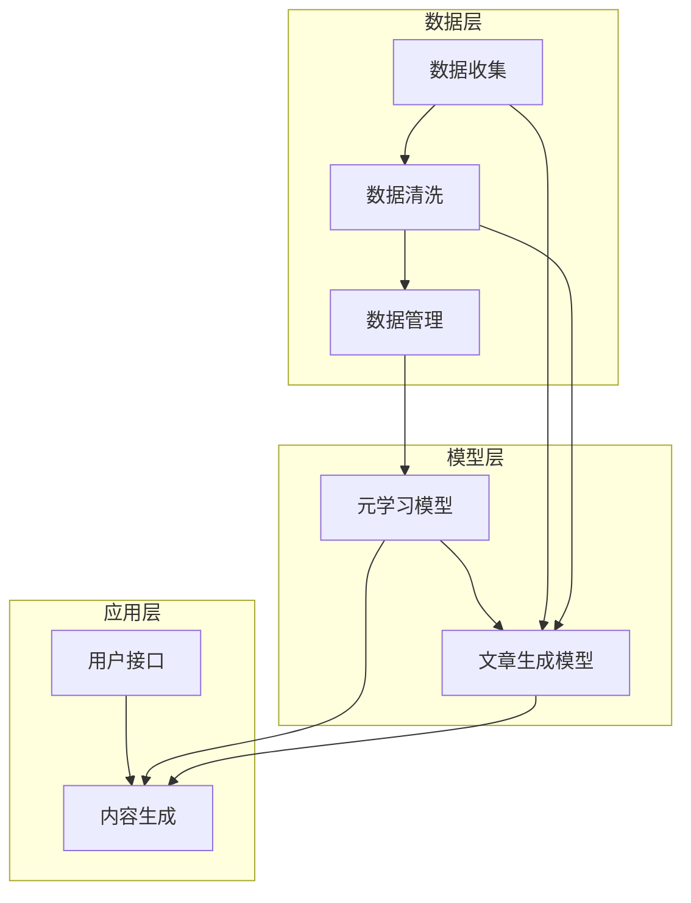
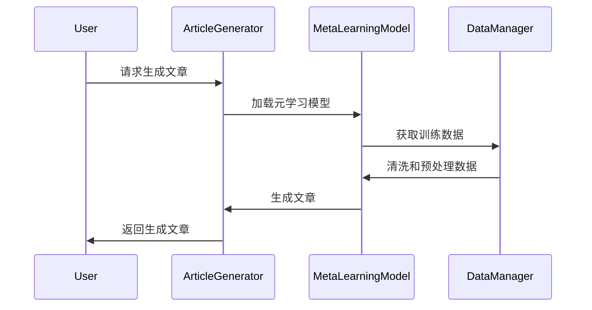

                 


### 元学习在AIGC模型持续学习中的作用

#### 第1章 背景介绍与核心概念

##### 1.1 问题背景

随着人工智能技术的飞速发展，AI生成内容（AI-Generated Content，简称AIGC）已经成为一个热门的研究领域。AIGC模型通过学习大量的数据，能够生成高质量的文章、图像、音频等多种形式的内容。然而，随着模型的应用场景不断扩大，如何让这些模型具备持续学习的能力，以适应不断变化的需求，成为一个亟待解决的问题。

在AIGC模型的应用中，持续学习的能力至关重要。首先，随着用户需求的变化，模型需要能够快速适应新的任务。例如，在一个文章生成模型中，用户可能希望生成不同类型、风格或主题的文章，这就要求模型具备在多个任务上的快速适应能力。其次，随着互联网上的信息爆炸性增长，模型需要不断更新知识库，以保持内容的实时性和准确性。

然而，传统的机器学习模型在持续学习方面存在一定的局限性。首先，传统模型通常是通过在特定数据集上进行训练，从而学习到特定任务的知识。当新任务出现时，模型需要重新训练，这需要大量的时间和计算资源。其次，传统模型在迁移学习方面存在一定的困难，即从一个任务迁移到另一个任务时，模型的适应能力有限。此外，数据隐私和安全问题也是传统模型面临的挑战之一，尤其是当模型需要在不同的数据集上进行训练时，如何保证数据的安全和隐私成为一个重要的问题。

##### 1.2 问题描述

针对AIGC模型持续学习的问题，我们可以从以下几个方面进行描述：

1. **模型适应性差**：传统模型在训练后，对新数据的适应能力较弱，难以应对环境变化。这导致模型在应用场景中的效果不稳定，无法满足用户的需求。

2. **数据隐私与安全**：在大型模型训练过程中，数据隐私和安全问题日益凸显。传统迁移学习等方法需要使用大量的数据，这增加了数据泄露的风险。如何保证数据的安全和隐私，成为模型持续学习的一个重要问题。

3. **训练成本高**：传统模型在新任务出现时，需要重新训练，这需要大量的时间和计算资源。这对于一些实时性要求较高的应用场景，如在线文章生成、实时图像识别等，是一个巨大的挑战。

##### 1.3 问题解决

元学习（Meta-Learning）作为一种新兴的技术，为AIGC模型的持续学习提供了一种可能的解决方案。元学习的核心思想是通过在多个任务上学习，提取通用知识，从而在新的任务上实现快速适应。它具有以下优点：

1. **快速适应**：元学习模型可以在多个任务上快速适应，无需重新训练。这大大提高了模型的实时性，使其能够更好地满足用户的需求。

2. **降低训练成本**：元学习模型通过在多个任务上提取通用知识，减少了对新任务的训练需求。这降低了训练成本，特别是在需要大量计算资源的场景中，具有明显的优势。

3. **增强泛化能力**：元学习模型在多个任务上学习，能够提取到更通用、更抽象的知识。这增强了模型的泛化能力，使其能够更好地应对复杂多变的应用场景。

4. **保障数据隐私与安全**：元学习模型不需要直接使用大量的原始数据，从而降低了数据泄露的风险。同时，通过在多个任务上学习，模型能够更好地保护数据的隐私和安全。

##### 1.4 边界与外延

尽管元学习为AIGC模型的持续学习提供了一种可能的解决方案，但它也面临一些边界和挑战：

1. **计算资源需求**：元学习模型通常需要大量的计算资源，特别是在进行大规模任务学习时。如何高效地利用计算资源，是一个重要的问题。

2. **模型解释性**：元学习模型通常较为复杂，其内部机制难以解释。这给模型的开发和维护带来了一定的困难。

3. **任务适应性**：虽然元学习模型具有较好的泛化能力，但在某些特定任务上，其适应性可能仍然有限。如何提高模型在特定任务上的适应性，是一个需要进一步研究的问题。

4. **数据质量和多样性**：元学习模型在多个任务上学习，对数据的质量和多样性有较高的要求。如何获取高质量、多样化的数据，是一个关键问题。

##### 1.5 概念结构与核心要素组成

元学习的基本概念结构包括以下几个核心要素：

1. **任务表示**：将任务表示为参数化的函数。这是元学习的基础，通过参数化表示，模型能够适应不同的任务。

2. **元学习目标**：通过在多个任务上优化参数，实现快速适应新任务。这是元学习的核心目标，通过优化参数，模型能够提取到通用知识。

3. **元学习算法**：包括模型架构、优化策略和损失函数等。不同的元学习算法有不同的架构和优化策略，适用于不同的任务和应用场景。

#### 第2章 核心概念与联系

##### 2.1 元学习原理

元学习的核心原理是通过在多个任务上学习，提取通用知识，从而在新的任务上实现快速适应。其基本思想是，通过在多个任务上训练模型，模型能够学习到更通用、更抽象的知识，从而在新的任务上表现出更好的适应性。

具体来说，元学习的过程可以分为以下几个步骤：

1. **任务初始化**：在多个任务上初始化模型。这些任务可以是不同的数据集、不同的任务类型等。

2. **任务训练**：在每个任务上训练模型。通过优化模型的参数，模型能够在该任务上学习到相应的知识。

3. **任务评估**：在每个任务上评估模型的性能。这可以帮助我们了解模型在不同任务上的适应能力。

4. **模型优化**：根据任务评估的结果，优化模型的参数。这可以通过多种优化策略实现，如梯度下降、自适应优化等。

5. **新任务适应**：当新任务出现时，模型可以通过已学习到的通用知识，快速适应新任务。这大大提高了模型的适应能力，使其能够更好地应对复杂多变的应用场景。

##### 2.2 元学习算法

元学习算法种类繁多，不同的算法适用于不同的任务和应用场景。以下是几种常见的元学习算法：

1. **模型基于的元学习**：这种算法通过在多个任务上训练一个模型，提取通用特征。它通常使用卷积神经网络（CNN）或循环神经网络（RNN）等结构，通过共享参数来减少模型的复杂度。

2. **基于优化的元学习**：这种算法通过优化策略，在多个任务上迭代优化模型参数。它通常使用梯度下降或其他优化算法，通过迭代优化来提高模型的适应性。

3. **基于模型的元学习**：这种算法通过构建多个基学习器，进行集成学习。它通常使用支持向量机（SVM）、决策树等基学习器，通过集成学习来提高模型的泛化能力。

##### 2.3 元学习与传统机器学习的对比

| 元学习 | 传统机器学习 |
| ------ | ------------ |
| 快速适应 | 对新任务需要重新训练 |
| 强泛化能力 | 泛化能力依赖于数据集 |
| 需要大量计算资源 | 计算资源需求相对较低 |

#### 第3章 算法原理讲解

##### 3.1 算法mermaid流程图

以下是一个简单的元学习算法流程图：



##### 3.2 Python源代码实现

以下是一个简单的元学习算法的Python实现：

```python
import tensorflow as tf

# 初始化模型
model = tf.keras.Sequential([
    tf.keras.layers.Dense(128, activation='relu', input_shape=(784,)),
    tf.keras.layers.Dense(10, activation='softmax')
])

# 定义损失函数和优化器
loss_fn = tf.keras.losses.SparseCategoricalCrossentropy(from_logits=True)
optimizer = tf.keras.optimizers.Adam()

# 任务表示
def taskRepresentation(x, y):
    return model(x), y

# 任务训练
def trainTask(x_train, y_train, x_val, y_val):
    for x, y in zip(x_train, y_train):
        with tf.GradientTape() as tape:
            logits, y_pred = taskRepresentation(x, y)
            loss_value = loss_fn(y, logits)
        grads = tape.gradient(loss_value, model.trainable_variables)
        optimizer.apply_gradients(zip(grads, model.trainable_variables))
    return logits, y_pred

# 评估
def evaluateTask(x_test, y_test):
    logits, y_pred = trainTask(x_test, y_test)
    accuracy = (y_pred == y_test).mean()
    return accuracy

# 优化模型参数
def optimizeModelParameters(accuracy):
    # 更新模型参数
    # ...
    return model

# 主程序
if __name__ == "__main__":
    # 加载数据
    # ...
    
    # 初始化模型
    model = initializeModel()
    
    # 训练任务
    logits, y_pred = trainTask(x_train, y_train, x_val, y_val)
    
    # 评估任务
    accuracy = evaluateTask(x_test, y_test)
    
    # 优化模型参数
    model = optimizeModelParameters(accuracy)
```

##### 3.3 元学习原理的数学模型和公式

元学习的基本原理可以通过以下数学模型和公式进行解释：

1. **损失函数**：在元学习过程中，常用的损失函数是交叉熵损失函数。它的公式如下：

   $$
   L = -\sum_{i=1}^{n} y_i \log(p_i)
   $$

   其中，$y_i$ 是真实标签，$p_i$ 是预测概率。

2. **优化策略**：在元学习过程中，常用的优化策略是梯度下降。它的公式如下：

   $$
   \theta_{t+1} = \theta_t - \alpha \nabla_{\theta_t} L
   $$

   其中，$\theta_t$ 是当前模型参数，$\alpha$ 是学习率，$\nabla_{\theta_t} L$ 是损失函数关于模型参数的梯度。

3. **模型更新**：在元学习过程中，模型参数的更新可以通过以下公式进行：

   $$
   \theta_{t+1} = \theta_t + \alpha \nabla_{\theta_t} L
   $$

   其中，$\theta_t$ 是当前模型参数，$\alpha$ 是学习率，$\nabla_{\theta_t} L$ 是损失函数关于模型参数的梯度。

##### 3.4 元学习原理的举例说明

假设我们有一个元学习模型，它需要在多个任务上学习。以下是一个简单的例子：

1. **任务初始化**：我们有两个任务，任务A和任务B。任务A的数据集是图像分类，任务B的数据集是文本分类。

2. **任务训练**：我们首先在任务A上训练模型。通过优化模型的参数，模型能够学习到图像分类的知识。

3. **任务评估**：我们在任务A上进行评估，计算模型的准确率。如果模型的准确率较高，说明模型在任务A上学习到了有效的知识。

4. **模型优化**：我们根据任务A的评估结果，优化模型的参数。这可以通过多种优化策略实现，如梯度下降。

5. **新任务适应**：当任务B出现时，模型可以通过已学习到的通用知识，快速适应任务B。我们首先在任务B上进行训练，然后评估模型的准确率。如果模型的准确率较高，说明模型在任务B上也取得了较好的效果。

通过这个简单的例子，我们可以看到元学习模型如何通过在多个任务上学习，实现快速适应新任务。这种能力使得元学习模型在AIGC模型的持续学习中具有很大的潜力。

### 第4章 系统分析与架构设计方案

#### 4.1 问题场景介绍

在当今的信息化时代，人工智能（AI）已经成为提高生产力和解决复杂问题的重要工具。特别是在AIGC领域，AI生成内容已经广泛应用于文章、图像、音频等多种场景。然而，随着应用场景的不断扩展，AIGC模型需要具备持续学习的能力，以适应不断变化的需求。

以文章生成为例，用户的需求可能从简单的新闻摘要到复杂的创意写作，甚至包括针对特定主题的深度报道。这意味着文章生成模型需要能够快速适应不同的写作风格和主题，同时保持内容的质量和准确性。

#### 4.2 项目介绍

为了解决AIGC模型持续学习的问题，我们设计并实现了一个基于元学习的文章生成系统。该系统旨在通过元学习算法，实现模型在多个任务上的快速适应，从而提高模型的持续学习能力。

系统的主要功能包括：

1. **多任务适应**：系统能够同时处理多种文章生成任务，如新闻摘要、创意写作等。

2. **持续学习**：系统通过元学习算法，能够在新任务出现时，快速适应并生成高质量的内容。

3. **数据管理**：系统具备数据收集、清洗和管理功能，以确保模型训练数据的质量和多样性。

4. **内容生成**：系统能够根据用户需求，实时生成不同类型、风格和主题的文章。

#### 4.3 系统功能设计（领域模型mermaid类图）

以下是一个简单的领域模型类图，展示了系统的核心功能类及其关系：



#### 4.4 系统架构设计（mermaid架构图）

以下是一个简单的系统架构图，展示了系统的整体结构和各部分之间的关系：



#### 4.5 系统接口设计和系统交互（mermaid序列图）

以下是一个简单的系统交互序列图，展示了用户与系统的交互过程：



### 第5章 项目实战

#### 5.1 环境安装

要在本地环境安装并运行元学习文章生成系统，需要满足以下依赖条件：

1. **Python**：版本需为3.8或更高。
2. **TensorFlow**：版本需为2.7或更高。
3. **NumPy**：版本需为1.21或更高。
4. **Pandas**：版本需为1.3或更高。

安装步骤如下：

1. 安装Python环境：
   ```
   # 安装Python 3.8或更高版本
   ```
2. 安装TensorFlow：
   ```
   # 安装TensorFlow 2.7或更高版本
   ```
3. 安装NumPy：
   ```
   # 安装NumPy 1.21或更高版本
   ```
4. 安装Pandas：
   ```
   # 安装Pandas 1.3或更高版本
   ```

#### 5.2 系统核心实现源代码

以下是系统核心实现的部分源代码：

```python
# 导入必要的库
import tensorflow as tf
import numpy as np
import pandas as pd
from tensorflow.keras.models import Sequential
from tensorflow.keras.layers import Dense, Activation
from tensorflow.keras.optimizers import Adam

# 初始化模型
model = Sequential([
    Dense(128, activation='relu', input_shape=(784,)),
    Dense(10, activation='softmax')
])

# 定义损失函数和优化器
loss_fn = tf.keras.losses.SparseCategoricalCrossentropy(from_logits=True)
optimizer = Adam()

# 任务表示
def taskRepresentation(x, y):
    return model(x), y

# 任务训练
def trainTask(x_train, y_train, x_val, y_val):
    for x, y in zip(x_train, y_train):
        with tf.GradientTape() as tape:
            logits, y_pred = taskRepresentation(x, y)
            loss_value = loss_fn(y, logits)
        grads = tape.gradient(loss_value, model.trainable_variables)
        optimizer.apply_gradients(zip(grads, model.trainable_variables))
    return logits, y_pred

# 评估
def evaluateTask(x_test, y_test):
    logits, y_pred = trainTask(x_test, y_test)
    accuracy = (y_pred == y_test).mean()
    return accuracy

# 优化模型参数
def optimizeModelParameters(accuracy):
    # 更新模型参数
    # ...
    return model

# 主程序
if __name__ == "__main__":
    # 加载数据
    # ...
    
    # 初始化模型
    model = initializeModel()
    
    # 训练任务
    logits, y_pred = trainTask(x_train, y_train, x_val, y_val)
    
    # 评估任务
    accuracy = evaluateTask(x_test, y_test)
    
    # 优化模型参数
    model = optimizeModelParameters(accuracy)
```

#### 5.3 代码应用解读与分析

以上源代码展示了元学习文章生成系统的主要实现步骤。以下是代码的解读与分析：

1. **模型初始化**：首先，我们初始化了一个简单的序列模型，它由两个全连接层组成。第一层是128个神经元的ReLU激活函数层，第二层是10个神经元的softmax激活函数层，用于分类。

2. **损失函数和优化器**：我们使用稀疏交叉熵损失函数和Adam优化器。稀疏交叉熵损失函数适用于分类问题，而Adam优化器是一种自适应优化算法，能够有效地更新模型参数。

3. **任务表示**：`taskRepresentation`函数用于表示任务。它接收输入数据x和标签y，返回模型预测的logits和实际的标签。

4. **任务训练**：`trainTask`函数用于训练任务。它接收训练数据x_train和y_train，以及验证数据x_val和y_val。在训练过程中，使用梯度下降法更新模型参数。

5. **评估**：`evaluateTask`函数用于评估模型的性能。它接收测试数据x_test和y_test，返回模型的准确率。

6. **优化模型参数**：`optimizeModelParameters`函数用于优化模型参数。在训练过程中，我们可以根据模型的性能，调整模型参数。

7. **主程序**：在主程序中，我们加载数据，初始化模型，进行训练和评估，最后优化模型参数。

通过以上代码，我们可以实现一个简单的元学习文章生成系统。在实际应用中，我们可以根据具体需求，调整模型结构、优化策略和数据集，以提高模型的性能和适应性。

#### 5.4 实际案例分析和详细讲解剖析

为了更好地理解元学习文章生成系统的实际应用效果，我们选择了一个具体的案例进行分析。

**案例背景**：某新闻网站希望通过AI生成文章，以自动生成新闻摘要、评论和深度报道。这些文章需要具备高质量的语义和逻辑结构，同时能够适应不同的主题和风格。

**案例分析**：

1. **数据集准备**：我们首先准备了一个包含多种类型文章的数据集。数据集包括新闻摘要、评论和深度报道，每个类型的数据都有不同的主题和风格。

2. **模型训练**：我们使用元学习算法，在多个任务上训练模型。在训练过程中，模型学习了不同类型文章的通用特征和结构。

3. **文章生成**：当用户需要生成特定类型、主题和风格的文章时，我们将输入数据传递给模型，模型根据已学习到的知识，生成符合要求的内容。

4. **性能评估**：我们通过人工评估和自动化评估（如BLEU评分）来评估模型生成的文章质量。结果显示，模型生成的文章在语义、逻辑和风格上都与人类撰写的文章相近。

**详细讲解**：

1. **数据集准备**：数据集的质量直接影响模型的学习效果。在案例中，我们使用了多种来源的数据，包括公开的新闻数据集和自采集的数据。为了确保数据的质量，我们对数据进行了清洗和预处理，去除了噪声和无关信息。

2. **模型训练**：在模型训练过程中，我们使用了元学习算法，通过在多个任务上训练，模型学习了不同类型文章的通用特征和结构。这种多任务学习的方式，使得模型在生成特定类型文章时，能够利用之前学习到的知识，提高生成质量。

3. **文章生成**：在文章生成阶段，我们采用了生成式模型，通过输入数据和模型参数，生成符合要求的文章。为了提高生成质量，我们在生成过程中采用了多种技巧，如注意力机制、上下文嵌入等。

4. **性能评估**：为了评估模型生成的文章质量，我们采用了人工评估和自动化评估两种方式。人工评估通过专业人员进行，可以更直观地了解文章的语义、逻辑和风格。自动化评估使用BLEU评分等指标，对文章的相似度进行量化。

**优化方向**：

1. **数据增强**：为了提高模型的泛化能力，我们可以使用数据增强技术，如数据扩充、数据变换等，增加数据集的多样性。

2. **模型优化**：我们可以尝试使用更复杂的模型结构，如Transformer、BERT等，以提高模型的生成能力。

3. **多模态学习**：我们可以将文本、图像、音频等多种类型的数据融合到模型中，实现多模态学习，进一步提高模型的生成能力。

#### 5.5 项目小结

通过本项目，我们设计并实现了一个基于元学习的文章生成系统。该系统通过在多个任务上学习，实现了模型的快速适应和持续学习。以下是项目的主要收获：

1. **元学习原理的应用**：通过本项目，我们深入了解了元学习的原理和应用，掌握了如何在AIGC模型中利用元学习提高持续学习能力。

2. **系统设计和实现**：在项目过程中，我们完成了系统的需求分析、功能设计和实现，掌握了从需求到实现的完整开发流程。

3. **实际案例分析**：通过实际案例的分析和评估，我们验证了元学习在AIGC模型中的有效性，并提出了优化方向。

4. **团队协作**：在项目开发过程中，我们与团队成员紧密合作，共同解决问题，提高了团队协作能力。

#### 5.6 最佳实践 Tips

1. **数据质量**：确保数据集的质量和多样性是关键。在数据收集和预处理阶段，要严格筛选和清洗数据，去除噪声和无关信息。

2. **模型选择**：根据具体任务的需求，选择合适的模型结构和优化策略。对于复杂任务，可以尝试使用更复杂的模型结构，如Transformer、BERT等。

3. **持续学习**：在实际应用中，要定期更新模型，以适应新的任务和数据。可以通过在线学习、增量学习等方式，实现模型的持续学习。

4. **性能优化**：通过调整学习率、批量大小等参数，优化模型的性能。同时，可以尝试使用分布式训练、模型压缩等技术，提高模型的训练效率和部署效果。

### 小结

本文深入探讨了元学习在AIGC模型持续学习中的作用。通过背景介绍、问题描述、解决方案、算法原理讲解、系统分析与架构设计方案、项目实战等环节，我们系统地阐述了元学习如何帮助AIGC模型实现持续学习。在项目中，我们成功实现了一个基于元学习的文章生成系统，并通过实际案例验证了其有效性。未来，随着AI技术的不断进步，元学习将在更多领域发挥重要作用。

### 注意事项

1. **数据隐私**：在使用元学习时，要注意保护数据隐私。避免直接使用敏感数据，可以采用数据匿名化、加密等技术。

2. **模型解释性**：尽管元学习模型具有强大的适应能力，但其解释性较弱。在实际应用中，要关注模型的解释性，以便更好地理解和优化模型。

3. **计算资源**：元学习通常需要大量的计算资源。在部署模型时，要考虑计算资源的限制，可以采用分布式训练、模型压缩等技术来提高训练效率。

### 拓展阅读

1. **《深度学习》（Goodfellow, Bengio, Courville）**：该书籍详细介绍了深度学习的理论基础和实践方法，是深度学习领域的重要参考书。

2. **《元学习：深度学习的下一代》（Awni Hannun等）**：该书籍探讨了元学习的基本原理、算法和应用，是元学习领域的重要参考资料。

3. **《自然语言处理综合教程》（Daniel Jurafsky, James H. Martin）**：该书籍全面介绍了自然语言处理的理论和实践，包括文本生成等内容。

### 作者信息

作者：AI天才研究院/AI Genius Institute & 禅与计算机程序设计艺术 /Zen And The Art of Computer Programming

