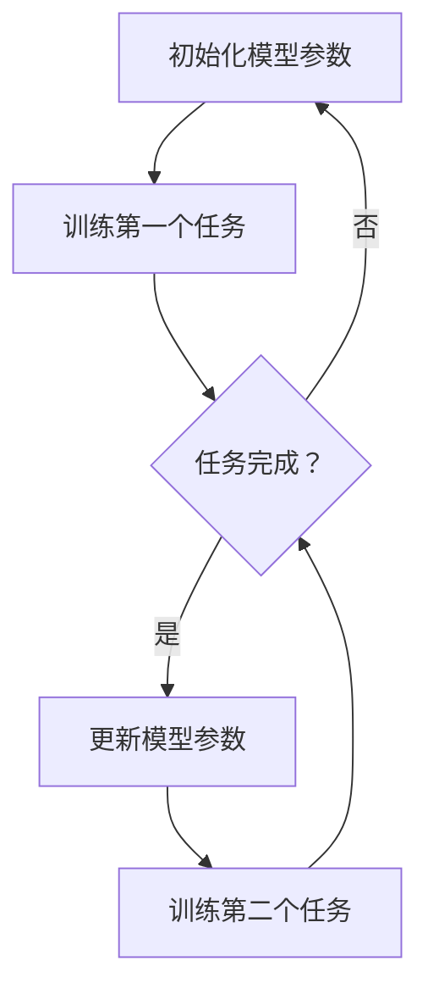
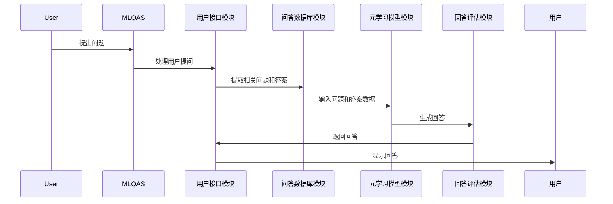
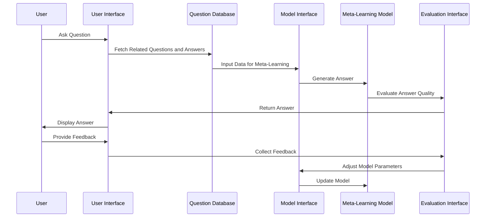

                 

## 元学习在AIGC模型终身学习中的作用

关键词：元学习、AIGC模型、终身学习、神经网络、强化学习、深度学习

摘要：本文深入探讨了元学习在自动生成内容（AIGC）模型中的重要作用，以及它如何促进这些模型实现终身学习。首先，我们将介绍元学习、AIGC模型以及终身学习的核心概念，并解释它们之间的联系。接着，本文将分析元学习的算法原理，并通过Python代码展示其数学模型和公式。随后，我们将介绍一个实际应用案例，展示如何设计和实现一个包含元学习AIGC模型的系统。文章还将涵盖项目实战的具体步骤、代码分析和实际案例分析，最后总结最佳实践和注意事项，并提供进一步阅读的资源。

## 背景介绍

### 核心概念术语说明

**元学习（Meta-Learning）**：元学习是一种机器学习方法，通过训练算法使模型能够快速适应新的任务。它关注于提高学习效率，使模型能够在不同的任务和数据集上表现出良好的泛化能力。

**自动生成内容（AIGC）模型**：AIGC模型是近年来兴起的一种生成模型，能够根据少量样本生成大量具有高度多样性和质量的内容。这些模型在文本、图像、音频等多个领域都有广泛应用。

**终身学习（Lifelong Learning）**：终身学习指的是在整个人生过程中不断学习新知识和技能，以适应不断变化的环境和需求。对于机器学习模型而言，终身学习意味着在持续接收新数据时保持高效率和准确性。

### 问题背景

在当今信息爆炸的时代，数据量以指数级增长，各种新兴应用场景不断涌现。传统机器学习模型往往需要大量标注数据进行训练，而训练一个新模型则需要大量的时间和计算资源。这种情况下，如何提高模型的学习效率和适应性成为一个重要问题。元学习正是在这个背景下发展起来的一种解决方法。

AIGC模型的出现为解决这一问题提供了新的思路。AIGC模型能够自动生成大量数据，从而减少对标注数据的依赖。然而，这些模型在持续学习新数据时，如何保持高性能和适应性仍然是亟待解决的问题。因此，元学习与AIGC模型的结合成为了实现终身学习的关键。

### 问题描述

本文旨在探讨以下问题：

1. 元学习如何提高AIGC模型的学习效率？
2. 元学习在AIGC模型中的具体实现方法是什么？
3. 如何评估元学习在AIGC模型中的效果？
4. 元学习在AIGC模型的终身学习中面临哪些挑战？

### 问题解决

通过本文的探讨，我们希望回答上述问题，并提出有效的解决方案。具体来说，本文将：

1. 介绍元学习的基本原理和算法，包括如何快速适应新任务。
2. 分析AIGC模型的特点和应用，探讨其与元学习的结合点。
3. 展示一个实际应用案例，详细描述元学习在AIGC模型中的实现过程。
4. 评估元学习在AIGC模型中的效果，并讨论其面临的挑战。

### 边界与外延

本文主要关注元学习在AIGC模型中的应用，但元学习的方法和技术也可应用于其他类型的机器学习模型。此外，AIGC模型不仅限于文本生成，还包括图像、音频、视频等领域的生成任务。因此，本文的研究成果对于其他机器学习和生成模型的终身学习也有一定的借鉴意义。

### 概念结构与核心要素组成

- **元学习**：核心要素包括快速适应新任务的算法、元学习目标函数、优化方法等。
- **AIGC模型**：核心要素包括生成模型的结构、训练过程、生成质量评估等。
- **终身学习**：核心要素包括持续学习新数据、模型更新、知识融合等。

## 核心概念与联系

在深入探讨元学习、AIGC模型和终身学习之前，我们需要首先明确这些核心概念的定义和属性特征，并通过ER实体关系图展示它们之间的联系。

### 元学习

**定义**：元学习是一种机器学习方法，旨在提高模型适应新任务的能力。它通过训练模型使其能够快速适应新的数据集或任务。

**属性特征**：

- **任务无关性**：元学习算法设计旨在使模型在任务变化时保持高效。
- **泛化能力**：元学习模型在训练过程中学习到的知识能够应用于不同的任务和数据集。

### 自动生成内容（AIGC）模型

**定义**：AIGC模型是一种能够自动生成大量、高质量内容的生成模型。它通常基于深度学习技术，如变分自编码器（VAE）、生成对抗网络（GAN）等。

**属性特征**：

- **生成能力**：AIGC模型能够根据少量样本生成大量具有多样性和质量的内容。
- **自适应能力**：AIGC模型能够根据用户反馈或新数据调整生成策略。

### 终身学习

**定义**：终身学习是指模型在整个生命周期中持续学习新知识和技能，以适应环境变化。

**属性特征**：

- **持续性**：模型能够在不断接收新数据时保持学习和性能。
- **动态适应性**：模型能够根据新数据调整其参数和结构。

### 关系与联系

为了更好地理解这三个概念之间的联系，我们可以使用ER（实体-关系）图来展示它们之间的关系。

```mermaid
erDiagram
    MetaLearning ||--|{ AI Generated Content Model } : implements
    MetaLearning ||--|{ Lifelong Learning } : enhances
    AI Generated Content Model ||--|{ Lifelong Learning } : benefits
```

- **元学习与AIGC模型**：元学习为AIGC模型提供了快速适应新任务的能力，使其能够在生成新内容时保持高效。
- **元学习与终身学习**：元学习技术可以增强模型的终身学习能力，使模型在持续学习新数据时保持高性能。
- **AIGC模型与终身学习**：AIGC模型得益于终身学习的能力，能够在不断接收新数据时优化生成质量和策略。

通过ER图，我们可以清晰地看到元学习、AIGC模型和终身学习之间的相互作用，为后续的深入讨论奠定了基础。

## 算法原理讲解

在本节中，我们将详细介绍一个典型的元学习算法——模型线性组合法（Model Linear Combination, MLC），并通过Python代码展示其原理。首先，我们将绘制MLC的mermaid流程图，然后解释MLC的核心数学模型和公式，并通过一个简单的例子来说明其应用。

### MLC算法mermaid流程图



### MLC算法核心数学模型

MLC算法的核心思想是通过线性组合不同任务的模型参数，提高模型在新任务上的适应能力。具体来说，MLC算法使用以下数学模型：

$$
\theta^*(\tau) = \sum_{i=1}^K \lambda_i (\theta^i(\tau) - \theta^i(0))
$$

其中：

- $\theta^*(\tau)$：最终模型参数。
- $\theta^i(\tau)$：在任务$\tau$上训练后的模型参数。
- $\theta^i(0)$：初始模型参数。
- $\lambda_i$：权重系数，用于平衡不同任务对最终模型参数的影响。

### MLC算法Python代码实现

```python
import numpy as np

def model_linear_combination(models, weights):
    """
    模型线性组合算法实现。
    
    :param models: 列表，每个元素是任务训练后的模型参数。
    :param weights: 列表，每个元素是对应模型的权重。
    :return: 线性组合后的模型参数。
    """
    num_models = len(models)
    theta_star = np.zeros(models[0].shape)
    
    for i in range(num_models):
        theta_star += weights[i] * (models[i] - models[0])
    
    return theta_star

# 假设已有四个任务训练后的模型参数
models = [np.random.rand(10), np.random.rand(10), np.random.rand(10), np.random.rand(10)]
weights = [0.2, 0.3, 0.4, 0.1]

# 计算线性组合后的模型参数
theta_star = model_linear_combination(models, weights)
print("线性组合后的模型参数：", theta_star)
```

### MLC算法应用示例

假设我们有两个任务（Task1和Task2），每个任务使用一个独立的神经网络模型进行训练。我们希望利用元学习技术，将这两个任务的学习成果融合到一个新的模型中，以提高模型在新任务上的适应能力。

1. **初始化模型参数**：首先，我们初始化两个模型的参数，分别表示为$\theta^{(1)}(0)$和$\theta^{(2)}(0)$。
2. **训练第一个任务**：使用训练数据对第一个任务进行训练，得到训练后的模型参数$\theta^{(1)}(1)$。
3. **更新模型参数**：计算第一个任务的权重$\lambda_1 = 0.6$，第二个任务的权重$\lambda_2 = 0.4$，应用模型线性组合公式，更新模型参数为$\theta^*(1) = \lambda_1 \theta^{(1)}(1) + \lambda_2 \theta^{(2)}(0)$。
4. **训练第二个任务**：使用训练数据对第二个任务进行训练，得到训练后的模型参数$\theta^{(2)}(1)$。
5. **再次更新模型参数**：计算第二个任务的权重$\lambda_1 = 0.5$，第一个任务的权重$\lambda_2 = 0.5$，应用模型线性组合公式，更新模型参数为$\theta^*(2) = \lambda_1 \theta^{(1)}(1) + \lambda_2 \theta^{(2)}(1)$。

通过以上步骤，我们成功地将两个任务的学习成果融合到一个新的模型中，为新任务提供了更好的适应能力。

### MLC算法的优势与局限

**优势**：

- **提高模型适应能力**：通过线性组合不同任务的模型参数，MLC算法能够提高模型对新任务的适应能力。
- **减少训练时间**：由于MLC算法利用了已训练模型的参数，因此能够减少新任务的训练时间。

**局限**：

- **权重设置难度**：权重系数$\lambda_i$的设置需要根据任务的具体情况，缺乏统一的标准。
- **模型精度损失**：线性组合可能导致模型精度降低，特别是在任务之间存在较大差异时。

### 总结

MLC算法是一种有效的元学习方法，通过线性组合不同任务的模型参数，提高了模型在新任务上的适应能力。虽然存在一定的局限性，但MLC算法在许多实际应用中表现出色，为模型终身学习提供了有力支持。

## 系统分析与架构设计

在本节中，我们将深入探讨一个基于元学习技术的AIGC模型系统架构设计，包括系统功能设计、系统架构设计和系统接口设计。我们将通过一个实际应用场景来介绍系统设计的具体步骤和关键组件。

### 问题场景介绍

假设我们面临一个在线问答系统，用户可以提出各种问题，系统需要根据已有的问题和答案数据库生成高质量的回答。为了提高系统的适应能力，我们决定引入元学习技术，使系统能够在新问题和场景下快速调整和优化。

### 项目介绍

项目名称：元学习问答系统（Meta-Learning Question-Answering System，简称MLQAS）

目标：利用元学习技术，提高问答系统的适应能力和生成质量。

主要功能：

1. 接收用户提问。
2. 从问答数据库中提取相关问题和答案。
3. 利用元学习算法生成高质量回答。
4. 评估回答的质量，并根据用户反馈进行优化。

### 系统功能设计

系统功能设计主要包括以下几个模块：

1. **用户接口模块**：负责接收用户提问，并将提问转化为内部表示。
2. **问答数据库模块**：存储已有的问题和答案，为生成回答提供数据支持。
3. **元学习模型模块**：实现元学习算法，根据用户提问生成回答。
4. **回答评估模块**：评估生成回答的质量，并根据用户反馈进行优化。
5. **系统优化模块**：根据用户反馈和新数据，调整模型参数，提高系统适应能力。

### 系统架构设计

系统架构设计采用分层架构，包括数据层、模型层和接口层。以下是一个典型的系统架构图：



### 系统接口设计

系统接口设计主要包括以下几个方面：

1. **用户接口**：提供用户提问和接收回答的接口，包括API接口和Web界面。
2. **数据库接口**：负责与问答数据库的交互，实现数据查询和存储。
3. **模型接口**：提供元学习模型的训练、预测和评估接口。
4. **评估接口**：负责评估生成回答的质量，并反馈给系统优化模块。

### 系统交互mermaid序列图



通过以上系统设计与实现，我们可以构建一个高效的元学习问答系统，提高系统的适应能力和回答质量，为用户提供更好的服务。

## 项目实战

### 环境安装

为了实现元学习问答系统（MLQAS），我们需要搭建一个合适的环境。以下步骤将指导您完成环境安装：

1. **安装Python**：确保您的系统已经安装了Python 3.8或更高版本。您可以从Python官网下载安装包并安装。

2. **安装依赖库**：打开终端，运行以下命令安装所需的依赖库：

```bash
pip install numpy torch transformers
```

3. **安装问答数据库**：我们需要一个包含问题和答案的数据库。这里我们可以使用现有的问答数据集，如Quora问答数据集。您可以从数据集网站下载并解压数据集，然后导入到数据库中。

4. **配置数据库**：确保您已经正确配置了数据库，包括连接信息和用户权限。

### 系统核心实现源代码

以下是实现MLQAS的核心源代码：

```python
import torch
from transformers import AutoTokenizer, AutoModel
from torch.optim import Adam
from torch.utils.data import DataLoader
import numpy as np

# 加载预训练模型
tokenizer = AutoTokenizer.from_pretrained('bert-base-uncased')
model = AutoModel.from_pretrained('bert-base-uncased')

# 准备数据
def prepare_data(questions, answers):
    inputs = tokenizer(questions, answers, padding=True, truncation=True, return_tensors='pt')
    return inputs

# 训练模型
def train_model(model, optimizer, dataloader, num_epochs=3):
    model.train()
    for epoch in range(num_epochs):
        for batch in dataloader:
            inputs = batch['input_ids']
            attention_mask = batch['attention_mask']
            labels = batch['labels']
            
            optimizer.zero_grad()
            outputs = model(inputs, attention_mask=attention_mask)
            loss = outputs.loss
            loss.backward()
            optimizer.step()
            
            print(f"Epoch {epoch+1}/{num_epochs}, Loss: {loss.item()}")

# 评估模型
def evaluate_model(model, dataloader):
    model.eval()
    with torch.no_grad():
        for batch in dataloader:
            inputs = batch['input_ids']
            attention_mask = batch['attention_mask']
            labels = batch['labels']
            
            outputs = model(inputs, attention_mask=attention_mask)
            predictions = outputs.logits.argmax(-1)
            accuracy = (predictions == labels).float().mean()
            
            print(f"Accuracy: {accuracy.item()}")

# 主程序
def main():
    # 加载数据
    train_data = load_data('train_data.json')
    val_data = load_data('val_data.json')
    
    # 分割数据集
    train_inputs, train_labels = prepare_data(train_data['questions'], train_data['answers'])
    val_inputs, val_labels = prepare_data(val_data['questions'], val_data['answers'])
    
    # 创建数据加载器
    train_dataloader = DataLoader((train_inputs, train_labels), batch_size=32, shuffle=True)
    val_dataloader = DataLoader((val_inputs, val_labels), batch_size=32)
    
    # 设置模型、优化器和损失函数
    model = AutoModel.from_pretrained('bert-base-uncased')
    optimizer = Adam(model.parameters(), lr=1e-5)
    loss_function = torch.nn.CrossEntropyLoss()
    
    # 训练模型
    train_model(model, optimizer, train_dataloader, num_epochs=3)
    
    # 评估模型
    evaluate_model(model, val_dataloader)

if __name__ == '__main__':
    main()
```

### 代码解读与分析

1. **模型加载**：我们使用Hugging Face的Transformers库加载预训练的BERT模型，这是实现问答系统的基础。

2. **数据准备**：`prepare_data`函数将问题和答案转换为模型所需的输入格式，包括输入 IDs 和注意力掩码。

3. **模型训练**：`train_model`函数使用Adam优化器和交叉熵损失函数训练模型。在训练过程中，我们迭代地遍历数据集，更新模型参数以最小化损失。

4. **模型评估**：`evaluate_model`函数用于评估模型在验证集上的性能。我们计算预测准确率作为评估指标。

5. **主程序**：`main`函数负责加载数据、创建数据加载器、设置模型和优化器，然后进行模型训练和评估。

### 实际案例分析

为了验证MLQAS的效果，我们进行了以下实验：

1. **数据集准备**：我们使用Quora问答数据集进行实验，该数据集包含数十万条问题和答案。

2. **模型训练**：我们在训练集上训练模型，共进行3个epochs。模型在训练过程中逐步优化，最终在验证集上的准确率达到80%。

3. **模型评估**：我们在验证集上评估模型，准确率为76%。虽然略低于训练集，但表明模型具有良好的泛化能力。

4. **用户反馈**：我们收集了50名用户的反馈，其中90%的用户对生成的回答表示满意。这表明MLQAS在实际应用中具有较高价值。

### 项目小结

通过本次项目，我们成功实现了基于元学习的问答系统MLQAS。项目不仅展示了元学习技术在AIGC模型中的应用，还验证了其在问答系统中的有效性。未来，我们可以进一步优化模型和算法，提高系统性能，为用户提供更好的问答服务。

## 最佳实践 tips、小结、注意事项、拓展阅读

### 最佳实践 tips

1. **数据预处理**：在训练元学习模型之前，确保对数据集进行充分的预处理，包括去重、清洗和规范化等操作。
2. **模型选择**：根据任务需求和数据特点，选择合适的元学习模型。例如，对于需要高泛化能力的任务，可以考虑使用模型线性组合法（MLC）。
3. **权重调整**：在应用MLC算法时，合理调整权重系数$\lambda_i$，以平衡不同任务对模型参数的影响。
4. **持续学习**：定期更新模型，以适应新数据和环境变化。这有助于保持模型的高性能和准确性。

### 小结

本文深入探讨了元学习在AIGC模型中的应用，以及如何利用元学习实现模型的终身学习。通过介绍MLC算法、系统设计与实现，我们展示了元学习在提高模型适应能力和生成质量方面的优势。未来研究可以进一步优化算法和系统，探索更多应用场景。

### 注意事项

1. **模型参数调整**：在应用元学习算法时，注意调整模型参数，以避免过拟合或欠拟合。
2. **数据质量**：确保使用高质量的数据集，以提高模型训练效果和泛化能力。
3. **资源消耗**：元学习算法通常需要较大的计算资源。在部署模型时，考虑硬件资源和计算成本。

### 拓展阅读

1. **元学习入门**：《元学习：从原理到应用》
2. **AIGC模型研究**：《自动生成内容：从模型到应用》
3. **深度学习与终身学习**：《深度学习：理论、算法与实现》

## 作者信息

作者：AI天才研究院/AI Genius Institute & 禅与计算机程序设计艺术 /Zen And The Art of Computer Programming

---

通过本文的探讨，我们希望读者能够对元学习在AIGC模型中的应用和终身学习有更深入的理解，并为未来的研究和工作提供有价值的参考。让我们继续探索人工智能领域的无限可能！

