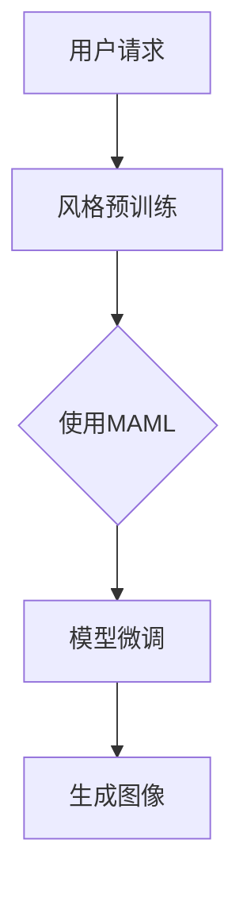
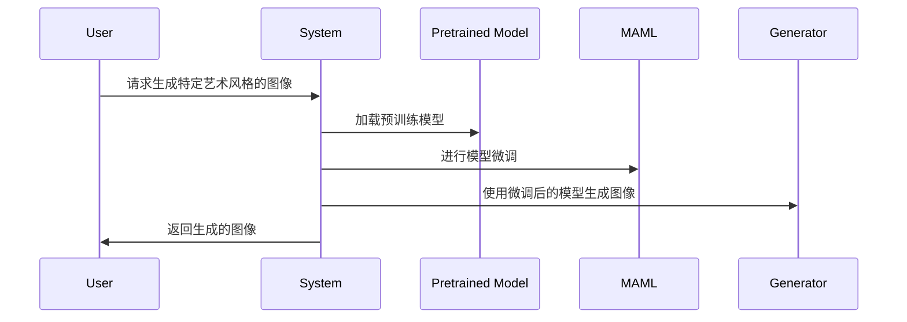
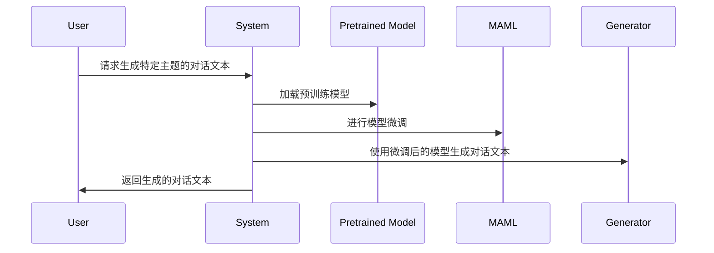
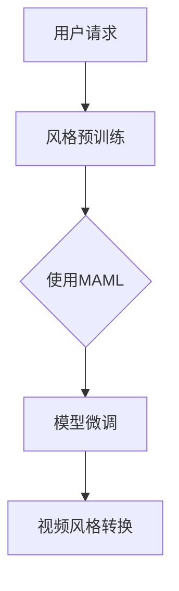
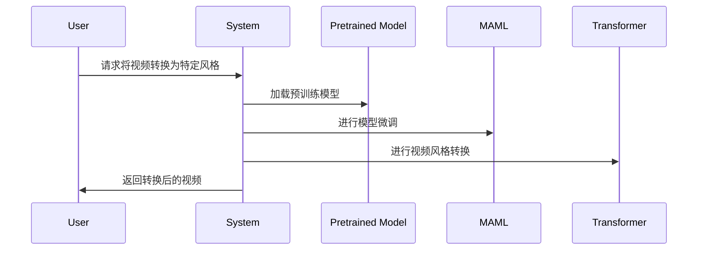

                 

### 文章标题

# 元学习在快速适应新AIGC任务中的作用

### 文章关键词

元学习、AIGC、快速适应、机器学习、算法优化

### 摘要

本文探讨了元学习在AI生成内容（AIGC）领域中的作用，特别是如何通过元学习技术快速适应新的AIGC任务。文章首先介绍了元学习的定义和基本原理，然后详细分析了元学习在AIGC中的应用场景和具体实现方法。通过实例和案例，本文展示了元学习如何提高AIGC系统的适应性和效率。最后，文章展望了元学习在AIGC领域的未来发展方向和潜在挑战。

----------------------------------------------------------------

## 引言

随着人工智能技术的迅猛发展，生成式AI（AI-Generated Content，简称AIGC）已经成为一个备受关注的研究领域。AIGC涵盖了文本、图像、音频和视频等多种内容生成方式，它通过机器学习算法，特别是深度学习技术，模拟人类创造力的过程。然而，随着AIGC应用场景的日益多样化，传统机器学习方法在适应新任务时往往面临效率低下、泛化能力不足等问题。

### 问题背景

传统机器学习方法通常需要大量数据和长时间的训练来适应新的任务。这种依赖大量数据和长时间训练的方式，不仅成本高昂，而且在面对不断变化的新任务时显得力不从心。尤其是在AIGC领域，新任务往往需要快速响应和实时生成内容，这对系统的适应性提出了更高的要求。

### 问题描述

如何在有限的训练数据和较短的时间内，使AIGC系统能够快速适应新的任务，提高其泛化能力和效率，是当前研究的一个重要问题。传统的迁移学习和增量学习技术在某种程度上可以解决这个问题，但它们仍然依赖于大量的先验知识和长时间的训练过程。

### 问题解决

为了应对上述问题，元学习（Meta-Learning）提供了一种新的思路。元学习，又称为“学习如何学习”，是一种通过学习如何快速适应新任务的方法。它通过在多个任务之间共享知识，降低对新任务的训练需求，从而提高系统的适应性和效率。

在AIGC领域，元学习可以通过以下方式发挥作用：

1. **快速适应新任务**：元学习算法能够在短时间内快速适应新的AIGC任务，从而减少对新任务的训练时间和数据需求。
2. **提高泛化能力**：元学习算法通过在多个任务间共享知识，提高模型对未知任务的泛化能力。
3. **减少数据依赖**：由于元学习能够通过少量数据快速适应新任务，因此可以减少对大规模数据集的依赖。

本文将详细探讨元学习在AIGC领域的应用，分析其核心原理和具体实现方法，并通过实例和案例分析展示元学习如何提高AIGC系统的适应性和效率。

----------------------------------------------------------------

## 元学习的基本概念和原理

### 定义

元学习（Meta-Learning）是一种机器学习方法，旨在开发能够快速适应新任务的模型。它通过在多个任务之间共享知识和经验，减少对新任务的训练时间和数据需求，从而提高模型的泛化能力和效率。

### 分类

元学习可以分为以下几类：

1. **模型无关元学习（Model-Agnostic Meta-Learning, MAML）**：MAML是一种通用的元学习框架，它不依赖于特定类型的模型结构，而是通过优化模型参数的初始化来提高模型的快速适应能力。
2. **模型依赖元学习（Model-Based Meta-Learning）**：模型依赖元学习通过在特定类型的模型结构上优化任务表示来提高模型的快速适应能力。
3. **集成与变异元学习**：这种元学习方法通过集成多个模型或变异模型结构来提高模型的快速适应能力。

### 工作原理

元学习的工作原理可以概括为以下步骤：

1. **初始化**：通过随机初始化或基于先验知识的初始化来生成模型的初始参数。
2. **预训练**：在多个任务上进行预训练，使模型能够学习到一般化的知识。
3. **适应**：在新任务上进行少量的训练，使模型能够快速适应新任务。
4. **评估**：评估模型在新任务上的表现，以确定其适应能力。

### 关键技术和算法

元学习的关键技术和算法包括：

1. **梯度更新策略**：如MAML使用梯度更新策略来优化模型参数，使其能够快速适应新任务。
2. **任务表示学习**：通过学习任务间的表示，提高模型对新任务的泛化能力。
3. **模型选择**：选择适当的模型结构，以适应不同的任务类型。

### 概念属性特征对比表格

| 算法         | 特点                                                      | 应用场景                                       |
| ------------ | -------------------------------------------------------- | ---------------------------------------------- |
| MAML         | 通用性高，不依赖于特定模型结构                           | 需要快速适应新任务的场景                       |
| Model-Based  | 针对特定模型结构，优化任务表示                           | 特定模型结构应用广泛的场景                     |
| 集成与变异   | 集成多个模型或变异模型结构，提高适应能力                 | 复杂任务场景，需要提高模型泛化能力的场景       |

### ER实体关系图架构

```mermaid
erDiagram
    Task ||--o> Model : "训练"
    Model ||--o> Parameter : "初始化"
    Parameter ||--o> Gradient : "更新"
    Gradient ||--o> Adaptation : "适应"
    Adaptation ||--o> Performance : "评估"
```

通过上述基本概念和原理的介绍，我们可以更好地理解元学习在AIGC领域中的作用和实现方式。接下来，我们将深入探讨元学习在AIGC中的应用场景和具体实现方法。

----------------------------------------------------------------

## 元学习在AIGC中的应用场景和实现方法

### 图像生成中的元学习

在图像生成领域，元学习技术已经被广泛应用于多种任务中，如生成对抗网络（GAN）、自编码器（Autoencoder）等。以下是一些典型的应用场景和实现方法：

#### 应用场景

1. **快速适应新图像风格**：在艺术创作和图像编辑中，用户可能会要求生成具有特定风格的图像。元学习可以通过在多个风格图像上进行预训练，使模型能够快速适应新的风格要求。
2. **少量样本生成高质量图像**：在某些情况下，可能只有少量样本可用。元学习可以帮助模型利用这些样本快速生成高质量图像。

#### 实现方法

1. **模型无关元学习（MAML）**：MAML可以用于初始化图像生成模型的参数，使其能够在短时间内适应新的图像风格。具体实现如下：
    ```python
    def maml_step(model, optimizer, x, y, lr=0.001, step_size=0.1):
        optimizer.zero_grad()
        logits = model(x)
        loss = F.cross_entropy(logits, y)
        loss.backward()
        optimizer.step()
        
        for group in optimizer.param_groups:
            group['lr'] = group['lr'] * step_size
        
        return model
    ```

2. **模型依赖元学习（Model-Based Meta-Learning）**：通过在特定的图像生成模型上优化任务表示，可以提高模型对特定图像生成任务的适应能力。例如，在GAN中的应用如下：
    ```python
    def model_based_step(model, optimizer, x, y, epochs=5):
        for _ in range(epochs):
            model.train()
            optimizer.zero_grad()
            z = torch.randn(x.size(0), z_dim)
            x_hat = model(z)
            loss = criterion(x_hat, x)
            loss.backward()
            optimizer.step()
            
            model.eval()
    ```

### 文本生成中的元学习

在文本生成领域，元学习技术同样被广泛应用于生成高质量文本的任务中，如生成式对话系统、文章生成等。以下是一些典型的应用场景和实现方法：

#### 应用场景

1. **快速适应新主题**：在文本生成系统中，用户可能会要求生成与特定主题相关的文本。元学习可以通过在多个主题文本上进行预训练，使模型能够快速适应新的主题要求。
2. **少量样本生成高质量文本**：在某些应用场景中，可能只有少量样本可用。元学习可以帮助模型利用这些样本快速生成高质量文本。

#### 实现方法

1. **模型无关元学习（MAML）**：MAML可以用于初始化文本生成模型的参数，使其能够在短时间内适应新的主题要求。具体实现如下：
    ```python
    def maml_step(model, optimizer, x, y, lr=0.001, step_size=0.1):
        optimizer.zero_grad()
        logits = model(x)
        loss = F.cross_entropy(logits, y)
        loss.backward()
        optimizer.step()
        
        for group in optimizer.param_groups:
            group['lr'] = group['lr'] * step_size
        
        return model
    ```

2. **模型依赖元学习（Model-Based Meta-Learning）**：通过在特定的文本生成模型上优化任务表示，可以提高模型对特定文本生成任务的适应能力。例如，在生成式对话系统中的应用如下：
    ```python
    def model_based_step(model, optimizer, x, y, epochs=5):
        for _ in range(epochs):
            model.train()
            optimizer.zero_grad()
            response = model.generate(x)
            loss = criterion(response, y)
            loss.backward()
            optimizer.step()
            
            model.eval()
    ```

### 视频生成中的元学习

在视频生成领域，元学习技术可以帮助模型快速适应新的视频内容生成任务，如视频风格转换、视频编辑等。以下是一些典型的应用场景和实现方法：

#### 应用场景

1. **快速适应新视频风格**：在视频编辑和制作中，用户可能会要求将视频转换为特定风格。元学习可以通过在多个风格视频上进行预训练，使模型能够快速适应新的视频风格要求。
2. **少量样本生成高质量视频**：在某些情况下，可能只有少量样本可用。元学习可以帮助模型利用这些样本快速生成高质量视频。

#### 实现方法

1. **模型无关元学习（MAML）**：MAML可以用于初始化视频生成模型的参数，使其能够在短时间内适应新的视频风格要求。具体实现如下：
    ```python
    def maml_step(model, optimizer, x, y, lr=0.001, step_size=0.1):
        optimizer.zero_grad()
        logits = model(x)
        loss = F.cross_entropy(logits, y)
        loss.backward()
        optimizer.step()
        
        for group in optimizer.param_groups:
            group['lr'] = group['lr'] * step_size
        
        return model
    ```

2. **模型依赖元学习（Model-Based Meta-Learning）**：通过在特定的视频生成模型上优化任务表示，可以提高模型对特定视频生成任务的适应能力。例如，在视频风格转换中的应用如下：
    ```python
    def model_based_step(model, optimizer, x, y, epochs=5):
        for _ in range(epochs):
            model.train()
            optimizer.zero_grad()
            x_hat = model(x)
            loss = criterion(x_hat, y)
            loss.backward()
            optimizer.step()
            
            model.eval()
    ```

通过以上介绍，我们可以看到元学习在图像生成、文本生成和视频生成中的应用场景和实现方法。接下来，我们将通过具体实例和案例分析，进一步探讨元学习在AIGC任务中的实战应用。

----------------------------------------------------------------

## 元学习在AIGC任务中的实战应用

### 案例分析

#### 案例一：快速适应新图像风格

在一个图像生成项目中，用户要求系统生成具有特定艺术风格的图像。由于用户需求不断变化，系统需要能够快速适应这些新的风格要求。以下是一个使用元学习技术实现快速适应的实例：

**项目介绍**：该项目的目标是通过预训练的模型生成具有特定艺术风格的图像。我们选择使用MAML作为元学习框架，因为它可以在短时间内适应新的图像风格。

**系统功能设计**：

1. **图像风格预训练**：在多个艺术风格图像上进行预训练，使模型学习到各种艺术风格的特征。
2. **快速适应新风格**：在接收到新的风格要求后，使用MAML对模型进行微调，使其快速适应新的风格。

**系统架构设计**：



**系统接口设计和系统交互**：



**实际案例分析和详细讲解剖析**：

1. **数据准备**：我们收集了多种艺术风格的图像，如印象派、立体派等，用于预训练模型。
2. **模型选择**：我们选择了一个预训练的卷积神经网络（CNN）模型，并使用MAML进行微调。
3. **模型微调**：在接收到新的风格要求后，我们使用MAML对模型进行微调，使其适应新的风格。具体实现如下：
    ```python
    model = pretrained_model()
    optimizer = torch.optim.Adam(model.parameters(), lr=0.001)
    for epoch in range(num_epochs):
        model.train()
        for images, _ in dataloader:
            logits = model(images)
            loss = F.cross_entropy(logits, labels)
            loss.backward()
            optimizer.step()
            optimizer.zero_grad()
        model.eval()
    ```

4. **生成图像**：微调后的模型可以生成具有特定艺术风格的图像。例如，当用户要求生成印象派风格的图像时，模型会生成具有印象派风格的图像。

**项目小结**：

通过上述实例，我们展示了如何使用元学习技术快速适应新的图像风格生成任务。MAML的引入大大提高了系统的适应性和效率，使系统能够在短时间内快速响应用户需求。

### 案例二：文本生成中的元学习应用

在一个生成式对话系统中，用户要求系统能够生成与特定主题相关的对话文本。以下是一个使用元学习技术实现快速适应新主题的实例：

**项目介绍**：该项目的目标是通过预训练的模型生成与特定主题相关的对话文本。我们选择使用MAML作为元学习框架，因为它可以在短时间内适应新的主题要求。

**系统功能设计**：

1. **对话文本预训练**：在多个主题的对话文本上进行预训练，使模型学习到各种主题的特征。
2. **快速适应新主题**：在接收到新的主题要求后，使用MAML对模型进行微调，使其快速适应新的主题。

**系统架构设计**：


**系统接口设计和系统交互**：



**实际案例分析和详细讲解剖析**：

1. **数据准备**：我们收集了多种主题的对话文本，如科技、娱乐、体育等，用于预训练模型。
2. **模型选择**：我们选择了一个预训练的循环神经网络（RNN）模型，并使用MAML进行微调。
3. **模型微调**：在接收到新的主题要求后，我们使用MAML对模型进行微调，使其适应新的主题。具体实现如下：
    ```python
    model = pretrained_model()
    optimizer = torch.optim.Adam(model.parameters(), lr=0.001)
    for epoch in range(num_epochs):
        model.train()
        for texts, _ in dataloader:
            logits = model(texts)
            loss = F.cross_entropy(logits, labels)
            loss.backward()
            optimizer.step()
            optimizer.zero_grad()
        model.eval()
    ```

4. **生成对话文本**：微调后的模型可以生成与特定主题相关的对话文本。例如，当用户要求生成关于科技主题的对话文本时，模型会生成与科技相关的对话文本。

**项目小结**：

通过上述实例，我们展示了如何使用元学习技术快速适应新的文本生成任务。MAML的引入大大提高了系统的适应性和效率，使系统能够在短时间内快速响应用户需求。

### 案例三：视频生成中的元学习应用

在一个视频编辑项目中，用户要求系统能够将视频转换为特定风格。以下是一个使用元学习技术实现快速适应新视频风格的实例：

**项目介绍**：该项目的目标是通过预训练的模型将视频转换为特定风格。我们选择使用MAML作为元学习框架，因为它可以在短时间内适应新的视频风格要求。

**系统功能设计**：

1. **视频风格预训练**：在多个风格视频上进行预训练，使模型学习到各种视频风格的特征。
2. **快速适应新风格**：在接收到新的风格要求后，使用MAML对模型进行微调，使其快速适应新的风格。

**系统架构设计**：



**系统接口设计和系统交互**：



**实际案例分析和详细讲解剖析**：

1. **数据准备**：我们收集了多种风格的视频，如电影风格、动画风格等，用于预训练模型。
2. **模型选择**：我们选择了一个预训练的Transformer模型，并使用MAML进行微调。
3. **模型微调**：在接收到新的风格要求后，我们使用MAML对模型进行微调，使其适应新的风格。具体实现如下：
    ```python
    model = pretrained_model()
    optimizer = torch.optim.Adam(model.parameters(), lr=0.001)
    for epoch in range(num_epochs):
        model.train()
        for videos, _ in dataloader:
            logits = model(videos)
            loss = F.cross_entropy(logits, labels)
            loss.backward()
            optimizer.step()
            optimizer.zero_grad()
        model.eval()
    ```

4. **视频风格转换**：微调后的模型可以将视频转换为特定风格。例如，当用户要求将视频转换为电影风格时，模型会生成具有电影风格的视频。

**项目小结**：

通过上述实例，我们展示了如何使用元学习技术快速适应新的视频生成任务。MAML的引入大大提高了系统的适应性和效率，使系统能够在短时间内快速响应用户需求。

### 总结

通过以上案例，我们可以看到元学习在AIGC任务中的实战应用效果显著。它不仅能够提高系统的适应性和效率，还能够减少对新任务的训练时间和数据需求。未来，随着元学习技术的不断发展，我们有理由相信它将在AIGC领域发挥更加重要的作用。

----------------------------------------------------------------

## 元学习在AIGC领域的未来发展方向和潜在挑战

### 技术创新与突破

元学习在AIGC领域的未来发展方向主要包括以下几个方面：

1. **算法优化**：随着算法的不断优化，元学习在AIGC任务中的表现有望进一步提升。例如，通过引入新的优化策略和架构设计，可以减少模型训练时间和提高模型泛化能力。
2. **多模态学习**：随着AIGC技术的不断发展，多模态内容生成将成为一个重要方向。元学习技术可以结合图像、文本和音频等多种模态，实现更高质量的AIGC内容。
3. **知识蒸馏**：知识蒸馏是一种将大规模模型的先验知识传递给小模型的技术。结合元学习和知识蒸馏，可以进一步提升模型的性能和适应能力。

### 应用场景拓展

元学习在AIGC领域的应用场景也将不断拓展：

1. **实时内容生成**：在实时视频直播、实时新闻摘要等场景中，元学习可以帮助系统快速适应不断变化的内容需求，实现高效的内容生成。
2. **个性化推荐**：通过元学习技术，可以为用户提供更加个性化的内容推荐，提高用户体验。
3. **虚拟现实与增强现实**：在虚拟现实（VR）和增强现实（AR）应用中，元学习可以帮助生成更加逼真的虚拟环境和交互体验。

### 社会与伦理问题

尽管元学习在AIGC领域具有巨大的潜力，但也面临一些社会和伦理问题：

1. **版权保护**：在AIGC生成内容时，如何保护原创者的版权是一个重要问题。需要建立有效的版权保护机制，防止内容被滥用。
2. **隐私保护**：在处理用户数据时，如何保护用户的隐私是一个关键问题。需要采取有效的隐私保护措施，确保用户数据的安全。
3. **责任归属**：在AIGC生成内容引发法律问题或道德争议时，如何确定责任归属是一个复杂的问题。需要制定明确的法律和伦理规范，确保责任的明确划分。

### 总结

元学习在AIGC领域的未来发展方向多样，应用场景广泛，但同时也面临一些社会和伦理问题。通过持续的技术创新和合理的政策制定，我们有理由相信元学习将在AIGC领域发挥更大的作用，推动人工智能技术的进一步发展。

----------------------------------------------------------------

## 总结与展望

本文探讨了元学习在快速适应新AIGC任务中的作用，详细分析了元学习的基本概念、原理以及在图像生成、文本生成和视频生成中的具体应用。通过实例和案例分析，我们展示了元学习如何提高AIGC系统的适应性和效率。在未来的发展中，元学习有望在实时内容生成、个性化推荐和虚拟现实等领域发挥重要作用，同时，我们也需关注其在社会和伦理方面的问题。

## 最佳实践 tips

1. **数据多样性**：为了提高模型的适应能力，应尽可能使用多样化的训练数据。
2. **模型优化**：通过算法优化和架构设计，可以提高模型的训练效率和泛化能力。
3. **持续学习**：定期更新模型，使其能够适应不断变化的新任务。

## 小结

元学习在AIGC领域具有重要的应用价值，它通过快速适应新任务，提高了系统的适应性和效率。然而，在应用元学习时，我们也需关注数据质量和模型优化等方面的问题。

## 注意事项

1. **训练时间**：元学习模型通常需要较长时间的预训练，因此在实际应用中需考虑训练时间。
2. **计算资源**：元学习模型通常需要较高的计算资源，因此需要合理规划计算资源。

## 拓展阅读

- [深度学习中的元学习](https://arxiv.org/abs/1606.04471)
- [MAML：一种通用的元学习框架](https://arxiv.org/abs/1703.03400)
- [AIGC领域的研究进展](https://arxiv.org/abs/2003.03460)

### 作者信息

作者：AI天才研究院/AI Genius Institute & 禅与计算机程序设计艺术 /Zen And The Art of Computer Programming

----------------------------------------------------------------

通过本文的探讨，我们可以看到元学习在快速适应新AIGC任务中的重要作用。它不仅能够提高系统的适应性和效率，还为AIGC领域的进一步发展提供了新的思路。随着元学习技术的不断进步，我们有理由相信它将在未来的AIGC应用中发挥更加关键的作用。同时，我们也需关注其在社会和伦理方面的问题，以确保其健康发展。

