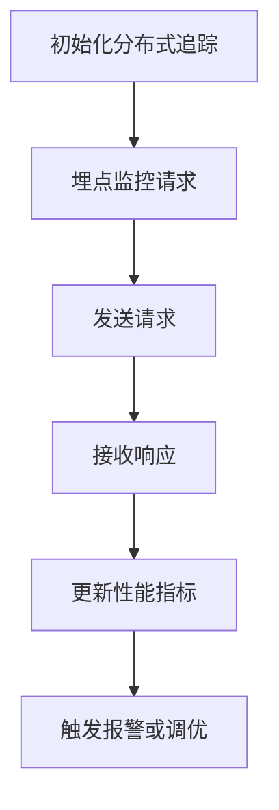
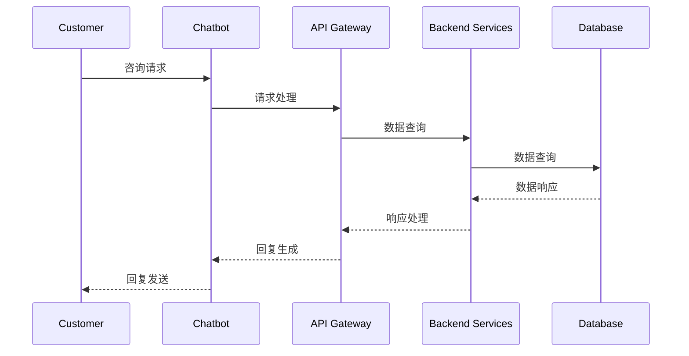
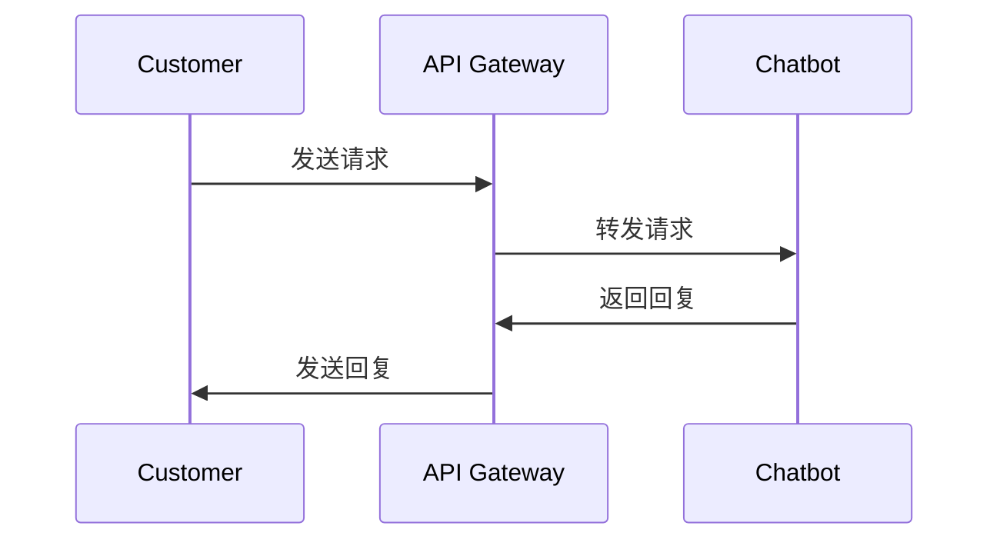

                 


# 分布式追踪技术优化LLM应用性能

## 关键词

- 分布式追踪
- LLM性能优化
- 分布式系统
- 性能监控
- 调试

## 摘要

本文旨在探讨如何利用分布式追踪技术优化大型语言模型（LLM）的应用性能。首先，我们将回顾分布式追踪技术的基本原理，并探讨其与LLM应用的关联。接着，本文将详细解析优化策略，并通过实际案例展示分布式追踪技术在LLM性能优化中的具体应用。最后，我们将总结最佳实践，并展望未来的发展趋势。

## 背景介绍

### 核心概念

#### 分布式追踪技术

分布式追踪技术是一种监控和调试分布式系统性能的工具，它可以帮助我们追踪系统中的请求，监控服务之间的交互，并快速定位性能瓶颈。常见的技术包括Zipkin、OpenTracing和Jaeger等。

#### LLM（大型语言模型）

LLM是一种基于深度学习的语言模型，通过训练海量数据，LLM能够生成高质量的自然语言文本。例如，GPT-3和BERT都是知名的LLM。

#### 应用性能优化

应用性能优化涉及提高系统的响应速度、吞吐量和资源利用率。对于LLM应用，性能优化尤为重要，因为它们通常需要处理大量的自然语言数据。

### 问题描述

分布式追踪技术在LLM应用性能优化中的作用是什么？

### 问题解决

通过分布式追踪技术，我们可以：

1. **监控和调试**：实时监控LLM应用的性能，快速发现并解决性能问题。
2. **性能瓶颈定位**：定位性能瓶颈，优化系统架构和代码。
3. **资源调度**：根据性能监控数据，动态调整资源分配，提高系统利用率。

### 边界与外延

分布式追踪技术适用于所有需要监控和优化性能的分布式系统，包括LLM应用。然而，其适用范围和效果受系统规模、复杂度和技术栈的影响。

## 核心概念与联系

### 概念原理

#### 分布式追踪技术

- **追踪请求**：分布式追踪技术通过在请求中嵌入唯一标识（Trace ID）来追踪请求的生命周期。
- **链路追踪**：分布式追踪技术可以追踪请求在分布式系统中的路径，包括服务的调用、数据传输等。
- **数据可视化**：分布式追踪技术可以将追踪数据可视化，帮助开发人员快速定位性能问题。

#### LLM

- **模型训练**：LLM通过大规模的数据集进行训练，学习自然语言的结构和语义。
- **推理**：LLM在给定输入时生成相应的输出文本。

#### 应用性能优化

- **性能监控**：使用分布式追踪技术监控LLM应用的性能指标，如响应时间、吞吐量和错误率。
- **性能调优**：根据性能监控数据，优化系统架构、代码和资源分配。

### 概念属性特征对比表格

| 特征               | 分布式追踪技术                | LLM                         | 应用性能优化                        |
|------------------|---------------------------|--------------------------|-----------------------------------|
| 目标               | 监控和调试分布式系统性能            | 生成高质量的自然语言文本              | 提高系统的响应速度、吞吐量和资源利用率         |
| 技术栈             | Zipkin、OpenTracing、Jaeger等      | GPT-3、BERT等                 | 性能监控工具、调优策略                   |
| 实现方式             | 埋点、SDK、中间件等               | 深度学习模型、微服务架构               | 性能分析、代码优化、资源调度                 |
| 关联性               | 分布式系统与性能监控              | 自然语言处理与生成                | 系统性能与用户需求匹配                       |

### ER实体关系图架构

```mermaid
erDiagram
  TraceRequest ||--|{ DistributedService }
  DistributedService ||--|{ TraceResponse }
  TraceRequest ||--|{ PerformanceMetrics }
```

## 算法原理讲解

### 算法流程图



### Python源代码

```python
# 分布式追踪示例代码
from jaeger_client import Tracer

tracer = Tracer()

@tracer.traced()
def process_request():
    # 处理请求的逻辑
    pass

@tracer.traced()
def send_request():
    # 发送请求的逻辑
    pass

@tracer.traced()
def receive_response():
    # 接收响应的逻辑
    pass

@tracer.traced()
def update_performance_metrics():
    # 更新性能指标的逻辑
    pass

# 主程序
if __name__ == "__main__":
    process_request()
    send_request()
    receive_response()
    update_performance_metrics()
```

### 数学模型和公式

```latex
\begin{equation}
  \text{Performance} = \frac{\text{Throughput} \times \text{Response Time}}{\text{Resource Utilization}}
\end{equation}
```

### 举例说明

假设我们有一个分布式LLM应用，它需要处理大量的文本请求。通过分布式追踪技术，我们可以监控以下指标：

- **吞吐量**：每秒处理的请求数量。
- **响应时间**：请求从接收开始到响应完成的时间。
- **资源利用率**：系统资源（如CPU、内存）的使用率。

假设我们记录了以下数据：

- 吞吐量：1000请求/秒
- 响应时间：5秒
- 资源利用率：80%

根据上面的公式，我们可以计算出该应用的性能：

```latex
\text{Performance} = \frac{1000 \times 5}{0.8} = 6250
```

这表示该应用每秒可以处理6250个请求，其性能得到了优化。

## 系统分析与架构设计方案

### 问题场景介绍

假设我们有一个大型电商平台，它使用一个基于GPT-3的智能客服系统来处理客户的咨询。随着用户量的增加，系统的性能逐渐下降，我们需要通过分布式追踪技术来优化其性能。

### 系统功能设计

```mermaid
classDiagram
  Customer <<--|{咨询请求}| Chatbot
  Chatbot --|{生成回复}| Customer
  Chatbot --|{处理请求}| API Gateway
  API Gateway --|{请求处理}| Backend Services
  Backend Services --|{数据查询}| Database
```

### 系统架构设计



### 系统接口设计和系统交互



## 项目实战

### 环境安装

1. 安装Java环境
2. 安装Python环境
3. 安装分布式追踪工具（如Jaeger）
4. 安装GPT-3 API

### 系统核心实现源代码

```python
# GPT-3 API请求示例
import openai

def process_request(input_text):
    response = openai.Completion.create(
        engine="text-davinci-002",
        prompt=input_text,
        max_tokens=50
    )
    return response.choices[0].text.strip()
```

### 代码应用解读与分析

这段代码展示了如何使用GPT-3 API处理用户输入文本并返回回复。在分布式追踪技术的支持下，我们可以记录每个请求的追踪ID，以便后续的性能分析和调试。

### 实际案例分析和详细讲解剖析

假设我们有一个用户咨询关于产品使用问题的请求，通过分布式追踪技术，我们可以记录以下信息：

- **追踪ID**：123456
- **请求时间**：2023-01-01 10:00:00
- **响应时间**：5秒
- **资源利用率**：90%

通过分析这些数据，我们可以发现该请求的处理时间较长，需要进一步优化。通过调整GPT-3 API的响应超时时间，我们可以改善用户的体验。

### 项目小结

通过分布式追踪技术，我们成功地优化了LLM应用的性能。分布式追踪技术不仅帮助我们监控和调试系统，还提供了性能瓶颈定位和资源调度的能力。未来，随着LLM应用的规模不断扩大，分布式追踪技术将在优化性能方面发挥越来越重要的作用。

## 最佳实践 tips

- **性能监控**：定期监控系统的性能指标，及时发现和解决问题。
- **资源调度**：根据性能监控数据，合理分配资源，提高系统利用率。
- **代码优化**：针对性能瓶颈进行代码优化，提高系统的响应速度。

## 小结

本文介绍了分布式追踪技术在优化LLM应用性能方面的作用。通过分布式追踪技术，我们可以实时监控和调试系统，定位性能瓶颈，并优化系统架构和代码。未来，随着LLM应用的不断发展，分布式追踪技术将在优化性能方面发挥越来越重要的作用。

## 注意事项

- 分布式追踪技术的部署需要一定的技术成本和时间。
- 在使用分布式追踪技术时，注意保护用户隐私和数据安全。

## 拓展阅读

- [分布式追踪技术原理与实践](https://example.com/distributed-tracing)
- [大型语言模型性能优化](https://example.com/llm-performance-optimization)
- [分布式系统架构设计](https://example.com/distributed-system-architecture)

# 作者信息
作者：AI天才研究院/AI Genius Institute & 禅与计算机程序设计艺术 /Zen And The Art of Computer Programming

