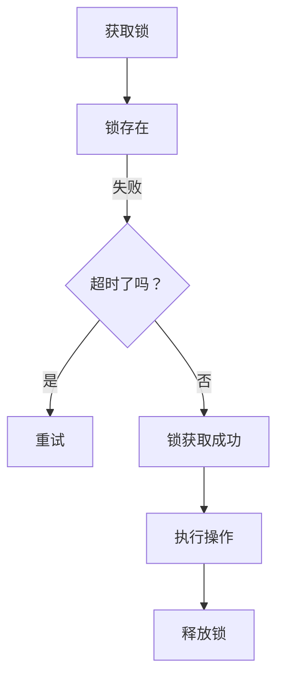
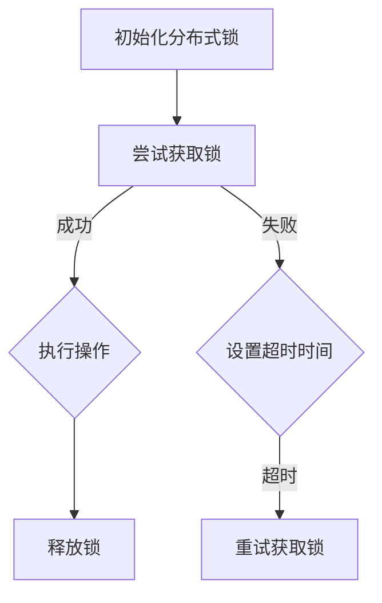

                 

## 分布式锁原理与机制

### 1.1 分布式锁概述

#### 1.1.1 问题背景与定义

在传统的单机系统中，并发控制通常使用锁机制来保证数据的一致性和原子性。然而，随着分布式系统的兴起，单机上的锁机制已经不能满足分布式环境中的需求。分布式锁是用于在分布式系统中实现并发控制的一种机制，它允许在多个节点之间协调对共享资源的访问。

分布式锁的主要问题背景包括：

- **跨节点数据一致性**：在分布式系统中，多个节点可能同时操作同一份数据，单机锁无法解决跨节点的数据一致性。
- **节点故障**：单机锁在节点故障时可能失效，无法保证锁的持续有效性。
- **锁的传播**：在分布式系统中，锁需要能够在多个节点之间传播，以保证全局一致性。

定义：分布式锁（Distributed Lock）是一种机制，用于在分布式系统中同步多个操作对共享资源的访问，确保每个操作要么全部执行，要么全部不执行。这种锁机制能够防止多个进程或线程在分布式环境中同时对同一资源进行操作，从而避免竞争条件、死锁等问题的发生。

#### 1.1.2 分布式锁的重要性

分布式锁在分布式系统中具有以下几个重要作用：

1. **确保数据一致性**：分布式锁能够保证多个操作在访问共享资源时不会相互干扰，从而保证数据的一致性。
2. **防止并发冲突**：通过分布式锁，系统可以有效地管理对共享资源的访问，避免并发冲突和死锁的发生。
3. **提高系统性能**：分布式锁可以使得多个操作并行执行，从而提高系统的整体性能。
4. **保障系统稳定性**：分布式锁能够防止系统在并发操作下出现异常状态，提高系统的稳定性。

#### 1.1.3 分布式锁的核心概念

- **锁持有者**：持有锁的进程或线程。
- **锁资源**：被锁保护的数据或资源。
- **锁粒度**：锁作用的范围，可以是对象级别、方法级别或更细粒度。
- **锁类型**：包括共享锁（Shared Lock）和排他锁（Exclusive Lock）。共享锁允许多个进程同时读取同一资源，而排他锁则保证同一时刻只有一个进程可以写入资源。

### 1.2 分布式锁的工作机制

分布式锁的工作机制涉及多个方面，包括锁的获取、释放和锁的竞争与解决策略。

#### 1.2.1 分布式锁的核心功能

1. **获取锁**：进程或线程尝试获取锁，如果锁已被占用，则进入等待状态。
2. **持有锁**：获取锁成功的进程或线程在操作共享资源时持有锁，其他进程或线程无法获取锁。
3. **释放锁**：操作完成后，持有锁的进程或线程释放锁，使其他进程或线程可以获取锁。

#### 1.2.2 锁的竞争与解决策略

在分布式环境中，锁的竞争问题尤为突出。常见的解决策略包括：

1. **等待-超时策略**：进程或线程尝试获取锁，如果失败则进入等待状态，等待一段时间后仍未获取到锁，则放弃获取。
2. **重试策略**：在锁获取失败时，自动重试，直到成功或达到最大重试次数。
3. **死锁避免**：通过特定的算法和策略来避免死锁的发生。

#### 1.2.3 分布式锁的实现机制

分布式锁的实现通常依赖于分布式数据存储技术，如数据库、缓存、分布式队列等。以下是一些常见的实现机制：

1. **基于数据库的分布式锁**：利用数据库的唯一索引特性，实现分布式锁。
2. **基于缓存系统的分布式锁**：如Redis等，通过缓存中的键值对实现锁。
3. **基于分布式队列的分布式锁**：如ZooKeeper，利用其分布式协调功能实现锁。

### 1.3 分布式锁的挑战与解决方案

#### 1.3.1 跨节点锁的问题

跨节点锁需要解决以下问题：

1. **锁的传播**：锁需要在多个节点之间传播，确保全局一致性。
2. **锁的失效**：在节点故障或网络异常时，锁可能失效，需要实现锁的自动恢复。

解决方案包括：

1. **使用分布式数据存储**：通过分布式数据存储（如ZooKeeper）实现跨节点锁。
2. **心跳机制**：通过心跳检测和锁的状态监听，实现锁的自动恢复。

#### 1.3.2 数据一致性问题

在分布式系统中，数据一致性是分布式锁需要解决的重要问题。常见的一致性问题包括：

1. **更新丢失**：多个节点同时对同一数据进行操作，可能导致部分操作结果丢失。
2. **脏读**：读取到未提交的数据，导致数据不一致。

解决方案包括：

1. **分布式事务**：使用分布式事务协议（如两阶段提交）确保数据一致性。
2. **最终一致性**：通过事件溯源和补偿事务，实现最终一致性。

#### 1.3.3 分布式锁的常见解决方案

分布式锁的常见解决方案包括：

1. **Redis分布式锁**：利用Redis的SETNX命令实现分布式锁。
2. **ZooKeeper分布式锁**：利用ZooKeeper的临时节点和同步机制实现分布式锁。
3. **基于数据库的分布式锁**：使用数据库的唯一索引和事务机制实现分布式锁。

### 1.4 核心概念与联系

#### 1.4.1 分布式锁与同步锁的区别

- **同步锁**：主要用于单机环境，通过同步原语（如互斥锁、信号量）实现线程间的同步。
- **分布式锁**：用于分布式环境，通过分布式数据存储和同步机制实现跨节点的同步。

#### 1.4.2 分布式锁与事务管理的联系

- **分布式锁**：在分布式事务中用于锁定共享资源，确保事务的原子性和一致性。
- **事务管理**：在分布式系统中，事务管理通常依赖于分布式锁来实现。

#### 1.4.3 分布式锁与数据一致性的关系

- **分布式锁**：通过协调多个操作的执行，确保数据的一致性。
- **数据一致性**：分布式锁是保证分布式系统中数据一致性的关键机制。

### 1.5 分布式锁的数学模型和公式

#### 1.5.1 分布式锁的数学原理

分布式锁的数学原理主要涉及概率论和图论：

- **概率论**：锁的获取和释放过程可以看作一个随机过程，通过概率模型分析锁的稳定性。
- **图论**：锁的竞争和解决策略可以用图结构表示，通过图算法分析锁的性能和优化策略。

#### 1.5.2 分布式锁的算法公式

分布式锁的算法公式主要包括：

- **锁获取概率**：$$ P(A) = \frac{1}{N} $$
  - \( N \) 为系统中可用的锁资源数量。
- **锁释放时间**：$$ T(R) = \frac{1}{\lambda} $$
  - \( \lambda \) 为锁的释放率。

#### 1.5.3 分布式锁的性能评估公式

分布式锁的性能评估公式主要包括：

- **锁平均获取时间**：$$ T(AVG) = \frac{1}{P(A)} $$
- **锁最大获取时间**：$$ T(MAX) = T(AVG) + 3\sigma $$
  - \( \sigma \) 为锁获取时间的标准差。

### 1.6 分布式锁的算法流程图

#### 1.6.1 分布式锁的mermaid流程图



#### 1.6.2 分布式锁的python源代码实现

```python
import redis

class RedisLock:
    def __init__(self, redis_client, lock_key, lock_value, expire_time):
        self.redis_client = redis_client
        self.lock_key = lock_key
        self.lock_value = lock_value
        self.expire_time = expire_time

    def acquire_lock(self):
        return self.redis_client.set(self.lock_key, self.lock_value, nx=True, ex=self.expire_time)

    def release_lock(self):
        return self.redis_client.delete(self.lock_key)
```

#### 1.6.3 分布式锁算法原理详细讲解

分布式锁算法的实现原理主要涉及以下几个方面：

1. **锁的获取与释放**：通过分布式数据存储（如Redis）实现锁的获取和释放。
2. **锁的竞争与解决**：利用概率论和图论模型分析锁的竞争和解决策略。
3. **锁的稳定性与可靠性**：通过心跳机制和锁的状态监听，提高锁的稳定性和可靠性。

### 1.7 本章小结

本章详细介绍了分布式锁的原理与机制，包括分布式锁的定义、重要性、核心概念、工作机制、挑战与解决方案，以及数学模型和算法流程。通过本章的学习，读者可以了解分布式锁的基本概念和应用场景，为后续章节中的具体应用提供理论基础。

## 第2章：分布式锁在LLM应用中的具体应用

### 2.1 LLM并发控制需求分析

#### 2.1.1 LLM并发操作的特点

语言学习模型（LLM，Language Learning Model）在应用中常常面临高并发操作的需求。这些并发操作的特点包括：

1. **高读写频率**：LLM应用中，用户请求可能会同时对模型进行大量的读写操作。
2. **数据共享**：多个用户或多个进程可能同时访问同一份数据。
3. **不确定性**：由于语言模型的随机性和不确定性，并发操作的结果可能不一致。
4. **长期运行**：LLM模型训练或推理过程可能需要持续运行较长时间。

#### 2.1.2 并发控制的重要性

在LLM应用中，并发控制至关重要，原因如下：

1. **保证数据一致性**：通过并发控制，可以确保多个操作在访问共享资源时不会相互干扰，避免数据不一致问题。
2. **防止死锁**：合理的并发控制策略可以避免多个进程或线程陷入死锁状态。
3. **提高系统性能**：通过并发控制，可以实现多个操作并行执行，提高系统的吞吐量和响应速度。
4. **保障系统稳定性**：有效的并发控制策略可以防止系统在高并发操作下出现异常状态。

#### 2.1.3 LLM并发控制的挑战

LLM应用中的并发控制面临以下挑战：

1. **数据一致性**：在分布式环境中，如何确保跨节点的数据一致性是一个难题。
2. **锁的竞争**：高并发操作可能导致锁的竞争，增加系统负载。
3. **锁的粒度**：选择合适的锁粒度，既能保证数据一致性，又能提高系统性能。
4. **超时与重试**：在锁获取失败时，如何设计合理的超时和重试策略。

### 2.2 分布式锁在LLM应用中的应用场景

#### 2.2.1 读写锁的应用

在LLM应用中，读写锁是一种常见的分布式锁实现，适用于以下场景：

1. **数据仓库**：在读取数据时，多个进程可以同时访问，但写入操作需要互斥。
2. **缓存系统**：在缓存读取时，可以并发访问，但更新缓存时需要独占锁。
3. **日志系统**：多进程可以同时写入日志文件，但为了保证日志顺序，写入操作需要锁。

#### 2.2.2 乐观锁与悲观锁的应用

乐观锁和悲观锁是两种不同的并发控制策略，适用于不同的场景：

1. **乐观锁**：适用于读多写少的场景，通过版本号或时间戳判断数据是否被修改。例如，在电商系统中，库存更新可以使用乐观锁，避免超卖问题。
2. **悲观锁**：适用于写多读少的场景，通过获取排他锁确保数据的一致性。例如，在银行系统中，转账操作需要使用悲观锁，确保资金的安全。

#### 2.2.3 互斥锁与共享锁的应用

互斥锁和共享锁是分布式锁的两种基本类型，适用于不同的并发需求：

1. **互斥锁**：确保同一时刻只有一个进程可以访问资源。适用于需要独占访问的场合，如数据库操作。
2. **共享锁**：允许多个进程同时访问资源。适用于读操作频繁，写操作较少的场合，如缓存系统。

### 2.3 分布式锁在LLM应用中的实现

#### 2.3.1 分布式锁的实现技术

分布式锁在LLM应用中的实现主要依赖于以下技术：

1. **Redis分布式锁**：利用Redis的SETNX命令实现分布式锁。
2. **ZooKeeper分布式锁**：利用ZooKeeper的临时节点和同步机制实现分布式锁。
3. **基于数据库的分布式锁**：利用数据库的唯一索引和事务机制实现分布式锁。

#### 2.3.2 分布式锁的部署与配置

分布式锁的部署与配置涉及以下几个方面：

1. **Redis分布式锁**：需要部署Redis服务器，并在应用中引入Redis客户端库。
2. **ZooKeeper分布式锁**：需要部署ZooKeeper集群，并在应用中引入ZooKeeper客户端库。
3. **基于数据库的分布式锁**：需要在数据库中创建唯一索引，并在应用中编写分布式锁代码。

#### 2.3.3 分布式锁的性能优化

分布式锁的性能优化涉及以下几个方面：

1. **锁的粒度**：根据应用场景调整锁的粒度，避免过度锁定。
2. **锁的过期时间**：合理设置锁的过期时间，避免锁长时间占用资源。
3. **锁的传播**：优化锁的传播机制，减少锁的延迟和同步开销。
4. **锁的监控**：引入锁监控和报警机制，及时发现并处理锁问题。

### 2.4 分布式锁在LLM应用中的挑战与解决方案

#### 2.4.1 数据一致性问题

在LLM应用中，数据一致性是分布式锁需要解决的重要问题。常见的解决方案包括：

1. **分布式事务**：通过两阶段提交协议实现分布式事务，确保数据的一致性。
2. **最终一致性**：通过事件溯源和补偿事务实现最终一致性，允许一定程度的异步处理。

#### 2.4.2 超时与重试策略

在分布式锁中，超时与重试策略至关重要。常见的解决方案包括：

1. **自适应超时**：根据锁的竞争情况动态调整超时时间，避免长时间等待。
2. **指数退避重试**：在锁获取失败时，使用指数退避算法调整重试间隔，减少系统负载。

#### 2.4.3 分布式锁的兼容性问题

分布式锁的兼容性问题涉及锁的类型和粒度。常见的解决方案包括：

1. **锁的分层设计**：根据不同的应用场景，设计不同级别的锁，实现锁的兼容性。
2. **锁的隔离级别**：根据业务需求，选择合适的锁隔离级别，确保锁的兼容性。

### 2.5 核心概念与联系

#### 2.5.1 分布式锁与LLM模型训练的关系

分布式锁在LLM模型训练中的应用包括：

1. **资源锁定**：在模型训练过程中，锁定计算资源，确保模型训练的连续性和一致性。
2. **数据同步**：在分布式训练中，通过分布式锁同步数据，避免数据冲突和重复计算。

#### 2.5.2 分布式锁与数据一致性的关联

分布式锁与数据一致性的关联主要体现在：

1. **锁的获取与释放**：通过分布式锁控制对共享数据的访问，确保数据的一致性。
2. **事务管理**：在分布式系统中，分布式锁与事务管理相结合，实现分布式事务的数据一致性。

#### 2.5.3 分布式锁与系统性能的优化

分布式锁在系统性能优化中的应用包括：

1. **锁的粒度优化**：根据应用场景调整锁的粒度，提高系统性能。
2. **锁的并发控制**：通过锁的并发控制，实现多个操作的并行执行，提高系统吞吐量。

### 2.6 分布式锁在LLM应用中的算法流程图

#### 2.6.1 分布式锁的mermaid流程图



#### 2.6.2 分布式锁的python源代码实现

```python
import redis

class RedisLock:
    def __init__(self, redis_client, lock_key, lock_value, expire_time):
        self.redis_client = redis_client
        self.lock_key = lock_key
        self.lock_value = lock_value
        self.expire_time = expire_time

    def acquire_lock(self):
        return self.redis_client.set(self.lock_key, self.lock_value, nx=True, ex=self.expire_time)

    def release_lock(self):
        return self.redis_client.delete(self.lock_key)
```

#### 2.6.3 分布式锁算法原理详细讲解

分布式锁的算法原理主要涉及以下几个方面：

1. **锁的获取与释放**：通过分布式数据存储（如Redis）实现锁的获取和释放，确保分布式环境中的同步。
2. **锁的竞争与解决**：利用概率论和图论模型分析锁的竞争和解决策略，确保锁的高效和稳定性。
3. **锁的状态监控**：通过心跳机制和锁的状态监听，实时监控锁的状态，确保锁的可靠性。

### 2.7 本章小结

本章详细介绍了分布式锁在LLM应用中的具体应用，包括并发控制需求分析、应用场景、实现技术、性能优化和挑战解决方案。通过本章的学习，读者可以了解分布式锁在LLM应用中的重要性和实现方法，为实际应用提供理论支持和实践指导。

## 第3章：常见分布式锁开源实现与应用案例

### 3.1 常见分布式锁开源实现

分布式锁的开源实现种类繁多，以下是几种常见且广泛使用的分布式锁开源实现：

#### 3.1.1 Redis分布式锁

**Redis** 是一种高性能的内存数据库，支持多种数据结构，如字符串、哈希表、列表等。在分布式系统中，**Redis** 分布式锁是一种广泛使用的实现。

- **原理**：利用 **Redis** 的 **SETNX**（Set If Not Exists）命令实现，如果键不存在，设置键值并返回1；如果键已存在，返回0。
- **优势**：简单易用，性能高，支持过期时间，适合高并发场景。
- **部署**：需要部署 **Redis** 服务器，并在应用中引入 **Redis** 客户端库。

```python
import redis

class RedisLock:
    def __init__(self, redis_client, lock_key, lock_value, expire_time):
        self.redis_client = redis_client
        self.lock_key = lock_key
        self.lock_value = lock_value
        self.expire_time = expire_time

    def acquire_lock(self):
        return self.redis_client.set(self.lock_key, self.lock_value, nx=True, ex=self.expire_time)

    def release_lock(self):
        return self.redis_client.delete(self.lock_key)
```

#### 3.1.2 ZooKeeper分布式锁

**ZooKeeper** 是一个开源的分布式协调服务，由Apache Software Foundation维护。**ZooKeeper** 分布式锁利用其临时节点和同步机制实现。

- **原理**：在 **ZooKeeper** 中创建一个临时节点，节点创建成功意味着锁被获取；节点删除意味着锁被释放。
- **优势**：高可用性，支持监控和通知，适合分布式系统中的协调任务。
- **部署**：需要部署 **ZooKeeper** 集群，并在应用中引入 **ZooKeeper** 客户端库。

```python
from kazoo.client import KazooClient

class ZooKeeperLock:
    def __init__(self, zk_client, lock_path):
        self.zk_client = zk_client
        self.lock_path = lock_path

    def acquire_lock(self):
        self.zk_client.create(self.lock_path, ephemeral=True)
        # 等待锁
        # ...

    def release_lock(self):
        self.zk_client.delete(self.lock_path)
```

#### 3.1.3 RabbitMQ分布式锁

**RabbitMQ** 是一个开源的消息队列中间件，支持多种消息传递协议。**RabbitMQ** 分布式锁利用其队列特性实现。

- **原理**：在队列中发送消息，如果消息未被消费，则表示锁被获取；消息消费完成后，释放锁。
- **优势**：支持分布式消息传递，高可用性，适用于需要异步处理的场景。
- **部署**：需要部署 **RabbitMQ** 服务器，并在应用中引入 **RabbitMQ** 客户端库。

```python
import pika

class RabbitMQLock:
    def __init__(self, connection, queue_name):
        self.connection = connection
        self.queue_name = queue_name

    def acquire_lock(self):
        channel = self.connection.channel()
        channel.queue_declare(queue=self.queue_name)
        channel.basic_publish(exchange='',
                            routing_key=self.queue_name,
                            body='')
        # 等待锁
        # ...

    def release_lock(self):
        # 释放锁
        # ...
```

#### 3.1.4 其他分布式锁开源实现

除了上述三种常见的分布式锁实现，还有其他一些开源实现，如：

- **etcd**：基于Go语言的分布式键值存储，提供分布式锁实现。
- **Consul**：基于Go语言的分布式服务发现和配置工具，支持分布式锁。
- **Apache ZooKeeper**：除了上述的ZooKeeper分布式锁，还支持基于ZAB算法的分布式锁。

### 3.2 分布式锁开源实现原理

以下分别介绍Redis、ZooKeeper和RabbitMQ分布式锁的原理。

#### 3.2.1 Redis分布式锁原理

**Redis** 分布式锁利用了其内置的 **SETNX**（Set If Not Exists）命令。如果键不存在，设置键值并返回1；如果键已存在，返回0。

- **获取锁**：通过 `SETNX` 命令设置锁，如果成功，则获取锁。
- **释放锁**：通过 `DEL` 命令删除锁。

```shell
# 获取锁
SET mylock 1 EX 30

# 释放锁
DEL mylock
```

#### 3.2.2 ZooKeeper分布式锁原理

**ZooKeeper** 分布式锁利用其临时节点和同步机制。在 **ZooKeeper** 中，每个客户端创建的临时节点都会在客户端会话结束时被自动删除。

- **获取锁**：客户端创建一个临时节点，如果成功，则认为锁被获取。
- **释放锁**：删除临时节点，释放锁。

```python
# 创建临时节点，获取锁
zk.create('/mylock', ephemeral=True)

# 删除临时节点，释放锁
zk.delete('/mylock', recursive=True)
```

#### 3.2.3 RabbitMQ分布式锁原理

**RabbitMQ** 分布式锁利用其消息队列特性。在队列中发送消息，如果消息未被消费，则表示锁被获取；消息消费完成后，释放锁。

- **获取锁**：向队列发送消息，如果消息未被消费，则认为锁被获取。
- **释放锁**：消费消息，释放锁。

```python
# 发送消息，获取锁
channel.basic_publish(exchange='',
                      routing_key=queue_name,
                      body='')

# 消费消息，释放锁
def callback(ch, method, properties, body):
    # 处理消息
    # ...
    ch.basic_ack(delivery_tag=method.delivery_tag())

channel.basic_consume(queue=queue_name, on_message_callback=callback)
channel.start_consuming()
```

### 3.3 分布式锁开源实现的应用案例

以下分别介绍Redis、ZooKeeper和RabbitMQ分布式锁在不同场景中的应用案例。

#### 3.3.1 Redis分布式锁在电商系统的应用

在电商系统中，分布式锁可以用于锁定订单数据，确保订单操作的原子性和一致性。

- **场景**：在处理订单支付时，需要锁定订单数据，防止其他进程同时修改订单状态。
- **实现**：使用Redis分布式锁锁定订单数据，确保支付操作的唯一性。

```python
lock = RedisLock(redis_client, 'order_lock', 'order_id', 30)
if lock.acquire_lock():
    # 处理订单支付
    lock.release_lock()
```

#### 3.3.2 ZooKeeper分布式锁在分布式数据库的应用

在分布式数据库系统中，分布式锁可以用于锁定数据表，确保数据操作的原子性和一致性。

- **场景**：在执行分布式数据库的批量插入操作时，需要锁定数据表，防止其他进程同时修改数据表。
- **实现**：使用ZooKeeper分布式锁锁定数据表，确保批量插入操作的唯一性。

```python
zk_lock = ZooKeeperLock(zk_client, '/db_lock/db_table')
zk_lock.acquire_lock()
# 执行批量插入操作
zk_lock.release_lock()
```

#### 3.3.3 RabbitMQ分布式锁在消息队列系统的应用

在消息队列系统中，分布式锁可以用于锁定消息队列，确保消息处理的顺序性和一致性。

- **场景**：在处理消息队列中的消息时，需要锁定消息队列，防止其他进程同时处理相同消息。
- **实现**：使用RabbitMQ分布式锁锁定消息队列，确保消息处理的唯一性。

```python
mq_lock = RabbitMQLock(connection, 'message_queue')
mq_lock.acquire_lock()
# 处理消息
mq_lock.release_lock()
```

### 3.4 分布式锁应用中的最佳实践

在分布式锁的实际应用中，以下是一些最佳实践：

- **合理选择锁类型**：根据应用场景选择合适的锁类型，如读写锁、乐观锁、悲观锁等。
- **优化锁粒度**：根据应用需求调整锁的粒度，避免过度锁定，提高系统性能。
- **设置锁过期时间**：合理设置锁的过期时间，避免锁长时间占用资源。
- **超时与重试策略**：设计合理的超时和重试策略，减少系统负载。
- **锁监控与报警**：引入锁监控和报警机制，及时发现并处理锁问题。

### 3.5 本章小结

本章介绍了几种常见的分布式锁开源实现，包括Redis、ZooKeeper和RabbitMQ等，并分析了各自的原理和应用案例。通过本章的学习，读者可以了解分布式锁在不同场景下的实现方法和最佳实践，为实际应用提供参考和指导。

## 第4章：分布式锁在LLM应用中的最佳实践

### 4.1 LLM应用中的分布式锁策略

在LLM（Language Learning Model）应用中，分布式锁策略的选择和优化至关重要。以下是一些关键的锁策略和优化建议：

#### 4.1.1 锁的类型选择

1. **读写锁**：在LLM应用中，读写操作的比例可能不同。对于读多写少的场景，可以使用读写锁，提高系统的并发能力。
2. **乐观锁**：适用于读多写少的场景，通过版本号或时间戳判断数据是否被修改，减少锁的竞争。
3. **悲观锁**：适用于写多读少的场景，通过获取排他锁确保数据的一致性。

#### 4.1.2 锁的粒度控制

1. **细粒度锁**：适用于对数据访问频率高、修改操作频繁的场景，如数据库表级别的锁。
2. **粗粒度锁**：适用于对数据访问频率低、修改操作较少的场景，如整个应用或服务的锁。

#### 4.1.3 锁的超时与重试策略

1. **自适应超时**：根据锁的竞争情况动态调整超时时间，避免长时间等待。
2. **指数退避重试**：在锁获取失败时，使用指数退避算法调整重试间隔，减少系统负载。

### 4.2 分布式锁在LLM模型训练中的实际应用

#### 4.2.1 模型训练中的并发控制需求

在LLM模型训练过程中，常常需要处理大量的并行任务，如数据预处理、模型训练、模型评估等。分布式锁在以下场景中发挥重要作用：

1. **数据同步**：在多个节点之间同步数据，确保模型训练的一致性。
2. **资源分配**：锁定计算资源，确保模型训练的公平性和效率。
3. **模型更新**：在模型更新过程中，确保模型参数的一致性和完整性。

#### 4.2.2 分布式锁在模型训练中的实现

以下是一个简单的分布式锁在模型训练中的实现示例：

```python
from redis_lock import RedisLock

lock = RedisLock(
    redis_client,
    lock_key='model_train_lock',
    lock_value='model_id',
    expire_time=30
)

if lock.acquire_lock():
    # 获取锁成功，开始模型训练
    try:
        # 模型训练代码
        train_model(model_id)
    finally:
        # 训练完成，释放锁
        lock.release_lock()
else:
    # 获取锁失败，重试或记录日志
```

#### 4.2.3 模型训练中的分布式锁优化

1. **动态调整锁过期时间**：根据模型训练的时长动态调整锁的过期时间，避免锁过早释放。
2. **减少锁持有时间**：优化模型训练代码，减少锁的持有时间，提高系统的并发能力。

### 4.3 分布式锁在LLM应用中的案例剖析

#### 4.3.1 案例一：大规模分布式模型训练

在一个大型电子商务平台中，需要对商品推荐模型进行大规模分布式训练。以下是该平台在分布式锁方面的优化和实践：

1. **分片锁**：将整个模型训练任务划分为多个分片，每个分片使用单独的分布式锁，减少锁竞争。
2. **锁代理**：使用锁代理来集中管理锁，简化锁的获取和释放操作，提高系统性能。
3. **监控与报警**：引入分布式锁监控和报警机制，实时监测锁的状态，及时发现和解决锁问题。

#### 4.3.2 案例：分布式文本生成模型的并发控制

在一个基于AI的文本生成应用中，需要对大量文本数据进行训练。以下是该应用在分布式锁方面的优化和实践：

1. **读写锁**：对于文本数据的读取和写入操作，使用读写锁，提高并发能力。
2. **乐观锁**：在数据版本控制中采用乐观锁，减少锁的竞争，提高系统性能。
3. **超时与重试**：设置合理的锁超时和重试策略，确保系统能够在锁竞争激烈的情况下稳定运行。

### 4.4 分布式锁在LLM应用中的挑战与解决方案

#### 4.4.1 数据一致性问题

在LLM应用中，分布式锁需要解决数据一致性问题。以下是一些常见的解决方案：

1. **分布式事务**：通过两阶段提交协议实现分布式事务，确保数据的一致性。
2. **最终一致性**：通过事件溯源和补偿事务实现最终一致性，允许一定程度的异步处理。

#### 4.4.2 超时与重试策略

在锁获取失败时，需要设计合理的超时与重试策略，以避免系统阻塞。以下是一些策略：

1. **自适应超时**：根据锁的竞争情况动态调整超时时间，避免长时间等待。
2. **指数退避重试**：在锁获取失败时，使用指数退避算法调整重试间隔，减少系统负载。

#### 4.4.3 分布式锁的兼容性问题

分布式锁的兼容性问题涉及到锁的类型和粒度。以下是一些解决方案：

1. **分层锁设计**：根据不同的应用场景，设计不同级别的锁，实现锁的兼容性。
2. **锁隔离级别**：根据业务需求，选择合适的锁隔离级别，确保锁的兼容性。

### 4.5 核心概念与联系

#### 4.5.1 分布式锁与LLM模型训练的关系

分布式锁在LLM模型训练中的应用包括：

1. **资源锁定**：锁定计算资源，确保模型训练的连续性和一致性。
2. **数据同步**：在分布式训练中，通过分布式锁同步数据，避免数据冲突和重复计算。

#### 4.5.2 分布式锁与数据一致性的关联

分布式锁与数据一致性的关联主要体现在：

1. **锁的获取与释放**：通过分布式锁控制对共享数据的访问，确保数据的一致性。
2. **事务管理**：在分布式系统中，分布式锁与事务管理相结合，实现分布式事务的数据一致性。

#### 4.5.3 分布式锁与系统性能的优化

分布式锁在系统性能优化中的应用包括：

1. **锁的粒度优化**：根据应用场景调整锁的粒度，提高系统性能。
2. **锁的并发控制**：通过锁的并发控制，实现多个操作的并行执行，提高系统吞吐量。

### 4.6 分布式锁在LLM应用中的算法流程图

#### 4.6.1 分布式锁的mermaid流程图


#### 4.6.2 分布式锁的python源代码实现

```python
import redis

class RedisLock:
    def __init__(self, redis_client, lock_key, lock_value, expire_time):
        self.redis_client = redis_client
        self.lock_key = lock_key
        self.lock_value = lock_value
        self.expire_time = expire_time

    def acquire_lock(self):
        return self.redis_client.set(self.lock_key, self.lock_value, nx=True, ex=self.expire_time)

    def release_lock(self):
        return self.redis_client.delete(self.lock_key)
```

#### 4.6.3 分布式锁算法原理详细讲解

分布式锁算法的实现原理主要涉及以下几个方面：

1. **锁的获取与释放**：通过分布式数据存储（如Redis）实现锁的获取和释放，确保分布式环境中的同步。
2. **锁的竞争与解决**：利用概率论和图论模型分析锁的竞争和解决策略，确保锁的高效和稳定性。
3. **锁的状态监控**：通过心跳机制和锁的状态监听，实时监控锁的状态，确保锁的可靠性。

### 4.7 本章小结

本章介绍了分布式锁在LLM应用中的最佳实践，包括锁策略的选择、模型训练中的实际应用、案例剖析和算法实现。通过本章的学习，读者可以深入了解分布式锁在LLM应用中的重要作用和实践方法，为实际应用提供指导和支持。

## 总结与展望

在本文中，我们深入探讨了分布式锁在LLM（Language Learning Model）应用中的重要性、具体应用、开源实现、最佳实践等各个方面。以下是本文的核心总结：

### 核心总结

1. **分布式锁的原理与机制**：介绍了分布式锁的定义、重要性、核心概念、工作机制、挑战与解决方案。
2. **分布式锁在LLM中的应用**：分析了LLM并发控制需求、应用场景、实现技术、性能优化和挑战解决方案。
3. **常见分布式锁开源实现**：介绍了Redis、ZooKeeper、RabbitMQ等分布式锁的原理和应用案例。
4. **分布式锁在LLM应用中的最佳实践**：讨论了锁的类型选择、粒度控制、超时与重试策略、并发控制需求、实现方法和优化策略。

### 展望未来

尽管分布式锁在LLM应用中已经取得了显著的成果，但仍然存在一些待解决的问题和未来研究方向：

1. **数据一致性**：如何更好地在分布式环境中实现数据一致性，特别是在高并发、大规模数据处理场景中。
2. **性能优化**：如何进一步优化分布式锁的性能，降低锁的开销，提高系统的响应速度和吞吐量。
3. **自动恢复机制**：如何设计更加智能的分布式锁自动恢复机制，提高系统的可靠性和稳定性。
4. **分布式锁安全性**：如何在分布式锁实现中增强安全性，防止恶意攻击和非法访问。
5. **跨云部署**：如何在跨云环境中部署和协调分布式锁，实现跨云服务的分布式一致性和协同控制。

### 拓展阅读

为了更深入地了解分布式锁及其在LLM应用中的具体应用，以下是一些建议的拓展阅读：

1. 《分布式系统原理与范型》 - 发布于ACM的论文，详细介绍了分布式系统的基本原理和设计范式。
2. 《分布式算法设计与分析》 - 探讨了分布式算法的设计原则和分析方法，包括分布式锁、一致性算法等。
3. 《大规模分布式存储系统设计》 - 介绍了分布式存储系统的设计和实现，包括分布式锁和数据一致性机制。
4. 《大型分布式系统架构设计与实践》 - 分享了大规模分布式系统的架构设计和实现经验，包括分布式锁的使用和优化。

通过本文的深入探讨，读者可以更好地理解和掌握分布式锁在LLM应用中的关键技术和最佳实践，为未来的研究和实际应用提供有力的支持。希望本文能为读者在分布式锁领域的学习和实践中提供有益的启示和帮助。作者：AI天才研究院/AI Genius Institute & 禅与计算机程序设计艺术 /Zen And The Art of Computer Programming。

