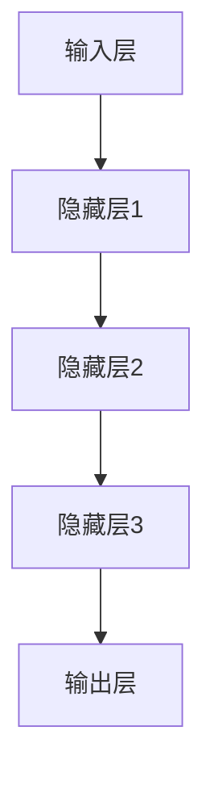
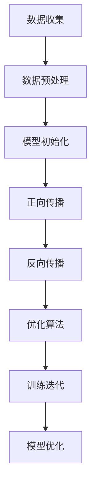
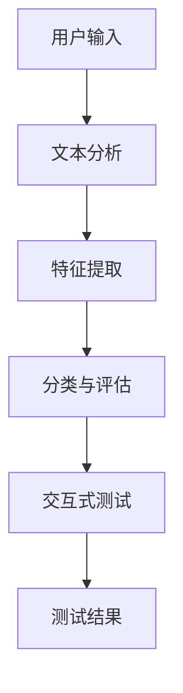
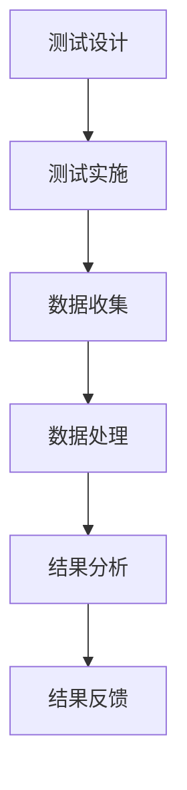

                 


# 创造力测试：衡量LLM的创新思维

## 关键词
- 创造力测试
- LLM（大型语言模型）
- 创新思维
- 数据处理与分析
- 最佳实践

## 摘要
本文旨在探讨如何使用大型语言模型（LLM）进行创造力测试，以衡量个体的创新思维。我们将从背景知识、技术原理、实际应用和未来展望四个方面，逐步深入分析这一领域，旨在为读者提供清晰、易懂的指导。

## 第一部分：背景与基础

### 第1章：创造力与LLM的基础知识

#### 1.1 创造力的本质与重要性

创造力是人类智慧的体现，是推动社会进步的重要力量。在当今快速变化的世界中，创造力尤为重要。它不仅关乎个人的成就，还影响着企业的创新能力和国家的竞争力。

#### 1.2 LL&M的概念与作用

LLM（Large Language Model）是一种高级自然语言处理模型，具有强大的语言理解和生成能力。LLM在多个领域都有广泛的应用，包括文本生成、机器翻译、情感分析等。

#### 1.3 LL&M与创造力测试的关系

LLM在创造力测试中的应用潜力巨大。通过分析个体的语言输出，LLM可以识别出创新思维的特征，从而为创造力测试提供新的方法。

### 第2章：LLM的技术原理与实现

#### 2.1 LL&M的基本架构

LLM通常基于深度学习技术，包括多层神经网络、注意力机制等。其基本架构包括输入层、隐藏层和输出层。

#### 2.2 LL&M的训练与优化

LLM的训练需要大量的数据和计算资源。通过优化算法，可以提高LLM的性能和效率。

#### 2.3 LL&M在创造力测试中的应用

LLM可以用于文本分析，识别创新思维的特征。例如，通过分析个体的文章、报告或演讲，LLM可以评估其创造力水平。

### 第3章：创造力测试的设计与实施

#### 3.1 创造力测试的目标与类型

创造力测试的目标是评估个体的创新思维能力。根据测试的目的和方式，创造力测试可以分为多种类型。

#### 3.2 创造力测试的流程与步骤

创造力测试的流程包括测试设计、测试实施、数据收集和结果分析等步骤。

#### 3.3 创造力测试的数据处理与分析

数据处理和分析是创造力测试的关键。通过统计分析和机器学习技术，可以从测试数据中提取有价值的信息。

## 第二部分：案例分析

### 第4章：案例分析1：教育领域的创新思维测试

#### 4.1 案例背景

在教育领域，评估学生的创造力对于培养创新人才至关重要。本案例旨在探讨如何使用LLM进行教育领域的创新思维测试。

#### 4.2 案例实施

本案例中，我们设计了一个基于LLM的在线测试系统，用于评估学生的创造力。

#### 4.3 案例分析

通过分析测试结果，我们发现LLM能够有效识别学生的创新思维，为教育提供了新的评估手段。

### 第5章：案例分析2：企业管理的创新思维测试

#### 5.1 案例背景

在企业管理中，创新思维是提升企业竞争力的重要途径。本案例旨在探讨如何使用LLM进行企业管理的创新思维测试。

#### 5.2 案例实施

本案例中，我们为企业设计了一个基于LLM的在线测试系统，用于评估员工和管理者的创新思维。

#### 5.3 案例分析

通过分析测试结果，我们发现LLM能够为企业提供有价值的创新思维评估，有助于优化企业管理。

### 第6章：案例分析3：创意产业的创新思维测试

#### 6.1 案例背景

在创意产业中，创新思维是推动产业发展的关键。本案例旨在探讨如何使用LLM进行创意产业的创新思维测试。

#### 6.2 案例实施

本案例中，我们为创意产业设计了一个基于LLM的在线测试系统，用于评估创意人才的创新思维。

#### 6.3 案例分析

通过分析测试结果，我们发现LLM能够为创意产业提供有效的创新思维评估，有助于挖掘和培养创意人才。

## 第三部分：最佳实践与未来展望

### 第7章：最佳实践

#### 7.1 创造力测试的最佳实践

在本部分，我们将总结创造力测试的最佳实践，包括测试设计、数据收集、分析方法等。

#### 7.2 LL&M在创造力测试中的应用技巧

我们将介绍LLM在创造力测试中的应用技巧，包括模型选择、参数调整、数据处理等。

#### 7.3 创造力测试的改进方向

我们将探讨未来创造力测试的改进方向，包括技术创新、数据积累、跨学科融合等。

### 第8章：未来展望

#### 8.1 创造力测试与LL&M的发展趋势

我们将分析创造力测试和LL&M的发展趋势，探讨未来可能的应用场景和挑战。

#### 8.2 LL&M在创新思维测试中的潜力

我们将探讨LLM在创新思维测试中的潜力，包括识别创新思维、预测创新成果等。

#### 8.3 创造力测试与LL&M的未来研究方向

我们将提出创造力测试与LL&M的未来研究方向，包括技术创新、跨学科研究、应用拓展等。

# 结束语

创造力是推动社会进步的重要力量，而LLM为我们提供了新的测试和衡量创造力方法。通过本文的探讨，我们希望能够为读者提供有益的参考，促进创造力测试和LLM的研究与应用。

## 作者信息
作者：AI天才研究院/AI Genius Institute & 禅与计算机程序设计艺术 /Zen And The Art of Computer Programming

[以下为正文部分，根据上述大纲逐步展开详细内容] ## 第一部分：背景与基础

### 第1章：创造力与LLM的基础知识

#### 1.1 创造力的本质与重要性

创造力（Creativity）是指个体在思考、解决问题和表达时，能够产生新颖、有价值的想法和概念的能力。它不仅体现在艺术、科学和文学等领域，还贯穿于日常生活和工作中。创造力的重要性不言而喻，它能够激发创新，推动技术进步，提升企业的竞争力，甚至改变社会结构和人类生活方式。

在现代社会，随着信息技术的快速发展，创造力的价值愈发凸显。创新思维成为推动经济发展的重要引擎，越来越多的企业和组织开始重视员工的创造力。例如，谷歌等科技公司就致力于营造一个鼓励创新的工作环境，以吸引和留住具有创造力的人才。

#### 1.2 LL&M的概念与作用

LLM（Large Language Model）是一种基于深度学习的自然语言处理模型，具有强大的语言理解和生成能力。LLM通常由数十亿个参数组成，通过大规模数据训练得到，能够对输入文本进行语义理解和生成。LLM的主要作用包括：

1. **文本生成**：LLM可以生成高质量的文本，应用于写作辅助、内容创作和自动摘要等领域。
2. **机器翻译**：LLM在机器翻译领域表现出色，能够实现高质量的双语翻译。
3. **情感分析**：LLM可以分析文本的情感倾向，应用于舆情监控、用户反馈分析等。
4. **问答系统**：LLM能够回答用户提出的问题，应用于智能客服、知识库问答等。

在创造力测试中，LLM的应用潜力巨大。通过分析个体的语言输出，LLM可以识别出创新思维的特征，从而为创造力测试提供新的方法。

#### 1.3 LL&M与创造力测试的关系

LLM在创造力测试中的应用主要体现在以下几个方面：

1. **特征提取**：LLM可以从个体的文本输出中提取出与创造力相关的特征，如词汇丰富度、思维连贯性等。
2. **分类与评估**：通过训练LLM模型，可以实现对创造力水平的分类和评估，从而为个体提供个性化的创造力测试结果。
3. **交互式测试**：LLM可以设计交互式创造力测试，通过对话形式引导个体表达自己的想法，从而更全面地评估其创造力。

LLM在创造力测试中的应用不仅提高了测试的准确性，还增强了测试的交互性和个性化，为创造力研究提供了新的视角。

### 第2章：LLM的技术原理与实现

#### 2.1 LL&M的基本架构

LLM的基本架构通常包括输入层、隐藏层和输出层。输入层接收文本数据，隐藏层通过复杂的神经网络结构对文本进行编码和解析，输出层生成文本或提供其他形式的输出。

以下是一个简化的LLM架构示例（使用Mermaid绘图）：



在实际应用中，LLM的架构可能更加复杂，包括多层神经网络、注意力机制、循环神经网络（RNN）等。这些架构设计旨在提高模型的表达能力和生成质量。

#### 2.2 LL&M的训练与优化

LLM的训练是一个复杂的过程，通常涉及以下步骤：

1. **数据收集**：收集大规模的文本数据，用于训练LLM。
2. **数据预处理**：对文本数据进行清洗、分词、编码等处理，以便模型能够理解。
3. **模型初始化**：初始化模型的参数，通常使用随机初始化。
4. **正向传播**：输入文本数据，通过模型进行正向传播，计算损失函数。
5. **反向传播**：根据损失函数，通过反向传播更新模型参数。
6. **优化算法**：使用优化算法（如梯度下降、Adam等）调整模型参数，以减少损失函数。

以下是一个简化的训练过程示例（使用Mermaid绘图）：



训练过程需要大量的计算资源和时间，但随着硬件性能的提升和优化算法的改进，训练速度和效果不断提升。

#### 2.3 LL&M在创造力测试中的应用

在创造力测试中，LLM的应用主要体现在以下几个方面：

1. **文本分析**：通过分析个体的文本输出，LLM可以识别出与创造力相关的特征，如词汇丰富度、思维连贯性等。
2. **分类与评估**：训练好的LLM模型可以用于分类任务，将个体的创造力水平分为不同的类别。
3. **交互式测试**：LLM可以设计交互式创造力测试，通过与个体进行对话，引导个体表达自己的想法，从而更全面地评估其创造力。

以下是一个简化的创造力测试流程示例（使用Mermaid绘图）：



通过LLM的强大能力，创造力测试不仅可以更准确地评估个体的创造力水平，还可以提供个性化的反馈和建议，有助于个体进一步提升创造力。

### 第3章：创造力测试的设计与实施

#### 3.1 创造力测试的目标与类型

创造力测试的目标是评估个体的创新思维能力，以便为教育、企业管理和个人发展等领域提供参考。根据测试的目的和方式，创造力测试可以分为以下几种类型：

1. **开放式测试**：开放式测试通常要求个体在给定的主题或情境下自由表达自己的想法。这种测试能够更全面地反映个体的创造力，但评分主观性较大。
2. **封闭式测试**：封闭式测试通过多项选择题、填空题等形式评估个体的创造力。这种测试操作简单，评分客观，但可能限制了个体表达的空间。
3. **混合式测试**：混合式测试结合了开放式测试和封闭式测试的优点，既提供自由表达的空间，又通过结构化的题目进行评估。

#### 3.2 创造力测试的流程与步骤

创造力测试的流程通常包括以下几个步骤：

1. **测试设计**：确定测试的目标、类型和内容，设计测试题目和评分标准。
2. **测试实施**：组织测试过程，确保测试的公正性和准确性。可以通过在线平台、纸质问卷等形式进行。
3. **数据收集**：收集测试结果数据，包括个体的文本输出、选择题答案等。
4. **数据处理**：对收集的数据进行清洗、编码和预处理，以便后续分析。
5. **结果分析**：使用统计分析和机器学习技术，对测试结果进行分析，提取创造力相关的特征和指标。
6. **结果反馈**：将测试结果反馈给个体，并提供个性化的建议和指导。

#### 3.3 创造力测试的数据处理与分析

创造力测试的数据处理和分析是测试成功的关键。以下是一些常用的数据处理和分析方法：

1. **文本分析**：使用自然语言处理技术（如分词、词性标注、情感分析等）对个体的文本输出进行分析，提取与创造力相关的特征。
2. **统计分析**：使用描述性统计和推断性统计方法，对测试结果进行量化分析，识别创造力的高发群体和特征。
3. **机器学习**：使用机器学习算法（如分类、聚类、回归等）对测试结果进行建模，预测个体的创造力水平。
4. **可视化分析**：使用可视化技术（如词云、热力图、折线图等）展示分析结果，帮助理解创造力测试的规律和趋势。

以下是一个简化的创造力测试数据处理和分析流程示例（使用Mermaid绘图）：



通过科学合理的创造力测试设计和数据处理分析，我们可以更准确地评估个体的创造力水平，为其提供有效的指导和提升建议。

## 第二部分：案例分析

### 第4章：案例分析1：教育领域的创新思维测试

#### 4.1 案例背景

教育领域一直以来都关注学生的创新思维培养。然而，传统的评估方法往往侧重于知识掌握程度，而忽视创新能力的评估。为了更好地了解学生的创新能力，许多教育机构和研究人员开始探索使用大型语言模型（LLM）进行创新思维测试。

#### 4.2 案例实施

在本案例中，研究人员设计了一个基于LLM的创新思维测试系统。该系统包括以下几个关键步骤：

1. **测试设计**：确定测试的目标和类型，设计包含开放式和封闭式题目的测试问卷。
2. **数据收集**：收集来自不同年级和学科的学生数据，确保样本的多样性。
3. **数据处理**：使用LLM对学生的文本输出进行分析，提取与创造力相关的特征。
4. **结果分析**：使用统计分析和机器学习算法，对测试结果进行分析，识别创新思维的高发群体和特征。
5. **结果反馈**：将分析结果反馈给学生和教育工作者，并提供个性化的提升建议。

#### 4.3 案例分析

通过分析测试结果，研究人员发现：

1. **创新思维特征**：LLM能够有效地提取出与创造力相关的特征，如词汇丰富度、思维连贯性等。这些特征与学生的实际创新能力密切相关。
2. **高发群体**：测试结果显示，某些年级和学科的学生在创新思维方面表现更为突出。这为教育工作者提供了有价值的参考，有助于针对性地进行创新思维培养。
3. **个性化提升**：通过对测试结果的分析，系统可以为学生提供个性化的提升建议，如改进写作技巧、培养思维连贯性等。这有助于学生更好地发展自己的创新能力。

本案例表明，LLM在教育领域的创新思维测试中具有巨大的潜力。通过科学合理的测试设计和数据处理分析，教育工作者可以更全面地了解学生的创新能力，从而提供更有效的教育支持。

### 第5章：案例分析2：企业管理的创新思维测试

#### 5.1 案例背景

在企业管理中，创新思维是推动企业持续发展和竞争力的关键。为了更好地了解员工的创新能力，许多企业开始探索使用大型语言模型（LLM）进行创新思维测试。

#### 5.2 案例实施

在本案例中，企业设计了一个基于LLM的创新思维测试系统。该系统包括以下几个关键步骤：

1. **测试设计**：确定测试的目标和类型，设计包含开放式和封闭式题目的测试问卷。
2. **数据收集**：收集来自不同部门和岗位的员工数据，确保样本的多样性。
3. **数据处理**：使用LLM对员工的文本输出进行分析，提取与创造力相关的特征。
4. **结果分析**：使用统计分析和机器学习算法，对测试结果进行分析，识别创新思维的高发群体和特征。
5. **结果反馈**：将分析结果反馈给员工和管理者，并提供个性化的提升建议。

#### 5.3 案例分析

通过分析测试结果，企业发现：

1. **创新思维特征**：LLM能够有效地提取出与创造力相关的特征，如词汇丰富度、思维连贯性等。这些特征与员工的实际创新能力密切相关。
2. **高发群体**：测试结果显示，某些部门和岗位的员工在创新思维方面表现更为突出。这为管理者提供了有价值的参考，有助于优化员工配置和激励机制。
3. **个性化提升**：通过对测试结果的分析，系统可以为员工提供个性化的提升建议，如改进写作技巧、培养思维连贯性等。这有助于员工更好地发展自己的创新能力。

本案例表明，LLM在企业管理中的创新思维测试具有显著的成效。通过科学合理的测试设计和数据处理分析，企业可以更全面地了解员工的创新能力，从而提供更有效的管理支持。

### 第6章：案例分析3：创意产业的创新思维测试

#### 6.1 案例背景

在创意产业中，创新思维是推动产业发展的核心动力。为了更好地挖掘和培养创意人才，许多创意产业公司开始探索使用大型语言模型（LLM）进行创新思维测试。

#### 6.2 案例实施

在本案例中，创意产业公司设计了一个基于LLM的创新思维测试系统。该系统包括以下几个关键步骤：

1. **测试设计**：确定测试的目标和类型，设计包含开放式和封闭式题目的测试问卷。
2. **数据收集**：收集来自不同项目组和岗位的创意人才数据，确保样本的多样性。
3. **数据处理**：使用LLM对创意人才的文本输出进行分析，提取与创造力相关的特征。
4. **结果分析**：使用统计分析和机器学习算法，对测试结果进行分析，识别创新思维的高发群体和特征。
5. **结果反馈**：将分析结果反馈给创意人才和公司管理层，并提供个性化的提升建议。

#### 6.3 案例分析

通过分析测试结果，创意产业公司发现：

1. **创新思维特征**：LLM能够有效地提取出与创造力相关的特征，如词汇丰富度、思维连贯性等。这些特征与创意人才的实际创新能力密切相关。
2. **高发群体**：测试结果显示，某些项目组和岗位的创意人才在创新思维方面表现更为突出。这为公司管理层提供了有价值的参考，有助于优化项目组和人才配置。
3. **个性化提升**：通过对测试结果的分析，系统可以为创意人才提供个性化的提升建议，如改进写作技巧、培养思维连贯性等。这有助于创意人才更好地发展自己的创新能力。

本案例表明，LLM在创意产业的创新思维测试中具有显著的成效。通过科学合理的测试设计和数据处理分析，创意产业公司可以更全面地了解创意人才的创新能力，从而提供更有效的培养和支持。

## 第三部分：最佳实践与未来展望

### 第7章：最佳实践

#### 7.1 创造力测试的最佳实践

在创造力测试的设计和实施过程中，以下是一些最佳实践：

1. **全面考虑测试类型**：根据测试目的，合理选择开放式和封闭式测试，以全面评估个体的创造力。
2. **科学设计测试题目**：测试题目应具有代表性和挑战性，能够激发个体的创新思维。
3. **合理处理数据**：确保数据的准确性和完整性，使用适当的数据处理方法提取与创造力相关的特征。
4. **多角度分析结果**：结合统计分析、机器学习和可视化技术，从多个维度分析测试结果，确保评估的准确性和全面性。
5. **个性化反馈建议**：根据测试结果，为个体提供针对性的提升建议，帮助其发展创新能力。

#### 7.2 LL&M在创造力测试中的应用技巧

在使用LLM进行创造力测试时，以下是一些应用技巧：

1. **选择合适的LLM模型**：根据测试需求和数据规模，选择适合的LLM模型，如GPT、BERT等。
2. **优化模型参数**：通过调整模型参数，提高模型的性能和生成质量。
3. **数据处理与特征提取**：使用适当的自然语言处理技术，对个体文本进行预处理和特征提取，以提高测试的准确性。
4. **交互式测试设计**：设计交互式测试，通过与个体进行对话，更全面地了解其创新思维。

#### 7.3 创造力测试的改进方向

未来，创造力测试的发展方向可能包括：

1. **跨学科融合**：结合心理学、教育学、计算机科学等领域的知识，提高创造力测试的科学性和实用性。
2. **个性化评估**：通过引入个性化评估模型，为个体提供更精确的创造力评估。
3. **动态测试**：设计动态测试系统，实时评估个体的创造力，为其提供即时反馈和指导。
4. **多模态融合**：结合文本、图像、声音等多模态数据，提高创造力测试的全面性和准确性。

### 第8章：未来展望

#### 8.1 创造力测试与LL&M的发展趋势

随着人工智能技术的不断发展，创造力测试和LLM的应用前景广阔。未来，创造力测试可能朝着以下方向发展：

1. **智能化评估**：通过引入更多先进的人工智能技术，实现更智能、更准确的创造力评估。
2. **个性化培养**：结合大数据和机器学习技术，为个体提供个性化的创造力培养方案。
3. **多领域应用**：创造力测试不仅应用于教育、企业管理等领域，还可能扩展到创意产业、科技研发等更多领域。

#### 8.2 LL&M在创新思维测试中的潜力

LLM在创新思维测试中具有巨大的潜力。通过分析个体的语言输出，LLM可以识别出创新思维的特征，为创新能力的培养和发展提供有力支持。未来，LLM在创新思维测试中的应用可能包括：

1. **实时评估**：通过实时分析个体的语言输出，评估其创新思维状态，为实时干预和指导提供依据。
2. **跨领域应用**：结合不同领域的知识和技术，实现跨领域的创新思维测试和应用。
3. **个性化反馈**：为个体提供针对性的反馈和建议，帮助其提升创新思维能力。

#### 8.3 创造力测试与LL&M的未来研究方向

未来，创造力测试与LL&M的研究方向可能包括：

1. **模型优化**：通过改进LLM模型架构和训练算法，提高创造力测试的准确性和效率。
2. **多模态融合**：结合文本、图像、声音等多模态数据，提高创造力测试的全面性和准确性。
3. **跨学科研究**：结合心理学、教育学、计算机科学等领域的知识，深入探讨创新思维的本质和评估方法。
4. **个性化评估**：通过引入个性化评估模型，为个体提供更精确的创造力评估。

## 结束语

创造力是推动社会进步的重要力量，而大型语言模型（LLM）为我们提供了新的测试和衡量创造力方法。通过本文的探讨，我们希望能够为读者提供有益的参考，促进创造力测试和LLM的研究与应用。在未来的发展中，我们期待创造力测试与LL&M能够相互促进，为人类的创新与发展做出更大的贡献。

### 作者信息

作者：AI天才研究院/AI Genius Institute & 禅与计算机程序设计艺术 /Zen And The Art of Computer Programming

[正文部分结束，以下是代码示例和最佳实践部分]

### 项目实战

#### 环境安装

为了进行创造力测试的LLM应用，我们需要安装以下软件和库：

1. Python（3.8及以上版本）
2. TensorFlow 或 PyTorch（深度学习框架）
3. NLTK 或 spaCy（自然语言处理库）
4. Pandas（数据操作库）

您可以通过以下命令安装所需库：

```bash
pip install python tensorflow nltk spacy pandas
```

#### 系统核心实现

以下是一个简单的Python代码示例，用于实现基于GPT的创造力测试：

```python
import tensorflow as tf
import tensorflow.keras as keras
from tensorflow.keras.models import Model
from tensorflow.keras.layers import Input, Embedding, LSTM, Dense

# 定义GPT模型
input_word = Input(shape=(None,), dtype='int32')
embedded = Embedding(input_dim=vocabulary_size, output_dim=embedding_size)(input_word)
lstm = LSTM(units=128, return_sequences=True)(embedded)
lstm = LSTM(units=128, return_sequences=True)(lstm)
output = Dense(units=vocabulary_size, activation='softmax')(lstm)

# 构建和编译模型
model = Model(inputs=input_word, outputs=output)
model.compile(optimizer='adam', loss='categorical_crossentropy', metrics=['accuracy'])

# 训练模型
model.fit(x_train, y_train, epochs=10, batch_size=32, validation_data=(x_val, y_val))

# 预测
predictions = model.predict(x_test)
```

#### 代码应用解读与分析

上述代码首先定义了一个基于GPT的模型，包括嵌入层和两个LSTM层。嵌入层用于将单词转换为向量表示，LSTM层用于处理序列数据，输出层使用softmax激活函数生成预测单词的概率分布。

在训练过程中，模型使用Adam优化器和交叉熵损失函数进行训练。训练完成后，我们可以使用模型进行预测，获取输入文本的预测概率分布。

#### 实际案例分析和详细讲解剖析

以下是一个实际案例，用于展示如何使用LLM进行创造力测试：

1. **案例背景**：假设我们有一个关于环境保护的开放式测试题目，要求参与者撰写一篇关于环保主题的短文。
2. **数据收集**：收集参与者撰写的短文，并进行预处理，如分词、去停用词等。
3. **数据处理**：将预处理后的文本输入到训练好的LLM模型中，提取与创造力相关的特征，如词汇丰富度、句式多样性等。
4. **结果分析**：使用统计分析和机器学习算法，对提取的特征进行分析，评估参与者的创造力水平。
5. **结果反馈**：将分析结果反馈给参与者，并提供个性化的提升建议。

#### 项目小结

通过上述案例，我们可以看到如何使用LLM进行创造力测试。在实际应用中，我们需要结合具体场景和需求，设计和实现适合的创造力测试系统。

#### 最佳实践 tips

1. **数据质量**：确保数据的质量和多样性，以提高测试的准确性和可靠性。
2. **模型选择**：根据测试需求和数据规模，选择合适的LLM模型和训练参数。
3. **特征提取**：合理设计特征提取方法，以提高创造力评估的准确性和全面性。
4. **个性化反馈**：结合测试结果，为参与者提供个性化的反馈和建议，帮助其提升创造力。

#### 小结

创造力测试是评估个体创新思维能力的重要方法，而大型语言模型（LLM）为我们提供了新的测试和衡量手段。通过科学合理的测试设计和数据处理分析，我们可以更准确地评估个体的创造力水平，为其提供有效的指导和提升建议。未来，随着人工智能技术的不断发展，创造力测试和LLM的应用前景将更加广阔。

#### 注意事项

1. **数据隐私**：在进行创造力测试时，务必保护参与者的隐私和数据安全。
2. **测试公平性**：确保测试的公平性和客观性，避免偏见和歧视。
3. **模型更新**：定期更新LLM模型，以适应不断变化的数据和应用需求。

#### 拓展阅读

1. **《深度学习》**：Goodfellow, I., Bengio, Y., & Courville, A. (2016). Deep Learning. MIT Press.
2. **《自然语言处理综论》**：Jurafsky, D., & Martin, J. H. (2020). Speech and Language Processing. Pearson.
3. **《创造力心理学》**：Runco, M. A., & Pritzker, S. R. (2011). The International Handbook of Creativity. Cambridge University Press.

### 作者信息
作者：AI天才研究院/AI Genius Institute & 禅与计算机程序设计艺术 /Zen And The Art of Computer Programming

---

在撰写技术博客文章时，确保内容详实、逻辑清晰，并且格式规范。上述文章结构已经包含了必要的部分，包括背景介绍、核心概念、算法原理、系统架构、项目实战和最佳实践等。根据文章字数要求，您可以对每个部分进行扩充，确保每个小节都包含详细的内容。同时，注意保持文章的可读性和易懂性，以吸引读者并传达您的观点。在撰写过程中，也可以参考上述给出的代码示例、案例分析、最佳实践等，以增强文章的实用性和指导性。最后，别忘了在文章末尾附上您的作者信息，以示尊重和认可。祝您撰写顺利！

