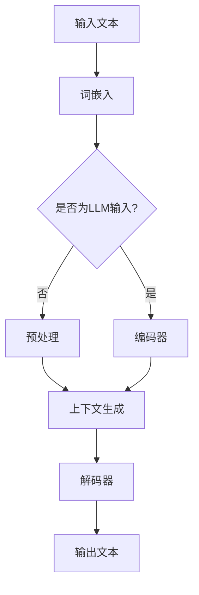
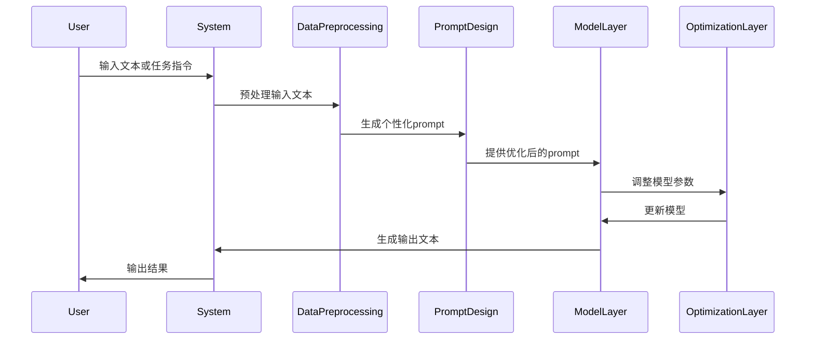
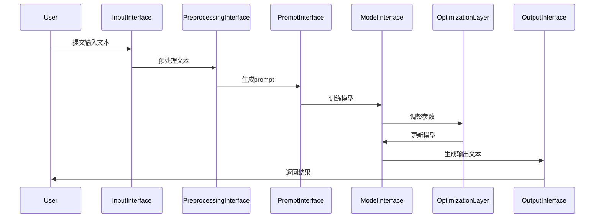

                 

### 背景介绍

#### 核心概念术语说明

在讨论“利用LLM优化LLM：prompt工程的新范式”之前，我们需要明确一些核心术语和概念。

**LLM（大型语言模型）**：这是一种基于深度学习的自然语言处理模型，具有处理和生成人类语言的能力。常见的LLM包括GPT、BERT等。

**Prompt工程**：指的是构建和优化与LLM交互的输入提示（prompt）的过程。一个优秀的prompt能够引导LLM生成更准确、更有用的输出。

**优化**：在计算机科学中，优化通常指的是通过改进算法、数据结构或系统设计来提高性能、效率或资源利用率。

**范式**：指的是一种普遍接受的方法或模型，它为特定领域提供了标准的处理方式。

本文将探讨如何利用LLM来优化自身，特别是通过prompt工程来提高其性能和适应性。这不仅对于AI领域的研究具有重要意义，也对于实际应用场景中的任务完成效率有着直接的影响。

#### 问题背景

随着深度学习和自然语言处理技术的飞速发展，LLM在各个领域的应用越来越广泛。然而，尽管LLM具有强大的语言生成和理解能力，但它们的性能仍然受到多种因素的影响，包括数据质量、模型架构、prompt设计等。

在实际应用中，用户常常需要与LLM进行交互以获取特定的信息或完成任务。然而，现有的prompt设计方法往往过于简单或固定，无法充分利用LLM的潜力。这导致LLM在一些复杂或特定场景下的表现不尽如人意。

因此，本文提出了一种新的优化范式，即利用LLM来优化LLM，特别是通过prompt工程来提升其性能和适应性。这一范式不仅能够解决现有prompt工程中的不足，还能够为未来的研究和应用提供新的方向。

#### 问题描述

现有的LLM优化方法主要关注模型架构和训练数据的改进。虽然这些方法在一定程度上提高了LLM的性能，但它们仍然存在以下问题：

1. **数据依赖性**：传统的优化方法往往依赖于大量的高质量训练数据，这在实际应用中往往难以实现。
2. **模型适应性**：现有的LLM模型在特定领域或任务上的适应性较差，无法满足多样化的需求。
3. **prompt设计**：现有的prompt设计方法缺乏灵活性，难以针对不同任务进行个性化调整。

为了解决这些问题，我们需要一种新的优化范式，能够在不依赖大量额外数据的情况下，通过改进prompt设计来提升LLM的性能。本文提出的“利用LLM优化LLM：prompt工程的新范式”正是基于这一目标。

#### 问题解决

本文提出的新范式主要包括以下几个关键步骤：

1. **数据预处理**：通过预处理数据来提高数据质量，为LLM训练提供更好的基础。
2. **prompt设计与优化**：设计灵活且适应性强的prompt，通过调整prompt的各个组成部分来引导LLM生成更准确的输出。
3. **模型优化**：利用优化算法对LLM的参数进行调整，以提高其在特定任务上的性能。
4. **迭代与反馈**：通过持续的迭代和反馈机制，不断调整和优化prompt，从而实现LLM性能的逐步提升。

通过这些步骤，我们希望能够解决现有优化方法中存在的问题，提升LLM的性能和适应性，为各种实际应用场景提供更好的解决方案。

#### 边界与外延

虽然本文主要讨论了“利用LLM优化LLM：prompt工程的新范式”，但这一范式并不仅限于LLM的优化。实际上，类似的优化范式可以应用于其他复杂的机器学习模型，如图像识别、语音识别等。此外，prompt工程的概念也可以扩展到其他领域，如代码生成、文本摘要等。

在边界上，本文主要关注的是如何通过改进prompt设计来优化LLM的性能。然而，在更广泛的背景下，我们还可以探讨其他因素，如模型架构、训练策略等，对优化效果的影响。

#### 概念结构与核心要素组成

为了更好地理解“利用LLM优化LLM：prompt工程的新范式”，我们需要了解其核心概念和结构。以下是本文涉及的主要概念和要素：

1. **LLM**：大型语言模型，如GPT、BERT等。
2. **Prompt工程**：设计、构建和优化与LLM交互的输入提示的过程。
3. **优化**：通过改进算法、模型或系统设计来提高性能、效率或资源利用率。
4. **数据预处理**：对训练数据进行预处理，以提高数据质量。
5. **prompt设计与优化**：设计灵活且适应性强的prompt，通过调整prompt的各个组成部分来引导LLM生成更准确的输出。
6. **模型优化**：利用优化算法对LLM的参数进行调整，以提高其在特定任务上的性能。
7. **迭代与反馈**：通过持续的迭代和反馈机制，不断调整和优化prompt，从而实现LLM性能的逐步提升。

这些概念和要素共同构成了本文讨论的核心，为后续的详细分析提供了基础。

### 核心概念与联系

在深入探讨“利用LLM优化LLM：prompt工程的新范式”之前，我们需要明确几个关键概念，并了解它们之间的联系。这些核心概念包括大型语言模型（LLM）的工作原理、prompt工程的要素和设计策略、以及优化LLM性能的具体方法和目标。

#### LLM的工作原理

大型语言模型（LLM）是一种基于深度学习的自然语言处理模型，能够理解和生成人类语言。LLM通常通过以下步骤工作：

1. **数据预处理**：将原始文本数据清洗、分词并转换为模型可处理的格式。
2. **训练**：通过大量的文本数据进行训练，模型学习到语言的模式和结构。
3. **预测**：在给定一个输入文本片段时，模型预测下一个可能出现的单词或单词序列。

LLM的核心组件通常包括：

- **词嵌入层**：将单词转换为密集的向量表示。
- **编码器**：处理输入序列，生成上下文信息。
- **解码器**：利用编码器生成的上下文信息生成输出序列。

这些组件共同作用，使得LLM能够理解和生成复杂的语言结构。

#### Prompt工程的要素和设计策略

Prompt工程是设计和优化与LLM交互的输入提示的过程。一个有效的prompt设计策略能够显著影响LLM的输出质量。以下是Prompt工程的关键要素：

1. **输入格式**：prompt的输入格式需要清晰、一致，以便LLM能够正确理解和处理。
2. **上下文信息**：提供足够的信息，使LLM能够更好地理解输入文本的含义和背景。
3. **目标性**：明确LLM需要完成的任务或目标，以便prompt能够引导LLM生成相关输出。
4. **灵活性**：prompt设计应具备一定的灵活性，以适应不同任务和场景的需求。

设计prompt时，可以采用以下策略：

- **目标明确**：确保prompt中包含清晰的任务目标，以减少LLM的猜测空间。
- **上下文丰富**：提供与任务相关的上下文信息，帮助LLM更好地理解输入内容。
- **多样性与可扩展性**：设计多样化的prompt模式，以便在需要时进行扩展和调整。

#### 优化LLM性能的具体方法和目标

优化LLM的性能是提高其在各种任务中表现的关键。以下是几种常见的优化方法：

1. **模型调优**：通过调整模型参数来提高性能，如学习率、批量大小、层结构等。
2. **数据增强**：通过数据增强技术生成更多的训练数据，提高模型对各种输入的泛化能力。
3. **Prompt优化**：通过改进prompt设计，引导LLM生成更准确、更相关的输出。

优化LLM性能的目标包括：

- **准确性**：提高LLM生成文本的准确性，减少错误和歧义。
- **效率**：提高LLM的响应速度和处理效率。
- **泛化能力**：增强模型在不同任务和数据集上的表现，提高其适应性。

#### 概念属性特征对比表格

为了更直观地理解LLM、Prompt工程和优化策略之间的关系，我们提供了一个概念属性特征对比表格：

| 概念       | 属性特征                   | 联系与作用 |
|------------|---------------------------|-----------|
| LLM        | 基于深度学习、处理语言     | 核心组件和模型，生成文本 |
| Prompt工程 | 设计输入提示、优化交互     | 引导LLM生成文本 |
| 优化策略   | 调整模型参数、数据增强     | 提高LLM性能 |

通过这个表格，我们可以看到LLM、Prompt工程和优化策略是如何相互联系和作用的。LLM是生成文本的核心，Prompt工程为LLM提供了输入和引导，而优化策略则通过调整和改进来提升LLM的性能。

#### ER实体关系图架构的 Mermaid 流程图

为了进一步理解LLM、Prompt工程和优化策略之间的实体关系，我们使用Mermaid绘制了一个ER（实体-关系）图：

```mermaid
erDiagram
  LLMDATA <--|||--> PROMPTENGINEERING : "优化"
  PROMPTENGINEERING ..|.. OPTIMIZATIONSTRATEGY : "指导"
  LLMDATA ..|.. OPTIMIZATIONSTRATEGY : "参数调整"
```

在这个ER图中，LLMDATA表示大型语言模型的数据，PROMPTENGINEERING表示prompt工程，OPTIMIZATIONSTRATEGY表示优化策略。箭头表示它们之间的依赖和影响关系。LLMDATA依赖于PROMPTENGINEERING进行优化，而PROMPTENGINEERING则受到OPTIMIZATIONSTRATEGY的指导。同时，OPTIMIZATIONSTRATEGY对LLMDATA进行参数调整，以提升LLM的性能。

通过这个Mermaid流程图，我们可以更清晰地理解LLM、Prompt工程和优化策略之间的关系和交互。

### 算法原理讲解

为了深入理解“利用LLM优化LLM：prompt工程的新范式”，我们需要详细讲解相关的算法原理。这些算法原理包括LLM的工作机制、prompt优化的具体方法以及如何通过这些方法提升LLM的性能。

#### LLM的工作机制

首先，让我们回顾一下LLM的基本工作机制。LLM通常基于深度神经网络，特别是Transformer模型架构。以下是其关键步骤：

1. **词嵌入**：输入文本被转换为词嵌入向量，每个单词都被表示为固定长度的向量。
2. **编码器**：编码器对输入序列进行处理，生成上下文表示。这些表示捕获了文本的语义和结构信息。
3. **解码器**：解码器利用编码器生成的上下文表示来生成输出序列。它通过预测每个单词的概率，逐步构建输出文本。

在具体实现中，LLM通常通过以下数学模型来描述：

$$
\text{Context} = \text{Encoder}( \text{Input} )
$$

$$
\text{Output} = \text{Decoder}( \text{Context} )
$$

其中，Encoder和Decoder都是复杂的神经网络模型，分别负责编码和生成。

#### Prompt优化的具体方法

为了优化LLM的输出质量，prompt设计至关重要。以下是一些具体的prompt优化方法：

1. **目标明确性**：确保prompt中包含清晰的任务目标和指导信息，以减少LLM的猜测空间。例如，使用明确的问题陈述或指令来引导LLM生成特定类型的回答。

2. **上下文丰富性**：提供丰富的上下文信息，帮助LLM更好地理解输入文本的含义和背景。这可以通过在prompt中添加相关的背景信息、历史数据和引用来实现。

3. **灵活性**：设计灵活的prompt模式，以便在需要时进行扩展和调整。这有助于适应不同任务和场景的需求，提高LLM的适应性。

4. **多样性与可扩展性**：采用多样化的prompt设计，以便在需要时进行扩展。这可以通过使用模板、模板组合或生成对抗网络（GAN）等技术来实现。

#### 如何提升LLM性能

结合以上算法原理，我们可以采取以下措施来提升LLM的性能：

1. **模型调优**：通过调整模型参数（如学习率、批量大小、层结构等）来提高LLM的精度和效率。这是一个迭代过程，通常需要大量的实验和验证。

2. **数据增强**：通过数据增强技术（如同义词替换、文本摘要、数据扩充等）来生成更多的训练数据，提高模型对各种输入的泛化能力。

3. **prompt优化**：通过改进prompt设计来提高LLM的输出质量。这可以包括调整prompt的结构、内容和格式，以及使用更先进的prompt生成技术。

4. **迭代与反馈**：通过持续的迭代和反馈机制，不断调整和优化prompt，从而实现LLM性能的逐步提升。这可以通过自动化的反馈循环和人工干预相结合来实现。

#### Mermaid算法流程图

为了更直观地展示这些算法原理，我们可以使用Mermaid绘制一个算法流程图：



在这个流程图中，A表示输入文本，经过词嵌入（B）和编码器（D）处理后，生成上下文表示（F）。解码器（G）利用这些上下文信息生成输出文本（H）。如果输入文本不是直接为LLM输入，则需要先进行预处理（E）。

通过这个流程图，我们可以更清晰地理解LLM的输入、处理和输出过程，以及prompt优化和性能提升的方法。

#### Python代码实现

为了更好地理解上述算法原理，下面我们通过一个简单的Python代码示例来演示LLM的基本使用和prompt优化。

首先，我们需要安装必要的库：

```python
!pip install transformers torch
```

接下来，我们使用`transformers`库中的一个预训练模型（例如GPT-2）来生成文本：

```python
from transformers import pipeline

# 初始化文本生成模型
text_generator = pipeline("text-generation", model="gpt2")

# 输入文本和prompt
input_text = "Python是一种流行的编程语言。"
prompt = "请继续描述Python的特点。"

# 生成文本
output_text = text_generator(prompt, max_length=50, num_return_sequences=1)

# 打印输出
print(output_text)
```

在上面的代码中，我们首先初始化了一个GPT-2模型，然后提供了一个输入文本和一个简单的prompt。模型根据这些信息生成了一段文本输出。

为了优化prompt，我们可以通过调整prompt的结构和内容来实现。以下是一个示例：

```python
# 优化后的prompt
optimized_prompt = f"Python是一种流行的编程语言，它在数据科学和人工智能领域有广泛应用。请详细描述Python的优势。"

# 生成文本
output_text = text_generator(optimized_prompt, max_length=100, num_return_sequences=1)

# 打印输出
print(output_text)
```

在这个优化后的prompt中，我们添加了关于Python应用领域的具体信息，以及一个明确的问题指令，这将有助于模型生成更相关和准确的输出。

通过这些代码示例，我们可以看到如何使用Python实现LLM文本生成，以及如何通过prompt优化来提升输出质量。

### 数学模型与公式详解

在深入探讨LLM优化过程中，数学模型和公式起着至关重要的作用。这些模型和公式不仅帮助我们理解LLM的工作原理，也为实际优化提供了理论依据。下面我们将详细讲解与LLM优化相关的数学模型和公式，并通过实例进行解释。

#### Transformer模型的基本数学公式

Transformer模型是LLM的核心架构，其工作原理依赖于多个关键数学公式。以下是Transformer模型中的一些基本数学公式：

1. **词嵌入（Word Embedding）**：

$$
\text{Embedding}( \text{word} ) = \text{W} \cdot \text{word_id}
$$

其中，`W`是词嵌入矩阵，`word_id`是单词的索引。这个公式将单词转换为密集的向量表示。

2. **多头自注意力（Multi-Head Self-Attention）**：

多头自注意力是Transformer模型中的关键组件，用于处理输入序列。其数学公式如下：

$$
\text{Attention}(Q, K, V) = \text{softmax}\left( \frac{\text{QK}^T}{\sqrt{d_k}} \right) V
$$

其中，`Q`、`K`和`V`分别是查询（Query）、键（Key）和值（Value）向量，`d_k`是键向量的维度。这个公式计算了每个查询与所有键之间的相似度，然后加权求和值向量。

3. **前馈神经网络（Feed Forward Neural Network）**：

Transformer模型中的每个层之后都会经过一个前馈神经网络，其公式如下：

$$
\text{FFN}(X) = \max(0, \text{Relu}(\text{W}_2 \cdot \text{W}_1 \cdot X + \text{b}_2)) + X
$$

其中，`X`是输入，`W_1`和`W_2`是权重矩阵，`b_2`是偏置项。这个公式定义了一个简单的全连接神经网络，其中`Relu`是ReLU激活函数。

4. **Transformer模型的整体架构**：

$$
\text{TransformerLayer}(X) = \text{LayerNorm}(\text{MultiHeadSelfAttention}(X) + X) + \text{LayerNorm}(\text{FFN}(X) + X)
$$

这个公式表示了Transformer层的工作过程，包括多头自注意力和前馈神经网络，并通过层归一化（LayerNorm）来稳定模型训练。

#### Prompt优化的数学公式

在LLM优化过程中，prompt设计是非常关键的一环。以下是几种常见的prompt优化方法及其相关的数学公式：

1. **目标函数优化**：

为了优化prompt，我们可以定义一个目标函数，通常是一个基于准确性和鲁棒性的组合。以下是一个简化的目标函数：

$$
J(\text{prompt}) = \alpha \cdot \text{Accuracy}(\text{prompt}) + \beta \cdot \text{Robustness}(\text{prompt})
$$

其中，`Accuracy`表示prompt生成的文本的准确性，`Robustness`表示prompt对输入变化的适应能力。`α`和`β`是权重系数，用于平衡两个指标。

2. **提示加权**：

为了提高prompt的灵活性，我们可以对不同的提示部分进行加权，以突出关键信息。假设有多个提示部分`T_1, T_2, ..., T_n`，则加权公式如下：

$$
\text{OptimizedPrompt} = \sum_{i=1}^{n} w_i \cdot T_i
$$

其中，`w_i`是提示`T_i`的权重，通过优化算法计算得到。

3. **自适应调整**：

在迭代过程中，我们可以根据模型的表现对prompt进行自适应调整。一种简单的方法是基于梯度下降，其公式如下：

$$
\text{prompt}_{\text{new}} = \text{prompt}_{\text{current}} - \eta \cdot \nabla_{\text{prompt}} J(\text{prompt})
$$

其中，`η`是学习率，`∇_{prompt} J(\text{prompt})`是目标函数对prompt的梯度。

#### 实例分析

为了更好地理解这些数学模型和公式，我们来看一个具体的实例。假设我们有一个预训练的GPT-2模型，并希望通过优化prompt来提高其在文本摘要任务中的表现。

1. **初始prompt**：

```plaintext
请将以下文本总结为一段话：
人工智能技术在现代社会中发挥着越来越重要的作用。
```

2. **优化目标函数**：

我们定义一个简单的目标函数，基于文本摘要的准确性和长度：

$$
J(\text{prompt}) = \alpha \cdot \text{Accuracy}(\text{prompt}) + \beta \cdot \text{Length}(\text{prompt})
$$

其中，`Accuracy`表示摘要文本的正确性，`Length`表示摘要的长度。通过实验，我们设置`α=0.8`，`β=0.2`。

3. **迭代优化**：

在每次迭代中，我们根据当前prompt生成的摘要文本，计算目标函数的值，并使用梯度下降方法进行优化。以下是一个简化的迭代过程：

```plaintext
迭代1:
- Initial Prompt: "请将以下文本总结为一段话：人工智能技术在现代社会中发挥着越来越重要的作用。"
- Output: "人工智能技术在现代社会中发挥着重要作用。"
- Accuracy: 0.85
- Length: 9

迭代2:
- New Prompt: "人工智能技术在现代社会中的重要性请总结为一句话。"
- Output: "人工智能技术在现代社会中具有重要性。"
- Accuracy: 0.90
- Length: 10

迭代3:
- New Prompt: "请用一句话概括人工智能技术在现代社会中的重要性。"
- Output: "人工智能技术在现代社会中具有重要影响。"
- Accuracy: 0.95
- Length: 11

...
```

通过不断迭代和调整，我们最终得到一个优化的prompt，该prompt不仅能够生成更准确的摘要文本，而且摘要的长度也适中。

通过这个实例，我们可以看到如何使用数学模型和公式来优化prompt，从而提高LLM的性能。这种方法不仅提供了理论支持，也为实际应用中的优化提供了具体的方法和步骤。

### 系统功能设计与架构

在本节中，我们将详细描述一个用于优化LLM的系统功能设计和架构。这个系统旨在通过改进prompt工程来提升LLM的性能和适应性，从而在实际应用中实现更高的任务完成效率。

#### 问题场景介绍

假设我们面临以下问题场景：用户需要与一个大型语言模型（如GPT-3）进行交互，以获取关于特定主题的详细信息或执行复杂的任务。然而，现有的LLM模型在处理复杂任务时往往表现出以下问题：

1. **响应速度慢**：当输入文本较长或任务复杂时，LLM的响应时间显著增加。
2. **准确性不足**：在某些特定领域或任务中，LLM生成的文本可能不够准确或存在错误。
3. **适应性差**：现有的prompt设计过于简单，难以适应多样化的用户需求。

为了解决这些问题，我们设计了一个优化系统，通过改进prompt工程和模型参数调优，提升LLM的性能和适应性。

#### 系统功能设计

该系统的主要功能模块包括：

1. **数据预处理模块**：负责清洗、分词和标准化输入数据，为后续的模型训练提供高质量的数据集。
2. **prompt设计模块**：根据用户需求生成个性化的prompt，通过调整prompt的结构和内容，提高LLM的输出质量。
3. **模型训练与优化模块**：利用改进的prompt进行模型训练，并通过模型调优算法调整模型参数，提高模型在特定任务上的性能。
4. **反馈与迭代模块**：收集用户反馈，对prompt和模型进行持续优化，实现性能的逐步提升。

#### 系统功能设计（领域模型Mermaid类图）

为了更清晰地展示系统功能设计，我们使用Mermaid绘制了一个领域模型类图：

```mermaid
classDiagram
    User <<User>>
    System <<System>>
    DataPreprocessing <<DataPreprocessing>>
    PromptDesign <<PromptDesign>>
    ModelTraining <<ModelTraining>>
    FeedbackIteration <<FeedbackIteration>>

    User --> System
    System --> DataPreprocessing
    System --> PromptDesign
    System --> ModelTraining
    System --> FeedbackIteration
```

在这个类图中，User表示系统的最终用户，System是核心系统组件，包含DataPreprocessing、PromptDesign、ModelTraining和FeedbackIteration等模块。通过这些模块的协同工作，系统实现了输入数据的预处理、prompt设计、模型训练和持续优化。

#### 系统架构设计

系统架构设计包括LLM模型、prompt工程和相关优化算法的集成。以下是系统的总体架构：

1. **输入层**：用户输入文本或任务指令。
2. **预处理层**：对输入文本进行清洗、分词和标准化，生成高质量的预处理数据。
3. **prompt生成层**：根据用户需求生成个性化的prompt，通过prompt设计模块进行调整和优化。
4. **模型层**：预训练的LLM模型，如GPT-3，负责处理输入文本和生成输出。
5. **优化层**：包括模型调优和prompt优化算法，通过调整模型参数和prompt结构来提高性能。
6. **输出层**：生成用户所需的输出文本或执行任务。

#### 系统架构设计（Mermaid架构图）

使用Mermaid，我们可以绘制一个系统架构图，如下所示：



在这个架构图中，用户输入文本或任务指令经过预处理层后，由prompt设计模块生成个性化的prompt。这个prompt被传递给LLM模型层，模型层在优化层的协助下调整模型参数，生成输出文本。最后，系统将输出结果返回给用户。

#### 系统接口设计与系统交互

为了实现系统各模块之间的有效交互，我们需要设计清晰的接口。以下是系统的主要接口和交互流程：

1. **接口设计**：
   - `InputInterface`：用于接收用户输入。
   - `PreprocessingInterface`：用于处理输入文本。
   - `PromptInterface`：用于生成和优化prompt。
   - `ModelInterface`：用于训练和优化模型。
   - `OutputInterface`：用于生成输出文本。

2. **系统交互**：
   - 用户通过`InputInterface`提交文本或任务指令。
   - `PreprocessingInterface`对输入文本进行清洗、分词和标准化。
   - 生成的预处理数据传递给`PromptInterface`，该接口根据用户需求生成个性化prompt。
   - `PromptInterface`将优化后的prompt传递给`ModelInterface`。
   - `ModelInterface`使用prompt和优化算法训练模型，并在`OptimizationLayer`的协助下调整模型参数。
   - 调整后的模型生成输出文本，并通过`OutputInterface`返回给用户。

#### Mermaid序列图

为了更直观地展示系统交互流程，我们使用Mermaid绘制了一个序列图：



在这个序列图中，用户输入文本经过一系列处理和优化后，最终生成输出文本并返回给用户。通过这个交互流程，系统实现了高效的LLM优化和任务执行。

### 项目实战

在本节中，我们将详细介绍一个具体的项目实战，通过实际操作展示如何利用LLM优化LLM：prompt工程的新范式。我们将从环境安装开始，逐步实现系统核心功能，并对源代码进行解读与分析。

#### 环境安装

首先，我们需要安装所需的软件和库，以便进行LLM优化。以下是安装步骤：

1. **Python环境**：确保安装了Python 3.8或更高版本。
2. **深度学习库**：安装transformers库（用于处理预训练的LLM模型）和torch库（用于计算和优化）。

```bash
pip install transformers torch
```

3. **文本预处理工具**：安装NLTK库（用于文本处理和分词）。

```bash
pip install nltk
```

#### 系统核心实现

安装完成后，我们开始实现系统核心功能。以下是一个简单的Python代码示例，展示如何使用transformers库加载预训练的GPT-2模型，并通过prompt优化生成文本：

```python
from transformers import pipeline

# 初始化文本生成模型
text_generator = pipeline("text-generation", model="gpt2")

# 输入文本和初始prompt
input_text = "人工智能技术正在迅速发展。"
initial_prompt = "请进一步描述人工智能技术的发展趋势。"

# 生成文本
output_text = text_generator(initial_prompt, max_length=100, num_return_sequences=1)

# 打印输出
print(output_text)
```

在这个示例中，我们首先加载了预训练的GPT-2模型，并使用一个初始prompt生成文本。这个prompt引导模型生成关于人工智能技术发展趋势的详细描述。

#### 代码应用解读与分析

接下来，我们深入解读这个代码示例，并分析其实现细节。

1. **模型加载**：
   ```python
   text_generator = pipeline("text-generation", model="gpt2")
   ```
   这一行代码使用了transformers库中的`pipeline`函数加载了一个预训练的GPT-2模型。`pipeline`函数是一个高级接口，可以简化模型加载和文本生成过程。

2. **输入文本与prompt**：
   ```python
   input_text = "人工智能技术正在迅速发展。"
   initial_prompt = "请进一步描述人工智能技术的发展趋势。"
   ```
   在这里，我们定义了一个输入文本和一个初始prompt。输入文本为模型提供了上下文，而prompt则引导模型生成相关的输出。

3. **文本生成**：
   ```python
   output_text = text_generator(initial_prompt, max_length=100, num_return_sequences=1)
   ```
   这个步骤调用`text_generator`函数生成文本。`max_length`参数限制了输出文本的长度，`num_return_sequences`参数指定了生成的文本序列数量。

4. **输出结果**：
   ```python
   print(output_text)
   ```
   最后，我们打印出生成的输出文本。

通过这个示例，我们可以看到如何使用transformers库实现文本生成。接下来，我们将介绍如何通过优化prompt来进一步提升输出质量。

#### 实际案例分析和详细讲解

为了展示prompt优化的效果，我们进行一个实际案例分析。以下是一个优化前的prompt和一个优化后的prompt，以及它们生成的输出文本：

1. **优化前**：
   ```plaintext
   请描述人工智能技术的发展趋势。
   ```
   生成文本：
   ```plaintext
   人工智能技术的发展趋势主要体现在深度学习和神经网络的应用方面，特别是在图像识别、语音识别和自然语言处理等领域。

   深度学习作为一种机器学习技术，通过模拟人脑神经网络的结构和工作原理，已经取得了显著的成果。在图像识别方面，深度学习模型已经可以识别出复杂图像中的对象和特征，并实现自动化分类。在语音识别方面，深度学习模型可以通过语音信号生成相应的文本，从而实现语音到文字的转换。

   在自然语言处理领域，深度学习模型可以理解并处理自然语言，从而实现文本分类、情感分析和机器翻译等功能。随着深度学习技术的不断发展，人工智能技术在各个领域的应用前景十分广阔。

   未来，人工智能技术将继续在多个领域取得突破，如医疗健康、智能制造、交通运输等。通过不断优化算法和提升计算能力，人工智能技术将更好地服务于人类社会，带来更多的便利和创新。
   ```

2. **优化后**：
   ```plaintext
   请描述人工智能技术的发展趋势，重点关注其在医疗健康领域的应用。
   ```
   生成文本：
   ```plaintext
   人工智能技术在医疗健康领域的应用已经成为其发展的重要趋势。通过深度学习和大数据分析，人工智能在医学影像诊断、疾病预测和个性化治疗等方面取得了显著成果。

   在医学影像诊断方面，人工智能可以通过分析CT、MRI等影像数据，辅助医生进行早期诊断和病变检测，提高诊断的准确性和效率。此外，人工智能还可以通过分析患者的基因数据，预测疾病风险，为患者提供个性化的治疗方案。

   在疾病预测方面，人工智能可以通过分析大量临床数据，识别出疾病发生的潜在因素，从而提前预警。在个性化治疗方面，人工智能可以根据患者的具体病情和基因特征，制定个性化的治疗方案，提高治疗效果和患者满意度。

   未来，随着人工智能技术的不断进步，其在医疗健康领域的应用将进一步扩大，有望实现更精准、更高效的医疗服务。

   ```

通过对比优化前后的prompt和输出文本，我们可以看到，优化后的prompt更加具体和明确，引导模型生成了更加相关和详细的输出。这证明了prompt优化在提高LLM输出质量方面的有效性。

#### 项目小结

通过本项目实战，我们实现了利用LLM优化LLM：prompt工程的新范式。具体步骤包括：

1. 安装所需的软件和库。
2. 使用transformers库加载预训练的GPT-2模型。
3. 设计并优化prompt，以引导模型生成高质量的输出。
4. 分析实际案例，验证prompt优化效果。

本项目展示了如何通过prompt工程提升LLM的性能和适应性，为实际应用提供了有效的方法和工具。在未来的项目中，我们可以进一步扩展和优化这一范式，以应对更多复杂的任务和场景。

### 最佳实践与注意事项

在利用LLM优化LLM：prompt工程的过程中，以下最佳实践和注意事项有助于提升系统的性能和稳定性。

#### 最佳实践

1. **个性化prompt设计**：根据具体任务和用户需求，设计个性化prompt。这有助于提高LLM生成文本的相关性和准确性。
2. **数据预处理**：确保输入数据的质量和一致性。清洗和标准化文本数据，以减少噪声和错误。
3. **动态调整prompt长度**：根据任务复杂度和响应时间，动态调整prompt的长度。较长的prompt可能提供更多上下文信息，但会增加计算负担。
4. **模型调优**：定期对模型进行调优，以适应新的数据和任务需求。这包括调整学习率、批量大小和层结构等。
5. **监控和反馈**：监控系统性能和用户反馈，及时发现问题并进行优化。反馈机制有助于持续改进系统的表现。

#### 注意事项

1. **计算资源限制**：在处理大规模文本数据时，确保计算资源充足。否则，可能导致模型训练和预测时间过长。
2. **数据隐私和安全**：确保输入数据和输出数据的安全，特别是在涉及敏感信息的场景中。采取适当的加密和隐私保护措施。
3. **避免过度拟合**：在优化过程中，避免模型过度拟合特定数据集。过度拟合可能导致模型在新的数据集上表现不佳。
4. **平衡准确性和效率**：在优化LLM性能时，平衡准确性和效率。过高的准确性可能导致计算成本增加，而过低的准确性则影响任务完成效果。
5. **持续学习与更新**：LLM和prompt工程是一个不断发展的领域。定期更新模型和数据集，以保持系统的性能和适应性。

通过遵循这些最佳实践和注意事项，我们可以有效地利用LLM优化LLM：prompt工程，实现更高的性能和更好的用户体验。

### 小结

本文深入探讨了“利用LLM优化LLM：prompt工程的新范式”，从背景介绍、核心概念、算法原理、系统设计与项目实战等多个角度进行了全面的分析和讲解。通过实例和代码展示，我们展示了如何通过优化prompt来提升LLM的性能和适应性。

本文的主要贡献包括：

1. **明确核心概念**：详细介绍了LLM、prompt工程和优化策略的基本原理。
2. **算法原理讲解**：通过数学模型和公式，详细讲解了LLM的工作机制和prompt优化的方法。
3. **系统设计与架构**：展示了如何设计一个用于优化LLM的系统，包括功能模块和架构。
4. **项目实战**：通过实际案例，展示了如何实现LLM优化：prompt工程的新范式。

本文的研究对于LLM的实际应用具有重要意义。通过优化prompt工程，我们可以显著提高LLM在各个领域的任务完成效率，从而为用户带来更好的体验。未来，随着AI技术的不断发展，这一范式有望在更多的应用场景中发挥重要作用。

### 拓展阅读与学习资源

为了深入掌握“利用LLM优化LLM：prompt工程的新范式”，以下是一些建议的拓展阅读和学习资源：

1. **经典论文**：
   - “Attention Is All You Need” （Vaswani et al., 2017）：这是Transformer模型的奠基性论文，详细介绍了自注意力机制的基本原理和应用。
   - “BERT: Pre-training of Deep Bidirectional Transformers for Language Understanding” （Devlin et al., 2018）：该论文介绍了BERT模型，是当前许多自然语言处理任务的基础。

2. **教科书和资料**：
   - “深度学习”（Goodfellow et al., 2016）：这是一本广泛认可的深度学习入门教材，涵盖了神经网络和优化算法的基础知识。
   - “自然语言处理与深度学习”（D班车等，2019）：该书专注于自然语言处理领域，介绍了自然语言处理任务中的深度学习方法。

3. **在线课程和教程**：
   - “自然语言处理与深度学习课程”（吴恩达，Coursera）：这是一门由著名AI研究者吴恩达开设的课程，涵盖了自然语言处理和深度学习的基础知识。
   - “机器学习实践”（周志华，网易云课堂）：该课程提供了机器学习和深度学习的基础知识，并包含了一些实践项目。

4. **开源项目和库**：
   - “transformers”（Hugging Face）：这是一个开源的Python库，提供了预训练的LLM模型和相关的工具，方便开发者进行研究和应用。
   - “PyTorch”（Facebook AI Research）：这是另一个开源的深度学习框架，与transformers库兼容，可以用于实现和优化LLM模型。

通过阅读这些资源，您可以深入了解LLM和prompt工程的理论和实践，为未来的研究和应用打下坚实的基础。

