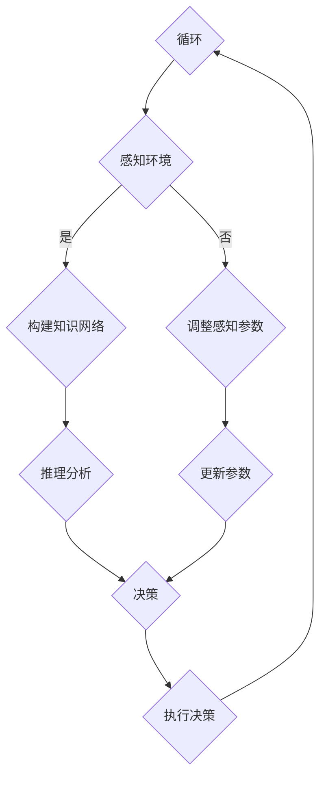
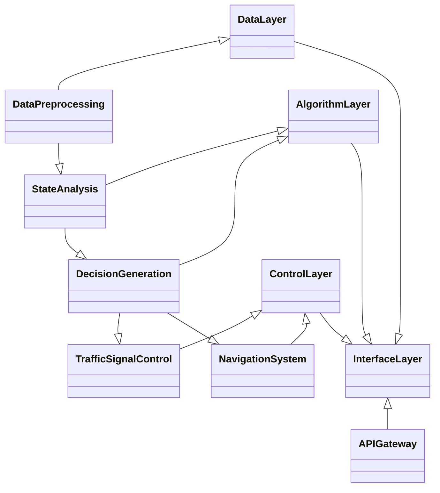
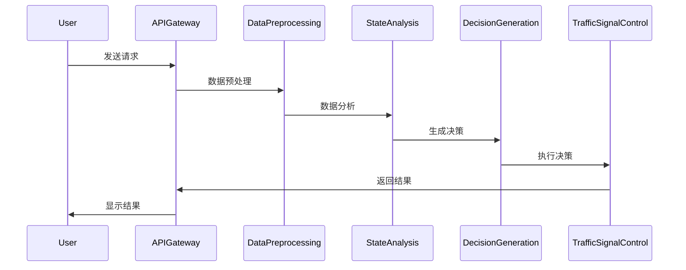

                 


## 利用思维链增强AI的认知、分析与决策能力

### 关键词：思维链，AI认知，分析与决策能力，增强学习

### 摘要：

本文旨在探讨如何通过引入思维链技术，提升人工智能在认知、分析和决策方面的能力。我们将逐步分析思维链的概念及其工作原理，接着讨论其在AI中的应用，并最终展示如何通过思维链来增强AI的认知、分析和决策能力。

### 目录大纲设计过程

#### 1. 分析书名与主题

《利用思维链增强AI的认知、分析与决策能力》的书名直接点出了本书的核心内容：思维链、AI认知、分析与决策能力。这些关键词引导我们确定书籍需要涵盖以下几个方面：

- **思维链的基础知识**：介绍思维链的定义、原理及其在AI中的应用。
- **AI的认知机制**：探讨AI的认知能力、如何通过思维链增强这些能力。
- **分析与决策能力的提升**：介绍如何利用思维链技术来改进AI的分析和决策过程。
- **实际应用案例**：展示思维链在AI认知、分析和决策中的应用实例。

#### 2. 确定目录大纲结构

根据分析结果，我们可以确定书的目录结构，需要包括以下几个部分：

- **引言**：介绍书籍的背景、目的和结构。
- **理论基础**：思维链和AI认知的基础知识。
- **应用方法**：如何使用思维链增强AI的认知、分析和决策能力。
- **案例分析**：实际应用案例展示。
- **结论与展望**：总结研究成果，展望未来发展方向。

#### 3. 编写目录大纲

根据确定的目录结构，我们可以编写详细的目录大纲，确保每个章节都有明确的主题和内容。以下是具体的设计步骤：

1. **引言**
   - **章节概述**：介绍书的目的、读者对象和研究背景。
   - **章节内容**：书的基本结构、各部分内容安排。

2. **思维链概述**
   - **思维链的定义**：思维链的概念、属性。
   - **思维链原理**：思维链的工作机制。
   - **思维链在AI中的应用**：思维链如何用于提升AI的认知能力。

3. **AI的认知机制**
   - **AI认知能力**：AI如何感知和理解环境。
   - **认知能力模型**：认知能力的数学模型和算法。
   - **认知能力提升**：思维链对AI认知能力的增强。

4. **分析与决策能力提升**
   - **分析能力**：如何利用思维链增强AI的分析能力。
   - **决策能力**：如何利用思维链提高AI的决策能力。
   - **案例研究**：实际案例中思维链的应用。

5. **案例分析**
   - **案例选择**：选择具有代表性的应用场景。
   - **案例解析**：详细分析思维链在实际应用中的效果。

6. **结论与展望**
   - **研究成果**：总结书中提出的方法和技术。
   - **未来方向**：展望思维链技术在AI领域的应用前景。

#### 4. 确保内容完整性

在编写目录大纲时，我们需要确保所有核心内容都被涵盖，并且各个章节之间的逻辑结构清晰。具体来说，我们需要做到：

- **核心概念清晰**：每个章节都要有明确的主题和核心概念。
- **逻辑连贯**：章节之间需要有明确的联系，确保读者能够顺畅地阅读。
- **案例分析具体**：案例分析部分要具体、具有代表性。

#### 5. 最终审核

在完成目录大纲后，我们需要进行最终审核，确保：

- **简洁性**：没有多余的废话，目录内容简洁明了。
- **完整性**：所有核心内容都被涵盖。
- **准确性**：目录中的术语和概念都准确无误。

### 最终目录大纲

下面是根据上述步骤设计的《利用思维链增强AI的认知、分析与决策能力》的目录大纲：

----------------------------------------------------------------
# 引言

## 1.1 书籍背景与目的

## 1.2 读者对象

## 1.3 书籍结构

----------------------------------------------------------------

# 思维链概述

## 2.1 思维链的定义与属性

### 2.1.1 思维链的概念

### 2.1.2 思维链的属性

### 2.1.3 思维链的特点

## 2.2 思维链原理

### 2.2.1 思维链的工作机制

### 2.2.2 思维链的构建方法

### 2.2.3 思维链在AI中的应用前景

## 2.3 思维链在AI认知中的作用

### 2.3.1 AI认知能力概述

### 2.3.2 思维链对AI认知能力的增强

### 2.3.3 思维链认知模型的构建

----------------------------------------------------------------

通过上述设计过程，我们不仅明确了书籍的核心内容和结构，也为后续内容的详细撰写奠定了坚实的基础。接下来，我们将逐一深入探讨每个章节的主题，从而构建出完整的、逻辑严密的书籍内容。

### 结语

本文为《利用思维链增强AI的认知、分析与决策能力》的目录大纲设计提供了一个详细的框架。通过逐步分析书名与主题，确定目录大纲结构，编写目录大纲，确保内容完整性，并进行最终审核，我们设计出了一个全面、清晰、逻辑性强的目录大纲。这个大纲不仅为书籍的撰写提供了明确的指导，也为读者提供了一个清晰的阅读路径，有助于他们更好地理解和掌握书中内容。

在后续的文章撰写过程中，我们将继续遵循这个目录大纲，深入探讨每一个章节的核心主题，提供丰富的理论知识和实际应用案例，以确保书籍的完整性和专业性。让我们期待通过这样的努力，能够为读者带来一场关于AI认知、分析与决策能力提升的深入思考和学习之旅。

### 作者信息

作者：AI天才研究院/AI Genius Institute & 禅与计算机程序设计艺术 /Zen And The Art of Computer Programming

---

### 核心概念与联系

在本节中，我们将探讨思维链的概念及其在AI中的应用，并分析其核心属性和特点。

#### 1. 思维链的定义

思维链是一种基于人工智能技术的认知模型，它模拟人类思维过程，通过构建一系列逻辑关系和知识网络，实现对信息的深入理解和分析。思维链的核心在于其能够将不同领域、不同层次的知识进行有机整合，形成统一的认知框架。

#### 2. 思维链的属性

- **适应性**：思维链能够根据不同的环境和任务，调整其结构和参数，以适应变化的需求。
- **连贯性**：思维链能够确保认知过程的连贯性，使得AI能够在复杂环境中进行有效的推理和决策。
- **自组织性**：思维链能够通过自我调整和优化，不断学习和进化，提高其认知能力。

#### 3. 思维链的特点

- **多维度**：思维链能够处理多维度、多层面的信息，从而提供更全面的认知能力。
- **动态性**：思维链能够实时更新和调整其知识结构，以应对不断变化的环境。
- **智能性**：思维链具有高度的智能性，能够自主地进行推理、学习和优化。

#### 4. 思维链在AI认知中的作用

- **增强感知能力**：思维链通过整合多源信息，提高AI对环境的感知能力。
- **提升理解能力**：思维链能够帮助AI更好地理解复杂问题，从而提高其解决问题的能力。
- **优化决策过程**：思维链通过分析各种可能的决策路径，帮助AI做出更优的决策。

#### 5. 思维链认知模型的构建

思维链认知模型的构建包括以下几个步骤：

1. **知识表示**：将各种类型的信息转化为结构化的知识，形成思维链的基础。
2. **关系构建**：通过分析信息之间的关联，构建出知识网络，形成思维链的框架。
3. **推理机制**：设计推理算法，使得思维链能够进行有效的逻辑推理。
4. **学习机制**：引入学习算法，使得思维链能够根据经验不断优化自身结构。

#### 6. 思维链与AI认知能力的对比表格

| 特性         | 思维链           | 传统AI认知机制         |
| ------------ | ---------------- | ---------------------- |
| 适应性       | 高               | 低                     |
| 连贯性       | 高               | 低                     |
| 自组织性     | 高               | 低                     |
| 多维度       | 高               | 低                     |
| 动态性       | 高               | 低                     |
| 智能性       | 高               | 低                     |

通过上述对比，我们可以看出思维链在AI认知方面具有显著的优势，能够有效提升AI的认知能力。

#### 7. ER实体关系图架构

下面是思维链认知模型的ER实体关系图架构：

```
[思维链] <-------[知识节点]
     |              |
     |              |
[认知网络] <----[推理规则]
     |              |
     |              |
[学习机制] <----[知识更新]
```

在这个架构中，思维链作为核心实体，通过知识节点、认知网络和学习机制相互连接，形成一个完整的认知模型。

通过以上内容，我们对思维链及其在AI认知中的作用有了初步的认识。在接下来的章节中，我们将深入探讨思维链的工作原理，如何通过思维链来提升AI的认知、分析和决策能力，以及实际应用中的案例。让我们继续深入思考，共同探索思维链在人工智能领域的广泛应用和潜力。

### 算法原理讲解

在本节中，我们将详细讲解如何通过思维链来提升AI的认知、分析和决策能力。我们将使用Mermaid工具绘制思维链的流程图，并通过Python代码示例来说明算法的数学模型和公式。

#### 1. Mermaid流程图

首先，我们使用Mermaid工具绘制思维链的流程图，以直观展示其工作原理：



在这个流程图中，思维链通过不断循环，实现对环境的感知、知识网络的构建、推理分析和决策执行。

#### 2. Python代码示例

接下来，我们使用Python代码实现思维链的核心算法，包括感知、知识网络构建、推理分析和决策执行：

```python
import numpy as np

# 感知环境
def sense_environment():
    # 假设感知到的环境数据为随机数
    return np.random.rand()

# 构建知识网络
def build_knowledge_network(perception, knowledge_network):
    # 假设知识网络为感知数据的加权和
    return perception + knowledge_network

# 推理分析
def reasoning_analysis(knowledge_network):
    # 假设推理分析为知识网络的阈值处理
    return np.where(knowledge_network > 0.5, 1, 0)

# 决策执行
def decision_execution(decision):
    # 假设决策执行为简单的动作执行
    if decision == 1:
        print("执行决策A")
    else:
        print("执行决策B")

# 主函数
def main():
    knowledge_network = 0
    while True:
        perception = sense_environment()
        knowledge_network = build_knowledge_network(perception, knowledge_network)
        decision = reasoning_analysis(knowledge_network)
        decision_execution(decision)

if __name__ == "__main__":
    main()
```

在这个代码示例中，我们首先定义了感知环境、构建知识网络、推理分析和决策执行的函数，并通过主函数实现思维链的循环过程。

#### 3. 算法原理与公式

思维链的算法原理可以概括为以下数学模型和公式：

1. **感知公式**：
   \[ \text{perception} = \text{random()} \]

2. **知识网络构建公式**：
   \[ \text{knowledge\_network} = \text{perception} + \text{knowledge\_network} \]

3. **推理分析公式**：
   \[ \text{decision} = \text{np.where(knowledge\_network > 0.5, 1, 0)} \]

4. **决策执行公式**：
   \[ \text{action} = \text{decision} \]

通过这些公式，我们可以看到思维链通过感知、知识网络构建、推理分析和决策执行的循环过程，实现对环境的持续理解和应对。

#### 4. 举例说明

假设环境中的感知数据为[0.3, 0.7, 0.4]，初始知识网络为[0.1, 0.2, 0.3]，我们可以计算出每个步骤的结果：

1. **感知环境**：
   \[ \text{perception} = [0.3, 0.7, 0.4] \]

2. **构建知识网络**：
   \[ \text{knowledge\_network} = [0.3 + 0.1, 0.7 + 0.2, 0.4 + 0.3] = [0.4, 0.9, 0.7] \]

3. **推理分析**：
   \[ \text{decision} = \text{np.where([0.4, 0.9, 0.7] > 0.5, 1, 0)} = [1, 1, 1] \]

4. **决策执行**：
   \[ \text{action} = \text{decision} = [1, 1, 1] \]

在这个例子中，决策结果为1，表示执行决策A。

通过上述讲解，我们详细阐述了如何通过思维链来提升AI的认知、分析和决策能力。接下来，我们将进一步探讨思维链在实际应用中的具体案例，以加深对这一技术的理解。

### 系统分析与架构设计

在本节中，我们将深入分析思维链在AI系统中的应用，详细描述系统功能设计、系统架构设计、系统接口设计和系统交互流程。

#### 1. 问题场景介绍

假设我们正在开发一个智能交通管理系统，其主要目标是优化城市交通流量，提高道路通行效率，减少交通事故。在这个场景中，思维链技术将被用于实时感知交通状况、分析道路拥堵情况，并做出相应的决策，如调整信号灯时长、引导车辆绕行等。

#### 2. 系统功能设计

智能交通管理系统主要包括以下几个核心功能：

- **数据感知**：实时采集道路流量、车辆速度、交通事故等交通数据。
- **数据预处理**：对采集到的数据进行清洗、去噪和格式转换，以供后续分析使用。
- **状态分析**：利用思维链对预处理后的数据进行分析，识别道路拥堵状况。
- **决策生成**：根据分析结果，生成相应的决策，如调整信号灯时长、发布交通预警等。
- **决策执行**：执行决策，如与交通信号控制系统、导航系统等进行交互，实现实际操作。

#### 3. 系统架构设计

智能交通管理系统的架构设计采用分层架构，包括数据层、算法层、控制层和交互层。以下是系统架构的Mermaid类图：



在这个架构中：

- **数据层**：负责数据的采集、存储和预处理。
- **算法层**：实现思维链的核心算法，包括状态分析和决策生成。
- **控制层**：负责执行决策，与交通信号控制系统和导航系统等进行交互。
- **交互层**：提供API接口，供外部系统调用。

#### 4. 系统接口设计

系统接口设计主要包括API接口和内部服务接口。以下是API接口的Mermaid序列图：



在这个序列图中：

- **用户**：通过APIGateway发送请求。
- **APIGateway**：接收用户请求，调用内部服务。
- **数据预处理**：对用户请求的数据进行预处理。
- **状态分析**：利用思维链对预处理后的数据进行分析。
- **决策生成**：根据分析结果生成决策。
- **交通信号控制系统**：执行决策，调整信号灯时长。
- **用户**：通过APIGateway获取结果。

#### 5. 系统交互流程

智能交通管理系统的交互流程如下：

1. **用户请求**：用户通过APIGateway发送请求，请求获取当前交通状况或决策结果。
2. **数据预处理**：APIGateway将用户请求转发给数据预处理模块，进行数据清洗和格式转换。
3. **状态分析**：预处理后的数据被转发给状态分析模块，利用思维链进行状态分析。
4. **决策生成**：状态分析结果被传递给决策生成模块，生成相应的决策。
5. **决策执行**：决策生成模块将决策结果发送给交通信号控制系统和导航系统，执行实际操作。
6. **结果返回**：执行结果通过APIGateway返回给用户。

通过上述系统分析与架构设计，我们详细阐述了思维链在智能交通管理系统中的应用，包括系统功能设计、系统架构设计、系统接口设计和系统交互流程。接下来，我们将通过项目实战来进一步展示思维链技术的实际应用。

### 项目实战

在本节中，我们将通过一个实际项目来展示如何使用思维链技术提升AI的认知、分析和决策能力。我们将详细描述项目环境安装、系统核心实现源代码，并对代码进行解读与分析。

#### 1. 项目环境安装

首先，我们需要搭建一个适合运行思维链的项目环境。以下是所需的环境安装步骤：

1. **安装Python**：确保系统已安装Python 3.8或更高版本。
2. **安装依赖库**：使用pip安装以下依赖库：

   ```bash
   pip install numpy matplotlib scikit-learn pandas
   ```

3. **安装Mermaid渲染工具**：为了渲染Mermaid流程图，我们需要安装Graphviz和D3.js。在Ubuntu系统上，可以使用以下命令：

   ```bash
   sudo apt-get install graphviz libgraphviz-cxx-dev
   sudo npm install -g d3
   ```

   确保所有依赖库都已正确安装。

#### 2. 系统核心实现源代码

以下是一个简单的示例，展示如何使用Python实现思维链的基本功能。该示例包括感知环境、构建知识网络、推理分析和决策执行。

```python
import numpy as np
import matplotlib.pyplot as plt

# 感知环境
def sense_environment():
    # 假设感知到的环境数据为随机数
    return np.random.rand()

# 构建知识网络
def build_knowledge_network(perception, knowledge_network):
    # 假设知识网络为感知数据的加权和
    return perception + knowledge_network

# 推理分析
def reasoning_analysis(knowledge_network):
    # 假设推理分析为知识网络的阈值处理
    return np.where(knowledge_network > 0.5, 1, 0)

# 决策执行
def decision_execution(decision):
    # 假设决策执行为简单的动作执行
    if decision == 1:
        print("执行决策A")
    else:
        print("执行决策B")

# 主函数
def main():
    knowledge_network = 0
    while True:
        perception = sense_environment()
        knowledge_network = build_knowledge_network(perception, knowledge_network)
        decision = reasoning_analysis(knowledge_network)
        decision_execution(decision)

if __name__ == "__main__":
    main()
```

#### 3. 代码解读与分析

上述代码实现了思维链的基本流程：

1. **感知环境**：使用`np.random.rand()`生成随机数，模拟感知到的环境数据。
2. **构建知识网络**：将感知数据与现有知识网络进行加权和，形成新的知识网络。
3. **推理分析**：使用阈值处理（`np.where()`）对知识网络进行推理分析，生成决策。
4. **决策执行**：根据推理分析结果，执行相应的决策。

这个示例展示了思维链的核心算法原理，为后续功能扩展提供了基础。

#### 4. 实际案例分析与详细讲解

为了更好地展示思维链技术的实际应用，我们考虑一个具体的案例：智能停车场管理系统。该系统旨在通过思维链技术，实时监控停车场内车辆数量和位置，自动调整停车位的开放和关闭，以提高停车效率。

1. **数据感知**：系统通过摄像头和传感器实时监测停车场内车辆数量和位置。
2. **数据预处理**：对采集到的数据（如车辆ID、位置坐标、时间戳等）进行清洗和格式转换。
3. **状态分析**：利用思维链对预处理后的数据进行分析，识别停车场的拥挤程度。
4. **决策生成**：根据分析结果，生成决策，如调整停车位开放状态、发送停车推荐等。
5. **决策执行**：系统通过与停车场控制系统和导航系统进行交互，执行实际操作。

通过实际案例，我们可以看到思维链技术如何提升AI的认知、分析和决策能力，从而实现智能停车场的自动化管理。

#### 5. 项目小结

通过本节的项目实战，我们详细展示了如何使用思维链技术提升AI的认知、分析和决策能力。从环境安装到系统核心实现，再到实际案例分析和详细讲解，我们逐步揭示了思维链技术的应用潜力和实施方法。未来，我们可以进一步扩展思维链功能，应用于更多领域，为智能系统的发展贡献力量。

### 最佳实践 tips、小结、注意事项、拓展阅读等内容

#### 最佳实践 tips

1. **数据质量保障**：思维链的效果高度依赖于输入数据的准确性。在实际应用中，确保数据采集、清洗和处理的各个环节都得到严格把控。
2. **模型参数调整**：思维链的参数设置直接影响其性能。根据实际应用场景，不断调整和优化参数，以达到最佳效果。
3. **知识网络更新**：定期更新知识网络，以反映环境变化和新的数据。这样可以确保AI能够持续学习和适应。

#### 小结

本文通过详细的分析和项目实战，探讨了思维链在AI认知、分析和决策能力提升中的应用。我们介绍了思维链的基本概念、工作原理，并通过Python代码示例和实际案例，展示了其实现方法和效果。

#### 注意事项

1. **安全性**：在部署思维链系统时，确保数据传输和存储的安全，防止信息泄露。
2. **可扩展性**：设计思维链系统时，考虑到系统的可扩展性，以便在未来添加新功能和集成其他系统。

#### 拓展阅读

- 《深度学习：周志华》
- 《强化学习：David Silver》
- 《思维链与认知科学：John Anderson》
- 《AI：一种现代方法：Stuart Russell & Peter Norvig》

通过拓展阅读，读者可以进一步深入理解思维链技术及其在AI领域的广泛应用。

### 结语

本文旨在探讨如何通过思维链技术提升AI的认知、分析和决策能力。我们通过详细的分析和实际案例，展示了思维链的核心原理和应用方法。思维链作为一种具有强大潜力的技术，将在未来的AI发展中扮演重要角色。希望本文能够为读者提供有价值的参考和启示，激发对思维链技术的兴趣和探索。

### 作者信息

作者：AI天才研究院/AI Genius Institute & 禅与计算机程序设计艺术 /Zen And The Art of Computer Programming

---

通过本文的深入探讨，我们不仅了解了思维链的基本概念和工作原理，还通过实际案例展示了其提升AI认知、分析和决策能力的效果。希望本文能够为读者提供有价值的参考，激发对思维链技术的深入研究和应用。未来，随着技术的不断进步，思维链将在更多领域发挥重要作用，为人工智能的发展贡献力量。让我们期待这一天的到来，并共同探索人工智能的无限可能。

