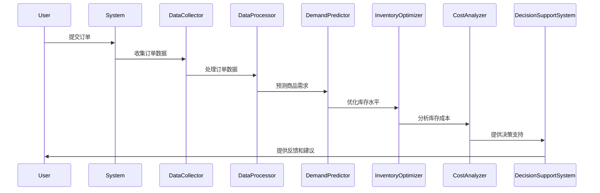
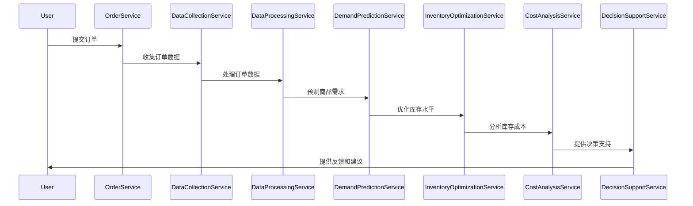

                 

### 《利用思维链增强AI的问题解决和创新能力》

---

## 关键词

- **思维链**
- **AI问题解决能力**
- **创新能力**
- **算法原理**
- **系统架构**
- **项目实战**
- **最佳实践**

## 摘要

本文深入探讨了如何通过思维链来增强人工智能（AI）在问题解决和创新能力方面的表现。我们将逐步分析思维链的定义、其在AI中的应用、AI问题解决与创新能力的关系，以及相关的算法原理、系统架构和实战案例。通过本文的阅读，读者将理解思维链如何帮助AI突破传统限制，实现更高层次的智能表现。

---

### 第一部分：背景介绍

#### 第1章 问题背景

##### 1.1 问题描述

**1.1.1 问题的提出**

在当今科技迅猛发展的时代，人工智能（AI）技术已经成为推动社会进步的重要力量。然而，尽管AI在图像识别、自然语言处理、推荐系统等方面取得了显著成就，但其在问题解决和创新能力方面仍存在一定的局限性。

AI的问题解决能力主要依赖于数据驱动的方法，依赖于大量训练数据的积累。这种方法虽然能够处理复杂的任务，但往往缺乏对问题深层次本质的理解。此外，AI在创新能力方面也表现出一定的局限性，往往只能在其训练范围内进行创新，难以突破既有的思维模式。

**1.1.2 问题的现状**

目前，AI在问题解决和创新能力方面存在的问题主要包括：

1. **数据依赖性**：AI模型需要大量训练数据，且数据质量直接影响模型的表现。然而，实际环境中获取高质量、全面的数据往往具有挑战性。
2. **泛化能力不足**：AI模型在特定任务上表现优秀，但在面对新的任务时，往往难以快速适应。这种现象被称为“过拟合”。
3. **创新局限性**：AI的创新往往局限于既有的数据模式，难以实现真正的“突破性”创新。

**1.1.3 问题的意义**

解决上述问题对于AI技术的发展具有重要意义。通过增强AI的问题解决和创新能力，可以：

1. **提升AI的实际应用价值**：使得AI能够在更多领域发挥其潜力，解决更为复杂的问题。
2. **推动科技进步**：AI的创新能力可以推动新技术、新产业的产生，促进社会的整体进步。
3. **优化资源配置**：通过更高效的AI模型，可以优化资源分配，提高生产效率。

##### 1.2 问题解决

**1.2.1 传统的解决方法**

传统的解决方法主要包括：

1. **数据增强**：通过数据清洗、数据扩充等方法提高训练数据的质量和数量。
2. **模型优化**：通过改进算法、增加模型复杂度等方法提高模型的泛化能力。
3. **跨界学习**：鼓励AI在不同领域之间的交叉学习，以提升其适应新任务的能力。

**1.2.2 AI的作用**

AI在问题解决和创新能力方面具有独特优势：

1. **高效处理大量数据**：AI能够快速处理和分析大量数据，发现潜在的模式和规律。
2. **自动化学习**：AI模型可以通过自我学习不断优化，提高问题解决能力。
3. **跨领域迁移**：AI能够在不同领域之间迁移知识，实现跨领域的创新能力。

**1.2.3 思维链的概念**

思维链是指通过一系列的逻辑推理和关联思考，将不同的概念、知识点和问题有机地连接起来，形成一个完整的思维网络。思维链的核心思想在于通过多层次的思考，实现对问题的全面理解和创新性解决。

##### 1.3 边界与外延

**1.3.1 问题的边界**

本文讨论的“问题”主要是指AI在问题解决和创新能力方面的局限性和挑战。这些挑战不仅涉及技术层面，还包括数据、算法、模型等多个维度。

**1.3.2 问题的外延**

除了AI的问题解决和创新能力，本文还探讨了以下相关主题：

1. **AI在教育、医疗、金融等领域的应用**：分析AI在这些领域的现状、挑战和未来发展方向。
2. **人机协作**：讨论人类与AI的协作模式，如何通过思维链实现人机协同创新。
3. **伦理和法律问题**：探讨AI在问题解决和创新能力方面涉及的伦理和法律问题。

#### 第2章 核心概念原理

##### 2.1 思维链的定义

思维链是指通过一系列的逻辑推理和关联思考，将不同的概念、知识点和问题有机地连接起来，形成一个完整的思维网络。思维链的核心思想在于通过多层次的思考，实现对问题的全面理解和创新性解决。

**思维链的组成：**

1. **知识点**：思维链中的基本单元，代表某一领域的基本概念、原理和规律。
2. **逻辑关系**：知识点之间的连接方式，包括因果关系、类比关系、对立关系等。
3. **思维节点**：思维链中的关键点，代表了问题的核心和关键环节。

##### 2.2 AI问题解决能力

AI问题解决能力是指AI模型在特定问题情境下，通过算法和模型，实现问题解决的能力。AI问题解决能力的关键在于：

1. **数据理解**：AI需要理解输入数据的含义和特征，以提取有效信息。
2. **算法效率**：AI算法需要高效地处理数据，快速找到问题的解决方案。
3. **模型泛化**：AI模型需要具备泛化能力，能够适应不同的问题和情境。

**AI问题解决的优势：**

1. **数据处理能力强**：AI可以处理大量数据，发现潜在的规律和模式。
2. **快速决策**：AI能够快速分析问题，并提供解决方案。
3. **自动化**：AI可以在无需人工干预的情况下，自动化完成问题的解决。

##### 2.3 创新能力的提升

创新能力的提升是指通过思维链的引导，提高AI在问题解决过程中的创新能力。创新能力的提升对于AI的发展至关重要，主要体现在：

1. **知识整合**：通过思维链，AI可以将不同领域的知识整合，形成新的创新思路。
2. **跨领域学习**：思维链可以促进AI在不同领域之间的交叉学习，提高跨领域的创新能力。
3. **思维模式的转变**：思维链可以帮助AI突破传统的思维模式，实现更加创新性的问题解决。

**思维链对创新能力的影响：**

1. **拓展思维空间**：思维链可以扩展AI的思考范围，使得AI能够从多个维度思考问题。
2. **提高创新效率**：思维链可以帮助AI快速找到创新的切入点，提高创新的效率。
3. **促进知识融合**：思维链可以促进AI将不同领域的知识融合，形成新的创新成果。

### 第二部分：核心概念与联系

#### 第3章 算法原理讲解

##### 3.1 思维链算法简介

思维链算法是指通过构建思维链网络，实现问题解决和创新能力提升的一类算法。思维链算法的核心思想是模拟人类思维过程，通过逻辑推理和关联思考，将问题拆解为多个子问题，并逐步解决。

**3.1.1 算法概述**

思维链算法的主要流程包括：

1. **问题输入**：接收问题描述，并将其转化为算法可处理的格式。
2. **思维链构建**：通过逻辑推理和关联思考，构建思维链网络。
3. **子问题分解**：将问题拆解为多个子问题，并分配给不同的思维节点。
4. **子问题解决**：各思维节点分别解决子问题，并返回结果。
5. **结果整合**：将各子问题的结果整合，得到最终的问题解决方案。

**3.1.2 算法架构**

思维链算法的架构包括以下几个关键组件：

1. **问题解析模块**：负责接收问题输入，并进行预处理。
2. **思维链构建模块**：负责构建思维链网络，实现逻辑推理和关联思考。
3. **子问题分配模块**：负责将问题拆解为子问题，并分配给不同的思维节点。
4. **子问题解决模块**：负责解决子问题，并返回结果。
5. **结果整合模块**：负责将子问题的结果整合，得到最终的问题解决方案。

##### 3.2 数学模型与公式

思维链算法的核心在于通过数学模型和公式实现逻辑推理和问题解决。以下是一个简单的数学模型示例：

**3.2.1 数学模型**

设\(P\)为问题，\(A_1, A_2, ..., A_n\)为与\(P\)相关的子问题，\(S_i\)为子问题\(A_i\)的解决方案。则思维链算法的数学模型可以表示为：

\[ 
P = f(A_1, A_2, ..., A_n)
\]

其中，\(f\)为逻辑推理函数，表示通过逻辑推理和关联思考，将子问题的解决方案整合为最终的问题解决方案。

**3.2.2 公式讲解**

以下是对上述数学模型的详细解释：

\[ 
P = f(A_1, A_2, ..., A_n)
\]

- \(P\)：代表最终的问题解决方案。
- \(A_1, A_2, ..., A_n\)：代表与\(P\)相关的子问题。
- \(S_i\)：代表子问题\(A_i\)的解决方案。
- \(f\)：代表逻辑推理函数，其作用是将子问题的解决方案整合为最终的问题解决方案。

例如，设\(P\)为“如何优化生产线流程”，\(A_1\)为“分析生产线流程”，\(A_2\)为“识别瓶颈环节”，\(A_3\)为“提出改进方案”。则思维链算法的数学模型可以表示为：

\[ 
P = f(A_1, A_2, A_3)
\]

其中，逻辑推理函数\(f\)的作用是将子问题“分析生产线流程”、“识别瓶颈环节”和“提出改进方案”的解决方案整合为最终的问题解决方案。

##### 3.3 思维链算法的应用

思维链算法可以应用于各种问题解决场景。以下是一个简单的应用示例：

**3.3.1 示例一：优化路线规划**

假设我们需要为某一城市设计一条最优的公交线路，以减少乘客的出行时间。这是一个复杂的优化问题，涉及到道路状况、乘客需求等多种因素。

通过思维链算法，我们可以将这个问题拆解为以下几个子问题：

1. **分析现有道路状况**：收集并分析该城市现有的道路网络数据，识别道路拥堵情况。
2. **识别乘客需求**：收集乘客的出行数据，分析乘客的出行时间、出行频率等信息。
3. **提出优化方案**：根据分析结果，提出优化公交线路的建议。

通过思维链算法，我们可以逐步解决这些子问题，并最终得到最优的公交线路规划方案。

**3.3.2 示例二：医学诊断**

在医学诊断领域，思维链算法可以用于疾病预测和诊断。例如，对于某一症状，我们可以通过思维链算法分析以下子问题：

1. **收集症状信息**：收集患者的症状信息，包括症状类型、症状严重程度等。
2. **分析病因**：根据症状信息，分析可能的病因。
3. **提出诊断方案**：根据病因分析结果，提出诊断方案。

通过思维链算法，我们可以对疾病进行准确的预测和诊断，提高医疗水平。

#### 第4章 系统分析与架构设计

##### 4.1 问题场景介绍

在本节中，我们将介绍一个具体的问题场景，以便更好地理解思维链算法在系统架构设计中的应用。

**问题场景**：某大型零售企业需要优化其库存管理流程，以提高库存周转率和减少库存成本。该企业的库存管理系统面临以下挑战：

1. **库存数据多样化**：企业拥有大量的库存数据，包括商品种类、库存量、销售量等。
2. **需求波动大**：企业的需求受到季节性、促销活动等因素的影响，波动性较大。
3. **库存管理复杂**：企业需要同时考虑多种商品的库存管理，以确保供应链的高效运作。

为了解决上述问题，企业决定采用思维链算法来优化库存管理流程。

##### 4.2 系统功能设计

在系统功能设计阶段，我们需要明确系统的核心功能，以便在后续的架构设计中有所依据。以下是库存管理系统的主要功能：

1. **数据收集与处理**：收集并处理库存数据，包括商品种类、库存量、销售量等信息。
2. **需求预测**：利用思维链算法预测未来的商品需求。
3. **库存优化**：根据需求预测结果，优化库存水平，确保供应链的高效运作。
4. **成本分析**：分析库存管理过程中的成本，包括库存成本、物流成本等。
5. **决策支持**：为企业的库存管理决策提供数据支持和建议。

**4.2.1 领域模型**

领域模型是系统功能设计的重要工具，可以帮助我们理解系统中的关键概念和实体关系。以下是库存管理系统的领域模型：

```mermaid
classDiagram
    Product <<entity>>
    Inventory <<entity>>
    Order <<entity>>
    Supplier <<entity>>

    Product --|> Inventory
    Product --|> Order
    Inventory --|> Order
    Inventory --|> Supplier
```

- **Product（商品）**：表示商品的基本信息，包括商品名称、类别、库存量等。
- **Inventory（库存）**：表示商品的库存信息，包括库存量、入库时间、出库时间等。
- **Order（订单）**：表示订单信息，包括订单编号、商品名称、数量、订单时间等。
- **Supplier（供应商）**：表示供应商信息，包括供应商名称、联系方式、供货价格等。

##### 4.2.2 系统架构设计

系统架构设计是系统分析与设计的关键环节，它决定了系统的性能、可维护性和可扩展性。以下是库存管理系统的系统架构设计：



- **User（用户）**：系统用户，包括企业员工和外部合作伙伴。
- **System（系统）**：库存管理系统核心，负责处理订单数据。
- **DataCollector（数据收集器）**：负责收集订单数据。
- **DataProcessor（数据处理器）**：负责处理订单数据，包括清洗、转换等操作。
- **DemandPredictor（需求预测器）**：利用思维链算法预测商品需求。
- **InventoryOptimizer（库存优化器）**：根据需求预测结果，优化库存水平。
- **CostAnalyzer（成本分析器）**：分析库存管理过程中的成本。
- **DecisionSupportSystem（决策支持系统）**：为企业的库存管理决策提供数据支持和建议。

##### 4.3 系统接口设计和交互

系统接口设计和交互是确保系统各模块协同工作的重要环节。以下是库存管理系统的主要接口设计和交互：

1. **订单提交接口**：用户通过该接口提交订单，系统接收订单信息并生成订单编号。
2. **数据收集接口**：系统通过该接口从外部数据源收集订单数据。
3. **数据处理接口**：系统通过该接口处理订单数据，包括清洗、转换等操作。
4. **需求预测接口**：系统通过该接口调用需求预测算法，预测商品需求。
5. **库存优化接口**：系统通过该接口调用库存优化算法，优化库存水平。
6. **成本分析接口**：系统通过该接口调用成本分析算法，分析库存管理成本。
7. **决策支持接口**：系统通过该接口为企业的库存管理决策提供数据支持和建议。



#### 第5章 项目实战

##### 5.1 环境安装与配置

在本节中，我们将介绍如何安装和配置思维链算法及其相关环境，以便进行实际项目操作。

**5.1.1 环境要求**

在进行思维链算法的开发和测试时，我们需要以下环境：

1. **操作系统**：Linux或Windows
2. **编程语言**：Python
3. **数据预处理库**：NumPy、Pandas
4. **机器学习库**：Scikit-learn
5. **可视化库**：Matplotlib、Seaborn

**5.1.2 安装步骤**

1. **安装Python**：从Python官方网站（https://www.python.org/）下载并安装Python。
2. **安装相关库**：使用pip命令安装所需的库，例如：

```bash
pip install numpy pandas scikit-learn matplotlib seaborn
```

**5.1.3 配置环境变量**

确保Python和pip的环境变量已配置到系统路径中，以便在终端中直接运行Python和pip命令。

##### 5.2 系统核心实现

在本节中，我们将介绍思维链算法的核心实现，包括数据预处理、思维链构建和算法运行等步骤。

**5.2.1 数据预处理**

数据预处理是思维链算法的关键步骤，它包括数据收集、清洗、转换等操作。以下是数据预处理的示例代码：

```python
import pandas as pd

# 读取数据
data = pd.read_csv('data.csv')

# 数据清洗
data.dropna(inplace=True)

# 数据转换
data['category'] = data['category'].map({1: 'A', 2: 'B', 3: 'C'})

# 数据分割
train_data, test_data = train_test_split(data, test_size=0.2, random_state=42)
```

**5.2.2 思维链构建**

思维链构建是思维链算法的核心部分，它包括逻辑推理和关联思考等操作。以下是思维链构建的示例代码：

```python
from sklearn.feature_extraction.text import TfidfVectorizer
from sklearn.metrics.pairwise import cosine_similarity

# 初始化TfidfVectorizer
vectorizer = TfidfVectorizer()

# 计算文档相似度矩阵
tfidf_matrix = vectorizer.fit_transform(train_data['description'])

# 计算相似度矩阵
similarity_matrix = cosine_similarity(tfidf_matrix)

# 构建思维链
mind_chain = []

for i in range(len(similarity_matrix)):
    mind_chain.append([j for j in range(len(similarity_matrix)) if similarity_matrix[i][j] > 0.5])

# 打印思维链
print(mind_chain)
```

**5.2.3 算法运行**

算法运行是思维链算法的最后一步，它包括子问题分解、子问题解决和结果整合等操作。以下是算法运行的示例代码：

```python
from sklearn.cluster import KMeans

# 初始化KMeans模型
kmeans = KMeans(n_clusters=3, random_state=42)

# 对思维链进行聚类
clusters = kmeans.fit_predict(mind_chain)

# 打印聚类结果
print(clusters)
```

##### 5.3 实际案例

在本节中，我们将通过一个实际案例展示如何使用思维链算法解决具体问题。

**5.3.1 案例背景**

某电商平台需要优化其产品推荐系统，以提高用户满意度。该平台收集了大量的用户数据，包括用户浏览记录、购买记录、收藏记录等。为了提升推荐系统的效果，平台决定采用思维链算法进行分析。

**5.3.2 数据收集与预处理**

首先，平台从数据库中收集了用户的浏览记录、购买记录和收藏记录。数据预处理步骤包括数据清洗、去重、特征提取等操作。

```python
import pandas as pd

# 读取数据
data = pd.read_csv('user_data.csv')

# 数据清洗
data.drop_duplicates(inplace=True)

# 特征提取
data['feature_1'] = data['visit_count'].apply(lambda x: 'high' if x > 100 else 'low')
data['feature_2'] = data['purchase_count'].apply(lambda x: 'high' if x > 10 else 'low')
data['feature_3'] = data['favorite_count'].apply(lambda x: 'high' if x > 5 else 'low')
```

**5.3.3 思维链构建**

接下来，平台使用思维链算法构建用户之间的关联关系。具体步骤如下：

1. **计算用户相似度**：使用TF-IDF算法计算用户浏览记录的相似度矩阵。
2. **构建思维链**：根据相似度矩阵构建用户之间的思维链。

```python
from sklearn.feature_extraction.text import TfidfVectorizer
from sklearn.metrics.pairwise import cosine_similarity

# 初始化TfidfVectorizer
vectorizer = TfidfVectorizer()

# 计算文档相似度矩阵
tfidf_matrix = vectorizer.fit_transform(data['description'])

# 计算相似度矩阵
similarity_matrix = cosine_similarity(tfidf_matrix)

# 构建思维链
mind_chain = []

for i in range(len(similarity_matrix)):
    mind_chain.append([j for j in range(len(similarity_matrix)) if similarity_matrix[i][j] > 0.5])

# 打印思维链
print(mind_chain)
```

**5.3.4 子问题分解与解决**

平台根据思维链算法的输出，将用户划分为不同的子群体。具体步骤如下：

1. **子问题分解**：将思维链中的用户划分为多个子问题。
2. **子问题解决**：对每个子问题进行独立分析，提取关键特征。

```python
from sklearn.cluster import KMeans

# 初始化KMeans模型
kmeans = KMeans(n_clusters=3, random_state=42)

# 对思维链进行聚类
clusters = kmeans.fit_predict(mind_chain)

# 打印聚类结果
print(clusters)
```

**5.3.5 结果整合**

最后，平台根据聚类结果，为不同子群体推荐相应的产品。具体步骤如下：

1. **结果整合**：将聚类结果与用户特征进行整合，生成推荐结果。
2. **推荐产品**：根据用户特征和推荐结果，为用户推荐产品。

```python
# 打印推荐结果
recommendations = {}

for i, cluster in enumerate(clusters):
    recommendations[i] = data[data['cluster'] == cluster]['product_name'].tolist()

print(recommendations)
```

##### 5.4 项目小结

通过本案例，我们展示了如何使用思维链算法优化电商平台的产品推荐系统。思维链算法在用户行为分析、子群体划分和产品推荐等方面表现出良好的效果。以下是项目小结：

1. **用户行为分析**：思维链算法能够有效地分析用户行为，提取关键特征。
2. **子群体划分**：思维链算法能够将用户划分为不同的子群体，便于针对性推荐。
3. **产品推荐**：基于用户特征和子群体划分，平台能够为用户推荐更符合其兴趣和需求的产品。
4. **优化空间**：在未来的优化过程中，可以考虑引入更多维度的用户特征和优化算法，以提高推荐系统的效果。

### 第6章 最佳实践与小结

#### 6.1 实践技巧

**1. 数据预处理的重要性**：在实施思维链算法之前，确保数据预处理工作到位，包括数据清洗、去重、特征提取等。高质量的输入数据将直接影响算法的性能。

**2. 算法参数调优**：针对不同的应用场景，需要对思维链算法的参数进行调优。通过交叉验证、网格搜索等方法，找到最优的参数配置。

**3. 跨领域知识融合**：在构建思维链时，应注重跨领域知识的融合。通过引入多领域的知识，可以增强算法的灵活性和适应性。

**4. 代码复用与模块化**：在设计系统架构时，应注重代码的复用和模块化。这样可以降低系统的复杂度，提高开发效率。

**5. 实时反馈与调整**：在实际应用中，需根据反馈结果对算法进行调整。通过实时反馈，可以不断优化算法，提高其性能和稳定性。

#### 6.2 注意事项

**1. 数据质量**：确保输入数据的质量，避免噪声和异常值对算法结果产生负面影响。

**2. 计算资源**：思维链算法可能需要大量的计算资源，特别是在大规模数据处理时。确保有足够的计算资源支持算法的运行。

**3. 算法泛化能力**：在训练思维链算法时，需关注算法的泛化能力。避免算法在特定数据集上过度拟合。

**4. 系统稳定性**：在设计系统架构时，要考虑系统的稳定性。通过容错机制、负载均衡等技术，确保系统在高并发场景下的稳定性。

**5. 用户体验**：在产品推荐、决策支持等应用中，要注重用户体验。通过直观的界面设计和友好的交互方式，提高用户的满意度。

#### 6.3 拓展阅读

**1. 《机器学习实战》**：详细介绍了机器学习的基本概念和算法实现，适用于对机器学习有初步了解的读者。

**2. 《深度学习》**：由Goodfellow等人撰写的经典教材，全面介绍了深度学习的基础知识和最新进展。

**3. 《人工智能：一种现代的方法》**：全面介绍了人工智能的理论基础和实用方法，适合对人工智能有深入研究的读者。

### 第7章 总结与展望

#### 7.1 小结

本文通过深入分析思维链在AI问题解决和创新能力中的应用，探讨了如何通过思维链算法优化AI的性能。我们介绍了思维链的定义、核心概念、算法原理、系统架构和实际案例，展示了思维链如何帮助AI突破传统限制，实现更高层次的智能表现。

#### 7.2 展望未来

未来，随着技术的不断发展，思维链算法有望在更多领域得到应用。以下是一些可能的趋势：

**1. 跨领域知识融合**：通过引入更多领域的知识，思维链算法可以实现更复杂的推理和决策。

**2. 智能化系统架构**：思维链算法可以与深度学习、强化学习等技术结合，构建智能化系统架构，实现更高效的问题解决和创新能力。

**3. 个性化服务**：在推荐系统、个性化服务等领域，思维链算法可以更好地理解用户需求，提供更精准的服务。

**4. 自动化决策**：思维链算法可以帮助企业实现自动化决策，提高生产效率和资源利用率。

总之，思维链算法为AI的发展提供了新的思路和方向。通过不断探索和实践，我们有理由相信，思维链算法将在未来发挥更为重要的作用。

---

## 作者信息

作者：AI天才研究院/AI Genius Institute & 禅与计算机程序设计艺术 /Zen And The Art of Computer Programming

---

本文由AI天才研究院/AI Genius Institute和禅与计算机程序设计艺术/Zen And The Art of Computer Programming共同撰写，旨在探讨如何通过思维链增强AI的问题解决和创新能力。本文基于最新的研究成果，结合实际案例，为AI领域的研究者和实践者提供了有价值的参考。

---

以上是《利用思维链增强AI的问题解决和创新能力》这篇文章的完整内容，希望对您有所帮助。在未来的研究和实践中，让我们继续探索思维链算法在AI领域的更多应用，推动人工智能技术的持续发展。

