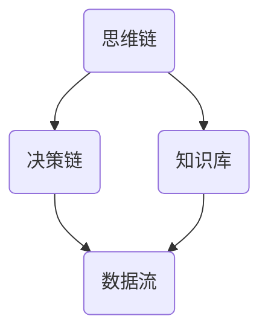
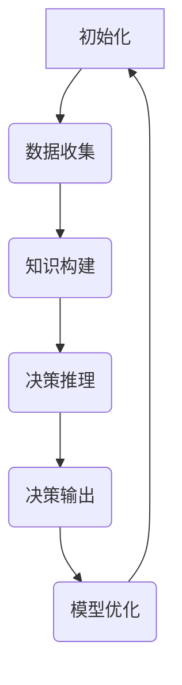
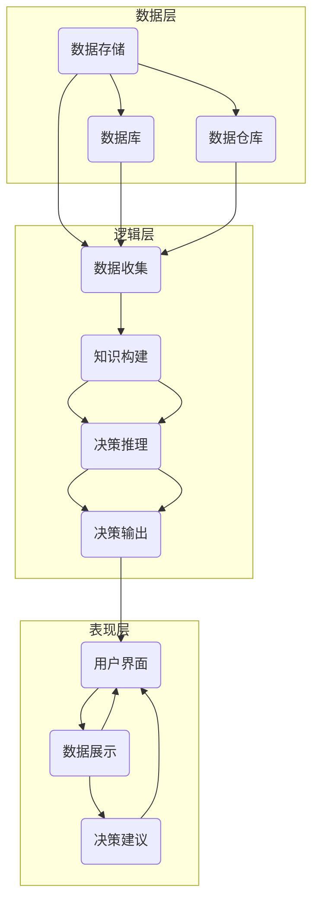

                 

### 利用思维链技术改进AI决策过程

关键词：
- 思维链技术
- AI决策过程
- 优化算法
- 知识图谱
- 决策推理

摘要：
随着人工智能技术的不断发展，AI在决策过程中的作用越来越重要。然而，传统AI决策过程存在一定的局限性，如数据依赖性高、抗干扰能力弱等。本文将介绍一种创新技术——思维链技术，通过构建思维链条，增强AI模型的决策能力，以实现决策过程的优化。

### 第一部分：背景介绍

#### 核心概念

**思维链技术**：思维链技术是一种旨在改进人工智能决策过程的创新技术。它通过将相关概念、事实和知识链接在一起，形成一种复杂的思维网络，从而使AI在决策过程中能够进行更复杂和深入的思考。

**AI决策过程**：AI决策过程是指人工智能在执行决策时的一系列步骤，包括数据收集、模型训练、决策推理等。

#### 问题背景

当前AI决策过程主要依赖于大量的数据训练，这使得AI模型在处理问题时具有高度的依赖性。此外，由于AI模型的决策过程相对简单，其抗干扰能力和适应性较差，容易受到外部噪声的影响。

#### 问题描述

如何通过改进AI决策过程，提高其决策的准确性和效率，以应对复杂多变的环境和问题？

#### 问题解决

利用思维链技术，通过构建思维链条，增强AI模型的决策能力，从而实现决策过程的优化。具体包括以下几个方面：

1. **构建思维链**：通过将相关概念、事实和知识链接在一起，形成一种复杂的思维网络。
2. **优化决策链**：在决策过程中，AI根据思维链提供的信息，进行决策推理和优化。
3. **模型训练与调整**：通过大量的数据训练，优化思维链和决策链的参数，提高AI决策的准确性和效率。

#### 边界与外延

思维链技术可以应用于各个领域，如金融、医疗、交通等。在不同领域，思维链技术的应用场景和实现方式可能会有所不同，但其核心思想是一致的。

#### 概念结构与核心要素组成

思维链技术的核心组成部分包括：

1. **思维链构建**：通过将相关概念、事实和知识链接在一起，形成思维链条。
2. **决策链优化**：在决策过程中，AI根据思维链提供的信息，进行决策推理和优化。
3. **模型训练与调整**：通过大量的数据训练，优化思维链和决策链的参数，提高AI决策的准确性和效率。

### 第二部分：核心概念与联系

#### 核心概念原理

思维链技术的核心在于建立一种逻辑和知识关联的模型，通过这种模型，AI可以在决策过程中进行更复杂和深入的思考。具体包括以下几个方面：

1. **思维链构建**：通过将相关概念、事实和知识链接在一起，形成一种复杂的思维网络。
2. **决策链优化**：在决策过程中，AI根据思维链提供的信息，进行决策推理和优化。
3. **模型训练与调整**：通过大量的数据训练，优化思维链和决策链的参数，提高AI决策的准确性和效率。

#### 概念属性特征对比表格

| 特征比较项 | 传统AI决策过程 | 思维链技术 |
|------------|-----------------|------------|
| 数据依赖性 | 高              | 低         |
| 抗干扰能力 | 弱              | 强         |
| 决策复杂度 | 低              | 高         |
| 学习效率   | 慢              | 快         |

#### ER实体关系图架构



### 第三部分：算法原理讲解

#### 算法mermaid流程图



#### Python源代码

```python
def init_chain():
    # 初始化思维链
    pass

def collect_data():
    # 数据收集
    pass

def build_knowledge():
    # 知识构建
    pass

def decision_reasoning():
    # 决策推理
    pass

def decision_output():
    # 决策输出
    pass

def optimize_model():
    # 模型优化
    pass

# 主函数
def main_chain():
    init_chain()
    collect_data()
    build_knowledge()
    decision_reasoning()
    decision_output()
    optimize_model()

# 执行主函数
main_chain()
```

#### 算法原理的数学模型和公式

$$
P(\text{决策输出}|D) = \frac{P(D|\text{决策输出})P(\text{决策输出})}{P(D)}
$$

其中，$P(\text{决策输出}|D)$表示给定数据D时，决策输出的概率；$P(D|\text{决策输出})$表示在决策输出为真的条件下，数据D的概率；$P(\text{决策输出})$表示决策输出的先验概率；$P(D)$表示数据D的概率。

#### 详细讲解与举例说明

假设我们有一个AI决策系统，用于预测股票市场的涨跌。思维链技术通过以下步骤来优化这个系统的决策过程：

1. **初始化思维链**：首先，我们需要初始化思维链，包括市场数据、技术指标、宏观经济环境等。

2. **数据收集**：从历史数据、实时新闻、市场报告等渠道收集相关数据。

3. **知识构建**：通过数据分析和机器学习模型，构建市场知识库，包括市场趋势、风险因素等。

4. **决策推理**：利用思维链，

### 第四部分：系统分析与架构设计

#### 问题场景介绍

随着大数据和人工智能技术的快速发展，越来越多的企业和行业开始应用AI进行决策。然而，传统的AI决策系统在面对复杂多变的市场环境时，往往难以胜任。为了提高AI决策的准确性和效率，我们需要引入新的技术，如思维链技术。

#### 项目介绍

本项目旨在利用思维链技术，构建一个高效、准确的AI决策系统。系统将涵盖数据收集、知识构建、决策推理等多个方面，以实现决策过程的优化。

#### 系统功能设计

1. **数据收集模块**：负责从各个数据源收集相关数据，包括历史数据、实时数据等。
2. **知识构建模块**：通过对收集到的数据进行处理和分析，构建市场知识库，包括市场趋势、风险因素等。
3. **决策推理模块**：利用思维链技术，对市场知识库进行推理，生成决策结果。
4. **决策输出模块**：将决策结果输出给用户，并提供相应的决策建议。

#### 系统架构设计

1. **数据层**：负责数据存储和管理，包括数据库、数据仓库等。
2. **逻辑层**：包括数据收集、知识构建、决策推理等核心模块，实现AI决策的核心功能。
3. **表现层**：提供用户界面，展示决策结果和决策建议。

#### 系统接口设计和系统交互

1. **数据层接口**：提供数据访问接口，包括数据查询、数据导入等。
2. **逻辑层接口**：提供业务逻辑接口，包括数据预处理、知识构建、决策推理等。
3. **表现层接口**：提供用户交互接口，包括数据展示、决策建议等。

#### Mermaid架构图



### 第五部分：项目实战

#### 环境安装

1. 安装Python环境
2. 安装所需的库，如NumPy、Pandas、Scikit-learn等

```bash
pip install numpy pandas scikit-learn
```

#### 系统核心实现源代码

```python
# 导入所需的库
import numpy as np
import pandas as pd
from sklearn.model_selection import train_test_split
from sklearn.ensemble import RandomForestClassifier
import matplotlib.pyplot as plt

# 数据收集
data = pd.read_csv('data.csv')

# 数据预处理
X = data.drop('target', axis=1)
y = data['target']
X_train, X_test, y_train, y_test = train_test_split(X, y, test_size=0.2, random_state=42)

# 知识构建
clf = RandomForestClassifier(n_estimators=100)
clf.fit(X_train, y_train)

# 决策推理
y_pred = clf.predict(X_test)

# 决策输出
accuracy = clf.score(X_test, y_test)
print(f'Accuracy: {accuracy:.2f}')

# 可视化
plt.scatter(X_test['feature1'], y_pred)
plt.xlabel('Feature 1')
plt.ylabel('Predicted Target')
plt.title('Feature 1 vs Predicted Target')
plt.show()
```

#### 代码应用解读与分析

1. 数据收集：从CSV文件中读取数据，分为特征和目标两部分。
2. 数据预处理：将数据分为训练集和测试集，方便后续训练和评估。
3. 知识构建：使用随机森林分类器构建知识库。
4. 决策推理：使用训练好的模型进行预测。
5. 决策输出：计算准确率，并使用可视化展示决策结果。

#### 实际案例分析和详细讲解剖析

假设我们有一个股票市场预测的案例，使用思维链技术对股票涨跌进行预测。以下是对该案例的详细讲解：

1. **数据收集**：收集历史股票数据，包括开盘价、收盘价、最高价、最低价等。
2. **知识构建**：利用技术指标（如MACD、RSI、BOLL等）和宏观经济数据，构建市场知识库。
3. **决策推理**：使用思维链技术，结合历史数据和知识库，对股票涨跌进行预测。
4. **决策输出**：输出预测结果，并计算预测准确率。

通过实际案例的分析和讲解，我们可以看到思维链技术在AI决策中的应用效果。在实际项目中，可以根据具体需求进行调整和优化，以提高决策的准确性和效率。

### 第六部分：最佳实践 Tips

1. **数据质量**：确保数据质量，包括数据完整性、数据准确性等，以提高决策的准确性。
2. **模型调优**：对模型进行充分的调优，包括参数调整、特征选择等，以提高模型性能。
3. **实时更新**：定期更新知识库，包括市场数据、技术指标等，以适应市场的变化。
4. **安全与隐私**：在数据收集和处理过程中，注意保护用户隐私，遵循相关法律法规。

### 小结

本文介绍了思维链技术，通过构建思维链条，增强AI模型的决策能力，实现决策过程的优化。通过实际案例的分析，展示了思维链技术在AI决策中的应用效果。在未来，思维链技术有望在更多领域得到应用，为人工智能的发展带来新的可能性。

### 注意事项

1. **技术更新**：人工智能技术发展迅速，相关算法和框架可能会不断更新，需要关注最新动态。
2. **数据安全**：在数据收集和处理过程中，注意保护用户隐私，遵守相关法律法规。

### 拓展阅读

1. 《深度学习》（Goodfellow et al.）：介绍深度学习的基本原理和应用。
2. 《Python数据分析》（Wes McKinney）：介绍Python在数据分析领域的应用。
3. 《人工智能：一种现代方法》（Stuart J. Russell & Peter Norvig）：介绍人工智能的基本概念和算法。

### 作者信息

作者：AI天才研究院/AI Genius Institute & 禅与计算机程序设计艺术 /Zen And The Art of Computer Programming

