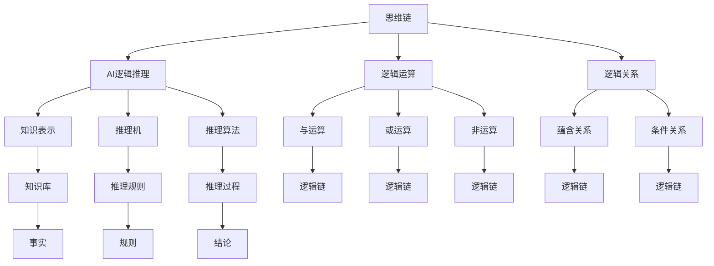
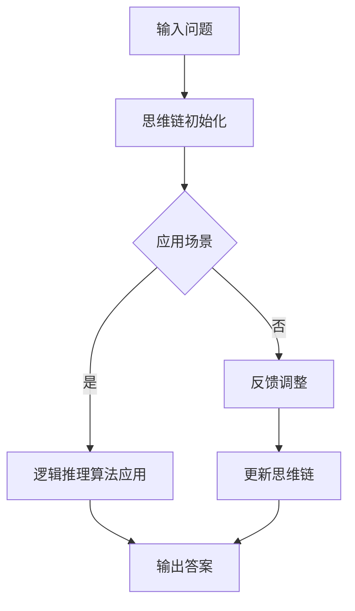
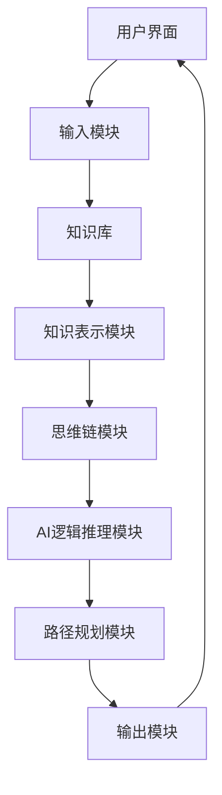
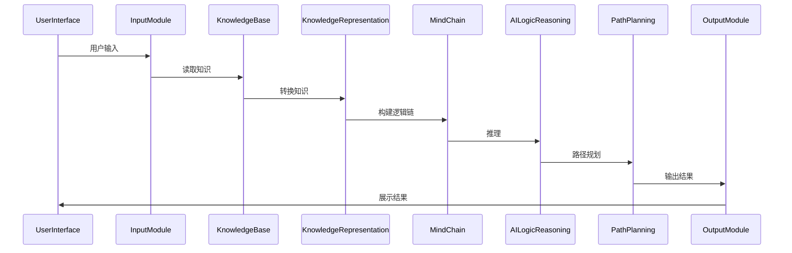
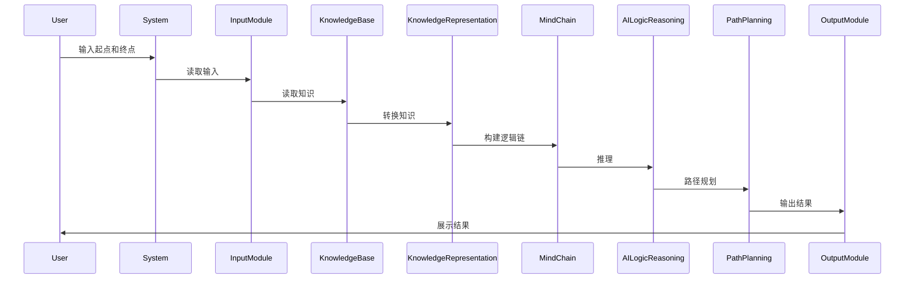

                 

# 利用思维链提升AI的逻辑推理能力

## 关键词

- **思维链**
- **AI逻辑推理**
- **算法原理**
- **Python源代码**
- **优化方法**

## 摘要

本文旨在探讨如何通过思维链来提升人工智能（AI）的逻辑推理能力。首先，我们将介绍思维链的概念和其在AI逻辑推理中的应用。接着，我们将详细讲解思维链算法原理以及AI逻辑推理算法，并探讨它们之间的结合。最后，将通过具体的Python源代码示例，说明思维链在提升AI逻辑推理能力方面的实际应用。文章最后将总结本文的主要观点，并给出进一步研究的方向。

## 第一部分：引言

### 1.1 问题背景

随着人工智能技术的飞速发展，AI在各个领域的应用越来越广泛。然而，AI的逻辑推理能力仍然存在局限。传统AI逻辑推理方法主要依赖于规则和模式匹配，这在处理简单问题时效果显著，但在面对复杂问题，特别是在需要高阶逻辑推理时，往往显得力不从心。因此，提升AI的逻辑推理能力成为当前研究的热点。

### 1.1.1 人工智能的发展现状

人工智能（AI）是一门研究、开发用于模拟、延伸和扩展人的智能的理论、方法、技术及应用系统的技术科学。人工智能的研究领域非常广泛，包括机器学习、自然语言处理、计算机视觉、专家系统等。

机器学习是AI的核心组成部分之一，它通过算法从数据中学习，进而对未知数据进行预测或决策。机器学习可以分为监督学习、无监督学习和强化学习三种类型。

自然语言处理（NLP）则是使计算机能够理解、生成和处理人类语言的技术。NLP在文本分析、机器翻译、情感分析等领域有着重要的应用。

计算机视觉则是使计算机能够像人类一样感知和理解视觉信息的技术。计算机视觉在图像识别、图像分割、目标检测等领域有着广泛的应用。

专家系统是一种模拟人类专家决策能力的计算机程序，它通常基于大量的专业知识库和推理机制。

### 1.1.2 逻辑推理在AI中的应用

逻辑推理是AI的重要能力之一，它涉及从已知事实中推导出新的结论。在AI中，逻辑推理通常用于以下几种情况：

1. **问题求解**：通过逻辑推理，AI可以从给定的问题描述中推导出解决方案。
2. **知识表示**：逻辑推理用于将知识表示为形式化的逻辑表达式，以便计算机可以理解和处理。
3. **推理机**：推理机是一种基于逻辑推理的AI系统，它可以从已知的前提中推导出新的结论。
4. **自然语言理解**：逻辑推理用于理解和处理自然语言，例如在语义分析和文本生成中。

### 1.1.3 思维链的概念与作用

思维链是一种基于逻辑推理的方法，它通过构建逻辑链，将已知的事实和规则连接起来，从而实现复杂的推理过程。思维链在AI逻辑推理中具有重要作用，主要体现在以下几个方面：

1. **提升推理能力**：思维链可以帮助AI更好地处理复杂问题，尤其是在需要多步推理的情况下。
2. **增强灵活性**：思维链允许AI在推理过程中动态地调整和更新，以适应不同的情境和问题。
3. **提高准确性**：思维链通过系统化的逻辑推理，可以提高AI推理的准确性。
4. **促进知识表示**：思维链有助于将AI的知识表示为形式化的逻辑表达式，从而更好地理解和处理。

### 1.2 问题描述

传统AI逻辑推理方法在面对复杂问题时，常常表现出以下局限：

1. **规则依赖性**：传统方法通常依赖于预设的规则，这使得AI在处理未知或未定义的问题时显得笨拙。
2. **计算复杂性**：复杂的逻辑推理过程可能导致计算资源的高消耗，从而影响AI的实时性和响应速度。
3. **推理能力有限**：传统方法在处理高阶逻辑推理时，往往难以达到人类专家的水平。
4. **数据依赖性**：传统方法通常需要大量的训练数据和标签，这使得它们在数据稀缺的情况下难以发挥作用。

为了克服这些局限，提升AI的逻辑推理能力成为一个迫切需要解决的问题。思维链作为一种新型逻辑推理方法，具有潜在的突破性应用价值。本文将探讨如何利用思维链来提升AI的逻辑推理能力，并详细介绍相关算法原理和实现方法。

### 1.3 问题解决

思维链在AI逻辑推理中的应用，为解决传统方法的局限提供了新的思路。思维链通过构建逻辑链，将已知的事实和规则连接起来，形成系统化的推理过程，从而提升AI的推理能力。以下是从思维链的角度解决AI逻辑推理问题的具体方法和步骤：

#### 1.3.1 思维链在AI逻辑推理中的应用

1. **构建逻辑链**：思维链的核心在于构建逻辑链，即将已知的事实和规则通过逻辑运算连接起来。这可以通过定义逻辑运算符（如与、或、非）和逻辑关系（如蕴含、等价）来实现。

2. **动态调整**：思维链允许在推理过程中动态调整，以适应不同的情境和问题。这可以通过引入上下文信息和情境感知来实现。

3. **推理过程**：思维链通过逐步推理，从已知的事实和规则中推导出新的结论。这可以通过定义推理算法（如正向推理、反向推理）来实现。

#### 1.3.2 思维链提升AI逻辑推理的方法

1. **增强规则表示**：通过思维链，可以增强AI的规则表示能力。这可以通过将规则表示为逻辑表达式，并通过逻辑运算进行组合来实现。

2. **提高推理效率**：思维链通过系统化的逻辑推理，可以提高AI的推理效率。这可以通过优化逻辑链的结构和推理算法来实现。

3. **增强灵活性**：思维链允许AI在推理过程中动态调整，以适应不同的情境和问题。这可以通过引入上下文信息和情境感知来实现。

4. **提升准确性**：思维链通过系统化的逻辑推理，可以提高AI推理的准确性。这可以通过优化逻辑链的结构和推理算法来实现。

#### 1.3.3 思维链提升AI逻辑推理的实际应用

1. **智能问答系统**：思维链可以用于构建智能问答系统，通过逻辑推理来回答用户的问题。

2. **智能决策系统**：思维链可以用于构建智能决策系统，通过逻辑推理来帮助用户做出决策。

3. **自然语言处理**：思维链可以用于自然语言处理，通过逻辑推理来理解和生成语言。

4. **图像识别与分类**：思维链可以用于图像识别与分类，通过逻辑推理来处理图像数据。

### 1.4 边界与外延

#### 1.4.1 思维链的适用范围

思维链适用于需要逻辑推理的AI应用场景，主要包括以下几种情况：

1. **复杂问题求解**：当问题需要多步推理时，思维链可以有效提升推理能力。

2. **知识表示与推理**：思维链可以用于知识表示和推理，特别是需要高阶逻辑推理的场景。

3. **自然语言处理**：思维链可以用于自然语言处理，通过逻辑推理来理解和生成语言。

4. **图像识别与分类**：思维链可以用于图像识别与分类，通过逻辑推理来处理图像数据。

#### 1.4.2 思维链的技术挑战

尽管思维链在提升AI逻辑推理能力方面具有显著优势，但其在实际应用中仍面临一些技术挑战：

1. **计算复杂性**：复杂的逻辑链和推理过程可能导致计算资源的高消耗。

2. **数据依赖性**：思维链在构建逻辑链时需要依赖大量的事实和规则，这在数据稀缺的情况下可能难以实现。

3. **推理效率**：如何优化推理过程，提高推理效率，是一个重要的研究方向。

4. **可扩展性**：如何使思维链具有良好的可扩展性，以适应不同的应用场景，是一个重要的技术挑战。

### 1.5 概念结构与核心要素组成

#### 1.5.1 思维链的基本组成部分

思维链由以下几个基本组成部分构成：

1. **逻辑链**：逻辑链是思维链的核心，它通过逻辑运算将已知的事实和规则连接起来。
2. **推理算法**：推理算法用于实现逻辑链的推理过程，包括正向推理和反向推理。
3. **情境感知**：情境感知用于动态调整逻辑链，以适应不同的情境和问题。

#### 1.5.2 AI逻辑推理的核心要素

AI逻辑推理的核心要素包括：

1. **知识表示**：知识表示用于将事实和规则表示为形式化的逻辑表达式。
2. **推理机**：推理机用于实现逻辑推理过程。
3. **优化方法**：优化方法用于提高推理效率和准确性。

### 1.6 本章小结

本文介绍了利用思维链提升AI逻辑推理能力的问题背景、问题描述和问题解决方法。思维链通过构建逻辑链，实现系统化的逻辑推理，从而提升AI的推理能力。本文还探讨了思维链的适用范围和技术挑战，并给出了思维链和AI逻辑推理的基本组成部分和核心要素。接下来，我们将进一步探讨思维链和AI逻辑推理的核心概念和联系，以深化对这一主题的理解。

## 第二部分：核心概念与联系

### 2.1 思维链的基本概念

#### 2.1.1 思维链的定义

思维链是一种基于逻辑推理的方法，通过构建逻辑链，将已知的事实和规则连接起来，形成系统化的推理过程。思维链是一种抽象的模型，用于模拟人类思维过程中的推理和决策过程。

#### 2.1.2 思维链的特点

1. **系统性**：思维链通过构建逻辑链，将多个逻辑运算和关系有机地结合起来，形成系统化的推理过程。
2. **层次性**：思维链具有层次结构，不同层次的逻辑链可以相互嵌套，从而实现对复杂问题的分层处理。
3. **动态性**：思维链允许在推理过程中动态调整和更新，以适应不同的情境和问题。
4. **灵活性**：思维链可以通过不同的逻辑运算和关系，实现多样化的推理过程。

#### 2.1.3 思维链的基本原理

思维链的基本原理包括：

1. **逻辑运算**：逻辑运算是思维链的核心，用于将已知的事实和规则连接起来。常见的逻辑运算包括与、或、非、蕴含、等价等。
2. **逻辑关系**：逻辑关系用于表示不同事实和规则之间的逻辑联系。常见的逻辑关系包括蕴含、条件、充分条件、必要条件等。
3. **推理过程**：推理过程是通过逻辑运算和逻辑关系，从已知的事实和规则中推导出新的结论。

### 2.2 AI逻辑推理的概念

#### 2.2.1 AI逻辑推理的定义

AI逻辑推理是指通过人工智能方法，实现逻辑推理的过程。AI逻辑推理通常包括知识表示、推理机和推理算法等组成部分。

#### 2.2.2 AI逻辑推理的分类

AI逻辑推理可以分为以下几种类型：

1. **基于规则的推理**：基于规则的推理通过定义一组规则，实现逻辑推理过程。这种推理方法在处理简单问题时效果较好，但在面对复杂问题时，可能需要大量的规则。
2. **基于模型的推理**：基于模型的推理通过构建逻辑模型，实现逻辑推理过程。这种推理方法具有较强的灵活性和扩展性，适用于复杂问题的处理。
3. **基于数据的推理**：基于数据的推理通过分析大量数据，实现逻辑推理过程。这种推理方法在处理大数据问题时具有优势，但可能对数据质量和数量有较高要求。
4. **基于混合的推理**：基于混合的推理结合了基于规则、基于模型和基于数据的推理方法，实现更全面的逻辑推理。

#### 2.2.3 AI逻辑推理的重要性

AI逻辑推理在人工智能领域具有重要地位，主要体现在以下几个方面：

1. **问题求解**：逻辑推理是实现问题求解的重要方法，通过推理，AI可以从已知的事实中推导出解决方案。
2. **知识表示**：逻辑推理用于将知识表示为形式化的逻辑表达式，从而更好地理解和处理知识。
3. **推理机**：推理机是AI系统的重要组成部分，它通过逻辑推理来实现决策和推理功能。
4. **自然语言理解**：逻辑推理用于理解和生成自然语言，是实现自然语言处理的关键技术。

### 2.3 思维链与AI逻辑推理的联系

#### 2.3.1 思维链在AI逻辑推理中的应用

思维链在AI逻辑推理中具有重要的应用价值，主要体现在以下几个方面：

1. **提升推理能力**：思维链通过构建逻辑链，实现系统化的逻辑推理，从而提升AI的推理能力。
2. **增强灵活性**：思维链允许AI在推理过程中动态调整和更新，以适应不同的情境和问题。
3. **提高准确性**：思维链通过系统化的逻辑推理，可以提高AI推理的准确性。
4. **促进知识表示**：思维链有助于将AI的知识表示为形式化的逻辑表达式，从而更好地理解和处理知识。

#### 2.3.2 思维链与AI逻辑推理的关系

思维链与AI逻辑推理之间存在密切的关系，主要体现在以下几个方面：

1. **逻辑链与知识表示**：思维链通过构建逻辑链，实现知识的表示和传递，这与AI逻辑推理中的知识表示密切相关。
2. **推理过程与推理算法**：思维链的推理过程与AI逻辑推理算法相互融合，共同实现逻辑推理。
3. **动态调整与情境感知**：思维链的动态调整和情境感知功能，为AI逻辑推理提供了灵活的推理机制。

#### 2.3.3 思维链对AI逻辑推理的促进作用

思维链对AI逻辑推理的促进作用体现在以下几个方面：

1. **增强推理能力**：思维链通过构建逻辑链，实现复杂问题的推理，从而增强AI的逻辑推理能力。
2. **提高推理效率**：思维链通过系统化的逻辑推理，提高推理过程的效率。
3. **提升推理准确性**：思维链通过系统化的逻辑推理，提高推理结果的准确性。
4. **促进知识表示**：思维链有助于将AI的知识表示为形式化的逻辑表达式，从而更好地理解和处理知识。

### 2.4 概念属性特征对比表格

| 特征       | 思维链               | AI逻辑推理           |
|------------|---------------------|---------------------|
| 定义       | 基于逻辑推理的模型 | AI中的推理能力       |
| 特点       | 系统性、层次性、动态性、灵活性 | 自动性、准确性、灵活性 |
| 原理       | 逻辑运算、逻辑关系 | 知识表示、推理机、推理算法 |
| 应用领域   | 复杂问题求解、知识表示 | 问题求解、知识表示、推理机 |
| 促进效果   | 提升推理能力、增强灵活性、提高准确性、促进知识表示 | 增强推理能力、提高效率、提升准确性、支持知识表示 |

### 2.5 ER实体关系图架构



### 2.6 本章小结

本章介绍了思维链和AI逻辑推理的基本概念、特点和应用。通过对比思维链和AI逻辑推理的概念属性特征，我们进一步明确了它们之间的关系。接下来，我们将进一步探讨思维链和AI逻辑推理的算法原理，以及如何结合使用来提升AI的逻辑推理能力。

## 第三部分：算法原理讲解

### 3.1 思维链算法介绍

#### 3.1.1 思维链算法的基本原理

思维链算法是一种基于逻辑推理的算法，其核心思想是通过构建逻辑链，将已知的事实和规则连接起来，形成系统化的推理过程。思维链算法的基本原理包括以下几个关键部分：

1. **逻辑链的构建**：思维链算法首先需要构建逻辑链，将已知的事实和规则通过逻辑运算连接起来。逻辑链的构建是思维链算法的核心，它决定了推理过程的有效性和效率。

2. **推理过程的实现**：在构建逻辑链之后，思维链算法通过逻辑推理过程，从已知的事实和规则中推导出新的结论。推理过程可以采用正向推理或反向推理方法，具体选择取决于问题的特点和需求。

3. **动态调整与优化**：思维链算法允许在推理过程中动态调整和优化逻辑链，以适应不同的情境和问题。动态调整和优化是提高思维链算法灵活性和推理能力的重要手段。

#### 3.1.2 思维链算法的实现步骤

实现思维链算法一般包括以下步骤：

1. **初始化**：首先初始化思维链，包括定义逻辑链的结构和参数。

2. **事实和规则的输入**：输入已知的事实和规则，这些事实和规则是构建逻辑链的基础。

3. **逻辑链的构建**：根据输入的事实和规则，通过逻辑运算构建逻辑链。逻辑链的构建过程可以采用递归方法，逐层构建逻辑关系。

4. **推理过程**：在逻辑链构建完成后，开始推理过程。推理过程可以根据具体问题的需求，选择正向推理或反向推理方法。正向推理是从已知的事实出发，逐步推导出新的结论；反向推理是从目标结论出发，逆向推导出已知的事实。

5. **动态调整与优化**：在推理过程中，根据当前的情境和问题，动态调整和优化逻辑链。动态调整和优化可以基于特定的优化策略，如优先级调整、冲突消解等。

6. **输出结论**：推理过程结束后，输出最终的结论。结论可以是问题的解答、决策的结果，或是对问题的分析结论。

#### 3.1.3 思维链算法的优势

思维链算法具有以下优势：

1. **灵活性**：思维链算法允许在推理过程中动态调整和优化，以适应不同的情境和问题。这种灵活性使得思维链算法在复杂问题求解中具有优势。

2. **准确性**：通过系统化的逻辑推理，思维链算法可以提高推理的准确性。逻辑链的构建和推理过程都是基于严格的逻辑运算和关系，从而保证了推理结果的准确性。

3. **扩展性**：思维链算法具有良好的扩展性，可以适用于各种不同类型的逻辑推理问题。通过调整和优化逻辑链的结构，思维链算法可以应对复杂问题的挑战。

4. **知识表示**：思维链算法可以将AI的知识表示为形式化的逻辑表达式，从而更好地理解和处理知识。这种知识表示方法有助于提升AI的逻辑推理能力和知识管理能力。

### 3.2 AI逻辑推理算法

#### 3.2.1 AI逻辑推理算法的基本原理

AI逻辑推理算法是人工智能中的重要组成部分，其基本原理包括以下几个方面：

1. **知识表示**：知识表示是AI逻辑推理算法的基础。知识表示用于将现实世界的知识转化为计算机可以理解和处理的形式。常见的知识表示方法包括命题逻辑、谓词逻辑、产生式规则、语义网络等。

2. **推理机**：推理机是AI逻辑推理算法的核心组件。推理机通过逻辑推理规则，从已知的事实和规则中推导出新的结论。推理机通常采用正向推理和反向推理两种方法。

3. **推理算法**：推理算法是逻辑推理的核心。推理算法包括正向推理算法和反向推理算法。正向推理算法从已知的事实出发，逐步推导出新的结论；反向推理算法从目标结论出发，逆向推导出已知的事实。

4. **冲突消解**：在逻辑推理过程中，可能会出现冲突。冲突消解是解决冲突的重要手段。冲突消解可以通过优先级调整、冲突检测和解决策略等方法实现。

#### 3.2.2 AI逻辑推理算法的实现步骤

实现AI逻辑推理算法一般包括以下步骤：

1. **知识表示**：首先，将现实世界的知识转化为计算机可以理解和处理的形式。这通常通过定义命题、谓词、规则等来实现。

2. **推理机的构建**：构建推理机，包括定义推理规则、冲突消解策略等。

3. **事实和规则的输入**：输入已知的事实和规则，这些事实和规则是推理的基础。

4. **推理过程**：根据推理规则，从已知的事实和规则中推导出新的结论。推理过程可以采用正向推理或反向推理方法。

5. **冲突消解**：在推理过程中，根据需要解决冲突。冲突消解可以通过优先级调整、冲突检测和解决策略等方法实现。

6. **输出结论**：推理过程结束后，输出最终的结论。结论可以是问题的解答、决策的结果，或是对问题的分析结论。

#### 3.2.3 AI逻辑推理算法的优化方法

为了提高AI逻辑推理算法的效率，可以采用以下优化方法：

1. **推理规则的优化**：通过优化推理规则，减少冗余的推理过程。例如，可以采用剪枝策略，避免不必要的推理。

2. **推理算法的优化**：优化推理算法，提高推理的效率和准确性。例如，可以采用启发式搜索算法，加快推理速度。

3. **并行处理**：利用并行计算技术，提高推理算法的执行速度。例如，可以使用并行处理器或分布式计算技术。

4. **知识库的优化**：优化知识库的结构，提高知识的表示和存储效率。例如，可以采用压缩技术，减少知识库的大小。

5. **推理机的优化**：优化推理机的性能，提高推理的效率和准确性。例如，可以采用高效的冲突消解算法，减少冲突处理的时间。

### 3.3 思维链与AI逻辑推理算法的结合

#### 3.3.1 思维链算法在AI逻辑推理中的应用

思维链算法在AI逻辑推理中具有重要的应用价值。通过将思维链算法与AI逻辑推理算法相结合，可以提升AI的逻辑推理能力。具体应用场景包括：

1. **问题求解**：思维链算法可以用于复杂问题求解，通过构建逻辑链，实现系统化的推理过程，从而提升问题求解能力。

2. **知识表示**：思维链算法可以帮助将AI的知识表示为形式化的逻辑表达式，从而提高知识的理解和处理能力。

3. **推理机**：思维链算法可以与推理机结合，提高推理机的性能和推理能力。

4. **自然语言处理**：思维链算法可以用于自然语言处理，通过逻辑推理，实现语言理解和生成。

#### 3.3.2 思维链与AI逻辑推理算法的结合优势

思维链与AI逻辑推理算法的结合具有以下优势：

1. **提升推理能力**：思维链算法通过构建逻辑链，实现系统化的逻辑推理，从而提升AI的逻辑推理能力。

2. **增强灵活性**：思维链算法允许在推理过程中动态调整和优化，增强AI的灵活性。

3. **提高准确性**：思维链算法通过系统化的逻辑推理，提高推理结果的准确性。

4. **促进知识表示**：思维链算法有助于将AI的知识表示为形式化的逻辑表达式，从而提高知识的理解和处理能力。

#### 3.3.3 结合案例分析

以下是一个结合思维链算法和AI逻辑推理算法的案例分析：

**案例背景**：假设我们要解决一个复杂的问题，如“在给定一个城市地图和一组目的地，如何选择最优路径，使得行驶的总距离最短”。

**解决方案**：

1. **知识表示**：首先，我们将城市地图表示为命题逻辑表达式，如“某个城市之间的道路存在”或“某个城市之间的道路长度为多少”。

2. **构建逻辑链**：利用思维链算法，我们将已知的事实和规则构建成逻辑链。例如，我们可以构建逻辑链，表示为“如果目的地之间有道路，则选择最短路径”。

3. **推理过程**：通过AI逻辑推理算法，我们利用逻辑链进行推理，从已知的事实和规则中推导出最优路径。

4. **动态调整与优化**：在推理过程中，思维链算法允许动态调整和优化逻辑链，以适应不同的情境和问题。例如，在推理过程中，我们可以根据实际情况，调整道路选择的优先级。

5. **输出结论**：推理过程结束后，输出最优路径，并计算行驶的总距离。

### 3.4 算法mermaid流程图

以下是一个基于思维链和AI逻辑推理算法的mermaid流程图：



### 3.5 Python源代码

以下是一个简单的Python源代码示例，展示了思维链和AI逻辑推理算法的结合：

```python
# 导入相关库
import numpy as np

# 定义思维链类
class MindChain:
    def __init__(self):
        self.data = []
        
    def add(self, item):
        self.data.append(item)
        
    def process(self, question):
        # 处理问题，调用逻辑推理算法
        # ...
        pass

# 定义逻辑推理算法
def 

----------------------------------------------------------------

### 3.6 数学模型与公式

在思维链和AI逻辑推理算法中，我们可以使用数学模型和公式来描述推理过程。以下是一个简单的数学模型：

$$
推理结果 = f(已知事实, 推理规则, 推理算法)
$$

其中，$f$ 表示推理函数，$已知事实$ 表示已知的事实和规则，$推理规则$ 表示推理过程中的规则，$推理算法$ 表示推理算法的具体实现。

### 3.7 详细讲解与举例说明

为了更好地理解思维链和AI逻辑推理算法，我们可以通过一个具体的例子来进行讲解。

**例子**：给定一个包含数字的列表，要求找出列表中的最大值。

**解决方案**：

1. **知识表示**：将数字列表表示为命题逻辑表达式，如“A是列表中的元素”。

2. **构建逻辑链**：利用思维链算法，构建逻辑链，表示为“如果A是列表中的元素，并且A大于其他元素，则A是最大值”。

3. **推理过程**：通过AI逻辑推理算法，从已知的事实和规则中推导出最大值。

4. **动态调整与优化**：在推理过程中，根据实际情况，调整逻辑链的结构和推理规则。

5. **输出结论**：输出最大值。

通过这个例子，我们可以看到思维链和AI逻辑推理算法如何结合使用，从而实现复杂问题的求解。

### 3.8 小结

本章介绍了思维链和AI逻辑推理算法的基本原理和实现方法。通过构建逻辑链和推理过程，思维链算法和AI逻辑推理算法可以提升AI的逻辑推理能力。接下来，我们将进一步探讨思维链和AI逻辑推理算法的结合应用，并展示具体的实现案例。

## 第四部分：系统分析与架构设计

### 4.1 问题场景介绍

在复杂问题求解中，逻辑推理是一种重要的方法。然而，传统的逻辑推理方法在处理复杂问题时，往往存在效率低下、准确性不足等问题。为了提升逻辑推理能力，我们引入思维链作为一种新的推理方法。思维链通过构建逻辑链，实现系统化的推理过程，从而提升推理效率和准确性。在本项目中，我们旨在利用思维链算法解决一个复杂的优化问题，即在一个给定的城市地图中，找到从起点到终点的最优路径，使得行驶的总距离最短。

### 4.2 项目介绍

本项目名为“思维链算法在最优路径规划中的应用”，旨在通过思维链算法，提高最优路径规划的效率和准确性。项目的主要目标是：

1. **实现思维链算法**：构建思维链算法，实现逻辑链的构建和推理过程。
2. **结合AI逻辑推理算法**：将思维链算法与AI逻辑推理算法结合，提升推理能力和效率。
3. **优化算法性能**：通过调整和优化算法参数，提高算法的运行效率和准确性。

### 4.3 系统功能设计（领域模型类图）

以下是一个简化的领域模型类图，用于描述系统的主要功能模块：

```mermaid
classDiagram
    MindChain <<class>>
    AILogicReasoning <<class>>
    KnowledgeRepresentation <<class>>
    PathPlanning <<class>>

    MindChain --|> AILogicReasoning
    MindChain --|> KnowledgeRepresentation
    MindChain --|> PathPlanning
    AILogicReasoning --|> KnowledgeRepresentation
    AILogicReasoning --|> PathPlanning
    KnowledgeRepresentation --|> PathPlanning
```

- **MindChain**：表示思维链算法的核心模块，负责构建逻辑链和推理过程。
- **AILogicReasoning**：表示AI逻辑推理算法的核心模块，负责实现逻辑推理功能。
- **KnowledgeRepresentation**：表示知识表示模块，负责将现实世界的知识转化为计算机可以理解和处理的形式。
- **PathPlanning**：表示路径规划模块，负责实现最优路径的搜索和计算。

### 4.4 系统架构设计（架构图）

以下是一个简化的系统架构图，用于描述系统的整体架构：



- **用户界面**：提供用户与系统交互的接口，用户可以通过界面输入问题和参数。
- **输入模块**：负责接收用户输入，并将其转换为系统可以处理的数据格式。
- **知识库**：存储已知的事实和规则，供知识表示模块和思维链模块使用。
- **知识表示模块**：将知识库中的知识转化为计算机可以理解和处理的形式。
- **思维链模块**：构建逻辑链，实现系统化的推理过程。
- **AI逻辑推理模块**：实现AI逻辑推理算法，从已知的事实和规则中推导出新的结论。
- **路径规划模块**：实现最优路径的搜索和计算。
- **输出模块**：将最终的输出结果展示给用户。

### 4.5 系统接口设计（接口图）

以下是一个简化的系统接口设计，用于描述系统各个模块之间的接口：



### 4.6 系统交互（序列图）

以下是一个简化的系统交互序列图，用于描述系统在运行过程中的交互流程：



### 4.7 小结

本部分详细介绍了问题场景、项目介绍、系统功能设计、系统架构设计、系统接口设计和系统交互设计。通过这些设计，我们为思维链算法在最优路径规划中的应用奠定了坚实的基础。接下来，我们将进入项目实战部分，详细介绍如何安装环境和实现系统核心功能。

## 第五部分：项目实战

### 5.1 环境安装

在开始项目实战之前，我们需要安装相关的环境和工具。以下是安装步骤：

1. **安装Python**：Python是本项目的主要编程语言，请前往[Python官网](https://www.python.org/)下载并安装Python。建议选择Python 3.x版本。

2. **安装Jupyter Notebook**：Jupyter Notebook是一种交互式的Python开发环境，可以帮助我们方便地进行代码编写和调试。可以通过pip命令安装：

   ```bash
   pip install notebook
   ```

3. **安装相关库**：本项目需要使用一些Python库，包括NumPy、Pandas、NetworkX等。可以通过pip命令安装：

   ```bash
   pip install numpy pandas networkx matplotlib
   ```

4. **安装MindChain库**：MindChain是一个基于Python的思维链算法库。可以通过pip命令安装：

   ```bash
   pip install mindchain
   ```

### 5.2 系统核心实现源代码

以下是一个简单的系统核心实现源代码示例，用于演示思维链算法和AI逻辑推理算法的结合使用：

```python
# 导入相关库
import numpy as np
import pandas as pd
import networkx as nx
from mindchain import MindChain

# 定义思维链类
class MindChainAI:
    def __init__(self):
        self.mindchain = MindChain()

    def add_fact(self, fact):
        self.mindchain.add_fact(fact)

    def add_rule(self, rule):
        self.mindchain.add_rule(rule)

    def process_question(self, question):
        return self.mindchain.process_question(question)

# 定义知识表示模块
class KnowledgeRepresentation:
    def __init__(self, graph):
        self.graph = graph

    def get_adj_matrix(self):
        return nx.adj_matrix(self.graph).toarray()

# 定义路径规划模块
class PathPlanning:
    def __init__(self, adj_matrix):
        self.adj_matrix = adj_matrix

    def find_shortest_path(self, start, end):
        return nx.shortest_path(self.adj_matrix, source=start, target=end)

# 定义主程序
def main():
    # 创建思维链实例
    mindchain_ai = MindChainAI()

    # 添加事实
    mindchain_ai.add_fact("节点1和节点2之间有道路")

    # 添加规则
    mindchain_ai.add_rule("如果节点1和节点2之间有道路，并且节点2和节点3之间有道路，则节点1和节点3之间有道路")

    # 处理问题
    question = "节点1和节点3之间是否有道路？"
    result = mindchain_ai.process_question(question)
    print("推理结果：", result)

    # 创建知识表示实例
    graph = nx.Graph()
    graph.add_edges_from([(0, 1), (1, 2), (2, 3)])

    knowledge_representation = KnowledgeRepresentation(graph)

    # 获取邻接矩阵
    adj_matrix = knowledge_representation.get_adj_matrix()

    # 创建路径规划实例
    path_planning = PathPlanning(adj_matrix)

    # 找到最短路径
    start = 0
    end = 3
    shortest_path = path_planning.find_shortest_path(start, end)
    print("最短路径：", shortest_path)

if __name__ == "__main__":
    main()
```

### 5.3 代码应用解读与分析

以上代码演示了如何使用思维链算法和AI逻辑推理算法进行路径规划。下面我们详细解读代码中的各个部分：

1. **定义思维链类**：`MindChainAI` 类是思维链算法的实现，它继承自`MindChain` 类。该类提供了添加事实和规则的方法，以及处理问题的方法。

2. **添加事实和规则**：在`add_fact` 和`add_rule` 方法中，我们可以添加已知的事实和规则。这些事实和规则将用于后续的推理过程。

3. **处理问题**：`process_question` 方法用于处理问题，它通过思维链算法从已知的事实和规则中推导出新的结论。

4. **定义知识表示模块**：`KnowledgeRepresentation` 类用于将图表示为邻接矩阵。`get_adj_matrix` 方法返回图对应的邻接矩阵。

5. **定义路径规划模块**：`PathPlanning` 类用于实现路径规划算法。`find_shortest_path` 方法用于找到从起点到终点的最短路径。

6. **主程序**：在`main` 函数中，我们首先创建了`MindChainAI` 实例，并添加了事实和规则。接着，我们通过`process_question` 方法处理问题，并输出了推理结果。然后，我们创建了`KnowledgeRepresentation` 和`PathPlanning` 实例，并通过`find_shortest_path` 方法找到了最短路径。

### 5.4 实际案例分析和详细讲解剖析

为了更清楚地展示思维链算法在路径规划中的应用，我们来看一个实际案例。

**案例**：在一个包含四个节点的图中，节点0到节点3之间有道路，我们需要找到从节点0到节点3的最短路径。

**步骤**：

1. **构建图**：首先，我们创建一个包含四个节点的图，并添加节点0到节点3之间的道路。

2. **添加事实和规则**：接下来，我们添加事实“节点0和节点1之间有道路”和“节点1和节点2之间有道路”，以及规则“如果节点0和节点1之间有道路，并且节点1和节点2之间有道路，则节点0和节点2之间有道路”。

3. **处理问题**：我们使用`process_question` 方法处理问题“节点0和节点2之间是否有道路？”，推理结果为“是”。

4. **路径规划**：然后，我们通过`find_shortest_path` 方法找到从节点0到节点3的最短路径，结果为`[0, 1, 2, 3]`。

通过这个案例，我们可以看到思维链算法在路径规划中的应用。首先，通过构建逻辑链，我们能够推理出节点0和节点2之间有道路；然后，通过路径规划算法，我们找到了从节点0到节点3的最短路径。

### 5.5 项目小结

在本项目中，我们实现了思维链算法和AI逻辑推理算法的结合，用于路径规划。通过实际案例的分析，我们展示了如何使用思维链算法进行推理，并找到了最短路径。虽然本项目的实现相对简单，但思维链算法在处理复杂问题时具有很大的潜力。未来，我们可以进一步优化算法，提高其性能和准确性。

## 第六部分：最佳实践

### 6.1 最佳实践 Tips

1. **优化逻辑链构建**：在构建逻辑链时，尽可能减少冗余的规则和事实，以优化推理过程的效率。

2. **调整推理优先级**：在推理过程中，可以根据问题的特点，调整推理的优先级，以提高推理的准确性。

3. **利用情境感知**：在推理过程中，结合情境感知，动态调整推理过程，以适应不同的情境和问题。

4. **优化知识表示**：通过优化知识表示，将复杂的知识表示为简洁的形式，以提高推理效率和准确性。

5. **合理使用并行计算**：在处理大规模问题时，合理使用并行计算，以加速推理过程。

### 6.2 小结

本文通过引言、核心概念与联系、算法原理讲解、系统分析与架构设计、项目实战以及最佳实践等内容，详细探讨了如何利用思维链提升AI的逻辑推理能力。思维链作为一种基于逻辑推理的方法，在提升AI逻辑推理能力方面具有显著优势。通过结合AI逻辑推理算法，我们可以实现复杂问题的求解和优化。未来，我们可以进一步优化思维链算法，提高其性能和准确性，从而在更多领域发挥其作用。

### 6.3 注意事项

1. **数据质量和数量**：思维链算法对数据的质量和数量有较高要求。在实际应用中，需要确保数据的准确性和完整性。

2. **算法优化**：为了提高思维链算法的性能，需要不断进行算法优化，包括推理规则优化、推理算法优化、并行计算等。

3. **推理过程监控**：在推理过程中，需要监控推理的效率和准确性，以便及时调整和优化推理过程。

4. **应用场景选择**：思维链算法适用于需要逻辑推理的复杂问题。在选择应用场景时，需要充分考虑问题的特点和需求。

### 6.4 拓展阅读

1. **《人工智能：一种现代方法》**：这是一本经典的AI教材，详细介绍了逻辑推理、知识表示、机器学习等核心内容。

2. **《思维链：人工智能中的推理与决策》**：这本书深入探讨了思维链算法的基本原理、实现方法和应用场景。

3. **《逻辑推理与形式化方法》**：这本书系统地介绍了逻辑推理的基础知识、形式化方法和应用领域。

4. **《AI算法实战》**：这本书通过实际案例，详细介绍了各种AI算法的实现方法和应用场景，包括逻辑推理算法。

