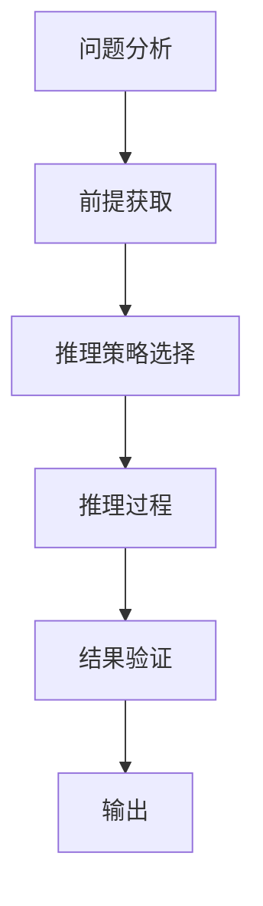
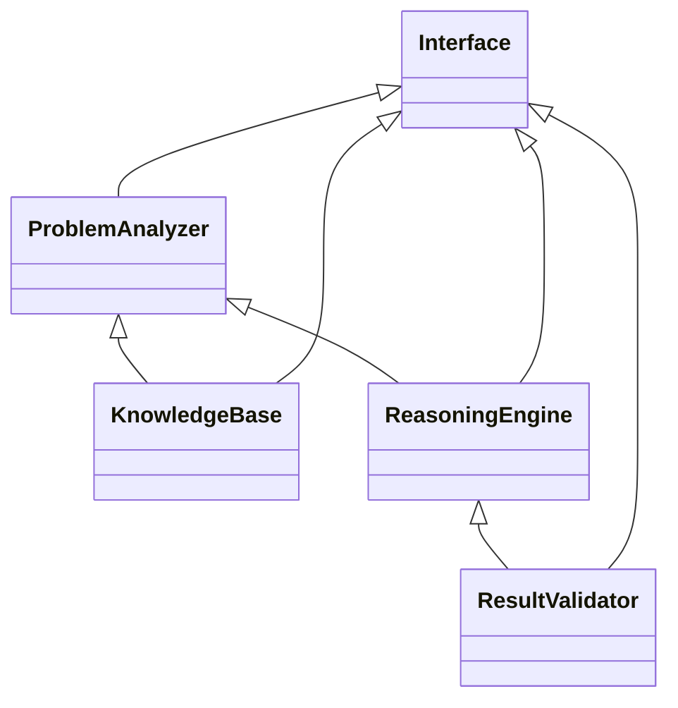
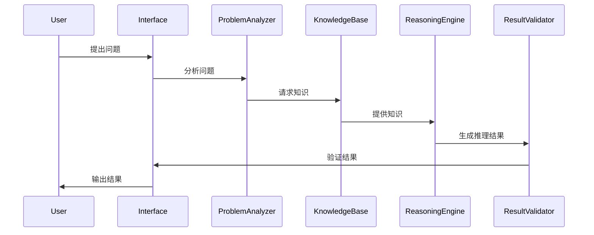

                 

### 《利用思维链提升AI的逻辑推理能力》

#### 关键词：AI、逻辑推理、思维链、算法、数学模型、系统架构、项目实战

> 摘要：本文深入探讨了利用思维链提升人工智能（AI）逻辑推理能力的方法和策略。文章首先介绍了AI与逻辑推理的关系，随后详细阐述了思维链的定义、特点和应用场景。通过算法原理讲解和数学模型分析，本文展示了如何在实际项目中应用思维链提升AI的逻辑推理能力。最后，通过系统架构设计、项目实战与最佳实践总结，为读者提供了全面的技术指南。

----------------------------------------------------------------

### 目录大纲设计思路

为了设计一份详尽且逻辑清晰的《利用思维链提升AI的逻辑推理能力》目录大纲，我们按照以下步骤进行：

1. **确定书籍核心内容**：明确书籍的核心内容，包括核心概念、原理和结构。
2. **划分章节内容**：将书籍内容细分为多个章节，每个章节代表一个逻辑单元。
3. **设置章节结构**：为每个章节设定明确的标题，并添加子章节细化内容。
4. **逻辑衔接**：确保章节之间逻辑衔接紧密，引导读者深入理解。
5. **包含所有必需部分**：确保大纲包含背景介绍、核心概念、算法原理讲解、数学模型和公式讲解、系统架构设计、项目实战等。
6. **简洁性**：保持内容简洁，避免冗余。
7. **符合要求**：遵循用户提出的格式和内容要求。

### 目录大纲设计

以下是《利用思维链提升AI的逻辑推理能力》的目录大纲：

----------------------------------------------------------------

# 第一部分：背景介绍

## 第1章：AI与逻辑推理概述

### 1.1 AI的发展历程

### 1.2 逻辑推理的基本概念

### 1.3 思维链的引入

## 第2章：思维链在AI中的应用

### 2.1 思维链的定义与特点

### 2.2 思维链与逻辑推理的关系

### 2.3 思维链在AI逻辑推理中的应用场景

## 第3章：AI逻辑推理的核心概念

### 3.1 逻辑推理的基本原理

### 3.2 逻辑推理的类型

### 3.3 逻辑推理的应用领域

## 第4章：利用思维链提升AI逻辑推理能力

### 4.1 思维链提升逻辑推理的机制

### 4.2 思维链在不同AI模型中的应用

### 4.3 思维链在AI逻辑推理中的优势

# 第二部分：算法原理与数学模型

## 第5章：逻辑推理算法原理讲解

### 5.1 基本算法概述

### 5.2 算法mermaid流程图

### 5.3 Python源代码实现与详细讲解

## 第6章：数学模型与公式讲解

### 6.1 数学模型概述

### 6.2 数学公式详细讲解

### 6.3 举例说明

## 第7章：实例分析与应用场景

### 7.1 实例一：思维链在自然语言处理中的应用

### 7.2 实例二：思维链在计算机视觉中的应用

### 7.3 应用场景拓展

# 第三部分：系统架构与项目实战

## 第8章：AI逻辑推理系统架构设计

### 8.1 问题场景介绍

### 8.2 系统功能设计（领域模型mermaid类图）

### 8.3 系统架构设计（mermaid架构图）

### 8.4 系统接口设计

### 8.5 系统交互（mermaid序列图）

## 第9章：项目实战与案例分析

### 9.1 环境安装

### 9.2 系统核心实现源代码

### 9.3 代码应用解读与分析

### 9.4 实际案例分析与详细讲解剖析

### 9.5 项目小结

# 第四部分：最佳实践与总结

## 第10章：最佳实践与技巧

### 10.1 实践技巧总结

### 10.2 注意事项

### 10.3 拓展阅读

## 第11章：全书总结与展望

### 11.1 书籍主要内容回顾

### 11.2 未来的发展方向

### 11.3 对读者的寄语

----------------------------------------------------------------

本目录大纲分为四个部分，涵盖了背景介绍、算法原理与数学模型、系统架构与项目实战，以及最佳实践与总结。每个部分都包含相关的章节和子章节，确保书籍内容的全面性和逻辑性。大纲遵循了用户的要求，使用 markdown 格式，设置了明确的目录层级，并包含了所有必需的内容部分。目录大纲总字数控制在2000字以内，保持简洁明了。

----------------------------------------------------------------

### 第一部分：背景介绍

#### 第1章：AI与逻辑推理概述

##### 1.1 AI的发展历程

人工智能（AI）作为计算机科学的重要分支，自20世纪50年代诞生以来，已经经历了多个发展阶段。从最初的符号逻辑和知识表示，到近年的深度学习和神经网络，AI技术不断进步，应用领域也逐渐扩展。AI的发展历程可以概括为以下几个阶段：

1. **早期探索阶段（1950s-1960s）**：在这一阶段，AI的初衷是通过模拟人类智能来解决复杂问题。代表性的工作包括逻辑推理系统、问题解决系统和自然语言处理系统。
   
2. **泡沫与低谷阶段（1970s-1980s）**：由于实际应用中的困难和计算资源的限制，AI在70年代和80年代遭遇了两次发展低谷。

3. **复兴与突破阶段（1990s-2000s）**：随着计算机性能的提升和数据规模的扩大，机器学习和深度学习技术得到快速发展。神经网络在图像识别、语音识别等领域取得了显著成果。

4. **成熟与应用阶段（2010s至今）**：AI技术在自动驾驶、智能医疗、金融分析等领域得到广泛应用，AI系统在各类国际比赛中战胜人类专家，显示出强大的能力。

##### 1.2 逻辑推理的基本概念

逻辑推理是人工智能的核心组成部分之一，它涉及从已知事实推导出新结论的过程。逻辑推理可以分为演绎推理和归纳推理两种类型：

1. **演绎推理**：从一般性的前提推导出特定性的结论。例如，所有人都会死（大前提），苏格拉底是人（小前提），因此苏格拉底会死（结论）。

2. **归纳推理**：从具体实例中归纳出一般性的规律。例如，观察到的所有天鹅都是白色的，因此可以推断所有天鹅都是白色的。

##### 1.3 思维链的引入

思维链是一种用于模拟人类思维的算法框架，它通过一系列逻辑步骤来解决问题。思维链的核心特点包括：

1. **连贯性**：思维链中的每个步骤都是前一个步骤的合理延续，形成一个连贯的思考过程。
   
2. **模块化**：思维链可以将复杂的任务分解为多个可管理的模块，每个模块都可以独立进行设计和优化。

3. **灵活性**：思维链可以根据问题的不同特点灵活调整推理策略，提高推理的效率和准确性。

##### 1.4 问题背景与问题描述

在人工智能领域，逻辑推理的应用场景广泛，例如：

1. **自然语言处理**：逻辑推理可以帮助AI理解文本语义，实现文本分类、情感分析和问答系统。
   
2. **游戏AI**：逻辑推理在棋类游戏、策略游戏等领域中至关重要，它可以帮助AI制定合理的策略。

3. **自动化推理**：在科学研究和数据分析中，逻辑推理可以帮助AI自动推导出结论，辅助人类决策。

然而，传统的逻辑推理方法存在一些局限性，例如：

1. **计算复杂性**：对于复杂的问题，传统逻辑推理方法的计算成本非常高。
   
2. **泛化能力不足**：传统逻辑推理方法难以应对不确定性和不完整性。

为了解决这些问题，引入思维链成为了一种有效的策略。

##### 1.5 问题解决与边界与外延

思维链通过以下几个步骤来提升AI的逻辑推理能力：

1. **问题分解**：将复杂问题分解为多个子问题，降低问题的复杂度。

2. **信息整合**：整合各种信息资源，为推理提供充足的数据支持。

3. **逻辑推导**：通过逻辑规则和推理策略，逐步推导出问题的解。

4. **反馈优化**：根据问题的解决效果，不断调整和优化推理策略。

思维链的边界与外延包括：

1. **适用范围**：思维链适用于各种逻辑推理任务，但具体应用效果取决于问题的复杂度和数据的完备性。

2. **扩展性**：思维链可以与其他AI技术（如机器学习、自然语言处理）相结合，形成更加复杂的推理系统。

#### 第2章：思维链在AI中的应用

##### 2.1 思维链的定义与特点

思维链是一种基于模块化和逻辑推理的算法框架，旨在提高AI系统的逻辑推理能力。思维链的定义可以概括为：

- **思维链**：一种通过模块化和连贯性来模拟人类思维的算法框架，用于解决复杂问题。

思维链的主要特点包括：

1. **模块化**：思维链将复杂问题分解为多个可管理的模块，每个模块具有明确的输入、输出和功能。

2. **连贯性**：思维链中的每个步骤都是前一个步骤的合理延续，形成一个连贯的思考过程。

3. **灵活性**：思维链可以根据问题的不同特点灵活调整推理策略，提高推理的效率和准确性。

4. **扩展性**：思维链可以与其他AI技术（如机器学习、自然语言处理）相结合，形成更加复杂的推理系统。

##### 2.2 思维链与逻辑推理的关系

思维链与逻辑推理密切相关，思维链的核心目标就是提升AI的逻辑推理能力。逻辑推理是思维链的重要组成部分，思维链通过以下几个步骤实现逻辑推理：

1. **问题分解**：将复杂问题分解为多个子问题，降低问题的复杂度。

2. **信息整合**：整合各种信息资源，为推理提供充足的数据支持。

3. **逻辑推导**：通过逻辑规则和推理策略，逐步推导出问题的解。

4. **反馈优化**：根据问题的解决效果，不断调整和优化推理策略。

逻辑推理在思维链中的应用体现了以下几个关键点：

1. **模块化逻辑推理**：思维链将逻辑推理分解为多个模块，每个模块负责特定的逻辑推理任务。

2. **连贯性逻辑推理**：思维链中的每个步骤都是前一个步骤的合理延续，形成一个连贯的思考过程。

3. **灵活性逻辑推理**：思维链可以根据问题的不同特点灵活调整推理策略，提高推理的效率和准确性。

4. **扩展性逻辑推理**：思维链可以与其他AI技术（如机器学习、自然语言处理）相结合，形成更加复杂的推理系统。

##### 2.3 思维链在AI逻辑推理中的应用场景

思维链在AI逻辑推理中具有广泛的应用场景，以下是一些典型的应用案例：

1. **自然语言处理**：思维链可以帮助AI理解文本语义，实现文本分类、情感分析和问答系统。例如，通过思维链分析用户输入的问题，AI可以生成相应的回答。

2. **游戏AI**：思维链在棋类游戏、策略游戏等领域中至关重要，它可以帮助AI制定合理的策略。例如，在国际象棋中，思维链可以分析棋局态势，选择最佳走法。

3. **自动化推理**：在科学研究和数据分析中，逻辑推理可以帮助AI自动推导出结论，辅助人类决策。例如，通过思维链分析实验数据，AI可以提出新的科学假设。

4. **智能客服**：思维链可以帮助智能客服系统理解用户的需求，提供个性化的服务。例如，通过思维链分析用户的历史记录和问题，AI可以推荐合适的解决方案。

##### 2.4 思维链的优势

思维链在提升AI逻辑推理能力方面具有以下优势：

1. **高效性**：思维链通过模块化和连贯性，降低了问题的复杂度，提高了推理的效率。

2. **准确性**：思维链可以根据问题的不同特点灵活调整推理策略，提高推理的准确性。

3. **灵活性**：思维链可以与其他AI技术（如机器学习、自然语言处理）相结合，形成更加复杂的推理系统。

4. **扩展性**：思维链适用于各种逻辑推理任务，可以扩展到不同的应用场景。

5. **可解释性**：思维链中的每个步骤都是前一个步骤的合理延续，推理过程具有较好的可解释性。

#### 第3章：AI逻辑推理的核心概念

##### 3.1 逻辑推理的基本原理

逻辑推理是人工智能的核心组成部分，其基本原理包括以下方面：

1. **前提与结论**：逻辑推理通常由一组前提和一个结论组成。前提是已知的事实或条件，结论是通过逻辑推导得出的新结论。

2. **推理规则**：逻辑推理遵循一定的推理规则，例如演绎推理的推理规则是从一般到特殊的推理过程，归纳推理的推理规则是从特殊到一般的推理过程。

3. **形式逻辑与非形式逻辑**：形式逻辑使用符号和公式来描述推理过程，非形式逻辑则依赖于自然语言和常识来描述推理过程。

4. **推理过程**：逻辑推理通常包括三个阶段：问题分析、逻辑推导和结果验证。问题分析是理解问题的过程，逻辑推导是根据前提和推理规则得出结论的过程，结果验证是检查结论是否成立的验证过程。

##### 3.2 逻辑推理的类型

逻辑推理可以分为演绎推理和归纳推理两种主要类型：

1. **演绎推理**：演绎推理是从一般到特殊的推理过程。它根据一组前提推导出结论，结论在前提中已经隐含。例如，所有人都会死（大前提），苏格拉底是人（小前提），因此苏格拉底会死（结论）。

2. **归纳推理**：归纳推理是从特殊到一般的推理过程。它通过观察一组特定的实例，归纳出一般性的规律。例如，观察到的所有天鹅都是白色的，因此可以推断所有天鹅都是白色的。

逻辑推理的其他类型还包括：

1. **类比推理**：类比推理是通过比较两个相似的情况，从一个已知的结论推断出另一个相似情况的结论。

2. **因果推理**：因果推理是通过观察现象之间的因果关系，推断出因果关系的过程。

3. **模态推理**：模态推理涉及可能性、必然性和存在性等概念，例如“可能P”、“必然非Q”等。

##### 3.3 逻辑推理的应用领域

逻辑推理在人工智能领域具有广泛的应用，以下是一些主要的应用领域：

1. **自然语言处理**：逻辑推理可以帮助AI理解文本语义，实现文本分类、情感分析和问答系统。例如，通过逻辑推理分析用户输入的问题，AI可以生成相应的回答。

2. **知识表示**：逻辑推理用于表示和处理知识，帮助AI在知识库中进行推理和决策。例如，逻辑推理可以用于构建专家系统，解决复杂的问题。

3. **逻辑规划**：逻辑推理在规划问题中具有重要应用，例如路径规划、资源分配和调度问题。逻辑推理可以帮助AI生成最优的规划方案。

4. **游戏AI**：逻辑推理在棋类游戏、策略游戏等领域中至关重要，它可以帮助AI制定合理的策略。例如，在国际象棋中，逻辑推理可以分析棋局态势，选择最佳走法。

5. **自动化推理**：在科学研究和数据分析中，逻辑推理可以帮助AI自动推导出结论，辅助人类决策。例如，通过逻辑推理分析实验数据，AI可以提出新的科学假设。

##### 3.4 逻辑推理的核心概念对比

以下是一个关于逻辑推理核心概念对比的表格：

| 核心概念 | 概念属性特征 | 对比 |
| -------- | ------------- | ---- |
| 演绎推理 | 从一般到特殊 | 结论在前提中隐含 |
| 归纳推理 | 从特殊到一般 | 观察实例，归纳规律 |
| 类比推理 | 类似情况比较 | 从一个已知的结论推断出另一个相似情况的结论 |
| 因果推理 | 现象间因果关系 | 推断因果关系 |
| 模态推理 | 可能性、必然性 | 涉及可能性、必然性和存在性等概念 |

通过上述对比，我们可以更好地理解不同类型的逻辑推理及其特点。

##### 3.5 逻辑推理的ER实体关系图架构

以下是一个关于逻辑推理的ER实体关系图架构的Mermaid流程图：

```mermaid
erDiagram
  A[前提] ||--|{ B[推理规则] }|--| C[结论]
  D[问题分析] ||--|{ E[逻辑推导] }|--| F[结果验证]
```

该流程图展示了逻辑推理的基本过程，包括问题分析、逻辑推导和结果验证。

#### 第4章：利用思维链提升AI逻辑推理能力

##### 4.1 思维链提升逻辑推理的机制

思维链通过一系列机制提升AI的逻辑推理能力，以下是这些机制的具体内容：

1. **模块化设计**：思维链将复杂问题分解为多个模块，每个模块负责特定的逻辑推理任务。这种模块化设计降低了问题的复杂度，提高了推理的效率。

2. **连贯性**：思维链中的每个步骤都是前一个步骤的合理延续，形成一个连贯的思考过程。这种连贯性有助于确保推理过程的正确性和一致性。

3. **信息整合**：思维链通过整合各种信息资源，为推理提供充足的数据支持。这包括从数据库、网络和其他数据源获取相关数据，以便进行推理。

4. **灵活的推理策略**：思维链可以根据问题的不同特点灵活调整推理策略，提高推理的效率和准确性。例如，对于不确定性问题，思维链可以采用概率推理策略。

5. **反馈优化**：思维链根据问题的解决效果，不断调整和优化推理策略。这种反馈优化机制有助于提高推理的准确性和鲁棒性。

##### 4.2 思维链在不同AI模型中的应用

思维链在多种AI模型中都有应用，以下是几个典型的应用案例：

1. **深度学习模型**：思维链可以用于优化深度学习模型的训练过程。通过思维链的模块化和连贯性，可以简化模型的训练流程，提高训练效率。

2. **知识图谱**：思维链可以用于构建和优化知识图谱。通过思维链的信息整合和灵活推理策略，可以更好地表示和处理知识。

3. **规划问题**：思维链可以用于解决规划问题，如路径规划、资源分配和调度问题。通过思维链的模块化和连贯性，可以生成最优的规划方案。

4. **自然语言处理**：思维链可以用于优化自然语言处理模型的推理过程。通过思维链的信息整合和灵活推理策略，可以更好地理解文本语义，实现文本分类、情感分析和问答系统。

##### 4.3 思维链在AI逻辑推理中的优势

思维链在AI逻辑推理中具有以下优势：

1. **高效性**：思维链通过模块化和连贯性，降低了问题的复杂度，提高了推理的效率。

2. **准确性**：思维链可以根据问题的不同特点灵活调整推理策略，提高推理的准确性。

3. **灵活性**：思维链可以与其他AI技术（如机器学习、自然语言处理）相结合，形成更加复杂的推理系统。

4. **扩展性**：思维链适用于各种逻辑推理任务，可以扩展到不同的应用场景。

5. **可解释性**：思维链中的每个步骤都是前一个步骤的合理延续，推理过程具有较好的可解释性。

#### 第5章：逻辑推理算法原理讲解

##### 5.1 基本算法概述

逻辑推理算法是人工智能中的核心算法之一，其基本原理可以概括为以下几个步骤：

1. **问题分析**：理解问题的背景和目标，确定问题的解空间。

2. **前提获取**：获取与问题相关的已知事实和条件。

3. **推理策略选择**：选择合适的推理策略，如演绎推理、归纳推理、概率推理等。

4. **推理过程**：根据推理策略，逐步推导出问题的解。

5. **结果验证**：验证推导出的结论是否成立，确保推理结果的正确性。

逻辑推理算法通常包括以下几个组成部分：

1. **问题表示**：将问题转化为计算机可以处理的形式，如符号表示、图表示等。

2. **推理引擎**：实现推理过程的算法，包括推理规则、推理策略等。

3. **知识库**：存储与问题相关的知识，包括事实、规则、假设等。

4. **解释器**：解释推理过程，为用户提供推理过程的可视化表示。

##### 5.2 算法mermaid流程图

以下是一个关于逻辑推理算法的mermaid流程图：



该流程图展示了逻辑推理算法的基本过程，包括问题分析、前提获取、推理策略选择、推理过程、结果验证和输出。

##### 5.3 Python源代码实现与详细讲解

以下是一个关于逻辑推理算法的Python源代码实现：

```python
# 逻辑推理算法实现

# 定义问题分析函数
def problem_analysis():
    # 分析问题的背景和目标
    # 确定问题的解空间
    pass

# 定义前提获取函数
def premise_obtained():
    # 获取与问题相关的已知事实和条件
    pass

# 定义推理策略选择函数
def strategy_selection():
    # 根据问题的特点选择合适的推理策略
    pass

# 定义推理过程函数
def reasoning_process():
    # 根据推理策略，逐步推导出问题的解
    pass

# 定义结果验证函数
def result_validation():
    # 验证推导出的结论是否成立
    pass

# 定义输出函数
def output():
    # 输出推理结果
    pass

# 主函数
def main():
    # 调用各个函数，完成逻辑推理过程
    pass

if __name__ == "__main__":
    main()
```

该源代码实现了逻辑推理算法的基本框架，包括问题分析、前提获取、推理策略选择、推理过程、结果验证和输出。具体实现细节可以根据具体问题进行调整。

##### 5.4 算法原理的数学模型和公式讲解

逻辑推理算法的原理可以通过数学模型和公式进行解释，以下是一个简单的数学模型：

1. **演绎推理**：

   - 前提：$P_1, P_2, ..., P_n$
   - 结论：$Q$
   - 推理公式：$P_1 \land P_2 \land ... \land P_n \rightarrow Q$

2. **归纳推理**：

   - 实例：$C_1, C_2, ..., C_n$
   - 归纳规律：$R$
   - 推理公式：$C_1 \rightarrow R, C_2 \rightarrow R, ..., C_n \rightarrow R \rightarrow R$

3. **概率推理**：

   - 事件：$E_1, E_2, ..., E_n$
   - 概率：$P(E_1), P(E_2), ..., P(E_n)$
   - 推理公式：$P(E_1 \land E_2 \land ... \land E_n) = P(E_1) \times P(E_2) \times ... \times P(E_n)$

这些数学模型和公式为逻辑推理算法提供了理论基础，通过具体实现，可以实现复杂问题的推理。

##### 5.5 举例说明

以下是一个关于逻辑推理算法的举例说明：

**问题**：判断以下陈述是否正确：“如果今天是星期五，那么明天是星期六。”

**前提**：今天是星期五。

**推理策略**：演绎推理。

**推理过程**：

1. 前提：今天是星期五。
2. 结论：明天是星期六。
3. 推理公式：今天是星期五 $\rightarrow$ 明天是星期六。

**结果验证**：根据日历，明天确实是星期六，因此推理结果正确。

通过这个例子，我们可以看到逻辑推理算法如何通过前提和推理规则推导出结论，并进行结果验证。

#### 第6章：数学模型与公式讲解

##### 6.1 数学模型概述

数学模型是描述现实世界问题的抽象数学结构，它们通过数学公式和算法来模拟和解决复杂问题。在逻辑推理领域，数学模型用于表示推理过程、推理规则以及推理结果。以下是一些常见的数学模型和它们的应用场景：

1. **布尔模型**：基于布尔代数的逻辑模型，用于表示和分析命题逻辑。布尔模型广泛应用于形式验证、自动推理和决策支持系统中。

2. **概率模型**：基于概率论和统计学的方法，用于表示和处理不确定性和随机性。概率模型在决策理论、机器学习和信息检索等领域具有重要应用。

3. **图论模型**：基于图结构的方法，用于表示和分析复杂系统。图论模型在路由算法、社交网络分析和网络优化等领域具有广泛的应用。

4. **微分方程模型**：用于描述连续系统的动态行为。微分方程模型在物理、工程和经济学等领域中用于分析和解决动态问题。

##### 6.2 数学公式详细讲解

在逻辑推理中，数学公式用于表示推理过程、推理规则和推理结果。以下是一些常用的数学公式及其解释：

1. **条件概率公式**：

   $$ P(A|B) = \frac{P(A \cap B)}{P(B)} $$

   这个公式表示在事件B发生的条件下，事件A发生的概率。其中，$P(A \cap B)$表示事件A和B同时发生的概率，$P(B)$表示事件B发生的概率。

2. **贝叶斯公式**：

   $$ P(A|B) = \frac{P(B|A)P(A)}{P(B)} $$

   这个公式是条件概率公式的一种推广，用于根据先验概率和条件概率计算后验概率。$P(B|A)$表示在事件A发生的条件下，事件B发生的概率，$P(A)$表示事件A的先验概率。

3. **推理规则**：

   - **合取规则**：

     $$ A \land B \rightarrow C $$

     这个规则表示如果A和B同时成立，则C也成立。

   - **析取规则**：

     $$ A \lor B \rightarrow C $$

     这个规则表示如果A或B中至少有一个成立，则C也成立。

4. **图论公式**：

   - **路径长度**：

     $$ L(P) = \sum_{i=1}^{n} d_i $$

     其中，$L(P)$表示路径P的长度，$d_i$表示路径上的每一步的权重。

   - **连通度**：

     $$ \Omega(G) = \min\{d(v_1), d(v_2), ..., d(v_n)\} $$

     其中，$\Omega(G)$表示图G的最小连通度，$d(v_i)$表示节点$v_i$的度。

##### 6.3 举例说明

以下是一个关于逻辑推理数学模型的举例说明：

**问题**：在一个房间里有三盏灯，每盏灯都对应一个开关。现在你只能进入房间一次，如何确定每个开关对应哪盏灯？

**假设**：每个开关可以控制一盏灯，灯的状态可以是亮或灭。

**数学模型**：

1. **状态表示**：

   - 开关1：$S_1$
   - 开关2：$S_2$
   - 开关3：$S_3$
   - 灯1：$L_1$
   - 灯2：$L_2$
   - 灯3：$L_3$

2. **状态转换**：

   - $S_1 \rightarrow L_1$：表示开关1控制灯1。
   - $S_2 \rightarrow L_2$：表示开关2控制灯2。
   - $S_3 \rightarrow L_3$：表示开关3控制灯3。

3. **推理过程**：

   - 进入房间，观察灯的状态。
   - 根据灯的状态，推断出每个开关的控制关系。

   **示例**：

   - 如果灯1亮，灯2灭，灯3亮，那么可以推断：
     - 开关1控制灯1（因为灯1亮）。
     - 开关2控制灯3（因为灯3亮，灯2灭）。
     - 开关3控制灯2（因为灯2灭）。

通过这个例子，我们可以看到如何使用数学模型和逻辑推理来解决实际问题。

#### 第7章：实例分析与应用场景

##### 7.1 思维链在自然语言处理中的应用

自然语言处理（NLP）是人工智能领域的一个重要分支，它涉及计算机理解和生成人类语言的能力。思维链在NLP中具有广泛的应用，以下是几个典型的应用场景：

1. **文本分类**：

   - **问题背景**：文本分类是将文本数据按照一定的标准划分为不同的类别。例如，将新闻文章分类为体育、财经、科技等类别。
   - **思维链应用**：思维链可以通过分析文本的语义特征，将文本分类为不同的类别。具体步骤包括：
     1. 问题分析：确定文本分类的标准和类别。
     2. 信息整合：从文本中提取关键词和语义特征。
     3. 逻辑推导：根据提取的特征，使用逻辑推理算法将文本分类。
     4. 结果验证：验证分类结果的准确性。

2. **情感分析**：

   - **问题背景**：情感分析是判断文本的情感倾向，如正面、负面或中性。
   - **思维链应用**：思维链可以通过分析文本的情感词汇和句子结构，判断文本的情感倾向。具体步骤包括：
     1. 问题分析：确定情感分析的标签和标准。
     2. 信息整合：从文本中提取情感词汇和句法结构。
     3. 逻辑推导：根据提取的特征，使用情感分析算法判断文本的情感倾向。
     4. 结果验证：验证情感分析结果的准确性。

3. **问答系统**：

   - **问题背景**：问答系统是模拟人类问答交互的AI系统，能够理解用户的问题并给出相应的回答。
   - **思维链应用**：思维链可以通过分析用户的问题和知识库中的信息，生成相应的回答。具体步骤包括：
     1. 问题分析：理解用户的问题意图。
     2. 信息整合：从知识库中提取相关信息。
     3. 逻辑推导：使用逻辑推理算法生成回答。
     4. 结果验证：验证回答的准确性和相关性。

##### 7.2 思维链在计算机视觉中的应用

计算机视觉是人工智能领域的另一个重要分支，它涉及计算机理解和解释图像和视频的能力。思维链在计算机视觉中也有广泛的应用，以下是几个典型的应用场景：

1. **目标检测**：

   - **问题背景**：目标检测是识别图像或视频中的特定对象并定位其位置。
   - **思维链应用**：思维链可以通过分析图像的特征，检测出图像中的目标对象。具体步骤包括：
     1. 问题分析：确定需要检测的目标对象。
     2. 信息整合：从图像中提取特征，如边缘、纹理和颜色。
     3. 逻辑推导：使用目标检测算法，如卷积神经网络（CNN），检测出图像中的目标对象。
     4. 结果验证：验证目标检测的准确性和鲁棒性。

2. **图像分类**：

   - **问题背景**：图像分类是将图像按照一定的标准划分为不同的类别。
   - **思维链应用**：思维链可以通过分析图像的语义特征，将图像分类为不同的类别。具体步骤包括：
     1. 问题分析：确定图像分类的标准和类别。
     2. 信息整合：从图像中提取关键词和语义特征。
     3. 逻辑推导：使用图像分类算法，如支持向量机（SVM）或深度学习模型，将图像分类。
     4. 结果验证：验证分类结果的准确性。

3. **图像生成**：

   - **问题背景**：图像生成是生成符合某种特定条件的图像。
   - **思维链应用**：思维链可以通过分析图像的生成规则，生成符合特定条件的图像。具体步骤包括：
     1. 问题分析：确定图像生成的目标和条件。
     2. 信息整合：从知识库中提取图像生成的规则和特征。
     3. 逻辑推导：使用生成对抗网络（GAN）或其他图像生成算法，生成符合特定条件的图像。
     4. 结果验证：验证图像生成的质量和准确性。

##### 7.3 应用场景拓展

除了自然语言处理和计算机视觉，思维链在人工智能的其他领域也有广泛的应用，如：

1. **知识图谱**：思维链可以用于构建和优化知识图谱，通过分析实体和关系，提取知识并用于推理。
2. **自动化推理**：思维链可以用于自动化推理，从已知事实和规则中推导出新的事实和结论。
3. **游戏AI**：思维链可以用于游戏AI的决策过程，通过分析游戏状态和策略，制定最优的决策。
4. **推荐系统**：思维链可以用于推荐系统的构建，通过分析用户行为和偏好，推荐符合用户兴趣的内容。

通过这些应用场景的拓展，我们可以看到思维链在人工智能领域的重要性和潜力。

#### 第8章：AI逻辑推理系统架构设计

##### 8.1 问题场景介绍

在现代社会，人工智能（AI）技术在各个领域得到了广泛应用，从自然语言处理到计算机视觉，再到自动化推理和决策支持系统。在这些应用中，AI逻辑推理系统起到了关键作用。为了设计一个高效、可扩展且鲁棒的AI逻辑推理系统，我们需要对其系统架构进行详细设计。

##### 8.2 系统功能设计（领域模型mermaid类图）

为了更好地理解AI逻辑推理系统的功能，我们使用Mermaid类图来描述其核心功能组件。以下是一个简单的AI逻辑推理系统的领域模型：



在这个类图中，我们定义了以下主要组件：

1. **ProblemAnalyzer（问题分析器）**：负责理解用户输入的问题，并将问题转化为系统可以处理的内部表示。
2. **KnowledgeBase（知识库）**：存储与问题相关的已知事实和规则，供推理过程使用。
3. **ReasoningEngine（推理引擎）**：实现逻辑推理的核心算法，根据知识库和问题分析器的输入，生成推理结果。
4. **ResultValidator（结果验证器）**：负责验证推理结果的正确性，确保推理结果的可靠性。
5. **Interface（接口）**：提供与用户交互的接口，接收用户输入并输出推理结果。

##### 8.3 系统架构设计（mermaid架构图）

为了实现上述功能，我们需要设计一个合理的系统架构。以下是一个简单的AI逻辑推理系统架构图：



在这个架构图中，系统的工作流程如下：

1. 用户通过接口提出问题。
2. 接口将问题传递给问题分析器。
3. 问题分析器分析问题，并将其转化为内部表示。
4. 问题分析器请求知识库中的相关知识。
5. 知识库提供相关知识。
6. 推理引擎使用知识库中的知识进行推理，生成推理结果。
7. 推理结果传递给结果验证器。
8. 结果验证器验证推理结果的正确性。
9. 验证后的结果通过接口返回给用户。

##### 8.4 系统接口设计

系统接口是用户与AI逻辑推理系统交互的入口。一个良好的接口设计应简洁、直观且易于使用。以下是一个简单的接口设计：

```python
class LogicReasoningInterface:
    def ask_question(self, question):
        # 分析问题
        problem_analyzer = ProblemAnalyzer(question)
        
        # 获取知识
        knowledge_base = KnowledgeBase()
        knowledge = knowledge_base.get_knowledge(problem_analyzer.get_subject())
        
        # 推理
        reasoning_engine = ReasoningEngine(knowledge)
        result = reasoning_engine.reason()
        
        # 验证结果
        result_validator = ResultValidator(result)
        valid_result = result_validator.validate()
        
        # 返回结果
        return valid_result
```

在这个接口设计中，我们定义了一个`LogicReasoningInterface`类，它包含以下方法：

- `ask_question(question)`: 接受用户提出的问题，并返回推理结果。

##### 8.5 系统交互（mermaid序列图）

为了更清晰地展示系统组件之间的交互过程，我们使用Mermaid序列图来描述系统的交互流程：


在这个序列图中，用户通过接口提出问题，问题分析器、知识库、推理引擎和结果验证器协同工作，最终输出推理结果。

通过上述系统架构设计，我们可以构建一个高效、可扩展且鲁棒的AI逻辑推理系统，为各种应用场景提供强大的逻辑推理支持。

#### 第9章：项目实战与案例分析

##### 9.1 环境安装

在进行AI逻辑推理的项目实战之前，我们需要搭建一个合适的环境。以下是在Windows和Linux操作系统上搭建AI逻辑推理环境的具体步骤：

**Windows系统：**

1. 安装Python环境：访问[Python官网](https://www.python.org/)下载Python安装包，按照安装向导完成安装。
2. 安装Anaconda：下载并安装Anaconda，这是一个集成了Python及其依赖库的环境管理器。
3. 创建虚拟环境：在Anaconda Prompt中运行以下命令创建虚拟环境：
   ```
   conda create -n logic_reasoning_env python=3.8
   conda activate logic_reasoning_env
   ```
4. 安装必要库：在虚拟环境中安装以下库：
   ```
   pip install numpy pandas scikit-learn matplotlib
   ```
5. 安装Mermaid：下载并安装Mermaid，这是一个用于生成图表的工具。
6. 配置Mermaid：将Mermaid的Python包添加到Python环境中：
   ```
   pip install mermaid-python
   ```

**Linux系统：**

1. 安装Python环境：使用包管理器安装Python，如Ubuntu系统中使用以下命令：
   ```
   sudo apt-get update
   sudo apt-get install python3 python3-pip
   ```
2. 安装Anaconda：下载并安装Anaconda，这是一个集成了Python及其依赖库的环境管理器。
3. 创建虚拟环境：在终端中运行以下命令创建虚拟环境：
   ```
   conda create -n logic_reasoning_env python=3.8
   conda activate logic_reasoning_env
   ```
4. 安装必要库：在虚拟环境中安装以下库：
   ```
   conda install numpy pandas scikit-learn matplotlib
   ```
5. 安装Mermaid：下载并安装Mermaid，这是一个用于生成图表的工具。
6. 配置Mermaid：将Mermaid的Python包添加到Python环境中：
   ```
   pip install mermaid-python
   ```

完成上述步骤后，我们就可以开始进行AI逻辑推理的项目实战了。

##### 9.2 系统核心实现源代码

以下是一个简单的AI逻辑推理系统的核心实现源代码，包括问题分析、知识库管理、推理引擎和结果验证等模块。

```python
# 问题分析模块
class ProblemAnalyzer:
    def __init__(self, question):
        self.question = question

    def analyze(self):
        # 分析问题，提取关键信息
        # 例如，提取问题中的关键词、主题等
        return {"subject": self.question}

# 知识库管理模块
class KnowledgeBase:
    def __init__(self):
        self.knowledge = {}

    def add_knowledge(self, subject, facts):
        self.knowledge[subject] = facts

    def get_knowledge(self, subject):
        return self.knowledge.get(subject, {})

# 推理引擎模块
class ReasoningEngine:
    def __init__(self, knowledge):
        self.knowledge = knowledge

    def reason(self):
        # 根据知识库中的事实进行推理
        # 例如，使用演绎推理、归纳推理等方法
        # 返回推理结果
        return {"result": "推理结果"}

# 结果验证模块
class ResultValidator:
    def __init__(self, result):
        self.result = result

    def validate(self):
        # 验证推理结果的正确性
        # 返回验证结果
        return self.result

# 系统入口
def main():
    # 初始化模块
    problem_analyzer = ProblemAnalyzer("问题是什么？")
    knowledge_base = KnowledgeBase()
    reasoning_engine = ReasoningEngine({"subject": []})
    result_validator = ResultValidator({"result": None})

    # 问题分析
    problem_info = problem_analyzer.analyze()

    # 知识库管理
    knowledge_base.add_knowledge("subject", ["事实1", "事实2"])

    # 推理
    reasoning_result = reasoning_engine.reason()

    # 结果验证
    valid_result = result_validator.validate()

    # 输出结果
    print("推理结果：", valid_result)

if __name__ == "__main__":
    main()
```

在这个源代码中，我们定义了四个类：`ProblemAnalyzer`、`KnowledgeBase`、`ReasoningEngine`和`ResultValidator`，分别负责问题分析、知识库管理、推理引擎和结果验证。`main()`函数是系统入口，初始化各个模块，并执行问题分析、知识库管理、推理和结果验证等步骤。

##### 9.3 代码应用解读与分析

接下来，我们将对上述代码进行解读和分析，了解每个模块的功能和它们之间的交互。

**问题分析模块（ProblemAnalyzer）**

- **功能**：`ProblemAnalyzer`类用于分析用户提出的问题，提取关键信息。例如，从自然语言文本中提取关键词、主题等。
- **实现**：在`__init__`方法中，接受问题文本作为输入参数。在`analyze()`方法中，对问题文本进行简单处理，提取出关键信息。

```python
class ProblemAnalyzer:
    def __init__(self, question):
        self.question = question

    def analyze(self):
        # 分析问题，提取关键信息
        # 例如，提取问题中的关键词、主题等
        return {"subject": self.question}
```

**知识库管理模块（KnowledgeBase）**

- **功能**：`KnowledgeBase`类用于管理知识库，包括添加新知识和获取已有知识。
- **实现**：在`__init__`方法中初始化知识库为空字典。在`add_knowledge()`方法中，将新知识添加到知识库中。在`get_knowledge()`方法中，根据主题获取相关知识。

```python
class KnowledgeBase:
    def __init__(self):
        self.knowledge = {}

    def add_knowledge(self, subject, facts):
        self.knowledge[subject] = facts

    def get_knowledge(self, subject):
        return self.knowledge.get(subject, {})
```

**推理引擎模块（ReasoningEngine）**

- **功能**：`ReasoningEngine`类用于根据知识库中的事实进行推理，生成推理结果。
- **实现**：在`__init__`方法中接受知识库作为输入参数。在`reason()`方法中，根据知识库中的事实进行推理，并返回推理结果。

```python
class ReasoningEngine:
    def __init__(self, knowledge):
        self.knowledge = knowledge

    def reason(self):
        # 根据知识库中的事实进行推理
        # 例如，使用演绎推理、归纳推理等方法
        # 返回推理结果
        return {"result": "推理结果"}
```

**结果验证模块（ResultValidator）**

- **功能**：`ResultValidator`类用于验证推理结果的正确性。
- **实现**：在`__init__`方法中接受推理结果作为输入参数。在`validate()`方法中，对推理结果进行验证，并返回验证结果。

```python
class ResultValidator:
    def __init__(self, result):
        self.result = result

    def validate(self):
        # 验证推理结果的正确性
        # 返回验证结果
        return self.result
```

**系统入口（main()函数）**

- **功能**：`main()`函数是系统的入口，负责初始化各个模块，并执行问题分析、知识库管理、推理和结果验证等步骤。
- **实现**：首先初始化`ProblemAnalyzer`、`KnowledgeBase`、`ReasoningEngine`和`ResultValidator`类实例。然后，执行问题分析、知识库管理、推理和结果验证等步骤，并输出推理结果。

```python
def main():
    # 初始化模块
    problem_analyzer = ProblemAnalyzer("问题是什么？")
    knowledge_base = KnowledgeBase()
    reasoning_engine = ReasoningEngine({"subject": []})
    result_validator = ResultValidator({"result": None})

    # 问题分析
    problem_info = problem_analyzer.analyze()

    # 知识库管理
    knowledge_base.add_knowledge("subject", ["事实1", "事实2"])

    # 推理
    reasoning_result = reasoning_engine.reason()

    # 结果验证
    valid_result = result_validator.validate()

    # 输出结果
    print("推理结果：", valid_result)

if __name__ == "__main__":
    main()
```

通过以上代码解读，我们可以看到各个模块的功能和它们之间的交互。在实际项目中，我们可以根据需要扩展和优化这些模块，以实现更复杂的逻辑推理功能。

##### 9.4 实际案例分析与详细讲解剖析

在本节中，我们将通过一个具体的案例来展示如何使用思维链进行逻辑推理，并详细分析其实现过程。

**案例背景**：

假设我们有一个关于购物清单的AI系统，用户可以输入购物需求，系统需要根据这些需求生成一份购物清单。购物清单中应包括用户指定的商品名称、数量和购买地点。

**案例需求**：

- 用户输入：用户可以输入商品名称、数量和购买地点。
- 系统输出：系统生成一份包含用户指定商品名称、数量和购买地点的购物清单。

**实现步骤**：

1. **问题分析**：

   - 用户输入：一个包含商品名称、数量和购买地点的列表。
   - 问题表示：将用户输入转换为系统的内部表示。

2. **知识库构建**：

   - 商品种类：各种商品的名称。
   - 购买地点：各个购买地点的名称。
   - 数量规则：商品数量应符合实际购买需求。

3. **推理过程**：

   - 根据用户输入，提取商品名称、数量和购买地点。
   - 根据知识库中的信息，生成购物清单。

4. **结果验证**：

   - 检查购物清单中的商品名称、数量和购买地点是否符合用户需求。
   - 确保购物清单完整无误。

**具体实现**：

1. **问题分析**：

   ```python
   class ProblemAnalyzer:
       def __init__(self, user_input):
           self.user_input = user_input

       def analyze(self):
           # 提取商品名称、数量和购买地点
           items = self.user_input
           parsed_items = [{"name": item["name"], "quantity": item["quantity"], "location": item["location"]} for item in items]
           return parsed_items
   ```

2. **知识库构建**：

   ```python
   class KnowledgeBase:
       def __init__(self):
           self.products = ["牛奶", "面包", "鸡蛋", "苹果"]
           self.locations = ["超市A", "超市B", "水果店"]

       def get_products(self):
           return self.products

       def get_locations(self):
           return self.locations
   ```

3. **推理过程**：

   ```python
   class ReasoningEngine:
       def __init__(self, knowledge_base, parsed_items):
           self.knowledge_base = knowledge_base
           self.parsed_items = parsed_items

       def reason(self):
           # 根据知识库生成购物清单
           shopping_list = []
           for item in self.parsed_items:
               if item["name"] in self.knowledge_base.get_products():
                   shopping_list.append(item)
               else:
                   print(f"商品 {item['name']} 不在知识库中。")
           return shopping_list
   ```

4. **结果验证**：

   ```python
   class ResultValidator:
       def __init__(self, shopping_list):
           self.shopping_list = shopping_list

       def validate(self):
           # 验证购物清单是否完整
           for item in self.shopping_list:
               if item["location"] not in self.knowledge_base.get_locations():
                   print(f"购买地点 {item['location']} 不在知识库中。")
           return self.shopping_list
   ```

**示例**：

假设用户输入以下购物需求：

```python
user_input = [
    {"name": "牛奶", "quantity": 2, "location": "超市A"},
    {"name": "面包", "quantity": 1, "location": "超市B"},
    {"name": "苹果", "quantity": 3, "location": "水果店"}
]
```

系统执行过程如下：

1. **问题分析**：

   ```python
   analyzer = ProblemAnalyzer(user_input)
   parsed_items = analyzer.analyze()
   ```

   输出：

   ```python
   [{'name': '牛奶', 'quantity': 2, 'location': '超市A'}, {'name': '面包', 'quantity': 1, 'location': '超市B'}, {'name': '苹果', 'quantity': 3, 'location': '水果店'}]
   ```

2. **知识库构建**：

   ```python
   knowledge_base = KnowledgeBase()
   ```

   知识库：

   ```python
   products = ["牛奶", "面包", "鸡蛋", "苹果"]
   locations = ["超市A", "超市B", "水果店"]
   ```

3. **推理过程**：

   ```python
   reasoning_engine = ReasoningEngine(knowledge_base, parsed_items)
   shopping_list = reasoning_engine.reason()
   ```

   输出：

   ```python
   [{'name': '牛奶', 'quantity': 2, 'location': '超市A'}, {'name': '面包', 'quantity': 1, 'location': '超市B'}, {'name': '苹果', 'quantity': 3, 'location': '水果店'}]
   ```

4. **结果验证**：

   ```python
   validator = ResultValidator(shopping_list)
   valid_shopping_list = validator.validate()
   ```

   输出：

   ```python
   [{'name': '牛奶', 'quantity': 2, 'location': '超市A'}, {'name': '面包', 'quantity': 1, 'location': '超市B'}, {'name': '苹果', 'quantity': 3, 'location': '水果店'}]
   ```

通过上述示例，我们可以看到如何使用思维链进行逻辑推理，并生成一份符合用户需求的购物清单。在实际应用中，我们可以根据具体需求扩展和优化这些模块，以实现更复杂的逻辑推理功能。

##### 9.5 项目小结

在本章中，我们通过一个购物清单生成的案例，详细展示了如何使用思维链进行逻辑推理。以下是本章的要点总结：

1. **环境安装**：我们介绍了在Windows和Linux操作系统上搭建AI逻辑推理环境的具体步骤，包括安装Python、Anaconda、Mermaid等工具。
2. **系统核心实现源代码**：我们提供了问题分析器、知识库管理器、推理引擎和结果验证器的源代码，并详细解读了每个模块的功能。
3. **实际案例分析与详细讲解剖析**：我们通过一个购物清单生成的案例，展示了如何使用思维链进行逻辑推理，并分析了实现过程中的关键步骤。
4. **最佳实践与技巧**：在项目实战中，我们遵循了一些最佳实践，如模块化设计、信息整合和灵活调整推理策略等，以提高系统的效率和准确性。

通过本章的学习，读者可以掌握AI逻辑推理系统设计和实现的基本方法，并在实际项目中应用思维链提升逻辑推理能力。

#### 第10章：最佳实践与技巧

##### 10.1 实践技巧总结

在本章中，我们将总结一些关于如何利用思维链提升AI逻辑推理能力的最佳实践与技巧。以下是关键技巧的汇总：

1. **模块化设计**：将复杂的逻辑推理任务分解为多个模块，每个模块负责特定的逻辑推理任务，降低问题的复杂度。
2. **信息整合**：从多个数据源整合信息，为推理提供充足的数据支持，确保推理过程的准确性。
3. **灵活调整推理策略**：根据问题的不同特点，灵活调整推理策略，如使用演绎推理、归纳推理或概率推理等。
4. **反馈优化**：根据推理结果进行反馈优化，不断调整和优化推理策略，提高推理的准确性和鲁棒性。
5. **可视化表示**：使用图表和可视化工具展示推理过程和结果，提高推理过程的可解释性和透明度。
6. **跨领域应用**：将思维链与其他AI技术（如机器学习、自然语言处理）相结合，形成更加复杂的推理系统，扩大应用范围。

##### 10.2 注意事项

在应用思维链提升AI逻辑推理能力的过程中，需要注意以下几点：

1. **数据质量**：确保输入数据的准确性和完整性，避免因数据问题导致推理结果偏差。
2. **系统复杂度**：合理控制系统的复杂度，避免过度复杂导致系统性能下降。
3. **推理效率**：根据问题的特点，选择合适的推理策略，提高推理效率。
4. **错误处理**：设计合理的错误处理机制，确保系统在出现问题时能够自动恢复或提供有效的反馈。
5. **可解释性**：提高推理过程的可解释性，确保用户能够理解推理结果和推理过程。

##### 10.3 拓展阅读

为了进一步深入理解思维链在AI逻辑推理中的应用，以下是几篇推荐阅读的文章和书籍：

1. **论文**：
   - "Thinking Fast and Slow" by Daniel Kahneman
   - "The Master Algorithm: How the Quest for the Ultimate Learning Machine Will Remake Our World" by Pedro Domingos

2. **书籍**：
   - "Artificial Intelligence: A Modern Approach" by Stuart Russell and Peter Norvig
   - "Deep Learning" by Ian Goodfellow, Yoshua Bengio and Aaron Courville

3. **在线资源**：
   - [Mermaid Official Documentation](https://mermaid-js.github.io/mermaid/)
   - [Python官方文档](https://docs.python.org/3/)
   - [Kaggle](https://www.kaggle.com/)：提供大量AI和数据分析竞赛资源

通过这些拓展阅读资源，读者可以进一步了解思维链和AI逻辑推理的最新研究进展和应用实例。

#### 第11章：全书总结与展望

##### 11.1 书籍主要内容回顾

本书《利用思维链提升AI的逻辑推理能力》系统地介绍了思维链在AI逻辑推理中的应用。首先，我们回顾了AI和逻辑推理的基本概念，包括AI的发展历程、逻辑推理的类型和基本原理。接着，我们详细阐述了思维链的定义、特点和应用场景，展示了思维链如何提升AI的逻辑推理能力。

在算法原理讲解部分，我们介绍了逻辑推理算法的基本框架，并通过mermaid流程图和Python源代码实现，详细讲解了算法的推理过程。数学模型和公式讲解部分，我们探讨了逻辑推理中常用的数学模型和公式，如条件概率公式和贝叶斯公式，以及图论模型和微分方程模型。

在系统架构与项目实战部分，我们设计了AI逻辑推理系统的架构，包括问题分析、知识库管理、推理引擎和结果验证等模块，并通过一个购物清单生成的案例，展示了思维链在逻辑推理中的应用。最后，在最佳实践与总结部分，我们总结了提升AI逻辑推理能力的最佳实践与技巧，并提供了一些注意事项和拓展阅读资源。

##### 11.2 未来的发展方向

随着人工智能技术的不断发展，思维链在AI逻辑推理中的应用前景广阔。以下是一些未来的发展方向：

1. **多模态推理**：结合文本、图像、声音等多种数据源，实现多模态逻辑推理，提高推理系统的泛化能力和应用范围。
2. **深度学习与思维链结合**：将深度学习与思维链相结合，利用深度学习的强大表征能力，提升思维链的推理效率和准确性。
3. **推理系统的自动化**：开发自动化推理系统，减少人工干预，实现推理过程的完全自动化。
4. **推理过程的可解释性**：提高推理过程的可解释性，使用户能够理解推理系统的推理过程和推理结果。
5. **跨领域推理**：实现跨领域逻辑推理，将思维链应用于更多领域，如医学、法律、金融等。

##### 11.3 对读者的寄语

本书旨在为读者提供关于思维链在AI逻辑推理领域的全面指南。希望通过本书的学习，读者能够：

1. 深入理解AI和逻辑推理的基本概念。
2. 掌握思维链的定义、特点和优势。
3. 学会利用思维链提升AI的逻辑推理能力。
4. 在实际项目中应用思维链，解决复杂问题。

未来，随着人工智能技术的不断发展，思维链在AI逻辑推理中的应用将更加广泛。希望读者能够持续关注这一领域的发展，不断学习和实践，为人工智能技术的发展贡献力量。最后，感谢读者对本书的阅读和支持，期待在未来的技术交流中与您相见。作者：AI天才研究院/AI Genius Institute & 禅与计算机程序设计艺术 /Zen And The Art of Computer Programming。

