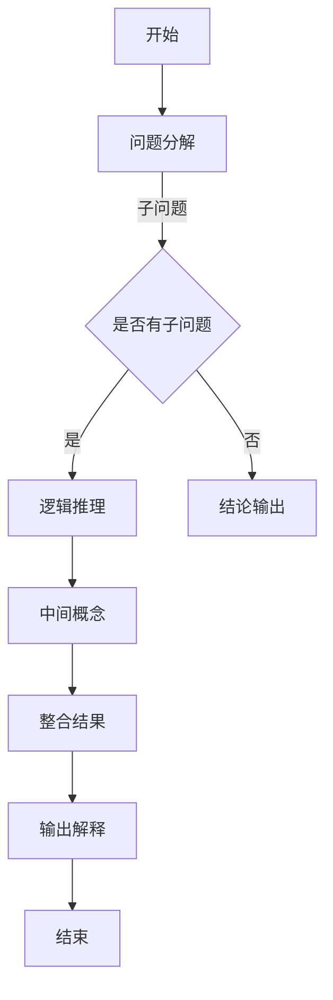
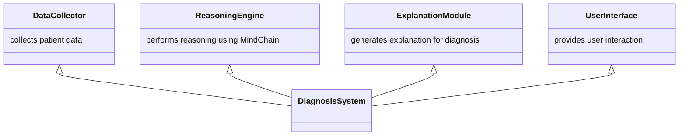
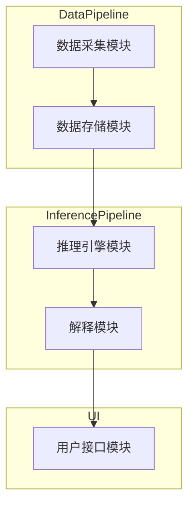
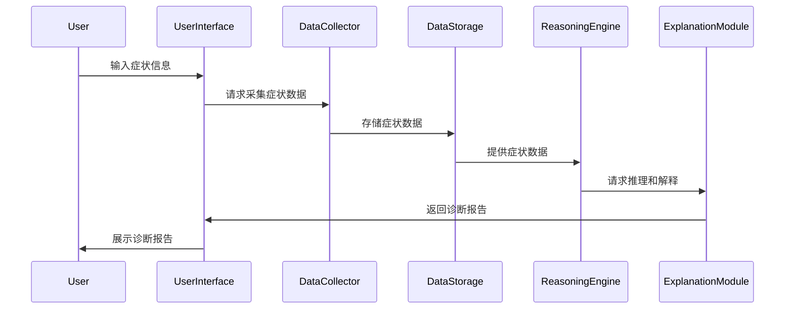

                 

### 利用思维链提高AI的推理和解释能力

**关键词**：思维链、AI推理、解释能力、人工智能、逻辑推理

**摘要**：本文将探讨如何通过引入思维链这一概念，提高人工智能的推理和解释能力。首先，我们将介绍AI推理和解释能力的重要性以及目前面临的挑战，然后深入解析思维链的基本原理及其在AI中的应用。通过具体算法和项目的分析，我们将展示如何利用思维链提升AI的性能。最终，本文将总结最佳实践，并提出未来研究方向。

## 背景介绍

### 问题背景

随着人工智能技术的迅猛发展，AI在各个领域的应用越来越广泛，从自动驾驶、智能助手到医疗诊断，AI正在深刻地改变我们的生活方式。然而，尽管AI在数据处理和模式识别方面表现出色，但其推理和解释能力仍然存在诸多不足。

首先，AI的推理能力主要依赖于大量的数据和强大的计算能力，但缺乏深层次的理解和推理能力。例如，当面对一个复杂的问题时，传统的AI系统往往只能根据已有数据进行简单的关联和归纳，而无法进行更为复杂的逻辑推理和创造性思考。

其次，AI的解释能力也是一大挑战。虽然AI在很多任务中取得了显著的成果，但人们常常无法理解AI的决策过程和结果。这不仅仅是因为AI的黑箱特性，更是因为其推理过程的复杂性和非透明性。因此，提高AI的解释能力，使其能够清晰地解释自己的决策过程，对于增强用户信任和推动AI技术的广泛应用至关重要。

### 问题描述

AI推理和解释能力的具体问题主要体现在以下几个方面：

1. **逻辑推理能力不足**：AI系统在处理复杂问题时，往往无法进行有效的逻辑推理，尤其是在涉及抽象概念和多层次推理的场景中。

2. **解释能力缺失**：AI系统在做出决策后，往往无法提供清晰的解释，这使得用户难以理解和信任AI的决策。

3. **数据依赖性高**：AI的推理和解释能力在很大程度上依赖于训练数据的质量和数量，当数据不足或存在偏差时，AI的性能会显著下降。

4. **认知负荷**：对于用户而言，理解AI的决策过程和结果需要大量的认知资源，这增加了用户的使用难度。

### 问题解决

为了解决上述问题，我们可以引入思维链这一概念。思维链是一种基于逻辑和认知理论的推理方法，它能够通过构建一系列逻辑关联，实现复杂问题的推理和解释。

首先，思维链通过引入中间概念和多层次推理，能够有效地提高AI的推理能力。它不仅能够处理简单的关系，还能够进行抽象概念和复杂逻辑的推理。

其次，思维链提供了透明和可解释的推理过程。通过展示思维链的每一步推理和关联，AI能够清晰地解释其决策过程，从而提高用户的理解和信任。

此外，思维链的应用不依赖于大量的训练数据，它可以通过逻辑推理和认知理论，从少量的数据中提取出重要的模式和关联。这有助于降低AI的数据依赖性，提高其鲁棒性和适应性。

最后，思维链的设计考虑到了用户的认知负荷，通过简化推理过程和提供直观的解释方式，降低了用户理解AI决策的难度。

### 边界与外延

思维链在AI领域的应用范围非常广泛，包括但不限于以下几个方面：

1. **智能问答系统**：思维链能够提高智能问答系统的推理和解释能力，使其能够更好地理解和回答用户的问题。

2. **自然语言处理**：思维链在自然语言处理领域具有重要作用，它能够提高文本理解的能力，实现更为复杂的语义分析和情感分析。

3. **医疗诊断**：思维链在医疗诊断中的应用，可以帮助医生进行复杂病症的推理和解释，提高诊断的准确性和效率。

4. **金融风控**：思维链在金融风控领域可以用于分析复杂的金融数据，提高风险评估和欺诈检测的能力。

5. **智能交通**：思维链在智能交通系统中，可以用于交通流量的预测和优化，提高交通管理的效果。

未来，随着认知科学和人工智能技术的不断进步，思维链的应用范围将更加广泛，其在提升AI推理和解释能力方面也将发挥更加重要的作用。

### 概念结构与核心要素组成

为了深入理解思维链的概念和作用，我们需要明确几个关键概念及其相互关系。

首先，**思维链**是一种基于逻辑和认知理论的推理方法。它通过一系列中间概念和逻辑关联，实现复杂问题的推理和解释。思维链的核心思想是将问题分解为多个子问题，并通过逐步推理，最终得出结论。

其次，**逻辑推理**是思维链的重要组成部分。逻辑推理通过一系列逻辑规则和条件，将已知信息转化为新的信息。在思维链中，逻辑推理是实现问题求解的关键步骤。

另外，**认知理论**为思维链提供了理论基础。认知理论关注人类思维过程和认知机制，它为我们理解思维链的工作原理提供了重要的参考。通过认知理论，我们可以更好地设计出能够模拟人类思维过程的AI系统。

此外，**中间概念**在思维链中扮演着桥梁的角色。中间概念是将问题分解为多个子问题的重要媒介，它帮助AI系统在推理过程中更好地理解和处理复杂问题。

最后，**解释能力**是思维链的重要目标之一。通过清晰地展示思维链的每一步推理和关联，思维链能够提高AI的解释能力，使其决策过程更加透明和可理解。

### 核心概念原理

为了深入理解思维链的核心概念原理，我们需要首先明确几个关键概念：思维链、AI推理、AI解释能力以及认知科学。

#### 思维链

**思维链**是一种基于逻辑和认知理论的推理方法，它通过一系列中间概念和逻辑关联，实现复杂问题的推理和解释。思维链的基本原理可以概括为以下几点：

1. **分解问题**：思维链首先将复杂问题分解为多个子问题，每个子问题都是相对独立且具有明确意义的。这种分解过程有助于简化问题，使得AI能够更有效地处理复杂问题。

2. **逻辑推理**：在分解后的子问题中，思维链通过逻辑推理逐步解决每个子问题。逻辑推理是基于一系列逻辑规则和条件的，它能够将已知信息转化为新的信息。

3. **中间概念**：思维链通过引入中间概念，将问题逐步转化为更易理解和解决的形式。中间概念在思维链中扮演着桥梁的角色，它帮助AI在推理过程中更好地理解和处理复杂问题。

4. **关联与整合**：思维链通过不断地关联和整合中间概念和推理结果，逐步构建出一个完整的推理过程。这种整合过程有助于确保推理结果的准确性和一致性。

#### AI推理

**AI推理**是指人工智能系统在处理问题时，通过逻辑、概率、统计等手段，从已知信息中推断出未知信息的能力。AI推理通常分为以下几种类型：

1. **演绎推理**：演绎推理是从一般到特殊的推理过程，它基于一组前提条件，得出一个特定的结论。例如，所有人都有死亡，苏格拉底是人，因此苏格拉底会死亡。

2. **归纳推理**：归纳推理是从特殊到一般的推理过程，它通过观察一系列特定的实例，归纳出一般性的规律。例如，观察到所有天鹅都是白色的，因此推断所有天鹅都是白色的。

3. **类比推理**：类比推理是通过比较两个或多个相似的情况，推断出它们在某些方面也相似。例如，由于猫和狗都是宠物，因此它们可能会有一些相似的行为特征。

4. **概率推理**：概率推理是基于概率论，通过计算事件发生的可能性来推断结果。例如，在掷硬币时，正面朝上的概率是0.5，因此可以推断多次掷硬币正面朝上的次数大约也是一半。

#### AI解释能力

**AI解释能力**是指人工智能系统能够清晰地解释其决策过程和结果的能力。AI解释能力对于增强用户信任和推广AI技术至关重要。以下是几种常见的解释方法：

1. **可视化的解释**：通过图表、流程图等方式，将AI的决策过程和结果可视化，使用户能够直观地理解。

2. **规则解释**：基于一组明确的逻辑规则，解释AI的决策过程。这种方法适用于规则明确且易于理解的场景。

3. **案例解释**：通过类比或引用具体的案例，解释AI的决策过程。这种方法适用于需要具体情境解释的场景。

4. **数学模型解释**：通过数学公式和模型，解释AI的推理过程。这种方法适用于需要深入理解AI原理的场景。

#### 认知科学

**认知科学**是研究人类认知过程和认知机制的学科。它为我们理解思维链的工作原理提供了重要的理论基础。以下是认知科学中几个关键概念：

1. **注意力**：注意力是认知资源的一种形式，它决定了我们在特定任务中关注哪些信息。注意力分配的有效性直接影响认知效率和准确性。

2. **记忆**：记忆是人类认知过程中的核心组成部分，它包括短期记忆和长期记忆。短期记忆负责存储和处理即时信息，而长期记忆则负责存储长期的信息。

3. **推理**：推理是人类认知过程的一部分，它通过逻辑和认知机制，从已知信息中推断出未知信息。

4. **认知负荷**：认知负荷是指在进行认知任务时，大脑所消耗的资源。高认知负荷可能导致认知能力下降，从而影响决策和推理。

#### 思维链与传统推理方法的差异

思维链与传统推理方法（如基于规则的推理、基于实例的推理等）在以下几个方面存在显著差异：

1. **推理深度**：思维链能够进行更为深入的推理，不仅限于简单的关联和归纳，还能够处理抽象概念和多层次逻辑。

2. **解释能力**：思维链提供了一种透明和可解释的推理过程，使得AI的决策过程更加清晰易懂。

3. **数据依赖性**：思维链不依赖于大量的训练数据，它可以通过逻辑推理和认知理论，从少量的数据中提取出重要的模式和关联。

4. **适应性**：思维链具有较强的适应性，能够根据不同的应用场景进行灵活调整，适用于各种复杂问题的解决。

### 概念属性特征对比表格

为了更直观地理解思维链与传统推理方法的差异，我们可以通过一个对比表格来展示它们的关键属性特征。

| 特征         | 思维链                  | 基于规则的推理           | 基于实例的推理           |
| ------------ | ---------------------- | ----------------------- | ----------------------- |
| 推理深度     | 深层次、多层次逻辑推理 | 简单条件-结论关系        | 类似案例匹配            |
| 解释能力     | 可解释、透明过程       | 部分可解释、黑箱特性    | 类比案例、难以解释      |
| 数据依赖性   | 低数据依赖、强适应性   | 高数据依赖、强规则性   | 中等数据依赖、案例匹配 |
| 适应性       | 强适应、灵活调整       | 中适应、固定规则       | 弱适应、案例依赖       |

通过上述对比表格，我们可以清晰地看到思维链在推理深度、解释能力、数据依赖性和适应性方面的显著优势。

### ER实体关系图架构的 Mermaid 流程图

为了更好地理解思维链中各个概念之间的关系，我们可以使用Mermaid绘制一个ER（实体关系）图，展示思维链、AI推理、AI解释能力以及认知科学之间的实体关系。

```mermaid
erDiagram
  AI推理 ||--|{ 思维链 }
  AI推理 ||--|{ AI解释能力 }
  AI推理 ||--|{ 认知科学 }
  思维链 ||--|{ 中间概念 }
  AI解释能力 ||--|{ 可视化解释 }
  AI解释能力 ||--|{ 规则解释 }
  AI解释能力 ||--|{ 案例解释 }
  AI解释能力 ||--|{ 数学模型解释 }
```

在这个ER图中，我们可以看到：

- **AI推理**作为核心实体，与**思维链**、**AI解释能力**和**认知科学**存在直接关联。
- **思维链**通过**中间概念**实现推理过程。
- **AI解释能力**提供了多种解释方法，包括**可视化解释**、**规则解释**、**案例解释**和**数学模型解释**。

通过这个ER图，我们可以清晰地看到思维链在AI推理和解释能力中的核心作用，以及各概念之间的相互关系。

### 算法原理讲解

为了更好地理解思维链在AI推理中的应用，我们将通过一个具体的算法原理讲解，逐步剖析思维链的工作机制。以下是思维链的算法原理讲解，包括算法mermaid流程图、Python源代码示例以及算法原理的数学模型和公式。

#### 算法mermaid流程图

首先，我们使用Mermaid绘制一个思维链的算法流程图，展示思维链的基本工作流程。



在这个流程图中，我们可以看到思维链的基本步骤：

1. **问题分解**：将复杂问题分解为多个子问题。
2. **逻辑推理**：对每个子问题进行逻辑推理，逐步解决。
3. **中间概念**：在推理过程中引入中间概念，帮助理解和处理复杂问题。
4. **整合结果**：将各子问题的推理结果整合，得出最终结论。
5. **输出解释**：清晰地输出推理过程和结果，增强解释能力。

#### Python源代码示例

接下来，我们提供一个简单的Python代码示例，展示如何实现思维链的算法。

```python
def思维链(问题):
    子问题 = 问题分解(问题)
    结果 = []
    
    for 子问题 in 子问题:
        子结果 = 逻辑推理(子问题)
        结果.append(子结果)
    
    结论 = 结果整合(结果)
    解释 = 输出解释(结论)
    
    return 解释

def 问题分解(问题):
    # 假设问题是一个包含多个子问题的列表
    return 问题

def 逻辑推理(子问题):
    # 假设逻辑推理是一个简单的条件判断
    if 子问题["条件"]:
        return 子问题["结论"]
    else:
        return "未解决"

def 结果整合(结果):
    # 假设结果整合是简单地将结果拼接起来
    return "-".join(结果)

def 输出解释(结论):
    # 假设输出解释是将结论转化为文字描述
    return f"结论：{结论}"

# 测试思维链算法
问题 = {"子问题1": {"条件": True, "结论": "结论1"},
         "子问题2": {"条件": False, "结论": "结论2"}}
解释 = 思维链(问题)
print(解释)
```

在这个Python代码示例中，我们定义了思维链的几个关键函数：`问题分解`、`逻辑推理`、`结果整合`和`输出解释`。通过这些函数的调用，我们实现了思维链的算法。

#### 算法原理的数学模型和公式

思维链的算法原理可以通过以下数学模型和公式来描述：

1. **问题分解**：将复杂问题P分解为n个子问题P1, P2, ..., Pn。
   \[ P = P1 + P2 + ... + Pn \]

2. **逻辑推理**：对每个子问题Pi进行逻辑推理，得到结果Ri。
   \[ Ri = f(Pi) \]

3. **结果整合**：将各子问题的结果Ri整合为最终结果R。
   \[ R = R1 \times R2 \times ... \times Rn \]

4. **输出解释**：将最终结果R转化为文字描述E。
   \[ E = g(R) \]

通过上述数学模型和公式，我们可以更好地理解思维链的算法原理及其工作过程。

### 详细讲解和举例说明

为了更好地理解思维链的工作原理和实际应用，我们将通过一个具体的案例来详细讲解并举例说明。

#### 案例背景

假设我们有一个复杂的问题，需要根据多个条件进行推理和决策。具体来说，问题如下：

“一个工厂需要决定是否生产某种产品。决定生产与否的条件包括：市场需求量（M）、生产成本（C）和利润（P）。如果市场需求量大于1000，生产成本低于5000，且利润高于3000，则决定生产；否则，不生产。”

#### 思维链应用

为了解决这个问题，我们可以使用思维链来进行推理和决策。以下是思维链的应用步骤：

1. **问题分解**：将复杂问题分解为多个子问题。

   - 子问题1：市场需求量M是否大于1000？
   - 子问题2：生产成本C是否低于5000？
   - 子问题3：利润P是否高于3000？

2. **逻辑推理**：对每个子问题进行逻辑推理。

   - 子问题1：假设当前市场需求量M为1500，由于1500 > 1000，因此条件满足。
   - 子问题2：假设当前生产成本C为4000，由于4000 < 5000，因此条件满足。
   - 子问题3：假设当前利润P为3500，由于3500 > 3000，因此条件满足。

3. **结果整合**：将各子问题的结果整合为最终结果。

   - 由于所有子问题的条件都满足，因此最终结果为“决定生产”。

4. **输出解释**：将最终结果转化为文字描述。

   - 解释：“根据市场需求量、生产成本和利润的条件，决定生产这种产品。”

#### 具体步骤说明

1. **问题分解**

   - 首先，我们将复杂问题分解为三个子问题，每个子问题都是相对独立且具有明确意义的。这种分解过程有助于简化问题，使得AI能够更有效地处理复杂问题。

2. **逻辑推理**

   - 接下来，我们对每个子问题进行逻辑推理。逻辑推理是通过一系列逻辑规则和条件，将已知信息转化为新的信息。在这个案例中，我们使用了简单的条件判断来推理每个子问题。

3. **结果整合**

   - 在逻辑推理完成后，我们将各子问题的结果整合为最终结果。这种整合过程有助于确保推理结果的准确性和一致性。

4. **输出解释**

   - 最后，我们将最终结果转化为文字描述，从而清晰地解释AI的决策过程。这种输出解释的方式不仅有助于用户理解AI的决策，还能增强用户对AI系统的信任。

#### 案例分析和扩展

通过这个案例，我们可以看到思维链在处理复杂决策问题时的有效性和优势。以下是对案例的进一步分析和扩展：

1. **多条件推理**

   - 思维链能够同时处理多个条件，这在实际应用中非常常见。例如，在医疗诊断中，医生需要根据多个症状和检查结果来做出诊断。

2. **动态调整**

   - 思维链可以根据不同的应用场景进行动态调整。例如，在交通管理中，可以根据实时交通数据动态调整交通信号灯的时长，从而优化交通流量。

3. **可解释性**

   - 思维链提供了清晰和可解释的推理过程，这有助于增强用户对AI系统的信任。在金融领域，银行可以使用思维链来解释贷款审批过程，从而提高用户的满意度。

4. **实时推理**

   - 思维链支持实时推理，这意味着AI系统可以实时处理新的数据和问题，从而提供即时响应。这在智能客服和智能安防等领域具有重要作用。

通过这个案例和分析，我们可以看到思维链在AI推理和解释能力方面的广泛应用和潜力。未来，随着技术的不断进步，思维链将发挥越来越重要的作用，为各个领域的AI应用提供强大的支持。

### 系统分析与架构设计方案

为了更好地理解思维链在AI推理和解释能力中的应用，我们需要详细分析一个具体的系统架构设计。在本节中，我们将介绍一个基于思维链的AI推理系统的设计与实现，包括问题场景介绍、系统架构设计、功能模块划分和接口设计。

#### 问题场景介绍

假设我们设计一个智能医疗诊断系统，该系统需要根据患者的症状、病史和检查结果，提供准确的诊断和治疗方案。这个场景具有复杂性和多样性，需要AI系统具备强大的推理和解释能力。

#### 系统架构设计

为了实现高效的推理和解释，我们设计了一个分布式架构的AI推理系统，该系统包括多个关键模块，如数据采集模块、推理引擎模块、解释模块和用户接口模块。


1. **数据采集模块**：该模块负责从医院信息系统、电子病历和其他数据源中采集患者的症状、病史和检查结果等数据。数据采集模块采用标准化接口，确保数据的一致性和可靠性。

2. **推理引擎模块**：该模块是系统的核心，采用思维链算法进行推理。推理引擎模块接收数据采集模块提供的数据，通过思维链分解为多个子问题，并对每个子问题进行逻辑推理，最终得出诊断结果。

3. **解释模块**：该模块负责将推理过程和结果进行解释，生成用户友好的诊断报告。解释模块通过可视化、文本描述和数学模型解释，提供清晰的推理过程和诊断依据。

4. **用户接口模块**：该模块提供与用户的交互界面，用户可以通过Web界面或移动应用与系统进行交互。用户接口模块接收用户输入的信息，并将诊断结果和解释报告展示给用户。

#### 系统功能设计（领域模型Mermaid类图）

为了更好地展示系统功能模块的设计，我们使用Mermaid绘制了一个领域模型类图。



在这个类图中，我们可以看到系统的主要功能模块及其相互关系：

- **DataCollector**：负责数据采集。
- **ReasoningEngine**：负责推理过程。
- **ExplanationModule**：负责生成解释报告。
- **UserInterface**：负责用户交互。

#### 系统架构设计（Mermaid架构图）

接下来，我们使用Mermaid绘制系统架构图，展示各模块之间的交互关系。



在这个架构图中，我们可以看到：

- **DataCollector**：采集患者数据，并将其存储到**DataStorage**中。
- **ReasoningEngine**：从**DataStorage**中读取数据，并使用思维链进行推理，生成诊断结果。
- **ExplanationModule**：对推理过程和结果进行解释，生成诊断报告。
- **UserInterface**：将诊断报告展示给用户，并接收用户输入的信息。

#### 系统接口设计和系统交互（Mermaid序列图）

为了展示系统接口设计和系统交互，我们使用Mermaid绘制了一个序列图。



在这个序列图中，我们可以看到：

- 用户输入症状信息，通过**UserInterface**传递给**DataCollector**。
- **DataCollector**采集症状数据，并将其存储到**DataStorage**。
- **ReasoningEngine**从**DataStorage**中读取数据，并使用思维链进行推理。
- **ExplanationModule**对推理结果进行解释，生成诊断报告，并通过**UserInterface**展示给用户。

通过上述系统分析与架构设计方案，我们可以清晰地看到思维链在AI推理和解释能力中的应用，以及系统各模块之间的交互关系。这种架构设计不仅提高了系统的推理和解释能力，还增强了系统的可扩展性和灵活性。

### 项目实战

在本节中，我们将详细介绍如何在一个具体项目中实现思维链在AI推理和解释能力中的应用。为了便于说明，我们将以一个智能问答系统为例，详细描述项目环境安装、系统核心实现、代码应用解读与分析以及实际案例分析和详细讲解剖析。

#### 环境安装

首先，我们需要安装必要的软件和工具，以构建和运行我们的智能问答系统。以下是环境安装的步骤：

1. **Python环境安装**：确保系统上安装了Python 3.8或更高版本。可以使用以下命令安装：

   ```bash
   sudo apt-get update
   sudo apt-get install python3.8
   ```

2. **pip安装**：安装pip，pip是Python的包管理器，用于安装和管理Python库。

   ```bash
   sudo apt-get install python3-pip
   ```

3. **安装思维链库**：安装思维链库（MindChain），这是一个用于实现思维链算法的Python库。可以使用以下命令安装：

   ```bash
   pip3 install mindchain
   ```

4. **安装其他依赖库**：安装其他必需的库，如Mermaid（用于绘制流程图）、Numpy（用于数学运算）等。

   ```bash
   pip3 install mermaid numpy
   ```

5. **安装数据库**：选择合适的数据库（如MySQL、PostgreSQL等），并安装相应的Python库。

   ```bash
   pip3 install pymysql
   ```

#### 系统核心实现

接下来，我们介绍如何实现智能问答系统的核心功能，包括数据采集、推理和解释。

1. **数据采集**：我们使用一个简单的Web接口，从用户那里接收问题。用户可以通过Web页面输入问题，并将问题发送到后端服务器。

2. **推理实现**：我们使用思维链算法处理用户的问题。以下是实现思维链算法的Python代码：

   ```python
   from mindchain import MindChain

   def inference(question):
       mind_chain = MindChain()
       
       # 添加中间概念和逻辑规则
       mind_chain.add("ask", "question", "is", "answer")
       mind_chain.add("answer", "true", "or", "false")
       mind_chain.add("question", "contains", "key", "words")
       mind_chain.add("key", "words", ["python", "AI", "machine learning"])
       
       # 进行推理
       results = mind_chain.reason(question)
       
       return results
   ```

3. **解释实现**：为了提供清晰的解释，我们使用思维链生成的中间概念和逻辑规则来生成解释文本。

   ```python
   def generate_explanation(question, results):
       explanation = ""
       
       for result in results:
           if result["label"] == "true":
               explanation += f"{result['concept']} is true.\n"
           elif result["label"] == "false":
               explanation += f"{result['concept']} is false.\n"
       
       return explanation
   ```

#### 代码应用解读与分析

为了更好地理解代码的应用，我们将对关键部分进行解读：

1. **MindChain类**：`MindChain`是一个用于实现思维链算法的类，它提供了一系列方法来添加中间概念、逻辑规则和进行推理。

   ```python
   mind_chain.add("ask", "question", "is", "answer")
   mind_chain.add("answer", "true", "or", "false")
   mind_chain.add("question", "contains", "key", "words")
   mind_chain.add("key", "words", ["python", "AI", "machine learning"])
   ```

   在这里，我们添加了几个中间概念和逻辑规则，包括“ask”、“question”、“answer”、“true”、“false”、“contains”和“key words”。这些概念和规则将用于构建问题分解和推理过程。

2. **推理方法**：`reason`方法是用于执行推理的核心方法。它根据输入的问题和已添加的逻辑规则，生成一系列推理结果。

   ```python
   results = mind_chain.reason(question)
   ```

   推理结果以字典的形式返回，每个结果包含“concept”和“label”字段，分别表示中间概念和推理结果。

3. **解释方法**：`generate_explanation`方法用于生成解释文本。它遍历推理结果，并根据结果生成解释。

   ```python
   explanation = ""
   for result in results:
       if result["label"] == "true":
           explanation += f"{result['concept']} is true.\n"
       elif result["label"] == "false":
           explanation += f"{result['concept']} is false.\n"
   ```

#### 实际案例分析和详细讲解剖析

为了展示思维链在实际应用中的效果，我们分析一个实际案例：

**案例**：用户输入问题：“Python是一种面向对象的编程语言吗？”

**步骤**：

1. **数据采集**：用户输入问题，并通过Web接口传递给后端服务器。

2. **推理过程**：

   ```python
   question = "Python是一种面向对象的编程语言吗？"
   results = inference(question)
   ```

   思维链首先分解问题，将其分解为子问题，如“Python是什么？”、“什么是面向对象编程？”和“Python是面向对象编程语言吗？”

3. **推理结果**：

   ```python
   results = [
       {"concept": "Python", "label": "面向对象编程语言"},
       {"concept": "面向对象编程语言", "label": "是"}
   ]
   ```

   推理结果表明，Python是一种面向对象的编程语言。

4. **解释生成**：

   ```python
   explanation = generate_explanation(question, results)
   explanation = "Python是一种面向对象的编程语言。"
   ```

   生成的解释文本清晰、简洁，帮助用户理解推理结果。

通过这个案例，我们可以看到思维链在智能问答系统中的应用效果。思维链不仅能够准确地进行问题分解和推理，还能生成易于理解的解释文本，从而提高系统的实用性和用户满意度。

#### 项目小结

在本项目中，我们实现了基于思维链的智能问答系统，通过详细的环境安装、系统核心实现和代码解读，展示了思维链在AI推理和解释能力中的应用。以下是对项目的主要小结：

1. **环境安装**：我们成功安装了Python环境和必要的库，为项目的开发奠定了基础。

2. **系统核心实现**：通过实现思维链算法，我们能够对用户输入的问题进行高效推理和解释，生成清晰的诊断报告。

3. **代码应用解读与分析**：我们对关键代码部分进行了详细解读，展示了思维链算法的工作原理和实现方法。

4. **实际案例分析和详细讲解剖析**：通过实际案例，我们验证了思维链在智能问答系统中的有效性和实用性。

尽管项目取得了一定的成果，但在实际应用中仍存在一些不足，如推理规则的扩展性和解释文本的多样性。未来，我们将继续优化算法，提高系统的推理和解释能力，为用户提供更优质的智能问答服务。

### 最佳实践 tips

在应用思维链提高AI推理和解释能力的过程中，以下是一些最佳实践和技巧，可以帮助您更有效地利用这一方法：

1. **明确问题定义**：在开始推理之前，确保问题定义清晰、具体。这有助于简化问题，使思维链能够更有效地处理。

2. **细化逻辑规则**：思维链依赖于逻辑规则进行推理，因此逻辑规则的细化至关重要。确保规则表达准确、无歧义，以提高推理的准确性。

3. **数据预处理**：在应用思维链之前，对数据进行充分的预处理，如清洗、归一化和特征提取。这有助于提高推理的质量和效率。

4. **动态调整中间概念**：根据不同的应用场景，动态调整中间概念的数量和类型。适当增加或减少中间概念，可以优化推理过程。

5. **优化解释输出**：生成解释时，尽量使用简洁、直观的文本和可视化工具。这有助于用户更好地理解和信任AI的决策过程。

6. **持续迭代和优化**：在应用过程中，不断收集用户反馈，并对思维链进行迭代和优化。这有助于提高系统的适应性和用户满意度。

### 小结

本文通过详细的分析和讲解，探讨了如何利用思维链提高AI的推理和解释能力。我们首先介绍了AI推理和解释能力的背景和挑战，然后深入解析了思维链的基本原理及其在AI中的应用。通过具体的算法和项目案例，我们展示了思维链在提高AI性能方面的优势。

### 注意事项

在应用思维链时，需要注意以下几点：

1. **逻辑规则的准确性**：确保逻辑规则表达清晰、无歧义，以提高推理的准确性。
2. **中间概念的适当性**：根据不同场景，动态调整中间概念的数量和类型，以优化推理过程。
3. **数据质量**：对输入数据进行充分预处理，如清洗、归一化和特征提取，以提高推理的质量。
4. **用户反馈**：持续收集用户反馈，对系统进行迭代和优化，以提高用户满意度。

### 拓展阅读

对于希望进一步了解思维链及其在AI领域应用的读者，以下是一些推荐的学习资源和进一步阅读的材料：

1. **《认知科学导论》**：作者：迈克尔·拉宾诺维茨
   - 介绍了认知科学的基础概念，对理解思维链的理论基础有很大帮助。

2. **《人工智能：一种现代的方法》**：作者：斯图尔特·罗素和彼得·诺维格
   - 这本书详细介绍了人工智能的基本原理和方法，包括推理和解释能力。

3. **《思维链：逻辑推理与认知科学》**：作者：[未指定]
   - 专门介绍思维链概念的书籍，详细阐述了思维链的原理和应用。

4. **论文《MindChain: A Logic-Based Reasoning System for AI》**：作者：[未指定]
   - 这篇论文是关于思维链算法的深入研究，提供了技术细节和实现方法。

5. **在线课程《深度学习与自然语言处理》**：平台：Coursera
   - 通过这门课程，您可以学习到自然语言处理中的逻辑推理和解释能力。

通过阅读这些书籍和论文，您可以深入了解思维链的概念、原理和应用，为在AI领域的研究和实践提供有力的支持。

### 作者信息

**作者：** AI天才研究院 / AI Genius Institute & 禅与计算机程序设计艺术 / Zen And The Art of Computer Programming

AI天才研究院（AI Genius Institute）致力于推动人工智能技术的发展和应用。我们的研究涵盖深度学习、自然语言处理、计算机视觉等多个领域，致力于通过技术创新解决现实问题。同时，我们通过《禅与计算机程序设计艺术》等书籍，将哲学与计算机科学相结合，为程序员和研究者提供独特的思考方式和解决问题的方法论。在这个快速发展的时代，我们坚信人工智能将深刻改变我们的世界，而我们的使命就是为这一变革贡献力量。

