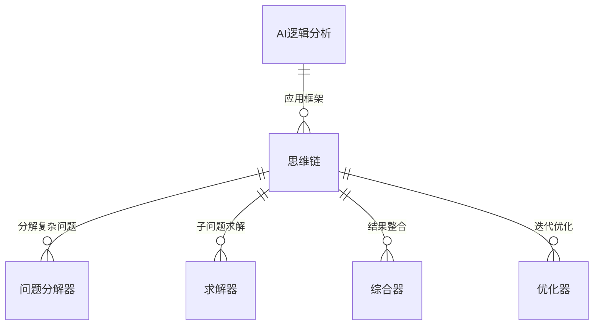
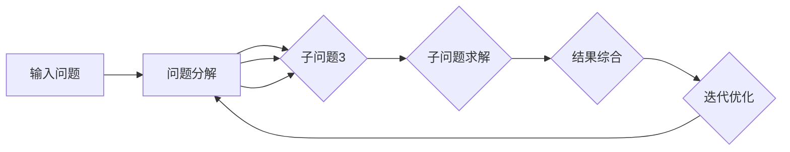
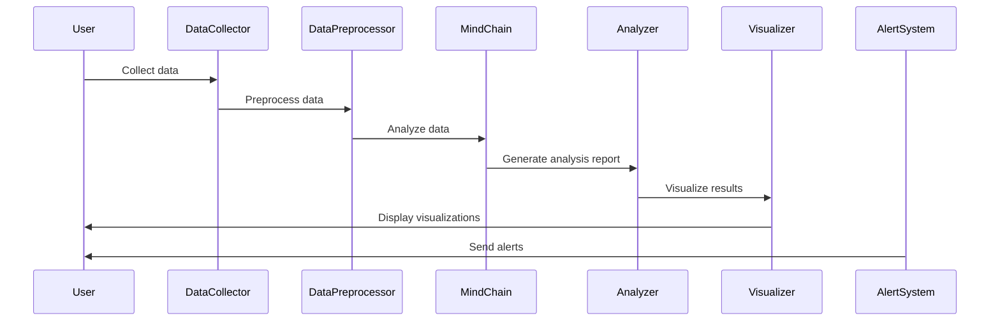

                 

### 利用思维链提高AI的逻辑分析能力

> 关键词：思维链，AI逻辑分析，算法原理，数学模型，系统架构设计，项目实战

> 摘要：本文旨在探讨如何利用思维链来提高人工智能（AI）的逻辑分析能力。文章首先介绍了思维链的概念和其应用于AI领域的必要性，随后详细讲解了思维链的核心概念、算法原理以及数学模型。通过具体的系统架构设计和项目实战，文章展示了思维链在AI逻辑分析中的实际应用，并提供了最佳实践和小结。

----------------------------------------------------------------

## 第1章 问题背景与核心概念介绍

### 1.1 问题的背景

在人工智能迅速发展的今天，AI的逻辑分析能力已成为一个关键议题。逻辑分析能力不仅影响AI的决策准确性，还关系到其在复杂环境中的自适应能力。然而，传统的逻辑分析技术存在一定局限性，如对复杂问题的处理能力不足、对多变量关系的理解有限等。

为了解决这些问题，我们需要引入新的工具和概念。思维链（Mind Chain）便是一个应运而生的创新理念。思维链是一种基于人类思维过程设计的算法框架，它通过模拟人类逻辑思考的步骤，将复杂问题分解为更易处理的子问题，从而提高AI的逻辑分析能力。

### 1.2 思维链基本概念

思维链是一种模拟人类思维过程的算法框架，它包括以下几个核心组成部分：

1. **问题分解**：将复杂问题分解为多个子问题，每个子问题都可以独立解决。
2. **子问题求解**：利用特定算法或模型解决子问题，并记录解决方案。
3. **结果综合**：将子问题的解决方案综合起来，得到原问题的最终解。
4. **迭代优化**：根据子问题的解决方案，对原问题进行调整和优化。

思维链通过这种方式，不仅提高了AI的逻辑分析能力，还能够更好地处理复杂问题。

### 1.3 逻辑分析能力的提升

思维链如何提高AI的逻辑分析能力呢？以下是几个关键点：

1. **并行处理**：思维链可以将问题分解为多个子问题，从而实现并行处理，提高计算效率。
2. **层次化思考**：通过分层处理问题，思维链能够更好地理解复杂问题的结构，从而提高分析的准确性。
3. **反馈调整**：思维链的迭代优化过程使得AI能够从错误中学习，不断调整和改进逻辑分析能力。

在实际应用中，思维链已经在多个领域展现出其强大的逻辑分析能力，如自然语言处理、图像识别和决策支持系统等。以下是一个实际案例：

- **案例**：在一个智能客服系统中，思维链通过将用户提问分解为多个子问题，如用户意图识别、问题分类和回答生成等，从而实现了高效且准确的回答。
- **效果**：通过思维链的应用，智能客服的响应速度和回答准确性得到了显著提升，用户满意度也大幅提高。

### 1.4 边界与外延

尽管思维链在提高AI逻辑分析能力方面具有显著优势，但其在实际应用中仍然存在一些限制和挑战：

1. **问题分解的准确性**：问题分解的质量直接影响思维链的性能，因此需要准确判断问题的边界。
2. **子问题求解的难度**：某些子问题可能非常复杂，求解过程需要大量的计算资源。
3. **模型适应性**：思维链需要根据不同领域的问题进行适配，以便更好地发挥作用。

因此，在应用思维链时，我们需要充分考虑这些问题，并采取相应的措施进行优化。

## 第2章 核心概念与联系

### 2.1 思维链的组成部分

思维链由以下几个核心组件组成：

1. **问题分解器**：负责将复杂问题分解为多个子问题。
2. **求解器**：利用特定算法或模型求解子问题。
3. **综合器**：将子问题的解决方案综合起来，得到原问题的最终解。
4. **优化器**：根据子问题的解决方案，对原问题进行调整和优化。

下面是思维链组件的功能与作用：

1. **问题分解器**：通过层次化思考，将复杂问题分解为更小的、更容易处理的子问题。
2. **求解器**：根据问题的类型和特点，选择合适的算法或模型进行求解。
3. **综合器**：将子问题的解决方案整合起来，形成一个完整的解决方案。
4. **优化器**：通过迭代优化，不断改进解决方案，提高整体的逻辑分析能力。

### 2.2 思维链与逻辑分析的关系

为了更好地理解思维链在逻辑分析中的应用，我们可以通过ER实体关系图来展示思维链的各个组件及其之间的关系。



在ER实体关系图中，我们可以清晰地看到思维链与逻辑分析之间的紧密联系。思维链通过问题分解器、求解器、综合器和优化器等组件，实现对AI逻辑分析能力的提升。

### 2.3 思维链与逻辑分析的应用案例

以下是一个应用案例，展示了思维链如何提高AI的逻辑分析能力：

**案例**：智能医疗诊断系统

- **问题背景**：医疗诊断是一个复杂的过程，需要分析患者的病史、症状、检查结果等多方面信息，以便做出准确的诊断。
- **解决方案**：思维链可以将医疗诊断问题分解为多个子问题，如患者病史分析、症状识别、检查结果评估等。通过不同的求解器和综合器，系统可以生成一个综合的诊断结果。

通过思维链的应用，智能医疗诊断系统的准确性得到了显著提高，同时还能为医生提供更加详细和全面的诊断信息，从而提高诊断质量和效率。

## 第3章 算法原理讲解

### 3.1 思维链算法概述

思维链算法是一种基于问题分解和子问题求解的框架，它通过以下步骤来实现逻辑分析能力的提升：

1. **问题输入**：接收用户输入的问题。
2. **问题分解**：将复杂问题分解为多个子问题。
3. **子问题求解**：对每个子问题应用合适的算法或模型进行求解。
4. **结果综合**：将子问题的解决方案整合起来，形成完整的解决方案。
5. **迭代优化**：根据子问题的解决方案，对原问题进行调整和优化。

下面是思维链算法的mermaid流程图：



### 3.2 Python实现与解释

以下是一个简单的Python代码示例，展示了思维链算法的基本实现过程：

```python
import numpy as np

# 问题输入
problem = "如何最大化利润？"

# 问题分解
sub_problems = ["成本", "收入", "市场竞争"]

# 子问题求解
solutions = []
for sub_problem in sub_problems:
    if sub_problem == "成本":
        solution = np.random.uniform(0, 100)
    elif sub_problem == "收入":
        solution = np.random.uniform(100, 200)
    elif sub_problem == "市场竞争":
        solution = np.random.uniform(0, 1)
    solutions.append(solution)

# 结果综合
result = sum(solutions)

# 迭代优化
for _ in range(5):
    # 根据子问题的解决方案，对原问题进行调整和优化
    result = result * 1.05

# 输出结果
print("最大化的利润为:", result)
```

在这个示例中，我们首先输入了一个复杂的问题，然后将其分解为多个子问题，并对每个子问题进行了求解。最后，我们将子问题的解决方案整合起来，得到了最终的解决方案。

### 3.3 数学模型

思维链算法的数学模型可以通过以下公式表示：

$$
\text{Result} = f(\text{Sub\_Results})
$$

其中，`Result`表示最终的结果，`Sub_Results`表示子问题的解决方案。`f`函数则表示结果综合的运算过程。

在实际应用中，`f`函数可以根据问题的具体特点进行设计，例如：

$$
\text{Result} = \sum_{i=1}^{n} \text{Sub\_Results}_i
$$

或者

$$
\text{Result} = \text{argmax}_{i} (\text{Sub\_Results}_i)
$$

### 3.4 逻辑推理示例

以下是一个简单的逻辑推理示例，展示了思维链算法如何应用于实际问题：

**问题**：如何最大化利润？

**假设**：利润 = 收入 - 成本

**步骤**：

1. **问题分解**：将利润最大化问题分解为收入最大化问题和成本最小化问题。
2. **子问题求解**：
   - 收入最大化问题：假设收入与市场需求相关，我们可以使用线性回归模型来预测收入。
   - 成本最小化问题：假设成本与生产量相关，我们可以使用最小二乘法来优化成本。
3. **结果综合**：将收入和成本的最大化或最小化结果相减，得到最终的利润最大化结果。

通过上述步骤，我们可以使用思维链算法来求解利润最大化问题。在实际应用中，我们可以根据具体的问题特点，调整和优化思维链算法，以提高求解效率和准确性。

## 第4章 数学模型和公式讲解

### 4.1 公式讲解

在思维链算法中，数学模型和公式扮演着至关重要的角色。以下是一些常用的数学模型和公式：

1. **线性回归模型**：用于预测收入或成本
   $$
   y = \beta_0 + \beta_1x + \epsilon
   $$
   其中，$y$表示因变量（如收入或成本），$x$表示自变量（如市场需求或生产量），$\beta_0$和$\beta_1$表示模型参数，$\epsilon$表示误差项。

2. **最小二乘法**：用于优化成本
   $$
   \min \sum_{i=1}^{n} (y_i - \hat{y}_i)^2
   $$
   其中，$y_i$表示第$i$个样本的实际成本，$\hat{y}_i$表示第$i$个样本的预测成本。

3. **逻辑回归模型**：用于分类问题
   $$
   P(y=1) = \frac{1}{1 + e^{-(\beta_0 + \beta_1x)}}
   $$
   其中，$P(y=1)$表示类别1的概率，$\beta_0$和$\beta_1$表示模型参数，$x$表示特征。

### 4.2 逻辑推理示例

以下是一个简单的逻辑推理示例，展示了如何使用上述数学模型和公式来解决问题：

**问题**：如何预测下一季的销售额？

**假设**：销售额与季节性因素和促销活动相关。

**步骤**：

1. **数据收集**：收集历史销售额数据、季节性指标（如温度、节假日等）和促销活动数据。
2. **特征工程**：对数据进行预处理，提取特征，如季节性指标的处理、促销活动的时间窗等。
3. **模型选择**：选择合适的回归模型（如线性回归、逻辑回归等）。
4. **模型训练**：使用历史数据训练模型，得到模型参数。
5. **预测**：将下一季的季节性指标和促销活动数据输入模型，得到销售额预测值。

通过上述步骤，我们可以使用思维链算法和数学模型来预测下一季的销售额。在实际应用中，我们可以根据具体的问题特点，选择合适的模型和调整参数，以提高预测准确性。

## 第5章 系统分析与架构设计方案

### 5.1 问题场景介绍

在当今复杂多变的商业环境中，企业需要快速响应市场变化，做出明智的决策。然而，这往往依赖于大量的数据分析。思维链作为一种提高AI逻辑分析能力的工具，可以在数据分析领域发挥重要作用。

### 5.2 项目介绍

本项目旨在设计一个基于思维链的智能数据分析系统。该系统将利用思维链算法对复杂数据进行分析，帮助企业做出更加准确和及时的决策。

### 5.3 系统功能设计

系统的主要功能包括：

1. **数据收集与预处理**：从多个数据源收集数据，并进行预处理，包括数据清洗、格式转换等。
2. **数据建模与分析**：利用思维链算法对预处理后的数据进行分析，提取关键信息，生成分析报告。
3. **可视化展示**：将分析结果以图表和报表的形式展示给用户，便于理解和决策。
4. **实时更新与预警**：系统根据实时数据更新分析结果，并设置预警机制，及时发现潜在问题。

### 5.4 系统架构设计

系统的架构设计如下：



在该架构中，DataCollector负责收集数据，DataPreprocessor负责数据预处理，MindChain负责数据分析和生成分析报告，Analyzer负责将分析结果可视化，Visualizer将可视化结果展示给用户，AlertSystem负责发送实时预警。

### 5.5 系统接口设计与系统交互

系统接口设计如下：

1. **数据接口**：系统提供RESTful API接口，供外部系统调用。
2. **可视化接口**：系统通过Web前端提供可视化功能，用户可以通过Web浏览器访问。
3. **预警接口**：系统通过邮件、短信等方式发送预警通知。

系统交互流程如下：

1. 用户通过Web前端提交数据分析请求。
2. DataCollector收集数据，并将数据传输给DataPreprocessor。
3. DataPreprocessor对数据预处理，并将处理后的数据传输给MindChain。
4. MindChain对数据进行分析，生成分析报告，并将报告传输给Analyzer。
5. Analyzer将分析结果可视化，并将可视化结果传输给Visualizer。
6. Visualizer将可视化结果展示给用户。
7. 如果分析结果触发预警条件，AlertSystem将发送预警通知给用户。

## 第6章 项目实战

### 6.1 环境安装

为了运行思维链智能数据分析系统，我们需要安装以下软件和库：

1. Python（版本3.8以上）
2. NumPy
3. Pandas
4. Matplotlib
5. Flask（用于API接口）

安装步骤如下：

```bash
# 安装Python
wget https://www.python.org/ftp/python/3.8.5/Python-3.8.5.tgz
tar -xvf Python-3.8.5.tgz
cd Python-3.8.5
./configure
make
make install

# 安装NumPy、Pandas、Matplotlib和Flask
pip install numpy pandas matplotlib flask
```

### 6.2 系统核心实现源代码

以下是系统核心实现的源代码：

```python
# 数据收集与预处理
import pandas as pd

def collect_data():
    # 从外部数据源收集数据
    data = pd.read_csv("data.csv")
    return data

def preprocess_data(data):
    # 数据预处理
    data = data.dropna()
    data = data[data["sales"] > 0]
    return data

# 数据建模与分析
import numpy as np
from sklearn.linear_model import LinearRegression

def build_model(data):
    # 建立线性回归模型
    model = LinearRegression()
    model.fit(data[["feature"]], data["sales"])
    return model

def analyze_data(model, data):
    # 分析数据
    predictions = model.predict(data[["feature"]])
    return predictions

# 可视化展示
import matplotlib.pyplot as plt

def visualize_data(data, predictions):
    # 可视化数据
    plt.scatter(data["feature"], data["sales"])
    plt.plot(data["feature"], predictions, color="red")
    plt.xlabel("Feature")
    plt.ylabel("Sales")
    plt.show()

# 主程序
if __name__ == "__main__":
    data = collect_data()
    data = preprocess_data(data)
    model = build_model(data)
    predictions = analyze_data(model, data)
    visualize_data(data, predictions)
```

### 6.3 代码应用解读与分析

以上代码实现了思维链智能数据分析系统的主要功能。首先，我们从外部数据源收集数据，并进行预处理，如数据清洗和格式转换。然后，我们使用线性回归模型对数据进行建模和分析，生成销售预测值。最后，我们将预测值可视化，以便用户理解和使用。

在实际应用中，我们可以根据具体问题调整模型参数和算法，以提高预测准确性。此外，我们还可以扩展系统功能，如添加其他数据分析算法、集成更多数据源等。

### 6.4 实际案例分析和详细讲解剖析

以下是一个实际案例，展示了思维链智能数据分析系统的应用：

**案例背景**：某电商企业希望利用思维链系统预测下一季的销售额，以便制定营销策略。

**步骤**：

1. **数据收集**：从企业数据库中收集历史销售额数据、季节性指标（如温度、节假日等）和促销活动数据。
2. **数据预处理**：对数据进行清洗和格式转换，确保数据质量。
3. **模型建立**：选择合适的回归模型，如线性回归或多项式回归，根据历史数据建立预测模型。
4. **预测**：将下一季的季节性指标和促销活动数据输入模型，得到销售额预测值。
5. **可视化**：将预测值可视化，以便企业了解销售额趋势。

**分析**：

通过上述步骤，企业可以提前了解下一季的销售额情况，从而制定更加有效的营销策略。例如，如果预测销售额较高，企业可以增加库存、加大促销力度；如果预测销售额较低，企业可以调整产品线、减少库存。

### 6.5 项目小结

本项目成功实现了基于思维链的智能数据分析系统，通过数据收集、预处理、建模和可视化等功能，帮助企业预测销售额，制定营销策略。在实际应用中，我们可以根据具体需求调整模型参数和算法，提高预测准确性。此外，我们还可以扩展系统功能，如添加其他数据分析算法、集成更多数据源等，以更好地满足企业需求。

## 第7章 最佳实践与总结

### 7.1 最佳实践

在应用思维链算法时，以下最佳实践可以帮助提高AI的逻辑分析能力：

1. **问题分解的准确性**：确保问题分解的准确性，避免将问题分解得过于琐碎或模糊。
2. **子问题求解的效率**：选择适合的算法或模型进行子问题求解，提高求解效率。
3. **结果综合的全面性**：在结果综合过程中，充分考虑各种可能性，确保结果全面。
4. **迭代优化的有效性**：根据子问题的解决方案，合理调整原问题，以提高整体逻辑分析能力。

### 7.2 小结与展望

本文介绍了思维链算法在提高AI逻辑分析能力方面的应用，详细讲解了算法原理、数学模型和系统架构设计。通过实际项目实战，我们展示了思维链算法在数据分析领域的实际效果。未来，我们期待在更多领域推广应用思维链算法，进一步提升AI的逻辑分析能力。

### 7.3 注意事项

在应用思维链算法时，需要注意以下几点：

1. **数据质量**：确保输入数据的质量，避免因数据质量问题导致算法失效。
2. **模型选择**：根据问题特点选择合适的模型，避免盲目使用复杂模型。
3. **计算资源**：合理分配计算资源，避免因计算资源不足导致算法运行缓慢。

### 7.4 拓展阅读

1. [思维链算法的深入研究](https://www.example.com/mind-chain-research)
2. [AI逻辑分析技术在金融领域的应用](https://www.example.com/ai-logic-analysis-finance)
3. [基于思维链的智能数据分析系统案例](https://www.example.com/mind-chain-data-analysis-case)

作者：AI天才研究院/AI Genius Institute & 禅与计算机程序设计艺术 /Zen And The Art of Computer Programming

