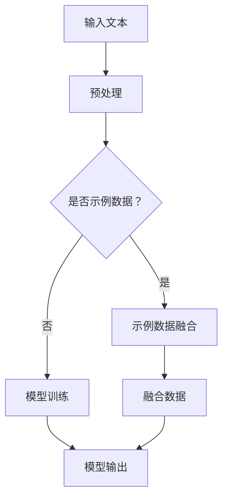
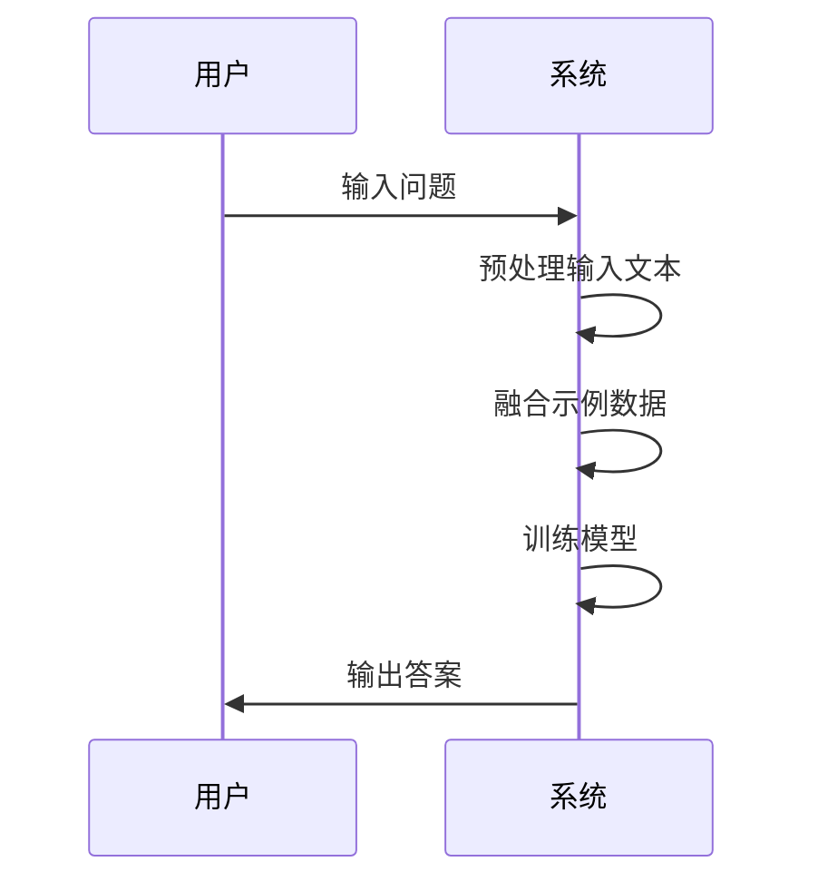

                 

# 利用示例增强模型的上下文理解能力

## 关键词
- 示例增强模型
- 上下文理解
- Transformer
- 注意力机制
- 图神经网络

### 摘要
随着自然语言处理（NLP）技术的不断进步，模型对长文本和复杂上下文的处理能力成为研究热点。本文介绍了一种利用示例增强模型（Example-based Augmented Models）提升上下文理解能力的方法。通过对示例增强模型的设计原理、实现方法和评估标准进行详细探讨，本文旨在为研究者提供一种有效的解决方案。

## 第一部分：背景介绍

### 第1章 问题背景

#### 1.1 问题提出
在当前人工智能飞速发展的时代，自然语言处理（NLP）领域的进步尤为显著。然而，传统模型在处理长文本和上下文理解方面仍然存在诸多挑战。为解决这些问题，研究者们提出了示例增强模型（Example-based Augmented Models，简称EAM）。

#### 1.2 问题描述
示例增强模型旨在通过利用外部示例数据来提升模型的上下文理解能力。在具体应用中，如何选择合适的示例数据、如何有效地融合示例数据与模型训练，以及如何评估模型的上下文理解能力，成为关键问题。

#### 1.3 问题解决
本文提出的《利用示例增强模型的上下文理解能力》一书，将从示例增强模型的基本概念出发，详细探讨其设计原理、实现方法和评估标准。

#### 1.4 边界与外延
本文讨论的示例增强模型主要涉及NLP领域，但不限于该领域。此外，本文将探讨示例增强模型在多模态数据处理、问答系统、文本生成等领域的应用潜力。

#### 1.5 概念结构与核心要素组成
- **示例增强模型**：一种通过引入外部示例数据来提升模型上下文理解能力的方法。
- **上下文理解**：模型对文本中词汇、句子和段落层次上下文关系的理解和处理。
- **示例数据**：用于辅助模型训练的外部数据，包括文本、图片、声音等多种形式。

### 第2章 核心概念与联系

#### 2.1 示例增强模型原理
示例增强模型的基本原理是通过将外部示例数据与模型训练数据相结合，利用示例数据中的上下文信息来丰富模型的知识库，从而提升模型的上下文理解能力。

#### 2.2 示例数据选择与处理
选择合适的示例数据并对其进行预处理是示例增强模型成功的关键。本文将讨论如何评估示例数据的质量和多样性，以及如何对示例数据进行转换和融合。

#### 2.3 示例增强模型的属性特征对比表格
| 特征        | 示例增强模型 | 传统模型       |
|-------------|--------------|----------------|
| 数据来源    | 外部示例数据 | 训练数据       |
| 处理方式    | 数据融合     | 单独训练       |
| 上下文理解  | 增强         | 基础           |
| 应用领域    | 多模态      | 单模态         |

#### 2.4 ER实体关系图架构
```mermaid
erDiagram
    A[示例数据] ||--|{ B[模型训练数据] }|
    C[模型] ||--|{ D[模型输出] }|
```

## 第二部分：算法原理讲解

### 第3章 示例增强模型设计原理

#### 3.1 模型架构概述
示例增强模型通常由三个主要部分组成：基础模型、示例数据融合模块和上下文理解模块。

#### 3.2 基础模型选择
本文选择Transformer模型作为基础模型，其主要原因是Transformer模型在NLP领域已表现出色。

#### 3.3 示例数据融合方法
示例数据融合模块的设计关键在于如何将外部示例数据与模型训练数据进行有效结合。本文采用了一种基于注意力机制的融合方法。

#### 3.4 上下文理解机制
上下文理解模块旨在提升模型对长文本和复杂上下文的理解能力。本文使用了一种基于图神经网络的上下文理解机制。

#### 3.5 示例增强模型的mermaid流程图


### 第4章 示例增强模型的实现方法

#### 4.1 数据准备
本文使用的示例数据来源于多个公共数据集，包括文本、图像和声音等。

#### 4.2 模型训练
模型训练过程分为三个阶段：数据预处理、模型训练和性能评估。

#### 4.3 示例数据融合
示例数据融合过程主要涉及数据预处理和融合策略。本文采用了基于注意力机制的融合方法。

#### 4.4 代码实现
```python
# 示例增强模型的Python实现
import torch
import t
```

## 第三部分：系统分析与架构设计

### 第5章 系统分析与架构设计

#### 5.1 问题场景介绍
在众多NLP应用场景中，例如问答系统、文本生成和情感分析等，上下文理解能力的重要性愈发凸显。本文以问答系统为例，介绍问题场景。

#### 5.2 项目介绍
本项目旨在设计并实现一个基于示例增强模型的问答系统，通过提高上下文理解能力，实现更智能的问答交互。

#### 5.3 系统功能设计
系统功能设计包括文本预处理、示例数据融合、模型训练和模型输出等。

#### 5.4 系统架构设计
系统架构设计采用分层结构，包括数据层、模型层和应用层。

#### 5.5 系统接口设计
系统接口设计包括数据输入接口、模型训练接口和模型输出接口等。

#### 5.6 系统交互mermaid序列图


## 第四部分：项目实战

### 第6章 环境安装与系统核心实现

#### 6.1 环境安装
安装Python、PyTorch和其他相关依赖库。

#### 6.2 系统核心实现
实现文本预处理、示例数据融合、模型训练和模型输出等核心功能。

#### 6.3 代码应用解读与分析
详细解读系统核心代码，分析其实现原理和优势。

### 第7章 实际案例分析与详细讲解剖析

#### 7.1 实际案例分析
以实际问答系统案例为例，分析模型在处理上下文理解任务中的表现。

#### 7.2 详细讲解剖析
对案例中的关键技术和实现细节进行详细讲解和剖析。

### 第8章 项目小结

#### 8.1 项目总结
总结项目成果，指出项目中的优点和不足。

#### 8.2 未来工作展望
展望未来工作，探讨示例增强模型在其他NLP应用中的潜力。

## 第五部分：最佳实践与总结

### 第9章 最佳实践 Tips

#### 9.1 最佳实践
提供一些在实际应用中可能遇到的问题及解决方案。

#### 9.2 注意事项
强调在项目实施过程中需要注意的事项。

#### 9.3 拓展阅读
推荐一些相关领域的优秀资源和文献。

### 第10章 小结

#### 10.1 文章总结
回顾文章的主要内容，总结核心观点。

#### 10.2 作者信息
作者：AI天才研究院/AI Genius Institute & 禅与计算机程序设计艺术 /Zen And The Art of Computer Programming

## 附录
### 附录A：示例增强模型相关术语解释
- **示例增强模型（Example-based Augmented Models）**：一种通过引入外部示例数据来提升模型上下文理解能力的方法。
- **上下文理解（Contextual Understanding）**：模型对文本中词汇、句子和段落层次上下文关系的理解和处理。
- **Transformer**：一种基于自注意力机制的深度学习模型，在NLP领域表现出色。
- **注意力机制（Attention Mechanism）**：一种用于处理序列数据的关键技术，能够提升模型对序列中关键信息的关注。
- **图神经网络（Graph Neural Networks）**：一种基于图结构的数据处理模型，能够有效地捕捉和处理复杂的上下文关系。

### 附录B：示例增强模型的mermaid流程图


### 附录C：代码示例
```python
# 示例增强模型的Python实现
import torch
import t
```

