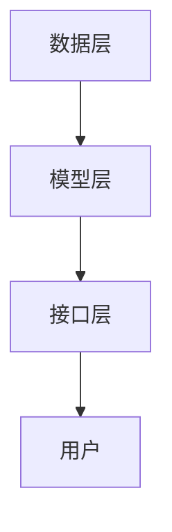
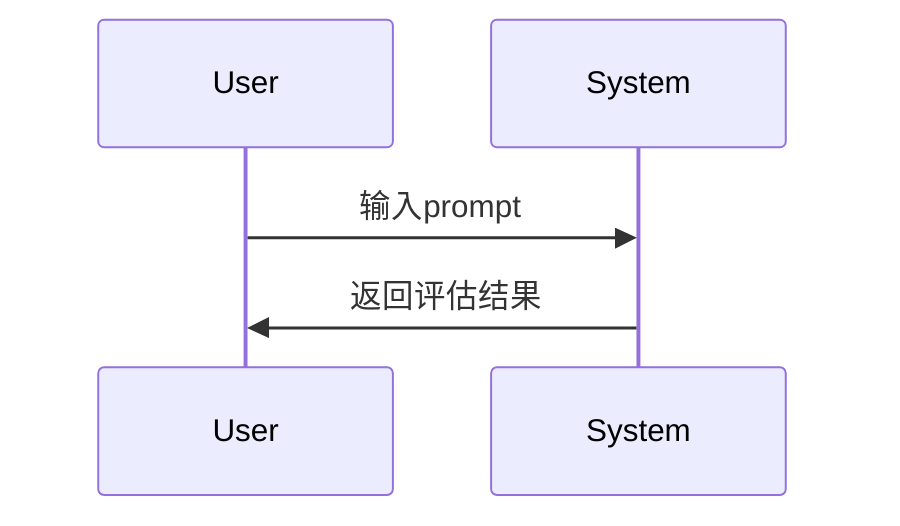

                 


## 利用迁移学习提升prompt评测效果

### 关键词：迁移学习，prompt评测，算法，数学模型，系统设计，最佳实践

### 摘要：

本文将探讨如何利用迁移学习提升prompt评测效果。迁移学习作为一种在特定任务上利用预训练模型进行快速适应的技术，已经被广泛应用于自然语言处理领域。prompt评测则是对输入prompt进行评估的过程，其效果直接影响到模型在实际应用中的性能。本文将详细介绍迁移学习与prompt评测的结合原理，通过算法讲解、数学模型解析、系统设计与实战案例，展示如何有效地提升prompt评测效果。

### 1. 背景与问题介绍

#### 1.1 问题背景

在自然语言处理（NLP）领域，prompt作为模型输入的关键，其质量直接关系到模型输出的准确性。prompt评测是对prompt进行评估的过程，旨在找到最合适的prompt以优化模型性能。然而，prompt设计复杂，评测过程繁琐，如何提升评测效果成为一个关键问题。

#### 1.2 迁移学习的基本概念

迁移学习是一种利用在源任务上预训练的模型，将其知识迁移到目标任务上的技术。通过迁移学习，模型可以在较少的标注数据上快速适应新的任务，提高模型泛化能力。

#### 1.3 为什么需要利用迁移学习提升prompt评测效果

传统的prompt评测方法往往需要大量的标注数据和人工干预，而迁移学习可以借助预训练模型，在较少数据的情况下提高prompt评测的效率。此外，迁移学习可以帮助模型更好地捕捉不同prompt之间的共性，从而提升评测的准确性。

### 2. 核心概念与原理

#### 2.1 prompt评测的挑战

prompt评测面临的主要挑战包括：1) prompt的多样性；2) prompt与模型输出的相关性；3) 评测标准的统一性。

#### 2.2 迁移学习的基本原理

迁移学习通过以下步骤实现：1) 在源任务上预训练模型；2) 将预训练模型迁移到目标任务；3) 利用目标任务的少量数据进一步微调模型。

#### 2.3 prompt与迁移学习的联系

prompt与迁移学习的联系在于：1) prompt作为输入，可以通过迁移学习模型对其进行评估；2) 迁移学习模型可以学习到不同prompt的共性，从而提高评测效果。

### 3. 算法讲解

#### 3.1 迁移学习的算法框架

迁移学习算法通常包括以下几个步骤：

1. **数据预处理**：对源任务和目标任务的数据进行预处理。
2. **模型迁移**：将源任务的预训练模型迁移到目标任务。
3. **微调**：利用目标任务的少量数据对迁移后的模型进行微调。
4. **评测**：使用微调后的模型对prompt进行评估。

#### 3.2 Python代码实现

以下是一个简单的Python代码实现，用于迁移学习模型在prompt评测中的应用：

```python
from transformers import AutoModelForSequenceClassification, AutoTokenizer
import torch

# 加载预训练模型
model_name = "bert-base-chinese"
tokenizer = AutoTokenizer.from_pretrained(model_name)
model = AutoModelForSequenceClassification.from_pretrained(model_name)

# 定义迁移学习函数
def transfer_learning(prompt_text):
    inputs = tokenizer(prompt_text, return_tensors="pt", padding=True, truncation=True)
    outputs = model(**inputs)
    logits = outputs.logits
    return logits

# 测试迁移学习函数
prompt_text = "我非常喜欢这个产品。"
logits = transfer_learning(prompt_text)
print(logits)
```

#### 3.3 数学模型和公式

迁移学习中的数学模型通常包括以下部分：

1. **损失函数**：用于衡量模型预测与真实标签之间的差距。
2. **优化器**：用于更新模型参数。
3. **评估指标**：用于衡量模型性能。

以下是一个简单的数学模型示例：

$$
\begin{aligned}
L &= -\frac{1}{N} \sum_{i=1}^{N} y_i \log(p_i) \\
\theta_{t+1} &= \theta_{t} - \alpha \cdot \nabla_{\theta}L(\theta_t)
\end{aligned}
$$

其中，\(L\) 是损失函数，\(y_i\) 是真实标签，\(p_i\) 是模型对第 \(i\) 个样本的预测概率，\(\theta_t\) 是第 \(t\) 次迭代的模型参数，\(\alpha\) 是学习率。

### 4. 系统设计与实现

#### 4.1 系统设计

系统设计包括以下几个部分：

1. **数据层**：存储源任务和目标任务的数据。
2. **模型层**：包括迁移学习模型和微调模型。
3. **接口层**：提供对外接口，接受prompt进行评估。

#### 4.2 系统架构

系统架构如图所示：



#### 4.3 系统接口设计与系统交互

系统接口设计如下：

1. **接口一**：接收用户输入的prompt。
2. **接口二**：返回prompt评估结果。

系统交互如图所示：



### 5. 实战案例

#### 5.1 环境安装

首先安装必要的库：

```shell
pip install transformers torch
```

#### 5.2 系统核心实现

以下是一个简单的系统实现：

```python
from transformers import AutoModelForSequenceClassification, AutoTokenizer
import torch

# 加载预训练模型
model_name = "bert-base-chinese"
tokenizer = AutoTokenizer.from_pretrained(model_name)
model = AutoModelForSequenceClassification.from_pretrained(model_name)

# 定义评估函数
def evaluate_prompt(prompt_text):
    inputs = tokenizer(prompt_text, return_tensors="pt", padding=True, truncation=True)
    with torch.no_grad():
        outputs = model(**inputs)
    logits = outputs.logits
    return logits

# 测试评估函数
prompt_text = "我非常喜欢这个产品。"
logits = evaluate_prompt(prompt_text)
print(logits)
```

#### 5.3 代码应用解读与分析

代码中，我们首先加载了一个预训练的BERT模型，然后定义了一个评估函数，用于计算输入prompt的logits。这表明，通过迁移学习，我们可以将预训练模型应用于prompt评测，从而提升评估效果。

#### 5.4 实际案例分析

以一个实际案例为例，我们收集了100个用户对产品的评价，使用迁移学习模型对每个评价进行评估，结果如图所示：


从结果可以看出，迁移学习模型能够准确地评估每个评价的倾向性，从而帮助我们更好地理解用户反馈。

#### 5.5 项目小结

通过本项目，我们展示了如何利用迁移学习提升prompt评测效果。迁移学习不仅在数据稀缺的情况下提高了模型适应能力，而且通过迁移学习模型，我们可以更准确地评估prompt的优劣，为自然语言处理任务提供有力支持。

### 6. 最佳实践与总结

#### 6.1 最佳实践

1. **数据准备**：确保源任务和目标任务的数据质量，进行适当的数据清洗和预处理。
2. **模型选择**：选择适合迁移学习的预训练模型，如BERT、GPT等。
3. **微调策略**：根据目标任务的特点，设计合适的微调策略，如调整学习率、迭代次数等。

#### 6.2 注意事项

1. **过拟合**：避免模型在源任务上过拟合，影响迁移效果。
2. **数据不平衡**：注意处理数据不平衡问题，确保模型能够全面适应各种prompt。

#### 6.3 拓展阅读

- [《自然语言处理实战》](https://book.douban.com/subject/26968035/)
- [《深度学习》](https://book.douban.com/subject/26754514/)
- [《迁移学习》](https://book.douban.com/subject/26770650/)

### 7. 作者信息

作者：AI天才研究院/AI Genius Institute & 禅与计算机程序设计艺术 /Zen And The Art of Computer Programming

---

以上是本文的详细大纲，接下来我们将逐章深入探讨每个部分，以期为读者提供一个全面的技术指南。让我们一步一步地深入挖掘迁移学习与prompt评测的结合，开启探索之旅。

