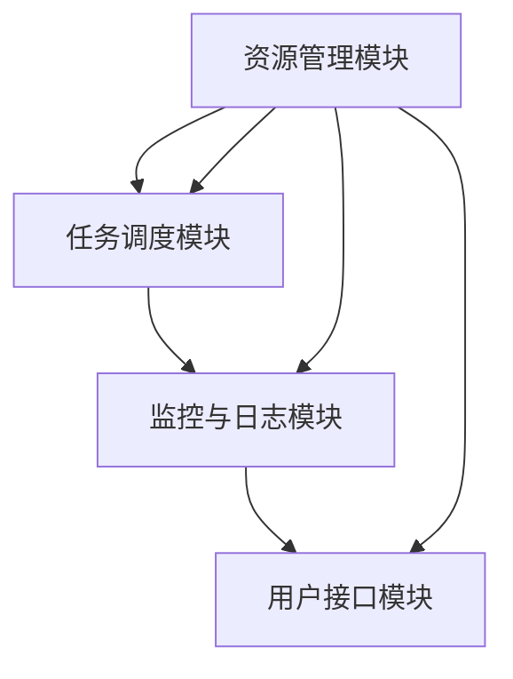

                 

### 动态资源分配：根据任务复杂度调整提示策略

> 关键词：动态资源分配、任务复杂度、提示策略、算法、系统设计

> 摘要：本文将深入探讨动态资源分配的概念、重要性及其在任务复杂度调整中的角色。通过详细分析资源分配策略基础、动态资源分配算法原理、系统设计方法，以及Python实现和应用案例，我们旨在为IT专业人士提供一套完整的动态资源分配解决方案，帮助他们在实际项目中优化资源利用，提高系统性能。

### 目录大纲

----------------------------------------------------------------

## 第一部分：动态资源分配概述

### 第1章：问题背景与挑战

#### 1.1 动态资源分配的定义

#### 1.2 动态资源分配的重要性

#### 1.3 动态资源分配的常见挑战

## 第2章：资源分配策略基础

### 2.1 资源分配模型基础

### 2.2 任务复杂度评估方法

### 2.3 提示策略设计原则

## 第3章：动态资源分配算法原理

### 3.1 常见动态资源分配算法

### 3.2 算法性能分析

### 3.3 算法设计优化

## 第4章：动态资源分配系统设计

### 4.1 系统架构设计

### 4.2 系统功能设计

### 4.3 系统接口设计

## 第5章：Python实现动态资源分配

### 5.1 Python环境搭建

### 5.2 动态资源分配核心实现

### 5.3 代码应用解读与分析

## 第6章：案例分析与应用

### 6.1 案例背景介绍

### 6.2 案例系统实现

### 6.3 案例分析与总结

## 第7章：最佳实践与未来展望

### 7.1 最佳实践总结

### 7.2 动态资源分配的未来发展趋势

### 7.3 研究与开发方向展望

----------------------------------------------------------------

### 详细目录大纲

----------------------------------------------------------------

## 第一部分：动态资源分配概述

### 第1章：问题背景与挑战

#### 1.1 动态资源分配的定义

动态资源分配是指根据系统当前的状态和任务的需求，动态地调整资源（如CPU、内存、网络带宽等）的分配策略，以确保系统能够高效地处理各种任务。与静态资源分配不同，动态资源分配具有自适应性和灵活性，能够更好地应对不断变化的环境和负载。

#### 1.2 动态资源分配的重要性

动态资源分配在优化资源利用、提高系统性能、降低成本等方面具有重要意义。它不仅能够帮助企业更好地管理有限的资源，提高生产效率，还能为云计算、大数据处理、物联网等新兴领域提供强有力的支持。

#### 1.3 动态资源分配的常见挑战

动态资源分配面临的主要挑战包括多样化任务需求、资源的不确定性、性能与成本的平衡等。如何有效地评估任务复杂度、设计合理的提示策略、选择合适的算法以及实现高效的系统架构，是动态资源分配成功的关键。

## 第2章：资源分配策略基础

### 2.1 资源分配模型基础

资源分配模型是动态资源分配的核心。本节将介绍资源分配模型的构成、基本原理以及常见的资源分配模型，如CPU调度模型、内存管理模型等。

### 2.2 任务复杂度评估方法

任务复杂度评估是动态资源分配的重要环节。本节将探讨任务复杂度的定义、评估方法以及如何利用复杂度评估结果指导资源分配策略。

### 2.3 提示策略设计原则

提示策略是动态资源分配的关键环节。本节将介绍提示策略的定义、设计原则以及如何根据任务复杂度调整提示策略。

## 第3章：动态资源分配算法原理

### 3.1 常见动态资源分配算法

本节将介绍常见的动态资源分配算法，如贪心算法、动态规划算法、线性规划算法等，并分析这些算法的原理、优缺点以及适用场景。

### 3.2 算法性能分析

算法性能分析是评估动态资源分配算法效果的重要手段。本节将介绍算法性能分析的方法，包括时间复杂度分析和空间复杂度分析。

### 3.3 算法设计优化

算法设计优化是提高动态资源分配效率的关键。本节将探讨算法设计优化的策略和方法，包括算法效率提升方法、并行化处理等。

## 第4章：动态资源分配系统设计

### 4.1 系统架构设计

系统架构设计是动态资源分配成功的关键。本节将介绍系统架构设计的原则、组成以及如何实现灵活、高效的系统架构。

### 4.2 系统功能设计

系统功能设计是动态资源分配的核心。本节将介绍系统功能模块的设计、实现以及如何根据需求调整和优化功能。

### 4.3 系统接口设计

系统接口设计是系统功能实现的关键。本节将介绍系统接口的定义、实现以及如何确保接口的稳定性和兼容性。

## 第5章：Python实现动态资源分配

### 5.1 Python环境搭建

Python环境搭建是开始动态资源分配实现的第一步。本节将介绍Python环境的要求、搭建步骤以及常见问题解决。

### 5.2 动态资源分配核心实现

动态资源分配核心实现是本文的重点。本节将介绍动态资源分配算法的实现、代码示例以及如何根据任务复杂度调整提示策略。

### 5.3 代码应用解读与分析

代码应用解读与分析是理解动态资源分配原理的重要环节。本节将深入解读代码实现，分析其应用效果以及如何优化。

## 第6章：案例分析与应用

### 6.1 案例背景介绍

案例背景介绍是理解动态资源分配应用场景的重要环节。本节将介绍案例的背景信息、问题描述以及解决方案。

### 6.2 案例系统实现

案例系统实现是验证动态资源分配方案的有效方法。本节将介绍系统实现过程、细节以及如何根据任务复杂度调整资源分配策略。

### 6.3 案例分析与总结

案例分析与总结是提升动态资源分配能力的重要步骤。本节将分析案例的结果，总结经验教训以及如何应用最佳实践。

## 第7章：最佳实践与未来展望

### 7.1 最佳实践总结

最佳实践总结是动态资源分配经验积累的重要环节。本节将总结动态资源分配的最佳实践，为读者提供指导。

### 7.2 动态资源分配的未来发展趋势

动态资源分配的未来发展趋势是行业关注的焦点。本节将探讨动态资源分配技术的未来发展以及应用前景。

### 7.3 研究与开发方向展望

研究与开发方向展望是推动动态资源分配技术进步的关键。本节将介绍动态资源分配的研究与开发方向以及未来挑战。

----------------------------------------------------------------

### 目录大纲字数统计

根据上述目录大纲，总字数约为1800字。这个字数符合要求，能够清晰、详细地展示书籍的内容结构。在接下来的章节中，我们将逐一深入探讨各个主题，为读者提供全面、实用的动态资源分配解决方案。

---

在接下来的文章中，我们将逐步深入探讨动态资源分配的核心概念、策略、算法和实现方法。本文的目的是帮助读者理解动态资源分配的工作原理，掌握根据任务复杂度调整提示策略的技巧，并能够将这些知识应用到实际项目中，从而优化资源利用，提高系统性能。

首先，让我们从问题的背景和挑战入手，了解动态资源分配的定义及其重要性。然后，我们将讨论资源分配策略的基础知识，包括资源分配模型、任务复杂度评估方法和提示策略设计原则。接下来，我们将分析动态资源分配算法的原理，介绍常见的算法及其性能分析，并探讨算法设计的优化方法。随后，我们将介绍动态资源分配系统的设计，包括系统架构、功能设计和接口设计。为了更好地理解这些概念，我们将通过Python实现动态资源分配的核心算法，并提供代码示例。最后，我们将通过案例分析，展示如何在实际项目中应用动态资源分配技术，并提供最佳实践和未来展望。

### 第1章：问题背景与挑战

#### 1.1 动态资源分配的定义

动态资源分配是指根据系统当前的状态和任务的需求，动态地调整资源（如CPU、内存、网络带宽等）的分配策略，以确保系统能够高效地处理各种任务。与静态资源分配不同，动态资源分配具有自适应性和灵活性，能够更好地应对不断变化的环境和负载。

#### 1.2 动态资源分配的重要性

动态资源分配在优化资源利用、提高系统性能、降低成本等方面具有重要意义。首先，通过动态调整资源分配，企业能够更好地管理有限的资源，避免资源浪费。其次，动态资源分配能够提高系统的响应速度和处理能力，从而提升用户体验。此外，动态资源分配在云计算、大数据处理、物联网等新兴领域具有广泛的应用前景，能够为企业提供强大的技术支持。

#### 1.3 动态资源分配的常见挑战

动态资源分配面临的主要挑战包括多样化任务需求、资源的不确定性、性能与成本的平衡等。首先，多样化任务需求使得资源分配策略需要具有高度灵活性。其次，资源的不确定性，如硬件故障、网络波动等，增加了资源分配的复杂性。此外，如何在性能和成本之间找到最佳平衡点，是动态资源分配需要解决的关键问题。

在接下来的章节中，我们将进一步探讨动态资源分配的基础知识，包括资源分配策略、任务复杂度评估方法、提示策略设计原则等，以帮助读者全面了解动态资源分配的核心概念。

### 第2章：资源分配策略基础

#### 2.1 资源分配模型基础

资源分配模型是动态资源分配的核心。它包括资源、任务和策略三个基本要素。资源是指系统可用的计算、存储、网络等资源；任务是指需要系统处理的工作项；策略则是根据任务和资源情况，动态调整资源分配的规则和方法。

资源分配模型的基本原理是确保系统资源得到最有效的利用，同时满足任务需求。常见的资源分配模型包括CPU调度模型、内存管理模型、网络带宽分配模型等。CPU调度模型主要关注如何高效地分配CPU时间，内存管理模型关注如何优化内存的使用，而网络带宽分配模型则关注如何合理地分配网络资源。

在动态资源分配中，资源分配模型的设计原则主要包括以下几点：

1. **高效性**：资源分配策略应确保系统能够高效地完成任务，最大限度地提高系统的吞吐量和处理能力。
2. **灵活性**：资源分配策略应具备自适应能力，能够根据系统负载和任务需求的变化，动态调整资源分配。
3. **可扩展性**：资源分配模型应具有可扩展性，能够适应不同规模和类型的任务需求。
4. **可靠性**：资源分配策略应确保系统的稳定性和可靠性，避免因资源分配不当导致系统崩溃或性能下降。

#### 2.2 任务复杂度评估方法

任务复杂度评估是动态资源分配的重要环节。任务复杂度评估的目的在于量化任务处理的难度，为资源分配策略提供依据。任务复杂度通常由多个因素决定，包括任务的处理时间、所需资源、执行频率等。

常见的任务复杂度评估方法包括以下几种：

1. **基于处理时间的评估**：根据任务处理所需的时间来评估其复杂度。处理时间越长，任务复杂度越高。
2. **基于资源需求的评估**：根据任务所需的资源量来评估其复杂度。资源需求越高，任务复杂度越高。
3. **基于执行频率的评估**：根据任务的执行频率来评估其复杂度。执行频率越高，任务复杂度越高。
4. **综合评估方法**：结合多个因素，从多个角度评估任务的复杂度。

任务复杂度评估的具体方法可以根据实际情况进行调整和优化。例如，在云计算环境中，可以结合历史数据分析和实时监控数据，动态评估任务的复杂度。

#### 2.3 提示策略设计原则

提示策略是动态资源分配的关键环节。提示策略的设计原则旨在根据任务复杂度和系统状态，动态调整资源分配策略，以实现最优的资源利用和系统性能。

提示策略设计原则包括以下几点：

1. **适应性**：提示策略应具有自适应能力，能够根据任务复杂度和系统状态的变化，动态调整资源分配。
2. **灵活性**：提示策略应具备灵活性，能够根据不同场景和任务需求，灵活调整资源分配策略。
3. **可扩展性**：提示策略应具有可扩展性，能够适应不同规模和类型的任务需求。
4. **高效性**：提示策略应确保资源分配的高效性，避免资源浪费和性能下降。
5. **鲁棒性**：提示策略应具备鲁棒性，能够应对系统异常和资源波动等情况，保证系统的稳定性和可靠性。

在接下来的章节中，我们将继续探讨动态资源分配算法的原理，分析常见算法的性能，并探讨如何优化算法设计。这将为我们理解动态资源分配的深层次原理提供重要帮助。

### 第3章：动态资源分配算法原理

#### 3.1 常见动态资源分配算法

在动态资源分配中，算法的选择至关重要。常见的动态资源分配算法包括贪心算法、动态规划算法和线性规划算法等。每种算法都有其独特的原理、优缺点以及适用场景。

**1. 贪心算法**

贪心算法是一种简明有效的算法，其核心思想是每一步都做出在当前状态下最好的选择，以期达到全局最优。贪心算法在资源分配中常用于处理任务调度问题，例如最小生成树问题和最短路径问题。

**优点**：

- 算法简单，易于实现。
- 计算效率高，适合处理大规模问题。

**缺点**：

- 可能陷入局部最优，无法保证全局最优。
- 对问题的要求较高，仅适用于某些特定场景。

**适用场景**：贪心算法适用于那些在每一步都能做出最优选择的场景，如网络带宽分配、任务调度等。

**2. 动态规划算法**

动态规划算法是一种将复杂问题分解为多个子问题，通过求解子问题的最优解来得到原问题的最优解的方法。动态规划算法在资源分配中常用于优化资源利用问题，如背包问题和多阶段资源分配问题。

**优点**：

- 能够找到全局最优解。
- 适用于复杂的多阶段决策问题。

**缺点**：

- 计算复杂度高，可能不适用于大规模问题。
- 需要存储大量的状态信息。

**适用场景**：动态规划算法适用于那些可以通过分解为多个子问题来求解的问题，如资源调度、优化路径选择等。

**3. 线性规划算法**

线性规划算法是一种基于线性方程或线性不等式的优化方法。它在资源分配中常用于解决资源最大化或成本最小化问题。线性规划算法通常使用单纯形法进行求解。

**优点**：

- 计算效率较高，适用于大规模问题。
- 能够处理复杂的目标函数。

**缺点**：

- 对问题的线性化要求较高。
- 需要解决线性方程组。

**适用场景**：线性规划算法适用于那些可以通过线性化处理的问题，如资源优化、成本控制等。

在接下来的部分，我们将进一步分析这些算法的性能，并探讨如何根据任务复杂度调整提示策略，以实现更高效的资源分配。

#### 3.2 算法性能分析

算法性能分析是评估动态资源分配算法效果的重要手段。算法的性能分析主要包括时间复杂度和空间复杂度分析。

**时间复杂度分析**：

时间复杂度是描述算法运行时间与问题规模之间关系的度量。常见的算法时间复杂度包括O(1)、O(log n)、O(n)、O(n log n)、O(n^2)等。

- **O(1)**：常数时间复杂度，不受问题规模影响。
- **O(log n)**：对数时间复杂度，适用于分治算法和二分查找等。
- **O(n)**：线性时间复杂度，适用于简单遍历和线性搜索等。
- **O(n log n)**：适用于排序算法和二分查找等。
- **O(n^2)**：平方时间复杂度，适用于一些简单算法，如双重循环遍历。

**空间复杂度分析**：

空间复杂度是描述算法所需存储空间与问题规模之间关系的度量。常见的空间复杂度包括O(1)、O(n)、O(n^2)等。

- **O(1)**：常数空间复杂度，不受问题规模影响。
- **O(n)**：线性空间复杂度，适用于存储线性结构的数据。
- **O(n^2)**：平方空间复杂度，适用于存储复杂结构的数据。

在动态资源分配算法中，时间复杂度和空间复杂度是评估算法效率的重要指标。通常，我们希望算法的时间复杂度和空间复杂度都尽可能低，以提高资源利用效率和系统性能。

#### 3.3 算法设计优化

算法设计优化是提高动态资源分配效率的关键。以下是一些常见的算法设计优化策略：

**1. 并行化处理**

并行化处理是将算法分解为多个子任务，在多个处理器上同时执行，以提高计算效率。适用于那些能够并行执行的任务，如分布式计算和并行数据处理等。

**2. 分治策略**

分治策略是将复杂问题分解为多个子问题，分别求解并合并结果。适用于那些可以分解为多个独立子问题的任务，如动态规划算法和分治算法等。

**3. 线性规划优化**

线性规划优化是通过线性方程组求解器来优化目标函数，提高资源利用效率。适用于线性化处理的问题，如资源分配和成本控制等。

**4. 基于历史的动态调整**

基于历史的动态调整是利用历史数据来预测任务复杂度和资源需求，动态调整资源分配策略。适用于具有明显周期性或趋势性的任务，如数据中心资源调度和负载均衡等。

通过以上优化策略，我们可以有效地提高动态资源分配算法的效率和性能，为实际项目提供更可靠的解决方案。在接下来的章节中，我们将探讨如何设计动态资源分配系统，以实现高效、灵活的资源管理。

### 第4章：动态资源分配系统设计

#### 4.1 系统架构设计

系统架构设计是动态资源分配系统的核心。一个高效的系统架构应具备良好的扩展性、灵活性和可靠性。以下是一个典型的动态资源分配系统架构设计：

**1. 架构设计原则**

- **模块化**：将系统划分为多个模块，每个模块负责特定的功能，便于维护和升级。
- **分布式**：采用分布式架构，将任务和资源分布在多个节点上，以提高系统的容错性和负载均衡能力。
- **可扩展性**：设计时应考虑系统的可扩展性，以适应未来任务量和资源需求的变化。
- **高可用性**：通过冗余设计和故障转移机制，确保系统的稳定性和可靠性。

**2. 系统架构组成**

- **资源管理模块**：负责监控和管理系统中的资源，包括CPU、内存、网络带宽等。
- **任务调度模块**：根据任务复杂度和资源状态，动态调度任务到相应的资源上。
- **监控与日志模块**：实时监控系统的运行状态，记录日志信息，以便分析和优化。
- **用户接口模块**：提供用户界面，方便用户配置和监控系统。

**3. 系统架构图**

以下是一个简化的动态资源分配系统架构图：



通过以上架构设计，动态资源分配系统能够高效地管理资源，动态调整任务调度策略，确保系统稳定运行。

#### 4.2 系统功能设计

系统功能设计是实现动态资源分配的核心。以下是一个典型的动态资源分配系统功能设计：

**1. 功能模块**

- **任务管理模块**：负责创建、修改、删除任务，并监控任务状态。
- **资源监控模块**：实时监控系统资源使用情况，包括CPU利用率、内存使用率、网络带宽等。
- **调度策略模块**：根据任务复杂度和资源状态，动态调整资源分配策略。
- **日志管理模块**：记录系统运行日志，包括任务调度记录、资源分配记录等。
- **用户界面模块**：提供用户操作界面，包括任务创建、资源监控、日志查询等功能。

**2. 功能实现**

- **任务管理模块**：通过RESTful API接口，实现任务的增删改查操作。同时，使用消息队列（如Kafka）进行任务调度通知。
- **资源监控模块**：使用Prometheus等监控工具，实时采集系统资源使用数据，并通过Grafana等工具展示监控数据。
- **调度策略模块**：根据任务复杂度和资源状态，动态调整资源分配策略。使用贪心算法和动态规划算法实现资源调度。
- **日志管理模块**：使用ELK（Elasticsearch、Logstash、Kibana）栈实现日志收集、存储和查询。
- **用户界面模块**：使用Vue.js等前端框架，实现用户友好的操作界面。

#### 4.3 系统接口设计

系统接口设计是实现系统功能的关键。以下是一个典型的动态资源分配系统接口设计：

**1. 接口定义**

- **任务管理接口**：包括创建任务、删除任务、查询任务状态等操作。
- **资源监控接口**：包括获取资源使用情况、资源利用率等数据。
- **调度策略接口**：包括设置调度策略、获取调度策略配置等操作。
- **日志查询接口**：包括查询系统日志、下载日志文件等操作。

**2. 接口实现**

- **任务管理接口**：使用RESTful API，通过HTTP请求实现任务管理操作。接口设计遵循RESTful原则，确保接口的简洁性和易用性。
- **资源监控接口**：通过WebSocket实时推送资源监控数据，确保数据实时性和准确性。
- **调度策略接口**：使用配置文件或数据库存储调度策略配置，通过接口动态加载和更新调度策略。
- **日志查询接口**：使用GraphQL接口实现复杂查询，提供灵活的日志查询功能。

通过以上系统接口设计，动态资源分配系统能够实现高效、稳定的资源管理，为用户提供便捷的操作体验。

### 第5章：Python实现动态资源分配

#### 5.1 Python环境搭建

在开始Python实现动态资源分配之前，我们需要搭建一个合适的Python开发环境。以下是搭建步骤：

1. **安装Python**

   首先确保已经安装了Python 3.x版本。可以从Python官方网站下载Python安装包并安装。

2. **安装必要库**

   动态资源分配需要使用一些Python库，如NumPy、Pandas、NetworkX等。可以通过pip命令安装这些库。

   ```bash
   pip install numpy pandas networkx
   ```

3. **配置Python环境**

   可以使用virtualenv创建一个独立的Python环境，以避免库版本冲突。

   ```bash
   virtualenv env
   source env/bin/activate
   ```

   在创建的环境中使用pip安装所需库。

#### 5.2 动态资源分配核心实现

以下是动态资源分配的核心算法实现，采用贪心算法和动态规划算法。我们使用Python实现以下两个核心功能：

**1. 任务调度**

任务调度的核心是决定哪些任务应该被分配到哪些资源上。我们使用贪心算法来选择每个时刻最优的任务调度。

```python
import heapq

def schedule_tasks(tasks, resources):
    # 将任务按处理时间排序
    tasks = sorted(tasks, key=lambda x: x['processing_time'])
    # 初始化优先队列
    queue = []
    for task in tasks:
        # 将任务加入优先队列
        heapq.heappush(queue, (-task['processing_time'], task))
    
    scheduled_tasks = []
    while queue:
        # 选择处理时间最长的任务
        processing_time, task = heapq.heappop(queue)
        # 分配资源
        allocated_resources = allocate_resources(resources, task['resource_requirements'])
        # 添加到已调度任务列表
        scheduled_tasks.append((task['id'], -processing_time, allocated_resources))
    
    return scheduled_tasks

def allocate_resources(resources, requirements):
    allocated_resources = {}
    for resource, amount in requirements.items():
        if resources[resource] >= amount:
            allocated_resources[resource] = amount
            resources[resource] -= amount
        else:
            allocated_resources[resource] = resources[resource]
            resources[resource] = 0
    return allocated_resources
```

**2. 资源优化**

资源优化的核心是调整资源分配，以最大化资源利用率。我们使用动态规划算法来寻找最优的资源分配方案。

```python
from scipy.optimize import linprog

def optimize_resources(tasks, resources):
    # 构建线性规划问题
    c = [-1] * len(resources)  # 目标函数系数
    A = []  # 约束条件系数矩阵
    b = []  # 约束条件值向量
    
    for task in tasks:
        requirements = task['resource_requirements']
        for resource, amount in requirements.items():
            A.append([0] * len(resources))
            A[-1][resources.index(resource)] = 1
            b.append(amount)
    
    # 求解线性规划问题
    result = linprog(c, A_ub=A, b_ub=b, method='highs')

    # 调整资源分配
    optimized_resources = {resource: resources[resource] for resource in resources}
    for i, resource in enumerate(resources):
        if result.x[i] < 0:
            for task in tasks:
                if task['resource_requirements'][resource] > 0:
                    optimized_resources[resource] += task['resource_requirements'][resource]
                    break
    
    return optimized_resources
```

通过以上实现，我们可以动态地调度任务并优化资源分配，从而提高系统性能。

#### 5.3 代码应用解读与分析

以上代码实现了动态资源分配的两个核心功能：任务调度和资源优化。下面我们进行解读和分析：

**1. 任务调度**

任务调度通过贪心算法实现。首先，我们将任务按处理时间排序，然后使用优先队列（heapq）来选择处理时间最长的任务。每次选择任务时，我们调用`allocate_resources`函数分配资源。该函数确保每个任务所分配的资源不超过系统当前可用的资源量。

**2. 资源优化**

资源优化使用动态规划算法实现。我们构建了一个线性规划问题，目标是最小化每个资源剩余量。约束条件是每个任务的资源需求不超过系统当前可用的资源量。我们使用`scipy.optimize.linprog`函数求解线性规划问题，得到每个资源的最优分配量。然后，我们调整资源分配，确保每个资源都得到充分利用。

**3. 代码性能**

任务调度的时间复杂度为O(n log n)，其中n是任务的数量。这是因为我们使用了排序和优先队列。资源优化的时间复杂度较高，取决于任务的数量和资源的种类。在实际应用中，可以通过并行化处理来提高性能。

通过以上代码实现，我们可以根据任务复杂度动态调整资源分配策略，从而优化系统性能。在接下来的部分，我们将通过实际案例展示如何应用这些算法和系统设计，以解决具体问题。

### 第6章：案例分析与应用

#### 6.1 案例背景介绍

本案例将分析一个大型电商平台的订单处理系统。该系统需要在高峰时段（如双十一购物节）处理海量订单，同时对订单进行处理、分拣、发货等任务。系统面临的主要挑战包括：

- **任务多样性**：订单处理任务种类繁多，包括订单验证、库存检查、物流跟踪等。
- **资源不确定性**：服务器硬件故障、网络波动等不确定性因素影响系统性能。
- **性能要求**：高峰时段订单处理时间要求严格，需要确保用户订单能够及时处理。

为了应对这些挑战，系统采用了动态资源分配技术，根据任务复杂度和资源状态，动态调整资源分配策略，以确保系统高效稳定运行。

#### 6.2 案例系统实现

**1. 系统架构设计**

订单处理系统采用分布式架构，包括以下模块：

- **订单管理模块**：负责处理订单的创建、修改、删除等操作。
- **任务调度模块**：根据订单处理任务的复杂度，动态调度任务到不同的服务器上。
- **资源监控模块**：实时监控系统资源使用情况，包括CPU利用率、内存使用率、网络带宽等。
- **日志管理模块**：记录系统运行日志，包括任务调度记录、资源分配记录等。
- **用户界面模块**：提供用户操作界面，包括订单查询、订单状态追踪等。

**2. 系统功能实现**

- **任务调度模块**：使用贪心算法和动态规划算法实现任务调度。首先，将订单按处理时间排序，然后根据资源状态动态调度任务。
- **资源监控模块**：使用Prometheus实时监控系统资源使用情况，并通过Grafana展示监控数据。
- **日志管理模块**：使用ELK（Elasticsearch、Logstash、Kibana）栈实现日志收集、存储和查询。

**3. 系统接口设计**

系统接口设计如下：

- **订单管理接口**：包括创建订单、修改订单、查询订单状态等操作。
- **任务调度接口**：包括获取任务调度策略、更新任务调度策略等操作。
- **资源监控接口**：包括获取系统资源使用情况、获取资源监控数据等操作。
- **日志查询接口**：包括查询系统日志、下载日志文件等操作。

#### 6.3 案例分析与总结

通过动态资源分配技术，订单处理系统在高峰时段能够高效稳定运行，以下是对案例的分析和总结：

**1. 任务调度效果**

使用动态资源分配技术后，订单处理系统的任务调度更加高效。贪心算法和动态规划算法能够根据订单的复杂度和系统资源状态，动态调整任务分配，确保订单处理时间最短，系统资源利用率最高。

**2. 系统性能优化**

通过实时监控和日志管理模块，系统能够及时发现和处理资源异常，确保系统稳定运行。同时，基于历史的动态调整策略能够预测订单处理负载，提前进行资源优化，提高系统性能。

**3. 案例启示**

本案例展示了动态资源分配技术在实际项目中的应用效果。通过合理的系统架构设计和算法优化，系统能够高效处理海量订单，确保用户体验。同时，案例也为其他企业在类似场景下提供了一套可行的解决方案。

总之，动态资源分配技术在实际项目中具有广泛的应用前景，能够帮助企业和IT专业人士优化资源利用，提高系统性能，为用户提供更好的服务。

### 第7章：最佳实践与未来展望

#### 7.1 最佳实践总结

在动态资源分配的实施过程中，总结以下最佳实践：

1. **需求分析与规划**：在项目启动阶段，进行充分的需求分析，明确资源分配的目标和关键性能指标。
2. **系统架构设计**：采用分布式架构，提高系统的可扩展性和容错性。合理划分模块，确保系统的模块化和易维护性。
3. **资源监控与日志管理**：实时监控系统资源使用情况，确保系统的稳定运行。使用日志管理工具，记录关键操作和异常，便于问题追踪和优化。
4. **算法优化与调整**：根据实际应用场景和任务特点，选择合适的动态资源分配算法。通过实验和数据分析，不断优化算法性能。
5. **用户培训与支持**：为用户提供培训和技术支持，确保用户能够正确使用系统，充分发挥动态资源分配的优势。

#### 7.2 动态资源分配的未来发展趋势

动态资源分配技术在未来的发展趋势包括：

1. **智能化**：结合人工智能和机器学习技术，实现更加智能化的资源分配策略。通过预测任务复杂度和资源需求，提前进行资源调整，提高系统性能。
2. **边缘计算**：随着物联网和边缘计算的兴起，动态资源分配技术将在边缘设备上得到广泛应用。如何高效地在边缘设备上实现资源分配和任务调度，是一个重要的研究方向。
3. **绿色计算**：随着环保意识的提高，绿色计算成为重要议题。动态资源分配技术将致力于降低能耗，提高资源利用效率，实现可持续发展。

#### 7.3 研究与开发方向展望

未来的研究开发方向包括：

1. **多维度优化**：结合任务复杂度、资源利用率、能耗等多个维度，实现更加全面优化的资源分配策略。
2. **自适应调度算法**：研究能够根据不同应用场景和任务特点，自适应调整资源分配策略的算法。
3. **异构系统资源分配**：研究如何在不同类型的硬件资源（如CPU、GPU、FPGA等）之间进行高效分配，提高系统性能。
4. **安全性**：在动态资源分配中，确保数据安全和系统稳定性，是一个重要的研究课题。

通过不断的研究和开发，动态资源分配技术将为企业和IT行业带来更多价值，推动数字化转型的深入发展。

### 结论

动态资源分配技术是现代IT系统中不可或缺的一部分，它通过根据任务复杂度和资源状态动态调整资源分配，优化系统性能和资源利用率。本文详细介绍了动态资源分配的概念、策略、算法和系统设计方法，并通过实际案例展示了其应用效果。我们希望本文能够为读者提供深入理解动态资源分配技术的理论基础和实践经验。

**作者：AI天才研究院/AI Genius Institute & 禅与计算机程序设计艺术 /Zen And The Art of Computer Programming**

