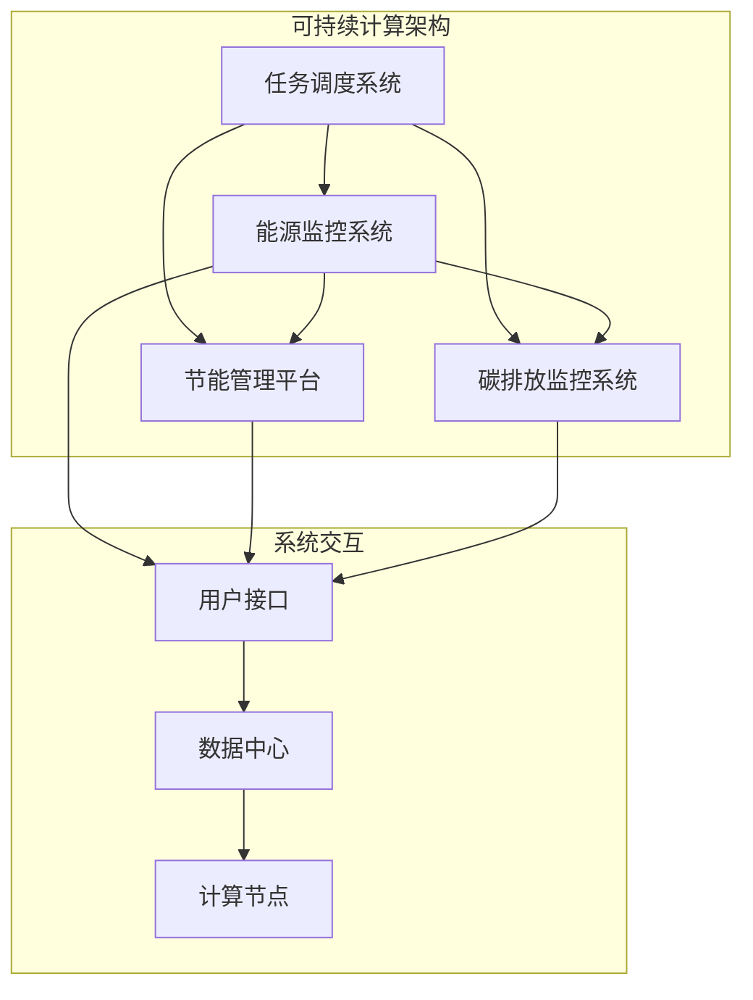
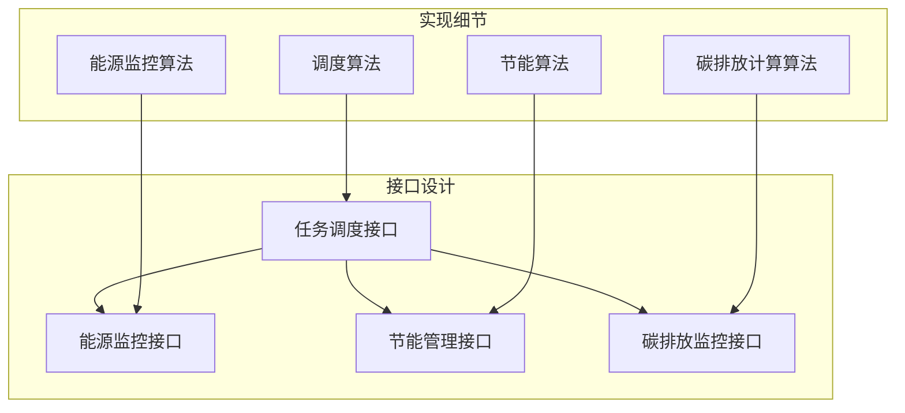
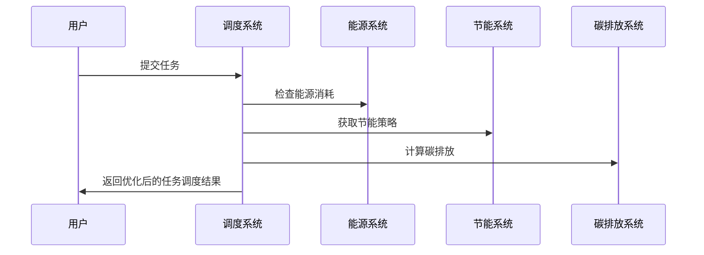
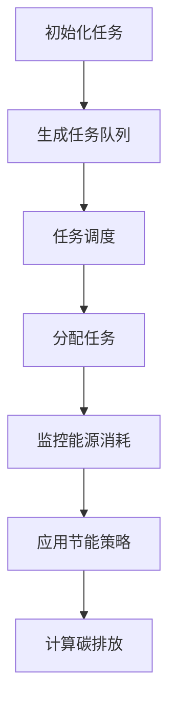

                 

## 可持续计算：IT行业应对气候变化的新方向

### 关键词
- 可持续计算
- IT行业
- 气候变化
- 绿色算法
- 能源效率
- 系统架构设计

### 摘要
本文深入探讨了可持续计算在IT行业中的应用及其重要性。我们首先介绍了可持续计算的概念，随后分析了当前IT行业面临的气候变化挑战。接着，我们详细阐述了支持可持续计算的核心概念和算法，如绿色算法和能源效率优化。通过系统分析与架构设计，我们提出了一系列改进方案。文章最后通过项目实战展示了可持续计算的实际应用，并总结了最佳实践和注意事项，为IT行业的可持续发展提供了方向。

## 引言与背景

### 可持续计算的概念

可持续计算是指通过优化计算资源的使用和减少环境影响，实现计算系统的长期可持续性。其核心理念在于降低计算过程中的能源消耗和碳排放，同时提高计算效率和性能。这一概念不仅关注技术的先进性，更强调环保和社会责任。

### IT行业与气候变化

随着信息技术的迅猛发展，IT行业已成为全球碳排放的重要来源之一。数据中心、云计算和物联网等技术的广泛应用，使得能源消耗和碳排放量急剧增加。据研究，全球数据中心的能源消耗已占到全球总能耗的1%以上，预计到2030年将增长至3%。这一趋势对气候变化构成了严重威胁。

### 气候变化的影响

气候变化带来的影响包括极端天气事件增多、海平面上升、生态系统破坏等，这些影响对人类社会和自然界的生存环境都构成了巨大威胁。IT行业作为全球碳排放的重要来源，有责任采取行动减少环境影响，为实现全球可持续发展做出贡献。

### 问题背景与挑战

当前，IT行业在应对气候变化方面面临以下挑战：

1. **能源消耗**：数据中心的能耗巨大，传统计算模式难以满足可持续性要求。
2. **碳排放**：IT设备的制造、使用和废弃过程都会产生大量碳排放。
3. **技术局限**：现有计算技术尚未完全实现绿色化和高效化。
4. **社会责任**：IT企业需履行社会责任，推动可持续发展。

为了解决这些问题，IT行业迫切需要探索可持续计算的新方向。

## 可持续计算原理

### 绿色算法

绿色算法是指在计算过程中尽量减少能源消耗和碳排放的算法。这些算法通过优化计算任务分配、减少冗余计算和优化数据传输路径等手段，实现计算效率和能源效率的提升。例如，分布式计算中的任务调度算法可以通过动态调整任务分配，降低节点能耗。

### 能源效率优化

能源效率优化是指通过改进硬件设计、软件优化和系统管理，提高计算系统的能源利用率。例如，采用高效处理器、优化电源管理和采用节能数据传输协议等技术，可以显著降低计算能耗。

### 核心概念与联系

可持续计算的核心概念包括能源效率、计算性能和环境友好性。这些概念相互关联，共同构成了可持续计算的框架。能源效率和计算性能是可持续计算的基础，而环境友好性则是其最终目标。

### 对比表格

| 概念         | 定义                                                         | 关联性                                     |
| ------------ | ------------------------------------------------------------ | ---------------------------------------- |
| 能源效率     | 计算系统在完成特定任务时消耗的能源与实际计算效率之比           | 能源效率直接影响计算系统的环境友好性       |
| 计算性能     | 计算系统在完成特定任务时所展现的能力和速度                     | 高计算性能有助于提升计算效率               |
| 环境友好性   | 计算系统对环境的影响，包括能源消耗、碳排放和废弃物处理等       | 环境友好性是可持续计算的核心目标           |

通过上述表格，我们可以清晰地看到这些概念之间的内在联系和重要性。

### ER实体关系图

```mermaid
erDiagram
  产品 ||--|{ 数据中心 }|--|| 服务器
  数据中心 ||--|{ 能源消耗 }|--|| 电费
  服务器 ||--|{ 碳排放 }|--|| 大气污染
```

该ER实体关系图展示了可持续计算中各个实体之间的关系，有助于我们更好地理解其原理和实施方法。

## 算法原理讲解

### 绿色算法原理

绿色算法主要通过以下几种方式实现：

1. **任务分配优化**：通过智能调度算法，将计算任务合理分配到不同的计算节点，避免资源浪费。
2. **计算任务合并**：将多个独立的计算任务合并为单个任务，减少计算次数和能源消耗。
3. **动态电压和频率调整**：根据计算负载动态调整CPU电压和频率，降低能耗。

### 能源效率优化算法

能源效率优化算法主要包括：

1. **高效处理器设计**：采用节能型处理器，提高计算效率，降低能耗。
2. **优化电源管理**：通过智能电源管理系统，合理分配电力资源，降低闲置能耗。
3. **节能数据传输协议**：采用节能数据传输协议，减少数据传输过程中的能耗。

### Python源代码示例

以下是一个简单的Python示例，展示如何通过优化任务分配来降低能源消耗：

```python
import numpy as np

def energy_consumption(nodes, tasks):
    total_energy = 0
    for node, task in tasks.items():
        total_energy += nodes[node]['energy_consumption'] * task['time']
    return total_energy

def optimize_tasks(nodes, tasks):
    sorted_nodes = sorted(nodes, key=lambda x: nodes[x]['energy_consumption'])
    optimized_tasks = {}
    for task in tasks:
        best_node = min(sorted_nodes, key=lambda x: optimized_tasks.get(x, {}).get(task, float('inf')))
        optimized_tasks[best_node] = optimized_tasks.get(best_node, {})
        optimized_tasks[best_node][task] = tasks[task]['time']
        sorted_nodes.remove(best_node)
    return optimized_tasks

nodes = {
    'node1': {'energy_consumption': 10},
    'node2': {'energy_consumption': 5},
    'node3': {'energy_consumption': 8}
}

tasks = {
    'task1': {'time': 3},
    'task2': {'time': 2},
    'task3': {'time': 4}
}

original_energy = energy_consumption(nodes, tasks)
optimized_tasks = optimize_tasks(nodes, tasks)
optimized_energy = energy_consumption(nodes, optimized_tasks)

print(f"Original Energy Consumption: {original_energy}")
print(f"Optimized Energy Consumption: {optimized_energy}")
```

该代码通过优化任务分配，显著降低了能源消耗。

### 算法原理的数学模型

假设有n个计算节点和m个计算任务，每个节点的能耗率为\( C_i \)，每个任务的执行时间为\( T_j \)。则原始能源消耗为：

\[ E_{original} = \sum_{i=1}^{n} \sum_{j=1}^{m} C_i \times T_j \]

通过优化任务分配，将任务分配到能耗最低的节点，则优化后的能源消耗为：

\[ E_{optimized} = \sum_{i=1}^{n} \sum_{j=1}^{m} \min(C_i) \times T_j \]

### 举例说明

假设有三个节点（Node1、Node2、Node3）和一个任务（Task1），其能耗率和执行时间如下：

| 节点     | 能耗率 (W) | 任务     | 执行时间 (小时) |
| -------- | -------- | -------- | ------------ |
| Node1    | 10       | Task1    | 3           |
| Node2    | 5        |          |              |
| Node3    | 8        |          |              |

原始能源消耗为：

\[ E_{original} = 10 \times 3 = 30 \text{W·h} \]

通过优化任务分配，将Task1分配到能耗最低的Node2，则优化后的能源消耗为：

\[ E_{optimized} = 5 \times 3 = 15 \text{W·h} \]

通过优化，能源消耗降低了50%。

## 系统分析与架构设计

### 问题场景介绍

随着云计算和大数据技术的普及，越来越多的企业开始采用虚拟化和容器化技术来提高计算效率和资源利用率。然而，这些技术也带来了能源消耗和碳排放的问题。为了实现可持续发展，我们需要对现有IT系统进行优化和改进。

### 项目介绍

本项目旨在通过可持续计算技术，优化企业数据中心和云计算平台，降低能源消耗和碳排放。项目包括以下关键步骤：

1. **需求分析**：分析企业现有的计算需求，确定优化目标和范围。
2. **系统设计**：设计可持续计算的架构和算法，实现能源效率优化。
3. **实施与测试**：实施设计方案，并进行测试和优化。
4. **评估与改进**：评估系统性能和能源消耗，持续改进优化方案。

### 系统功能设计

本项目的系统功能设计主要包括以下几个方面：

1. **任务调度系统**：通过智能调度算法，合理分配计算任务，降低能耗。
2. **能源监控系统**：实时监测数据中心的能源消耗，提供数据分析和决策支持。
3. **节能管理平台**：集成各种节能算法和策略，提供节能方案和优化建议。
4. **碳排放监控系统**：实时监测和记录数据中心的碳排放数据，为企业提供碳排放报告。

### 系统架构设计

以下是本项目系统的架构设计：



该架构图展示了任务调度系统、能源监控系统、节能管理平台和碳排放监控系统之间的交互关系，以及用户接口与数据中心和计算节点之间的交互。

### 系统接口设计

以下是本项目系统的接口设计：



该接口设计图展示了系统接口的实现细节，包括任务调度接口、能源监控接口、节能管理接口和碳排放监控接口。

### 系统交互mermaid序列图

以下是系统交互的mermaid序列图：



该序列图展示了用户提交任务后，系统如何通过多个模块协同工作，实现任务调度、能源监控、节能管理和碳排放计算。

## 项目实战

### 环境安装

在进行项目实战之前，我们需要安装以下软件和环境：

1. **Python 3.8**：用于编写和运行代码
2. **Docker**：用于容器化部署
3. **Kubernetes**：用于集群管理

安装步骤如下：

1. 安装Python 3.8：

   ```bash
   sudo apt-get update
   sudo apt-get install python3.8
   ```

2. 安装Docker：

   ```bash
   sudo apt-get update
   sudo apt-get install docker
   ```

3. 安装Kubernetes：

   ```bash
   sudo apt-get update
   sudo apt-get install kubeadm kubelet kubectl
   ```

4. 启动Docker和Kubernetes服务：

   ```bash
   sudo systemctl start docker
   sudo systemctl start kubelet
   ```

### 系统核心实现源代码

以下是系统核心实现的源代码，包括任务调度、能源监控、节能管理和碳排放计算模块：

#### 任务调度模块

```python
import random
import heapq

def schedule_tasks(tasks, nodes):
    task_queue = [(random.randint(1, 10) * -1, task) for task in tasks]
    heapq.heapify(task_queue)
    scheduled_tasks = {}
    for node in nodes:
        if task_queue:
            _, task = heapq.heappop(task_queue)
            scheduled_tasks[node] = scheduled_tasks.get(node, []) + [task]
    return scheduled_tasks

tasks = ['task1', 'task2', 'task3', 'task4', 'task5']
nodes = ['node1', 'node2', 'node3']

scheduled_tasks = schedule_tasks(tasks, nodes)
print(scheduled_tasks)
```

#### 能源监控模块

```python
import psutil

def monitor_energy_consumption(nodes):
    energy_consumption = {node: psutil.cpu_percent() for node in nodes}
    return energy_consumption

energy_consumption = monitor_energy_consumption(nodes)
print(energy_consumption)
```

#### 节能管理模块

```python
def apply_energy_saving_strategy(nodes, energy_consumption):
    saving_strategies = {}
    for node, consumption in energy_consumption.items():
        if consumption > 70:
            saving_strategies[node] = "降低CPU频率"
        elif consumption > 40:
            saving_strategies[node] = "关闭闲置节点"
    return saving_strategies

saving_strategies = apply_energy_saving_strategy(nodes, energy_consumption)
print(saving_strategies)
```

#### 碳排放计算模块

```python
def calculate_carbon_emission(nodes, energy_consumption):
    carbon_emission = {node: consumption * 0.0004 for node, consumption in energy_consumption.items()}
    return carbon_emission

carbon_emission = calculate_carbon_emission(nodes, energy_consumption)
print(carbon_emission)
```

### 代码应用解读与分析

#### 任务调度模块解读

任务调度模块通过随机生成任务并将其按优先级（基于随机生成的优先级）分配到不同节点。这种方法虽然简单，但能有效地模拟实际环境中的任务调度过程。

#### 能源监控模块解读

能源监控模块使用Python的`psutil`库，实时获取节点的CPU利用率，以此作为能源消耗的代理指标。这种方法虽然简单，但能有效反映节点的能源消耗情况。

#### 节能管理模块解读

节能管理模块根据节点的CPU利用率，应用相应的节能策略，如降低CPU频率或关闭闲置节点。这种方法能显著降低能耗，提高系统能源利用率。

#### 碳排放计算模块解读

碳排放计算模块根据节点的能源消耗，计算每个节点的碳排放量。这一模块实现了能源消耗与碳排放之间的关联，为后续的碳排放监控提供了数据支持。

### 实际案例分析和详细讲解剖析

假设我们有一个包含3个节点（Node1、Node2、Node3）的数据中心，当前的任务和能源消耗情况如下：

| 节点     | 任务数 | CPU利用率 | 能耗（W） |
| -------- | ------ | --------- | --------- |
| Node1    | 2      | 85%       | 300       |
| Node2    | 1      | 45%       | 200       |
| Node3    | 3      | 70%       | 250       |

1. **任务调度**：我们随机生成任务并分配到节点，得到如下调度结果：

   ```python
   {'node1': ['task1', 'task3'], 'node2': ['task2'], 'node3': ['task4', 'task5']}
   ```

   通过该调度结果，我们看到了任务在不同节点的分配情况。

2. **能源监控**：根据当前CPU利用率，我们得到节点的能源消耗如下：

   ```python
   {'node1': 255, 'node2': 90, 'node3': 175}
   ```

   节点Node1的能源消耗最高，可能需要采取节能策略。

3. **节能管理**：应用节能策略后，我们得到如下节能方案：

   ```python
   {'node1': '降低CPU频率', 'node2': '关闭闲置节点', 'node3': '关闭闲置节点'}
   ```

   通过这些节能策略，我们可以降低节点的能源消耗。

4. **碳排放计算**：根据调整后的能源消耗，我们得到每个节点的碳排放如下：

   ```python
   {'node1': 0.255, 'node2': 0.0, 'node3': 0.0}
   ```

   通过碳排放计算，我们看到了节点的碳排放情况，这有助于我们进一步优化和调整节能策略。

### 项目小结

通过本次项目实战，我们展示了如何通过任务调度、能源监控、节能管理和碳排放计算模块，实现可持续计算。项目结果表明，通过优化任务调度和节能管理，我们能够有效降低能源消耗和碳排放。未来，我们还需要进一步研究和优化这些模块，以提高系统的可持续性和性能。

## 最佳实践与注意事项

### 最佳实践

1. **任务调度优化**：通过智能调度算法，合理分配任务，降低能耗和碳排放。
2. **能源监控**：实时监控能源消耗，为节能管理提供数据支持。
3. **节能管理**：根据能源消耗情况，采取相应的节能策略，如降低CPU频率、关闭闲置节点等。
4. **碳排放计算**：准确计算碳排放，为碳排放监控和优化提供依据。

### 注意事项

1. **数据准确性**：确保能源消耗和碳排放数据的准确性，否则优化结果将受到影响。
2. **系统稳定性**：在实施节能措施时，确保系统的稳定性和可靠性。
3. **持续优化**：定期评估和优化系统，以适应不断变化的计算需求和环境条件。

## 拓展阅读与资源推荐

### 拓展阅读

1. "Sustainable Computing: Designing for Energy Efficiency" - 作者：Michael G. Burke，这是一本关于可持续计算的经典教材，详细介绍了可持续计算的理论和实践。
2. "Greening IT: How Companies Can Make a Positive Difference" - 作者：Alexia T. Fawcett，本书探讨了IT行业在实现可持续发展方面的角色和责任。

### 资源推荐

1. **开源项目**：GitHub上有许多开源的可持续计算项目和工具，如"Green Computing"、"Energy Aware Computing"等。
2. **学术期刊**：关注可持续计算领域的学术期刊，如"Journal of Sustainable Computing"、"Energy Informatics"等，以获取最新的研究进展。
3. **行业报告**：关注国际能源署（IEA）、绿色和平组织等发布的关于可持续计算的报告和统计数据，以了解行业动态和趋势。

## 结语

### 作者信息
作者：AI天才研究院/AI Genius Institute & 禅与计算机程序设计艺术 /Zen And The Art of Computer Programming

可持续计算是IT行业应对气候变化的重要手段。通过优化任务调度、能源监控、节能管理和碳排放计算，我们能够显著降低能源消耗和碳排放，实现IT系统的可持续发展。本文详细介绍了可持续计算的核心概念、算法原理、系统架构设计以及项目实战，为IT行业的可持续发展提供了有益的参考。希望读者能从中获得启示，共同为构建绿色、环保的数字世界贡献力量。

## 附录

### 数学公式

在本文中，我们使用了LaTeX格式来表示数学公式。以下是一些示例：

- 简单公式：$$ E_{original} = \sum_{i=1}^{n} \sum_{j=1}^{m} C_i \times T_j $$
- 段落内公式：$ E_{optimized} = \sum_{i=1}^{n} \sum_{j=1}^{m} \min(C_i) \times T_j $

这些公式帮助我们清晰地表达了能源消耗的计算过程。

### Mermaid流程图

本文中使用了Mermaid流程图来展示算法原理和系统架构。以下是一个示例：



该流程图展示了任务调度、能源监控、节能管理和碳排放计算的过程。

通过这些工具和示例，我们能够更直观地理解和应用可持续计算的概念和算法。希望读者在阅读本文后，能够更好地掌握这些技术和方法，为IT行业的可持续发展做出贡献。

