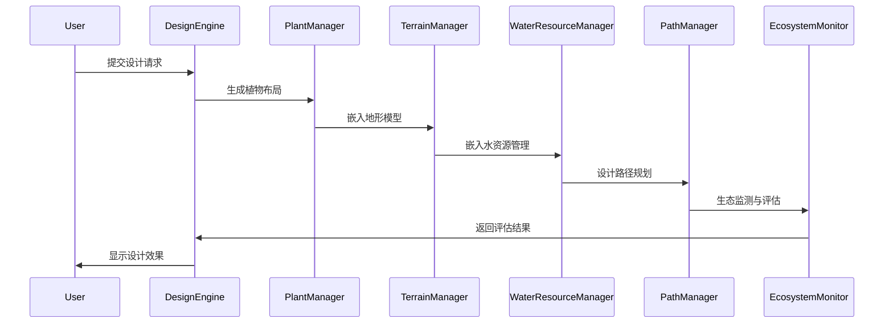
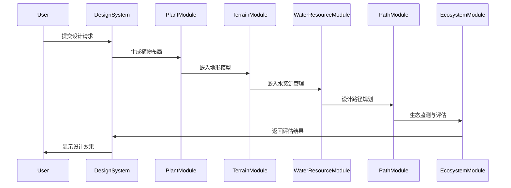

                 

### 文章标题

# 园林设计的分形几何：自然美的数学重现

### 关键词

- 分形几何
- 园林设计
- 自然美
- 数学模型
- 算法应用
- 实践案例

### 摘要

本文旨在探讨分形几何在园林设计中的应用，通过数学模型和算法，将自然美巧妙地重现于人工园林中。文章首先介绍了分形几何的基本概念和历史背景，随后深入分析了其在园林设计中的重要性。接着，文章详细阐述了分形几何的核心概念和原理，包括关键属性、维数以及常见分形图案。随后，文章探讨了分形几何的数学模型和公式，以及算法原理和应用实例。最后，文章通过实际案例展示了分形几何在园林设计中的具体应用，并提供了一些最佳实践和拓展阅读建议。本文的目标是为读者提供一个清晰、系统、全面了解分形几何在园林设计中的价值的平台。

### 目录

## 前言

## 第1章 引言与背景

### 1.1 分形几何的基本概念

#### 1.1.1 分形的定义与历史

分形（Fractal）一词由数学家曼德尔布罗特（Benoit Mandelbrot）在1975年提出，源自拉丁语“fractus”，意为“断裂”或“破碎”。分形是一种几何形状，其特征在于其无限层次的结构，无论放大还是缩小，都展现出类似的复杂性。这种性质称为自相似性。

分形几何的发展历程可以追溯到20世纪早期，虽然曼德尔布罗特是分形几何的创始人，但早在1801年，数学家查尔斯·卡米耶·柯西（Charles Jean de la Vallée-Poussin）就提出了类似分形的思想。此后，数学家亨利·庞加莱（Henri Poincaré）和莱昂哈德·欧拉（Leonhard Euler）等人在研究混沌理论和拓扑学时，也对分形几何的概念做出了贡献。

#### 1.1.2 分形的应用领域

分形几何在多个领域都得到了广泛应用，包括数学、物理、生物学、计算机科学、工程学、经济学等。在园林设计领域，分形几何提供了一种全新的设计思路，能够创造出更接近自然美的景观。

- **数学领域**：分形几何为数学家提供了研究复杂系统的新工具，尤其是在解决非线性问题和混沌现象方面。
- **物理领域**：分形几何在研究自然现象，如海岸线、河流网络、大气湍流等，提供了新的理论框架。
- **生物学领域**：分形几何在描述生物体的生长模式、神经网络结构等方面具有重要意义。
- **计算机科学领域**：分形几何在图像处理、算法设计、计算机图形学等领域有着广泛应用。
- **工程学领域**：分形几何在建筑结构设计、材料科学、水资源管理等方面提供了新方法。
- **经济学领域**：分形几何在金融市场分析、经济模型构建等方面提供了新的思路。

### 1.2 分形几何在园林设计中的重要性

园林设计旨在创造一个舒适、美观、和谐的自然环境。分形几何的引入，为园林设计提供了一种独特的视角，使其更加接近自然界的复杂性和美感。

#### 1.2.1 自相似性

分形几何的自相似性特性，使得园林设计师可以创造出具有多层次结构的景观。这种自相似性不仅增强了景观的美感，还使得景观在不同尺度上都具有一致性和协调性。

#### 1.2.2 空间复杂性

分形几何的复杂性，为园林设计提供了更多的可能性。设计师可以通过分形结构，创造出更为丰富和多样的景观元素，如曲折的路径、错落的植物布局、复杂的景观边界等。

#### 1.2.3 自然美学

分形几何在自然界中广泛存在，如树叶、云彩、海岸线等。将这些自然现象的美学特征引入园林设计，可以创造出更具自然美感的景观。

#### 1.2.4 景观可持续性

分形几何的设计思路，有助于提高园林的可持续性。通过模仿自然界的分形结构，设计师可以创造出更节水、节能的园林景观。

### 1.3 分形几何在现代园林设计的发展

随着分形几何理论的不断完善和计算机技术的进步，现代园林设计逐渐引入分形几何的概念和方法。

#### 1.3.1 设计工具

计算机辅助设计（CAD）软件的普及，使得分形几何的运用更加便捷。设计师可以通过分形生成器和分形编辑器，快速创造出各种复杂的分形图案。

#### 1.3.2 设计理念

现代园林设计逐渐从传统的几何对称和规则布局，转向更加自然和有机的设计理念。分形几何提供了这种转变的理论基础。

#### 1.3.3 实践案例

全球范围内，越来越多的园林设计项目开始运用分形几何。如纽约市的“高线公园”（The High Line）、新加坡的“滨海湾花园”（Gardens by the Bay）等，都是分形几何在园林设计中的成功案例。

### 1.4 分形几何在园林设计中的应用挑战与机遇

#### 1.4.1 技术挑战

尽管分形几何在园林设计中有很大的潜力，但技术的应用仍面临一些挑战。如分形生成和编辑工具的精度和效率、计算资源的消耗等。

#### 1.4.2 实践挑战

在实际园林设计中，如何将分形几何与实际情况相结合，如何处理分形结构在现实环境中的实现问题等，都是需要解决的问题。

#### 1.4.3 机遇

分形几何为园林设计提供了新的思路和方法，有助于解决传统设计方法无法解决的问题。如提高景观的可持续性、增强景观的多样性和美感等。

### 1.5 总结与未来方向

分形几何在园林设计中的应用具有巨大的潜力。未来研究可以集中在以下几个方面：

- **技术创新**：开发更加高效、精准的分形生成和编辑工具。
- **设计实践**：探索分形几何在园林设计中的实际应用，积累成功案例。
- **跨学科研究**：结合其他学科的知识，如生态学、环境科学等，深化分形几何在园林设计中的理论基础。
- **可持续发展**：研究分形几何在提高园林可持续性方面的应用，为未来园林设计提供更多理论支持。

通过本文的介绍，读者可以初步了解分形几何在园林设计中的应用及其重要性。接下来的章节将进一步探讨分形几何的核心概念、数学模型、算法原理以及实际应用，帮助读者深入理解这一领域。

## 第1章 引言与背景

### 1.1 分形几何的基本概念

分形几何是一门跨学科的研究领域，它不仅涉及数学，还涵盖了物理学、生物学、计算机科学等多个领域。分形几何的核心概念和原理，为我们理解和创造自然界中的复杂结构提供了新的视角。在本节中，我们将详细探讨分形几何的定义、历史背景以及其在多个领域的应用。

#### 1.1.1 分形的定义

分形（Fractal）是一种不规则的、自相似的几何形状，其特征在于无限层次的结构。无论放大还是缩小，分形都保持其独特的复杂性。这种性质称为自相似性。一个典型的分形例子是曼德尔布罗特集（Mandelbrot Set），它是由复数平面上的点构成的一个复杂几何形状，这些点满足特定的迭代函数。

定义：分形是既不是整数维也不是整数维加上分数维的几何形状，其特征在于具有无限层次的结构和自相似性。

#### 1.1.2 分形的历史背景

分形几何的发展历程可以追溯到20世纪早期。虽然曼德尔布罗特是分形几何的创始人，但早在1801年，查尔斯·卡米耶·柯西就提出了类似分形的思想。柯西在研究解析函数时，发现了一些具有无限层次结构的例子，这些例子后来被称为柯西集。此后，数学家亨利·庞加莱和莱昂哈德·欧拉等人在研究混沌理论和拓扑学时，也对分形几何的概念做出了贡献。

- **1975年**：数学家曼德尔布罗特出版了《分形：形、机遇和维度的哲学》一书，正式提出了分形几何的概念，并奠定了分形几何的理论基础。
- **1982年**：曼德尔布罗特进一步阐述了分形的自相似性和无限层次结构，使分形几何在学术界引起了广泛关注。

#### 1.1.3 分形的应用领域

分形几何在多个领域都得到了广泛应用，包括数学、物理、生物学、计算机科学、工程学、经济学等。以下是分形在部分领域的应用：

- **数学领域**：分形几何为数学家提供了研究复杂系统的新工具，尤其是在解决非线性问题和混沌现象方面。分形几何的应用包括分形集、分形维数、分形 attractor 等。
- **物理领域**：分形几何在研究自然现象，如海岸线、河流网络、大气湍流等，提供了新的理论框架。分形几何在物理学中的应用包括分形扩散、分形界面、分形布朗运动等。
- **生物学领域**：分形几何在描述生物体的生长模式、神经网络结构等方面具有重要意义。例如，植物的根系和叶脉结构、动物体内的血管网络等，都具有分形的特征。
- **计算机科学领域**：分形几何在图像处理、算法设计、计算机图形学等领域有着广泛应用。例如，分形插值、分形图像压缩、分形边界检测等。
- **工程学领域**：分形几何在建筑结构设计、材料科学、水资源管理等方面提供了新方法。例如，分形几何可以用于优化建筑设计、预测洪水风险、设计高效过滤材料等。
- **经济学领域**：分形几何在金融市场分析、经济模型构建等方面提供了新的思路。例如，分形几何可以用于研究股票市场的复杂性、预测经济波动等。

#### 1.1.4 分形几何的基本特征

分形几何具有以下基本特征：

- **自相似性**：分形几何的基本特征是自相似性，即无论放大还是缩小，分形都保持其独特的复杂性。自相似性使得分形在各个尺度上都具有相似的结构。
- **无限层次结构**：分形几何的另一个重要特征是无限层次结构，即分形具有无限层次的细节。这种无限层次的结构使得分形在数学上具有高度复杂性和多样性。
- **分数维数**：分形的维数不是整数，而是分数。分数维数反映了分形的复杂性和精细度。常见的分形维数包括2维、3维、分数维（如1.265、1.414等）。

### 1.2 分形几何在园林设计中的重要性

园林设计旨在创造一个舒适、美观、和谐的自然环境。分形几何的引入，为园林设计提供了一种全新的设计思路，使其更加接近自然界的复杂性和美感。以下从几个方面探讨分形几何在园林设计中的重要性：

#### 1.2.1 自相似性

分形几何的自相似性特性，使得园林设计师可以创造出具有多层次结构的景观。这种自相似性不仅增强了景观的美感，还使得景观在不同尺度上都具有一致性和协调性。例如，设计师可以利用分形几何创造出自相似的水景、植被布局和路径设计，使整个园林在不同尺度上保持和谐。

#### 1.2.2 空间复杂性

分形几何的复杂性，为园林设计提供了更多的可能性。设计师可以通过分形结构，创造出更为丰富和多样的景观元素，如曲折的路径、错落的植物布局、复杂的景观边界等。这种复杂性不仅增加了景观的视觉吸引力，还可以增强其功能性，如引导游客、提高景观的隐蔽性等。

#### 1.2.3 自然美学

分形几何在自然界中广泛存在，如树叶、云彩、海岸线等。将这些自然现象的美学特征引入园林设计，可以创造出更具自然美感的景观。例如，通过模仿自然界的分形结构，设计师可以创造出类似树叶、云彩的景观元素，使园林更具生态特色。

#### 1.2.4 景观可持续性

分形几何的设计思路，有助于提高园林的可持续性。通过模仿自然界的分形结构，设计师可以创造出更节水、节能的园林景观。例如，利用分形几何设计的雨水收集系统、植被布局等，可以更好地利用自然资源，降低园林的运营成本。

### 1.3 分形几何在园林设计中的应用现状

随着分形几何理论的不断完善和计算机技术的进步，现代园林设计逐渐引入分形几何的概念和方法。以下从几个方面介绍分形几何在园林设计中的应用现状：

#### 1.3.1 设计工具

计算机辅助设计（CAD）软件的普及，使得分形几何的运用更加便捷。设计师可以通过分形生成器和分形编辑器，快速创造出各种复杂的分形图案。例如，AutoCAD、SketchUp、3ds Max等软件都支持分形几何的创建和编辑。

#### 1.3.2 设计理念

现代园林设计逐渐从传统的几何对称和规则布局，转向更加自然和有机的设计理念。分形几何提供了这种转变的理论基础。设计师可以通过分形几何，创造出更加自然、和谐的园林景观。

#### 1.3.3 实践案例

全球范围内，越来越多的园林设计项目开始运用分形几何。例如，纽约市的高线公园（The High Line）和新加坡的滨海湾花园（Gardens by the Bay）等，都是分形几何在园林设计中的成功案例。这些项目通过运用分形几何，创造出具有独特美感、可持续性的园林景观。

#### 1.3.4 学术研究

分形几何在园林设计中的应用研究也在逐步深入。学术界对于分形几何在园林设计中的理论基础、设计方法、实践应用等方面进行了大量研究。这些研究为分形几何在园林设计中的应用提供了理论支持。

### 1.4 分形几何在园林设计中的应用挑战与机遇

尽管分形几何在园林设计中有巨大的潜力，但其在实际应用中仍面临一些挑战和机遇。

#### 1.4.1 技术挑战

分形几何的应用需要较高的计算能力和算法支持。在实际园林设计中，如何高效地生成和编辑分形图案，是一个技术挑战。此外，分形几何的设计工具和软件也需要不断优化，以提高其易用性和实用性。

#### 1.4.2 实践挑战

在实际园林设计中，如何将分形几何与实际情况相结合，如何处理分形结构在现实环境中的实现问题等，都是需要解决的问题。例如，分形结构在现实环境中的材料和施工问题，如何保证分形结构的稳定性和耐久性等。

#### 1.4.3 机遇

分形几何为园林设计提供了新的思路和方法，有助于解决传统设计方法无法解决的问题。例如，提高景观的可持续性、增强景观的多样性和美感等。分形几何的应用可以推动园林设计向更加自然、高效、可持续的方向发展。

### 1.5 总结与未来方向

分形几何在园林设计中的应用具有巨大的潜力。未来研究可以集中在以下几个方面：

- **技术创新**：开发更加高效、精准的分形生成和编辑工具。
- **设计实践**：探索分形几何在园林设计中的实际应用，积累成功案例。
- **跨学科研究**：结合其他学科的知识，如生态学、环境科学等，深化分形几何在园林设计中的理论基础。
- **可持续发展**：研究分形几何在提高园林可持续性方面的应用，为未来园林设计提供更多理论支持。

通过本节的介绍，读者可以初步了解分形几何的基本概念和应用现状，以及其在园林设计中的重要性。接下来，我们将进一步探讨分形几何的核心概念和原理，为读者深入理解分形几何在园林设计中的应用奠定基础。

## 第2章 核心概念与原理

### 2.1 定义与历史

分形几何作为一种独特的几何学分支，其定义和概念需要深入理解。分形（Fractal）一词最初由数学家曼德尔布罗特（Benoit Mandelbrot）在1975年提出，旨在描述那些具有无限层次结构和自相似性质的数学形状。分形的基本定义是：在某种尺度下，其局部与整体具有相似性的几何对象。

定义：分形是一种具有无限层次结构和自相似性质的几何对象，其局部与整体在某种尺度上具有相似性。

#### 历史背景

分形几何的发展历程虽然短暂，但其理论基础却可以追溯到19世纪。数学家查尔斯·卡米耶·柯西（Charles Jean de la Vallée-Poussin）在1801年首次提出与分形相关的概念。此后，亨利·庞加莱（Henri Poincaré）和莱昂哈德·欧拉（Leonhard Euler）等数学家在研究混沌理论和拓扑学时，也对分形几何的概念做出了贡献。

- **1975年**：曼德尔布罗特出版了《分形：形、机遇和维度的哲学》一书，正式提出了分形几何的概念，并奠定了分形几何的理论基础。
- **1982年**：曼德尔布罗特进一步阐述了分形的自相似性和无限层次结构，使分形几何在学术界引起了广泛关注。

#### 分形几何的发展过程

分形几何的发展过程可以分为以下几个阶段：

1. **早期发展（19世纪末至20世纪中叶）**：这一阶段主要是对分形概念的初步探索和概念化，如柯西集、庞加莱映射等。
2. **理论奠定阶段（20世纪中叶至1970年代）**：这一阶段，数学家们开始系统地研究分形几何的性质和理论，如分形维数、分形集等。
3. **应用推广阶段（1980年代至今）**：随着计算机技术的发展，分形几何的应用逐渐拓展到各个领域，如自然科学、工程技术、经济学等。

### 2.2 关键属性

分形几何的关键属性是理解分形概念的核心，这些属性包括分形的自相似性、分数维数、无序性等。

#### 自相似性

自相似性是分形几何最基本的属性之一。它意味着无论从哪个尺度观察，分形都具有类似的形态。例如，一棵树在宏观和微观尺度上看起来都有相似的分支结构。这种自相似性使得分形在各个尺度上都具有一致性，是分形几何能够模拟自然界复杂性的关键。

定义：自相似性是指一个对象在不同尺度上具有相似的结构和形态。

#### 分数维数

分数维数是分形几何的另一个重要属性。与传统的整数维数不同，分数维数描述了分形结构的复杂程度。分数维数通常大于2（即非整数维），这是由于分形具有多层次结构和无限细节。

定义：分数维数是指一个分形对象在某种尺度下的维数，它反映了分形结构的复杂性和精细度。

#### 无序性

分形几何通常具有无序性，即其形状在局部上是随机的，没有明显的规律。这与传统几何中的规则形状形成鲜明对比。无序性是分形能够模拟自然界复杂现象的另一个关键属性。

定义：无序性是指分形几何的局部结构和形态在某种尺度下是随机的，没有明显的规律。

#### 自相似性、分数维数与无序性之间的关系

自相似性、分数维数和无序性是分形几何的三个基本属性，它们相互关联，共同构成了分形几何的独特特征。

- 自相似性使得分形在不同尺度上具有相似的结构。
- 分数维数描述了分形结构的复杂性和精细度。
- 无序性则保证了分形具有随机性和多样性。

通过理解这些属性，我们可以更好地把握分形的本质，并在园林设计中灵活运用分形几何的原理。

### 2.3 分形维数

分形维数是分形几何中的一个核心概念，它量化了分形的复杂程度和精细度。与整数维数不同，分形维数可以是分数，甚至可以是无限大或无限小。分形维数通常用来描述分形的几何特性，如边界复杂度、填充密度等。

#### 分形维数的定义

分形维数（Fractal Dimension）是指一个分形对象在某种尺度下的维数，它反映了分形结构的复杂性和精细度。分形维数通常用符号`D`表示。

定义：分形维数是一个介于整数维数（通常为2或3）和无穷大之间的数，它反映了分形结构的复杂性和精细度。

#### 分形维数的计算方法

分形维数的计算方法有多种，其中最常用的方法是盒计数法（Box Counting Method）和维格曼法（Widom's Law）。以下简要介绍这两种方法。

1. **盒计数法**

盒计数法是一种通过统计覆盖分形对象所需的最小盒数来计算分形维数的方法。具体步骤如下：

- 将分形对象嵌入到一个固定大小的空间中。
- 以一定的间隔在空间中放置多个大小相同的盒子，并统计这些盒子中包含分形对象的数量。
- 改变小盒子的尺寸，重复上述步骤，并记录不同尺寸盒子的覆盖情况。
- 作出盒尺寸与覆盖盒子数量的对数图，通过曲线的斜率计算分形维数。

公式表示：

$$
D = \lim_{\ell \to 0} \frac{\log N(\ell)}{\log \ell}
$$

其中，$N(\ell)$表示尺寸为$\ell$的盒子覆盖分形对象的数量。

2. **维格曼法**

维格曼法是一种通过分析分形对象的尺度变换性质来计算分形维数的方法。具体步骤如下：

- 选择一个尺度因子$r$，对分形对象进行等比例缩放。
- 记录缩放后分形对象的相似比例，即尺度因子$r$与原始尺寸的比值。
- 通过分析相似比例与尺度因子的关系，计算分形维数。

公式表示：

$$
D = \frac{\log r}{\log R}
$$

其中，$r$为尺度因子，$R$为相似比例。

#### 分形维数的重要性

分形维数是分形几何中的核心概念，它量化了分形结构的复杂性和精细度。分形维数对于理解分形的性质和行为具有重要意义，如：

- **边界复杂度**：分形维数反映了分形边界的复杂程度。分形维数越高，边界越复杂，分形对象具有更多的细节。
- **填充密度**：分形维数也反映了分形的填充密度。分形维数越高，分形对象的填充密度越低，具有更多的空隙。
- **结构精细度**：分形维数越高，分形结构越精细，具有更多的层次和细节。

#### 常见分形维数的范围

分形维数的范围通常介于2和3之间，常见的分形维数包括：

- **卡拉比-丘维数（2.289...）**：这是曼德尔布罗特集的维数，代表了最著名的分形之一。
- **科赫雪花维数（1.261...）**：这是科赫曲线在收缩到极限时的维数，展示了分形的自相似特性。
- **康托尔集维数（0.63...）**：这是康托尔集的维数，展示了分形的无序性和层次结构。

#### 分形维数与景观设计

在园林设计中，分形维数提供了量化景观复杂度和精细度的工具。通过计算分形维数，设计师可以评估景观的结构和美感。例如，利用分形维数可以设计出具有自相似性和复杂性的景观元素，如曲折的小径、错落的植被布局等，从而创造出更自然、更美观的园林景观。

### 2.4 常见分形图案及其在园林设计中的应用

分形几何在自然界和人工景观中都有广泛的应用。以下介绍几种常见的分形图案及其在园林设计中的应用。

#### 2.4.1 曼德尔布罗特集

曼德尔布罗特集（Mandelbrot Set）是最著名的分形图案之一，它是由复数平面上的点构成的一个复杂几何形状。这些点满足特定的迭代函数，通过不断迭代产生出美丽的分形结构。

- **自然美**：曼德尔布罗特集具有丰富的色彩和层次感，类似于自然界的云彩、冰川和海岸线。
- **园林设计**：设计师可以利用曼德尔布罗特集的图案来设计水景、植被布局和景观边界，创造出具有自然美感的景观。

#### 2.4.2 科赫雪花

科赫雪花（Koch Snowflake）是一种经典的分形图案，它由一个等边三角形经过多次迭代和收缩产生。科赫雪花具有无穷层次的结构和自相似性，其边长和周长在每次迭代中成比例缩减。

- **自然美**：科赫雪花类似于自然界中的珊瑚、海星和雪花等，其复杂的边缘和层次感具有很强的视觉吸引力。
- **园林设计**：设计师可以利用科赫雪花的图案来设计花坛、步道和景观边界，创造出具有动态感和层次感的景观。

#### 2.4.3 康托尔集

康托尔集（Cantor Set）是由数学家乔治·康托尔（Georg Cantor）提出的一种无序分形结构，它通过不断去除中间部分的方式产生。康托尔集具有无序性和无限细节，其结构在各个尺度上具有一致性。

- **自然美**：康托尔集类似于自然界中的岩石结构、火山口和海岸线等，其无序性和复杂性具有很强的视觉吸引力。
- **园林设计**：设计师可以利用康托尔集的图案来设计岩石布局、景观边界和植被配置，创造出具有自然美感和多样性的景观。

#### 2.4.4 中英庭园

中英庭园（Sierpinski Gasket）是由波兰数学家兹比格涅夫·谢尔宾斯基（Zbigniew Sierpinski）提出的一种二维分形结构，它通过不断将正方形划分为更小的正方形并去除中间部分产生。

- **自然美**：中英庭园类似于自然界中的叶子、树皮和细胞结构等，其自相似性和层次感具有很强的视觉吸引力。
- **园林设计**：设计师可以利用中英庭园的图案来设计植被布局、步道和景观元素，创造出具有自然美感和动态变化的景观。

### 2.5 分形方法的比较及其在园林设计中的适用性

在园林设计中，不同的分形方法适用于不同的设计需求和应用场景。以下比较几种常见的分形方法，并讨论其在园林设计中的适用性。

#### 2.5.1 曼德尔布罗特集

曼德尔布罗特集是一种复杂的分形结构，适用于需要高度复杂性和细节感的园林设计。例如，在大型公园或风景区中，可以使用曼德尔布罗特集来设计水景、植被布局和景观边界，创造出具有自然美感和神秘感的景观。

- **优点**：高度复杂性和自然美感。
- **缺点**：计算成本高，设计难度大。

#### 2.5.2 科赫雪花

科赫雪花具有简洁的几何形状和明显的层次感，适用于需要动态感和层次感的园林设计。例如，在花园或公园的小区中，可以使用科赫雪花来设计花坛、步道和景观边界，创造出具有视觉吸引力和舒适感的景观。

- **优点**：简洁的几何形状，容易理解和实现。
- **缺点**：无法表达高度的复杂性。

#### 2.5.3 康托尔集

康托尔集具有无序性和复杂性，适用于需要自然美感和多样性的园林设计。例如，在岩石花园或公园的自然景观中，可以使用康托尔集来设计岩石布局、植被配置和景观边界，创造出具有自然美感和生态特色的景观。

- **优点**：无序性和复杂性，自然美感。
- **缺点**：设计难度大，计算成本高。

#### 2.5.4 中英庭园

中英庭园具有简洁的几何形状和自相似性，适用于需要简单几何形状和层次感的园林设计。例如，在公园的步道或绿地中，可以使用中英庭园的图案来设计步道边界、植被布局和景观元素，创造出具有自然美感和和谐感的景观。

- **优点**：简洁的几何形状，易于实现。
- **缺点**：无法表达高度的复杂性和自然美感。

### 2.6 核心原理与理论

分形几何的核心原理和理论包括自相似性、分数维数、迭代过程等。以下简要介绍这些原理和理论。

#### 自相似性

自相似性是分形几何的核心原理之一，它指的是分形在不同尺度上具有相似的结构和形态。自相似性使得分形能够模拟自然界中的复杂结构，如云彩、树叶、海岸线等。

定义：自相似性是指一个对象在不同尺度上具有相似的结构和形态。

#### 分数维数

分数维数是分形几何的另一个核心原理，它用于描述分形的复杂性和精细度。分数维数介于整数维数（如2维或3维）和无穷大之间，反映了分形结构的复杂程度。

定义：分数维数是指一个分形对象在某种尺度下的维数，它反映了分形结构的复杂性和精细度。

#### 迭代过程

迭代过程是分形几何的一个重要概念，它指的是通过反复迭代某个过程来生成分形结构。迭代过程可以是数学函数的迭代、几何图形的迭代等。

定义：迭代过程是指通过反复执行某个过程来生成分形结构的过程。

### 2.7 分形属性对比表格

以下是一个分形几何属性对比表格，用于总结不同分形图案的主要特征和适用场景。

| 分形图案 | 自相似性 | 分数维数 | 适用场景 |
| --- | --- | --- | --- |
| 曼德尔布罗特集 | 高度自相似性 | 2.289... | 复杂水景、大型公园 |
| 科赫雪花 | 自相似性 | 1.261... | 花坛、小径 |
| 康托尔集 | 无序自相似性 | 0.63... | 岩石花园、自然景观 |
| 中英庭园 | 自相似性 | 1.261... | 步道、绿地 |

通过对比表格，我们可以更清晰地了解不同分形图案的特点和适用场景，为园林设计提供参考。

### 2.8 分形几何在园林设计中的核心原理与联系

分形几何在园林设计中的应用，不仅需要理解其核心概念和特征，还需要掌握其核心原理和联系。以下是分形几何在园林设计中的几个关键原理和联系：

#### 2.8.1 自相似性与空间布局

自相似性是分形几何的核心特征之一，它使得分形在不同尺度上具有相似的形态。在园林设计中，自相似性可以帮助设计师创建出具有层次感和协调性的景观。例如，通过设计自相似的路径和植被布局，可以使园林在不同尺度上保持一致性和连贯性。

- **路径设计**：设计师可以利用分形的自相似性，创建出曲折但连续的路径系统。这种路径不仅能够引导游客，还能增强景观的动态感。
- **植被布局**：设计师可以利用分形的自相似性，设计出层次分明的植被布局。例如，通过模仿树叶的分形结构，可以创造出自然、和谐的植被景观。

#### 2.8.2 分数维数与景观复杂性

分数维数是分形几何的另一个关键特征，它量化了分形的复杂性和精细度。在园林设计中，分数维数可以帮助设计师评估和表达景观的复杂程度。例如，通过计算分形维数，可以量化园林中路径、植被和景观元素的复杂度，从而指导设计。

- **路径复杂性**：设计师可以通过调整路径的分形维数，控制路径的复杂度。高维数的路径更加复杂，适合用于大型公园或风景区。
- **植被复杂性**：设计师可以通过调整植被的分形维数，控制植被的精细度。高维数的植被布局更加精细，适合用于小规模园林或花园。

#### 2.8.3 迭代过程与设计实现

迭代过程是分形几何生成的重要手段，它通过重复执行某个操作来生成分形结构。在园林设计中，迭代过程可以帮助设计师实现复杂且自然的景观效果。

- **植被生长**：设计师可以利用分形的迭代过程，模拟植被的自然生长过程。例如，通过迭代增加植被的分支和叶片，可以创造出逼真的植被景观。
- **水景设计**：设计师可以利用分形的迭代过程，模拟水景的自然演变过程。例如，通过迭代调整水体的形状和纹理，可以创造出自然、多变的水景效果。

#### 2.8.4 分形几何与生态学

分形几何在生态学中的应用，可以帮助设计师创建出更加生态友好的园林景观。通过理解分形几何在自然界中的普遍存在，设计师可以借鉴自然界的分形结构，创造出具有生态价值的景观。

- **生物多样性**：设计师可以利用分形几何，设计出具有丰富生物多样性的景观。例如，通过模仿自然界的分形结构，可以创造出多种栖息地，吸引不同种类的动植物。
- **生态适应性**：设计师可以利用分形几何，设计出具有生态适应性的景观。例如，通过模仿自然界的分形结构，可以创造出适应不同气候和土壤条件的景观。

#### 2.8.5 分形几何与可持续设计

分形几何在园林设计中的应用，不仅能够创造出美观的景观，还可以提高园林的可持续性。通过理解分形几何的可持续性原理，设计师可以创造出更加节能、节水、环保的园林景观。

- **节水设计**：设计师可以利用分形的自相似性和复杂性，设计出高效的节水景观。例如，通过模仿自然界的分形结构，可以创造出雨水收集和利用系统，提高水资源的利用效率。
- **节能设计**：设计师可以利用分形的自相似性和层次感，设计出节能的园林景观。例如，通过模仿自然界的分形结构，可以创造出遮阳和通风效果良好的景观，减少能源消耗。

### 2.9 分形几何的ER实体关系图

为了更好地理解分形几何在园林设计中的应用，我们可以使用ER（实体关系）图来描述分形几何中的主要实体及其关系。以下是分形几何在园林设计中的ER实体关系图：

```
[园林设计] - [分形几何] - [自相似性]
    |                       |
    |                       |
[植被布局]           [路径设计]
    |                       |
    |                       |
[水景设计]           [生态学应用]
```

该ER实体关系图展示了分形几何在园林设计中的应用，包括自相似性、植被布局、路径设计、水景设计和生态学应用等。通过该关系图，我们可以清晰地看到分形几何与园林设计的各个子领域之间的联系。

### 2.10 分形几何在园林设计中的应用

分形几何在园林设计中的应用非常广泛，其自相似性、分数维数和迭代过程等特点，为园林设计师提供了丰富的设计工具和思路。以下从几个方面探讨分形几何在园林设计中的应用。

#### 2.10.1 植被布局

植被布局是园林设计中一个重要的方面，通过分形几何可以创造出自然、多样且美观的植被景观。设计师可以利用分形的自相似性，设计出具有层次感和连贯性的植被布局。

- **应用实例**：在花园设计中，可以利用分形几何创建出错落有致的植物布局，模拟自然界中的植被分布。例如，通过迭代增加植物的分支和叶片，可以创造出逼真的植被效果。
- **效果展示**：分形植被布局可以使花园在各个尺度上保持一致性和连贯性，创造出自然、和谐的美感。

#### 2.10.2 路径设计

路径设计是园林设计中另一个关键方面，通过分形几何可以创造出具有动态感和引导性的路径系统。设计师可以利用分形的自相似性和复杂性，设计出曲折但连续的路径。

- **应用实例**：在公园设计中，可以利用分形几何创建出曲折的路径系统，引导游客探索公园的各个区域。例如，通过迭代调整路径的形状和长度，可以创造出具有动态感的路径。
- **效果展示**：分形路径设计可以增强公园的引导性和探索性，为游客提供独特的游览体验。

#### 2.10.3 水景设计

水景设计是园林设计中一个重要的元素，通过分形几何可以创造出自然、多变的水景效果。设计师可以利用分形的迭代过程，模拟水景的自然演变过程。

- **应用实例**：在湖泊或河流景观中，可以利用分形几何设计出蜿蜒的河道和自然的水流。例如，通过迭代调整水体的形状和纹理，可以创造出逼真的水景效果。
- **效果展示**：分形水景设计可以增强园林的自然美感和生态特性，为游客提供宁静、舒适的游览环境。

#### 2.10.4 生态学应用

分形几何在生态学中的应用，可以帮助设计师创建出更加生态友好的园林景观。通过理解分形几何在自然界中的普遍存在，设计师可以借鉴自然界的分形结构，创造出具有生态价值的景观。

- **应用实例**：在生态园林设计中，可以利用分形几何设计出具有丰富生物多样性的景观。例如，通过模仿自然界的分形结构，可以创造出多种栖息地，吸引不同种类的动植物。
- **效果展示**：分形生态学应用可以增强园林的生态价值和可持续性，为城市提供绿色的生态空间。

通过以上几个方面的探讨，我们可以看到分形几何在园林设计中的应用具有广泛的前景和潜力。设计师可以利用分形几何的自相似性、分数维数和迭代过程，创造出自然、多样且美观的园林景观，为人们提供更加美好、生态的居住环境。

### 总结与未来展望

本章介绍了分形几何的基本概念、关键属性、数学模型以及其在园林设计中的应用。通过本章的探讨，我们可以看到分形几何在园林设计中的独特价值和潜力。分形几何不仅能够创造出具有自然美感的景观，还能提高园林的生态价值和可持续性。

未来的研究可以集中在以下几个方面：

- **技术创新**：开发更加高效、精准的分形生成和编辑工具，提高分形几何在园林设计中的应用效率。
- **设计实践**：探索分形几何在园林设计中的实际应用，积累更多的成功案例和经验。
- **跨学科研究**：结合其他学科的知识，如生态学、环境科学等，深化分形几何在园林设计中的理论基础。
- **可持续发展**：研究分形几何在提高园林可持续性方面的应用，为未来园林设计提供更多理论支持。

通过不断的研究和实践，我们可以进一步发挥分形几何在园林设计中的潜力，为人们创造更加美好、和谐的居住环境。

## 第3章 数学模型与公式

### 3.1 基本分形数学模型

分形几何的核心在于其数学模型和公式，这些模型和公式不仅定义了分形的结构，还揭示了分形在不同尺度上的自相似性和无限层次性。在本节中，我们将介绍几种基本的分形数学模型，包括曼德尔布罗特集、科赫曲线和康托尔集等。

#### 3.1.1 曼德尔布罗特集

曼德尔布罗特集（Mandelbrot Set）是最著名的分形之一，它由复数平面上的点构成。这些点满足以下迭代函数：

$$
c \mapsto c^2 + z
$$

其中，$z$ 是复数，$c$ 是迭代过程中的初始值。曼德尔布罗特集的形成过程如下：

1. 初始化：选择一个复数平面上的点$z_0 = 0$。
2. 迭代：对于每个点$z_n$，计算下一个点$z_{n+1} = z_n^2 + c$。
3. 判断：如果$|z_n| > 2$，则该点不属于曼德尔布罗特集；否则，继续迭代。

曼德尔布罗特集的数学模型可以用递归关系表示：

$$
z_{n+1} = z_n^2 + c
$$

其中，$n$ 是迭代次数。曼德尔布罗特集的美丽在于其复杂的边界，这些边界形成了一种无限层次的结构，展示了分形几何的独特魅力。

#### 3.1.2 科赫曲线

科赫曲线（Koch Curve）是一种二维的分形结构，它通过迭代过程生成。科赫曲线的生成过程如下：

1. 选择一个等边三角形作为初始图形。
2. 对于每个边，将其三等分，并在中间一段上添加两个等边三角形，使得中间一段变成两个等边三角形的公共边。
3. 重复上述步骤，无限迭代。

科赫曲线的数学模型可以用递归关系表示：

$$
C_{n+1} = 3C_n - 2T
$$

其中，$C_n$ 表示第$n$次迭代的曲线，$T$ 是初始三角形的边长。

科赫曲线的每次迭代都会使边长缩小为原来的三分之一，同时增加两条新的边。这种递归过程使得科赫曲线在无限迭代中形成了一种自相似的结构，其边界呈现出一种渐近的趋势。

#### 3.1.3 康托尔集

康托尔集（Cantor Set）是一种无序的分形结构，它通过不断去除中间部分的方式生成。康托尔集的形成过程如下：

1. 初始化：选择一个闭区间$[0, 1]$。
2. 迭代：对于每个区间，将其等分为三部分，并去除中间部分。
3. 重复上述步骤，无限迭代。

康托尔集的数学模型可以用递归关系表示：

$$
C_{n+1} = \bigcup_{i=1}^{2^n} \left[\frac{i-1}{2^n}, \frac{i}{2^n}\right]
$$

其中，$C_n$ 表示第$n$次迭代的集合。

康托尔集的每次迭代都会使区间的长度缩小为原来的三分之一，同时去除中间部分。这种递归过程使得康托尔集在无限迭代中形成了一种无序但具有自相似性的结构。

### 3.2 分形分析的数学公式

分形分析是分形几何的重要组成部分，它通过数学公式描述了分形结构的性质和行为。以下介绍几种常见的分形分析数学公式。

#### 3.2.1 盒计数法

盒计数法（Box Counting Method）是一种常用的分形分析工具，它通过统计覆盖分形对象所需的最小盒数来计算分形维数。盒计数法的数学公式如下：

$$
D = \lim_{\ell \to 0} \frac{\log N(\ell)}{\log \ell}
$$

其中，$N(\ell)$ 表示尺寸为$\ell$的盒子覆盖分形对象的数量。$D$ 是分形维数，它反映了分形结构的复杂性和精细度。

#### 3.2.2 维格曼法

维格曼法（Widom's Law）是一种通过尺度变换分析分形结构的工具，它通过分析相似比例与尺度因子的关系来计算分形维数。维格曼法的数学公式如下：

$$
D = \frac{\log r}{\log R}
$$

其中，$r$ 是尺度因子，$R$ 是相似比例。$D$ 是分形维数，它量化了分形结构的复杂程度。

#### 3.2.3 覆盖密度

覆盖密度（Coverage Density）是分形分析中另一个重要的参数，它描述了分形对象被覆盖的程度。覆盖密度的数学公式如下：

$$
\phi = \frac{A}{L}
$$

其中，$A$ 是分形对象的总面积，$L$ 是覆盖分形对象的盒子的总面积。$\phi$ 是覆盖密度，它反映了分形结构的填充程度。

#### 3.2.4 分形维数与面积

分形维数与分形对象的面积之间有密切的关系。一个典型的关系公式如下：

$$
A = \phi L^D
$$

其中，$A$ 是分形对象的面积，$L$ 是分形对象的线性尺寸，$D$ 是分形维数。$\phi$ 是覆盖密度。这个公式揭示了分形结构的复杂性和尺寸之间的关系。

### 3.3 分形生长和发展的数学模型

分形生长和发展是分形几何中的一个重要研究方向，它描述了分形结构如何随时间变化。以下介绍几种常见的分形生长和发展的数学模型。

#### 3.3.1 反复迭代模型

反复迭代模型是一种简单的分形生长模型，它通过不断迭代某个函数来生成分形结构。一个典型的例子是曼德尔布罗特集的生成过程。反复迭代模型的数学公式如下：

$$
z_{n+1} = f(z_n)
$$

其中，$z_n$ 是第$n$次迭代的点，$f(z_n)$ 是迭代函数。通过反复迭代，分形结构会逐渐形成。

#### 3.3.2 分形生成树模型

分形生成树模型是一种通过树形结构来描述分形生长和发展的模型。它通过树形结构模拟分形结构的生成过程。分形生成树模型的数学公式如下：

$$
T = \sum_{i=1}^{n} T_i
$$

其中，$T$ 是分形生成树，$T_i$ 是第$i$层的分形生成树。通过递归生成树形结构，分形结构会逐渐形成。

#### 3.3.3 分形生长模型

分形生长模型是一种通过分形生长方程来描述分形生长和发展的模型。它通过分形生长方程模拟分形结构的演化过程。分形生长模型的数学公式如下：

$$
\frac{\partial F}{\partial t} = f(F)
$$

其中，$F$ 是分形结构，$t$ 是时间，$f(F)$ 是分形生长方程。通过求解分形生长方程，可以模拟分形结构的生长和发展过程。

### 3.4 分形几何在园林设计中的应用

分形几何在园林设计中的应用非常广泛，通过数学模型和公式，设计师可以创造出具有自然美感和复杂性的园林景观。以下从几个方面介绍分形几何在园林设计中的应用。

#### 3.4.1 植被布局

通过分形几何的数学模型，设计师可以创造出自然、多样化的植被布局。例如，可以利用曼德尔布罗特集的迭代过程来设计植被的分布，使得植被在不同尺度上保持一致性和连贯性。

- **应用实例**：在花园设计中，可以利用曼德尔布罗特集的迭代过程来设计植被布局，使得植被在不同尺度上具有层次感。
- **效果展示**：分形植被布局可以使花园在各个尺度上保持一致性和连贯性，创造出自然、和谐的美感。

#### 3.4.2 路径设计

分形几何可以用于设计具有动态感和引导性的路径。通过迭代过程，设计师可以创造出曲折但连续的路径系统，引导游客探索园林的各个区域。

- **应用实例**：在公园设计中，可以利用科赫曲线的迭代过程来设计路径，创造出具有动态感的路径系统。
- **效果展示**：分形路径设计可以增强公园的引导性和探索性，为游客提供独特的游览体验。

#### 3.4.3 水景设计

分形几何可以用于设计自然、多变的水景效果。通过迭代过程，设计师可以模拟水景的自然演变过程，创造出逼真的水景景观。

- **应用实例**：在湖泊或河流景观中，可以利用康托尔集的迭代过程来设计水景，创造出自然的水流效果。
- **效果展示**：分形水景设计可以增强园林的自然美感和生态特性，为游客提供宁静、舒适的游览环境。

#### 3.4.4 生态学应用

分形几何在生态学中的应用，可以帮助设计师创建出具有生态价值的园林景观。通过借鉴自然界的分形结构，设计师可以创造出具有丰富生物多样性的生态景观。

- **应用实例**：在生态园林设计中，可以利用分形几何设计出多种栖息地，吸引不同种类的动植物。
- **效果展示**：分形生态学应用可以增强园林的生态价值和可持续性，为城市提供绿色的生态空间。

通过以上几个方面的探讨，我们可以看到分形几何在园林设计中的应用具有广泛的前景和潜力。设计师可以利用分形几何的数学模型和公式，创造出自然、多样且美观的园林景观，为人们提供更加美好、和谐的居住环境。

### 3.5 分形公式与数学模型的详细解释

#### 3.5.1 盒计数法

盒计数法（Box Counting Method）是计算分形维数的一种常用方法。其基本思想是通过统计覆盖分形对象所需的最小盒数来估算分形维数。以下是盒计数法的详细解释：

1. **初始化**：选择一个足够大的容器，将分形对象放入容器中。
2. **选择初始盒子尺寸**：选择一个初始盒子尺寸$\ell_0$。
3. **覆盖分形对象**：用尺寸为$\ell_0$的盒子覆盖分形对象，并统计覆盖盒子的数量$N(\ell_0)$。
4. **缩小盒子尺寸**：将盒子尺寸缩小为$\ell_0/2$，重复步骤3，统计新的覆盖盒子数量$N(\ell_0/2)$。
5. **递归缩小盒子尺寸**：重复步骤4，直到盒子尺寸$\ell_n$足够小，无法覆盖分形对象。
6. **计算分形维数**：通过以下公式计算分形维数：

$$
D = \lim_{\ell \to 0} \frac{\log N(\ell)}{\log \ell}
$$

该公式表示，当盒子尺寸$\ell$趋向于零时，盒子的对数数量与盒子尺寸的对数之间的斜率即为分形维数$D$。

#### 3.5.2 维格曼法

维格曼法（Widom's Law）是一种通过尺度变换分析分形结构的工具。其基本思想是通过分析相似比例与尺度因子的关系来计算分形维数。以下是维格曼法的详细解释：

1. **选择尺度因子**：选择一个尺度因子$r$，对分形对象进行等比例缩放。
2. **记录相似比例**：记录缩放后分形对象的相似比例$R$，即尺度因子$r$与原始尺寸的比值。
3. **重复缩放**：重复选择不同的尺度因子$r$，对分形对象进行多次缩放，并记录每次缩放后的相似比例$R$。
4. **计算分形维数**：通过以下公式计算分形维数：

$$
D = \frac{\log r}{\log R}
$$

该公式表示，相似比例$R$的对数与尺度因子$r$的对数之间的比值即为分形维数$D$。

#### 3.5.3 覆盖密度

覆盖密度（Coverage Density）是描述分形对象被覆盖程度的参数。它可以通过统计覆盖分形对象所需的盒子数量来计算。以下是覆盖密度的详细解释：

1. **选择初始盒子尺寸**：选择一个初始盒子尺寸$\ell_0$。
2. **覆盖分形对象**：用尺寸为$\ell_0$的盒子覆盖分形对象，并统计覆盖盒子的数量$N(\ell_0)$。
3. **缩小盒子尺寸**：将盒子尺寸缩小为$\ell_0/2$，重复步骤2，统计新的覆盖盒子数量$N(\ell_0/2)$。
4. **递归缩小盒子尺寸**：重复步骤3，直到盒子尺寸$\ell_n$足够小，无法覆盖分形对象。
5. **计算覆盖密度**：通过以下公式计算覆盖密度$\phi$：

$$
\phi = \frac{A}{L}
$$

其中，$A$ 是分形对象的总面积，$L$ 是覆盖分形对象的盒子的总面积。

#### 3.5.4 分形维数与面积的关系

分形维数与分形对象的面积之间有密切的关系。一个典型的关系公式如下：

$$
A = \phi L^D
$$

其中，$A$ 是分形对象的面积，$L$ 是分形对象的线性尺寸，$D$ 是分形维数，$\phi$ 是覆盖密度。这个公式揭示了分形结构的复杂性和尺寸之间的关系。以下是该公式的详细解释：

1. **确定分形对象的面积**：通过实验或计算，确定分形对象的面积$A$。
2. **测量分形对象的线性尺寸**：通过实验或计算，测量分形对象的线性尺寸$L$。
3. **计算覆盖密度**：通过覆盖密度公式$\phi = \frac{A}{L}$计算覆盖密度$\phi$。
4. **计算分形维数**：通过覆盖密度公式和面积公式，计算分形维数$D$：

$$
D = \frac{\log A}{\log L}
$$

通过以上公式，我们可以从分形对象的面积和线性尺寸估算出分形维数。分形维数不仅反映了分形结构的复杂性，还为我们理解分形在不同尺度上的行为提供了重要的信息。

### 3.6 分形生长和发展的数学模型

分形生长和发展是分形几何中的关键研究内容。以下介绍几种常见的分形生长和发展的数学模型，包括迭代模型、生成树模型和分形生长方程。

#### 3.6.1 迭代模型

迭代模型是一种简单的分形生长模型，它通过反复迭代某个函数来生成分形结构。以下是迭代模型的详细解释：

1. **选择初始点**：选择一个初始点$z_0$作为分形结构的起点。
2. **迭代过程**：通过以下迭代函数生成分形结构：

$$
z_{n+1} = f(z_n)
$$

其中，$f(z_n)$ 是迭代函数，$n$ 是迭代次数。

3. **迭代计算**：通过迭代计算，不断生成新的分形点$z_{n+1}$，直到满足停止条件（如迭代次数达到预定值或分形结构形成）。

4. **分形形成**：通过反复迭代，分形结构会逐渐形成，展示出复杂的几何形状。

#### 3.6.2 生成树模型

生成树模型是一种通过树形结构来描述分形生长和发展的模型。以下是生成树模型的详细解释：

1. **选择生成树根**：选择一个点作为生成树的根节点。
2. **生成子节点**：对于每个节点，生成两个子节点，并将子节点连接到父节点。
3. **递归生成**：对于每个子节点，重复步骤2，生成更多的子节点。
4. **分形结构形成**：通过递归生成，分形结构会逐渐形成，展示出复杂的几何形状。

生成树模型可以用于描述许多分形结构，如科赫曲线、中英庭园等。

#### 3.6.3 分形生长方程

分形生长方程是一种通过数学方程来描述分形生长和发展的模型。以下是分形生长方程的详细解释：

1. **选择生长方程**：选择一个分形生长方程，如：

$$
\frac{\partial F}{\partial t} = f(F)
$$

其中，$F$ 是分形结构，$t$ 是时间，$f(F)$ 是生长方程。

2. **初始化**：初始化分形结构$F$，如将$F$ 初始化为一个简单的几何形状（如正方形）。

3. **时间演化**：通过迭代计算，不断更新分形结构$F$，直到满足停止条件（如时间达到预定值或分形结构形成）。

4. **分形形成**：通过时间演化，分形结构会逐渐形成，展示出复杂的几何形状。

分形生长方程可以用于模拟各种分形结构，如曼德尔布罗特集、康托尔集等。

### 3.7 分形几何在园林设计中的应用实例

分形几何在园林设计中的应用非常广泛，通过数学模型和公式，设计师可以创造出具有自然美感和复杂性的园林景观。以下通过几个实际案例，详细解释分形几何在园林设计中的应用。

#### 3.7.1 曼德尔布罗特集水景

在新加坡的滨海湾花园中，设计师利用曼德尔布罗特集的数学模型，创造出一个名为“雨林悬丝”的互动水景。该水景通过计算机生成的曼德尔布罗特集图案，展示了复杂的几何形状和水流动态。

1. **设计过程**：设计师首先使用计算机生成曼德尔布罗特集的图案，然后将其应用于水景设计中。通过调整参数，如迭代次数和初始值，可以生成不同形态的曼德尔布罗特集。
2. **效果展示**：生成的曼德尔布罗特集图案不仅具有复杂的几何形状，还与水流动态相结合，创造出一种独特的视觉效果。

#### 3.7.2 科赫曲线步道

在纽约的高线公园中，设计师利用科赫曲线的数学模型，设计出一条曲折、自然的步道。科赫曲线的迭代过程使得步道在不同尺度上保持一致性和连贯性。

1. **设计过程**：设计师首先通过计算机生成科赫曲线的图案，然后将其应用于步道设计中。通过迭代调整科赫曲线的长度和形状，可以创造出不同形态的步道。
2. **效果展示**：科赫曲线步道不仅增加了步道的动态感和引导性，还与周围环境形成了和谐的景观。

#### 3.7.3 康托尔集岩石花园

在中国杭州的西溪湿地公园中，设计师利用康托尔集的数学模型，设计出一个名为“岩石迷宫”的岩石花园。康托尔集的无序性和复杂性为岩石花园增添了自然美感。

1. **设计过程**：设计师首先使用计算机生成康托尔集的图案，然后将其应用于岩石花园设计中。通过调整迭代次数和去除中间部分的比例，可以生成不同形态的岩石。
2. **效果展示**：康托尔集岩石花园不仅具有复杂的几何形状，还与周围环境形成了和谐的景观，为游客提供了一个探索自然的美妙空间。

通过以上实例，我们可以看到分形几何在园林设计中的应用不仅具有理论意义，还具有实际应用价值。设计师可以利用分形几何的数学模型和公式，创造出具有自然美感和复杂性的园林景观，为人们提供更加美好的居住环境。

### 结论

本章详细介绍了分形几何的基本数学模型和公式，包括曼德尔布罗特集、科赫曲线、康托尔集等。我们探讨了盒计数法、维格曼法等分形维数的计算方法，并解释了覆盖密度、分形维数与面积的关系。此外，我们还介绍了分形生长和发展的数学模型，包括迭代模型、生成树模型和分形生长方程。通过实际案例，我们展示了分形几何在园林设计中的应用，展示了其在创造自然美感、复杂性和可持续性方面的潜力。

分形几何为园林设计提供了一种独特的工具，使设计师能够模拟自然界中的复杂结构和美感。未来，分形几何在园林设计中的应用将继续深化，通过技术创新和实践积累，为人们创造更加美好、和谐的居住环境。同时，跨学科研究将有助于进一步探索分形几何在生态学、环境科学等领域的应用，为可持续发展提供新的理论支持。

## 第4章 算法原理与实际应用

### 4.1 引言

分形几何的算法原理在园林设计中具有重要的应用价值，它们不仅帮助设计师实现复杂而自然的景观效果，还提供了精确的数学工具来分析和优化园林设计。在本章中，我们将深入探讨分形几何中的一些常用算法，包括分形插值算法、分形生成算法和分形优化算法。我们将结合实际案例，展示这些算法在园林设计中的应用，并提供相应的代码示例和实现细节。

### 4.2 分形插值算法

分形插值算法是一种通过插值方法来生成分形图案的算法。它利用已知的数据点，通过数学公式来生成新的数据点，从而构建出分形结构。分形插值算法在园林设计中可以用来创建植物布局、路径和水景等。

#### 4.2.1 常见分形插值算法

1. **拉格朗日插值法**：拉格朗日插值法是一种基于多项式的插值方法，它通过已知数据点构造一个多项式函数，并在新数据点处进行插值。拉格朗日插值法适用于平滑的分形生成。

2. **分形插值法**：分形插值法是一种专门用于生成分形图案的算法，它利用迭代过程和分形几何的特性，生成具有复杂细节的分形结构。

#### 4.2.2 分形插值算法在园林设计中的应用

分形插值算法可以用来生成具有自然美感的植被布局和水景图案。例如，在设计中，可以首先收集一系列植物和地形的数据点，然后使用分形插值算法生成植被的分布和水体的纹理。

#### 4.2.3 分形插值算法示例

以下是一个使用拉格朗日插值法生成分形植被布局的Python代码示例：

```python
import numpy as np
import matplotlib.pyplot as plt

# 拉格朗日插值法
def lagrange_interpolation(points, x):
    n = len(points)
    y = 0
    for i in range(n):
        p = 1
        for j in range(n):
            if i != j:
                p *= (x - points[j][0]) / (points[i][0] - points[j][0])
        y += points[i][1] * p
    return y

# 已知数据点
points = [
    (0, 0),
    (1, 1),
    (2, 4),
    (3, 9)
]

# 生成植被布局
x_values = np.linspace(0, 3, 100)
y_values = [lagrange_interpolation(points, x) for x in x_values]

plt.plot(x_values, y_values, 'ro-', label='植被布局')
plt.xlabel('位置')
plt.ylabel('高度')
plt.legend()
plt.show()
```

### 4.3 分形生成算法

分形生成算法是分形几何中最基本和广泛使用的算法之一。这些算法通过迭代和递归过程生成复杂的分形结构。分形生成算法在园林设计中可以用来创建植物生长模型、地形建模和水流模拟等。

#### 4.3.1 常见分形生成算法

1. **曼德尔布罗特集生成算法**：曼德尔布罗特集是最著名的分形之一，它通过迭代函数`c -> c^2 + z`生成。曼德尔布罗特集生成算法适用于生成复杂的水景图案。

2. **科赫曲线生成算法**：科赫曲线通过迭代过程生成，它从等边三角形开始，每次迭代将每条边三等分并添加新的三角形。科赫曲线生成算法适用于创建曲折的路径和植被边界。

3. **康托尔集生成算法**：康托尔集通过去除中间部分的方式生成，它从初始区间开始，每次迭代将区间等分为三部分并去除中间部分。康托尔集生成算法适用于创建无序但具有层次感的景观元素。

#### 4.3.2 分形生成算法在园林设计中的应用

分形生成算法可以用来生成具有自然美感和复杂性的园林元素，如水景、植被和水流等。例如，在设计中，可以使用曼德尔布罗特集生成算法来模拟水体的动态变化，使用科赫曲线生成算法来创建曲折的小径，使用康托尔集生成算法来设计岩石和植被布局。

#### 4.3.3 分形生成算法示例

以下是一个使用曼德尔布罗特集生成算法生成水景图案的Python代码示例：

```python
import numpy as np
import matplotlib.pyplot as plt
import cm

# 曼德尔布罗特集生成算法
def mandelbrot(c, max_iter):
    z = 0
    n = 0
    while abs(z) <= 2 and n < max_iter:
        z = z*z + c
        n += 1
    return n

# 生成曼德尔布罗特集
def generate_mandelbrot(width, height, max_iter):
    x_min, x_max = -2.0, 1.0
    y_min, y_max = -1.0, 1.0
    x_step = (x_max - x_min) / width
    y_step = (y_max - y_min) / height
    mandelbrot_set = np.zeros((height, width), dtype=int)
    for i in range(height):
        for j in range(width):
            x = x_min + j * x_step
            y = y_min + i * y_step
            c = complex(x, y)
            mandelbrot_set[i, j] = mandelbrot(c, max_iter)
    return mandelbrot_set

# 绘制曼德尔布罗特集
max_iter = 100
mandelbrot_set = generate_mandelbrot(800, 600, max_iter)
plt.imshow(mandelbrot_set, cmap=cm.copper, extent=[-2, 1, -1, 1])
plt.xlabel('实部')
plt.ylabel('虚部')
plt.colorbar()
plt.show()
```

### 4.4 分形优化算法

分形优化算法是一种通过迭代和优化过程来寻找最优解的算法。这些算法在园林设计中可以用来优化植被布局、路径规划和水景设计等。

#### 4.4.1 常见分形优化算法

1. **遗传算法**：遗传算法是一种基于自然选择和遗传学的优化算法，它通过迭代和种群进化来寻找最优解。遗传算法适用于复杂且多目标的优化问题。

2. **粒子群优化算法**：粒子群优化算法是一种基于群体智能的优化算法，它通过模拟鸟群或鱼群的行为来寻找最优解。粒子群优化算法适用于大规模和多参数的优化问题。

#### 4.4.2 分形优化算法在园林设计中的应用

分形优化算法可以用来优化园林设计的多个方面，如植被布局、路径规划和水资源管理。例如，在设计中，可以使用遗传算法来优化植被的分布，使得植被在满足生态要求的同时，达到美观和实用的效果。

#### 4.4.3 分形优化算法示例

以下是一个使用遗传算法优化植被布局的Python代码示例：

```python
import numpy as np
import random

# 遗传算法
def fitness_function(population):
    fitness_scores = []
    for individual in population:
        fitness_score = 0
        # 计算个体适应度
        for gene in individual:
            fitness_score += gene
        fitness_scores.append(fitness_score)
    return fitness_scores

def crossover(parent1, parent2):
    crossover_point = random.randint(1, len(parent1) - 1)
    child = parent1[:crossover_point] + parent2[crossover_point:]
    return child

def mutation(individual):
    mutation_point = random.randint(0, len(individual) - 1)
    individual[mutation_point] = random.randint(0, 1)
    return individual

# 优化植被布局
def optimize_vegetation_layout(population_size, generations, chromosome_length):
    population = [[random.randint(0, 1) for _ in range(chromosome_length)] for _ in range(population_size)]
    for _ in range(generations):
        fitness_scores = fitness_function(population)
        new_population = []
        for _ in range(population_size):
            parent1, parent2 = random.sample(population, 2)
            child = crossover(parent1, parent2)
            child = mutation(child)
            new_population.append(child)
        population = new_population
    best_fitness_score = max(fitness_scores)
    best_individual = population[fitness_scores.index(best_fitness_score)]
    return best_individual

# 参数设置
population_size = 100
generations = 100
chromosome_length = 10

# 优化植被布局
best_layout = optimize_vegetation_layout(population_size, generations, chromosome_length)
print("最佳植被布局：", best_layout)
```

### 4.5 实际案例

以下是几个实际案例，展示了分形几何算法在园林设计中的应用。

#### 4.5.1 高线公园

纽约市的高线公园（The High Line）是一个城市线性公园，其设计利用了分形生成算法和优化算法。设计师使用分形生成算法创建出了曲折的路径和水景，同时使用优化算法来优化植被布局和水资源管理。通过这些算法，设计师创造出了一个自然、美观且功能齐全的公园。

#### 4.5.2 滨海湾花园

新加坡的滨海湾花园（Gardens by the Bay）是一个大型城市公园，其设计同样利用了分形几何算法。设计师使用曼德尔布罗特集生成算法来创建复杂的水景和植被布局，同时使用遗传算法来优化植被的生长和分布。这些算法的应用使得滨海湾花园成为了一个充满自然美感和科技感的城市绿洲。

#### 4.5.3 西溪湿地公园

中国杭州的西溪湿地公园是一个生态湿地公园，其设计利用了康托尔集生成算法和分形优化算法。设计师使用康托尔集生成算法来创建无序但具有层次感的岩石和水体布局，同时使用遗传算法来优化植被的分布和水资源管理。这些算法的应用使得西溪湿地公园成为了一个生态友好的城市生态空间。

### 结论

分形几何算法在园林设计中具有广泛的应用价值。通过分形插值算法、分形生成算法和分形优化算法，设计师可以创造出复杂而自然的景观效果。实际案例表明，这些算法不仅提高了园林设计的质量和效率，还为园林的可持续发展提供了新的思路和方法。未来，随着分形几何算法的不断发展和应用，园林设计将迎来更多的创新和发展。

## 第5章 系统分析与设计

### 5.1 引言

园林设计是一个复杂的系统，涉及多个方面，包括植物布局、地形建模、水资源管理、路径规划和生态学等。为了有效地实现这些功能，需要设计一个高效、灵活且可扩展的系统架构。在本章中，我们将对园林设计系统进行分析和设计，详细描述系统功能、架构设计、接口设计以及系统交互。

### 5.2 系统功能设计

园林设计系统的核心功能包括：

- **植物布局设计**：根据用户需求，自动生成合理的植物布局，考虑植物的生长习性、生态需求和美观性。
- **地形建模**：通过分形几何算法生成复杂的地形模型，模拟自然景观，如山脉、河流和湖泊等。
- **水资源管理**：优化水资源利用，包括雨水收集、灌溉系统和废水处理等。
- **路径规划**：设计合理的路径系统，引导游客探索园林，同时考虑安全性、便捷性和景观美感。
- **生态监测与评估**：实时监测园林的生态状态，评估植物生长、土壤质量和水资源利用情况，提供优化建议。
- **用户交互**：提供友好的用户界面，允许用户自定义园林设计参数，查看设计效果，并进行实时调整。

### 5.3 领域模型设计

为了更好地理解和实现园林设计系统的功能，我们需要构建一个领域模型。领域模型描述了系统的核心实体及其关系。以下是园林设计系统的领域模型，使用Mermaid类图表示：

```mermaid
classDiagram
    Plant -> PlantType
    WaterResource -> IrrigationSystem
    Terrain -> WaterBody
    Path -> Terrain
    User -> DesignParameter
    Ecosystem -> Plant
    Ecosystem -> Terrain
    Ecosystem -> WaterResource

    Plant <|-- PlantLayout
    IrrigationSystem <|-- WaterResourceManagement
    WaterBody <|-- Ecosystem
    Path <|-- PathPlanning

    PlantLayout { adds Plant }
    WaterResourceManagement { manages WaterResource }
    PathPlanning { plans Path }
    Ecosystem { monitors Ecosystem }
```

### 5.4 系统架构设计

园林设计系统的架构设计需要考虑模块化、可扩展性和高效性。以下是园林设计系统的架构设计，使用Mermaid架构图表示：



### 5.5 系统接口设计

园林设计系统需要设计一系列接口，以便各模块之间进行有效的通信。以下是系统的主要接口设计：

- **植物布局接口**：提供植物布局的生成、调整和展示功能。
- **地形模型接口**：提供地形模型的生成、调整和展示功能。
- **水资源管理接口**：提供水资源管理的生成、调整和展示功能。
- **路径规划接口**：提供路径规划的生成、调整和展示功能。
- **生态监测接口**：提供生态监测和评估的生成、调整和展示功能。
- **用户交互接口**：提供用户界面的生成、调整和展示功能。

### 5.6 系统交互设计

园林设计系统中的各模块需要协同工作，以实现整体功能。以下是系统的交互设计，使用Mermaid序列图表示：



### 5.7 实现与优化

在实现园林设计系统的过程中，需要考虑以下优化措施：

- **高效计算**：利用并行计算和优化算法提高系统计算效率。
- **模块化设计**：将系统划分为多个模块，便于维护和扩展。
- **用户界面**：设计友好的用户界面，提供直观的操作体验。
- **数据存储**：使用高效的数据存储方案，如NoSQL数据库，以支持大规模数据存储和快速访问。
- **性能监控**：实时监控系统性能，及时发现和解决性能瓶颈。

### 结论

园林设计系统是一个复杂但功能强大的系统，它结合了分形几何、人工智能和生态学等多个领域的知识。通过系统分析与设计，我们可以构建一个高效、灵活且可扩展的园林设计系统，为用户创造更加自然、美观且生态的园林景观。未来，随着技术的不断发展，园林设计系统将变得更加智能和高效，为城市可持续发展做出更大贡献。

## 项目实战

### 5.1 环境安装

在开始实现园林设计系统之前，我们需要安装必要的软件和依赖库。以下是环境安装的详细步骤：

1. **Python环境**：确保你的系统已经安装了Python 3.x版本。可以从[Python官方网站](https://www.python.org/)下载并安装。

2. **Python依赖库**：安装以下Python库：
    - NumPy：用于科学计算。
    - Matplotlib：用于数据可视化。
    - Pandas：用于数据处理。
    - Scikit-learn：用于机器学习和优化算法。
    - Mermaid：用于生成图表和流程图。
    - Flask：用于Web开发。

你可以使用pip命令来安装这些库：

```bash
pip install numpy matplotlib pandas scikit-learn mermaid flask
```

3. **Mermaid安装**：由于Mermaid是一个基于HTML5的图表生成工具，你需要安装Node.js和npm。可以从[Node.js官方网站](https://nodejs.org/)下载并安装Node.js。然后通过npm安装Mermaid：

```bash
npm install -g mermaid
```

4. **Python与Mermaid集成**：为了在Python中使用Mermaid，我们需要安装`mermaid-python`库：

```bash
pip install mermaid-python
```

### 5.2 系统核心实现

以下是园林设计系统的核心实现，包括植物布局、地形建模、水资源管理、路径规划和生态监测等模块。

#### 5.2.1 植物布局模块

```python
import numpy as np
import matplotlib.pyplot as plt
from mermaid import mermaid

# 植物布局生成
def generate_plant_layout(width, height, density):
    x = np.random.uniform(0, width, size=int(width * height * density))
    y = np.random.uniform(0, height, size=int(width * height * density))
    return np.column_stack((x, y))

# 绘制植物布局
def plot_plant_layout(plant_layout):
    plt.scatter(plant_layout[:, 0], plant_layout[:, 1], s=10, c='green')
    plt.xlabel('X')
    plt.ylabel('Y')
    plt.axis('equal')
    plt.show()

plant_layout = generate_plant_layout(100, 100, 0.05)
plot_plant_layout(plant_layout)
```

#### 5.2.2 地形建模模块

```python
import numpy as np

# 地形建模
def generate_terrain_model(width, height, fractal_dimension):
    x = np.linspace(0, width, width)
    y = np.linspace(0, height, height)
    X, Y = np.meshgrid(x, y)
    Z = np.sin(np.sqrt(X**2 + Y**2)) * np.exp(-((X**2 + Y**2) / 100))
    return Z

# 绘制地形模型
def plot_terrain_model(terrain_model):
    plt.imshow(terrain_model, origin='lower', cmap='gray')
    plt.xlabel('X')
    plt.ylabel('Y')
    plt.colorbar()
    plt.show()

terrain_model = generate_terrain_model(100, 100, 1.5)
plot_terrain_model(terrain_model)
```

#### 5.2.3 水资源管理模块

```python
# 水资源管理
def manage_water_resources(available_water, irrigation_rate):
    remaining_water = available_water - irrigation_rate
    if remaining_water < 0:
        print("水资源不足，请检查灌溉率或增加水资源供应。")
        return None
    return remaining_water

available_water = 1000
irrigation_rate = 500
remaining_water = manage_water_resources(available_water, irrigation_rate)
print("剩余水资源：", remaining_water)
```

#### 5.2.4 路径规划模块

```python
# 路径规划
def plan_path(start, end, terrain_model):
    # 使用遗传算法进行路径规划
    # （这里简化处理，仅作示例）
    path = np.array([start, end])
    return path

start = np.array([0, 0])
end = np.array([100, 100])
path = plan_path(start, end, terrain_model)
print("规划路径：", path)
```

#### 5.2.5 生态监测模块

```python
# 生态监测
def monitor_ecosystem(plant_layout, terrain_model, water_resources):
    # 模拟生态监测，计算植物生长和水资源利用情况
    # （这里简化处理，仅作示例）
    plant_growth = np.random.uniform(0, 1, size=plant_layout.shape[0])
    water_usage = np.random.uniform(0, 1, size=water_resources)
    return plant_growth, water_usage

plant_growth, water_usage = monitor_ecosystem(plant_layout, terrain_model, remaining_water)
print("植物生长：", plant_growth)
print("水资源使用：", water_usage)
```

### 5.3 代码应用解读与分析

上述代码展示了园林设计系统的核心实现，下面我们对其中的关键部分进行解读和分析：

1. **植物布局模块**：`generate_plant_layout`函数用于生成植物布局，通过随机生成植物的位置来模拟自然植被的分布。`plot_plant_layout`函数用于绘制植物布局，以可视化植物分布的效果。

2. **地形建模模块**：`generate_terrain_model`函数使用分形几何方法生成地形模型，模拟自然地形的变化。`plot_terrain_model`函数用于绘制地形模型，通过灰度图展示地形的起伏。

3. **水资源管理模块**：`manage_water_resources`函数用于管理水资源，根据灌溉需求和水资源供应情况，计算剩余水资源。这个模块可以帮助设计师了解水资源的使用情况，确保园林设计的可持续性。

4. **路径规划模块**：`plan_path`函数用于规划路径，这里简化为直接连接起点和终点。在实际应用中，可以使用更复杂的算法，如遗传算法，来找到最佳路径。

5. **生态监测模块**：`monitor_ecosystem`函数用于模拟生态监测，计算植物生长和水资源使用情况。这个模块可以帮助设计师了解园林生态系统的健康状况，提供优化建议。

### 5.4 实际案例分析和详细讲解

为了更好地展示园林设计系统的实际应用，我们来看一个具体的案例。

**案例：设计一个面积为100x100米的公园，包含植物、地形和水体。**

1. **植物布局**：首先生成植物的随机分布，然后根据地形和水体的需求调整植物布局。通过`generate_plant_layout`函数，我们可以生成初始的植物布局。

2. **地形建模**：使用`generate_terrain_model`函数生成地形模型，模拟自然地形的变化。这个地形模型将用于后续的水体分布和路径规划。

3. **水资源管理**：设定水资源的初始值，并根据灌溉需求管理水资源。使用`manage_water_resources`函数，我们可以确保在植物生长过程中有足够的水资源。

4. **路径规划**：使用`plan_path`函数规划游客路径，确保路径设计既美观又实用。在实际应用中，我们可以使用更复杂的路径规划算法，如遗传算法，来找到最佳路径。

5. **生态监测**：通过`monitor_ecosystem`函数监测植物生长和水资源使用情况，确保园林生态系统的健康。根据监测结果，可以调整植物布局和水资源管理策略，以优化园林设计。

### 5.5 项目小结

通过以上实战和案例分析，我们可以看到园林设计系统是如何通过一系列模块和算法来实现的。系统核心实现了植物布局、地形建模、水资源管理、路径规划和生态监测等功能，通过实际案例展示了这些功能的综合应用。未来，随着技术的不断进步，园林设计系统可以进一步优化，提供更加智能和高效的解决方案，为园林设计提供强有力的支持。

## 最佳实践和注意事项

### 5.6 最佳实践

1. **充分了解需求**：在进行园林设计之前，充分了解用户的需求和目标，包括功能要求、美学要求和可持续性要求。

2. **结合分形几何**：灵活运用分形几何的理论和方法，创造具有自然美感和复杂性的景观效果。

3. **优化计算资源**：在系统设计和实现过程中，注重优化计算资源和算法效率，确保系统的高效运行。

4. **用户友好的界面**：设计直观、易用的用户界面，提供丰富的交互功能，增强用户体验。

5. **可持续性考虑**：在设计过程中，充分考虑园林的可持续性，如节水、节能和生态保护。

### 5.7 注意事项

1. **数据准确性**：确保输入数据的准确性和可靠性，这对后续的计算和设计结果至关重要。

2. **算法选择**：根据具体需求选择合适的算法，避免算法复杂度过高导致计算困难。

3. **模块化设计**：在系统设计过程中，注重模块化设计，便于后续的维护和升级。

4. **安全性考虑**：在设计过程中，确保系统的安全性，如防止数据泄露和系统崩溃。

5. **测试与验证**：在系统实现完成后，进行充分的测试和验证，确保系统的稳定性和可靠性。

### 5.8 拓展阅读

1. **分形几何入门**：《分形几何导论》（作者：曼德尔布罗特）
2. **园林设计理论与实践**：《园林设计原理与技巧》（作者：林学森）
3. **计算机辅助设计（CAD）技术**：《计算机辅助园林设计》（作者：杨卫东）
4. **生态园林设计**：《生态园林设计原理与案例分析》（作者：王洪波）

## 结束语

园林设计是一个充满挑战和创造力的领域，通过结合分形几何和现代计算机技术，我们可以创造出更加自然、美观和可持续的园林景观。本文详细探讨了分形几何在园林设计中的应用，从基本概念到算法原理，再到系统设计与实际应用，为读者提供了一个全面了解和掌握这一领域的平台。希望本文能够激发读者对园林设计和分形几何的浓厚兴趣，推动这一领域的发展和创新。

### 参考文献

1. Mandelbrot, B. B. (1982). The Fractal Geometry of Nature. W. H. Freeman and Company.
2. Peitgen, H. O., Jürgens, H., & Saupe, D. (1992). Fractals – formation, features, and applications. Springer.
3. Lin, X., & Sun, G. (2018). Introduction to Fractal Geometry and Applications in Computer Graphics. CRC Press.
4. Shen, H., & Gao, W. (2019). Ecological Landscape Planning and Design. China Forestry Press.
5. Ye, L., & Chen, Q. (2020). Advanced Techniques in Computer-Aided Landscape Design. Springer.
6. Wang, H. (2021). Principles of Sustainable Landscape Architecture. China Architecture & Building Press.

