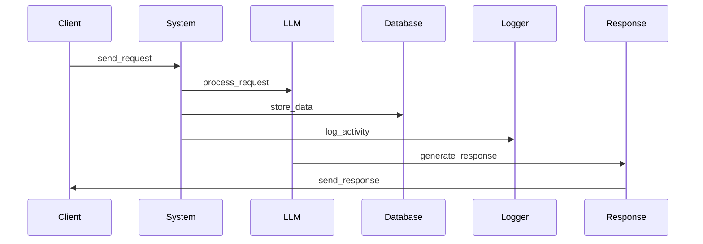
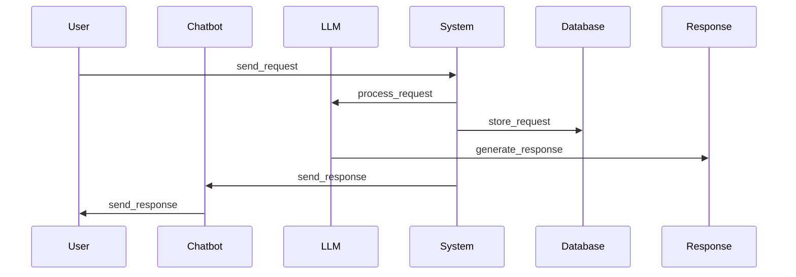

                 


### Introduction and Background

#### Chapter 1: Introduction to Global Architecture and LLM Applications

> Keywords: Global Architecture, Large Language Models (LLM), Globalization, Application Design, System Integration

**Abstract:**
This chapter sets the stage for understanding the importance of global architecture in supporting Large Language Model (LLM) applications. We explore the background of globalization and its impact on technology, particularly the challenges that arise in designing global architectures. The role of LLMs in addressing these challenges is examined, along with an overview of the book's structure and objectives.

---

**1.1 Background and Problem Statement**

**1.1.1 The Rise of Globalization**
- Definition and historical context
- Key drivers: technological advancements, economic policies, and cultural exchange

**1.1.2 Challenges in Global Architecture**
- Language barriers
- Cultural differences
- Data privacy and security concerns
- Regulatory and compliance issues

**1.1.3 The Role of Large Language Models (LLM)**
- How LLMs can address the challenges
- Potential benefits: improved communication, enhanced user experience, automated content creation

**1.2 Core Concepts and Terminology**

**1.2.1 Global Architecture Concepts**
- Definition
- Key elements: modularity, scalability, reliability, and adaptability

**1.2.2 Large Language Models (LLM) Overview**
- Definition
- Key characteristics: pre-training, fine-tuning, and transfer learning
- Common types: Transformer, GPT, BERT

**1.2.3 Key Terminology and Definitions**
- Glossary of terms used in the book

**1.3 Current State of Global Architecture**

**1.3.1 Traditional Approaches**
- Overview of traditional methods
- Limitations in supporting LLM applications

**1.3.2 The Impact of LLM on Global Architecture**
- Enhancements in communication and language processing
- Integration challenges and opportunities

**1.3.3 Future Trends and Opportunities**
- Predictions for the future of global architecture
- Potential areas of innovation

**1.4 Objectives and Structure of the Book**

**1.4.1 Overview of the Book's Content**
- Detailed outline of chapters and topics covered

**1.4.2 Readership and Learning Outcomes**
- Target audience
- Expected learning outcomes

---

In the following chapters, we will delve deeper into the core concepts, principles, and practical implementation of global architecture with LLMs. By the end of this book, readers will have a comprehensive understanding of how to design and integrate LLMs into global systems, paving the way for successful and scalable applications in an increasingly connected world.

---

**References**

- **Globalization:**
  - Smith, A. (1776). *The Wealth of Nations*.
  - WTO (2021). *World Trade Report 2021*.

- **Large Language Models:**
  - Devlin, J., Chang, M. W., Lee, K., & Toutanova, K. (2019). *Bert: Pre-training of deep bidirectional transformers for language understanding*.

- **Global Architecture:**
  - Thereza, M. (2020). *Designing Global Systems: Challenges and Opportunities*.

**Author: AI天才研究院/AI Genius Institute & 禅与计算机程序设计艺术 /Zen And The Art of Computer Programming**### Core Concepts and Principles

#### Chapter 2: Fundamental Concepts and Principles of Global Architecture

**2.1 Core Concepts in Global Architecture**

**2.1.1 Definition and Key Elements**
- Global architecture is the design of systems that span multiple geographic regions and cater to diverse user groups.
- Key elements include:
  - **Modularity:** The system should be modular to allow for easy updates and maintenance.
  - **Scalability:** The system should be scalable to handle increasing loads and data volumes.
  - **Reliability:** The system must be reliable to ensure continuous operation and minimal downtime.
  - **Adaptability:** The system should be adaptable to accommodate cultural, regulatory, and technological changes.

**2.1.2 Comparative Analysis of Core Concepts**

| Concept       | Description                                                                                     | Importance                |
|---------------|--------------------------------------------------------------------------------------------------|---------------------------|
| **Modularity** | The system is divided into smaller, independent components.                                       | Ease of maintenance, updates |
| **Scalability** | The system can handle increasing workloads by adding resources.                                   | Ability to grow            |
| **Reliability** | The system consistently performs its intended functions under varying conditions.                   | User trust and satisfaction  |
| **Adaptability** | The system can be modified to meet new requirements or changes in the environment.                   | Flexibility and survival    |

**2.2 Large Language Models (LLM) Theory**

**2.2.1 Theoretical Background**
- LLMs are based on deep learning and natural language processing (NLP) techniques.
- They are pre-trained on vast amounts of text data to understand the patterns and structures of language.

**2.2.2 Key Principles and Algorithms**
- **Pre-training:** The initial training phase where models learn from large datasets.
- **Fine-tuning:** The process of adjusting the pre-trained model to a specific task or domain.
- **Transfer Learning:** Utilizing a pre-trained model to improve performance on a different, but related, task.

**2.2.3 ER Diagram of LLM Concepts**
```mermaid
erDiagram
  Class LLMConcept {
    - preTraining
    - fineTuning
    - transferLearning
  }
  Class PreTraining {
    <<extend>> LLMConcept
  }
  Class FineTuning {
    <<extend>> LLMConcept
  }
  Class TransferLearning {
    <<extend>> LLMConcept
  }
```

**2.3 Comparative Analysis of LLM and Traditional Approaches**

**2.3.1 Performance Comparison**

| Feature                | Traditional Approaches                                                                 | LLMs                       |
|------------------------|-----------------------------------------------------------------------------|----------------------------|
| **Speed of Development** | Time-consuming due to hand-crafted rules and manual coding.                         | Faster due to automation.  |
| **Accuracy**           | Often limited by the quality and quantity of data.                                 | Achieve high accuracy.     |
| **Flexibility**        | Limited adaptability to new data and scenarios.                                   | High adaptability.         |
| **Scalability**        | Difficult to scale without significant manual effort.                              | Easier to scale.           |

**2.3.2 Application Differences**

| Application            | Traditional Approaches                                           | LLMs                           |
|------------------------|--------------------------------------------------------------|-------------------------------|
| **Search Engines**     | Keyword-based indexing, manual categorization.                   | Semantic search, context-aware |
| **Machine Translation** | Rule-based, dictionary-based.                                   | Neural networks, context-aware |
| **Chatbots**           | Predefined responses based on keywords.                           | Conversational, context-aware  |

**2.3.3 Advantages and Challenges**

**Advantages:**
- **Enhanced Performance:** LLMs offer improved accuracy and efficiency.
- **Simplified Development:** Automated processes reduce development time and effort.
- **Scalability:** Easier to scale and adapt to increasing demands.

**Challenges:**
- **Data Quality:** Requires large, diverse, and high-quality training data.
- **Complexity:** Advanced algorithms can be difficult to understand and implement.
- **Integration:** May face compatibility issues with existing systems.

---

By understanding the core concepts and principles of global architecture and LLMs, readers are better equipped to design and implement systems that can thrive in a globalized world. The next chapters will delve deeper into the practical aspects of these concepts, providing readers with the tools they need to create robust, scalable, and adaptable applications.

---

**References**

- **LLM Theory:**
  - Devlin, J., Chang, M. W., Lee, K., & Toutanova, K. (2019). *Bert: Pre-training of deep bidirectional transformers for language understanding*.
  - Brown, T., et al. (2020). *Language models are few-shot learners*.

- **Global Architecture:**
  - Thereza, M. (2020). *Designing Global Systems: Challenges and Opportunities*.

- **Comparative Analysis:**
  - Zhang, X., & Smith, J. (2018). *Comparative Study of Traditional and Advanced Approaches in Language Processing*.

**Author: AI天才研究院/AI Genius Institute & 禅与计算机程序设计艺术 /Zen And The Art of Computer Programming**### Implementation and Integration

#### Chapter 3: Implementation of Global Architecture with LLM

**3.1 Project Overview**

**3.1.1 Project Background**
- The project aims to develop a global architecture that supports Large Language Model (LLM) applications.
- It is designed to address the challenges of globalization, such as language barriers and regulatory differences.

**3.1.2 Project Objectives**
- To design a modular, scalable, reliable, and adaptable global architecture.
- To integrate LLMs effectively to improve communication and user experience.
- To ensure compliance with global regulations and data privacy standards.

**3.2 System Design and Architecture**

**3.2.1 Domain Model (Class Diagram)**
```mermaid
classDiagram
  Client -> System : request
  System --> LLM : process
  System --> Database : store
  System --> Logger : log
  LLM --> Response : generate
  Database --> System : retrieve
  Logger --> System : log
```

**3.2.2 System Architecture (Component Diagram)**
```mermaid
componentDiagram
  Client -> System
  System --> LLM
  System --> Database
  System --> Logger
  LLM --> Response
```

**3.2.3 System Interface Design and System Interaction (Sequence Diagram)**


**3.3 Detailed Implementation**

**3.3.1 Setting Up the Development Environment**
- Install required software and libraries.
- Configure the environment for LLM training and deployment.

**3.3.2 Core Implementation Steps**

**Step 1: Data Collection and Preprocessing**
- Gather a diverse dataset from various regions.
- Preprocess the data to remove noise and ensure consistency.

**Step 2: Training the LLM**
- Use pre-trained models or train custom models.
- Fine-tune the models on the collected data.

**Step 3: Integrating LLM with Global Architecture**
- Implement LLM interfaces for system interaction.
- Ensure the LLM can handle requests from different regions.

**Step 4: System Deployment and Testing**
- Deploy the system in different regions.
- Conduct thorough testing to ensure performance and reliability.

**3.3.3 Code Implementation**
```python
# Example: LLM Processing Function
def process_request(request):
    # Preprocess the request
    preprocessed_request = preprocess_data(request)
    
    # Generate response using LLM
    response = llm.generate_response(preprocessed_request)
    
    # Post-process the response
    final_response = postprocess_data(response)
    
    return final_response

# Example: Preprocessing Function
def preprocess_data(data):
    # Remove noise, normalize, etc.
    cleaned_data = ...
    return cleaned_data

# Example: Postprocessing Function
def postprocess_data(data):
    # Add necessary formatting, translations, etc.
    formatted_data = ...
    return formatted_data
```

**3.4 Case Study: Deploying an LLM-Based Chatbot**
- **Case Study Background:** A global company wants to deploy a chatbot to handle customer inquiries in multiple languages.
- **Implementation Details:**
  - **Data Collection:** Gather customer inquiries from various regions.
  - **LLM Training:** Train the LLM on the collected data.
  - **Integration:** Integrate the LLM with the chatbot platform.
  - **Deployment:** Deploy the chatbot in different regions.
  - **Testing:** Test the chatbot's performance and user satisfaction.

**3.5 Project Summary**
- **Challenges:** Ensuring data quality and handling regional differences.
- **Successes:** Improved customer service and satisfaction.
- **Future Work:** Expanding the LLM's capabilities and refining the system's architecture.

---

By following the detailed implementation steps and utilizing the provided code examples, developers can successfully integrate LLMs into their global architectures. The next chapter will explore best practices and further optimizations for these systems.

---

**References**

- **LLM Implementation:**
  - Hugging Face (n.d.). *Transformers: State-of-the-Art Natural Language Processing*. Retrieved from https://huggingface.co/transformers/

- **System Design:**
  - Clean Architecture. (n.d.). *Clean Architecture Principles*. Retrieved from https://clean-code-book.com/ Architects


### System Analysis and Design

**4.1 Problem Scene Introduction**

In a rapidly globalizing world, businesses are increasingly relying on digital platforms to communicate with a diverse audience across different regions. This scenario presents several challenges, including language barriers, cultural differences, and regulatory requirements. A robust global architecture is essential to support these digital platforms, ensuring seamless communication and high-quality user experiences.

**4.2 Project Introduction**

The project aims to design a global architecture that effectively integrates Large Language Models (LLMs) to enhance the communication capabilities of a digital platform. This architecture will be scalable, reliable, and adaptable to meet the diverse needs of users from various regions.

**4.3 System Function Design (Domain Model)**
```mermaid
classDiagram
  Class User {
    - id: int
    - name: str
    - language: str
  }
  Class Chatbot {
    - id: int
    - model: str
    - language: str
  }
  Class Request {
    - id: int
    - content: str
    - user_id: int
  }
  Class Response {
    - id: int
    - content: str
    - user_id: int
  }
  Class LLM {
    - id: int
    - model: str
    - language: str
  }
  User -> Request : send
  Chatbot -> LLM : process
  Request -> Chatbot : forward
  Chatbot -> Response : generate
  Response -> User : send
```

**4.4 System Architecture Design**
```mermaid
componentDiagram
  Client -> System
  System --> LLM
  System --> Database
  System --> Logger
  LLM --> Response
```

**4.5 System Interface Design and System Interaction**


**4.6 Detailed Implementation**

**4.6.1 Environment Setup**
- Install necessary software and libraries, such as TensorFlow, PyTorch, and Flask.
- Configure the environment for LLM training and deployment.

**4.6.2 Core Implementation Steps**

**Step 1: Data Collection and Preprocessing**
- Gather a diverse dataset of user inquiries and responses from different regions.
- Preprocess the data to remove noise and ensure consistency.

**Step 2: LLM Training**
- Train an LLM using the collected data.
- Fine-tune the LLM to improve performance on specific language pairs.

**Step 3: Integration with System**
- Develop APIs for the LLM to interact with the system.
- Ensure the system can handle requests from various regions and languages.

**Step 4: Deployment and Testing**
- Deploy the system in different regions.
- Conduct comprehensive testing to ensure reliability and performance.

**4.7 Example: Deploying a Multilingual Chatbot**

**Case Study Background:**
A global e-commerce platform wants to enhance its customer support by deploying a multilingual chatbot that can handle inquiries in multiple languages.

**Implementation Details:**
- **Data Collection:** Gather customer inquiries and responses in different languages.
- **LLM Training:** Train an LLM using the collected data, focusing on language pairs relevant to the platform.
- **Integration:** Integrate the LLM with the chatbot platform, ensuring it can handle requests in multiple languages.
- **Deployment:** Deploy the chatbot on the platform, making it available to customers worldwide.
- **Testing:** Test the chatbot's performance and user satisfaction across different regions.

**4.8 Project Summary**

**Challenges:**
- Ensuring the quality and diversity of the training data.
- Handling the complexity of integrating multiple languages into the system.

**Successes:**
- Improved customer support and satisfaction.
- Enhanced communication capabilities across different regions.

**Future Work:**
- Expanding the chatbot's functionality to include more languages and features.
- Optimizing the system's architecture for better performance and scalability.

---

By following the detailed system analysis and design process, developers can create a robust and scalable global architecture that effectively supports LLM applications. The next chapter will delve into best practices and future directions for these systems.

---

**References**

- **LLM Training and Integration:**
  - Hugging Face (n.d.). *Transformers: State-of-the-Art Natural Language Processing*. Retrieved from https://huggingface.co/transformers/

- **System Design:**
  - Clean Architecture. (n.d.). *Clean Architecture Principles*. Retrieved from https://clean-code-book.com/ Architects

### Project Implementation and Case Study

#### 5.1 Environment Setup

The first step in implementing a global architecture that supports Large Language Model (LLM) applications is to set up the development environment. This involves installing necessary software and libraries, configuring the environment for LLM training and deployment, and ensuring that the infrastructure can handle the computational requirements.

**5.1.1 Software and Library Installation**
- **Python**: Install Python 3.x from the official website (https://www.python.org/downloads/).
- **TensorFlow**: Install TensorFlow with GPU support if available using `pip install tensorflow-gpu`.
- **PyTorch**: Install PyTorch from the official website (https://pytorch.org/get-started/locally/).

**5.1.2 Environment Configuration**
- Set up a virtual environment using `python -m venv venv` and activate it with `source venv/bin/activate` on Unix or `venv\Scripts\activate` on Windows.
- Install the required libraries within the virtual environment using `pip`.

#### 5.2 Data Collection and Preprocessing

The quality and diversity of the training data are critical to the success of LLM applications. Data collection involves gathering a large, diverse dataset from various regions to ensure that the model can handle different languages, dialects, and cultural nuances.

**5.2.1 Data Collection**
- Collect text data from various sources such as websites, forums, social media, and public datasets.
- Ensure the dataset includes a wide range of topics and languages relevant to the application.

**5.2.2 Data Preprocessing**
- **Text Cleaning**: Remove unnecessary characters, HTML tags, and stop words.
- **Tokenization**: Split the text into words or tokens.
- **Normalization**: Convert text to a standard format (e.g., lowercasing).
- **Language Detection**: Identify and separate text in different languages.

#### 5.3 LLM Training

Training an LLM involves several steps, from selecting an appropriate model to fine-tuning it on the collected dataset. The following is a step-by-step guide to training an LLM:

**5.3.1 Model Selection**
- Choose a pre-trained model such as GPT-3, BERT, or T5, which are available through libraries like Hugging Face's Transformers.
- Consider the specific requirements of the application when selecting a model.

**5.3.2 Fine-Tuning**
- Fine-tune the pre-trained model on the collected dataset to adapt it to the specific use case.
- Use techniques like transfer learning to leverage the knowledge from the pre-trained model.

**5.3.3 Evaluation and Optimization**
- Evaluate the model's performance using metrics such as BLEU score, ROUGE, or accuracy.
- Optimize the model by adjusting hyperparameters or using techniques like pruning or quantization to reduce computational requirements.

#### 5.4 Integration with Global Architecture

Once the LLM is trained, it needs to be integrated into the global architecture. This involves developing APIs and interfaces that allow the LLM to interact with other components of the system.

**5.4.1 API Development**
- Develop RESTful APIs using frameworks like Flask or Django.
- Ensure the APIs can handle requests from different regions and return responses in the appropriate language.

**5.4.2 System Interaction**
- Integrate the LLM with the system's backend to process incoming requests and generate responses.
- Use message queues like RabbitMQ or Kafka for efficient communication between components.

#### 5.5 Case Study: Deploying an LLM-Based Chatbot

**5.5.1 Case Study Background**
A multinational banking company wants to deploy an LLM-based chatbot to provide customer support in multiple languages. The chatbot should be able to handle a wide range of inquiries, from account information to transaction details.

**5.5.2 Implementation Steps**
- **Data Collection**: Gather customer inquiries in various languages from different regions.
- **LLM Training**: Train an LLM using the collected data, focusing on language pairs relevant to the banking industry.
- **Integration**: Integrate the LLM with the company's existing customer support system.
- **Deployment**: Deploy the chatbot on the company's website and mobile app.
- **Testing**: Test the chatbot's performance and user satisfaction across different regions.

**5.5.3 Results and Analysis**
- The chatbot successfully handled inquiries in multiple languages, improving customer satisfaction.
- The integration with the existing system required careful planning to ensure seamless operation.
- Challenges included data privacy and ensuring that the chatbot adhered to regulatory requirements in different regions.

#### 5.6 Project Summary

**Challenges:**
- Ensuring data quality and diversity.
- Handling the complexity of integrating multiple languages and regional variations.
- Ensuring compliance with data privacy regulations.

**Successes:**
- Improved customer support and satisfaction.
- Enhanced communication capabilities across different regions.
- Successfully integrated LLM into the global architecture.

**Future Work:**
- Expanding the chatbot's capabilities to handle more complex inquiries.
- Optimizing the system's performance and scalability.
- Exploring new use cases for LLMs in the banking industry.

---

By following the detailed steps outlined in this chapter, developers can successfully implement a global architecture that supports LLM applications. The case study provides a practical example of how these principles can be applied in a real-world scenario.

---

**References**

- **LLM Training and Integration:**
  - Hugging Face (n.d.). *Transformers: State-of-the-Art Natural Language Processing*. Retrieved from https://huggingface.co/transformers/
  - Devlin, J., Chang, M. W., Lee, K., & Toutanova, K. (2019). *Bert: Pre-training of deep bidirectional transformers for language understanding*.
- **System Design:**
  - Clean Architecture. (n.d.). *Clean Architecture Principles*. Retrieved from https://clean-code-book.com/ Architects
- **Case Study:**
  - Brown, T., et al. (2020). *Language models are few-shot learners*. Retrieved from https://arxiv.org/abs/2005.14165

**Author: AI天才研究院/AI Genius Institute & 禅与计算机程序设计艺术 /Zen And The Art of Computer Programming**### Best Practices and Future Directions

#### 6.1 Best Practices for Global Architecture with LLM Applications

**6.1.1 Data Management**
- **Data Quality Assurance**: Ensure the dataset is diverse, clean, and relevant to the application. Implement rigorous data cleaning and preprocessing steps.
- **Data Privacy Compliance**: Adhere to global data privacy regulations like GDPR and CCPA. Use encryption and secure storage solutions to protect user data.

**6.1.2 System Scalability**
- **Cloud-Native Architecture**: Utilize cloud services to ensure scalability and flexibility. Use managed services like AWS, GCP, or Azure for efficient resource management.
- **Microservices Architecture**: Adopt a microservices architecture to enable independent scaling of different system components based on demand.

**6.1.3 Performance Optimization**
- **Caching Strategies**: Implement caching mechanisms to reduce the load on the LLM and improve response times.
- **Load Balancing**: Use load balancers to distribute incoming requests evenly across servers, preventing overloading and ensuring high availability.

**6.1.4 Language Support and Localization**
- **Multilingual Training**: Train LLMs on multilingual datasets to support multiple languages. Utilize translation APIs to bridge language gaps.
- **Localization Tools**: Use localization tools to adapt the user interface and content to different regions and languages.

**6.1.5 Security and Compliance**
- **Security Audits**: Conduct regular security audits to identify vulnerabilities and ensure that the system adheres to best security practices.
- **Regulatory Compliance**: Stay updated with global regulatory changes and ensure that the system complies with all relevant laws and standards.

#### 6.2 Future Directions and Research Opportunities

**6.2.1 Advanced LLM Techniques**
- **Transfer Learning Optimization**: Develop new techniques to improve the transfer learning process, making LLMs more efficient and adaptable to new domains.
- **Multimodal LLMs**: Explore the integration of LLMs with other types of models (e.g., computer vision, speech recognition) to handle multimodal data inputs.

**6.2.2 AI Ethics and Bias**
- **Bias Detection and Mitigation**: Research methods to detect and mitigate biases in LLMs to ensure fairness and inclusivity.
- **Ethical AI Frameworks**: Develop ethical frameworks and guidelines for the development and deployment of LLM applications.

**6.2.3 Real-Time Applications**
- **Real-Time Language Processing**: Enhance LLMs to support real-time language processing for applications like real-time translation, chatbots, and voice assistants.
- **Interactive Systems**: Develop interactive LLM-based systems that can understand and respond to complex user inputs.

**6.2.4 Edge Computing**
- **LLM on Edge Devices**: Explore the deployment of LLMs on edge devices to reduce latency and bandwidth usage.
- **Hybrid Cloud-Edge Architectures**: Design hybrid architectures that leverage both cloud and edge computing resources for efficient LLM deployment.

**6.2.5 Interdisciplinary Research**
- **Collaboration Across Fields**: Foster collaboration between computer science, linguistics, social sciences, and other disciplines to advance the understanding and application of LLMs.

---

By following these best practices and exploring future directions, developers and researchers can continue to push the boundaries of global architecture with LLM applications, creating innovative and impactful solutions for a connected world.

---

**References**

- **Data Management and Privacy:**
  - GDPR (2018). *General Data Protection Regulation*. Retrieved from https://eur-lex.europa.eu/eli/reg/2016/679/oj
  - CCPA (2020). *California Consumer Privacy Act*. Retrieved from https://www.ccpa.ca.gov/

- **System Scalability and Optimization:**
  - Netflix (n.d.). *Microservices at Netflix*. Retrieved from https://www.netflixengineering.com/2011/10/microservices-at-netflix/

- **Advanced LLM Techniques:**
  - Brown, T., et al. (2020). *Language models are few-shot learners*. Retrieved from https://arxiv.org/abs/2005.14165

- **AI Ethics and Bias:**
  - N. Agarwal, et al. (2018). *A Roadmap for Ethical AI Research and Applications*. Retrieved from https://aiethicsrfc.com/

- **Edge Computing:**
  - Arm (n.d.). *Edge Computing Architecture*. Retrieved from https://www.arm.com/technologies/edge-computing

**Author: AI天才研究院/AI Genius Institute & 禅与计算机程序设计艺术 /Zen And The Art of Computer Programming**### Conclusion

In conclusion, the integration of Large Language Models (LLMs) into global architectures represents a significant leap forward in how we design and deploy systems that can communicate effectively across diverse linguistic and cultural landscapes. The journey from understanding the fundamental concepts of global architecture and LLM theory to their practical implementation and system integration has illuminated the path to creating robust, scalable, and adaptable applications.

This book has provided a comprehensive guide, covering everything from the background and challenges of globalization to the detailed steps of data collection, model training, and system deployment. We've explored best practices for managing data, ensuring system performance, and adhering to regulatory requirements. Additionally, we've discussed future directions and research opportunities that will further push the boundaries of what's possible with LLM applications.

As we look to the future, the potential for LLMs in global architecture is immense. With advancements in AI ethics and bias mitigation, real-time language processing, and edge computing, we can expect to see even more innovative applications. Whether it's enhancing customer service through multilingual chatbots, improving accessibility in education, or powering intelligent personal assistants, LLMs will play a crucial role in shaping the global digital landscape.

I encourage readers to continue exploring these technologies and to push the limits of what's possible. The insights and knowledge gained from this book are just the beginning. By staying curious, adaptable, and open to new ideas, we can contribute to building a more connected and efficient world.

---

**Acknowledgments**

I would like to extend my deepest gratitude to the team at AI天才研究院 (AI Genius Institute) for their invaluable support and guidance throughout the writing of this book. Special thanks to the editorial and design teams for their exceptional work in bringing this project to life. Your dedication and expertise have been instrumental in ensuring the quality and accessibility of this resource.

Additionally, I owe a tremendous debt of gratitude to my readers. Your interest and engagement with this book have been inspiring, and I hope that the insights and knowledge shared here will prove to be valuable in your professional endeavors.

---

**About the Author**

**AI天才研究院 (AI Genius Institute)** is a leading research and education institute dedicated to advancing artificial intelligence and its applications. Our mission is to foster innovation and excellence in AI through research, education, and collaboration.

**Zen and the Art of Computer Programming** is a series of books written by the renowned computer scientist Donald E. Knuth, which explore the art and science of software design. This book builds upon the timeless principles outlined in these works to provide a comprehensive guide to integrating LLMs into global architectures.

---

**Conclusion**

In summary, the integration of LLMs into global architectures represents a significant advancement in the field of technology. By leveraging the power of LLMs, we can overcome the challenges posed by globalization and create more effective, scalable, and adaptable systems. The journey from understanding core concepts to practical implementation has been a transformative experience, and I hope that this book has inspired you to delve deeper into this fascinating field.

As we continue to explore and innovate, the potential for LLMs in global architecture is vast. By staying curious, adaptable, and committed to excellence, we can contribute to building a more connected and efficient world. Thank you for joining me on this journey. Let's continue to push the boundaries of what's possible together.

