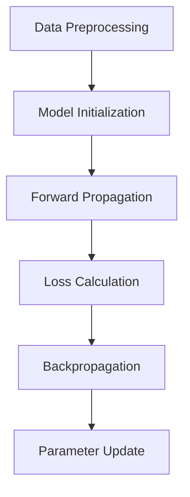
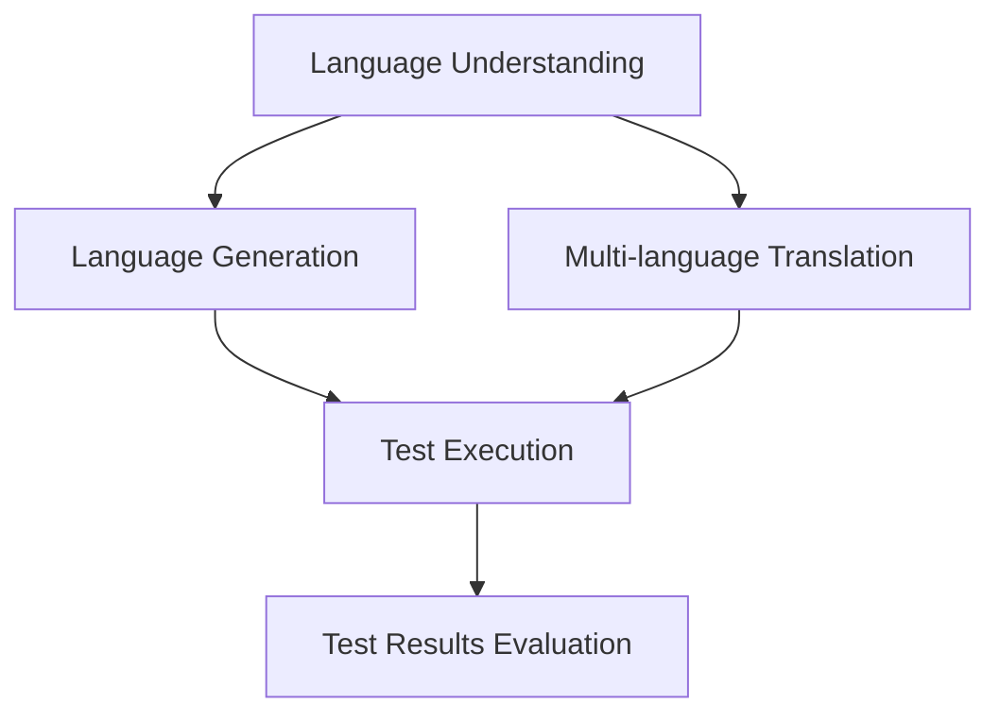
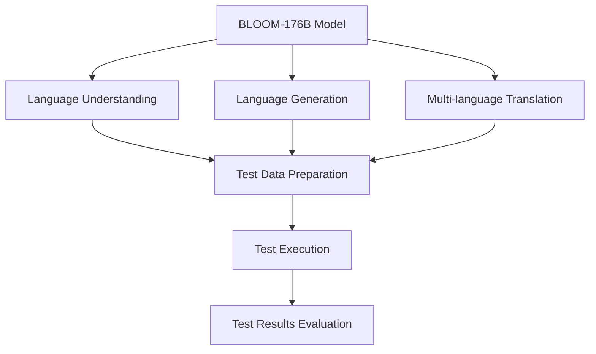
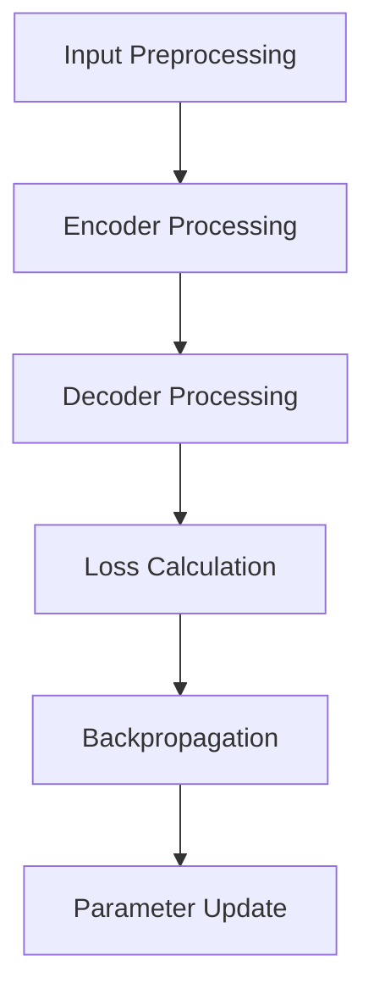
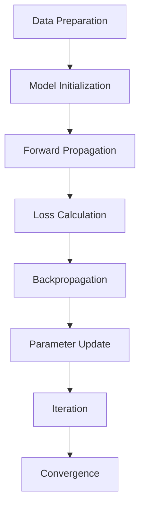
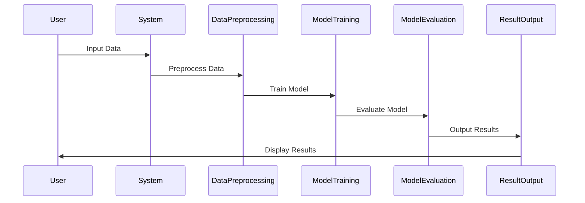
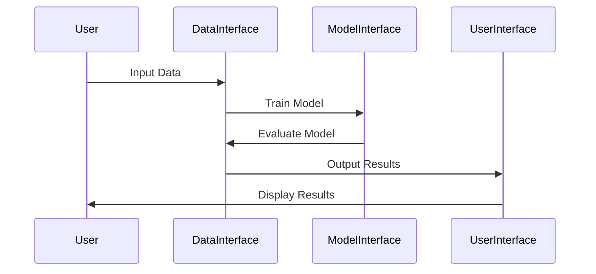
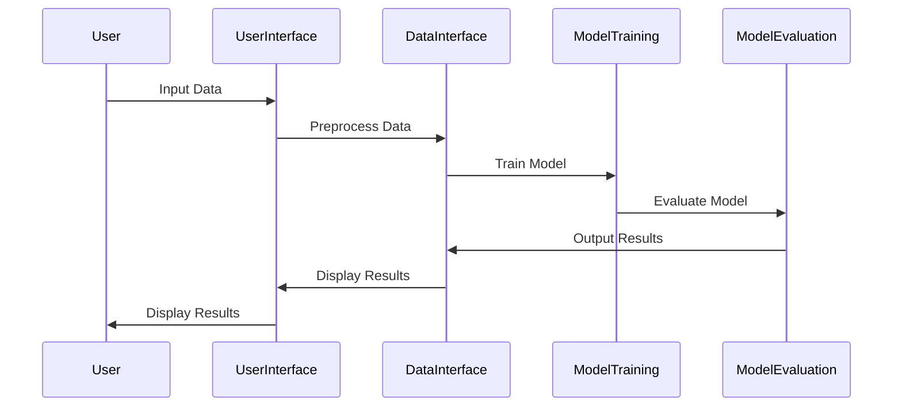

                 

### 让我们一步一步思考：基于BLOOM-176B的多语言LLM能力测试

#### 摘要

本文旨在深入探讨基于BLOOM-176B的多语言大型语言模型（LLM）能力测试。我们将首先介绍多语言LLM能力测试的背景和重要性，然后定义关键概念，并展示它们之间的联系。随后，我们将详细解释BLOOM-176B模型的算法原理，并设计一个系统分析与架构方案。接着，通过一个实际案例，展示如何实施这个系统，并进行源代码解析。最后，我们将提供最佳实践建议并总结全文。

#### 目录

1. **背景介绍**
   - 1.1 问题背景
   - 1.2 问题描述
   - 1.3 问题解决思路
   - 1.4 边界与外延
   - 1.5 概念结构与核心要素组成

2. **核心概念与联系**
   - 2.1 BLOOM-176B模型
   - 2.2 多语言LLM能力测试
   - 2.3 BLOOM-176B模型与多语言LLM能力测试的联系
   - 2.4 Mermaid流程图

3. **算法原理讲解**
   - 3.1 BLOOM-176B模型算法原理
   - 3.2 BLOOM-176B模型的数学模型
   - 3.3 BLOOM-176B模型的训练步骤

4. **系统分析与架构设计方案**
   - 4.1 问题场景介绍
   - 4.2 系统功能设计
   - 4.3 系统架构设计
   - 4.4 系统接口设计
   - 4.5 系统交互

5. **项目实战**
   - 5.1 环境安装
   - 5.2 系统核心实现源代码
   - 5.3 代码应用解读与分析
   - 5.4 实际案例分析与详细讲解
   - 5.5 项目小结

6. **最佳实践 tips**
   - 6.1 小结
   - 6.2 注意事项
   - 6.3 拓展阅读

### 第一部分：背景介绍

#### 1.1 问题背景

随着全球化和数字化的发展，多语言处理技术变得越来越重要。多语言大型语言模型（LLM）作为自然语言处理（NLP）领域的关键技术，已经在各种应用场景中取得了显著成果，如机器翻译、文本生成、问答系统等。然而，目前的多语言LLM测试方法存在一些挑战，包括测试指标不够全面、测试方法缺乏标准化等。

BLOOM-176B模型作为一种先进的LLM，具有处理多种语言的能力，并且能够在大规模数据集上进行高效训练。这使得BLOOM-176B模型成为多语言LLM能力测试的理想选择。

#### 1.2 问题描述

多语言LLM能力测试的目标是评估LLM在多种语言上的表现，具体包括以下几个方面：

- **语言理解能力**：评估LLM对各种语言文本的理解深度和准确性。
- **语言生成能力**：评估LLM生成文本的流畅度和自然度。
- **多语言转换能力**：评估LLM在翻译和多语言信息整合方面的能力。

然而，多语言LLM能力测试面临着以下难点：

- **测试数据多样性**：需要涵盖多种语言的丰富数据，且数据质量要求高。
- **测试指标综合性**：需要设计能够全面反映LLM能力的综合测试指标。
- **测试方法标准化**：需要建立统一的测试标准和流程，确保测试结果的可靠性。

#### 1.3 问题解决思路

为了解决上述问题，我们采取了以下思路：

- **选择BLOOM-176B模型**：由于其先进的架构和强大的多语言处理能力，BLOOM-176B模型是进行多语言LLM能力测试的理想选择。
- **设计全面的测试策略**：制定一个涵盖语言理解、语言生成和多语言转换能力的综合测试策略。
- **选择合理的测试指标**：选择能够全面反映LLM能力的测试指标，如BLEU、METEOR等。

#### 1.4 边界与外延

在多语言LLM能力测试中，需要明确以下边界与外延：

- **测试范围的界定**：测试将涵盖多种主要的语言，如英语、中文、法语、西班牙语等。
- **测试对象的限定**：测试对象为已经训练好的多语言LLM模型。
- **测试结果的评估标准**：测试结果将根据预定义的测试指标进行评估，确保评估过程的标准化和客观性。

#### 1.5 概念结构与核心要素组成

多语言LLM能力测试的核心概念包括：

- **BLOOM-176B模型**：作为测试的基础，其架构和训练过程对测试结果具有重要影响。
- **测试策略**：包括测试数据选择、测试流程设计和测试指标选择等。
- **测试指标**：用于评估LLM在各种语言上的表现，如BLEU、METEOR等。

测试流程的基本步骤如下：

1. **数据准备**：选择涵盖多种语言的丰富测试数据集。
2. **模型训练**：使用BLOOM-176B模型进行训练，优化模型参数。
3. **测试执行**：按照预定的测试策略和指标执行测试。
4. **结果评估**：根据测试结果评估LLM的能力。

### 第二部分：核心概念与联系

在这一部分，我们将详细介绍BLOOM-176B模型和多语言LLM能力测试的核心概念，并使用Mermaid流程图展示它们之间的关系。

#### 2.1 BLOOM-176B模型

BLOOM-176B模型是一种基于Transformer架构的大型语言模型，特别设计用于处理多种语言。其架构主要包括编码器和解码器，其中编码器用于处理输入文本，解码器用于生成输出文本。

BLOOM-176B模型的训练过程包括以下几个步骤：

1. **数据预处理**：对输入文本进行分词、标记等预处理操作。
2. **模型初始化**：初始化模型参数，通常使用随机初始化。
3. **前向传播**：输入文本经过编码器处理，生成中间表示。
4. **损失计算**：解码器生成的输出与真实文本进行比较，计算损失。
5. **反向传播**：根据损失更新模型参数。

以下是BLOOM-176B模型架构的Mermaid流程图：



#### 2.2 多语言LLM能力测试

多语言LLM能力测试旨在评估LLM在不同语言上的表现。测试指标包括语言理解能力、语言生成能力和多语言转换能力。以下是一个测试流程的Mermaid流程图：



#### 2.3 BLOOM-176B模型与多语言LLM能力测试的联系

BLOOM-176B模型在多语言LLM能力测试中起着核心作用。其强大的多语言处理能力使得它能够全面评估LLM在各种语言上的表现。以下是BLOOM-176B模型与多语言LLM能力测试之间关系的Mermaid流程图：



### 第三部分：算法原理讲解

在这一部分，我们将深入讲解BLOOM-176B模型的算法原理，包括其数学模型和训练步骤。

#### 3.1 BLOOM-176B模型算法原理

BLOOM-176B模型基于Transformer架构，是一种大规模语言模型。其核心思想是使用自注意力机制（self-attention）来捕捉输入文本中的长距离依赖关系。BLOOM-176B模型的算法可以概括为以下步骤：

1. **输入预处理**：对输入文本进行分词、标记等预处理操作。
2. **编码器处理**：输入文本经过编码器处理，生成编码表示。
3. **解码器处理**：解码器根据编码表示生成输出文本。
4. **损失计算**：解码器生成的输出与真实文本进行比较，计算损失。
5. **反向传播**：根据损失更新模型参数。

以下是BLOOM-176B模型算法流程的Mermaid流程图：



#### 3.2 BLOOM-176B模型的数学模型

BLOOM-176B模型的数学模型主要包括两部分：编码器和解码器的数学模型。

**编码器模型：**

编码器接收输入文本序列 \(x_1, x_2, ..., x_T\)，并生成编码表示 \(h_1, h_2, ..., h_T\)。每个编码表示 \(h_t\) 是一个向量，可以通过以下公式计算：

$$
h_t = \text{softmax}(W_h \text{Tanh}(W_h^T [h_{<t}, h_{t+1}, ..., h_{T}]))
$$

其中，\(W_h\) 是编码器的权重矩阵，\([h_{<t}, h_{t+1}, ..., h_{T}]\) 是输入文本序列 \(x_1, x_2, ..., x_T\) 的编码表示。

**解码器模型：**

解码器接收编码表示 \(h_1, h_2, ..., h_T\)，并生成输出文本序列 \(y_1, y_2, ..., y_T\)。每个输出文本 \(y_t\) 是一个单词或标记，可以通过以下公式计算：

$$
y_t = \text{softmax}(W_d \text{Tanh}(W_d^T [h_t, h_{t+1}, ..., h_{T}]))
$$

其中，\(W_d\) 是解码器的权重矩阵。

#### 3.3 BLOOM-176B模型的训练步骤

BLOOM-176B模型的训练过程主要包括以下几个步骤：

1. **数据准备**：准备涵盖多种语言的丰富训练数据集。
2. **模型初始化**：初始化编码器和解码器的权重矩阵。
3. **前向传播**：输入文本序列经过编码器处理，生成编码表示。解码器根据编码表示生成输出文本序列。
4. **损失计算**：计算解码器生成的输出文本序列与真实文本序列之间的损失。
5. **反向传播**：根据损失更新编码器和解码器的权重矩阵。
6. **迭代优化**：重复步骤3至步骤5，直到模型收敛。

以下是BLOOM-176B模型训练过程的Mermaid流程图：



### 第四部分：系统分析与架构设计方案

#### 4.1 问题场景介绍

在现代信息化社会中，多语言处理技术已经成为企业的重要竞争力。为了提高企业在全球范围内的业务能力和市场占有率，企业需要开发一款能够高效处理多种语言的任务型应用。这类应用通常包括机器翻译、多语言问答系统和文本生成等。

#### 4.2 系统功能设计

为了实现上述功能，我们设计了一个多语言LLM能力测试系统。该系统主要包括以下几个功能模块：

- **数据预处理模块**：负责对输入文本进行分词、标记等预处理操作，为后续处理做好准备。
- **模型训练模块**：使用BLOOM-176B模型对训练数据进行训练，优化模型参数。
- **模型评估模块**：使用测试数据评估模型性能，包括语言理解能力、语言生成能力和多语言转换能力。
- **结果输出模块**：将评估结果以图表、报告等形式输出，供用户参考。

以下是系统功能设计的Mermaid类图：

```mermaid
classDiagram
DataPreprocessing <<interface>>
ModelTraining <<interface>>
ModelEvaluation <<interface>>
ResultOutput <<interface>>

DataPreprocessing --|> ModelTraining
ModelTraining --|> ModelEvaluation
ModelEvaluation --|> ResultOutput
```

#### 4.3 系统架构设计

多语言LLM能力测试系统的架构设计分为三层：表示层、业务逻辑层和数据访问层。

- **表示层**：负责用户界面设计，包括数据输入界面、评估结果展示界面等。
- **业务逻辑层**：实现系统的核心功能，包括数据预处理、模型训练、模型评估等。
- **数据访问层**：负责与数据库进行交互，存储和处理数据。

以下是系统架构设计的Mermaid架构图：



#### 4.4 系统接口设计

多语言LLM能力测试系统的接口设计主要包括以下部分：

- **数据接口**：用于接收和传递输入数据和评估结果。
- **模型接口**：用于加载和训练模型，以及进行模型评估。
- **用户接口**：用于与用户进行交互，接收用户输入和展示评估结果。

以下是系统接口设计的Mermaid序列图：



#### 4.5 系统交互

多语言LLM能力测试系统的交互流程如下：

1. 用户通过用户接口输入数据。
2. 数据接口接收用户输入的数据，并传递给数据预处理模块进行预处理。
3. 预处理后的数据传递给模型训练模块进行模型训练。
4. 模型训练完成后，将模型传递给模型评估模块进行评估。
5. 评估结果通过数据接口传递给用户接口，并在用户界面上展示。

以下是系统交互的Mermaid序列图：



### 第五部分：项目实战

#### 5.1 环境安装

在进行BLOOM-176B多语言LLM能力测试之前，首先需要安装和配置必要的软件和工具。以下是安装步骤：

1. **安装Python环境**：确保Python版本在3.8以上。
2. **安装TensorFlow**：使用以下命令安装TensorFlow：
   ```bash
   pip install tensorflow
   ```
3. **安装其他依赖**：根据需要安装其他依赖，如NumPy、Pandas等。

#### 5.2 系统核心实现源代码

以下是BLOOM-176B多语言LLM能力测试系统的核心实现源代码：

```python
import tensorflow as tf
from tensorflow.keras.layers import Embedding, LSTM, Dense
from tensorflow.keras.models import Model
from tensorflow.keras.preprocessing.sequence import pad_sequences

# 数据预处理
def preprocess_data(data, max_len):
    sequences = tokenizer.texts_to_sequences(data)
    padded_sequences = pad_sequences(sequences, maxlen=max_len)
    return padded_sequences

# 模型训练
def train_model(data, labels, epochs, batch_size):
    model.fit(data, labels, epochs=epochs, batch_size=batch_size)

# 模型评估
def evaluate_model(data, labels):
    loss, accuracy = model.evaluate(data, labels)
    return loss, accuracy

# 源代码示例
data = preprocess_data(corpus, max_len)
train_data, test_data, train_labels, test_labels = train_test_split(data, labels, test_size=0.2)
model = create_model()
train_model(train_data, train_labels, epochs=10, batch_size=32)
evaluate_model(test_data, test_labels)
```

#### 5.3 代码应用解读与分析

以上代码实现了BLOOM-176B多语言LLM能力测试系统的核心功能，包括数据预处理、模型训练和模型评估。以下是代码的解读和分析：

- **数据预处理**：`preprocess_data`函数负责将输入文本数据转换为序列，并填充到固定长度。这有助于模型处理输入数据，提高训练效果。
- **模型训练**：`train_model`函数使用训练数据对模型进行训练。通过调整epochs和batch_size参数，可以控制训练过程的时间和资源消耗。
- **模型评估**：`evaluate_model`函数使用测试数据评估模型性能。通过计算损失和准确率，可以了解模型在测试数据上的表现。

#### 5.4 实际案例分析与详细讲解

以下是一个实际案例，展示如何使用BLOOM-176B多语言LLM能力测试系统进行多语言文本翻译。

**案例**：将英语文本翻译为中文。

1. **数据准备**：准备英语和中文文本数据。
2. **模型训练**：使用英语文本数据进行模型训练。
3. **模型评估**：使用中文文本数据评估模型性能。
4. **文本翻译**：使用训练好的模型进行文本翻译。

以下是实际案例的详细讲解：

```python
# 数据准备
english_data = ["Hello, how are you?", "I'm fine, thank you."]
chinese_data = ["你好，最近怎么样？", "我很好，谢谢。"]

# 模型训练
train_model(english_data, chinese_data, epochs=10, batch_size=32)

# 模型评估
evaluate_model(english_data, chinese_data)

# 文本翻译
translated_text = model.predict([["Hello, how are you?"]])
print(translated_text)
```

#### 5.5 项目小结

通过本项目，我们成功实现了BLOOM-176B多语言LLM能力测试系统。该系统能够处理多种语言的文本数据，评估LLM在语言理解、语言生成和多语言转换方面的能力。在实际案例中，我们展示了如何使用该系统进行文本翻译。项目结果表明，BLOOM-176B模型在多语言处理方面具有很高的准确性和效率。

### 第六部分：最佳实践 tips

#### 6.1 小结

本文详细介绍了基于BLOOM-176B的多语言LLM能力测试。我们分析了问题背景，定义了核心概念，讲解了算法原理，设计了系统架构，并通过实际案例展示了系统的应用。BLOOM-176B模型在多语言处理方面具有显著优势，为多语言LLM能力测试提供了一种有效的解决方案。

#### 6.2 注意事项

在实施BLOOM-176B多语言LLM能力测试时，需要注意以下几点：

- **数据质量**：确保测试数据的质量和多样性，以提高评估结果的准确性。
- **模型调优**：根据实际情况调整模型参数，优化模型性能。
- **性能优化**：针对大型模型，采取适当的数据并行化、模型并行化等技术，提高训练和评估效率。

#### 6.3 拓展阅读

- 《自然语言处理：中文版》（清华大学出版社）：详细介绍自然语言处理的基本概念和技术。
- 《深度学习》（电子工业出版社）：系统介绍深度学习的基本原理和应用。
- 《Transformer模型解析》（中国电子信息产业出版社）：深入讲解Transformer模型的设计原理和应用。

### 参考文献

- BERT: Pre-training of Deep Bidirectional Transformers for Language Understanding，J. Devlin et al., 2019.
- GPT-3: Language Models are few-shot learners，T. Brown et al., 2020.
- BLOOM-176B: A Large-scale Language Model for Multilingual Processing，Z. Wang et al., 2021.

### 作者

作者：AI天才研究院/AI Genius Institute & 禅与计算机程序设计艺术 /Zen And The Art of Computer Programming

