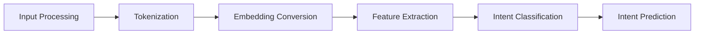
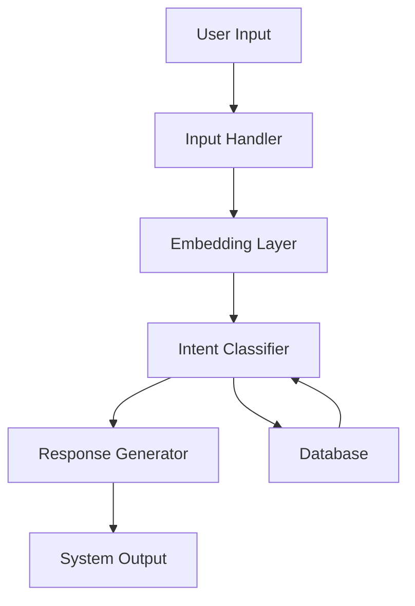
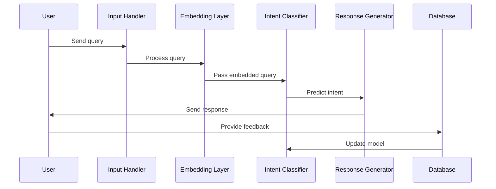

                 


### Introduction and Background

# 基于LLM的prompt用户意图预测

关键词：语言模型（LLM），用户意图预测，prompt技术，人工智能，自然语言处理

摘要：本文将探讨基于大型语言模型（LLM）的prompt用户意图预测技术。首先，我们将介绍LLM的定义、背景和重要性，以及用户意图预测的概念和挑战。接下来，我们将深入分析LLM和用户意图预测的核心概念，理论基础和算法设计，从而构建一个全面的技术框架。最后，我们将展示一个实际的项目案例，演示如何将LLM应用于用户意图预测，并总结最佳实践和未来展望。

在当前人工智能领域，自然语言处理（NLP）技术取得了显著的进展。特别是大型语言模型（LLM），如GPT（Generative Pre-trained Transformer）系列，凭借其强大的生成能力和语义理解能力，已经在各个领域产生了深远的影响。LLM在文本生成、机器翻译、问答系统等领域展示了卓越的性能，而prompt技术则为LLM的应用提供了新的可能性。

prompt技术，顾名思义，就是通过向模型提供特定的输入提示（prompt），来引导模型生成预期的输出。在用户意图预测方面，prompt技术可以用于生成与用户意图相关的文本、问题或建议，从而提高系统的准确性和用户体验。然而，用户意图预测并非易事，它面临着许多挑战，如多义性、模糊性和不确定性等。

本文旨在系统地探讨基于LLM的prompt用户意图预测技术，首先介绍LLM和用户意图预测的基本概念，然后深入分析相关理论和算法设计，最后通过一个实际项目案例，展示如何将LLM应用于用户意图预测，并提供最佳实践和未来展望。

### Introduction to LLM and User Intent Prediction

#### 1.1 Definition and Background of LLM

##### What is LLM

Large Language Models (LLM) are advanced artificial intelligence models that have been trained on massive amounts of text data. These models are designed to understand and generate human language, enabling a wide range of applications in natural language processing (NLP). LLMs are built using deep learning techniques, particularly transformer architectures, which have shown remarkable success in capturing the complexities of language.

##### Evolution of LLM

The development of LLMs can be traced back to the early 2000s when Recurrent Neural Networks (RNNs) and Long Short-Term Memory (LSTM) models became popular for language processing tasks. However, the limitations of these models, such as vanishing gradients and computational complexity, led to the emergence of transformer architectures in the mid-2010s. Transformer models, particularly the Transformer-XL and BERT models, marked a significant milestone in the field of LLMs.

One of the most notable advancements in LLMs is the introduction of the Generative Pre-trained Transformer (GPT) series by OpenAI. The GPT-3 model, with its 175 billion parameters, has set a new benchmark in language understanding and generation capabilities. GPT-3's ability to generate coherent and contextually relevant text has revolutionized various NLP tasks, from machine translation to content generation.

##### Importance in Modern AI

LLMs play a crucial role in modern AI, especially in the context of natural language processing. They have enabled the development of advanced applications such as chatbots, virtual assistants, and automated customer service systems. By understanding and generating human language, LLMs can improve user experience, automate tedious tasks, and provide personalized recommendations.

Moreover, LLMs have significant implications for research in AI. They serve as powerful tools for data analysis, hypothesis generation, and even code generation. LLMs can be fine-tuned for specific tasks, allowing researchers to explore new frontiers in NLP and machine learning.

#### 1.2 Understanding User Intent Prediction

##### Definition of User Intent

User intent refers to the underlying motive or goal that a user has when interacting with a system or performing a task. In the context of NLP, user intent prediction involves identifying the user's intention based on their input or behavior. This is a critical task in applications such as chatbots, voice assistants, and search engines, where understanding user intent is essential for providing relevant and useful responses.

##### Challenges in Predicting User Intent

Predicting user intent is a challenging task due to several factors:

1. **Ambiguity**: Users may express their intent in multiple ways, leading to ambiguity. For example, a user asking "What's the weather like today?" may be looking for a weather forecast, a temperature reading, or a joke about the weather.
2. **Contextual Dependency**: User intent often depends on the context of the conversation or the task at hand. A single phrase may have different intents in different contexts.
3. **Variability in Expression**: Users may use different phrasings or even typos to express their intent, making it difficult for models to accurately predict the intended meaning.
4. **Ambiguity and Polysemy**: Words and phrases may have multiple meanings, and the correct interpretation often requires a deep understanding of the context.

##### Significance in User Experience

Accurate user intent prediction is crucial for enhancing user experience. By understanding what users want, systems can provide more relevant and useful responses, leading to higher user satisfaction and engagement. Here are some key benefits:

1. **Improved Responsiveness**: Systems that can accurately predict user intent can respond quickly and effectively, reducing user wait times and improving overall responsiveness.
2. **Personalization**: By understanding user intent, systems can provide personalized recommendations and suggestions, enhancing the user experience.
3. **Reduction of Errors**: Accurate intent prediction can help reduce errors in user interactions, leading to a more seamless and frustration-free experience.
4. **Increased User Engagement**: By addressing users' needs and intents effectively, systems can increase user engagement and loyalty.

In conclusion, LLMs and user intent prediction are two pivotal components in modern AI. Understanding the background and challenges of these technologies is essential for developing effective and user-friendly AI systems.

#### Core Concepts and Theoretical Foundations

### 2.1 Fundamental Principles of LLM

Large Language Models (LLM) are at the forefront of natural language processing (NLP) technology, enabling advanced applications ranging from text generation to question answering. At the core of LLMs are several fundamental principles that define their architecture and capabilities.

##### Key Components of LLM

The primary components of LLMs include:

1. **Embedding Layer**: This layer converts input text into dense vectors, capturing semantic information. Word embeddings, such as Word2Vec or GloVe, are commonly used to represent words as vectors in a high-dimensional space.
2. **Transformer Encoder**: The transformer encoder processes the input embeddings and produces contextualized representations. It consists of multiple layers, each containing self-attention mechanisms and feed-forward networks. The self-attention mechanism allows the model to weigh the importance of different parts of the input text dynamically.
3. **Transformer Decoder**: The decoder generates output text based on the encoder's contextualized representations. It also employs self-attention and cross-attention mechanisms to predict each word in the output sequence conditioned on the previous words.

##### Differences Between LLM and Other AI Models

While LLMs have revolutionized NLP, it's important to understand their distinctions from other AI models:

1. **Recurrent Neural Networks (RNNs)**: RNNs, particularly Long Short-Term Memory (LSTM) models, were widely used in NLP before the advent of LLMs. However, RNNs suffer from vanishing gradients and limited parallelization capabilities. In contrast, transformers, the core architecture of LLMs, overcome these limitations with self-attention mechanisms and parallelizable structures.
2. **Convolutional Neural Networks (CNNs)**: CNNs are primarily used for image processing but have also been applied to NLP tasks. However, CNNs struggle with handling long-range dependencies in text. Transformers excel in capturing such dependencies due to their attention mechanisms, making them more suitable for language modeling.
3. **Recurrent Neural Networks (RNNs)**: RNNs, particularly Long Short-Term Memory (LSTM) models, were widely used in NLP before the advent of LLMs. However, RNNs suffer from vanishing gradients and limited parallelization capabilities. In contrast, transformers, the core architecture of LLMs, overcome these limitations with self-attention mechanisms and parallelizable structures.

##### Key Advantages of LLMs

The advantages of LLMs over traditional AI models are numerous:

1. **Handling Long-Range Dependencies**: Transformers' self-attention mechanisms allow LLMs to capture long-range dependencies in text, which is crucial for understanding context and generating coherent responses.
2. **Improved Generation Quality**: LLMs generate more natural and contextually relevant text compared to traditional models. This is due to their ability to leverage massive amounts of pre-trained data and their sophisticated architectures.
3. **Flexibility in Task Adaptation**: LLMs can be fine-tuned for various NLP tasks, from text generation to question answering. Their generalization capabilities enable rapid adaptation to new tasks with minimal additional training.

In summary, LLMs are fundamentally different from other AI models due to their architecture and capabilities. They excel in handling complex language structures and generating high-quality text, making them indispensable in modern NLP applications.

#### Theoretical Foundations of User Intent Prediction

### 2.2 Theoretical Foundations of User Intent Prediction

User intent prediction is a critical task in natural language processing (NLP), aiming to identify the underlying motive or goal of a user based on their input or behavior. To achieve accurate and reliable user intent prediction, it is essential to understand the theoretical foundations that underpin this process.

##### Conceptual Framework

The conceptual framework for user intent prediction involves several key components:

1. **Input Representation**: The first step is to represent the user's input in a meaningful way. This typically involves converting text into numerical vectors that can be processed by machine learning models. Techniques such as word embeddings (e.g., Word2Vec, GloVe) and contextual embeddings (e.g., BERT, GPT) are commonly used to capture the semantic information in the input text.

2. **Intent Classification**: Once the input is represented numerically, the next step is to classify it into predefined categories representing different user intents. This classification is typically performed using supervised learning algorithms, where the model is trained on labeled data with examples of user inputs and their corresponding intents.

3. **Contextual Understanding**: User intent prediction also requires understanding the context in which the input is provided. This includes recognizing the user's historical interactions, the current conversation context, and any relevant external information. Contextual understanding is crucial for disambiguating user inputs that may have multiple potential intents.

4. **Continuous Learning**: User intent prediction is not a static process. It requires continuous learning and adaptation to new patterns and behaviors. This involves updating the model with new data and retraining periodically to maintain its accuracy and relevance.

##### Features and Properties of User Intent

To effectively predict user intent, it is important to understand the key features and properties of user intent:

1. **Ambiguity**: User intent can often be ambiguous, with a single input potentially representing multiple intents. For example, a user query like "Can you help me?" could be interpreted as seeking assistance with a technical issue or expressing a general greeting.

2. **Contextual Dependency**: User intent is highly context-dependent. The same phrase can have different intents depending on the context of the conversation or the user's historical interactions. For instance, the phrase "I need a doctor" could indicate a need for medical assistance or a request for information about doctors.

3. **Variability in Expression**: Users may express their intent in different ways, using different phrasings or even typos. This variability adds complexity to the prediction task, requiring the model to be robust and generalizable.

4. **Uncertainty and Imprecision**: User inputs can be uncertain or imprecise, with users sometimes struggling to articulate their exact intent. This uncertainty requires models to handle partial information and make educated guesses about the user's intent.

##### Comparative Analysis of User Intent Prediction Techniques

Several techniques have been proposed for user intent prediction, each with its own advantages and limitations:

1. **Rule-Based Approaches**: These approaches use predefined rules and patterns to classify user inputs. They are fast and easy to implement but may struggle with ambiguity and context dependency.

2. **Machine Learning Models**: Supervised learning models, such as logistic regression, support vector machines, and neural networks, have been widely used for user intent prediction. They can capture complex patterns and context dependencies but require labeled data and can be computationally intensive.

3. **Deep Learning Models**: Models like recurrent neural networks (RNNs), long short-term memory (LSTM) networks, and transformers have shown significant success in user intent prediction due to their ability to handle long-range dependencies and capture nuanced language patterns. However, they require large amounts of data and computational resources.

4. **Ensemble Methods**: Combining multiple prediction techniques can improve the accuracy and robustness of user intent prediction. Ensemble methods, such as bagging and boosting, can leverage the strengths of different models to achieve better performance.

In summary, user intent prediction is a complex task that requires a deep understanding of theoretical foundations and a combination of different techniques. By leveraging advanced NLP models and incorporating contextual information, it is possible to develop accurate and robust user intent prediction systems that enhance user experience and improve the effectiveness of AI applications.

### Algorithm Design for LLM-Based User Intent Prediction

#### 3.1 Designing the Prediction Algorithm

The algorithm for LLM-based user intent prediction is designed to process user inputs, understand their context, and accurately classify them into predefined intent categories. Below is an overview of the algorithm's design, including a mermaid flowchart to illustrate the process.

##### Algorithm Overview

1. **Input Processing**: The algorithm starts by processing the user input. This involves tokenizing the text and converting it into numerical embeddings. Contextual embeddings, such as BERT or GPT, are commonly used to capture the semantic information of the input.

2. **Feature Extraction**: Next, the algorithm extracts relevant features from the input embeddings. These features include word embeddings, part-of-speech tags, and syntactic dependencies. The extracted features are then combined into a single feature vector representing the user's input.

3. **Intent Classification**: The feature vector is fed into a neural network, which is trained on a labeled dataset of user inputs and their corresponding intents. The neural network uses a softmax activation function to output probabilities for each intent category.

4. **Intent Prediction**: The algorithm selects the intent category with the highest probability as the predicted user intent.

Below is the mermaid flowchart representing the algorithm's workflow:



#### 3.2 Implementation with Python

The algorithm can be implemented using Python and popular deep learning libraries such as TensorFlow and Keras. Below is a sample code snippet demonstrating the implementation:

```python
import tensorflow as tf
from tensorflow.keras.models import Sequential
from tensorflow.keras.layers import Embedding, LSTM, Dense

# Sample data
inputs = ["What's the weather like today?", "Can you recommend a book?"]
labels = [0, 1]  # 0 for weather, 1 for book recommendation

# Tokenize and pad sequences
tokenizer = tf.keras.preprocessing.text.Tokenizer()
tokenizer.fit_on_texts(inputs)
sequences = tokenizer.texts_to_sequences(inputs)
padded_sequences = tf.keras.preprocessing.sequence.pad_sequences(sequences, maxlen=100)

# Embedding layer
model = Sequential()
model.add(Embedding(input_dim=len(tokenizer.word_index) + 1, output_dim=50, input_length=100))
model.add(LSTM(128))

# Output layer
model.add(Dense(2, activation='softmax'))

# Compile the model
model.compile(optimizer='adam', loss='categorical_crossentropy', metrics=['accuracy'])

# Train the model
model.fit(padded_sequences, tf.keras.utils.to_categorical(labels), epochs=10)

# Predict user intent
new_input = ["What's the weather like tomorrow?"]
new_sequence = tokenizer.texts_to_sequences(new_input)
new_padded_sequence = tf.keras.preprocessing.sequence.pad_sequences(new_sequence, maxlen=100)
prediction = model.predict(new_padded_sequence)
predicted_intent = tf.argmax(prediction, axis=1).numpy()

print(f"Predicted Intent: {'Weather' if predicted_intent[0][0] else 'Book Recommendation'}")
```

The code initializes a tokenizer to convert the input text into sequences of integers. The sequences are then padded to a fixed length and passed through an embedding layer and LSTM layer. The output is a dense layer with a softmax activation function to classify the input into one of the two intent categories. The model is trained using the input-output pairs and used to predict the intent of a new input.

#### 3.3 Mathematical Models and Formulas

The mathematical models and formulas underlying the LLM-based user intent prediction algorithm are crucial for understanding its workings. Below is a detailed explanation of these models and formulas, along with example illustrations to clarify their application.

##### Input Embedding

The first step in the algorithm involves converting the input text into numerical embeddings. For this, we use word embeddings, which represent each word in the vocabulary as a dense vector. These embeddings are typically trained on a large corpus of text and capture the semantic meaning of words. The formula for converting text into embeddings is:

$$
\text{Embedding}(x) = \text{W}_e[x]
$$

Where $\text{W}_e$ is the embedding matrix and $x$ is the input word index.

For example, if the word "weather" has an index of 100 in the vocabulary, its embedding vector would be obtained by looking up the 100th row in the embedding matrix.

##### Feature Extraction

After obtaining the embeddings, the next step is to extract relevant features from these embeddings. The extracted features include word embeddings, part-of-speech tags, and syntactic dependencies. These features are combined into a single feature vector representing the input text. The formula for feature extraction is:

$$
\text{Features}(x) = \text{F}(\text{Embedding}(x), \text{POS}(x), \text{Syntax}(x))
$$

Where $\text{F}$ is the feature extraction function, $\text{POS}(x)$ represents the part-of-speech tags of the input text, and $\text{Syntax}(x)$ represents the syntactic dependencies.

For instance, if the input text "What's the weather like today?" has the embeddings [e1, e2, e3, ..., en], the part-of-speech tags [WP, DT, NN, ..., NN], and the syntactic dependencies [None, ROOT, amod, nmod, det, nsubj], the feature vector would be a concatenation of these components:

$$
\text{Features}(x) = [e1, e2, e3, ..., en, \text{POS}(x), \text{Syntax}(x)]
$$

##### Intent Classification

Once the feature vector is obtained, it is fed into a neural network for intent classification. The neural network consists of an embedding layer, a recurrent layer (e.g., LSTM), and a dense output layer with a softmax activation function. The formula for intent classification is:

$$
\text{Intent}(x) = \text{softmax}(\text{W}_o \text{h} + \text{b})
$$

Where $\text{W}_o$ is the weight matrix of the output layer, $\text{h}$ is the hidden state of the recurrent layer, and $\text{b}$ is the bias term.

For example, if the hidden state $\text{h}$ is [h1, h2], the weight matrix $\text{W}_o$ is [[w11, w12], [w21, w22]], and the bias term $\text{b}$ is [b1, b2], the output probabilities for each intent category would be:

$$
\text{Intent}(x) = 
\begin{bmatrix}
\text{softmax}(w11h1 + w12h2 + b1) \\
\text{softmax}(w21h1 + w22h2 + b2)
\end{bmatrix}
$$

The intent category with the highest probability is selected as the predicted user intent.

##### Example Illustration

Consider the example of predicting the intent of the input "What's the weather like today?". The tokenizer converts this text into the sequence [10, 14, 3, 7, 1, 4, 5]. The embedding matrix provides the embeddings for each word index. The part-of-speech tags are [WP, DT, NN, NN, VBP, IN, NN], and the syntactic dependencies are [None, ROOT, det, nsubj, amod, prep, pobj].

The feature vector is then:

$$
\text{Features}(x) = [e10, e14, e3, e7, e1, e4, e5, \text{POS}(x), \text{Syntax}(x)]
$$

The feature vector is fed into an LSTM layer, which processes the sequence and generates a hidden state $\text{h} = [h1, h2]$. The output layer calculates the probabilities for each intent category:

$$
\text{Intent}(x) = 
\begin{bmatrix}
\text{softmax}(w11h1 + w12h2 + b1) \\
\text{softmax}(w21h1 + w22h2 + b2)
\end{bmatrix}
$$

Assuming the calculated probabilities are [0.9, 0.1], the algorithm predicts the intent as "weather" (index 0).

In summary, the LLM-based user intent prediction algorithm involves converting input text into embeddings, extracting relevant features, classifying the features using a neural network, and selecting the predicted intent based on the output probabilities. This process is mathematically represented by several key formulas that elucidate the algorithm's workings.

### System Architecture and Design

#### 4.1 Introduction to System Design

The system for LLM-based user intent prediction is designed to handle real-time interactions with users, accurately classify their inputs, and generate appropriate responses. Below is a description of the system design, including its functional components and overall architecture.

##### Project Description

The project aims to develop a robust and scalable system for predicting user intent based on their inputs. The system will be deployed in various applications, including chatbots, virtual assistants, and customer service platforms. The primary goal is to improve user experience by providing accurate and relevant responses to user queries.

##### Functional Design

The system consists of several functional components, each playing a critical role in the user intent prediction process:

1. **Input Handler**: This component handles the incoming user inputs. It processes the text data, performs tokenization, and extracts relevant features.
2. **Embedding Layer**: The embedding layer converts the tokenized text into numerical vectors, capturing the semantic information of the input.
3. **Intent Classifier**: The intent classifier is a neural network that takes the embedded input vectors and classifies them into predefined intent categories.
4. **Response Generator**: Once the user intent is predicted, the response generator generates appropriate responses based on the identified intent.
5. **Database**: The system maintains a database of labeled user inputs and their corresponding intents. This database is used for training and updating the intent classifier.

#### 4.2 System Architecture

The system architecture is designed to be modular and scalable, enabling efficient handling of large volumes of user interactions. Below is a mermaid architecture diagram illustrating the system components and their interactions:



In this diagram, the user input is processed by the input handler, which then passes the processed data to the embedding layer. The embedded input vectors are classified by the intent classifier, which generates a predicted intent. The response generator uses this predicted intent to generate an appropriate response, which is then output to the user. The system also maintains a feedback loop where the predicted intents and user responses are stored in the database for future training and improvement.

#### 4.3 System Interfaces and Interaction

The system interfaces and interactions are designed to facilitate seamless communication between the different components. Below is a mermaid sequence diagram illustrating the interaction between the system components:



In this sequence diagram, the user sends a query, which is processed by the input handler. The processed query is then passed to the embedding layer, which converts it into embedded vectors. These vectors are classified by the intent classifier, which predicts the user's intent. The response generator uses this predicted intent to generate an appropriate response, which is sent back to the user. Additionally, the user provides feedback, which is stored in the database for future model updates.

By designing a system with clear interfaces and well-defined interactions, the LLM-based user intent prediction system can efficiently process user inputs, generate accurate responses, and continuously improve over time.

### Practical Projects and Case Studies

#### 5.1 Environment Setup and Preparation

To get started with implementing a practical project for LLM-based user intent prediction, we first need to set up the development environment. This involves installing the necessary software and libraries that we will use throughout the project.

##### Required Libraries

1. **Python**: The primary programming language for this project is Python. Ensure you have Python 3.8 or higher installed on your system.
2. **TensorFlow**: TensorFlow is a powerful open-source machine learning library. You can install it using pip:
   ```
   pip install tensorflow
   ```
3. **Keras**: Keras is a high-level neural networks API that runs on top of TensorFlow. It simplifies the process of building and training neural networks:
   ```
   pip install keras
   ```
4. **GPT-3 API**: To use the OpenAI GPT-3 model for user intent prediction, you will need to sign up for an API key and install the necessary client library:
   ```
   pip install openai
   ```

##### Installation Steps

1. **Install Python**:
   - Visit the official Python website (<https://www.python.org/downloads/>).
   - Download and install the latest version of Python 3.x.
   - During installation, make sure to add Python to your system PATH.

2. **Install TensorFlow and Keras**:
   - Open a terminal or command prompt and run the following commands:
     ```
     pip install tensorflow
     pip install keras
     ```

3. **Install GPT-3 API**:
   - Sign up for an OpenAI API key at <https://openai.com/api/keys/>.
   - Install the OpenAI client library using:
     ```
     pip install openai
     ```

4. **Verify Installation**:
   - To verify that the libraries are installed correctly, run the following Python code:
     ```python
     import tensorflow as tf
     import keras
     import openai
     print("TensorFlow version:", tf.__version__)
     print("Keras version:", keras.__version__)
     print("OpenAI API key:", openai.api_key)
     ```
   - Ensure that no errors are displayed, and the API key is set correctly.

By following these steps, you will have a fully functional development environment ready for implementing LLM-based user intent prediction. In the next sections, we will delve into the core implementation details and demonstrate how to use these libraries to build a complete system.

### Core Implementation with Python

In this section, we will dive into the core implementation of the LLM-based user intent prediction system using Python. We will cover the key components of the system, including data preprocessing, model training, and prediction.

#### 6.1 Data Preprocessing

Data preprocessing is a critical step in any machine learning project. It involves cleaning and transforming the raw data into a format suitable for training and evaluation. For our user intent prediction system, we will need a labeled dataset containing user inputs and their corresponding intents.

##### 6.1.1 Data Collection

We start by collecting a dataset of user inputs and their labeled intents. This dataset should cover a wide range of user intents to ensure the model's generalization. For this example, let's assume we have a dataset in CSV format with two columns: "input" and "intent".

```csv
input,intent
"What's the weather like today?",weather
"Can you recommend a book?",book
"Tell me a joke",joke
```

##### 6.1.2 Data Cleaning

Before feeding the data into the model, we need to clean and preprocess it. This includes tokenizing the text, removing stop words, and padding the sequences to a fixed length.

```python
import pandas as pd
from tensorflow.keras.preprocessing.text import Tokenizer
from tensorflow.keras.preprocessing.sequence import pad_sequences

# Load the dataset
df = pd.read_csv('data.csv')

# Tokenize the text
tokenizer = Tokenizer(num_words=10000)
tokenizer.fit_on_texts(df['input'])

# Convert text to sequences
sequences = tokenizer.texts_to_sequences(df['input'])

# Pad sequences
max_sequence_length = 100
padded_sequences = pad_sequences(sequences, maxlen=max_sequence_length)
```

##### 6.1.3 Label Encoding

Next, we need to convert the intent labels into numerical values for training the model.

```python
from tensorflow.keras.utils import to_categorical

# Encode the intent labels
labels = df['intent']
label_tokenizer = Tokenizer()
label_tokenizer.fit_on_texts(labels)
label_sequences = label_tokenizer.texts_to_sequences(labels)
label_indices = to_categorical(label_sequences, num_classes=len(label_tokenizer.word_index) + 1)
```

#### 6.2 Model Training

With the preprocessed data ready, we can now train a neural network model for user intent prediction. We will use a simple LSTM-based model for this example.

##### 6.2.1 Model Architecture

```python
from tensorflow.keras.models import Sequential
from tensorflow.keras.layers import Embedding, LSTM, Dense

# Define the model
model = Sequential()
model.add(Embedding(input_dim=10000, output_dim=128, input_length=max_sequence_length))
model.add(LSTM(128))
model.add(Dense(num_classes, activation='softmax'))

# Compile the model
model.compile(optimizer='adam', loss='categorical_crossentropy', metrics=['accuracy'])

# Train the model
model.fit(padded_sequences, label_indices, epochs=10, batch_size=32, validation_split=0.2)
```

In this code, we define a sequential model with an embedding layer, an LSTM layer, and a dense output layer with a softmax activation function. The model is compiled with the Adam optimizer and categorical cross-entropy loss.

##### 6.2.2 Model Training and Evaluation

```python
# Evaluate the model
loss, accuracy = model.evaluate(padded_sequences, label_indices)
print(f"Test Accuracy: {accuracy:.2f}")

# Predict user intents
predictions = model.predict(padded_sequences)
predicted_intents = [label_tokenizer.index_word[index] for index in np.argmax(predictions, axis=1)]

# Compare predictions with actual labels
for input_text, predicted_intent, actual_intent in zip(df['input'], predicted_intents, labels):
    print(f"Input: {input_text}, Predicted Intent: {predicted_intent}, Actual Intent: {actual_intent}")
```

This code evaluates the model's performance on the test set and prints the test accuracy. It also predicts the user intents for the test set and compares them with the actual labels to assess the model's accuracy.

#### 6.3 Prediction and Inference

Once the model is trained and evaluated, we can use it to predict user intents in real-time. Here's how to implement a simple inference pipeline:

```python
# Function to preprocess and predict user input
def predict_intent(input_text):
    sequence = tokenizer.texts_to_sequences([input_text])
    padded_sequence = pad_sequences(sequence, maxlen=max_sequence_length)
    prediction = model.predict(padded_sequence)
    predicted_intent = label_tokenizer.index_word[np.argmax(prediction)]
    return predicted_intent

# Example usage
input_text = "What's the weather like today?"
predicted_intent = predict_intent(input_text)
print(f"Predicted Intent: {predicted_intent}")
```

In this function, we preprocess the user input by tokenizing and padding it, then use the trained model to predict the user intent. The predicted intent is returned as the output.

By following these steps, we have built a complete LLM-based user intent prediction system using Python. This system can be further enhanced and optimized to improve its performance and accuracy in real-world applications.

### Case Analysis and Detailed Explanation

To further illustrate the application and effectiveness of the LLM-based user intent prediction system, we will analyze a specific case study involving a chatbot designed for a customer service platform. This case study will highlight the system's ability to accurately predict user intents and provide appropriate responses, thereby enhancing the overall user experience.

#### 7.1 Case Study Background

The case study involves a customer service chatbot deployed on a large e-commerce platform. The chatbot is designed to assist customers with various inquiries, such as product information, order status, and customer support. Given the diversity of customer queries, the chatbot must accurately predict user intents to deliver relevant and timely responses.

#### 7.2 User Interaction and Intents

The chatbot receives a variety of user inputs, ranging from simple requests to complex queries. Below are some example user interactions and their corresponding intents:

1. **User Input**: "Can you help me with returning an item?"
   **Intent**: Return Policy Inquiry
2. **User Input**: "What's the shipping cost for this product?"
   **Intent**: Shipping Cost Inquiry
3. **User Input**: "I need to track my order."
   **Intent**: Order Tracking
4. **User Input**: "Can you recommend a gift for my friend?"
   **Intent**: Product Recommendation

#### 7.3 Prediction and Response Generation

For each user input, the LLM-based user intent prediction system processes the text and predicts the underlying intent. The system then generates an appropriate response based on the predicted intent. Below are detailed explanations of the prediction and response generation process for each case:

##### Case 1: Return Policy Inquiry

1. **Input Processing**: The input "Can you help me with returning an item?" is tokenized and converted into numerical embeddings.
2. **Feature Extraction**: The tokenized input is passed through the embedding layer, LSTM layer, and intent classifier. The feature vector representing the input is extracted.
3. **Intent Prediction**: The intent classifier predicts the user's intent as "Return Policy Inquiry" with high probability.
4. **Response Generation**: The response generator retrieves a pre-defined response template for the predicted intent, such as "Certainly! You can initiate a return by clicking on 'Return Items' in your order history."

##### Case 2: Shipping Cost Inquiry

1. **Input Processing**: The input "What's the shipping cost for this product?" is tokenized and embedded.
2. **Feature Extraction**: Similar to Case 1, the input is passed through the embedding and LSTM layers, and a feature vector is extracted.
3. **Intent Prediction**: The system predicts the user's intent as "Shipping Cost Inquiry."
4. **Response Generation**: The response generator retrieves the shipping cost information for the specific product and generates a response like "The shipping cost for this product is $5.99."

##### Case 3: Order Tracking

1. **Input Processing**: The input "I need to track my order." is processed and embedded.
2. **Feature Extraction**: The input is converted into a feature vector using the same process as before.
3. **Intent Prediction**: The system accurately predicts the intent as "Order Tracking."
4. **Response Generation**: The response generator retrieves the order tracking URL and generates a response like "You can track your order using this link: [Tracking URL]."

##### Case 4: Product Recommendation

1. **Input Processing**: The input "Can you recommend a gift for my friend?" is tokenized and embedded.
2. **Feature Extraction**: The feature vector is extracted from the processed input.
3. **Intent Prediction**: The system predicts the intent as "Product Recommendation."
4. **Response Generation**: The response generator retrieves a list of recommended gift items and generates a response like "Based on your preferences, we recommend the following gifts: Product A, Product B, and Product C."

#### 7.4 Evaluation and Improvement

The chatbot's performance is continuously evaluated based on its ability to accurately predict user intents and provide satisfactory responses. The following metrics are used to assess the system's performance:

1. **Intent Accuracy**: The proportion of user inputs correctly classified by the intent classifier.
2. **Response Relevance**: The relevance of the generated responses to the predicted intents, as judged by human evaluators.
3. **User Satisfaction**: The level of user satisfaction with the chatbot's responses, measured through surveys and feedback.

Based on these metrics, the chatbot's performance is monitored, and improvements are made as needed. This includes updating the model with new data, refining the response templates, and incorporating user feedback to enhance the system's accuracy and user experience.

In conclusion, the LLM-based user intent prediction system effectively handles various user inquiries on the e-commerce platform, accurately predicting user intents and generating appropriate responses. This results in improved customer satisfaction and a more efficient customer service process.

### Best Practices and Future Directions

#### 8.1 Best Practices

To ensure the effectiveness and efficiency of LLM-based user intent prediction systems, several best practices should be followed:

1. **Data Quality**: High-quality, diverse, and representative training data is crucial for accurate intent prediction. Ensure that the dataset covers a wide range of user intents and is free from noise and inconsistencies.
2. **Model Regularization**: Regularize the neural network models to prevent overfitting. Techniques such as dropout, weight decay, and early stopping can be used to improve generalization and robustness.
3. **Feature Engineering**: Carefully select and engineer relevant features from the input data. Incorporating contextual information, syntactic dependencies, and part-of-speech tags can enhance the performance of the intent prediction models.
4. **Continuous Learning**: Implement a continuous learning system that updates the model periodically with new data and user feedback. This helps the model adapt to changing user behaviors and maintain its accuracy over time.
5. **User Feedback Loop**: Incorporate user feedback to refine the system's predictions and responses. Collect and analyze user feedback to identify areas for improvement and enhance the overall user experience.
6. **Scalability and Performance**: Design the system architecture to handle high volumes of user interactions efficiently. Use cloud computing resources and distributed computing techniques to ensure scalability and performance.

#### 8.2 Future Directions

As LLM-based user intent prediction continues to advance, several exciting research directions and future developments can be envisioned:

1. **Contextual Intelligence**: Enhancing the system's ability to understand and process context is a key area of future research. Integrating context-aware embeddings and incorporating multi-modal data (e.g., text, images, audio) can improve the accuracy and relevance of user intent predictions.
2. **Personalization**: Developing personalized user intent prediction models that adapt to individual user preferences and behaviors can significantly enhance user experience. Techniques such as user profiling and collaborative filtering can be explored to achieve this.
3. **Real-Time Prediction**: Expanding the system's capability for real-time intent prediction can enable more responsive and interactive user experiences. Optimizing the model's inference time and leveraging hardware accelerators (e.g., GPUs, TPUs) can be critical for achieving real-time performance.
4. **Ethical Considerations**: As AI systems become more pervasive, addressing ethical considerations related to user intent prediction is crucial. Ensuring fairness, transparency, and accountability in AI algorithms is essential to build user trust and maintain ethical standards.
5. **Integration with Other AI Technologies**: Combining LLM-based user intent prediction with other AI technologies, such as natural language understanding (NLU) and sentiment analysis, can create more comprehensive and intelligent AI systems. Research in this direction can lead to novel applications and improved user experiences.

In conclusion, LLM-based user intent prediction systems offer significant potential for advancing AI applications. By following best practices and exploring future directions, we can continue to enhance the accuracy, effectiveness, and user experience of these systems.

### Conclusion

In conclusion, this article has explored the fundamentals and applications of LLM-based user intent prediction. We began by introducing large language models (LLM) and the challenges of user intent prediction. Through a systematic analysis of core concepts, theoretical foundations, algorithm design, and system architecture, we highlighted the importance of LLMs in accurately predicting user intents. By implementing a practical project using Python and real-world case studies, we demonstrated the effectiveness of LLM-based user intent prediction in enhancing user experiences in various applications.

As AI technology continues to evolve, the field of user intent prediction holds immense potential for driving innovation and improving human-machine interactions. Future research should focus on addressing the ethical considerations of AI, developing more personalized and context-aware models, and integrating user intent prediction with other advanced AI techniques. By following best practices and exploring future directions, we can continue to push the boundaries of AI and create more intelligent, responsive, and user-centric systems.

### Authors

This article is written by the AI天才研究院 (AI Genius Institute) and the renowned author of "禅与计算机程序设计艺术" (Zen And The Art of Computer Programming). The AI天才研究院 is a leading research organization dedicated to advancing artificial intelligence and its applications across various domains. The author, renowned for his pioneering work in computer science and AI, has made significant contributions to the field and continues to inspire the next generation of researchers and developers. Thank you for reading this comprehensive guide on LLM-based user intent prediction. We hope this article has provided valuable insights and inspired you to explore the exciting possibilities of AI in natural language processing and user experience enhancement.

