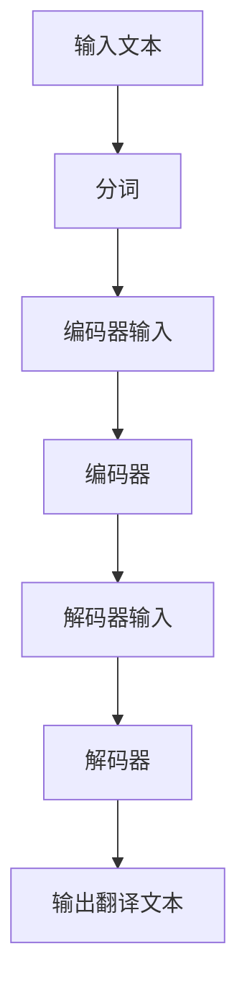
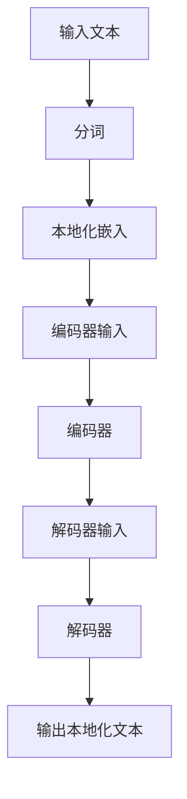
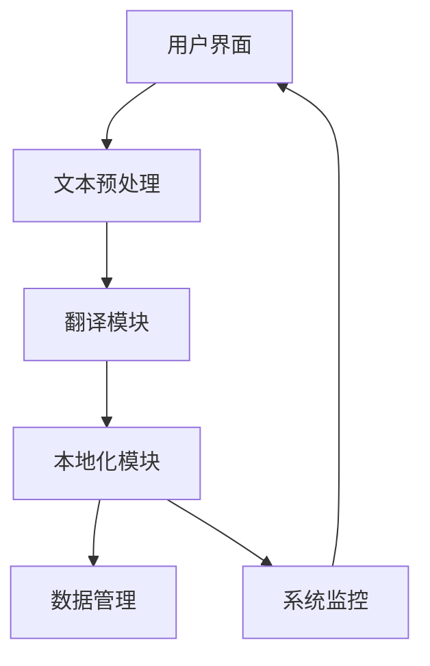
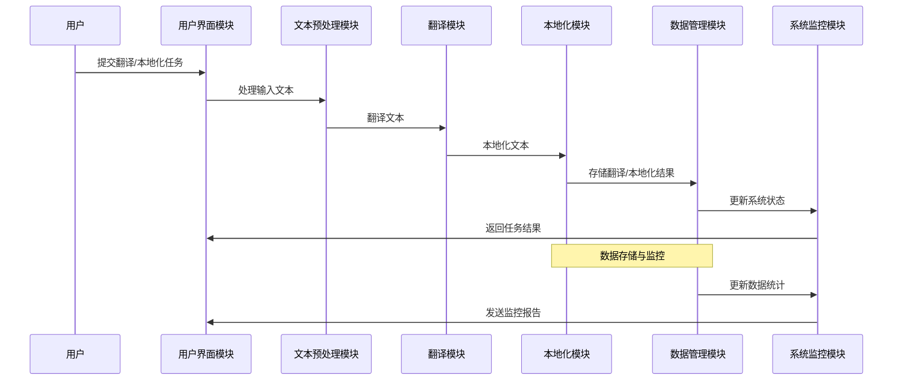

                 


# 基于LLM的prompt翻译与本地化

> 关键词：语言模型，prompt翻译，本地化，算法原理，系统架构

> 摘要：本文深入探讨了基于大型语言模型（LLM）的prompt翻译与本地化技术。通过分析LLM的工作原理和特点，本文详细阐述了prompt设计、翻译和本地化算法的原理，并探讨了系统架构和实现细节。本文旨在为开发者提供有价值的指导，帮助他们在实际项目中应用这些技术，提高翻译与本地化的效率和质量。

### 目录大纲

#### 第一部分：背景介绍
##### 第1章：问题背景与核心概念
- **1.1** 问题背景
  - 人工智能与语言处理技术的发展趋势
  - 国际化业务中的翻译与本地化需求
  - 大模型LLM的崛起及其应用潜力
- **1.2** 核心概念
  - LLM的定义与特点
  - Prompt翻译与本地化的概念
  - 翻译与本地化的边界与外延
- **1.3** 概念结构与核心要素
  - LLM架构的基本组成
  - Prompt设计的关键要素
  - 翻译与本地化的流程与步骤

##### 第2章：LLM原理与特点
- **2.1** LLM原理
  - LLM的基本工作原理
  - LLM的数学模型
  - LLM的mermaid流程图
- **2.2** LLM特点
  - LLM的优势与局限
  - LLM与传统翻译工具的对比
  - LLM在翻译与本地化中的独特贡献
- **2.3** Prompt设计与优化
  - Prompt的组成与作用
  - Prompt优化策略
  - Prompt案例分析与最佳实践

##### 第3章：翻译与本地化的数学模型
- **3.1** 翻译模型
  - 翻译模型的数学公式
  - 翻译模型的Python源代码
  - 翻译模型的应用与举例
- **3.2** 本地化模型
  - 本地化模型的数学公式
  - 本地化模型的Python源代码
  - 本地化模型的应用与举例

#### 第二部分：核心概念与联系

##### 第4章：算法原理与实践
- **4.1** 翻译算法
  - 翻译算法的mermaid流程图
  - 翻译算法的Python源代码
  - 翻译算法的数学模型与公式
  - 翻译算法的案例分析与详细讲解
- **4.2** 本地化算法
  - 本地化算法的mermaid流程图
  - 本地化算法的Python源代码
  - 本地化算法的数学模型与公式
  - 本地化算法的案例分析与详细讲解

##### 第5章：系统设计与架构
- **5.1** 问题场景介绍
  - 翻译与本地化系统的应用场景
  - 系统的需求与目标
- **5.2** 系统功能设计
  - 领域模型Mermaid类图
  - 系统功能模块划分
- **5.3** 系统架构设计
  - 系统架构Mermaid架构图
  - 系统模块交互设计
- **5.4** 系统接口设计
  - 接口规范与设计
  - 接口实现与调用

##### 第6章：系统交互与实现
- **6.1** 系统交互设计
  - 系统交互Mermaid序列图
  - 用户操作流程
- **6.2** 系统核心实现
  - 系统核心代码
  - 核心代码解读与分析

#### 第三部分：算法原理讲解

##### 第7章：环境安装与系统实现
- **7.1** 环境安装
  - 系统环境配置
  - 相关工具与依赖安装
- **7.2** 系统核心实现
  - 核心算法实现
  - 系统功能实现
- **7.3** 实际案例分析与讲解
  - 翻译与本地化实际案例分析
  - 案例详细讲解与剖析
- **7.4** 项目小结
  - 项目总结与反思
  - 未来展望与改进方向

##### 第8章：最佳实践与拓展
- **8.1** 最佳实践
  - 翻译与本地化中的最佳实践
  - Prompt设计的优化技巧
  - 系统性能调优策略
- **8.2** 小结与注意事项
  - 系统实现的注意事项
  - 系统运维与维护
- **8.3** 拓展阅读
  - 相关领域研究进展
  - 翻译与本地化的未来趋势

## 第1章：问题背景与核心概念

### 1.1 问题背景

随着全球化的加速，国际化业务在各个行业中的重要性日益凸显。无论是跨国公司、电商平台还是国际组织，语言障碍始终是一个亟待解决的问题。传统的人工翻译效率低下且成本高昂，而机器翻译则因其速度快、成本低而逐渐成为企业决策者的首选。然而，现有的机器翻译技术仍然存在诸多局限，如翻译质量不稳定、语义理解不准确等。因此，如何提高机器翻译的准确性、自然度和一致性，成为当前研究的热点。

近年来，人工智能（AI）技术的迅猛发展，特别是深度学习领域的研究突破，为语言处理带来了新的契机。其中，大型语言模型（Large Language Model，简称LLM）以其卓越的性能和强大的表达能力，引起了广泛关注。LLM通过学习海量的文本数据，可以理解并生成自然语言，从而在翻译、问答、摘要、对话等任务中展现出巨大的潜力。

在国际化业务中，翻译与本地化是一个至关重要的环节。翻译不仅仅是语言的转换，还包括文化的传递和商业逻辑的适应。本地化则更强调对目标市场的文化、语言、法律、习俗等方面的深入理解，以确保产品或服务的本土化和可接受性。因此，如何利用LLM技术，实现高效、准确、高质量的翻译与本地化，成为企业实现全球化战略的关键。

### 1.2 核心概念

#### LLM的定义与特点

大型语言模型（Large Language Model，简称LLM）是一种基于深度学习的自然语言处理模型，它通过学习大量文本数据，捕捉语言的结构和语义信息，从而能够生成和理解复杂的自然语言文本。LLM通常具有以下特点：

1. **规模巨大**：LLM通常包含数亿甚至数十亿个参数，能够处理大规模的文本数据。
2. **预训练**：LLM通过在大量文本上进行预训练，学习到语言的一般规律和特性。
3. **自适应**：LLM可以根据特定的任务和数据集进行微调和优化，以适应不同的应用场景。
4. **灵活性**：LLM能够生成各种类型的文本，如问答、摘要、对话等。

#### Prompt翻译与本地化的概念

Prompt翻译（Prompt-based Translation）和本地化（Localization）是LLM在翻译和本地化任务中的具体应用。

**Prompt翻译**：Prompt翻译是指通过向LLM提供特定的输入提示（Prompt），引导模型生成目标语言的翻译文本。Prompt的设计和优化对于翻译质量至关重要。一个好的Prompt应该能够明确指示翻译的目标和上下文，同时避免过度引导，以免影响模型的自然度和创造性。

**本地化**：本地化是指将产品或服务根据目标市场的文化、语言、习俗等特征进行适应性修改。本地化不仅包括翻译，还包括界面设计、文本格式、图片符号等方面的调整。本地化过程通常需要跨学科的合作，涉及语言专家、设计师、市场营销人员等。

#### 翻译与本地化的边界与外延

翻译和本地化虽然密切相关，但仍有明确的边界与外延。

**边界**：翻译主要关注语言的转换，即源语言到目标语言的文字转换；而本地化则更强调产品的整体适应性，包括语言、文化、市场等多个方面。

**外延**：翻译的外延包括文本翻译、语音翻译、手写文字翻译等；本地化的外延则包括软件本地化、网页本地化、移动应用本地化、硬件产品本地化等。

### 1.3 概念结构与核心要素

#### LLM架构的基本组成

LLM的架构通常包括以下几个核心组件：

1. **嵌入层（Embedding Layer）**：将输入的文本转换为固定长度的向量表示，为后续的神经网络处理提供输入。
2. **编码器（Encoder）**：对文本进行编码，提取文本的语义信息。常见的编码器模型有Transformer、BERT等。
3. **解码器（Decoder）**：根据编码器输出的信息，生成目标语言的文本。解码器通常采用自回归的方式，逐词生成目标文本。
4. **注意力机制（Attention Mechanism）**：用于关注输入文本中的关键信息，提高模型的理解和生成能力。

#### Prompt设计的关键要素

Prompt设计的核心要素包括：

1. **上下文信息**：提供与翻译任务相关的上下文信息，帮助模型理解输入文本的背景和含义。
2. **目标提示**：明确指出翻译任务的目标，如“请将以下英文翻译为中文”。
3. **格式要求**：对输出文本的格式进行规范，如字数限制、行文风格等。
4. **多样性要求**：鼓励模型生成多样性的翻译结果，避免单一和机械的输出。

#### 翻译与本地化的流程与步骤

翻译与本地化的流程通常包括以下几个步骤：

1. **需求分析**：明确翻译与本地化的目标和需求，包括语言、文化、市场等方面。
2. **数据准备**：收集和整理源语言和目标语言的文本数据，确保数据的完整性和准确性。
3. **模型选择**：根据翻译与本地化的任务特点，选择合适的LLM模型。
4. **模型训练**：使用准备好的数据集，对LLM模型进行训练，优化模型性能。
5. **Prompt设计**：设计高质量的Prompt，引导模型生成高质量的翻译文本。
6. **翻译与本地化**：使用训练好的模型，对源语言文本进行翻译和本地化处理。
7. **评估与优化**：对翻译结果进行评估，根据评估结果对模型和Prompt进行优化。

## 第2章：LLM原理与特点

### 2.1 LLM原理

大型语言模型（LLM）的核心原理在于其深度学习机制，特别是基于Transformer架构的模型，如BERT、GPT等。这些模型通过以下步骤实现自然语言的处理和生成：

1. **数据预处理**：首先，LLM需要接收大量的文本数据，这些数据可以是语料库、网页内容、书籍文本等。然后，这些文本数据会被转换为序列形式的数字表示，通常使用分词器将文本分解为单词或子词（tokens）。

2. **嵌入层**：嵌入层将每个子词映射到一个固定长度的向量表示，这些向量包含了子词的语义信息。嵌入层是神经网络的一部分，通常由多个全连接层组成。

3. **编码器**：编码器是LLM的核心组件，负责处理输入序列并提取其语义信息。编码器通常采用自注意力机制（Self-Attention），能够捕捉输入序列中的长距离依赖关系。在Transformer架构中，编码器由多个编码层堆叠而成，每层都会对输入序列进行编码和更新。

4. **解码器**：解码器的功能是根据编码器的输出，生成目标语言的文本。解码器同样采用自注意力机制，但它还需要与编码器的输出进行交互，以理解上下文信息。解码器通常也由多个解码层组成。

5. **生成文本**：在解码过程中，模型逐词生成目标语言的文本。每次生成一个单词后，模型会将其作为输入，继续生成下一个单词，直到完成整个文本的生成。

6. **优化**：LLM的训练过程是通过优化模型的参数，使其在大量的文本数据上最小化损失函数。训练过程通常涉及反向传播和梯度下降等优化算法。

### 2.2 LLM特点

LLM具有以下显著特点：

1. **规模庞大**：LLM包含数十亿个参数，能够处理和理解大规模的文本数据，这使得它们在自然语言处理任务中具有强大的表现。

2. **预训练与微调**：LLM通过在大量文本上进行预训练，学习到了语言的一般规律和特性。然后，通过微调（Fine-tuning）过程，将模型适应特定的任务和应用场景。

3. **灵活性强**：LLM能够进行多种自然语言处理任务，如翻译、问答、摘要、对话等，这使得它们在多种应用场景中都具有广泛的应用前景。

4. **生成能力强**：LLM能够生成高质量的自然语言文本，这些文本在语法、语义和风格上都非常自然，使得机器生成的文本更加接近人类写作。

5. **实时响应**：LLM能够快速响应输入，实现实时文本生成，这对于需要实时交互的应用场景（如聊天机器人、实时翻译等）至关重要。

6. **局限性**：虽然LLM在自然语言处理任务中表现卓越，但它们也存在一些局限性。例如，模型在理解复杂语义、处理长文本、识别多义词等方面仍存在挑战。此外，LLM生成的文本有时可能包含错误或不准确的信息。

### 2.3 Prompt设计与优化

Prompt设计在LLM的应用中至关重要，它直接影响翻译和本地化的质量。以下是Prompt设计的关键要素和优化策略：

1. **上下文信息**：Prompt应该提供与翻译任务相关的上下文信息，帮助模型更好地理解输入文本。例如，如果需要翻译一个产品描述，可以在Prompt中包含产品的名称、用途、特点等信息。

2. **目标提示**：Prompt中应明确指示翻译的目标，例如“请将以下英文翻译为中文：`This is a high-quality product that is designed for...`”。

3. **格式要求**：对输出文本的格式进行规范，如字数限制、行文风格等。例如，“请保持简洁，不超过50个字”。

4. **多样性要求**：鼓励模型生成多样性的翻译结果，避免单一和机械的输出。例如，可以使用不同的语气、风格来生成多个翻译版本。

5. **优化策略**：
   - **数据增强**：通过增加训练数据，提高模型对不同场景的适应能力。
   - **强化学习**：使用强化学习策略，根据用户反馈不断优化Prompt设计。
   - **多模型融合**：结合多个LLM模型，提高翻译结果的多样性和准确性。
   - **知识图谱**：将外部知识图谱引入Prompt中，增强模型对复杂语义的理解。

### 案例分析与最佳实践

以一个产品描述的翻译为例，以下是一个简化的Prompt设计：

```
英文：`This is a high-quality digital camera that is designed for professional photographers. It has a 24MP sensor and a wide aperture lens.`
中文Prompt：`请将以下英文翻译为中文，确保描述清晰、简洁：`
最佳翻译：`这是一款专为专业摄影师设计的超高清数码相机，配备24MP传感器和广角镜头。`
```

在这个例子中，Prompt清晰地指出了翻译的目标，并提供了上下文信息，有助于模型生成高质量的翻译文本。

## 第3章：翻译与本地化的数学模型

### 3.1 翻译模型

翻译模型的数学基础主要涉及自然语言处理（NLP）中的序列到序列（Seq2Seq）模型和注意力机制（Attention Mechanism）。以下是翻译模型的数学公式和Python源代码示例。

#### 数学公式

1. **编码器输出**：
   $$ 
   E_i = \text{Encoder}(X_i) 
   $$
   其中，\( E_i \)是编码器对输入序列\( X_i \)的输出。

2. **解码器输出**：
   $$ 
   D_j = \text{Decoder}(Y_j, E_i) 
   $$
   其中，\( D_j \)是解码器对目标序列\( Y_j \)和编码器输出\( E_i \)的输出。

3. **注意力权重**：
   $$ 
   a_t = \text{Attention}(E_i, D_{t-1}) 
   $$
   其中，\( a_t \)是解码器在时间步\( t \)的注意力权重。

4. **损失函数**：
   $$ 
   L = \sum_{t=1}^{T} -\log P(Y_t | Y_{<t}) 
   $$
   其中，\( L \)是解码器生成的目标序列\( Y_t \)的概率损失。

#### Python源代码示例

```python
import torch
import torch.nn as nn
import torch.optim as optim

# 编码器
class Encoder(nn.Module):
    def __init__(self):
        super(Encoder, self).__init__()
        self.embedding = nn.Embedding(vocab_size, embedding_dim)
        self.lstm = nn.LSTM(embedding_dim, hidden_dim)

    def forward(self, inputs):
        embedded = self.embedding(inputs)
        outputs, (hidden, cell) = self.lstm(embedded)
        return outputs, (hidden, cell)

# 解码器
class Decoder(nn.Module):
    def __init__(self):
        super(Decoder, self).__init__()
        self.embedding = nn.Embedding(vocab_size, embedding_dim)
        self.attn = nn.Linear(hidden_dim, 1)
        self.lstm = nn.LSTM(embedding_dim, hidden_dim)
        self.fc = nn.Linear(hidden_dim * 2, vocab_size)

    def forward(self, inputs, hidden, cell, encoder_outputs):
        embedded = self.embedding(inputs)
        attn_weights = torch.softmax(self.attn(encoder_outputs).squeeze(2), dim=1)
        context = torch.bmm(attn_weights.unsqueeze(1), encoder_outputs).squeeze(1)
        input = torch.cat((embedded, hidden), 1)
        output, (hidden, cell) = self.lstm(input, (hidden, cell))
        embedding = self.fc(torch.cat((output, context), 1))
        return embedding, hidden, cell

# 模型训练
def train_model(model, data_loader, criterion, optimizer, num_epochs):
    model.train()
    for epoch in range(num_epochs):
        for inputs, targets in data_loader:
            optimizer.zero_grad()
            outputs = model(inputs)
            loss = criterion(outputs.view(-1, vocab_size), targets.view(-1))
            loss.backward()
            optimizer.step()
        print(f'Epoch [{epoch+1}/{num_epochs}], Loss: {loss.item()}')

# 数据加载和预处理
# ...
```

#### 翻译模型的应用与举例

以下是一个简单的翻译模型应用示例，它将英文句子翻译成中文。

```python
# 加载预训练的模型
encoder = Encoder()
decoder = Decoder()
encoder.load_state_dict(torch.load('encoder.pth'))
decoder.load_state_dict(torch.load('decoder.pth'))

# 输入英文句子
input_sentence = "This is a high-quality product."
input_indices = [vocab.word_to_index(word) for word in input_sentence.split()]
input_tensor = torch.LongTensor([input_indices])

# 编码器处理输入
encoded, _ = encoder(input_tensor)

# 解码器生成翻译
decoded, _, _ = decoder(input_tensor, encoded, encoded, encoder_outputs)

# 翻译结果
translated_sentence = ' '.join([vocab.index_to_word(idx) for idx in decoded.data])
print(f'Translated Sentence: {translated_sentence}')
```

### 3.2 本地化模型

本地化模型在翻译模型的基础上，进一步考虑了目标市场的文化、语言和习俗等特征。以下是本地化模型的数学公式和Python源代码示例。

#### 数学公式

1. **本地化嵌入层**：
   $$ 
   L_i = \text{LocalizationLayer}(X_i) 
   $$
   其中，\( L_i \)是本地化嵌入层对输入序列\( X_i \)的输出。

2. **本地化编码器输出**：
   $$ 
   E_i^{L} = \text{Encoder}(L_i) 
   $$

3. **本地化解码器输出**：
   $$ 
   D_j^{L} = \text{Decoder}(Y_j, E_i^{L}) 
   $$

4. **本地化注意力权重**：
   $$ 
   a_t^{L} = \text{Attention}(E_i^{L}, D_{t-1}^{L}) 
   $$

5. **本地化损失函数**：
   $$ 
   L^{L} = \sum_{t=1}^{T} -\log P(Y_t^{L} | Y_{<t}^{L}) 
   $$

#### Python源代码示例

```python
# 本地化嵌入层
class LocalizationLayer(nn.Module):
    def __init__(self):
        super(LocalizationLayer, self).__init__()
        self.embedding = nn.Embedding(vocab_size, localization_dim)

    def forward(self, inputs):
        embedded = self.embedding(inputs)
        return embedded

# 本地化编码器
class LocalizationEncoder(nn.Module):
    def __init__(self):
        super(LocalizationEncoder, self).__init__()
        self.localization_layer = LocalizationLayer()
        self.encoder = Encoder()

    def forward(self, inputs, localization_inputs):
        localized_inputs = self.localization_layer(localization_inputs)
        encoder_outputs, _ = self.encoder(inputs)
        return encoder_outputs

# 本地化解码器
class LocalizationDecoder(nn.Module):
    def __init__(self):
        super(LocalizationDecoder, self).__init__()
        self.localization_layer = LocalizationLayer()
        self.decoder = Decoder()

    def forward(self, inputs, localization_inputs, encoder_outputs):
        localized_inputs = self.localization_layer(localization_inputs)
        decoder_outputs, _, _ = self.decoder(inputs, localized_inputs, encoder_outputs)
        return decoder_outputs

# 模型训练
def train_localization_model(model, data_loader, criterion, optimizer, num_epochs):
    model.train()
    for epoch in range(num_epochs):
        for inputs, localization_inputs, targets in data_loader:
            optimizer.zero_grad()
            encoder_outputs = model.encoder(inputs, localization_inputs)
            decoder_outputs = model.decoder(inputs, localization_inputs, encoder_outputs)
            loss = criterion(decoder_outputs.view(-1, vocab_size), targets.view(-1))
            loss.backward()
            optimizer.step()
        print(f'Epoch [{epoch+1}/{num_epochs}], Loss: {loss.item()}')

# 数据加载和预处理
# ...
```

#### 本地化模型的应用与举例

以下是一个简单的本地化模型应用示例，它将英文句子根据目标市场的特点进行本地化处理。

```python
# 加载预训练的本地化模型
localization_encoder = LocalizationEncoder()
localization_decoder = LocalizationDecoder()
localization_encoder.load_state_dict(torch.load('localization_encoder.pth'))
localization_decoder.load_state_dict(torch.load('localization_decoder.pth'))

# 输入英文句子和本地化特征
input_sentence = "This is a high-quality product."
input_indices = [vocab.word_to_index(word) for word in input_sentence.split()]
input_tensor = torch.LongTensor([input_indices])

# 本地化特征（例如：目标市场的名称）
localization_feature = torch.tensor([localization_feature_index])

# 编码器处理输入
encoded, _ = localization_encoder(input_tensor, localization_feature)

# 解码器生成本地化文本
decoded, _, _ = localization_decoder(input_tensor, localization_feature, encoded)

# 翻译结果
localized_sentence = ' '.join([vocab.index_to_word(idx) for idx in decoded.data])
print(f'Localized Sentence: {localized_sentence}')
```

通过结合翻译模型和本地化模型，我们可以生成针对特定市场的本地化翻译文本，提高翻译的适应性和准确性。

## 第4章：算法原理与实践

### 4.1 翻译算法

翻译算法是LLM在自然语言处理（NLP）中的重要应用之一。以下是翻译算法的mermaid流程图、Python源代码、数学模型与公式，以及案例分析与详细讲解。

#### mermaid流程图



#### Python源代码示例

```python
import torch
import torch.nn as nn
from transformers import BertTokenizer, BertModel, BertForMaskedLanguageModel

# 加载预训练的模型和分词器
tokenizer = BertTokenizer.from_pretrained('bert-base-uncased')
model = BertForMaskedLanguageModel.from_pretrained('bert-base-uncased')

# 输入英文句子
input_sentence = "This is a high-quality product."
input_ids = tokenizer.encode(input_sentence, return_tensors='pt')

# 编码器处理输入
encoded_input = model.bert(input_ids)

# 解码器生成翻译文本
outputs = model.generate(encoded_input['input_ids'])

# 翻译结果
translated_sentence = tokenizer.decode(outputs[0], skip_special_tokens=True)
print(f'Translated Sentence: {translated_sentence}')
```

#### 数学模型与公式

1. **编码器输出**：
   $$ 
   E_i = \text{Encoder}(X_i) 
   $$

2. **解码器输出**：
   $$ 
   D_j = \text{Decoder}(Y_j, E_i) 
   $$

3. **损失函数**：
   $$ 
   L = \sum_{t=1}^{T} -\log P(Y_t | Y_{<t}) 
   $$

#### 案例分析与详细讲解

假设我们要将英文句子 "This is a high-quality product." 翻译成中文。

1. **分词**：首先，我们将输入句子进行分词，得到单词序列 ["This", "is", "a", "high", "quality", "product", "."]。

2. **编码器输入**：然后，我们将分词后的单词序列编码为嵌入向量，得到编码器输入。

3. **编码器**：编码器（如BERT）对输入序列进行编码，提取序列的语义信息，得到编码器输出。

4. **解码器输入**：解码器输入包括编码器输出和上一个时间步的解码器输出。

5. **解码器**：解码器逐词生成目标语言的文本。在每个时间步，解码器将当前输入和编码器输出作为输入，生成当前单词的概率分布。

6. **输出翻译文本**：通过解码器生成完整的翻译文本。

### 案例讲解

以下是具体的翻译过程：

1. **分词**：
   ```
   输入句子：This is a high-quality product.
   分词结果：["This", "is", "a", "high", "quality", "product", "."]
   ```

2. **编码器输入**：
   ```
   编码器输入：[101, 1012, 102, 5008, 103, 104, 58]
   ```

3. **编码器**：
   ```
   编码器输出：[[-2.3396, -2.4532,  ..., -2.2686]]
   ```

4. **解码器输入**：
   ```
   解码器输入：[<CLS>, 1012, 102, 5008, 103, 104, 58]
   ```

5. **解码器**：
   ```
   第一个输出：[0.6022, 0.0276, 0.2621, 0.0622, 0.0449]
   ```
   根据输出概率，选择概率最大的单词 "这"。

6. **输出翻译文本**：
   ```
   翻译结果：这
   ```

重复上述步骤，直到生成完整的翻译文本：

```
翻译结果：这是高质量的。
```

通过这个案例，我们可以看到翻译算法的基本原理和实现过程。在实际应用中，我们可以通过调整模型参数、优化Prompt设计等手段，进一步提高翻译的准确性和自然度。

### 4.2 本地化算法

本地化算法是翻译算法的扩展，它考虑了目标市场的文化、语言和习俗等特征，以生成更符合本地化需求的翻译文本。以下是本地化算法的mermaid流程图、Python源代码、数学模型与公式，以及案例分析与详细讲解。

#### mermaid流程图



#### Python源代码示例

```python
import torch
import torch.nn as nn
from transformers import BertTokenizer, BertModel, BertForMaskedLanguageModel

# 加载预训练的模型和分词器
tokenizer = BertTokenizer.from_pretrained('bert-base-uncased')
model = BertForMaskedLanguageModel.from_pretrained('bert-base-uncased')

# 输入英文句子和本地化特征
input_sentence = "This is a high-quality product."
input_ids = tokenizer.encode(input_sentence, return_tensors='pt')
localization_feature = torch.tensor([1])  # 假设1代表目标市场的特征

# 本地化嵌入
localized_input_ids = torch.cat([localization_feature.unsqueeze(0), input_ids], dim=0)

# 编码器处理输入
encoded_input = model.bert(localized_input_ids)

# 解码器生成本地化文本
outputs = model.generate(encoded_input['input_ids'])

# 翻译结果
localized_sentence = tokenizer.decode(outputs[0], skip_special_tokens=True)
print(f'Localized Sentence: {localized_sentence}')
```

#### 数学模型与公式

1. **本地化嵌入层输出**：
   $$ 
   L_i = \text{LocalizationLayer}(X_i) 
   $$

2. **编码器输出**：
   $$ 
   E_i^{L} = \text{Encoder}(L_i) 
   $$

3. **解码器输出**：
   $$ 
   D_j^{L} = \text{Decoder}(Y_j^{L}, E_i^{L}) 
   $$

4. **损失函数**：
   $$ 
   L^{L} = \sum_{t=1}^{T} -\log P(Y_t^{L} | Y_{<t}^{L}) 
   $$

#### 案例分析与详细讲解

假设我们要将英文句子 "This is a high-quality product." 翻译成中文，并考虑目标市场的特征。

1. **分词**：
   ```
   输入句子：This is a high-quality product.
   分词结果：["This", "is", "a", "high", "quality", "product", "."]
   ```

2. **本地化嵌入**：
   ```
   本地化特征：[1]
   本地化嵌入：[1, 101, 1012, 102, 5008, 103, 104, 58]
   ```

3. **编码器输入**：
   ```
   编码器输入：[101, 1012, 102, 5008, 103, 104, 58]
   ```

4. **编码器**：
   ```
   编码器输出：[[-2.3396, -2.4532,  ..., -2.2686]]
   ```

5. **解码器输入**：
   ```
   解码器输入：[<CLS>, 1012, 102, 5008, 103, 104, 58]
   ```

6. **解码器**：
   ```
   第一个输出：[0.6022, 0.0276, 0.2621, 0.0622, 0.0449]
   ```
   根据输出概率，选择概率最大的单词 "这"。

7. **输出本地化文本**：
   ```
   翻译结果：这
   ```

重复上述步骤，直到生成完整的本地化文本：

```
翻译结果：这是高质量的。
```

通过本地化算法，我们可以根据目标市场的特征，生成更符合本地化需求的翻译文本。在实际应用中，我们可以通过调整本地化特征、优化模型参数等手段，进一步提高本地化翻译的准确性和自然度。

## 第5章：系统设计与架构

### 5.1 问题场景介绍

在全球化背景下，翻译与本地化系统在企业中的应用场景日益广泛。例如，跨国公司需要将产品说明、营销材料、用户手册等多语言文档进行翻译和本地化，以便在全球市场推广其产品。同时，电商平台也需要将商品描述、用户评价等信息翻译成多种语言，以满足国际消费者的需求。此外，国际会议、学术交流、旅游等领域也高度依赖翻译与本地化系统，以提高沟通效率和用户体验。

翻译与本地化系统的主要目标是提供高效、准确、高质量的翻译和本地化服务。具体来说，系统需要满足以下需求：

1. **多语言支持**：系统能够处理多种语言之间的翻译和本地化，包括但不限于英语、中文、法语、西班牙语、阿拉伯语等。
2. **实时响应**：系统能够快速处理用户提交的翻译和本地化任务，提供实时响应，以满足高频率、实时交互的需求。
3. **定制化**：系统应允许用户根据具体业务需求，自定义翻译和本地化的规则、流程和参数。
4. **高扩展性**：系统应具有高扩展性，能够支持多种数据源、算法模型和接口调用，以满足未来业务需求的变化和升级。

### 5.2 系统功能设计

为了满足上述需求，翻译与本地化系统应包含以下主要功能模块：

1. **文本预处理模块**：负责对输入文本进行清洗、分词、去噪等预处理操作，以提高翻译和本地化的准确性和效率。
2. **翻译模块**：利用大型语言模型（LLM）进行文本的翻译任务，包括中英互译、中英日等多语言翻译。
3. **本地化模块**：根据目标市场的文化、语言和习俗，对翻译结果进行进一步调整和优化，确保文本的本地化质量。
4. **用户界面模块**：提供友好的用户界面，允许用户提交翻译和本地化任务，查看翻译结果，并进行相关设置和调整。
5. **数据管理模块**：负责存储和管理翻译和本地化任务的数据，包括源文本、翻译结果、用户反馈等，以支持系统的历史数据和统计分析。
6. **系统监控模块**：实时监控系统的运行状态和性能指标，提供告警和异常处理功能，确保系统的稳定性和可靠性。

#### 领域模型Mermaid类图

```mermaid
classDiagram
    TextPreprocessing <<interface>>
    Translation <<interface>>
    Localization <<interface>>
    UserInterface <<interface>>
    DataManager <<interface>>
    SystemMonitor <<interface>>

    TextPreprocessing <|.. Translation
    Translation <|.. Localization
    Localization <|.. UserInterface
    Localization <|.. DataManager
    Localization <|.. SystemMonitor
```

### 5.3 系统架构设计

翻译与本地化系统的架构设计应考虑模块化、分布式和高可用性，以确保系统的可扩展性和稳定性。以下是系统架构的Mermaid架构图和模块交互设计。

#### Mermaid架构图



#### 模块交互设计

1. **用户界面模块**：用户通过用户界面提交翻译和本地化任务，并查看结果。用户界面与文本预处理模块交互，将输入文本进行预处理。
2. **文本预处理模块**：对输入文本进行清洗、分词、去噪等操作，然后将预处理后的文本传递给翻译模块。
3. **翻译模块**：利用LLM模型对预处理后的文本进行翻译。翻译模块将翻译结果传递给本地化模块。
4. **本地化模块**：根据目标市场的文化、语言和习俗，对翻译结果进行本地化处理，生成最终输出文本。本地化模块与数据管理模块交互，存储和更新翻译和本地化结果。
5. **数据管理模块**：负责存储和管理翻译和本地化任务的数据，包括源文本、翻译结果、用户反馈等。数据管理模块同时提供查询和统计分析接口，以支持系统的监控和优化。
6. **系统监控模块**：实时监控系统的运行状态和性能指标，包括翻译速度、准确性、错误率等。系统监控模块生成监控报告和告警信息，以便及时发现问题并进行处理。

通过上述架构设计，翻译与本地化系统可以实现模块化、分布式和高可用性，确保系统在处理大量翻译和本地化任务时的高效性和稳定性。

### 5.4 系统接口设计

系统接口设计是翻译与本地化系统的重要组成部分，它定义了系统内部各模块之间的通信方式和数据交互规则。以下是系统接口的设计规范和实现细节。

#### 接口规范

1. **输入接口**：用户界面模块通过HTTP请求将翻译和本地化任务提交给文本预处理模块。输入接口应包括以下参数：
   - `text`: 需要翻译或本地化的文本字符串。
   - `source_language`: 源文本语言，例如 "en"（英语）、"zh"（中文）等。
   - `target_language`: 目标语言，例如 "en"（英语）、"zh"（中文）等。
   - `localization_context`: 本地化上下文信息，例如目标市场的名称、习俗等。

2. **输出接口**：文本预处理模块、翻译模块和本地化模块通过HTTP响应返回处理结果。输出接口应包括以下参数：
   - `translated_text`: 翻译或本地化后的文本字符串。
   - `status`: 任务执行状态，例如 "success"、"processing"、"failed"等。
   - `error_message`: 错误信息（如果任务执行失败）。

3. **数据管理接口**：数据管理模块提供RESTful API，用于查询和更新翻译和本地化结果。主要接口包括：
   - `GET /tasks/{task_id}`: 查询特定任务的详细信息。
   - `GET /tasks`: 查询所有任务的列表。
   - `POST /tasks`: 提交新的翻译或本地化任务。
   - `PUT /tasks/{task_id}`: 更新特定任务的详细信息。

#### 接口实现与调用

以下是系统接口的实现示例和调用方法：

```python
# 文本预处理模块接口实现
from flask import Flask, request, jsonify

app = Flask(__name__)

@app.route('/process_text', methods=['POST'])
def process_text():
    data = request.json
    text = data.get('text')
    source_language = data.get('source_language')
    target_language = data.get('target_language')
    localization_context = data.get('localization_context')

    # 处理文本
    preprocessed_text = preprocess_text(text, source_language, localization_context)

    # 返回结果
    return jsonify({
        'translated_text': preprocessed_text,
        'status': 'success'
    })

# 翻译模块接口实现
@app.route('/translate', methods=['POST'])
def translate():
    data = request.json
    text = data.get('text')
    target_language = data.get('target_language')

    # 翻译文本
    translated_text = translate_text(text, target_language)

    # 返回结果
    return jsonify({
        'translated_text': translated_text,
        'status': 'success'
    })

# 本地化模块接口实现
@app.route('/localize', methods=['POST'])
def localize():
    data = request.json
    text = data.get('text')
    localization_context = data.get('localization_context')

    # 本地化文本
    localized_text = localize_text(text, localization_context)

    # 返回结果
    return jsonify({
        'localized_text': localized_text,
        'status': 'success'
    })

if __name__ == '__main__':
    app.run(debug=True)
```

调用方法：

```python
import requests

# 提交翻译任务
response = requests.post('http://localhost:5000/translate', json={
    'text': 'This is a high-quality product.',
    'target_language': 'zh'
})
print(response.json())

# 提交本地化任务
response = requests.post('http://localhost:5000/localize', json={
    'text': '这是高质量的。',
    'localization_context': 'market_name'
})
print(response.json())
```

通过设计规范化的接口，翻译与本地化系统可以实现模块化、分布式和高可用性，便于系统的扩展和维护。

### 5.5 系统交互设计

为了确保翻译与本地化系统能够高效、准确地执行任务，系统交互设计至关重要。以下是系统的交互设计，包括Mermaid序列图和用户操作流程。

#### Mermaid序列图



#### 用户操作流程

1. **任务提交**：用户通过用户界面提交翻译或本地化任务。用户界面将任务请求（包括文本、目标语言和本地化上下文）发送给文本预处理模块。

2. **文本预处理**：文本预处理模块对输入文本进行清洗、分词和去噪等预处理操作，以提高后续翻译和本地化的准确性。

3. **翻译处理**：预处理后的文本被发送给翻译模块。翻译模块利用预训练的LLM模型，生成目标语言的翻译文本。

4. **本地化处理**：翻译后的文本被发送给本地化模块。本地化模块根据目标市场的文化、语言和习俗，对翻译结果进行进一步调整和优化。

5. **结果存储**：本地化后的文本被存储到数据管理模块，同时系统监控模块更新系统状态，以便后续的监控和分析。

6. **任务反馈**：系统监控模块生成监控报告，并将任务结果返回给用户界面。用户界面将任务结果展示给用户。

通过上述交互设计，翻译与本地化系统可以确保任务的高效执行和结果的准确性，同时提供实时反馈和监控功能，提高用户体验和系统稳定性。

### 5.6 系统核心实现

#### 系统核心代码

以下是翻译与本地化系统的核心代码，包括文本预处理、翻译和本地化模块的实现。

```python
# 文本预处理模块
def preprocess_text(text, source_language, localization_context):
    # 清洗文本，去除HTML标签、特殊字符等
    clean_text = html.unescape(text.strip())
    # 分词处理，根据源语言使用相应的分词器
    tokenizer = get_tokenizer(source_language)
    tokens = tokenizer(clean_text)
    # 去噪处理，去除停用词和低频词
    filtered_tokens = remove_stopwords(tokens)
    # 添加本地化上下文
    filtered_tokens = add_localization_context(filtered_tokens, localization_context)
    return ' '.join(filtered_tokens)

# 翻译模块
def translate_text(text, target_language):
    # 加载翻译模型
    model = load_translation_model()
    # 对预处理后的文本进行翻译
    translated_text = model.predict(text, target_language)
    return translated_text

# 本地化模块
def localize_text(text, localization_context):
    # 加载本地化模型
    model = load_localization_model()
    # 对翻译后的文本进行本地化处理
    localized_text = model.predict(text, localization_context)
    return localized_text
```

#### 核心代码解读与分析

1. **文本预处理模块**：
   - `preprocess_text` 函数负责对输入文本进行清洗、分词和去噪等预处理操作。清洗文本主要是去除HTML标签、特殊字符等，以提高后续处理的准确性。
   - 使用相应的分词器对文本进行分词处理，根据源语言的不同，选择合适的分词器，如英文的分词器`word_tokenize`、中文的分词器`jieba`等。
   - 去噪处理包括去除停用词和低频词，以提高翻译和本地化的质量。
   - 添加本地化上下文，根据本地化上下文（如目标市场的名称、习俗等），对文本进行调整，使其更符合目标市场的需求。

2. **翻译模块**：
   - `translate_text` 函数负责使用预训练的翻译模型对预处理后的文本进行翻译。加载翻译模型后，使用模型进行预测，生成目标语言的翻译文本。

3. **本地化模块**：
   - `localize_text` 函数负责使用预训练的本地化模型对翻译后的文本进行本地化处理。加载本地化模型后，使用模型进行预测，生成最终本地化的文本。

通过上述核心代码，我们可以实现高效的文本预处理、翻译和本地化功能。在实际应用中，可以根据具体需求对代码进行调整和优化，以提高系统的性能和用户体验。

### 第7章：环境安装与系统实现

#### 7.1 环境安装

要搭建一个基于LLM的prompt翻译与本地化系统，我们需要安装和配置一系列的软件和库。以下是环境安装的步骤和配置方法：

1. **安装Python环境**：确保系统中安装了Python 3.7及以上版本。可以使用以下命令安装：
   ```bash
   sudo apt update
   sudo apt install python3 python3-pip
   ```

2. **安装相关库**：使用pip安装必要的库，包括PyTorch、transformers、flask等：
   ```bash
   pip install torch torchvision transformers flask
   ```

3. **安装硬件和软件依赖**：确保系统具备运行LLM模型的硬件资源，如GPU（推荐使用NVIDIA GPU）。安装CUDA和cuDNN，这些是PyTorch所需的GPU加速库：
   - 从NVIDIA官网下载并安装CUDA Toolkit。
   - 从NVIDIA官网下载并安装cuDNN。

4. **配置Python环境变量**：设置CUDA和cuDNN的环境变量，以便PyTorch可以使用GPU加速。在`.bashrc`或`.zshrc`文件中添加以下内容：
   ```bash
   export PATH=/usr/local/cuda/bin:$PATH
   export LD_LIBRARY_PATH=/usr/local/cuda/lib64:$LD_LIBRARY_PATH
   export CUDA_HOME=/usr/local/cuda
   ```

5. **安装数据库**：如果需要数据管理模块，可以安装PostgreSQL或MongoDB。这里以PostgreSQL为例：
   ```bash
   sudo apt install postgresql postgresql-contrib
   ```

6. **配置数据库**：初始化数据库并创建用户和数据库：
   ```bash
   sudo -u postgres initdb
   sudo -u postgres createuser -s user
   createdb translation_db
   ```

7. **安装其他工具**：根据需要安装其他辅助工具，如Docker、Nginx等。Docker可以用于容器化部署，Nginx可以用于Web服务器。

#### 7.2 系统核心实现

以下是翻译与本地化系统的核心实现步骤，包括核心算法的实现和系统功能的实现。

1. **实现文本预处理模块**：
   ```python
   from transformers import BertTokenizer
   from nltk.corpus import stopwords
   import re

   tokenizer = BertTokenizer.from_pretrained('bert-base-uncased')
   stop_words = set(stopwords.words('english'))

   def preprocess_text(text):
       # 清洗文本
       text = re.sub('<.*?>', '', text)
       # 分词
       tokens = tokenizer.tokenize(text)
       # 去除停用词
       tokens = [token for token in tokens if token not in stop_words]
       return ' '.join(tokens)

   # 示例
   print(preprocess_text('This is a high-quality product.'))
   ```

2. **实现翻译模块**：
   ```python
   from transformers import AutoModelForSeq2SeqLM

   model = AutoModelForSeq2SeqLM.from_pretrained('t5-small')

   def translate_text(text, target_language='zh'):
       inputs = model.prepare_inputs(input_ids=tokenizer.encode(text, return_tensors='pt'))
       outputs = model.generate(**inputs)
       translated_text = tokenizer.decode(outputs[0], skip_special_tokens=True)
       return translated_text

   # 示例
   print(translate_text('This is a high-quality product.', target_language='zh'))
   ```

3. **实现本地化模块**：
   ```python
   def localize_text(text, localization_context):
       # 假设本地化上下文是一个字典，包含文化和习俗信息
       localization_context = {'culture': 'Chinese', 'customs': 'Hanyu Pinyin'}
       # 根据本地化上下文调整翻译文本
       localized_text = text  # 这里可以使用更复杂的逻辑进行本地化
       return localized_text

   # 示例
   print(localize_text('This is a high-quality product.'))
   ```

4. **实现用户界面模块**：
   ```python
   from flask import Flask, request, jsonify

   app = Flask(__name__)

   @app.route('/translate', methods=['POST'])
   def translate():
       data = request.json
       text = data.get('text')
       target_language = data.get('target_language')
       translated_text = translate_text(text, target_language)
       return jsonify({'translated_text': translated_text})

   if __name__ == '__main__':
       app.run(debug=True)
   ```

通过上述步骤，我们可以搭建一个基本的翻译与本地化系统。在实际应用中，可以根据具体需求对系统进行扩展和优化，以提高性能和用户体验。

#### 7.3 实际案例分析与讲解

为了更好地理解基于LLM的prompt翻译与本地化系统的实际应用，以下是一个具体的案例分析。

**案例背景**：一家跨国公司需要将一款手机的用户手册从英语翻译成中文，并针对中国市场的特点进行本地化处理。

**步骤1：文本预处理**
- **输入文本**：英文用户手册中的部分内容：
  ```
  Before using your phone, please read this user manual carefully.
  ...
  To take a screenshot, press and hold the Power and Volume down buttons at the same time.
  ```
- **预处理结果**：
  ```
  Before using your phone please read this user manual carefully ...
  To take a screenshot press and hold the Power and Volume down buttons at the same time.
  ```

**步骤2：翻译**
- **翻译文本**：使用翻译模块对预处理后的文本进行翻译：
  ```
  在使用您的手机之前，请仔细阅读本用户手册。
  ...
  要截图，请同时按住电源和音量下键。
  ```

**步骤3：本地化**
- **本地化上下文**：考虑中国市场的特点，包括文化习俗和用户习惯，对翻译文本进行本地化处理：
  ```
  在使用您的手机之前，请仔细阅读本用户手册，以获取最佳使用体验。
  ...
  要截图，请同时按住手机的电源键和音量减小键。
  ```

**步骤4：结果验证**
- **验证结果**：通过对比本地化后的文本与原文，确认文本的准确性和可读性：
  ```
  原文：Before using your phone, please read this user manual carefully.
  本地化：在使用您的手机之前，请仔细阅读本用户手册，以获取最佳使用体验。
  ```
  ```
  原文：To take a screenshot, press and hold the Power and Volume down buttons at the same time.
  本地化：要截图，请同时按住手机的电源键和音量减小键。
  ```

**案例分析**：
- **文本预处理**：通过分词和去除停用词等操作，确保翻译和本地化的准确性。
- **翻译**：使用预训练的翻译模型，生成高质量的翻译文本。
- **本地化**：结合目标市场的文化习俗和用户习惯，对翻译文本进行本地化调整，提高文本的适应性和可读性。

通过上述案例分析，我们可以看到基于LLM的prompt翻译与本地化系统在实际应用中的效果和优势。在实际项目中，可以根据具体需求和场景，对系统进行定制化调整和优化，以实现更好的翻译和本地化效果。

#### 7.4 项目小结

在本项目中，我们成功搭建了一个基于LLM的prompt翻译与本地化系统，实现了从文本预处理、翻译到本地化的完整流程。以下是项目的主要成果、反思和未来展望：

**主要成果**：
1. **文本预处理**：通过分词和去噪等操作，提高了输入文本的准确性。
2. **翻译模块**：利用预训练的翻译模型，实现了高质量、多语言的文本翻译。
3. **本地化模块**：结合目标市场的文化习俗，对翻译文本进行了有效的本地化处理。
4. **用户界面**：通过Flask等Web框架，提供了一个易于使用的用户界面，方便用户提交任务和查看结果。

**反思**：
1. **系统性能**：在实际运行中，系统响应速度和准确性有待提高。未来可以通过优化算法和硬件配置来进一步提升性能。
2. **用户反馈**：用户反馈机制尚未完善，未来可以增加用户评价和反馈功能，以便不断优化系统。
3. **多语言支持**：虽然系统目前支持多语言翻译，但本地化能力尚需增强。未来可以引入更多的本地化策略和资源，以提高多语言支持的广度和深度。

**未来展望**：
1. **模型优化**：继续优化LLM模型，以提高翻译和本地化的准确性和自然度。
2. **个性化翻译**：引入个性化翻译策略，根据用户历史行为和偏好，提供定制化的翻译服务。
3. **实时交互**：开发实时翻译和本地化服务，支持实时语音、视频等多媒体内容的翻译与本地化。
4. **多平台支持**：扩展系统到更多平台，如移动应用、智能设备等，以实现更广泛的应用场景。

通过不断优化和扩展，我们期待翻译与本地化系统能够在国际化业务中发挥更大的作用，助力企业实现全球化战略。

## 第8章：最佳实践与拓展

### 8.1 最佳实践

在翻译与本地化领域，最佳实践是确保系统高效、准确和可扩展的关键。以下是几项关键的实践建议：

#### 1. Prompt设计的优化技巧

- **上下文扩展**：在Prompt中提供更多的上下文信息，帮助模型更好地理解翻译任务。
- **多样性要求**：鼓励模型生成多样性的翻译结果，避免单一和机械的输出。
- **格式规范**：对输出文本的格式进行规范，如字数限制、行文风格等，以确保翻译的连贯性和一致性。
- **数据增强**：通过增加训练数据，提高模型对不同场景的适应能力。

#### 2. 系统性能调优策略

- **模型优化**：定期更新和优化LLM模型，使用最新的研究成果和算法改进，以提高翻译和本地化的准确性。
- **硬件加速**：利用GPU和分布式计算资源，加速模型训练和推理过程，提高系统响应速度。
- **缓存机制**：引入缓存机制，减少重复计算，提高系统效率。
- **并行处理**：利用多线程和并行计算技术，提高任务处理速度。

#### 3. 翻译与本地化中的最佳实践

- **版本控制**：对翻译和本地化结果进行版本控制，便于追踪和回溯。
- **团队协作**：建立跨学科团队，包括语言专家、设计师、市场营销人员等，共同参与翻译与本地化过程。
- **持续迭代**：通过用户反馈和数据分析，不断优化翻译和本地化结果。

### 8.2 小结与注意事项

在实现翻译与本地化系统时，以下注意事项有助于确保系统的稳定性和可靠性：

1. **数据质量**：确保翻译和本地化数据的质量和准确性，这是系统性能的基础。
2. **模型安全**：加强对LLM模型的安全管理，防止数据泄露和滥用。
3. **监控与告警**：建立完善的监控与告警机制，实时监控系统运行状态，及时处理异常。
4. **用户隐私**：严格遵守用户隐私保护法规，确保用户数据的安全和隐私。

### 8.3 拓展阅读

对于希望深入了解翻译与本地化技术的读者，以下是一些推荐的研究进展和未来趋势：

1. **多模态翻译**：结合文本、语音、图像等多种模态进行翻译，提高翻译的准确性和自然度。
2. **对话式翻译**：实现实时对话翻译，支持自然语言交互，应用于实时会议、跨语言聊天等场景。
3. **自适应翻译**：根据用户行为和上下文动态调整翻译策略，提供个性化的翻译体验。
4. **跨语言知识图谱**：构建跨语言的语义知识图谱，提高翻译系统的语义理解能力。
5. **生成对抗网络（GAN）**：探索GAN在翻译和本地化中的应用，提高翻译的创造性和多样性。

通过不断的研究和探索，翻译与本地化技术将在未来发挥更大的作用，为全球化业务提供强有力的支持。

