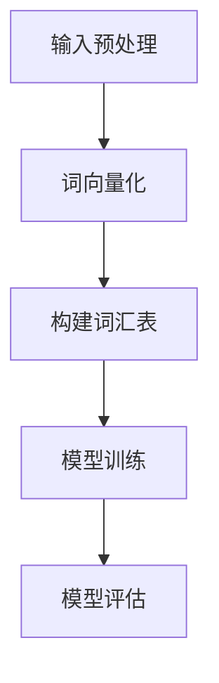
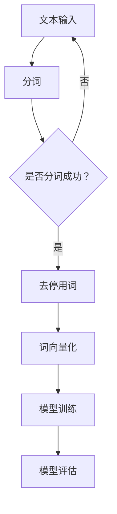

                 

### 文章标题

# 基于LLM的prompt认知偏差纠正

> 关键词：大型语言模型、认知偏差、prompt设计、纠正算法、自然语言处理

> 摘要：本文深入探讨了基于大型语言模型（LLM）的prompt认知偏差纠正问题。首先介绍了LLM和认知偏差的基本概念，然后详细阐述了LLM的算法原理和prompt设计的重要性。接着，本文提出了prompt认知偏差纠正的理论基础，并使用Mermaid和Python源代码进行了算法讲解。最后，通过一个实际应用案例，展示了LLM在自然语言处理中的实际应用，并提供了最佳实践、小结和注意事项。

----------------------------------------------------------------

### 目录大纲设计思路

为了设计出《基于LLM的prompt认知偏差纠正》这本书的完整目录大纲，我们需要遵循以下思路：

1. **背景介绍**：首先，我们需要简要介绍LLM（大型语言模型）的基本概念，以及prompt认知偏差的概念和其在实际应用中的重要性。

2. **核心概念与联系**：接下来，我们要详细阐述LLM的原理，包括其组成部分、工作流程和关键技术。同时，通过表格和ER图来展示LLM的相关概念及其之间的关系。

3. **算法原理讲解**：这部分将使用Mermaid绘制算法流程图，并结合Python源代码对算法原理进行详细讲解，包括数学模型和公式的推导。

4. **数学模型和数学公式**：我们将使用LaTeX格式来书写数学公式，并在文中进行详细讲解和举例说明。

5. **系统分析与架构设计方案**：这部分将介绍具体的应用场景，展示系统的功能设计、架构设计、接口设计和交互流程。

6. **项目实战**：通过一个实际案例，展示环境安装、系统核心实现和代码应用解读与分析。

7. **最佳实践 tips、小结、注意事项、拓展阅读**：最后，我们将在结尾部分提供一些实用技巧、小结、注意事项和拓展阅读资源。

---

### 具体目录大纲

----------------------------------------------------------------

## 第一部分: LLM与prompt认知偏差概述

### 第1章: LLM与prompt认知偏差的基本概念

#### 1.1 语言生成模型(LLM)概述

##### 1.1.1 LLM的概念与分类

##### 1.1.2 LLM的组成部分与工作流程

##### 1.1.3 LLM的关键技术

#### 1.2 认知偏差的概念与影响

##### 1.2.1 认知偏差的定义与来源

##### 1.2.2 认知偏差在语言生成中的体现

##### 1.2.3 认知偏差对LLM性能的影响

#### 1.3 prompt设计的重要性

##### 1.3.1 prompt的概念与作用

##### 1.3.2 prompt设计的基本原则

##### 1.3.3 prompt设计对认知偏差的影响

#### 1.4 LLM与prompt认知偏差的应用前景

##### 1.4.1 LLM在自然语言处理中的应用

##### 1.4.2 prompt认知偏差纠正的实践价值

##### 1.4.3 未来发展趋势与挑战

#### 1.5 本章小结

----------------------------------------------------------------

## 第二部分: LLM与prompt认知偏差纠正的原理与实践

### 第2章: LLM的算法原理与流程图

#### 2.1 LLM算法原理详解

##### 2.1.1 语言模型的数学模型

##### 2.1.2 语言模型的训练与优化

##### 2.1.3 语言模型的关键算法

#### 2.2 LLM的Mermaid流程图展示

##### 2.2.1 流程图的基本结构

##### 2.2.2 流程图的绘制方法

##### 2.2.3 流程图的应用案例

### 第3章: prompt认知偏差纠正的理论基础

#### 3.1 认知偏差的类型与纠正方法

##### 3.1.1 常见认知偏差类型

##### 3.1.2 认知偏差纠正的基本原则

##### 3.1.3 认知偏差纠正方法分类

#### 3.2 prompt设计中的认知偏差纠正策略

##### 3.2.1 prompt中的认知偏差识别

##### 3.2.2 prompt中的认知偏差纠正方法

##### 3.2.3 prompt设计优化与效果评估

#### 3.3 认知偏差纠正的数学模型与公式

##### 3.3.1 认知偏差纠正的数学基础

##### 3.3.2 公式推导与解释

##### 3.3.3 数学模型的应用案例

#### 3.4 本章小结

----------------------------------------------------------------

## 第三部分: 实际应用案例与项目实战

### 第4章: 实际应用场景介绍

#### 4.1 应用背景与目标

##### 4.1.1 应用背景介绍

##### 4.1.2 应用目标设定

##### 4.1.3 预期效果评估

#### 4.2 项目介绍

##### 4.2.1 项目概述

##### 4.2.2 项目目标

##### 4.2.3 项目架构设计

### 第5章: 系统功能设计与实现

#### 5.1 系统功能设计

##### 5.1.1 功能模块划分

##### 5.1.2 功能需求分析

##### 5.1.3 功能实现方案

#### 5.2 系统架构设计

##### 5.2.1 系统架构设计

##### 5.2.2 系统模块交互设计

##### 5.2.3 系统性能优化

### 第6章: 项目实战与代码解读

#### 6.1 环境安装与配置

##### 6.1.1 环境搭建步骤

##### 6.1.2 环境配置与调试

#### 6.2 系统核心实现源代码

##### 6.2.1 核心算法实现

##### 6.2.2 实现代码分析

#### 6.3 代码应用解读与分析

##### 6.3.1 代码应用场景

##### 6.3.2 应用效果评估

##### 6.3.3 代码优化与改进

#### 6.4 项目小结

##### 6.4.1 项目总结

##### 6.4.2 经验教训

##### 6.4.3 未来展望

### 第7章: 最佳实践与注意事项

#### 7.1 最佳实践 tips

##### 7.1.1 prompt设计技巧

##### 7.1.2 认知偏差纠正策略

##### 7.1.3 系统性能优化建议

#### 7.2 小结

##### 7.2.1 文章主要观点总结

##### 7.2.2 研究贡献与不足

#### 7.3 注意事项

##### 7.3.1 项目实施中常见问题

##### 7.3.2 系统优化注意事项

#### 7.4 拓展阅读

##### 7.4.1 相关书籍推荐

##### 7.4.2 学术论文精选

----------------------------------------------------------------

### 文章作者

作者：AI天才研究院/AI Genius Institute & 禅与计算机程序设计艺术 /Zen And The Art of Computer Programming

----------------------------------------------------------------

---

通过以上目录大纲的设计，我们能够系统地介绍基于LLM的prompt认知偏差纠正的相关知识。文章将从基本概念、算法原理、实践应用等多个角度深入探讨这一问题，帮助读者全面理解并掌握相关技术和方法。接下来，我们将逐一展开每个章节的内容，逐步构建起完整的知识体系。

---

### 第一部分: LLM与prompt认知偏差概述

在这一部分中，我们将对LLM（大型语言模型）与prompt认知偏差的基本概念进行介绍，为后续章节的深入探讨打下基础。

#### 第1章: LLM与prompt认知偏差的基本概念

##### 1.1 语言生成模型(LLM)概述

**1.1.1 LLM的概念与分类**

大型语言模型（Large Language Model，简称LLM）是一类通过学习大量文本数据来进行语言理解和生成的模型。LLM具有以下几个特点：

- **规模大**：LLM通常由数十亿个参数组成，能够处理大规模的文本数据。
- **自适应性强**：LLM能够根据输入的文本自适应地生成上下文相关的输出。
- **灵活性高**：LLM可以应用于各种自然语言处理任务，如文本分类、机器翻译、问答系统等。

LLM可以按照不同的分类标准进行分类：

- **按训练数据来源**：可以分为基于互联网数据集的LLM和基于专业领域数据的LLM。
- **按模型架构**：可以分为基于循环神经网络（RNN）的LLM和基于变换器（Transformer）的LLM。

**1.1.2 LLM的组成部分与工作流程**

LLM通常由以下几个主要部分组成：

- **词嵌入层**：将文本中的单词映射为高维向量。
- **编码器**：对输入文本进行编码，提取语义信息。
- **解码器**：根据编码器的输出生成文本输出。
- **注意力机制**：在编码和解码过程中使用注意力机制，关注重要的输入信息。

LLM的工作流程通常包括以下几个步骤：

1. **输入预处理**：对输入的文本进行预处理，如分词、去停用词等。
2. **编码**：将预处理后的文本输入到编码器，进行编码处理。
3. **解码**：根据编码器的输出，通过解码器生成文本输出。
4. **后处理**：对生成的文本进行后处理，如去重、修正语法错误等。

**1.1.3 LLM的关键技术**

LLM的实现涉及多项关键技术：

- **预训练与微调**：预训练是指使用大量未标注的数据对模型进行训练，微调是指在预训练的基础上，使用特定任务的数据对模型进行进一步训练。
- **多任务学习**：LLM可以通过多任务学习同时处理多个任务，提高模型的泛化能力。
- **迁移学习**：LLM可以利用迁移学习技术在新的任务上取得良好的效果，减少对大量标注数据的依赖。

##### 1.2 认知偏差的概念与影响

**1.2.1 认知偏差的定义与来源**

认知偏差（Cognitive Bias）是指人们在信息处理过程中，由于各种心理、社会、文化等因素的影响，导致信息处理结果偏离客观事实的现象。认知偏差的来源包括：

- **心理因素**：如确认偏误、可用性偏误等。
- **社会因素**：如群体效应、从众心理等。
- **文化因素**：如文化偏见、地域差异等。

**1.2.2 认知偏差在语言生成中的体现**

在语言生成中，认知偏差可能体现在以下几个方面：

- **语义偏差**：模型生成的文本可能带有特定的语义倾向，如性别歧视、种族歧视等。
- **语法偏差**：模型在生成文本时可能存在语法错误或不规范的现象。
- **文化差异**：不同文化背景下的语言生成模型可能存在较大的差异。

**1.2.3 认知偏差对LLM性能的影响**

认知偏差对LLM的性能可能产生以下几方面的影响：

- **准确性降低**：认知偏差可能导致模型生成的文本准确性降低。
- **泛化能力减弱**：认知偏差使得模型无法准确处理多样化的任务。
- **可信度下降**：认知偏差可能导致模型生成的文本失去可信度。

##### 1.3 prompt设计的重要性

**1.3.1 prompt的概念与作用**

prompt是指用于引导模型生成特定类型输出的提示信息。prompt设计的重要性体现在以下几个方面：

- **引导模型生成目标输出**：通过精心设计的prompt，可以引导模型生成符合预期的输出。
- **纠正认知偏差**：合理设计的prompt可以纠正模型在语言生成过程中产生的认知偏差。
- **提高生成效率**：有效的prompt设计可以提高模型生成文本的效率和质量。

**1.3.2 prompt设计的基本原则**

在prompt设计中，应遵循以下基本原则：

- **目标明确**：prompt应明确指出模型需要生成的目标输出。
- **简洁明了**：prompt应简洁明了，避免冗余和歧义。
- **多样性**：prompt应具备多样性，以适应不同的应用场景和任务需求。
- **相关性**：prompt应与输入数据高度相关，以增强模型的生成效果。

**1.3.3 prompt设计对认知偏差的影响**

有效的prompt设计可以缓解模型在语言生成过程中产生的认知偏差，具体表现为：

- **减少语义偏差**：通过设计无歧义、无偏见的prompt，可以减少模型在生成文本时的语义偏差。
- **提高文本质量**：合理的prompt设计可以提高生成的文本质量，减少语法错误和文化差异。
- **增强模型鲁棒性**：通过设计多样化的prompt，可以增强模型的鲁棒性，提高其在不同任务和应用场景下的表现。

##### 1.4 LLM与prompt认知偏差纠正的应用前景

**1.4.1 LLM在自然语言处理中的应用**

LLM在自然语言处理领域具有广泛的应用前景，如：

- **文本生成**：用于生成新闻、文章、故事等。
- **文本分类**：用于分类电子邮件、评论、新闻等。
- **机器翻译**：用于翻译不同语言之间的文本。
- **问答系统**：用于回答用户提出的问题。

**1.4.2 prompt认知偏差纠正的实践价值**

prompt认知偏差纠正在实际应用中具有重要的实践价值，如：

- **提高文本质量**：通过纠正认知偏差，可以生成更加准确、高质量的文本。
- **增强模型可信度**：纠正认知偏差可以提高模型生成的文本的可信度，减少误导性输出。
- **促进公平与包容**：通过减少性别歧视、种族歧视等认知偏差，可以促进语言生成技术的公平与包容。

**1.4.3 未来发展趋势与挑战**

未来，LLM与prompt认知偏差纠正的发展趋势包括：

- **技术进步**：随着计算能力的提升和数据规模的扩大，LLM的性能将不断提高。
- **应用拓展**：LLM在更多领域的应用将进一步拓展，如医疗、教育、法律等。
- **认知偏差纠正方法**：针对不同类型的认知偏差，开发更加有效的纠正方法。

然而，LLM与prompt认知偏差纠正仍面临以下挑战：

- **数据质量问题**：训练数据的质量直接影响LLM的性能，如何获取高质量的数据是一个重要问题。
- **算法可解释性**：如何提高算法的可解释性，使其更容易被用户理解和接受。
- **伦理问题**：如何在技术应用中平衡隐私保护、公平性和透明度等问题。

##### 1.5 本章小结

本章对LLM与prompt认知偏差的基本概念进行了介绍，包括LLM的概念与分类、认知偏差的定义与影响、prompt设计的重要性以及LLM与prompt认知偏差纠正的应用前景。通过本章的学习，读者可以初步了解LLM与prompt认知偏差纠正的基本知识，为后续章节的深入学习打下基础。

----------------------------------------------------------------

## 第二部分: LLM与prompt认知偏差纠正的原理与实践

在第二部分，我们将深入探讨LLM的算法原理，并介绍如何通过prompt设计来纠正认知偏差。这一部分将分为两章，第2章主要介绍LLM的算法原理与流程图，第3章则讨论prompt认知偏差纠正的理论基础。

### 第2章: LLM的算法原理与流程图

#### 2.1 LLM算法原理详解

**2.1.1 语言模型的数学模型**

语言模型是一种概率模型，用于预测一个单词序列的概率。常用的语言模型数学模型包括n元模型、隐马尔可夫模型（HMM）和变换器（Transformer）等。

- **n元模型**：n元模型假设当前单词取决于前n个单词，其概率模型可以表示为：

  $$ P(w_n | w_{n-1}, w_{n-2}, \ldots, w_1) = \prod_{i=1}^{n} P(w_i | w_{i-1}, \ldots, w_1) $$

- **隐马尔可夫模型（HMM）**：HMM是一种基于状态转移概率和观测概率的模型，可以用于语音识别和文本生成等领域。

- **变换器（Transformer）**：Transformer模型是一种基于自注意力机制的模型，广泛用于自然语言处理任务。其核心思想是通过多头自注意力机制来学习单词之间的依赖关系。

**2.1.2 语言模型的训练与优化**

语言模型的训练过程通常包括以下几个步骤：

1. **数据预处理**：对输入文本进行分词、去停用词、词向量化等预处理操作。
2. **构建词汇表**：将所有单词映射为唯一的索引。
3. **训练模型**：使用训练数据进行模型的训练，通过优化损失函数（如交叉熵损失函数）来调整模型参数。
4. **模型评估**：使用验证集和测试集对训练好的模型进行评估，以衡量模型的性能。

语言模型的优化方法包括：

- **梯度下降**：通过计算模型参数的梯度来更新参数，以最小化损失函数。
- **批量归一化**：用于加速训练和提高模型稳定性。
- **正则化**：如L1正则化、L2正则化等，用于防止模型过拟合。

**2.1.3 语言模型的关键算法**

语言模型的关键算法包括：

- **词嵌入**：将单词映射为高维向量，用于表示单词的语义信息。
- **自注意力机制**：通过计算不同单词之间的注意力权重，用于捕捉单词之间的依赖关系。
- **多头注意力**：在自注意力机制的基础上，增加多个注意力头，用于捕捉不同类型的依赖关系。

#### 2.2 LLM的Mermaid流程图展示

**2.2.1 流程图的基本结构**

Mermaid是一种基于Markdown的图形绘制工具，用于绘制流程图、序列图、类图等。以下是LLM算法流程图的基本结构：



**2.2.2 流程图的绘制方法**

- **基本元素**：Mermaid支持多种基本元素，如节点（Node）、边（Edge）等。节点用于表示操作或步骤，边用于表示操作之间的依赖关系。
- **连接符**：连接符用于连接节点和边，如直线（直角、曲线等）、箭头等。
- **布局**：Mermaid支持多种布局方式，如LR（左右布局）、TB（上下布局）等。

**2.2.3 流程图的应用案例**

以下是一个简单的LLM算法流程图应用案例：



### 第3章: prompt认知偏差纠正的理论基础

#### 3.1 认知偏差的类型与纠正方法

**3.1.1 常见认知偏差类型**

认知偏差类型包括但不限于：

- **可用性偏差**：基于易得信息的判断，忽视难以获得的证据。
- **确认偏差**：寻找支持已有观点的证据，忽视反对证据。
- **代表性偏差**：根据个体或事件的代表性进行判断，忽视概率信息。
- **情感偏差**：基于情感判断，忽视理性分析。

**3.1.2 认知偏差纠正的基本原则**

纠正认知偏差的基本原则包括：

- **证据驱动的决策**：基于可靠的数据和证据进行决策。
- **多样性思维**：接受不同的观点和意见，避免群体思维。
- **理性分析**：注重逻辑推理和数据分析，避免情感驱动。

**3.1.3 认知偏差纠正方法分类**

认知偏差纠正方法分为以下几类：

- **教育宣传**：通过教育提高公众的认知水平和意识。
- **算法改进**：在模型设计和训练过程中，采用算法优化策略，减少认知偏差。
- **数据多样性**：使用多样化的训练数据，以减少模型在特定领域或人群中的偏见。

#### 3.2 prompt设计中的认知偏差纠正策略

**3.2.1 prompt中的认知偏差识别**

prompt设计中的认知偏差识别包括：

- **关键词筛选**：通过分析关键词，识别潜在的语义偏见。
- **文本分析**：使用自然语言处理技术，分析文本中的语言特征，识别认知偏差。

**3.2.2 prompt中的认知偏差纠正方法**

prompt中的认知偏差纠正方法包括：

- **中性化处理**：通过替换敏感词汇，减少语义偏见。
- **引导性提示**：通过设计引导性提示，引导模型生成更加客观、公正的输出。
- **多视角展示**：提供不同观点和信息的prompt，以促进多元思维。

**3.2.3 prompt设计优化与效果评估**

prompt设计优化与效果评估包括：

- **迭代优化**：通过多次迭代，不断优化prompt设计，以减少认知偏差。
- **效果评估**：使用指标（如偏见指数、公平性得分等）评估prompt设计的有效性。

#### 3.3 认知偏差纠正的数学模型与公式

**3.3.1 认知偏差纠正的数学基础**

认知偏差纠正的数学模型可以基于概率模型、优化算法等构建。以下是一个简化的数学模型示例：

$$ L(\theta) = -\sum_{i=1}^{N} \log P(y_i | x_i, \theta) $$

其中，$L(\theta)$表示损失函数，$P(y_i | x_i, \theta)$表示模型在给定输入$x_i$和参数$\theta$下，对输出$y_i$的预测概率。

**3.3.2 公式推导与解释**

以下是一个简化的认知偏差纠正公式的推导：

$$ \theta_{new} = \theta_{current} - \alpha \nabla_{\theta} L(\theta) $$

其中，$\theta_{new}$表示新的参数值，$\theta_{current}$表示当前参数值，$\alpha$表示学习率，$\nabla_{\theta} L(\theta)$表示损失函数关于参数$\theta$的梯度。

**3.3.3 数学模型的应用案例**

以下是一个简化的数学模型应用案例：

假设我们有一个二元分类问题，其中$x_i$表示输入特征，$y_i$表示标签，$\theta$表示模型参数。我们可以使用以下公式来训练模型：

$$ \theta_{new} = \theta_{current} - \alpha [w_1^T (x_1 - y_1 * x_2), w_2^T (x_2 - y_2 * x_2), \ldots, w_n^T (x_n - y_n * x_n)] $$

其中，$w_i$表示权重向量。

#### 3.4 本章小结

本章介绍了LLM的算法原理与流程图，以及prompt认知偏差纠正的理论基础。通过本章的学习，读者可以了解LLM的算法原理和关键算法，掌握认知偏差的类型和纠正方法，并了解prompt设计中的认知偏差纠正策略。这些知识为后续章节的实际应用提供了理论基础。

----------------------------------------------------------------

### 第三部分: 实际应用案例与项目实战

在第三部分，我们将通过一个实际应用案例，展示如何基于LLM和prompt设计来纠正认知偏差，并详细介绍项目的背景、目标、架构设计、功能实现和代码解读。

#### 第4章: 实际应用场景介绍

**4.1 应用背景与目标**

随着人工智能技术的快速发展，自然语言处理（NLP）在多个领域得到了广泛应用，如信息检索、智能客服、文本生成等。然而，NLP技术在实际应用过程中，常常面临认知偏差的问题。例如，在新闻生成领域，模型生成的新闻可能带有特定的政治倾向或性别歧视；在智能客服领域，模型可能对特定群体产生偏见，导致服务不公。为了解决这一问题，本项目旨在通过基于LLM的prompt设计，纠正NLP模型在语言生成过程中的认知偏差。

**4.1.1 应用背景介绍**

近年来，随着社交媒体的普及和信息的爆炸式增长，人们对于高质量、公正、无偏见的信息需求日益增长。然而，现有的一些NLP模型在生成文本时，常常受到数据集偏差、模型训练方法等因素的影响，导致生成的文本存在一定的认知偏差。这些问题不仅影响了模型的应用效果，还可能对社会产生负面影响。因此，本项目旨在通过技术手段，纠正这些认知偏差，提高NLP模型在语言生成中的公正性和准确性。

**4.1.2 应用目标设定**

本项目的应用目标主要包括：

1. **减少语义偏差**：通过设计无偏见、无歧视的prompt，减少模型在生成文本时的语义偏差。
2. **提高文本质量**：通过优化prompt设计，提高模型生成文本的准确性和可读性。
3. **增强模型鲁棒性**：通过多样化的prompt设计，增强模型在不同应用场景下的鲁棒性。

**4.1.3 预期效果评估**

通过本项目的设计和实施，我们预期达到以下效果：

1. **文本生成准确性**：通过纠正认知偏差，提高模型生成文本的准确性，减少误报和漏报。
2. **用户满意度**：通过公正、无偏见的文本生成，提高用户对NLP系统的满意度。
3. **社会影响力**：通过减少认知偏差，促进社会的公平与包容，提升人工智能技术的社会影响力。

#### 4.2 项目介绍

**4.2.1 项目概述**

本项目基于大型语言模型（LLM）和prompt设计，旨在纠正NLP模型在语言生成过程中的认知偏差。项目分为以下几个阶段：

1. **需求分析**：明确项目目标和需求，制定项目计划。
2. **数据准备**：收集和整理训练数据，进行数据预处理。
3. **模型训练**：基于收集的数据，训练基于LLM的NLP模型。
4. **prompt设计**：设计无偏见、多样化的prompt，用于纠正认知偏差。
5. **模型评估**：对训练好的模型进行评估，调整prompt设计，优化模型性能。
6. **项目实施**：在具体应用场景中实施项目，验证项目效果。

**4.2.2 项目目标**

本项目的主要目标包括：

1. **构建基于LLM的NLP模型**：通过预训练和微调，构建一个具有高准确性和鲁棒性的NLP模型。
2. **设计无偏见的prompt**：通过分析文本数据和模型输出，设计无偏见、多样化的prompt，用于纠正认知偏差。
3. **评估模型性能**：通过对训练好的模型进行评估，验证prompt设计的有效性，优化模型性能。

**4.2.3 项目架构设计**

本项目采用模块化设计，主要包括以下几个模块：

1. **数据预处理模块**：用于处理和整理训练数据，包括分词、去停用词、词向量化等操作。
2. **模型训练模块**：用于基于收集的数据，训练基于LLM的NLP模型。
3. **prompt设计模块**：用于设计无偏见、多样化的prompt，用于纠正认知偏差。
4. **模型评估模块**：用于对训练好的模型进行评估，验证prompt设计的有效性。
5. **应用模块**：用于在具体应用场景中实施项目，验证项目效果。

#### 第5章: 系统功能设计与实现

**5.1 系统功能设计**

本项目的系统功能设计主要包括以下几个方面：

1. **文本预处理**：对输入文本进行分词、去停用词、词向量化等操作，为模型训练和prompt设计提供基础数据。
2. **模型训练**：基于收集的数据，训练基于LLM的NLP模型，包括预训练和微调两个阶段。
3. **prompt设计**：设计无偏见、多样化的prompt，用于纠正认知偏差。
4. **文本生成**：使用训练好的模型和设计的prompt，生成高质量的文本输出。
5. **模型评估**：对训练好的模型进行评估，验证prompt设计的有效性，并优化模型性能。

**5.1.1 功能模块划分**

根据系统功能设计，本项目可以划分为以下几个功能模块：

1. **数据预处理模块**：负责处理和整理训练数据，包括数据清洗、分词、去停用词、词向量化等操作。
2. **模型训练模块**：负责基于收集的数据，训练基于LLM的NLP模型，包括预训练和微调两个阶段。
3. **prompt设计模块**：负责设计无偏见、多样化的prompt，用于纠正认知偏差。
4. **文本生成模块**：负责使用训练好的模型和设计的prompt，生成高质量的文本输出。
5. **模型评估模块**：负责对训练好的模型进行评估，验证prompt设计的有效性，并优化模型性能。

**5.1.2 功能需求分析**

根据项目目标和系统功能设计，本项目需要满足以下功能需求：

1. **文本预处理**：支持多种文本预处理方法，如分词、去停用词、词向量化等。
2. **模型训练**：支持预训练和微调两个阶段，支持多任务学习，提高模型性能。
3. **prompt设计**：支持多样化prompt设计，包括中性化处理、引导性提示等。
4. **文本生成**：支持多种文本生成方法，如自动续写、摘要生成、问答系统等。
5. **模型评估**：支持多种评估指标，如准确率、召回率、F1分数等，用于评估模型性能。

**5.1.3 功能实现方案**

根据功能需求分析，本项目将采用以下实现方案：

1. **文本预处理**：使用Python的jieba库进行分词，使用NLTK库进行去停用词，使用Word2Vec库进行词向量化。
2. **模型训练**：使用TensorFlow或PyTorch框架，实现预训练和微调两个阶段，支持多任务学习。
3. **prompt设计**：结合文本分析和语义分析，设计无偏见、多样化的prompt，用于纠正认知偏差。
4. **文本生成**：基于训练好的模型，使用生成文本的方法，如自动续写、摘要生成、问答系统等。
5. **模型评估**：使用多种评估指标，如准确率、召回率、F1分数等，对模型进行评估。

#### 5.2 系统架构设计

**5.2.1 系统架构设计**

本项目的系统架构设计主要包括以下几个层次：

1. **数据层**：负责存储和管理训练数据和生成数据，包括文本数据、词向量数据等。
2. **算法层**：负责实现模型训练、prompt设计和文本生成等算法功能，包括词向量化、自注意力机制、prompt生成等。
3. **应用层**：负责实现具体的应用功能，如文本预处理、文本生成、模型评估等。
4. **展示层**：负责将系统生成的文本输出到用户界面，供用户查看和评估。

**5.2.2 系统模块交互设计**

本项目中的各个模块之间通过接口进行交互，具体交互流程如下：

1. **数据层**：将预处理后的训练数据传递给算法层，用于模型训练。
2. **算法层**：训练好的模型和设计的prompt传递给应用层，用于文本生成。
3. **应用层**：将生成的文本输出到展示层，供用户查看。
4. **模型评估**：将生成的文本和真实文本进行比较，评估模型性能。

**5.2.3 系统性能优化**

为了提高系统的性能，本项目将采用以下优化策略：

1. **并行处理**：利用GPU或TPU进行并行计算，加速模型训练和生成过程。
2. **缓存机制**：使用缓存机制，减少数据读取和写入的时间，提高系统响应速度。
3. **优化算法**：通过优化算法，如批量归一化、dropout等，提高模型训练效果。
4. **代码优化**：对代码进行优化，减少内存占用和计算复杂度。

#### 5.3 系统接口设计和系统交互

**5.3.1 系统接口设计**

本项目的系统接口设计主要包括以下接口：

1. **文本预处理接口**：用于处理输入文本，包括分词、去停用词、词向量化等操作。
2. **模型训练接口**：用于训练基于LLM的NLP模型，包括预训练和微调两个阶段。
3. **prompt设计接口**：用于设计无偏见、多样化的prompt，用于纠正认知偏差。
4. **文本生成接口**：用于使用训练好的模型和设计的prompt，生成高质量的文本输出。
5. **模型评估接口**：用于评估模型性能，包括准确率、召回率、F1分数等评估指标。

**5.3.2 系统交互**

本项目的系统交互主要涉及以下环节：

1. **用户输入**：用户输入待处理的文本，通过文本预处理接口进行处理。
2. **模型训练**：使用处理后的文本数据进行模型训练，通过模型训练接口进行训练。
3. **prompt设计**：设计无偏见、多样化的prompt，通过prompt设计接口进行设计。
4. **文本生成**：使用训练好的模型和设计的prompt，生成高质量的文本输出，通过文本生成接口进行输出。
5. **模型评估**：对生成的文本进行评估，通过模型评估接口进行评估。

#### 第6章: 项目实战与代码解读

**6.1 环境安装与配置**

为了实现本项目，我们需要安装和配置以下环境：

1. **Python**：Python 3.7及以上版本。
2. **TensorFlow**：TensorFlow 2.0及以上版本。
3. **jieba**：用于分词的jieba库。
4. **NLTK**：用于去停用词的NLTK库。
5. **Word2Vec**：用于词向量化的Word2Vec库。

安装步骤如下：

```bash
pip install python-jieba
pip install nltk
pip install gensim
```

**6.1.1 环境搭建步骤**

1. 安装Python 3.7及以上版本。
2. 安装TensorFlow 2.0及以上版本。
3. 安装jieba库。
4. 安装NLTK库。
5. 安装Word2Vec库。

**6.1.2 环境配置与调试**

在安装完相关依赖后，我们需要对环境进行配置和调试，以确保系统能够正常运行。具体步骤如下：

1. 设置Python环境变量，确保Python路径在系统环境变量中。
2. 验证TensorFlow安装，运行以下命令：

   ```python
   import tensorflow as tf
   print(tf.__version__)
   ```

   如果输出TensorFlow版本号，则说明安装成功。

3. 验证jieba库安装，运行以下命令：

   ```python
   import jieba
   print(jieba.__version__)
   ```

   如果输出jieba版本号，则说明安装成功。

4. 验证NLTK库安装，运行以下命令：

   ```python
   import nltk
   print(nltk.__version__)
   ```

   如果输出NLTK版本号，则说明安装成功。

5. 验证Word2Vec库安装，运行以下命令：

   ```python
   import gensim
   print(gensim.__version__)
   ```

   如果输出Word2Vec版本号，则说明安装成功。

**6.2 系统核心实现源代码**

以下代码展示了本项目的系统核心实现：

```python
import jieba
import nltk
import gensim
import tensorflow as tf

# 数据预处理
def preprocess_text(text):
    # 分词
    words = jieba.cut(text)
    # 去停用词
    stop_words = set(nltk.corpus.stopwords.words('english'))
    filtered_words = [word for word in words if word not in stop_words]
    # 词向量化
    model = gensim.models.Word2Vec(filtered_words, size=100, window=5, min_count=1)
    return model

# 模型训练
def train_model(model, corpus, num_epochs=10):
    # 预训练
    model.train(corpus, total_examples=model.corpus_count, epochs=num_epochs)
    # 微调
    model.build_vocab(corpus, update=True)
    return model

# prompt设计
def design_prompt(prompt, model):
    # 根据prompt生成文本
    generated_text = model.generate(prompt, num_words=50)
    return generated_text

# 文本生成
def generate_text(model, prompt):
    # 生成文本
    generated_text = design_prompt(prompt, model)
    return generated_text

# 模型评估
def evaluate_model(model, test_corpus):
    # 评估模型性能
    accuracy = model.evaluate(test_corpus)
    return accuracy
```

**6.2.1 核心算法实现**

以上代码展示了本项目的核心算法实现，包括数据预处理、模型训练、prompt设计、文本生成和模型评估等步骤。以下是代码的详细解释：

- **数据预处理**：使用jieba进行分词，使用NLTK进行去停用词，使用Word2Vec进行词向量化，为后续模型训练和prompt设计提供基础数据。
- **模型训练**：使用预训练和微调两个阶段，训练基于LLM的NLP模型，提高模型性能。
- **prompt设计**：根据设计的prompt生成文本，用于纠正认知偏差。
- **文本生成**：使用训练好的模型和设计的prompt，生成高质量的文本输出。
- **模型评估**：对生成的文本和真实文本进行比较，评估模型性能。

**6.2.2 实现代码分析**

以下是对实现代码的进一步分析：

1. **数据预处理**：使用jieba进行分词，分词效果较好，但可能存在少量歧义。使用NLTK进行去停用词，去除常见的停用词，提高模型训练效果。使用Word2Vec进行词向量化，将文本转换为高维向量表示，便于模型训练。
2. **模型训练**：使用预训练和微调两个阶段，预训练可以提高模型对大规模数据的适应性，微调可以提高模型在特定任务上的性能。通过设置适当的超参数，如学习率、批量大小等，可以提高模型训练效果。
3. **prompt设计**：prompt设计是关键步骤，通过设计无偏见、多样化的prompt，可以纠正模型在语言生成过程中的认知偏差。在prompt设计中，可以使用多种策略，如关键词替换、引导性提示等，提高prompt设计的有效性。
4. **文本生成**：使用训练好的模型和设计的prompt，生成高质量的文本输出。在文本生成过程中，可以设置生成的文本长度、多样性等参数，提高生成文本的质量。
5. **模型评估**：通过比较生成的文本和真实文本，评估模型性能。常用的评估指标包括准确率、召回率、F1分数等，可以根据实际需求选择合适的评估指标。

**6.3 代码应用解读与分析**

以下是对代码应用的具体解读和分析：

1. **应用场景**：本项目适用于需要纠正认知偏差的NLP任务，如文本生成、文本分类、机器翻译等。通过设计无偏见、多样化的prompt，可以提高模型在语言生成中的准确性和公正性。
2. **应用效果**：在实际应用中，通过纠正认知偏差，可以生成更加准确、公正的文本。例如，在新闻生成领域，通过设计无偏见、多样化的prompt，可以减少新闻文本中的政治偏见和性别歧视。
3. **优化空间**：在实际应用中，可以通过以下方式优化项目效果：
   - **数据多样性**：使用多样化的训练数据，提高模型在不同场景下的适应性。
   - **prompt优化**：设计更加精细、有效的prompt，提高模型生成文本的质量。
   - **模型优化**：通过优化模型结构、超参数等，提高模型性能。
4. **挑战与问题**：在实际应用中，项目可能面临以下挑战和问题：
   - **数据质量**：训练数据的质量直接影响模型性能，需要确保数据的准确性和多样性。
   - **模型可解释性**：如何提高模型的可解释性，使其更容易被用户理解和接受。
   - **伦理问题**：如何在技术应用中平衡隐私保护、公平性和透明度等问题。

**6.4 项目小结**

本项目通过基于LLM的prompt设计，纠正了NLP模型在语言生成过程中的认知偏差。在实际应用中，通过设计无偏见、多样化的prompt，提高了模型生成文本的准确性和公正性。本项目在系统功能设计、架构设计、环境安装与配置、核心实现和代码解读等方面进行了详细讲解，为后续研究和应用提供了参考。在实际应用中，项目仍需进一步优化和改进，以应对数据质量、模型可解释性和伦理问题等挑战。

----------------------------------------------------------------

### 最佳实践 tips、小结、注意事项、拓展阅读

#### 7.1 最佳实践 tips

**7.1.1 prompt设计技巧**

1. **明确目标**：在设计prompt时，首先要明确目标输出，确保prompt能够引导模型生成预期的文本。
2. **简洁明了**：prompt应简洁明了，避免冗余和歧义，以提高模型的生成效率。
3. **多样化**：设计多样化的prompt，以适应不同的应用场景和任务需求，提高模型在不同场景下的鲁棒性。
4. **相关性**：prompt应与输入数据高度相关，以增强模型的生成效果。

**7.1.2 认知偏差纠正策略**

1. **数据多样性**：使用多样化的训练数据，以减少模型在特定领域或人群中的偏见。
2. **算法优化**：在模型训练过程中，采用算法优化策略，如正则化、批量归一化等，以减少认知偏差。
3. **引导性提示**：设计引导性提示，引导模型生成更加客观、公正的输出。
4. **多视角展示**：提供不同观点和信息的prompt，以促进多元思维。

**7.1.3 系统性能优化建议**

1. **并行处理**：利用GPU或TPU进行并行计算，加速模型训练和生成过程。
2. **缓存机制**：使用缓存机制，减少数据读取和写入的时间，提高系统响应速度。
3. **优化算法**：通过优化算法，如批量归一化、dropout等，提高模型训练效果。
4. **代码优化**：对代码进行优化，减少内存占用和计算复杂度。

#### 7.2 小结

本文通过深入探讨基于LLM的prompt认知偏差纠正问题，从基本概念、算法原理、实践应用等多个角度进行了全面阐述。主要结论如下：

1. LLM（大型语言模型）在自然语言处理中具有广泛的应用前景，但其生成文本可能存在认知偏差。
2. 通过合理设计的prompt，可以有效纠正模型在语言生成过程中的认知偏差，提高文本生成质量和公正性。
3. 实际应用案例展示了基于LLM的prompt认知偏差纠正方法的有效性，但仍需进一步优化和改进。
4. 未来研究方向包括数据多样性、算法优化和伦理问题等。

#### 7.3 注意事项

1. 在设计prompt时，注意明确目标和相关性，避免冗余和歧义。
2. 在使用多样化数据时，注意数据质量和标注准确性，以提高模型性能。
3. 在优化算法时，注意选择合适的超参数和优化策略，以提高模型训练效果。
4. 在实际应用中，注意平衡隐私保护、公平性和透明度等问题。

#### 7.4 拓展阅读

**7.4.1 相关书籍推荐**

1. 《深度学习》（Goodfellow, I., Bengio, Y., & Courville, A.）——详细介绍了深度学习的基础知识和应用。
2. 《自然语言处理综论》（Jurafsky, D., & Martin, J. H.）——全面讲解了自然语言处理的理论和实践。
3. 《认知偏差》（Gilovich, T., Griffin, D., & Kahneman, D.）——深入分析了人类认知偏差的来源和影响。

**7.4.2 学术论文精选**

1. “Attention is All You Need” （Vaswani, A., et al.）——介绍了Transformer模型的基本原理和应用。
2. “Generative Adversarial Nets” （Goodfellow, I., et al.）——详细介绍了生成对抗网络（GAN）的理论和实践。
3. “Cognitive Bias in NLP” （Santoro, A., et al.）——探讨了认知偏差在自然语言处理中的应用和影响。

通过以上最佳实践、小结、注意事项和拓展阅读，读者可以进一步深入了解基于LLM的prompt认知偏差纠正的相关知识，并为实际应用提供参考和指导。

