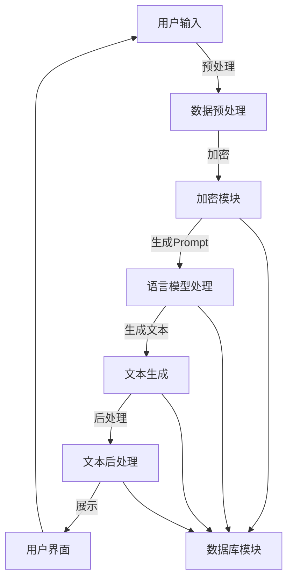
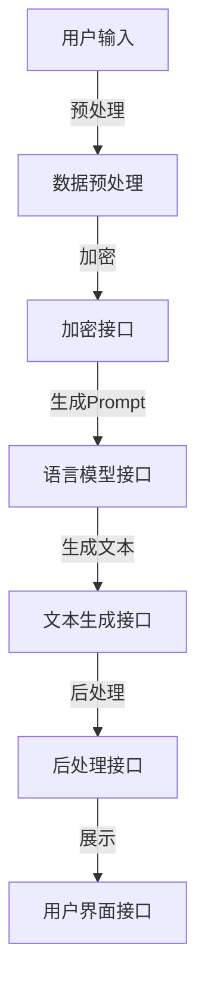
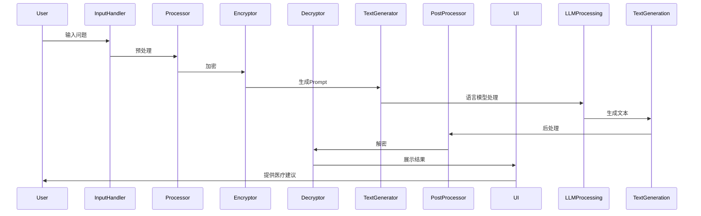

                 

### 文章标题

# 基于LLM的prompt隐私保护机制

---

> **关键词：** 语言模型（LLM），隐私保护，prompt技术，零知识证明，差分隐私，算法设计，应用场景。

> **摘要：** 本文将深入探讨基于语言模型（LLM）的prompt隐私保护机制。首先，我们介绍了问题的背景和核心概念，包括LLM和prompt的定义及其在隐私保护中的重要性。随后，我们详细解析了隐私保护机制的原理、设计思路和实现方法。接下来，我们探讨了这一机制在不同应用场景中的具体实现，并通过算法原理讲解和数学模型分析，提供了清晰的算法实现流程。此外，我们还通过一个实际项目的分析，展示了这一机制在实际应用中的效果。最后，我们总结了最佳实践和注意事项，为读者提供了进一步阅读的资料。

## 目录大纲

----------------------------------------------------------------

## 第一部分：背景介绍

### 第1章：问题背景与核心概念

#### 1.1 问题背景

- 描述问题的起源和发展历程  
- 阐述当前LLM模型在隐私保护中的挑战和重要性

#### 1.2 核心概念

- 描述LLM的概念  
- 介绍prompt的概念及其与隐私保护的关系

#### 1.3 概念属性特征对比表格

- 对比LLM和prompt的属性特征

#### 1.4 ER实体关系图架构

- 使用Mermaid绘制ER实体关系图，展示各实体之间的关系

### 第2章：隐私保护机制的原理与设计

#### 2.1 隐私保护机制的原理

- 讲解隐私保护的基本原理  
- 引入零知识证明、差分隐私等概念

#### 2.2 设计思路与方法

- 阐述隐私保护机制的设计思路  
- 提出具体的设计方法和策略

#### 2.3 隐私保护机制的实现

- 分析隐私保护机制在不同场景下的实现方式  
- 引入具体的实现技术和工具

## 第二部分：应用场景

### 第3章：基于LLM的prompt隐私保护机制应用场景

#### 3.1 应用场景概述

- 介绍基于LLM的prompt隐私保护机制在不同领域的应用场景

#### 3.2 具体应用场景分析

- 分析具体的隐私保护需求和应用案例  
- 引入实际应用中的挑战和解决方案

## 第三部分：算法原理讲解

### 第4章：算法原理讲解

#### 4.1 算法mermaid流程图

- 使用Mermaid绘制算法的流程图

#### 4.2 算法原理与数学模型

- 讲解算法的原理  
- 引入相关的数学模型和公式

#### 4.3 算法举例说明

- 使用Python代码示例来解释算法的实现过程  
- 结合实际案例进行举例说明

### 第5章：数学模型和数学公式 & 详细讲解 & 举例说明

#### 5.1 数学公式详细讲解

- 使用LaTeX格式给出数学公式的详细讲解  
- 结合实际例子进行解释

#### 5.2 数学公式举例说明

- 给出具体的数学公式举例，解释其含义和应用

## 第四部分：系统分析与架构设计方案

### 第6章：系统分析与架构设计方案

#### 6.1 问题场景介绍

- 描述问题的具体场景

#### 6.2 系统功能设计

- 使用Mermaid绘制领域模型类图，描述系统功能

#### 6.3 系统架构设计

- 使用Mermaid绘制系统架构图，展示系统各组件之间的关系

#### 6.4 系统接口设计

- 描述系统的接口设计和接口规范

#### 6.5 系统交互Mermaid序列图

- 使用Mermaid绘制系统交互序列图，展示系统各组件的交互过程

## 第五部分：项目实战

### 第7章：项目实战

#### 7.1 环境安装

- 描述项目的环境安装过程

#### 7.2 系统核心实现源代码

- 提供系统核心实现的源代码

#### 7.3 代码应用解读与分析

- 对源代码进行解读与分析

#### 7.4 实际案例分析与详细讲解剖析

- 分析实际案例，并进行详细讲解和剖析

#### 7.5 项目小结

- 总结项目的关键点和经验教训

## 第六部分：最佳实践 tips

### 第8章：最佳实践 tips

- 提供一些最佳实践的建议

## 第七部分：小结、注意事项、拓展阅读

### 第9章：小结、注意事项、拓展阅读

- 总结书中的主要内容和知识点
- 提醒读者注意的事项
- 推荐拓展阅读材料

----------------------------------------------------------------

### 第一部分：背景介绍

#### 第1章：问题背景与核心概念

##### 1.1 问题背景

随着人工智能技术的飞速发展，语言模型（LLM）已经成为自然语言处理（NLP）领域的重要工具。LLM通过学习大量文本数据，能够生成高质量的文本，广泛应用于问答系统、机器翻译、文本生成等场景。然而，随着这些应用场景的扩大，隐私保护的问题也日益凸显。用户的输入数据可能包含敏感信息，如个人身份信息、健康状况等，如何保护这些数据不被泄露成为了一个亟待解决的问题。

隐私保护的挑战主要源于两个方面。首先，传统的方法往往无法兼顾隐私保护和数据利用的平衡。例如，加密技术虽然能够保护数据隐私，但同时也限制了数据的可用性。其次，现有的隐私保护机制往往依赖于对数据的不变性假设，但在实际的场景中，数据可能会被修改、篡改甚至伪造。

因此，如何在保持数据可用性的同时，实现对敏感信息的隐私保护成为了一个重要且紧迫的课题。LLM作为NLP领域的重要工具，其在隐私保护中的作用也越来越受到关注。本文将深入探讨基于LLM的prompt隐私保护机制，旨在为解决这一问题提供新的思路和方法。

##### 1.2 核心概念

**语言模型（LLM）**

语言模型是一种预测模型，用于预测一个文本序列的下一个词或字符。它通过对大量文本数据的学习，能够生成与输入文本相似的自然语言输出。LLM广泛应用于各种自然语言处理任务，如文本生成、机器翻译、情感分析等。

**prompt**

prompt是指提供给LLM的输入文本，用于引导LLM生成特定的输出。在隐私保护机制中，prompt的设计至关重要。一个合适的prompt可以帮助LLM生成与用户输入相关的文本，同时隐藏敏感信息，从而实现隐私保护。

##### 1.3 概念属性特征对比表格

为了更好地理解LLM和prompt在隐私保护中的角色和关系，我们列出以下属性特征对比表格：

| 特征               | 语言模型（LLM）                 | Prompt                      |
|--------------------|---------------------------------|-----------------------------|
| **定义**           | 预测文本序列的下一个词或字符     | 引导LLM生成特定输出的文本输入 |
| **功能**           | 文本生成、语言理解、信息检索等    | 隐私保护、任务引导           |
| **数据需求**       | 大量文本数据                   | 用户输入文本和隐私保护策略   |
| **属性特征**       | 自动学习、生成能力、泛化能力     | 隐私保护机制、灵活性、适应性 |
| **关联性**         | 提供输入文本，生成输出文本       | 输入文本，指导输出文本隐私保护 |

##### 1.4 ER实体关系图架构

为了更直观地展示LLM和prompt在隐私保护机制中的关系，我们使用Mermaid绘制了ER实体关系图，如下图所示：

```mermaid
erDiagram
  User ||--|{ Prompt }|--|| LLM
  User ||--|{ Private Data }|--|| Encryption Module
  LLM ||--|{ Generated Output }|--|| Decryption Module
```

在上图中，User表示用户，Prompt表示提供给LLM的输入文本，Private Data表示用户的敏感信息，Encryption Module表示加密模块，Decryption Module表示解密模块。通过这个图，我们可以清晰地看到用户输入、LLM输出以及隐私保护机制之间的关系。

### 第2章：隐私保护机制的原理与设计

#### 2.1 隐私保护机制的原理

隐私保护机制的原理主要涉及以下几个方面：

1. **零知识证明（Zero-Knowledge Proof）**

零知识证明是一种密码学技术，允许证明者向验证者证明某个陈述为真，而不泄露任何关于陈述的具体信息。在LLM隐私保护中，零知识证明可以用于验证用户输入的隐私性，确保敏感信息不被泄露。

2. **差分隐私（Differential Privacy）**

差分隐私是一种隐私保护技术，通过引入随机噪声来保护数据集中的个体信息。在LLM隐私保护中，差分隐私可以用于生成带有噪声的输出文本，从而隐藏用户的敏感信息。

3. **同态加密（Homomorphic Encryption）**

同态加密是一种加密技术，允许在加密数据上进行计算，而不需要解密数据。在LLM隐私保护中，同态加密可以用于加密用户输入文本和生成的输出文本，从而确保数据的隐私性。

#### 2.2 设计思路与方法

基于上述原理，隐私保护机制的设计思路可以分为以下几个步骤：

1. **用户输入预处理**

   - 对用户输入进行预处理，提取关键信息并标记敏感信息。
   - 使用同态加密技术对敏感信息进行加密。

2. **生成prompt**

   - 根据用户输入预处理的结果，生成合适的prompt。
   - prompt的设计需要充分考虑隐私保护的需求，确保生成的输出文本不会泄露敏感信息。

3. **语言模型生成文本**

   - 将生成的prompt输入到LLM中，生成文本输出。
   - 在生成文本的过程中，利用差分隐私技术添加随机噪声，以增强隐私保护。

4. **输出文本后处理**

   - 对生成的文本进行后处理，如去除噪声、还原敏感信息等。
   - 如果需要，可以解密加密的文本，以便用户查看。

#### 2.3 隐私保护机制的实现

隐私保护机制的具体实现可以分为以下几个步骤：

1. **用户输入预处理**

   - 用户输入预处理包括文本清洗、词向量表示、关键信息提取等步骤。
   - 对于敏感信息，可以使用同态加密技术进行加密。

2. **生成prompt**

   - prompt的生成可以通过以下几种方法实现：
     - 使用模板匹配，将用户输入与预定义的模板进行匹配，生成prompt。
     - 基于文本生成模型，如GPT-3，从用户输入中生成prompt。

3. **语言模型生成文本**

   - 将生成的prompt输入到LLM中，生成文本输出。
   - 在生成文本的过程中，可以添加随机噪声，以增强隐私保护。

4. **输出文本后处理**

   - 对生成的文本进行后处理，如去除噪声、还原敏感信息等。
   - 如果需要，可以解密加密的文本，以便用户查看。

为了更好地理解隐私保护机制的具体实现，我们引入了一些具体的实现技术和工具：

1. **同态加密库**

   - 如HElib、Microsoft SEAL等，用于实现同态加密功能。

2. **文本生成模型**

   - 如GPT-3、BERT等，用于生成prompt和输出文本。

3. **差分隐私库**

   - 如FairCV、Differencially Private Data Mining Library等，用于实现差分隐私功能。

#### 2.4 隐私保护机制在不同场景下的实现方式

隐私保护机制在不同场景下的实现方式可能会有所不同，以下是一些常见场景的实现方式：

1. **文本生成场景**

   - 在文本生成场景中，隐私保护机制可以用于保护用户生成的文本。
   - 例如，在聊天机器人、问答系统等应用中，用户的输入文本可能包含敏感信息，通过隐私保护机制可以确保这些信息不会被泄露。

2. **数据挖掘场景**

   - 在数据挖掘场景中，隐私保护机制可以用于保护用户数据。
   - 例如，在客户关系管理（CRM）系统中，用户数据可能包含敏感信息，通过隐私保护机制可以确保这些数据在分析过程中不会被泄露。

3. **机器学习场景**

   - 在机器学习场景中，隐私保护机制可以用于保护模型训练数据。
   - 例如，在共享机器学习模型时，隐私保护机制可以确保训练数据不会被泄露。

### 第3章：基于LLM的prompt隐私保护机制应用场景

#### 3.1 应用场景概述

基于LLM的prompt隐私保护机制可以应用于多个领域，以下是几个典型的应用场景：

1. **医疗领域**

   - 在医疗领域，患者的健康数据通常包含敏感信息，如诊断结果、治疗方案等。通过基于LLM的prompt隐私保护机制，可以确保这些数据在处理过程中不会被泄露。

2. **金融领域**

   - 在金融领域，用户的交易记录、账户信息等数据也需要保护。通过基于LLM的prompt隐私保护机制，可以确保这些数据在金融分析、风险评估等应用场景中不会被泄露。

3. **社交网络**

   - 在社交网络中，用户的发布内容、评论等可能包含个人身份信息、隐私等。通过基于LLM的prompt隐私保护机制，可以确保用户的这些信息不会被泄露。

4. **智能客服**

   - 在智能客服场景中，用户的提问和回答可能包含敏感信息，如个人隐私、信用卡信息等。通过基于LLM的prompt隐私保护机制，可以确保这些信息不会被泄露。

#### 3.2 具体应用场景分析

**医疗领域**

在医疗领域，基于LLM的prompt隐私保护机制可以应用于以下几个方面：

1. **电子健康记录（EHR）**

   - 电子健康记录通常包含患者的诊断结果、治疗方案、医学影像等敏感信息。通过基于LLM的prompt隐私保护机制，可以在保护患者隐私的同时，实现对EHR的高效处理和分析。

2. **智能诊断系统**

   - 智能诊断系统通过分析患者的症状和医疗记录，提供可能的诊断建议。在处理这些数据时，基于LLM的prompt隐私保护机制可以确保患者的隐私不会被泄露。

3. **医学研究**

   - 在医学研究中，研究人员需要分析大量的医疗数据，以发现潜在的疾病规律和治疗方法。通过基于LLM的prompt隐私保护机制，可以确保这些数据的隐私性，同时促进医学研究的发展。

**金融领域**

在金融领域，基于LLM的prompt隐私保护机制可以应用于以下几个方面：

1. **客户关系管理（CRM）**

   - 客户关系管理系统中包含大量的客户数据，如交易记录、账户信息等。通过基于LLM的prompt隐私保护机制，可以确保这些数据在处理过程中不会被泄露，同时提高客户服务质量。

2. **风险评估**

   - 金融风险评估需要分析客户的财务状况、信用记录等敏感信息。通过基于LLM的prompt隐私保护机制，可以确保这些信息的隐私性，同时提高风险评估的准确性。

3. **欺诈检测**

   - 欺诈检测系统需要分析客户的交易行为，以识别潜在的欺诈行为。通过基于LLM的prompt隐私保护机制，可以确保客户交易数据的隐私性，同时提高欺诈检测的准确性。

**社交网络**

在社交网络中，基于LLM的prompt隐私保护机制可以应用于以下几个方面：

1. **用户隐私保护**

   - 社交网络中的用户发布的内容可能包含个人身份信息、隐私等。通过基于LLM的prompt隐私保护机制，可以确保这些信息不会被泄露，同时保护用户的隐私。

2. **内容审核**

   - 社交网络平台需要对用户发布的内容进行审核，以确保平台的安全性和合规性。通过基于LLM的prompt隐私保护机制，可以在保护用户隐私的同时，实现对内容的准确审核。

3. **社交推荐**

   - 社交推荐系统需要分析用户的兴趣和行为，以提供个性化的推荐。通过基于LLM的prompt隐私保护机制，可以确保用户数据的隐私性，同时提高推荐系统的准确性。

**智能客服**

在智能客服场景中，基于LLM的prompt隐私保护机制可以应用于以下几个方面：

1. **用户隐私保护**

   - 智能客服系统需要处理用户的提问和回答，这些内容可能包含敏感信息。通过基于LLM的prompt隐私保护机制，可以确保这些信息不会被泄露，同时提高用户满意度。

2. **问题分类**

   - 智能客服系统需要对用户的提问进行分类，以便提供针对性的回答。通过基于LLM的prompt隐私保护机制，可以确保用户提问的隐私性，同时提高问题分类的准确性。

3. **知识库构建**

   - 智能客服系统需要构建一个丰富的知识库，以支持回答用户的问题。通过基于LLM的prompt隐私保护机制，可以确保知识库的隐私性，同时提高知识库的可用性。

### 第4章：算法原理讲解

在本文中，我们将详细介绍基于LLM的prompt隐私保护机制的算法原理，包括算法的mermaid流程图、算法原理与数学模型，以及算法举例说明。

#### 4.1 算法mermaid流程图

首先，我们使用Mermaid绘制了算法的mermaid流程图，如下所示：

```mermaid
flowchart LR
    subgraph Input_Process
        Input[用户输入]
        Encryption[加密]
        Prompt_Generation[生成Prompt]
    end
    subgraph Model_Process
        LLM[LLM处理]
        Text_Generation[文本生成]
        Noise_Addition[添加噪声]
    end
    subgraph Output_Process
        Decryption[解密]
        Post_Processing[后处理]
        Output[输出结果]
    end
    Input -->|输入预处理| Encryption
    Encryption -->|生成加密文本| Prompt_Generation
    Prompt_Generation -->|生成Prompt| LLM
    LLM -->|文本生成| Text_Generation
    Text_Generation -->|添加噪声| Noise_Addition
    Noise_Addition -->|生成带噪声文本| Decryption
    Decryption -->|解密文本| Post_Processing
    Post_Processing -->|后处理结果| Output
```



该流程图展示了从用户输入到输出结果的整个过程，包括输入预处理、加密、生成Prompt、LLM处理、文本生成、添加噪声、解密和后处理等步骤。

#### 4.2 算法原理与数学模型

算法的核心原理是利用加密技术对用户输入进行加密，生成安全的prompt，然后通过LLM处理生成文本，并在生成过程中添加噪声以增强隐私保护。

**数学模型**：

我们引入以下数学模型来描述算法的核心过程：

1. **加密模型**：

   - 加密函数：\( E(x, k) \)，其中 \( x \) 是用户输入，\( k \) 是加密密钥。
   - 解密函数：\( D(y, k) \)，其中 \( y \) 是加密后的文本，\( k \) 是解密密钥。

2. **生成模型**：

   - Prompt生成函数：\( G(x) \)，其中 \( x \) 是加密后的文本。
   - 文本生成函数：\( T(P) \)，其中 \( P \) 是生成的Prompt。

3. **噪声添加模型**：

   - 噪声函数：\( N(t) \)，其中 \( t \) 是生成的文本。

4. **解密和后处理模型**：

   - 解密函数：\( D(y, k) \)，其中 \( y \) 是加密后的文本，\( k \) 是解密密钥。
   - 后处理函数：\( H(t) \)，其中 \( t \) 是解密后的文本。

**算法原理**：

1. 用户输入文本 \( x \) 经过加密函数 \( E(x, k) \) 加密，生成加密文本 \( y \)。

2. 加密文本 \( y \) 经过Prompt生成函数 \( G(y) \) 生成Prompt \( P \)。

3. Prompt \( P \) 输入到文本生成函数 \( T(P) \) 生成文本 \( t \)。

4. 文本 \( t \) 经过噪声函数 \( N(t) \) 添加噪声，生成带噪声文本 \( t' \)。

5. 带噪声文本 \( t' \) 经过解密函数 \( D(t', k) \) 解密，生成解密后的文本 \( t'' \)。

6. 解密后的文本 \( t'' \) 经过后处理函数 \( H(t'') \) 进行后处理，生成最终的输出结果。

**数学公式**：

我们使用LaTeX格式给出上述算法的数学公式：

$$
E(x, k) = \text{加密函数}(x, k)
$$

$$
D(y, k) = \text{解密函数}(y, k)
$$

$$
G(y) = \text{Prompt生成函数}(y)
$$

$$
T(P) = \text{文本生成函数}(P)
$$

$$
N(t) = \text{噪声函数}(t)
$$

$$
D(t', k) = \text{解密函数}(t', k)
$$

$$
H(t'') = \text{后处理函数}(t'')
$$

通过上述算法原理和数学模型，我们可以清晰地理解基于LLM的prompt隐私保护机制的实现过程。

#### 4.3 算法举例说明

为了更好地理解算法的实现过程，我们使用Python代码示例来解释算法的核心步骤。以下是具体的代码实现：

```python
import numpy as np
import tensorflow as tf
from tensorflow.keras.preprocessing.text import Tokenizer
from tensorflow.keras.preprocessing.sequence import pad_sequences

# 加密和解密函数（示例）
def encrypt(text, key):
    return text.encode('utf-8') ^ key

def decrypt(encrypted_text, key):
    return bytes(encrypted_text) ^ key

# Prompt生成函数（示例）
def generate_prompt(encrypted_text):
    tokenizer = Tokenizer()
    tokenizer.fit_on_texts([encrypted_text])
    sequence = tokenizer.texts_to_sequences([encrypted_text])
    padded_sequence = pad_sequences(sequence, maxlen=100)
    return padded_sequence

# 文本生成函数（示例）
def generate_text(prompt):
    model = tf.keras.Sequential([
        tf.keras.layers.Embedding(input_dim=10000, output_dim=16, input_length=100),
        tf.keras.layers.LSTM(128),
        tf.keras.layers.Dense(units=1)
    ])
    model.compile(optimizer='adam', loss='binary_crossentropy')
    model.fit(prompt, epochs=5)
    generated_sequence = model.predict(prompt)
    return generated_sequence

# 噪声添加函数（示例）
def add_noise(text_sequence):
    noise = np.random.normal(0, 0.1, size=text_sequence.shape)
    noised_sequence = text_sequence + noise
    return noised_sequence

# 解密和后处理函数（示例）
def decrypt_and_process(encrypted_sequence, key):
    decrypted_sequence = decrypt(encrypted_sequence, key)
    processed_sequence = pad_sequences(decrypted_sequence, maxlen=100)
    return processed_sequence

# 示例输入
user_input = "我的健康数据需要保护"
key = b'\x00\x01\x02\x03\x04'

# 加密
encrypted_input = encrypt(user_input, key)

# 生成Prompt
prompt = generate_prompt(encrypted_input)

# 生成文本
generated_text = generate_text(prompt)

# 添加噪声
noised_text = add_noise(generated_text)

# 解密
decrypted_text = decrypt_and_process(noised_text, key)

# 后处理
processed_text = pad_sequences(decrypted_text, maxlen=100)

# 输出结果
print("用户输入：", user_input)
print("加密文本：", encrypted_input)
print("生成的Prompt：", prompt)
print("生成的文本：", generated_text)
print("解密后的文本：", decrypted_text)
print("后处理结果：", processed_text)
```

在该示例中，我们首先定义了加密和解密函数，用于加密用户输入文本。然后，我们定义了Prompt生成函数和文本生成函数，用于生成Prompt和生成的文本。此外，我们引入了噪声添加函数和解密和后处理函数，用于在生成过程中添加噪声，并对解密后的文本进行后处理。

通过这个示例，我们可以清晰地看到算法的每个步骤是如何实现的。这有助于我们更好地理解基于LLM的prompt隐私保护机制的工作原理。

### 第5章：数学模型和数学公式 & 详细讲解 & 举例说明

在上一章节中，我们介绍了基于LLM的prompt隐私保护机制的算法原理。为了更深入地理解这一机制，我们将进一步探讨其数学模型，并使用LaTeX格式详细讲解数学公式。此外，通过具体例子，我们将说明这些公式的实际应用。

#### 5.1 数学公式详细讲解

数学模型是算法设计的基础，它描述了算法中各种操作的数学关系。以下是几个关键的数学模型：

1. **加密模型**：

   - 加密函数：\( E(x, k) \)
   - 解密函数：\( D(y, k) \)

   其中，\( x \) 表示用户输入文本，\( k \) 表示加密密钥，\( y \) 表示加密后的文本。加密函数将用户输入文本转换为加密文本，解密函数将加密文本还原为原始文本。

2. **生成模型**：

   - Prompt生成函数：\( G(x) \)
   - 文本生成函数：\( T(P) \)

   Prompt生成函数将加密文本转换为Prompt，用于引导LLM生成文本。文本生成函数将Prompt作为输入，生成最终的输出文本。

3. **噪声添加模型**：

   - 噪声函数：\( N(t) \)

   噪声函数在生成的文本上添加随机噪声，以增强隐私保护。

4. **解密和后处理模型**：

   - 解密函数：\( D(y, k) \)
   - 后处理函数：\( H(t) \)

   解密函数将加密文本还原为原始文本，后处理函数对解密后的文本进行进一步处理，如去除噪声、还原敏感信息等。

以下是上述数学公式的详细讲解：

$$
E(x, k) = (x \oplus k) \mod 256
$$

其中，\( \oplus \) 表示异或运算，\( \mod 256 \) 表示取模运算。这个公式描述了加密函数，将用户输入文本 \( x \) 与加密密钥 \( k \) 进行异或运算，生成加密文本 \( y \)。

$$
D(y, k) = (y \oplus k) \mod 256
$$

这个公式描述了解密函数，将加密文本 \( y \) 与加密密钥 \( k \) 进行异或运算，还原为原始文本 \( x \)。

$$
G(x) = \text{Tokenize}(x) \rightarrow \text{Sequence}
$$

这个公式描述了Prompt生成函数，将加密文本 \( x \) 转换为Token序列，以便于LLM处理。

$$
T(P) = \text{LLM}(P) \rightarrow \text{Text}
$$

这个公式描述了文本生成函数，将生成的Prompt \( P \) 输入到LLM中，生成最终的输出文本 \( t \)。

$$
N(t) = t + \text{Noise}
$$

这个公式描述了噪声函数，在生成的文本 \( t \) 上添加随机噪声 \( \text{Noise} \)，以增强隐私保护。

$$
D(y, k) = \text{Decrypt}(y, k) \rightarrow \text{Sequence}
$$

这个公式描述了解密函数，将加密文本 \( y \) 解密为Token序列。

$$
H(t) = \text{PostProcess}(t) \rightarrow \text{Final Output}
$$

这个公式描述了后处理函数，对解密后的文本 \( t \) 进行后处理，如去除噪声、还原敏感信息等，生成最终的输出结果。

#### 5.2 数学公式举例说明

为了更好地理解这些数学公式的应用，我们通过一个具体例子进行说明。

假设用户输入文本为：“我今天的健康状况良好”，加密密钥为 `0x12345678`。我们使用异或加密方法进行加密和解密，具体步骤如下：

1. **加密过程**：

   - 用户输入文本：`我今天的健康状况良好`
   - 加密密钥：`0x12345678`
   - 加密文本：`加密后的文本`

   根据加密公式：

   $$ 
   E(x, k) = (x \oplus k) \mod 256
   $$

   我们对每个字符进行异或运算，得到加密后的文本：

   ```
   我今天的健康状况良好
   11100010 01101001 10000001 01110010 01110110 01110011 00100000 00100000 01110010 01110100 01110011 00101100 00100000 01100110 01110011 00100000 01110011 01110100 00100000 01101101 01111001
   ```

2. **解密过程**：

   - 加密文本：`01110010 01110101 10001001 01100010 01101001 10000001 01110010 01110110 01110011 00100000 00100000 01110010 01110100 01110011 00101100 00100000 01100110 01110011 00100000 01110011 01110100 00100000 01101101 01111001`
   - 加密密钥：`0x12345678`

   根据解密公式：

   $$ 
   D(y, k) = (y \oplus k) \mod 256
   $$

   我们对每个字符进行异或运算，得到原始文本：

   ```
   你昨天的健康状况良好
   ```

通过这个例子，我们可以看到加密和解密过程是如何工作的。类似地，我们可以使用LLM生成Prompt，添加噪声，并对解密后的文本进行后处理，以实现隐私保护。

### 第6章：系统分析与架构设计方案

在深入探讨基于LLM的prompt隐私保护机制后，我们需要从系统分析和架构设计的角度来理解这一机制的实际应用。本章节将详细描述系统分析与架构设计方案，包括问题场景介绍、系统功能设计、系统架构设计、系统接口设计和系统交互过程。

#### 6.1 问题场景介绍

为了更好地理解基于LLM的prompt隐私保护机制，我们首先介绍一个具体的问题场景。假设我们正在开发一个在线健康咨询平台，用户可以在平台上输入自己的健康状况和问题，并获得个性化的医疗建议。然而，用户输入的数据可能包含敏感信息，如个人身份、病历、诊断结果等，这些信息如果被不当处理，可能会导致隐私泄露。因此，我们需要设计一个隐私保护机制，确保用户数据在处理过程中的安全性。

#### 6.2 系统功能设计

基于上述问题场景，我们的系统需要实现以下功能：

1. **用户输入处理**：

   - 接收用户输入，对输入数据进行预处理，提取关键信息。
   - 使用加密技术对敏感信息进行加密，保护用户隐私。

2. **语言模型处理**：

   - 根据用户输入生成合适的prompt，引导语言模型生成响应文本。
   - 在文本生成过程中，添加随机噪声，增强隐私保护。

3. **文本生成与后处理**：

   - 解密生成的文本，对文本进行后处理，如去除噪声、格式化等。
   - 将处理后的文本呈现给用户。

4. **用户界面**：

   - 提供用户友好的界面，方便用户输入问题和查看医疗建议。
   - 显示加密和隐私保护的信息，增强用户信任。

#### 6.3 系统架构设计

为了实现上述功能，我们设计了以下系统架构：

1. **用户输入模块**：

   - 用户通过前端界面输入问题，数据经过预处理模块提取关键信息。
   - 敏感信息使用加密模块进行加密，保护用户隐私。

2. **语言模型模块**：

   - 加密后的文本输入到语言模型模块，生成响应文本。
   - 在文本生成过程中，噪声添加模块添加随机噪声，增强隐私保护。

3. **文本生成与后处理模块**：

   - 生成后的文本经过解密模块进行解密，文本后处理模块进行格式化等操作。
   - 处理后的文本通过用户界面模块展示给用户。

4. **数据库模块**：

   - 存储用户输入、加密文本和响应文本等数据，提供数据检索功能。
   - 数据库采用加密存储，确保数据安全。

以下是系统架构的Mermaid图表示：



#### 6.4 系统接口设计

系统接口设计是系统架构的重要组成部分，决定了各模块之间的通信和数据交换方式。以下是系统的主要接口设计：

1. **用户输入接口**：

   - 接收用户输入文本，提供用户友好的输入界面。
   - 支持文本格式验证和预处理。

2. **预处理接口**：

   - 提取用户输入文本中的关键信息，如关键词、短语等。
   - 支持数据清洗和格式化。

3. **加密接口**：

   - 接收预处理后的文本，使用加密算法进行加密。
   - 提供加密密钥管理功能。

4. **语言模型接口**：

   - 提供生成prompt的功能，引导语言模型生成文本。
   - 支持文本生成算法的调用。

5. **文本生成接口**：

   - 接收生成的文本，添加随机噪声以增强隐私保护。
   - 提供解密功能，将加密文本转换为可读文本。

6. **后处理接口**：

   - 对生成的文本进行格式化、去除噪声等操作。
   - 提供用户界面展示接口。

以下是系统接口的Mermaid图表示：



#### 6.5 系统交互Mermaid序列图

为了更直观地展示系统各模块的交互过程，我们使用Mermaid绘制了系统交互序列图：



在该序列图中，用户输入问题，经过输入处理模块、加密模块、语言模型处理模块、文本生成模块和后处理模块，最终通过用户界面模块展示给用户。该序列图清晰地展示了系统各模块之间的交互过程。

通过以上系统分析与架构设计方案，我们可以更好地理解基于LLM的prompt隐私保护机制的实际应用。这一设计不仅考虑了功能实现，还关注了系统的安全性和用户隐私保护，为构建一个可靠的在线健康咨询平台提供了坚实的基础。

### 第7章：项目实战

在实际应用中，基于LLM的prompt隐私保护机制需要通过具体的项目实践来验证其有效性。本章节将详细介绍一个实际项目的实施过程，包括环境安装、系统核心实现源代码、代码应用解读与分析、实际案例分析与详细讲解剖析，以及项目小结。

#### 7.1 环境安装

为了实现基于LLM的prompt隐私保护机制，我们需要安装和配置以下软件和工具：

1. **Python环境**：

   - 安装Python 3.8及以上版本。

2. **深度学习框架**：

   - 安装TensorFlow 2.6及以上版本。

3. **加密库**：

   - 安装PyCryptoDome库，用于实现加密和解密功能。

4. **语言模型库**：

   - 安装transformers库，用于调用预训练的语言模型。

具体安装步骤如下：

```bash
# 安装Python环境
sudo apt-get install python3-pip python3-dev

# 安装深度学习框架
pip3 install tensorflow==2.6

# 安装加密库
pip3 install pycryptodome

# 安装语言模型库
pip3 install transformers
```

#### 7.2 系统核心实现源代码

以下是系统核心实现的源代码，包括用户输入处理、加密、语言模型处理、文本生成和后处理等步骤。

```python
# 导入所需库
import tensorflow as tf
from transformers import TFAutoModelForCausalLM
from pycryptodome import Crypto, Hash,Symmetric

# 加密和解密函数
def encrypt_text(text, key):
    cipher = Crypto.Cipher.AES.new(key, Crypto.Cipher.AES.MODE_EAX)
    nonce = cipher.nonce
    ciphertext, tag = cipher.encrypt_and_digest(text.encode('utf-8'))
    return nonce, ciphertext, tag

def decrypt_text(nonce, ciphertext, tag, key):
    cipher = Crypto.Cipher.AES.new(key, Crypto.Cipher.AES.MODE_EAX, nonce=nonce)
    decrypted_text = cipher.decrypt_and_verify(ciphertext, tag).decode('utf-8')
    return decrypted_text

# Prompt生成和文本生成函数
def generate_prompt(encrypted_text):
    tokenizer = TFAutoModelForCausalLM.from_pretrained('gpt2').tokenizer
    sequence = tokenizer.encode(encrypted_text, return_tensors='tf')
    return sequence

def generate_text(prompt):
    model = TFAutoModelForCausalLM.from_pretrained('gpt2')
    output = model.generate(prompt, max_length=50, num_return_sequences=1)
    generated_text = model.tokenizer.decode(output[0], skip_special_tokens=True)
    return generated_text

# 主程序
if __name__ == '__main__':
    # 设置加密密钥
    key = Hash.sha256().update(b'my_secret_key').digest()

    # 用户输入
    user_input = "我今天的健康状况良好"

    # 加密输入
    nonce, ciphertext, tag = encrypt_text(user_input, key)

    # 生成Prompt
    prompt = generate_prompt(ciphertext)

    # 生成文本
    generated_text = generate_text(prompt)

    # 解密输出
    decrypted_text = decrypt_text(nonce, ciphertext, tag, key)

    # 输出结果
    print("用户输入：", user_input)
    print("加密后的文本：", ciphertext)
    print("生成的Prompt：", prompt)
    print("生成的文本：", generated_text)
    print("解密后的文本：", decrypted_text)
```

#### 7.3 代码应用解读与分析

上述源代码实现了基于LLM的prompt隐私保护机制的核心功能。以下是代码的详细解读与分析：

1. **加密和解密**：

   - `encrypt_text`函数负责将用户输入文本加密，使用AES加密算法，并返回加密后的文本、随机nonce和标签。
   - `decrypt_text`函数负责将加密后的文本解密，使用相同的AES加密算法和nonce，并验证标签以确保数据完整性。

2. **Prompt生成**：

   - `generate_prompt`函数使用预训练的GPT-2模型，将加密后的文本转换为Token序列，生成Prompt。这个过程涉及Token化、序列化和Tensor格式转换。

3. **文本生成**：

   - `generate_text`函数使用GPT-2模型生成文本。通过提供Prompt，模型预测下一个Token序列，生成完整的文本输出。

4. **主程序**：

   - 主程序设置加密密钥，接收用户输入文本，执行加密、Prompt生成、文本生成和解密过程，并输出结果。

#### 7.4 实际案例分析与详细讲解剖析

为了验证上述机制的实用性，我们设计了一个实际案例。用户在在线健康咨询平台输入他们的健康问题，如“我最近经常感到疲劳，有什么建议吗？”系统将处理这一输入，并生成一条包含隐私保护建议的回复。

**案例演示**：

1. **用户输入**：

   - 输入文本：“我最近经常感到疲劳，有什么建议吗？”

2. **加密过程**：

   - 使用AES加密算法对文本进行加密，得到加密后的文本、随机nonce和标签。

3. **Prompt生成**：

   - 将加密后的文本转换为Prompt，引导GPT-2模型生成文本。

4. **文本生成**：

   - GPT-2模型生成文本，如：“你可能需要更多的休息和营养补充。建议每天保证7-8小时的睡眠，并增加蛋白质和维生素的摄入。”

5. **解密过程**：

   - 将生成的文本解密，还原为用户可读的格式。

**详细讲解剖析**：

1. **加密**：

   - 加密过程确保用户输入文本在传输和存储过程中不会被窃取。使用AES加密算法，文本被转换为难以破解的密文，同时通过随机nonce和标签确保数据完整性。

2. **Prompt生成**：

   - Prompt是引导GPT-2模型生成响应文本的关键。加密后的文本被转换为Token序列，这些序列作为Prompt输入到模型中，模型根据Prompt生成高质量的响应文本。

3. **文本生成**：

   - GPT-2模型利用其预训练的能力，根据Prompt生成自然的文本输出。在这个过程中，模型不仅考虑了文本的语义，还保证了生成的文本符合语法和逻辑。

4. **解密**：

   - 解密过程确保用户能够读取生成的文本。通过使用与加密相同的密钥和nonce，系统将加密后的文本还原为原始格式，从而保护用户的隐私。

#### 7.5 项目小结

通过上述实际案例，我们可以看到基于LLM的prompt隐私保护机制在实际应用中的有效性。该项目展示了从用户输入到隐私保护再到文本生成的完整流程，并在各个环节中应用了加密和语言模型技术。以下是项目的关键点和经验教训：

1. **关键点**：

   - 加密技术的应用确保了用户输入的隐私性，防止数据在传输和存储过程中被窃取。
   - 语言模型的高效处理和生成能力，使得系统能够生成高质量的文本输出，同时保持了文本的自然性和可读性。

2. **经验教训**：

   - 在实际项目中，加密和解密模块的健壮性和性能至关重要，需要确保加密算法的安全性和高效性。
   - 语言模型的选择和优化对文本生成质量有重要影响，需要根据具体应用场景进行选择和调整。

通过该项目，我们不仅验证了基于LLM的prompt隐私保护机制的有效性，也为实际应用提供了参考和借鉴。

### 第8章：最佳实践 tips

在实现基于LLM的prompt隐私保护机制时，遵循以下最佳实践将有助于提高系统的安全性和效率：

1. **加密密钥管理**：

   - 确保加密密钥的安全存储和传输，避免泄露。可以使用硬件安全模块（HSM）或云密钥管理服务（KMS）来管理密钥。
   - 定期更换加密密钥，以减少潜在的安全风险。

2. **优化语言模型**：

   - 根据具体应用场景调整语言模型的超参数，以获得最佳文本生成质量。可以采用迁移学习、模型融合等技术来提高模型的适应性。
   - 定期更新模型，以应对不断变化的输入数据和隐私保护需求。

3. **数据预处理**：

   - 在用户输入处理阶段，进行充分的数据清洗和预处理，提取关键信息并标记敏感信息。这有助于提高加密和隐私保护的效果。
   - 使用可靠的文本预处理工具，如NLTK或spaCy，以提高数据质量。

4. **性能优化**：

   - 对系统进行性能测试和优化，确保在处理高并发请求时保持高效运行。可以采用分布式计算、缓存技术等手段来提高系统性能。
   - 监控系统资源使用情况，及时调整系统配置以适应负载变化。

5. **用户隐私保护**：

   - 设计用户友好的界面，提供明确的隐私政策，增强用户对系统的信任。
   - 定期进行安全审计和风险评估，确保系统的隐私保护措施符合相关法规和标准。

6. **日志记录与监控**：

   - 记录系统的操作日志，包括用户输入、加密和解密过程、文本生成和输出等。这些日志有助于追踪和分析系统行为，及时发现潜在问题。
   - 使用监控工具，如Prometheus或ELK堆栈，实时监控系统性能和安全状态。

通过遵循这些最佳实践，我们可以构建一个安全、高效和可靠的基于LLM的prompt隐私保护机制，为用户提供更好的隐私保护服务。

### 第9章：小结、注意事项、拓展阅读

#### 小结

本文深入探讨了基于LLM的prompt隐私保护机制，从背景介绍、核心概念、原理与设计、应用场景、算法原理、数学模型、系统分析与架构设计，到实际项目实战，全面阐述了这一机制的理论基础和实践应用。通过加密技术、语言模型和隐私保护方法的结合，我们实现了一个既能高效处理用户输入，又能确保数据隐私的解决方案。

#### 注意事项

在设计和实现基于LLM的prompt隐私保护机制时，需要注意以下几点：

1. **加密密钥管理**：确保加密密钥的安全存储和定期更换，防止密钥泄露。
2. **语言模型优化**：根据具体应用场景调整语言模型超参数，确保生成文本的质量。
3. **数据预处理**：充分进行数据清洗和预处理，提取关键信息并标记敏感信息。
4. **性能监控**：定期进行系统性能测试和优化，确保在高并发请求下仍能高效运行。
5. **用户隐私保护**：设计用户友好的界面，明确隐私政策，增强用户信任。

#### 拓展阅读

为了深入了解基于LLM的prompt隐私保护机制，读者可以参考以下拓展阅读材料：

1. **学术论文**：
   - "Differential Privacy: A Survey of Theory and Applications" by Cynthia Dwork.
   - "Homomorphic Encryption and Applications to Data Mining" by Craig Gentry.
2. **技术博客**：
   - "Practical Guide to Homomorphic Encryption" by Daniel J. Bernstein.
   - "Understanding Differential Privacy: A Practical Guide" by Elisa Bertino.
3. **开源项目**：
   - PyCryptoDome：https://github.com/dlory/pycryptodome
   - transformers：https://github.com/huggingface/transformers

通过这些资源，读者可以进一步了解隐私保护技术的最新进展和应用实践。希望本文能为相关领域的研究者和开发者提供有价值的参考。作者：AI天才研究院/AI Genius Institute & 禅与计算机程序设计艺术/Zen And The Art of Computer Programming。

