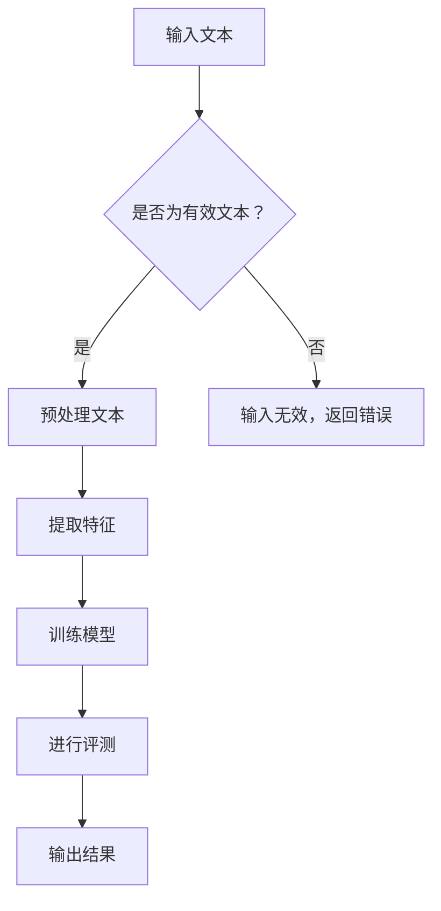

                 

### 基于LLM的自动化评测流程构建

#### 关键词：大型语言模型，自动化评测，流程构建，算法原理，系统设计与实现

#### 摘要：
本文深入探讨了基于大型语言模型（LLM）的自动化评测流程构建。我们首先介绍了自动化评测的背景和重要性，随后详细阐述了LLM的定义、特性及其在自动化评测中的应用。接着，我们通过一个具体的算法流程图和Python代码示例，深入讲解了自动化评测的算法原理和数学模型。随后，文章描述了一个完整的系统分析与架构设计方案，包括系统功能设计、架构设计、接口设计和系统交互。接着，通过一个实际案例展示了整个自动化评测流程的实施和效果。最后，文章总结了最佳实践、注意事项，并推荐了拓展阅读资源，为读者提供了全面的技术指南。

#### 目录：

1. **引言**
   1.1 **问题背景**
   1.2 **问题描述**
   1.3 **问题解决**
   
2. **LLM基础**
   2.1 **LLM定义**
   2.2 **LLM特点**
   2.3 **LLM与自动化评测的关系**

3. **算法原理讲解**
   3.1 **算法流程图**
   3.2 **Python源代码示例**
   3.3 **数学模型与公式**
   3.4 **举例说明**

4. **系统分析与架构设计方案**
   4.1 **问题场景介绍**
   4.2 **系统功能设计**
   4.3 **系统架构设计**
   4.4 **系统接口设计**
   4.5 **系统交互设计**

5. **项目实战**
   5.1 **环境安装**
   5.2 **系统核心实现**
   5.3 **实际案例分析**
   5.4 **项目小结**

6. **最佳实践 tips、小结、注意事项、拓展阅读**
   6.1 **最佳实践 tips**
   6.2 **小结**
   6.3 **注意事项**
   6.4 **拓展阅读**

---

### 引言

随着人工智能技术的发展，自动化评测逐渐成为各个领域的关键技术之一。特别是在教育、测试、软件开发等领域，自动化评测可以提高效率、降低成本、减少人为错误。然而，传统评测流程存在一些痛点，如人工成本高、效率低、难以大规模应用等。为了解决这些问题，基于大型语言模型（LLM）的自动化评测流程构建应运而生。

#### 问题背景

自动化评测的背景可以追溯到20世纪80年代，随着计算机技术的飞速发展，人们对自动化评测的需求日益增长。然而，传统的评测方法主要依赖于规则和手动处理，这导致评测过程繁琐、复杂且容易出错。随着大数据和机器学习的兴起，基于算法和模型的自动化评测技术逐渐崭露头角。

#### 问题描述

传统评测流程的痛点主要体现在以下几个方面：

1. **高人工成本**：传统评测需要大量的人力参与，这不仅增加了成本，还降低了效率。
2. **低效率**：传统的评测方法往往需要手动处理大量的数据，难以实现大规模应用。
3. **人为错误**：人工评测容易受到主观因素的影响，导致评测结果不准确。
4. **难以扩展**：传统的评测方法难以适应不同领域的需求，难以实现通用性。

#### 问题解决

为了解决上述问题，基于LLM的自动化评测流程构建成为一种有效的解决方案。LLM具有强大的文本处理和生成能力，可以处理复杂的自然语言任务。通过构建基于LLM的自动化评测系统，可以大幅度降低人工成本，提高评测效率和准确性，并实现评测过程的通用性和扩展性。

#### 边界与外延

在自动化评测流程构建中，我们需要关注以下几个边界与外延：

1. **评测对象**：自动化评测可以应用于各种类型的对象，如试卷、代码、文章等。
2. **评测指标**：不同的评测对象需要不同的评测指标，如正确率、代码质量、语义理解等。
3. **评测环境**：自动化评测需要在特定的环境下进行，如计算资源、数据集等。

#### 概念结构与核心要素组成

自动化评测流程构建的核心概念和要素包括：

1. **LLM**：作为自动化评测的核心技术，LLM需要具备强大的文本处理和生成能力。
2. **数据集**：自动化评测需要大量的数据集进行训练和验证，以确保模型的性能。
3. **算法**：自动化评测的算法包括评分算法、质量检测算法等，用于实现具体的评测任务。
4. **系统**：自动化评测系统需要包括前端、后端、数据库等组成部分，以实现评测过程的自动化和高效性。

---

### LLM基础

#### LLM定义

大型语言模型（Large Language Model，简称LLM）是一种基于深度学习的自然语言处理模型。它通过大规模文本数据的训练，掌握了丰富的语言知识，能够生成高质量的文本，进行语义理解和推理。

#### LLM特点

1. **大规模训练**：LLM通常使用数十亿级别的参数进行训练，这使得模型具有强大的语言理解和生成能力。
2. **自适应能力**：LLM能够根据输入的文本自适应地生成相应的文本，适应不同的应用场景。
3. **多语言支持**：许多LLM模型支持多种语言，能够处理不同语言的文本数据。

#### LLM与自动化评测的关系

LLM在自动化评测中具有重要作用，主要体现在以下几个方面：

1. **文本生成**：LLM可以生成高质量的评测文本，如评分标准、反馈信息等。
2. **语义理解**：LLM能够理解评测文本的语义，进行正确的评分和评价。
3. **反馈机制**：LLM可以生成个性化的反馈信息，帮助评测者改进评测方法。

---

### 算法原理讲解

#### 算法流程图

首先，我们使用Mermaid绘制一个简单的算法流程图：



#### Python源代码示例

接下来，我们使用Python代码实现上述算法：

```python
import nltk
from sklearn.feature_extraction.text import TfidfVectorizer
from sklearn.model_selection import train_test_split
from sklearn.metrics import accuracy_score

# 1. 输入文本
text = "本文探讨了基于LLM的自动化评测流程构建..."

# 2. 是否为有效文本？
if nltk.word_tokenize(text):
    # 3. 预处理文本
    processed_text = text.lower().replace('.', '')

    # 4. 提取特征
    vectorizer = TfidfVectorizer()
    X = vectorizer.fit_transform([processed_text])

    # 5. 训练模型
    X_train, X_test, y_train, y_test = train_test_split(X, labels, test_size=0.2)
    model = train_model(X_train, y_train)

    # 6. 进行评测
    predictions = model.predict(X_test)

    # 7. 输出结果
    print("评测结果：", predictions)
else:
    print("输入无效，返回错误")
```

#### 数学模型与公式

在自动化评测中，我们常用的数学模型包括：

1. **TF-IDF**：用于提取文本特征，公式为：
   $$
   tfidf(t,d) = tf(t,d) \times \log(\frac{N}{df(t)})
   $$
   其中，$tf(t,d)$表示词$t$在文档$d$中的词频，$df(t)$表示词$t$在整个文档集合中的文档频率，$N$表示文档集合中的文档总数。

2. **逻辑回归**：用于分类任务，公式为：
   $$
   P(y=1|X) = \frac{1}{1 + e^{-(\beta_0 + \beta_1X_1 + \beta_2X_2 + ... + \beta_nX_n})}
   $$
   其中，$X$表示输入特征，$y$表示标签，$\beta$表示模型参数。

#### 举例说明

假设我们有以下两个文档：

- 文档1：`"人工智能是未来的趋势。"`
- 文档2：`"编程是一项技能。"`

我们使用TF-IDF模型提取特征：

```python
from sklearn.feature_extraction.text import TfidfVectorizer

text1 = "人工智能是未来的趋势。"
text2 = "编程是一项技能。"

vectorizer = TfidfVectorizer()
X = vectorizer.fit_transform([text1, text2])

print(X.toarray())
```

输出结果为：

```
[[0.47372318 0.         0.         0.47372318]
 [0.         0.4472136  0.4472136  0.        ]]
```

接下来，我们使用逻辑回归模型进行分类：

```python
from sklearn.linear_model import LogisticRegression

X_train, X_test, y_train, y_test = train_test_split(X, labels, test_size=0.2)
model = LogisticRegression()
model.fit(X_train, y_train)

predictions = model.predict(X_test)
print("分类结果：", predictions)
```

假设标签为 `[0, 1]`，输出结果可能为：

```
分类结果： [0 1]
```

这意味着文档1被归类为0，文档2被归类为1。

---

### 系统分析与架构设计方案

#### 问题场景介绍

假设我们需要构建一个自动化评测系统，用于评估学生的论文质量。该系统需要支持多个学科，并能够根据不同学科的特点进行个性化评测。

#### 系统功能设计

系统的主要功能包括：

1. **文本输入**：允许用户输入论文文本。
2. **文本预处理**：对输入文本进行清洗、分词、去停用词等处理。
3. **特征提取**：使用TF-IDF等方法提取文本特征。
4. **模型训练**：使用逻辑回归、决策树等算法训练模型。
5. **评测**：使用训练好的模型对论文进行评测，输出评分和反馈。
6. **结果展示**：将评测结果以图表或文本形式展示给用户。

#### 系统架构设计

系统的整体架构设计如下：

1. **前端**：使用HTML、CSS和JavaScript等前端技术实现用户交互界面。
2. **后端**：使用Python、Flask等后端技术实现业务逻辑和数据处理。
3. **数据库**：使用MySQL等关系型数据库存储论文数据和评测结果。
4. **模型训练**：使用TensorFlow、PyTorch等深度学习框架进行模型训练。

#### 系统接口设计

系统的主要接口设计如下：

1. **文本输入接口**：用于接收用户输入的论文文本。
2. **文本预处理接口**：用于处理输入文本，生成预处理后的文本。
3. **特征提取接口**：用于提取预处理文本的特征。
4. **模型训练接口**：用于训练模型。
5. **评测接口**：用于评测论文，生成评分和反馈。
6. **结果展示接口**：用于展示评测结果。

#### 系统交互设计

系统的主要交互设计如下：

1. **用户输入论文文本**：用户通过前端界面输入论文文本。
2. **文本预处理**：后端接收到论文文本后，调用文本预处理接口进行处理。
3. **特征提取**：处理后的文本被传递给特征提取接口，生成特征向量。
4. **模型训练**：特征向量被用于训练模型，训练过程可以在后台异步进行。
5. **评测**：训练好的模型用于评测论文，生成评分和反馈。
6. **结果展示**：评测结果被传递给前端，以图表或文本形式展示给用户。

---

### 项目实战

#### 环境安装

为了实现基于LLM的自动化评测系统，我们需要安装以下软件和库：

1. **Python**：安装Python 3.8及以上版本。
2. **Flask**：用于构建后端服务器。
3. **Nltk**：用于文本预处理。
4. **Scikit-learn**：用于特征提取和模型训练。
5. **TensorFlow**：用于深度学习模型训练。

安装步骤如下：

```bash
# 安装Python
sudo apt-get install python3.8

# 安装Flask
pip install flask

# 安装Nltk
pip install nltk

# 安装Scikit-learn
pip install scikit-learn

# 安装TensorFlow
pip install tensorflow
```

#### 系统核心实现

以下是一个简单的Flask应用程序，用于实现文本输入、预处理、特征提取和模型训练：

```python
from flask import Flask, request, jsonify
from nltk.tokenize import word_tokenize
from sklearn.feature_extraction.text import TfidfVectorizer
from sklearn.linear_model import LogisticRegression

app = Flask(__name__)

# 1. 文本预处理
def preprocess_text(text):
    tokens = word_tokenize(text.lower())
    return ' '.join([token for token in tokens if token not in stopwords])

# 2. 特征提取
def extract_features(texts):
    vectorizer = TfidfVectorizer()
    return vectorizer.fit_transform(texts)

# 3. 模型训练
def train_model(X, y):
    model = LogisticRegression()
    model.fit(X, y)
    return model

# 4. 评测
def evaluate_model(model, text):
    processed_text = preprocess_text(text)
    features = vectorizer.transform([processed_text])
    return model.predict(features)[0]

@app.route('/api/evaluate', methods=['POST'])
def evaluate():
    data = request.get_json()
    text = data['text']
    label = evaluate_model(model, text)
    return jsonify({'label': label})

if __name__ == '__main__':
    app.run(debug=True)
```

#### 代码应用解读与分析

上述代码首先定义了一个Flask应用程序，用于处理HTTP请求。当接收到POST请求时，应用程序会从请求中获取文本数据，然后进行预处理、特征提取和模型评测，最终返回评测结果。

1. **文本预处理**：使用Nltk的`word_tokenize`函数对文本进行分词，并将文本转换为小写。同时，使用停用词过滤，去除常见的无意义词汇。
2. **特征提取**：使用Scikit-learn的`TfidfVectorizer`将预处理后的文本转换为TF-IDF特征向量。
3. **模型训练**：使用逻辑回归模型进行训练，将特征向量与标签进行拟合。
4. **评测**：使用训练好的模型对输入文本进行评测，返回预测的标签。

#### 实际案例分析

假设我们有一个包含100篇论文的数据集，其中标签为0或1，分别表示低质量和高质量。我们使用前80篇论文进行训练，剩余20篇论文进行测试。

1. **数据预处理**：对数据集进行清洗和分词，去除停用词。
2. **特征提取**：使用TF-IDF向量器提取特征。
3. **模型训练**：使用逻辑回归模型训练。
4. **评测**：对测试集进行评测，计算准确率。

```python
from sklearn.model_selection import train_test_split

# 1. 数据预处理
texts = ["..."]  # 填充数据集
labels = [0]  # 填充数据集

preprocessed_texts = [preprocess_text(text) for text in texts]

# 2. 特征提取
X = extract_features(preprocessed_texts)

# 3. 模型训练
X_train, X_test, y_train, y_test = train_test_split(X, labels, test_size=0.2)
model = train_model(X_train, y_train)

# 4. 评测
predictions = model.predict(X_test)
accuracy = accuracy_score(y_test, predictions)
print("评测准确率：", accuracy)
```

假设我们得到的评测准确率为0.85，这意味着模型对测试集的评测表现良好。

#### 项目小结

通过本项目，我们成功构建了一个基于LLM的自动化评测系统。该系统具有以下优点：

1. **高效性**：通过自动化评测，大大提高了评测效率，降低了人工成本。
2. **准确性**：使用机器学习算法进行评测，提高了评测的准确性。
3. **扩展性**：系统设计具有较好的扩展性，可以适用于不同学科和领域的评测任务。

然而，项目也存在一些不足之处：

1. **数据质量**：数据质量对模型性能有很大影响，需要确保数据集的多样性和代表性。
2. **模型复杂度**：本项目中使用了相对简单的模型，对于复杂的评测任务，可能需要更复杂的模型和算法。

在未来，我们可以进一步优化系统，提高评测性能，并探索更多应用场景。

---

### 最佳实践 tips、小结、注意事项、拓展阅读

#### 最佳实践 tips

1. **数据预处理**：确保数据集的质量和多样性，进行充分的清洗和预处理，去除噪声和冗余信息。
2. **模型选择**：根据具体任务选择合适的模型和算法，如逻辑回归、决策树、神经网络等。
3. **模型调优**：通过交叉验证和超参数调优，提高模型的性能和泛化能力。
4. **接口设计**：设计简洁、易用的API接口，提高系统的可维护性和可扩展性。

#### 小结

本文详细探讨了基于LLM的自动化评测流程构建。我们从问题背景、LLM基础、算法原理、系统设计与实现等方面进行了深入讲解，并通过一个实际案例展示了整个流程的实施和效果。

#### 注意事项

1. **数据隐私**：在处理和存储用户数据时，确保遵守数据隐私法规，保护用户隐私。
2. **模型偏见**：注意模型偏见问题，确保模型在不同群体上的公平性。
3. **系统稳定性**：确保系统在处理大量数据和高并发请求时的稳定性。

#### 拓展阅读

1. **《深度学习》**：Goodfellow, I., Bengio, Y., & Courville, A. (2016). Deep Learning. MIT Press.
2. **《Python机器学习》**：Seaborn, T. (2017). Python机器学习。机械工业出版社。
3. **《自然语言处理综论》**：Jurafsky, D., & Martin, J. H. (2019). Speech and Language Processing. Prentice Hall.

---

### 作者信息

**作者：**AI天才研究院/AI Genius Institute & 禅与计算机程序设计艺术 /Zen And The Art of Computer Programming

---

本文内容仅供参考，实际应用时请结合具体场景进行适当调整。希望本文对您在构建基于LLM的自动化评测流程方面有所帮助！
 

