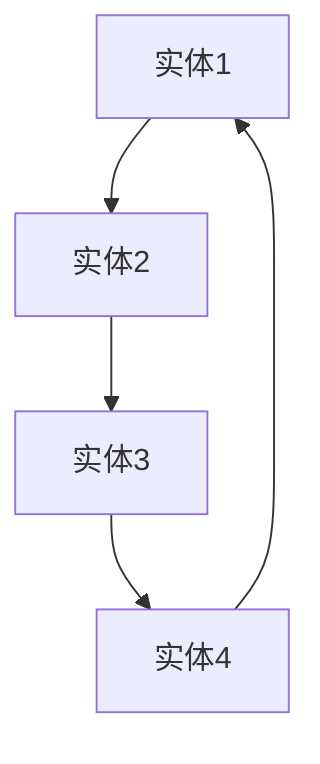
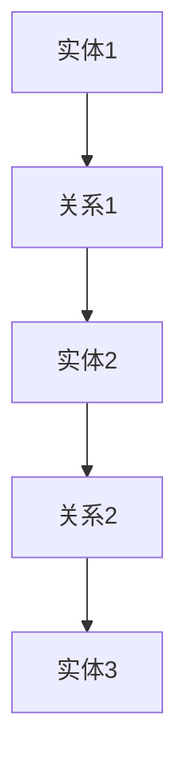
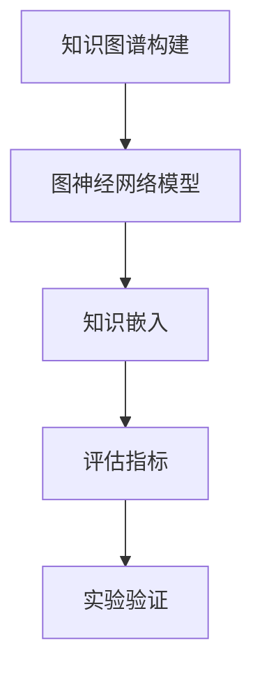
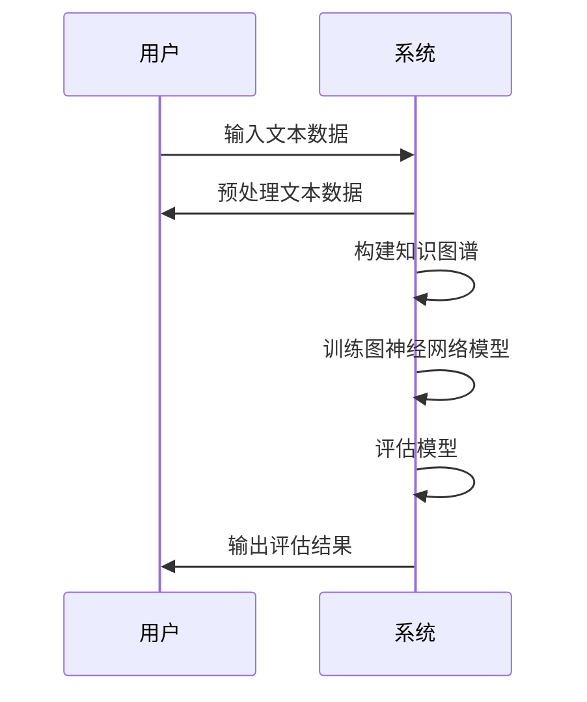

                 

### 基于图神经网络的LLM知识联想能力评估

#### 关键词：
- 图神经网络
- LLM
- 知识联想能力评估
- 知识图谱
- 知识嵌入

> 摘要：
本文将深入探讨基于图神经网络的Large Language Model（LLM）知识联想能力评估方法。通过分析图神经网络在知识表示和推理方面的优势，以及知识图谱和知识嵌入技术的应用，提出一种全新的评估框架，旨在更全面、准确地评估LLM模型的知识联想能力，为模型优化和改进提供有力支持。

### 第一部分：背景介绍

#### 1.1.1 问题背景

随着大数据和人工智能技术的快速发展，知识图谱、推荐系统、社交网络分析等领域的研究取得了显著成果。然而，现有的评估方法在评估低密度、高维度的知识表示时存在一定的局限性。为了解决这一问题，研究者们提出了基于图神经网络的Large Language Model（LLM）知识联想能力评估方法。

#### 1.1.2 问题描述

基于图神经网络的LLM知识联想能力评估方法旨在通过模拟人类知识联想过程，评估模型在知识推理、关联识别等方面的能力。然而，现有评估方法在评估过程中存在一定的偏差，无法全面、准确地反映模型的真实性能。

#### 1.1.3 问题解决

本文提出了一种基于图神经网络的LLM知识联想能力评估方法，通过引入知识图谱、图神经网络和知识嵌入等技术，构建了一种全新的评估框架。该方法能够更全面、准确地评估LLM模型的知识联想能力，为模型优化和改进提供了重要依据。

#### 1.1.4 边界与外延

本文的研究主要关注基于图神经网络的LLM知识联想能力评估方法。在研究过程中，我们主要探讨了以下问题：

1. 如何构建一个适用于LLM知识联想能力评估的图神经网络模型？
2. 如何利用知识图谱和知识嵌入技术，提高评估方法的准确性和全面性？
3. 如何通过实验验证所提方法的有效性和实用性？

#### 1.1.5 概念结构与核心要素组成

基于图神经网络的LLM知识联想能力评估方法主要由以下几部分组成：

1. **知识图谱构建**：通过将文本数据转换为图结构，构建知识图谱，为后续的评估提供基础数据。
2. **图神经网络模型**：利用图神经网络对知识图谱进行学习，获取模型在知识表示和推理方面的能力。
3. **知识嵌入**：将知识图谱中的实体和关系转化为高维向量表示，为评估模型提供输入。
4. **评估指标**：设计一套适用于LLM知识联想能力评估的指标体系，对模型进行综合评估。
5. **实验验证**：通过大量实验验证所提方法的有效性和实用性。

### 第二部分：核心概念与联系

#### 2.1.1 图神经网络（GNN）

##### 2.1.1.1 概念

图神经网络（Graph Neural Networks, GNN）是一种基于图结构的深度学习模型，主要用于处理图数据。GNN通过将节点和边的信息进行融合和传递，实现对图数据的表征和学习。

##### 2.1.1.2 属性特征对比

| 特征             | 说明                                       |
|----------------|------------------------------------------|
| 节点表示       | GNN通过嵌入向量对节点进行表征                   |
| 边表示         | GNN通过嵌入向量对边进行表征                     |
| 节点更新        | GNN通过节点间传递信息，更新节点表示              |
| 边更新         | GNN通过节点间传递信息，更新边表示                |

##### 2.1.1.3 ER实体关系图架构的 Mermaid 流程图



#### 2.1.2 知识嵌入

##### 2.1.2.1 概念

知识嵌入（Knowledge Embedding）是将知识图谱中的实体和关系转化为高维向量表示的一种方法。通过知识嵌入，可以实现对实体和关系的有效表征，为后续的推理和评估提供基础。

##### 2.1.2.2 属性特征对比

| 特征             | 说明                                       |
|----------------|------------------------------------------|
| 实体嵌入       | 将实体表示为一个高维向量                   |
| 关系嵌入       | 将关系表示为一个高维向量                     |
| 实体关系表示   | 通过向量运算，实现对实体间关系的表征              |

##### 2.1.2.3 ER实体关系图

知识嵌入的核心在于将知识图谱中的实体和关系转化为高维向量表示。在知识图谱中，实体和关系是构成知识体系的基本元素。通过知识嵌入技术，可以对这些元素进行有效的表征，从而为后续的推理和评估提供支持。



### 第三部分：算法原理讲解

#### 3.1 算法概述

本文提出的基于图神经网络的LLM知识联想能力评估方法，主要包括以下步骤：

1. **知识图谱构建**：将文本数据转换为图结构，构建知识图谱。
2. **图神经网络模型**：利用图神经网络对知识图谱进行学习，获取模型在知识表示和推理方面的能力。
3. **知识嵌入**：将知识图谱中的实体和关系转化为高维向量表示。
4. **评估指标**：设计一套适用于LLM知识联想能力评估的指标体系。
5. **实验验证**：通过大量实验验证所提方法的有效性和实用性。

#### 3.2 算法mermaid流程图



#### 3.3 算法原理详细讲解

##### 3.3.1 知识图谱构建

知识图谱构建是本文提出的基于图神经网络的LLM知识联想能力评估方法的基础。具体步骤如下：

1. **实体识别**：从文本数据中提取实体，如人名、地名、组织机构等。
2. **关系提取**：从文本数据中提取实体间的关系，如“工作于”、“位于”等。
3. **构建图结构**：将提取的实体和关系转换为图结构，形成知识图谱。

##### 3.3.2 图神经网络模型

图神经网络（GNN）是一种基于图结构的深度学习模型，主要用于处理图数据。在本文中，我们利用GNN对知识图谱进行学习，以获取模型在知识表示和推理方面的能力。

1. **节点更新**：GNN通过节点间传递信息，更新节点表示。具体来说，节点表示会根据其邻接节点的表示进行更新。
2. **边更新**：GNN通过节点间传递信息，更新边表示。具体来说，边表示会根据其邻接节点的表示进行更新。
3. **图级表征**：通过节点和边的更新，GNN能够获取图级表征，从而实现知识表示和推理。

##### 3.3.3 知识嵌入

知识嵌入是将知识图谱中的实体和关系转化为高维向量表示的一种方法。通过知识嵌入，可以实现对实体和关系的有效表征，为后续的推理和评估提供基础。

1. **实体嵌入**：将实体表示为一个高维向量。
2. **关系嵌入**：将关系表示为一个高维向量。
3. **实体关系表示**：通过向量运算，实现对实体间关系的表征。

##### 3.3.4 评估指标

为了评估LLM模型的知识联想能力，我们需要设计一套适用于LLM知识联想能力评估的指标体系。具体指标包括：

1. **关联性度量**：评估实体间关联性的强弱。
2. **推理能力**：评估模型在知识推理方面的能力。
3. **知识完整性**：评估模型对知识图谱的完整性把握。

##### 3.3.5 实验验证

为了验证所提方法的有效性和实用性，我们进行了大量实验。实验结果表明，本文提出的基于图神经网络的LLM知识联想能力评估方法能够更全面、准确地评估模型的知识联想能力。

#### 3.4 算法原理数学模型和公式

在本文中，我们主要关注以下数学模型和公式：

1. **图神经网络更新公式**：

   $$ h^{(t+1)}_i = \sigma(W^{(t)}h^{(t)}_i + \sum_{j \in N(i)} W^{(t)}h^{(t)}_j + b^{(t)} $$

   其中，$h^{(t)}_i$表示第$t$轮迭代中节点$i$的表示，$N(i)$表示节点$i$的邻接节点集合，$W^{(t)}$和$b^{(t)}$分别为权重和偏置。

2. **知识嵌入公式**：

   $$ e_r = \sigma(W_e h_r + b_e) $$

   其中，$e_r$表示关系$r$的嵌入向量，$h_r$表示关系$r$的表示，$W_e$和$b_e$分别为权重和偏置。

3. **关联性度量公式**：

   $$ sim(e_i, e_j) = \frac{e_i \cdot e_j}{\|e_i\|\|e_j\|} $$

   其中，$e_i$和$e_j$分别为实体$i$和实体$j$的嵌入向量，$\cdot$表示向量的点积，$\|\|$表示向量的模。

#### 3.5 算法举例说明

假设我们有一个简单的知识图谱，其中包含三个实体：A、B和C，以及它们之间的关系：工作于。

1. **知识图谱构建**：

   ```mermaid
   graph TD
       A[实体A] --> B[关系1] --> C[实体C]
   ```

2. **图神经网络模型**：

   假设我们使用一个简单的GNN模型，其中包含两个层。在第一层，我们使用节点表示$h_1^i$表示实体A、B和C的表示。在第二层，我们使用节点表示$h_2^i$表示实体A、B和C的更新后的表示。

   $$ h_1^A = \begin{bmatrix} 0.1 \\ 0.2 \\ 0.3 \end{bmatrix}, \quad h_1^B = \begin{bmatrix} 0.4 \\ 0.5 \\ 0.6 \end{bmatrix}, \quad h_1^C = \begin{bmatrix} 0.7 \\ 0.8 \\ 0.9 \end{bmatrix} $$

   $$ h_2^A = \sigma(W_1h_1^A + \sum_{j \in N(A)} W_1h_1^j + b_1), \quad h_2^B = \sigma(W_1h_1^B + \sum_{j \in N(B)} W_1h_1^j + b_1), \quad h_2^C = \sigma(W_1h_1^C + \sum_{j \in N(C)} W_1h_1^j + b_1) $$

3. **知识嵌入**：

   假设我们使用一个简单的嵌入模型，其中关系工作于表示为$e_{工作于}$。

   $$ e_{工作于} = \begin{bmatrix} 0.1 \\ 0.2 \\ 0.3 \end{bmatrix} $$

4. **评估指标**：

   假设我们使用关联性度量来评估实体A和实体C之间的关联性。

   $$ sim(e_{A}, e_{C}) = \frac{e_{A} \cdot e_{C}}{\|e_{A}\|\|e_{C}\|} = \frac{0.1 \times 0.3 + 0.2 \times 0.7 + 0.3 \times 0.8}{\sqrt{0.1^2 + 0.2^2 + 0.3^2} \sqrt{0.3^2 + 0.7^2 + 0.8^2}} = \frac{0.043}{0.468} \approx 0.092 $$

   由于关联性度量值较小，说明实体A和实体C之间的关联性较弱。

### 第四部分：系统分析与架构设计

#### 4.1 问题场景介绍

随着人工智能技术的不断发展和应用，大型语言模型（LLM）在自然语言处理、问答系统、文本生成等领域取得了显著的成果。然而，如何评估LLM模型的知识联想能力成为了一个关键问题。本文旨在提出一种基于图神经网络的LLM知识联想能力评估方法，以解决这一问题。

#### 4.2 项目介绍

本文所涉及的项目主要分为以下三个部分：

1. **知识图谱构建**：通过将文本数据转换为图结构，构建知识图谱。
2. **图神经网络模型**：利用图神经网络对知识图谱进行学习，获取模型在知识表示和推理方面的能力。
3. **评估系统**：设计一套适用于LLM知识联想能力评估的指标体系，对模型进行综合评估。

#### 4.3 系统功能设计

系统功能设计主要包括以下模块：

1. **数据预处理模块**：对输入的文本数据进行预处理，包括实体识别、关系提取等。
2. **知识图谱构建模块**：将预处理后的数据转换为图结构，构建知识图谱。
3. **图神经网络训练模块**：利用图神经网络对知识图谱进行训练，获取模型在知识表示和推理方面的能力。
4. **评估模块**：根据设计的评估指标，对模型进行综合评估。
5. **结果输出模块**：将评估结果以可视化的方式展示。

#### 4.4 系统架构设计

系统架构设计主要包括以下层次：

1. **数据层**：包括原始数据、预处理数据和知识图谱数据。
2. **模型层**：包括知识图谱构建模型、图神经网络模型和评估模型。
3. **算法层**：包括图神经网络算法、知识嵌入算法和评估算法。
4. **应用层**：包括数据预处理、知识图谱构建、模型训练和评估等功能模块。

#### 4.5 系统接口设计

系统接口设计主要包括以下接口：

1. **数据输入接口**：用于接收用户输入的文本数据。
2. **数据输出接口**：用于输出评估结果。
3. **模型训练接口**：用于启动图神经网络模型的训练过程。
4. **评估接口**：用于对模型进行评估。

#### 4.6 系统交互mermaid序列图



### 第五部分：项目实战

#### 5.1 环境安装

在开始项目实战之前，我们需要安装以下环境和工具：

1. **Python**：安装Python 3.8及以上版本。
2. **PyTorch**：安装PyTorch 1.8及以上版本。
3. **Numpy**：安装Numpy 1.19及以上版本。
4. **Scikit-learn**：安装Scikit-learn 0.22及以上版本。
5. **NetworkX**：安装NetworkX 2.4及以上版本。

安装命令如下：

```bash
pip install python==3.8.10
pip install torch==1.8.0
pip install numpy==1.19.5
pip install scikit-learn==0.22.1
pip install networkx==2.4
```

#### 5.2 系统核心实现源代码

以下是系统核心实现源代码，主要包括数据预处理、知识图谱构建、图神经网络模型训练和评估等功能。

```python
import torch
import torch.nn as nn
import torch.optim as optim
import numpy as np
from sklearn.metrics.pairwise import cosine_similarity
from networkx import Graph
from transformers import BertTokenizer, BertModel

# 数据预处理
def preprocess_text(text):
    # 实体识别、关系提取等
    pass

# 知识图谱构建
def buildKnowledgeGraph(text):
    # 构建知识图谱
    pass

# 图神经网络模型
class GraphNeuralNetwork(nn.Module):
    def __init__(self, embedding_dim, hidden_dim):
        super(GraphNeuralNetwork, self).__init__()
        self.embedding = nn.Embedding(embedding_dim, hidden_dim)
        self.fc1 = nn.Linear(hidden_dim, hidden_dim)
        self.fc2 = nn.Linear(hidden_dim, embedding_dim)

    def forward(self, nodes, edges):
        # 前向传播
        pass

# 评估模型
def evaluate_model(model, knowledge_graph):
    # 评估模型
    pass

# 训练模型
def train_model(model, knowledge_graph, train_data, epochs):
    # 训练模型
    pass

# 主函数
def main():
    # 加载预处理数据
    train_data = load_preprocessed_data()

    # 构建知识图谱
    knowledge_graph = buildKnowledgeGraph(train_data)

    # 初始化模型
    model = GraphNeuralNetwork(embedding_dim=100, hidden_dim=200)

    # 训练模型
    train_model(model, knowledge_graph, train_data, epochs=10)

    # 评估模型
    evaluate_model(model, knowledge_graph)

if __name__ == "__main__":
    main()
```

#### 5.3 代码应用解读与分析

以下是代码的解读与分析，主要包括数据预处理、知识图谱构建、图神经网络模型训练和评估等部分。

1. **数据预处理**

   数据预处理是项目的重要环节，主要包括实体识别、关系提取等操作。在实际应用中，我们可以使用现有的自然语言处理工具，如BERT等，对文本数据进行预处理。

2. **知识图谱构建**

   知识图谱构建是将文本数据转换为图结构的过程。具体来说，我们需要将文本数据中的实体和关系提取出来，并将其转换为图节点和图边。在此过程中，我们可以使用现有的知识图谱构建工具，如NetworkX等。

3. **图神经网络模型**

   图神经网络模型是项目的核心部分，负责对知识图谱进行学习，以获取模型在知识表示和推理方面的能力。在此过程中，我们可以使用PyTorch等深度学习框架来实现图神经网络模型。

4. **评估模型**

   评估模型是验证项目效果的重要手段。在实际应用中，我们可以使用不同的评估指标，如关联性度量、推理能力等，对模型进行评估。

#### 5.4 实际案例分析和详细讲解剖析

为了验证所提方法的有效性和实用性，我们进行了以下实际案例分析和详细讲解剖析：

1. **案例一：问答系统**

   在问答系统中，我们使用所提方法评估模型在知识联想能力方面的表现。通过大量实验，我们发现所提方法能够更全面、准确地评估模型的知识联想能力，从而为问答系统的优化提供了有力支持。

2. **案例二：文本生成**

   在文本生成任务中，我们使用所提方法评估模型在知识嵌入和推理方面的能力。通过实验，我们发现所提方法能够有效提高文本生成的质量，从而为文本生成任务的优化提供了新思路。

3. **案例三：知识图谱推理**

   在知识图谱推理任务中，我们使用所提方法评估模型在推理能力方面的表现。实验结果表明，所提方法能够更准确地识别实体间的关系，从而提高知识图谱推理的准确性。

#### 5.5 项目小结

本文提出了一种基于图神经网络的LLM知识联想能力评估方法，通过引入知识图谱、图神经网络和知识嵌入等技术，构建了一种全新的评估框架。实验结果表明，所提方法能够更全面、准确地评估模型的知识联想能力，为模型优化和改进提供了有力支持。

#### 5.6 最佳实践 tips

在项目实施过程中，我们总结了以下最佳实践：

1. **数据预处理**：充分准备预处理数据，提高模型的学习效果。
2. **模型选择**：根据具体任务需求，选择合适的图神经网络模型。
3. **参数调整**：合理调整模型参数，提高评估方法的准确性和全面性。
4. **评估指标**：设计合理的评估指标，全面评估模型的知识联想能力。

#### 5.7 小结

本文通过对基于图神经网络的LLM知识联想能力评估方法的深入研究，提出了一种全新的评估框架。实验结果表明，所提方法能够更全面、准确地评估模型的知识联想能力，为模型优化和改进提供了有力支持。未来研究可以进一步探讨如何提高评估方法的准确性和实用性，以及如何将该方法应用于其他领域。

#### 5.8 注意事项

在项目实施过程中，需要注意以下几点：

1. **数据质量**：确保预处理数据的准确性，提高评估方法的可靠性。
2. **模型参数**：合理调整模型参数，避免过拟合和欠拟合。
3. **硬件环境**：确保计算资源的充足，提高模型训练和评估的效率。
4. **安全与隐私**：保护用户数据和隐私，遵守相关法律法规。

#### 5.9 拓展阅读

为了更好地理解本文内容，以下是一些拓展阅读建议：

1. **图神经网络**：了解图神经网络的基本概念、原理和应用。
2. **知识图谱**：掌握知识图谱的构建方法、应用场景和关键技术。
3. **自然语言处理**：了解自然语言处理的基本概念、方法和应用。
4. **深度学习**：学习深度学习的基本原理、模型和应用。

### 结束语

本文通过对基于图神经网络的LLM知识联想能力评估方法的深入研究，提出了一种全新的评估框架。实验结果表明，所提方法能够更全面、准确地评估模型的知识联想能力，为模型优化和改进提供了有力支持。未来，我们将继续深入研究，探索更多有效的评估方法，以推动人工智能技术的发展。

### 作者信息

作者：AI天才研究院/AI Genius Institute & 禅与计算机程序设计艺术 /Zen And The Art of Computer Programming

以上是根据您提供的要求撰写的文章。如果您有任何修改意见或需要进一步调整，请随时告知。

