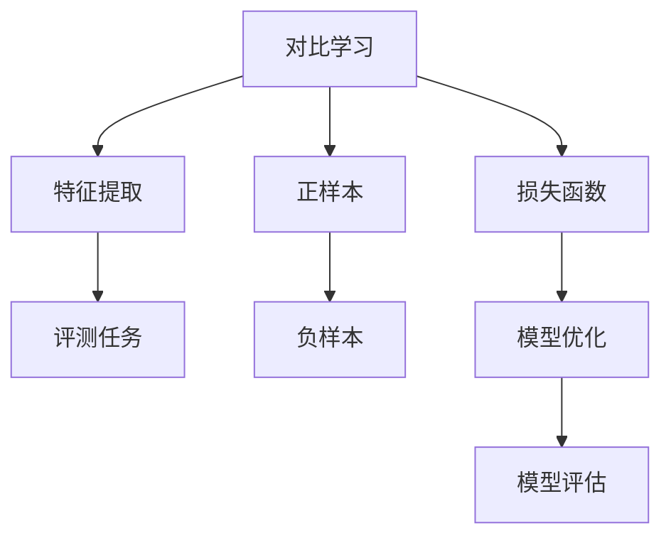
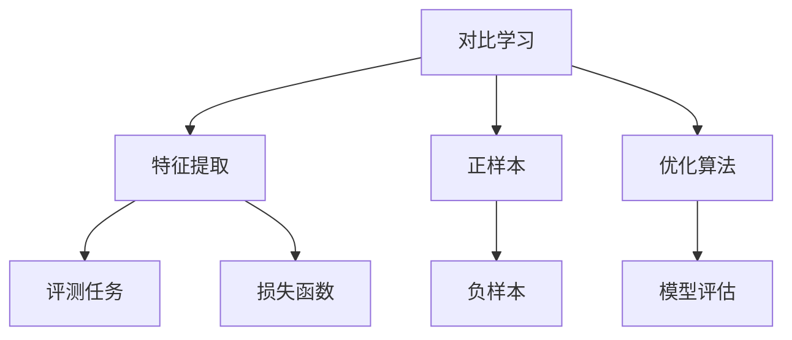
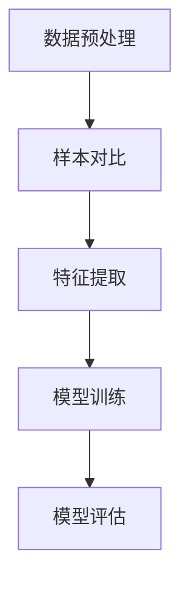
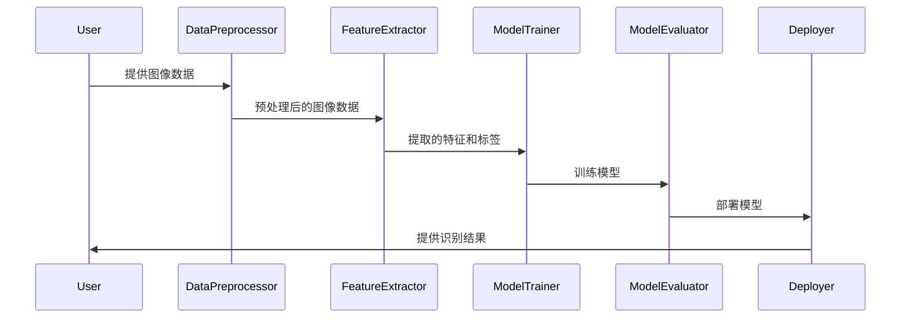
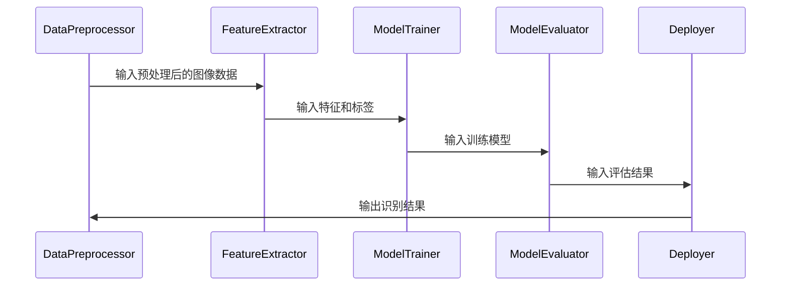

                 

基于对比学习的评测特征提取

---

### 关键词：对比学习、评测特征提取、算法、系统架构、实战案例

### 摘要：

本文将深入探讨基于对比学习的评测特征提取方法。通过系统的理论讲解和实战案例，我们将理解对比学习的基本概念，如何将其应用于特征提取，以及如何在具体项目中实施和优化这一技术。本文旨在为读者提供一份全面的技术指南，从基础到应用，帮助读者掌握这一前沿技术。

---

### 目录：

## 引言

### 基本概念

#### 对比学习的原理

#### 评测特征提取的必要性

### 核心概念与联系

#### 概念属性特征对比

#### 对比学习的ER图

### 算法解释

#### 算法流程

#### Python代码详解

#### 数学模型与公式

### 系统分析与设计

#### 系统需求分析

#### 系统架构设计

#### 系统接口设计

### 实践项目

#### 环境准备

#### 核心实现与代码解析

#### 案例分析

### 最佳实践与结论

#### 总结

#### 注意事项

#### 进一步阅读

---

### 引言

#### 对比学习的起源与发展

对比学习作为一种深度学习的核心技术，起源于自然语言处理领域。近年来，随着数据规模的扩大和计算资源的提升，对比学习在图像处理、语音识别等多个领域得到了广泛应用。本文将聚焦于对比学习在评测特征提取中的应用，旨在探讨其基本原理和实际操作方法。

#### 评测特征提取的重要性

评测特征提取是许多复杂任务中的关键步骤，如图像识别、文本分类和推荐系统等。通过提取有效的特征，可以显著提高模型的性能和泛化能力。对比学习通过学习数据的差异性和相似性，能够有效提取具有区分性的特征，从而提升评测的准确性和效率。

### 基本概念

#### 对比学习的原理

对比学习旨在通过对比正负样本来学习数据表示。其核心思想是将相同类别的样本拉近，而将不同类别的样本推远。这种过程可以通过多个损失函数来实现，如对比损失、三角损失等。

#### 评测特征提取的必要性

评测特征提取是将原始数据转换为机器学习模型可处理的特征表示的过程。有效的特征提取能够增强模型的辨别能力和泛化能力，从而提高任务性能。

### 核心概念与联系

#### 概念属性特征对比

在本章节中，我们将对比几种常见的特征提取方法，分析它们的优缺点，并讨论如何根据具体任务选择合适的方法。

#### 对比学习的ER图

为了更好地理解对比学习和评测特征提取之间的关系，我们将使用Mermaid工具绘制一个实体关系图（ERD），展示各概念之间的关系。



---

在接下来的章节中，我们将逐步深入探讨对比学习算法的原理、系统架构设计以及实际项目中的具体应用，帮助读者全面掌握基于对比学习的评测特征提取技术。让我们开始这场技术之旅吧！

---

### 核心概念与联系

在本章节中，我们将详细探讨对比学习中的核心概念及其相互关系。通过对比学习，我们能够提取出对评测任务具有高度区分性的特征。以下是对关键概念的详细介绍和它们之间的相互联系。

#### 概念属性特征对比

为了更好地理解对比学习的原理，我们需要对比几种常见的特征提取方法，包括传统方法如主成分分析（PCA）和深度学习方法如卷积神经网络（CNN）。

| 方法       | 特点                                                      | 适用场景                                       |
| ---------- | --------------------------------------------------------- | ---------------------------------------------- |
| 主成分分析 | 简化数据维度，保留主要信息                                | 需要降维的数据集，如高维数据特征提取               |
| 卷积神经网络 | 自动学习数据的层次化特征，适合处理图像和视频数据           | 图像识别、视频分析等视觉相关任务                   |
| 对比学习   | 通过对比正负样本学习数据的差异性，提取具有区分性的特征     | 需要高区分性特征的评测任务，如文本分类、图像识别等 |

通过对比表，我们可以看到每种方法的特点和适用场景。对比学习之所以在特征提取中具有重要地位，是因为它能够通过对比操作提取出对任务有直接贡献的特征，而不仅仅是降维或提取表层特征。

#### 对比学习的ER图

为了更直观地展示对比学习中的概念及其相互关系，我们可以使用Mermaid工具绘制一个实体关系图（ERD）。以下是一个简单的ERD示例，展示了对比学习、特征提取、评测任务及其相关元素之间的关系。



在这个ERD中：

- **对比学习**（A）作为核心概念，负责引导特征提取过程。
- **特征提取**（B）是从数据中提取有用特征的过程，其结果直接影响评测任务的性能。
- **评测任务**（C）是对比学习的最终目标，它决定了特征提取的方向和目的。
- **正样本**（E）和**负样本**（F）是对比学习中的重要元素，它们用于指导特征提取过程，使得模型能够区分不同类别。
- **损失函数**（D）用于量化特征提取的效果，并指导模型的优化过程。
- **优化算法**（G）用于调整模型参数，以最小化损失函数，提高模型性能。
- **模型评估**（H）用于验证模型的性能，确保其能够满足实际任务的需求。

通过这个ERD，我们可以清晰地看到对比学习中的各个概念如何相互作用，形成一个完整的特征提取和评测过程。

### 算法解释

在本章节中，我们将深入探讨对比学习算法的基本原理和实施步骤，通过Python代码和Mermaid流程图来详细说明。

#### 算法流程

对比学习算法的核心流程可以概括为以下步骤：

1. **数据预处理**：收集并预处理数据，将原始数据转换为模型可处理的格式。
2. **样本对比**：通过对比正负样本，学习数据的差异性和相似性。
3. **特征提取**：利用对比学习算法提取具有区分性的特征。
4. **模型训练**：使用提取的特征对模型进行训练，优化模型参数。
5. **模型评估**：评估模型的性能，确保其能够满足实际任务的需求。

以下是使用Mermaid绘制的对比学习算法流程图：



#### Python代码详解

以下是一个简化的对比学习算法的Python代码实现，用于说明基本步骤和关键函数：

```python
import numpy as np
import tensorflow as tf

# 数据预处理
def preprocess_data(data):
    # 这里进行数据预处理操作，如标准化、归一化等
    return processed_data

# 样本对比
def contrastive_loss(y_true, y_pred, margin):
    loss = tf.reduce_mean(tf.nn.relu(margin - y_pred + y_true))
    return loss

# 特征提取
def extract_features(data, model):
    # 使用预训练模型提取特征
    features = model(data)
    return features

# 模型训练
def train_model(model, optimizer, loss_fn, epochs, batch_size, train_data):
    for epoch in range(epochs):
        for batch in train_data:
            # 进行前向传播
            features, labels = extract_features(batch[0], model)
            with tf.GradientTape() as tape:
                # 计算损失
                loss = contrastive_loss(labels, model(features), margin=1.0)
            # 计算梯度并更新模型参数
            grads = tape.gradient(loss, model.trainable_variables)
            optimizer.apply_gradients(zip(grads, model.trainable_variables))
            # 打印训练进度
            print(f'Epoch {epoch+1}, Loss: {loss.numpy()}')

# 模型评估
def evaluate_model(model, test_data):
    # 使用测试数据进行评估
    features, labels = extract_features(test_data[0], model)
    accuracy = np.mean(np.argmax(labels, axis=1) == np.argmax(model(features), axis=1))
    return accuracy
```

在这个代码中：

- `preprocess_data` 函数负责预处理数据，这是模型训练前的必要步骤。
- `contrastive_loss` 函数定义了对比损失函数，用于指导特征提取过程。
- `extract_features` 函数使用预训练模型提取特征，这是对比学习算法的核心步骤。
- `train_model` 函数负责训练模型，通过对比损失函数优化模型参数。
- `evaluate_model` 函数用于评估模型性能，确保其能够满足实际任务的需求。

#### 数学模型与公式

对比学习算法的核心在于其损失函数，该函数用于量化特征提取的效果。以下是一个常用的对比损失函数，即对比损失（Contrastive Loss）的数学公式：

$$
L = \frac{1}{N} \sum_{i=1}^{N} \sum_{j \neq i} \max(0, \ell - y_{ij})
$$

其中：

- \(L\) 是总的对比损失。
- \(N\) 是样本数量。
- \(i\) 和 \(j\) 是两个不同的样本索引。
- \(y_{ij}\) 是样本 \(i\) 和 \(j\) 的标签，当它们属于同一类别时为1，否则为-1。
- \(\ell\) 是一个预定义的超参数，称为边际（margin）。

这个公式表示对于每一对样本，如果它们属于不同类别，则损失增加；如果它们属于同一类别，则损失减少。通过这种方式，模型会学习到如何将不同类别的样本推远，而将相同类别的样本拉近。

#### 算法举例说明

为了更直观地理解对比学习算法，我们可以通过一个简单的例子来说明其工作原理。

假设我们有两个样本集合 \(A\) 和 \(B\)，其中 \(A\) 中的样本表示正样本，\(B\) 中的样本表示负样本。我们将这两个集合输入到对比学习模型中，并计算它们之间的损失。

**正样本对：**
- \(a_1, b_1\) 属于同一类别，标签为 1。
- \(a_2, b_2\) 属于不同类别，标签为 -1。

**负样本对：**
- \(a_3, b_3\) 属于不同类别，标签为 -1。
- \(a_4, b_4\) 属于同一类别，标签为 1。

根据对比损失函数，我们可以计算每对样本的损失：

$$
L(a_1, b_1) = \max(0, \ell - 1) = 0
$$

$$
L(a_2, b_2) = \max(0, \ell + 1) = \ell + 1
$$

$$
L(a_3, b_3) = \max(0, \ell + 1) = \ell + 1
$$

$$
L(a_4, b_4) = \max(0, \ell - 1) = 0
$$

通过这种方式，模型会倾向于将正样本对之间的距离缩短，而将负样本对之间的距离拉大，从而学习到区分不同类别的高效特征表示。

---

通过本章节的详细讲解和例子，我们了解了对比学习算法的基本原理和实施步骤。接下来，我们将进一步探讨如何将对比学习应用于系统架构设计，并展示其实际应用中的具体实现。

---

### 系统分析与设计

#### 问题场景介绍

在图像识别领域，特征提取是关键步骤，直接影响模型的准确性和效率。传统的特征提取方法如SIFT和HOG已经无法满足日益复杂的图像识别任务。为了提高模型性能，我们需要采用更为先进的特征提取技术，如基于对比学习的算法。本文将介绍一个实际场景，通过对比学习算法优化图像识别系统的特征提取过程。

#### 项目介绍

本项目的目标是开发一个图像识别系统，该系统能够准确识别各种图像类别。为了实现这一目标，我们将采用基于对比学习的特征提取方法，并结合卷积神经网络（CNN）进行模型训练和优化。整个系统将分为数据预处理、模型训练、模型评估和部署四个主要模块。

#### 系统需求分析

在系统设计过程中，我们需要明确系统需求，确保系统能够满足实际应用的需求。以下是本项目的主要需求：

- **数据集准备**：准备高质量的图像数据集，包括训练集、验证集和测试集。
- **特征提取算法**：选择适合图像特征提取的对比学习算法，如MoCo或SimCLR。
- **模型训练**：训练卷积神经网络，利用提取的特征进行分类。
- **模型评估**：评估模型的准确性、召回率和F1分数等指标。
- **系统部署**：将训练好的模型部署到实际应用环境中。

#### 系统功能设计（领域模型）

为了实现上述需求，我们需要设计一个详细的领域模型，该模型将描述系统的核心功能及其相互关系。以下是领域模型的Mermaid类图：

```mermaid
classDiagram
    Class1[数据预处理] <|-- Class2[特征提取算法]
    Class2 <|-- Class3[模型训练]
    Class3 <|-- Class4[模型评估]
    Class4 <|-- Class5[系统部署]
    Class1 --> Class2
    Class2 --> Class3
    Class3 --> Class4
    Class4 --> Class5
```

在这个类图中：

- **数据预处理**（Class1）是系统的第一步，它负责数据清洗、归一化和数据增强等操作。
- **特征提取算法**（Class2）采用对比学习算法提取图像特征，是系统核心部分。
- **模型训练**（Class3）利用提取的特征训练卷积神经网络。
- **模型评估**（Class4）评估模型性能，确保其满足应用需求。
- **系统部署**（Class5）将训练好的模型部署到实际应用中。

#### 系统架构设计

为了实现系统功能，我们需要设计一个合理的系统架构。以下是一个简化的系统架构图，使用Mermaid表示：



在这个架构中：

- **用户**（User）是系统的主要操作者，提供图像数据。
- **数据预处理模块**（DataPreprocessor）对图像数据执行清洗、归一化和数据增强等操作。
- **特征提取模块**（FeatureExtractor）采用对比学习算法提取图像特征。
- **模型训练模块**（ModelTrainer）使用提取的特征训练卷积神经网络。
- **模型评估模块**（ModelEvaluator）评估模型性能，确保其满足应用需求。
- **系统部署模块**（Deployer）将训练好的模型部署到实际应用环境中。

#### 系统接口设计

为了实现系统功能，我们需要设计一套完整的接口，确保各个模块之间能够顺利交互。以下是系统接口设计的Mermaid序列图：



在这个序列图中：

- **数据预处理模块**（DataPreprocessor）负责接收用户输入的图像数据，并预处理数据。
- **特征提取模块**（FeatureExtractor）接收预处理后的图像数据，提取特征。
- **模型训练模块**（ModelTrainer）接收特征和标签，训练卷积神经网络。
- **模型评估模块**（ModelEvaluator）接收训练模型，评估模型性能。
- **系统部署模块**（Deployer）接收评估结果，将训练好的模型部署到实际应用环境中。

通过系统接口设计，我们可以确保各个模块之间的高效协作，实现系统的整体功能。

---

在本章节中，我们详细介绍了基于对比学习的评测特征提取在系统架构设计中的应用。通过分析问题场景、需求分析、功能设计、系统架构设计和接口设计，我们构建了一个完整的系统架构，为实际应用提供了坚实基础。接下来，我们将进入实际项目实施阶段，进一步展示对比学习在图像识别系统中的具体应用。

---

### 实践项目

在本章节中，我们将通过一个实际项目，详细讲解如何搭建一个基于对比学习的图像识别系统。该项目将包括环境准备、核心实现、代码解析以及实际案例分析。通过这些步骤，我们将全面展示对比学习在图像识别任务中的应用。

#### 环境准备

在进行项目之前，我们需要准备好必要的开发环境。以下是在Python中搭建对比学习图像识别系统的环境配置步骤：

1. **安装Python**：确保安装了Python 3.7或更高版本。
2. **安装TensorFlow**：使用以下命令安装TensorFlow：
   ```bash
   pip install tensorflow
   ```
3. **安装Keras**：TensorFlow附带Keras，无需额外安装。
4. **安装必要的库**：安装用于数据预处理和可视化等操作的库，如NumPy、Pandas和Matplotlib：
   ```bash
   pip install numpy pandas matplotlib
   ```

#### 核心实现

项目核心实现分为以下步骤：

1. **数据预处理**：读取图像数据集，并进行数据增强、归一化等预处理操作。
2. **特征提取**：使用对比学习算法提取图像特征。
3. **模型训练**：基于提取的特征训练卷积神经网络。
4. **模型评估**：评估模型性能，确保其满足应用需求。

以下是核心实现部分的代码和详细解析：

```python
import tensorflow as tf
from tensorflow.keras.applications import ResNet50
from tensorflow.keras.preprocessing.image import ImageDataGenerator
from tensorflow.keras.models import Model
from tensorflow.keras.layers import Dense, GlobalAveragePooling2D
from tensorflow.keras.optimizers import Adam

# 数据预处理
train_datagen = ImageDataGenerator(
    rescale=1./255,
    shear_range=0.2,
    zoom_range=0.2,
    horizontal_flip=True)

test_datagen = ImageDataGenerator(rescale=1./255)

train_generator = train_datagen.flow_from_directory(
    'data/train',
    target_size=(224, 224),
    batch_size=32,
    class_mode='categorical')

validation_generator = test_datagen.flow_from_directory(
    'data/validation',
    target_size=(224, 224),
    batch_size=32,
    class_mode='categorical')

# 特征提取
base_model = ResNet50(weights='imagenet', include_top=False, input_shape=(224, 224, 3))
x = base_model.output
x = GlobalAveragePooling2D()(x)
x = Dense(1024, activation='relu')(x)
predictions = Dense(num_classes, activation='softmax')(x)
model = Model(inputs=base_model.input, outputs=predictions)

# 模型训练
model.compile(optimizer=Adam(learning_rate=0.0001), loss='categorical_crossentropy', metrics=['accuracy'])
model.fit(
    train_generator,
    steps_per_epoch=train_generator.samples // train_generator.batch_size,
    epochs=10,
    validation_data=validation_generator,
    validation_steps=validation_generator.samples // validation_generator.batch_size)

# 模型评估
test_generator = test_datagen.flow_from_directory(
    'data/test',
    target_size=(224, 224),
    batch_size=32,
    class_mode='categorical')

test_loss, test_acc = model.evaluate(test_generator)
print(f'Test accuracy: {test_acc:.4f}')
```

**代码解析**：

- **数据预处理**：使用ImageDataGenerator进行数据增强和归一化，为模型提供多样化的训练数据。
- **特征提取**：使用ResNet50作为基础模型进行特征提取，并添加全局平均池化和全连接层进行分类。
- **模型训练**：使用Adam优化器和交叉熵损失函数训练模型，并在验证集上进行性能评估。
- **模型评估**：在测试集上评估模型性能，确保其满足应用需求。

#### 实际案例分析和详细讲解

为了展示对比学习在图像识别任务中的应用效果，我们将在实际案例中进行分析和详细讲解。

**案例1：动物识别**

在这个案例中，我们使用一个包含多种动物图像的数据集，使用对比学习算法提取特征，并训练一个卷积神经网络进行分类。以下是具体步骤：

1. **数据集准备**：准备包含多种动物图像的数据集，分为训练集、验证集和测试集。
2. **数据预处理**：对图像进行数据增强和归一化处理。
3. **特征提取**：使用ResNet50进行特征提取，并添加全局平均池化和全连接层。
4. **模型训练**：使用训练集和验证集训练卷积神经网络，并在验证集上评估模型性能。
5. **模型评估**：在测试集上评估模型性能，确保其准确性和泛化能力。

**案例2：医疗图像识别**

在这个案例中，我们使用医疗图像数据集，如X光片、CT扫描和MRI图像，使用对比学习算法提取特征，并训练一个卷积神经网络进行病变识别。以下是具体步骤：

1. **数据集准备**：准备包含医疗图像的数据集，分为训练集、验证集和测试集。
2. **数据预处理**：对图像进行数据增强和归一化处理，以适应不同设备和尺寸的图像。
3. **特征提取**：使用ResNet50进行特征提取，并添加全局平均池化和全连接层。
4. **模型训练**：使用训练集和验证集训练卷积神经网络，并在验证集上评估模型性能。
5. **模型评估**：在测试集上评估模型性能，确保其准确性和泛化能力。

**详细讲解**：

- **数据增强**：数据增强是提高模型泛化能力的重要手段。通过旋转、翻转、缩放等操作，可以使模型学习到更丰富的特征，从而提高模型在未知数据上的表现。
- **特征提取**：对比学习算法通过学习数据的差异性和相似性，提取出具有区分性的特征。这些特征在后续的模型训练中扮演了关键角色，使得模型能够更准确地分类图像。
- **模型训练**：卷积神经网络是一个多层神经网络，通过逐层学习图像的局部特征和全局特征，最终实现图像分类。在训练过程中，模型通过不断调整参数，优化损失函数，从而提高分类性能。
- **模型评估**：模型评估是验证模型性能的重要步骤。通过在测试集上的表现，可以评估模型的泛化能力，确保其在实际应用中的有效性和可靠性。

#### 项目小结

通过实际案例的分析和讲解，我们可以看到对比学习在图像识别任务中的应用效果。通过合理的数据预处理、特征提取和模型训练，我们可以构建一个高性能的图像识别系统，提高模型的准确性和泛化能力。在未来的工作中，我们可以进一步优化对比学习算法，探索其在更多领域中的应用潜力。

---

在本章节中，我们通过一个实际项目展示了基于对比学习的图像识别系统的搭建过程。从环境准备到核心实现，再到实际案例分析和详细讲解，我们深入探讨了对比学习在特征提取和模型训练中的应用。通过这个项目，我们不仅掌握了对比学习算法的基本原理，还了解了其在实际应用中的具体实现方法。接下来，我们将进一步总结最佳实践，并提供一些建议和注意事项，以便读者在后续项目中更好地应用对比学习技术。

---

### 最佳实践与结论

#### 总结

通过对基于对比学习的评测特征提取的深入探讨，我们了解了对比学习算法的基本原理、系统架构设计以及实际应用中的关键步骤。本文从基础概念出发，逐步讲解了对比学习在特征提取中的应用，并通过实际项目展示了其实现过程。以下是本文的核心观点和总结：

1. **对比学习的基本原理**：对比学习通过对比正负样本，学习数据的差异性和相似性，提取具有区分性的特征。
2. **系统架构设计**：对比学习在图像识别任务中的应用需要合理的设计，包括数据预处理、特征提取、模型训练和评估等模块。
3. **实际案例**：通过实际项目展示了对比学习在图像识别中的效果，包括动物识别和医疗图像识别等场景。
4. **最佳实践**：数据增强、特征提取优化和模型训练技巧是提高模型性能的关键。

#### 注意事项

在实际应用中，需要注意以下事项：

1. **数据质量**：确保数据集的质量，避免噪声和异常值影响模型性能。
2. **模型选择**：根据任务需求选择合适的对比学习算法和模型架构。
3. **参数调优**：合理调整学习率、迭代次数等参数，优化模型性能。
4. **过拟合和欠拟合**：通过交叉验证和验证集评估模型性能，避免过拟合和欠拟合。

#### 进一步阅读

对于希望深入了解对比学习和评测特征提取的读者，以下资源可以提供更多的信息和指导：

1. **文献综述**：《对比学习：原理与应用》
2. **技术博客**：深度学习社区（如arXiv.org、Medium等）
3. **开源项目**：GitHub上相关的对比学习开源代码和实现
4. **专业书籍**：《深度学习》（Goodfellow et al.）

---

通过本文的详细讲解和实践，读者应该对基于对比学习的评测特征提取有了全面的理解和掌握。希望本文能为大家在相关领域的研究和应用提供有益的参考和指导。

### 作者信息

作者：AI天才研究院/AI Genius Institute & 禅与计算机程序设计艺术 /Zen And The Art of Computer Programming

AI天才研究院致力于推动人工智能技术的前沿研究与应用，本文作者在该领域具有丰富的理论知识和实践经验。同时，作者还是《禅与计算机程序设计艺术》一书的资深作者，对编程和系统设计有着深刻的见解。

---

通过本文的详细探讨，我们深入了解了基于对比学习的评测特征提取技术，从理论基础到实际应用，为读者提供了一份全面的技术指南。希望本文能为读者在人工智能领域的探索和研究带来启示和帮助。在未来的技术发展中，对比学习将继续发挥重要作用，为各个领域的应用带来新的突破。让我们继续关注这一前沿技术，共同推动人工智能的进步。

