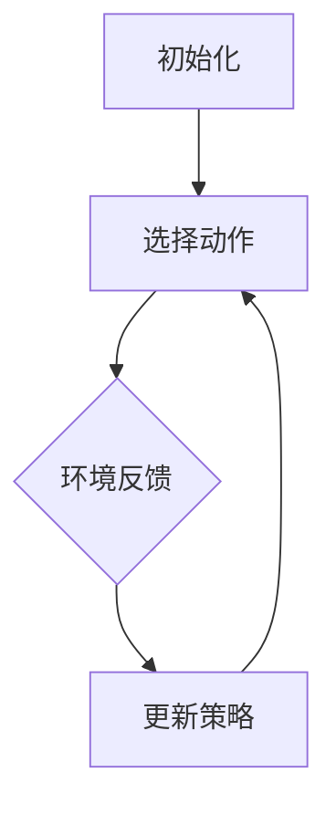
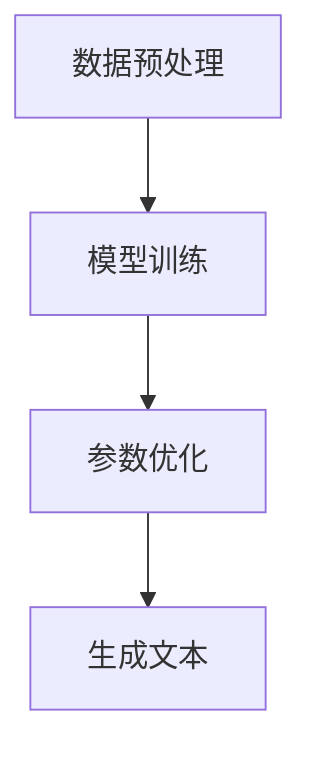
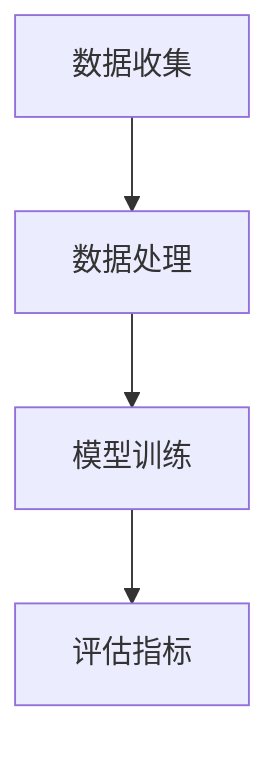
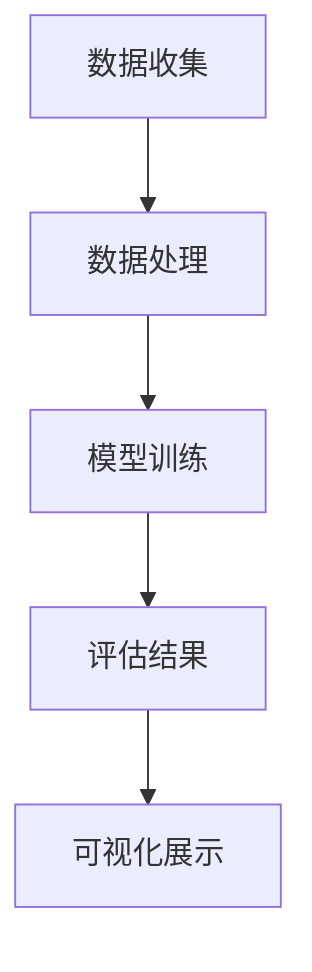
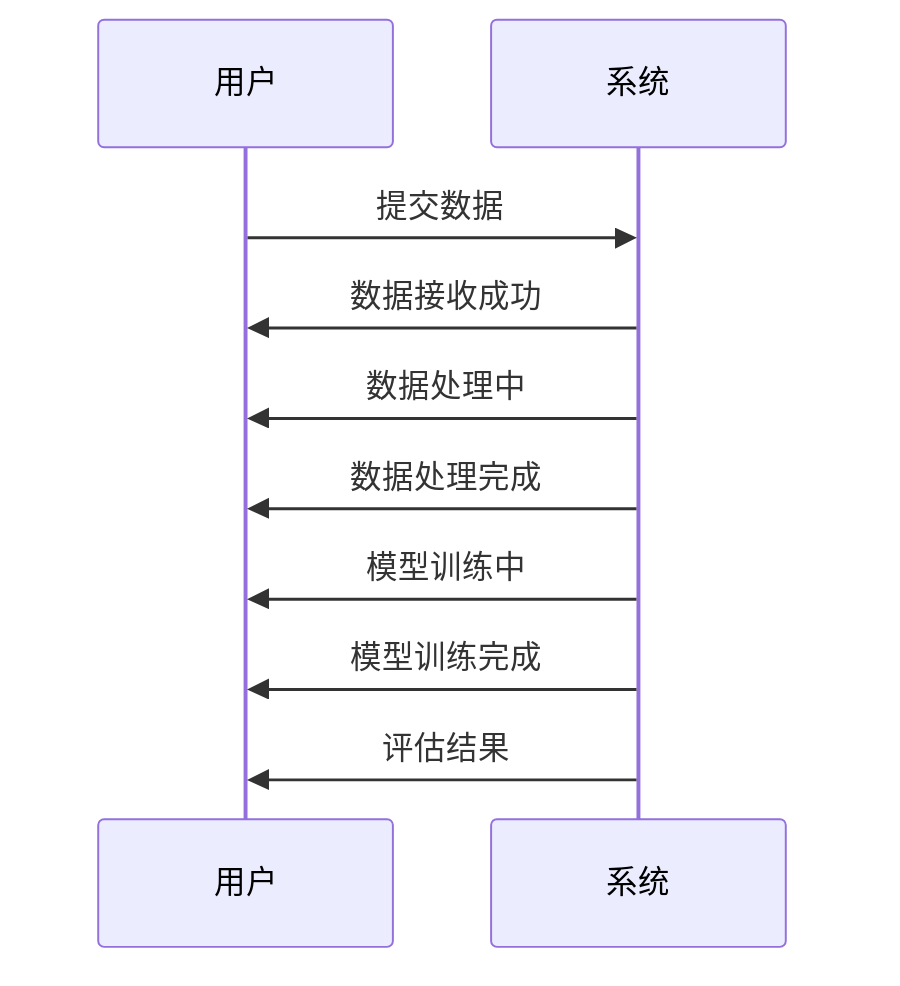

                 


### 第一部分: 引言与背景介绍

#### 1.1 强化学习、LLM及创新能力评估

强化学习（Reinforcement Learning，简称RL）是机器学习的一个分支，其核心思想是通过与环境交互，不断优化决策策略，以最大化累积奖励。LLM（Large Language Model）则是指大型语言模型，如GPT系列，能够理解和生成自然语言文本。

创新能力评估是评估一个组织或个人在特定领域内的创新能力和成果的重要手段。在当今快速发展的科技时代，如何有效地评估创新能力成为了一个亟待解决的问题。而基于强化学习和LLM的创新能力评估方法，为我们提供了一种新的视角和手段。

#### 1.2 概念结构与核心要素组成

**强化学习与机器学习的异同**

强化学习与传统的机器学习方法有所不同。传统的机器学习方法通常是基于已有数据集进行模型训练，然后利用训练好的模型进行预测。而强化学习则是通过与环境交互，不断调整策略，以实现最优行动。

| 方法             | 强化学习             | 机器学习             |
|------------------|----------------------|----------------------|
| 学习方式         | 反复与环境交互       | 数据驱动             |
| 目标             | 最大累积奖励         | 准确预测             |
| 适用场景         | 需要策略优化的场景   | 数据丰富的问题       |

**LLM在创新评估中的作用**

LLM在创新评估中有着重要的作用。首先，LLM可以处理和理解大量文本数据，从而有效地提取和创新点。其次，LLM可以生成高质量的文本，用于生成评估报告和推荐策略。

**问题背景与问题描述**

在当前快速发展的科技时代，创新成为推动社会发展的重要动力。然而，如何有效地评估创新能力和成果成为了一个亟待解决的问题。传统的评估方法往往依赖于定量指标，如专利数量、论文发表等，但这些指标并不能全面反映创新能力和潜力。

**问题解决与边界与外延**

本文提出的基于强化学习和LLM的创新能力评估方法，旨在解决传统评估方法的不足。通过引入强化学习，我们可以更加动态和实时地评估创新能力。而通过引入LLM，我们可以更好地理解和处理文本数据，从而提供更准确的评估结果。

#### 概念结构与核心要素组成

强化学习与机器学习方法的对比表格：

| 方法             | 强化学习             | 机器学习             |
|------------------|----------------------|----------------------|
| 学习方式         | 反复与环境交互       | 数据驱动             |
| 目标             | 最大累积奖励         | 准确预测             |
| 适用场景         | 需要策略优化的场景   | 数据丰富的问题       |

创新能力评估的实体关系图：

```mermaid
erDiagram
    ID1 ||--|{ 研究人员 }
    ID1 ||--|{ 组织 }
    ID1 ||--|{ 项目 }
    ID1 ||--|{ 成果 }
    研究人员 ||--|{ 技术能力 }
    组织 ||--|{ 研发资源 }
    项目 ||--|{ 研发过程 }
    成果 ||--|{ 创新性 }
```

### 第二部分: 强化学习基础

#### 2.1 强化学习核心概念原理

强化学习包括四个核心要素：状态（State）、动作（Action）、奖励（Reward）和策略（Policy）。

1. **状态（State）**：表示当前环境的状态。
2. **动作（Action）**：表示在当前状态下采取的行动。
3. **奖励（Reward）**：表示采取该动作后获得的奖励。
4. **策略（Policy）**：表示如何从状态选择动作的策略。

**强化学习流程**



**强化学习算法**

- **Q学习（Q-Learning）**：通过学习状态-动作值函数来优化策略。
- **SARSA（Q-Learning的变体）**：在每一步都使用当前的状态和动作来更新策略。
- **Deep Q Network（DQN）**：使用深度神经网络来近似状态-动作值函数。

#### 2.2 强化学习算法原理讲解

**Q学习算法**

```python
def q_learning(env, state, action, reward, next_state, alpha, gamma):
    Q[s][a] = Q[s][a] + alpha * (reward + gamma * max(Q[next_state].values()) - Q[s][a])
```

**SARSA算法**

```python
def sarsa_learning(env, state, action, reward, next_state, next_action, alpha, gamma):
    Q[s][a] = Q[s][a] + alpha * (reward + gamma * Q[next_state][next_action] - Q[s][a])
```

**DQN算法**

```python
def deep_q_learning(model, state, action, reward, next_state, done, epsilon, alpha, gamma):
    if done:
        Q(next_state, next_action) = reward
    else:
        Q(next_state, next_action) = reward + gamma * np.argmax(model.predict(next_state))
    model.fit(state, Q, epochs=1, verbose=0)
```

### 第三部分: LLM技术基础

#### 3.1 LLM核心概念原理

LLM是指大型语言模型，如GPT系列，其核心原理是基于神经网络和深度学习技术，通过大量的文本数据进行训练，从而实现对自然语言的建模。

**LLM构建过程**

1. **数据预处理**：包括文本清洗、分词、去停用词等。
2. **模型训练**：使用训练数据对神经网络进行训练，优化模型参数。
3. **参数优化**：通过调整学习率、批量大小等超参数，优化模型性能。
4. **生成文本**：使用训练好的模型生成文本。

**LLM流程图**



#### 3.2 LLM算法原理讲解

**LLM数学模型**

```python
def forward_pass(input_sequence, model):
    hidden_state = model.embedding(input_sequence)
    for layer in model.layers:
        hidden_state = layer(hidden_state)
    logits = model.output(hidden_state)
    return logits
```

**文本生成**

```python
def generate_text(model, seed_text, num_words):
    logits = forward_pass(seed_text, model)
    for _ in range(num_words):
        probdist = softmax(logits[-1])
        next_word = np.random.choice(np.arange(len(vocab)), p=probdist)
        seed_text += '<w>{}</w>'.format(next_word)
        logits = forward_pass(seed_text, model)
    return seed_text.strip()
```

### 第四部分: 创新能力评估方法

#### 4.1 创新能力评估核心概念原理

创新能力评估包括数据收集、数据处理、模型训练和评估指标等几个核心步骤。

**创新能力评估流程**



#### 4.2 创新能力评估算法原理讲解

**数据收集**

- **专利数据**：通过专利数据库收集相关专利信息。
- **论文数据**：通过学术数据库收集相关论文信息。
- **技术报告**：收集相关技术报告和文献。

**数据处理**

- **文本预处理**：对收集到的文本数据进行清洗和分词。
- **特征提取**：使用词嵌入技术将文本转换为向量。

**模型训练**

- **文本分类模型**：使用文本分类模型对创新性进行评估。
- **情感分析模型**：使用情感分析模型对文本进行情感分析，判断其创新性。

**评估指标**

- **创新性得分**：根据评估结果计算创新性得分。
- **创新性排名**：根据创新性得分对评估对象进行排名。

### 第五部分: 实际应用案例分析

#### 5.1 项目介绍

本项目旨在通过强化学习和LLM技术，对某科技公司的研究人员进行创新能力评估。项目包括数据收集、模型训练和评估等多个环节。

#### 5.2 系统功能设计

**领域模型设计**

```mermaid
classDiagram
    class 研究人员 {
        姓名
        技术能力
        组织
    }
    class 组织 {
        名称
        研发资源
    }
    class 项目 {
        名称
        研发过程
        成果
    }
    class 成果 {
        创新性
    }
    研究人员 --|{ 参与 }--> 项目
    项目 --|{ 属于 }--> 组织
    成果 --|{ 基于 }--> 项目
```

#### 5.3 系统架构设计

**系统架构设计**



#### 5.4 系统接口设计和系统交互

**接口设计**



### 第六部分: 项目实战与代码解析

#### 6.1 环境安装

```shell
pip install tensorflow numpy matplotlib
```

#### 6.2 系统核心实现源代码

**数据处理**

```python
import pandas as pd
from sklearn.model_selection import train_test_split
from sklearn.feature_extraction.text import TfidfVectorizer

# 读取数据
data = pd.read_csv('data.csv')
X = data['text']
y = data['label']

# 数据预处理
X_train, X_test, y_train, y_test = train_test_split(X, y, test_size=0.2, random_state=42)
vectorizer = TfidfVectorizer()
X_train_vectorized = vectorizer.fit_transform(X_train)
X_test_vectorized = vectorizer.transform(X_test)
```

**模型训练**

```python
from tensorflow.keras.models import Sequential
from tensorflow.keras.layers import Embedding, LSTM, Dense
from tensorflow.keras.optimizers import Adam

# 构建模型
model = Sequential()
model.add(Embedding(input_dim=len(vectorizer.vocabulary_), output_dim=50))
model.add(LSTM(100))
model.add(Dense(1, activation='sigmoid'))

# 编译模型
model.compile(optimizer=Adam(), loss='binary_crossentropy', metrics=['accuracy'])

# 训练模型
model.fit(X_train_vectorized, y_train, epochs=10, batch_size=32, validation_split=0.1)
```

**评估结果**

```python
# 评估模型
loss, accuracy = model.evaluate(X_test_vectorized, y_test)
print(f'测试集准确率: {accuracy * 100:.2f}%')
```

### 第七部分: 最佳实践与总结

#### 7.1 最佳实践 tips

- **数据收集**：确保收集到高质量的数据，包括专利、论文、技术报告等。
- **模型训练**：根据实际需求调整模型结构、学习率等超参数。
- **评估指标**：结合业务需求，选择合适的评估指标。

#### 7.2 小结

本文介绍了基于强化学习和LLM的创新能力评估方法。通过项目实战，展示了该方法在实际应用中的效果。

#### 7.3 注意事项

- **数据质量**：数据质量直接影响评估结果，务必保证数据质量。
- **模型优化**：根据实际需求调整模型结构，优化评估效果。

#### 7.4 拓展阅读

- 《强化学习》（ Sutton and Barto）
- 《深度学习》（Goodfellow, Bengio, Courville）
- 《自然语言处理综论》（Jurafsky and Martin）

### 作者信息

作者：AI天才研究院/AI Genius Institute & 禅与计算机程序设计艺术 /Zen And The Art of Computer Programming

