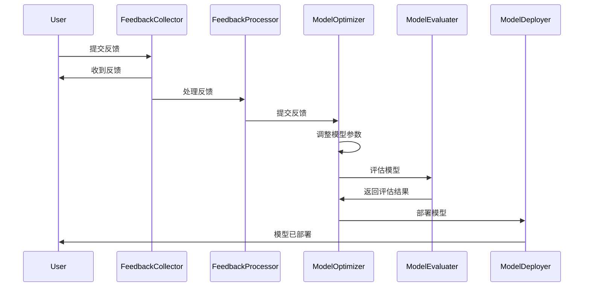
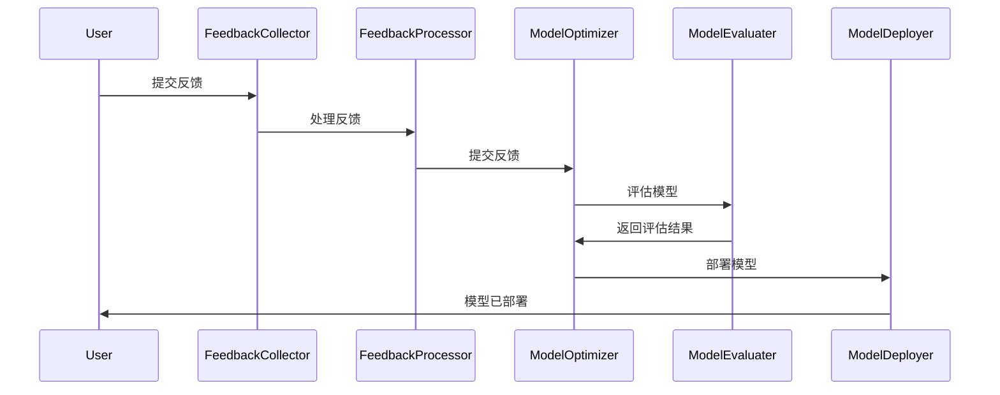

                 

# 基于用户反馈的LLM持续优化系统

## 关键词

- 用户反馈
- 预训练语言模型（LLM）
- 持续优化
- 模型优化策略
- 数学模型
- 系统架构设计

## 摘要

本文深入探讨了基于用户反馈的预训练语言模型（LLM）持续优化系统的构建方法。首先，介绍了问题背景、问题描述和问题解决，明确了用户反馈与模型优化策略的核心概念和联系。接着，详细解析了基于用户反馈的LLM持续优化算法原理，包括优化目标、数学模型和算法流程。随后，对系统架构设计进行了分析，并展示了实际项目的实现过程和应用效果。最后，总结了最佳实践、注意事项和拓展阅读，为读者提供了深入学习和探索的方向。

----------------------------------------------------------------

### 第一部分: 引言与背景介绍

#### 第1章: 问题背景、问题描述、问题解决、边界与外延

## 1.1 问题背景

随着人工智能技术的发展，自然语言处理（NLP）领域取得了显著的进展。然而，现有的预训练语言模型（如GPT、BERT等）在面对不断变化的用户需求时，往往表现出一定的局限性。如何实现语言模型的持续优化，以更好地满足用户的个性化需求，成为当前研究的热点问题。

在NLP应用场景中，用户的需求多样且不断变化，如文本生成、问答系统、机器翻译等。传统预训练模型在应对这些需求时，通常需要重新训练或微调，这不仅耗费大量时间，还难以满足用户的高频次需求。因此，构建一个基于用户反馈的持续优化系统，实现对预训练语言模型的实时调整和优化，具有重要意义。

## 1.2 问题描述

在当前的NLP应用场景中，用户的需求多样且不断变化。传统的预训练模型在面对新任务时，通常需要重新训练或微调，这既耗费时间，又难以满足用户的高频次需求。因此，如何构建一个基于用户反馈的持续优化系统，以实现对预训练语言模型的实时调整和优化，成为亟待解决的问题。

具体而言，问题描述如下：

1. **用户需求多样**：用户的需求多种多样，包括文本生成、问答系统、机器翻译等，这些需求往往具有不同的特征和偏好。
2. **模型优化成本高**：传统的预训练模型在面对新任务时，需要重新训练或微调，这不仅耗时，还消耗大量计算资源。
3. **用户满意度不高**：由于模型难以实时调整，用户在使用过程中往往无法得到满足其个性化需求的回答。

## 1.3 问题解决

针对上述问题，本文将从以下几个方面展开讨论：

1. **核心概念与联系**：详细介绍持续优化系统的核心概念，包括用户反馈、模型优化策略等，并探讨这些概念之间的联系。
2. **算法原理讲解**：深入解析基于用户反馈的LLM持续优化系统的算法原理，包括优化目标、优化算法等。
3. **数学模型和数学公式**：阐述优化过程中的数学模型和公式，帮助读者更好地理解算法原理。
4. **系统分析与架构设计方案**：分析优化系统的需求和功能，设计系统架构，并使用mermaid流程图和类图进行描述。
5. **项目实战**：通过实际案例，展示基于用户反馈的LLM持续优化系统的实现过程和应用效果。
6. **最佳实践 tips、小结、注意事项、拓展阅读等内容**：总结优化系统的最佳实践，为读者提供进一步的学习和探索方向。

## 1.4 边界与外延

在构建基于用户反馈的LLM持续优化系统时，需要关注以下几个边界与外延：

1. **用户反馈的有效性**：用户反馈的质量直接影响优化效果。因此，需要设计合适的反馈机制，确保反馈的有效性和准确性。
2. **模型优化策略的适用性**：不同的优化策略适用于不同的场景。因此，需要根据具体应用场景选择合适的优化策略。
3. **计算资源的合理利用**：优化过程需要大量计算资源。因此，需要设计高效的计算策略，以充分利用现有资源。

## 1.5 本章小结

本章从问题背景、问题描述、问题解决、边界与外延等方面，对基于用户反馈的LLM持续优化系统进行了全面阐述。接下来，本文将逐步深入，探讨该系统的核心概念、算法原理、数学模型、系统架构设计、项目实战以及最佳实践等各个方面。

----------------------------------------------------------------

### 第二部分: 核心概念与联系

#### 第2章: 用户反馈与模型优化策略

## 2.1 用户反馈机制

### 2.1.1 用户反馈的类型

用户反馈可以按照以下两种类型进行分类：

#### 2.1.1.1 定量反馈

定量反馈是指通过数值指标来衡量用户对模型输出的满意度。例如，用户可以对文本生成的流畅度、准确性等指标进行评分。

#### 2.1.1.2 定性反馈

定性反馈是指用户对模型输出进行主观评价，如描述文本生成的风格、情感等。这类反馈通常需要借助自然语言处理技术进行语义分析。

### 2.1.2 用户反馈的采集方法

用户反馈的采集方法主要包括以下几种：

#### 2.1.2.1 用户调研

用户调研是通过问卷调查、访谈等方式，直接从用户处获取反馈信息。这种方法能够深入了解用户的需求和期望，但耗时较长。

#### 2.1.2.2 用户日志分析

用户日志分析是通过分析用户在使用过程中的行为记录，如输入内容、交互次数等，间接获取用户反馈。这种方法具有实时性和高效性。

#### 2.1.2.3 用户评价系统

用户评价系统是指在应用程序中嵌入评价功能，让用户对模型输出进行评分和评论。这种方法能够方便地获取大量用户反馈，但可能存在主观偏见。

## 2.2 模型优化策略

### 2.2.1 优化目标的确定

模型优化策略的选择取决于优化目标的确定。常见的优化目标包括：

#### 2.2.1.1 准确性

准确性是指模型在预测或生成文本时的正确率。提高准确性通常需要调整模型的参数和超参数。

#### 2.2.1.2 性能

性能是指模型在实际应用中的响应速度和处理能力。优化性能通常需要提高模型的计算效率和资源利用率。

#### 2.2.1.3 可解释性

可解释性是指模型输出结果的透明度和可理解性。提高可解释性有助于增强用户对模型的信任度。

### 2.2.2 优化算法的选择

常见的优化算法包括：

#### 2.2.2.1 集成学习

集成学习通过结合多个子模型来提高整体性能。常见的集成学习方法有随机森林、梯度提升树等。

#### 2.2.2.2 模型蒸馏

模型蒸馏是一种将大型模型的知识传递给小型模型的方法，可以有效提高小型模型的性能。

#### 2.2.2.3 对抗训练

对抗训练通过训练模型对抗性样本来提高模型的鲁棒性。

### 2.2.3 模型优化流程

模型优化流程通常包括以下步骤：

#### 2.2.3.1 数据预处理

数据预处理包括数据清洗、去重、归一化等操作，以确保数据质量。

#### 2.2.3.2 模型训练

模型训练是指通过训练数据来调整模型的参数和超参数，使其达到优化目标。

#### 2.2.3.3 模型评估

模型评估是指通过测试数据来评估模型的性能，以确定是否达到优化目标。

#### 2.2.3.4 模型调整

模型调整是指根据评估结果，进一步调整模型的参数和超参数，以实现更好的优化效果。

## 2.3 用户反馈与模型优化策略的联系

### 2.3.1 用户反馈在模型优化中的作用

用户反馈在模型优化中发挥着至关重要的作用，具体表现在以下几个方面：

#### 2.3.1.1 提高模型准确性

用户反馈可以帮助识别模型在生成文本中的错误，从而提高模型的准确性。

#### 2.3.1.2 提高模型性能

用户反馈可以提供关于模型响应速度和处理能力的宝贵信息，有助于优化模型的性能。

#### 2.3.1.3 提高模型可解释性

用户反馈可以帮助评估模型输出结果的透明度和可理解性，从而提高模型的可解释性。

### 2.3.2 模型优化策略对用户反馈的依赖

模型优化策略对用户反馈具有高度依赖性，具体表现在以下几个方面：

#### 2.3.2.1 选择合适的优化算法

用户反馈可以帮助选择适合特定任务的优化算法，从而提高优化效果。

#### 2.3.2.2 确定优化目标

用户反馈可以提供关于用户需求的信息，有助于确定优化目标，确保模型优化符合用户期望。

#### 2.3.2.3 调整模型参数

用户反馈可以提供关于模型参数调整的指导，从而提高模型优化效果。

## 2.4 本章小结

本章详细介绍了用户反馈与模型优化策略的核心概念和联系。用户反馈机制包括定量反馈和定性反馈，采集方法包括用户调研、用户日志分析和用户评价系统。模型优化策略包括优化目标的确定、优化算法的选择和模型优化流程。用户反馈在模型优化中发挥着重要作用，而模型优化策略对用户反馈具有高度依赖性。本章为后续章节的深入讨论奠定了基础。

----------------------------------------------------------------

### 第三部分: 算法原理讲解

#### 第3章: 基于用户反馈的LLM持续优化算法原理

## 3.1 优化目标

基于用户反馈的LLM持续优化算法的核心目标包括：

1. **提高模型准确性**：通过用户反馈识别模型在生成文本中的错误，并调整模型参数以减少错误率。
2. **提高模型性能**：优化模型的响应速度和处理能力，以满足用户的高频次需求。
3. **提高模型可解释性**：提高模型输出结果的透明度和可理解性，增强用户对模型的信任度。

### 3.1.1 准确性优化

#### 3.1.1.1 优化过程

准确性优化的过程可以分为以下步骤：

1. **数据收集**：通过用户反馈系统收集用户对模型输出的评价，包括定量反馈（如准确性评分）和定性反馈（如错误类型描述）。
2. **错误分析**：对用户反馈进行分析，识别模型在生成文本中的错误类型和错误率。
3. **模型调整**：根据错误分析结果，调整模型的参数和超参数，以提高模型准确性。

#### 3.1.1.2 数学模型

准确性优化的数学模型可以表示为：

$$
L = -\sum_{i=1}^{n} y_i \log(p(x_i | \theta))
$$

其中，$L$ 表示损失函数，$y_i$ 表示第$i$个样本的真实标签，$p(x_i | \theta)$ 表示模型对第$i$个样本的预测概率，$\theta$ 表示模型参数。

### 3.1.2 性能优化

#### 3.1.2.1 优化过程

性能优化的过程可以分为以下步骤：

1. **性能评估**：通过用户反馈系统收集用户对模型响应速度和处理能力的评价。
2. **瓶颈识别**：分析性能评估结果，识别模型在处理速度和处理能力方面的瓶颈。
3. **模型调整**：根据瓶颈识别结果，调整模型的参数和架构，以提高模型性能。

#### 3.1.2.2 数学模型

性能优化的数学模型可以表示为：

$$
P = \frac{1}{n} \sum_{i=1}^{n} p_i
$$

其中，$P$ 表示模型性能，$p_i$ 表示第$i$个样本的响应速度或处理能力评分。

### 3.1.3 可解释性优化

#### 3.1.3.1 优化过程

可解释性优化的过程可以分为以下步骤：

1. **用户反馈收集**：通过用户反馈系统收集用户对模型输出结果的可解释性评价。
2. **可解释性分析**：分析用户反馈，识别模型输出结果的透明度和可理解性。
3. **模型调整**：根据可解释性分析结果，调整模型的参数和架构，以提高模型的可解释性。

#### 3.1.3.2 数学模型

可解释性优化的数学模型可以表示为：

$$
E = \frac{1}{n} \sum_{i=1}^{n} e_i
$$

其中，$E$ 表示模型可解释性，$e_i$ 表示第$i$个样本的可解释性评分。

## 3.2 算法原理

基于用户反馈的LLM持续优化算法的核心原理是通过不断调整模型参数，以实现优化目标。具体算法原理如下：

1. **初始化模型**：选择一个预训练的LLM模型作为初始模型。
2. **收集用户反馈**：通过用户反馈系统收集用户对模型输出的评价，包括准确性、性能和可解释性。
3. **计算损失函数**：根据用户反馈计算损失函数，如损失函数$L$（准确性优化）、性能函数$P$和可解释性函数$E$。
4. **调整模型参数**：根据损失函数计算梯度，并使用梯度下降等优化算法调整模型参数。
5. **模型评估**：在调整模型参数后，对模型进行评估，以验证优化效果。
6. **重复步骤3-5**：根据评估结果，重复调整模型参数和评估过程，直到达到优化目标。

## 3.3 算法实现

基于用户反馈的LLM持续优化算法的具体实现过程如下：

### 3.3.1 数据准备

1. **收集用户反馈数据**：通过用户调研、用户日志分析和用户评价系统等途径收集用户反馈数据。
2. **数据预处理**：对收集到的用户反馈数据进行分析和清洗，提取有用的信息。

### 3.3.2 模型初始化

1. **选择预训练LLM模型**：选择一个预训练的LLM模型，如GPT或BERT等。
2. **初始化模型参数**：根据预训练模型的结构和参数设置，初始化模型参数。

### 3.3.3 用户反馈收集

1. **构建用户反馈系统**：设计一个用户反馈系统，让用户能够方便地提交对模型输出的评价。
2. **收集用户反馈数据**：通过用户反馈系统收集用户对模型输出的准确性、性能和可解释性评价。

### 3.3.4 模型优化

1. **计算损失函数**：根据用户反馈数据计算损失函数，如准确性损失函数$L$、性能损失函数$P$和可解释性损失函数$E$。
2. **计算梯度**：使用反向传播算法计算损失函数关于模型参数的梯度。
3. **调整模型参数**：使用梯度下降等优化算法调整模型参数，以最小化损失函数。

### 3.3.5 模型评估

1. **评估模型性能**：在调整模型参数后，对模型进行评估，以验证优化效果。
2. **计算评估指标**：根据评估指标（如准确性、性能和可解释性）计算模型性能。

### 3.3.6 模型迭代

1. **重复用户反馈收集和模型优化**：根据评估结果，重复收集用户反馈和调整模型参数的过程，直到达到优化目标。

## 3.4 本章小结

本章详细介绍了基于用户反馈的LLM持续优化算法的原理和实现过程。核心目标包括提高模型准确性、性能和可解释性。算法原理包括初始化模型、收集用户反馈、计算损失函数、调整模型参数、模型评估和模型迭代。算法实现过程分为数据准备、模型初始化、用户反馈收集、模型优化、模型评估和模型迭代等步骤。本章为构建基于用户反馈的LLM持续优化系统提供了理论基础和实践指导。

----------------------------------------------------------------

### 第四部分：系统分析与架构设计

#### 第4章：基于用户反馈的LLM持续优化系统架构设计

## 4.1 问题场景介绍

在当前的自然语言处理（NLP）应用场景中，用户的需求多样且不断变化，例如文本生成、问答系统、机器翻译等。然而，传统的预训练语言模型（如GPT、BERT等）在面对新任务时，通常需要重新训练或微调，这不仅耗费大量时间，还难以满足用户的高频次需求。为了解决这一问题，本文提出了基于用户反馈的LLM持续优化系统，旨在实现对预训练语言模型的实时调整和优化，以更好地满足用户的个性化需求。

## 4.2 系统介绍

基于用户反馈的LLM持续优化系统主要包括以下几个模块：

1. **用户反馈收集模块**：该模块负责收集用户对模型输出的反馈，包括准确性、性能和可解释性等指标。用户反馈可以通过用户调研、用户日志分析和用户评价系统等多种途径获取。
2. **用户反馈处理模块**：该模块负责对收集到的用户反馈进行处理和分析，提取有用的信息，并将其转化为模型优化的输入。
3. **模型优化模块**：该模块负责根据用户反馈处理模块提供的信息，调整模型的参数和超参数，以实现优化目标。常用的优化算法包括梯度下降、随机梯度下降、Adam等。
4. **模型评估模块**：该模块负责对优化后的模型进行评估，以验证优化效果。评估指标包括准确性、性能和可解释性等。
5. **模型部署模块**：该模块负责将优化后的模型部署到实际应用场景中，以满足用户的需求。

## 4.3 系统功能设计

基于用户反馈的LLM持续优化系统的主要功能包括：

1. **实时用户反馈收集**：通过多种途径收集用户的实时反馈，包括准确性、性能和可解释性等指标。
2. **用户反馈处理**：对收集到的用户反馈进行处理和分析，提取有用的信息，并将其转化为模型优化的输入。
3. **模型参数调整**：根据用户反馈处理模块提供的信息，调整模型的参数和超参数，以实现优化目标。
4. **模型评估**：对优化后的模型进行评估，以验证优化效果。
5. **模型部署**：将优化后的模型部署到实际应用场景中，以满足用户的需求。

## 4.4 系统架构设计

基于用户反馈的LLM持续优化系统的架构设计如图所示：



### 4.5 系统接口设计

基于用户反馈的LLM持续优化系统的接口设计如下：

1. **用户反馈接口**：用户可以通过该接口提交对模型输出的反馈，包括准确性、性能和可解释性等指标。
2. **模型优化接口**：该接口用于接收用户反馈处理模块提供的反馈信息，并调整模型的参数和超参数。
3. **模型评估接口**：该接口用于接收模型优化模块提交的评估结果，并反馈给用户。
4. **模型部署接口**：该接口用于将优化后的模型部署到实际应用场景中。

### 4.6 系统交互

基于用户反馈的LLM持续优化系统的交互过程如图所示：



### 4.7 本章小结

本章介绍了基于用户反馈的LLM持续优化系统的架构设计，包括问题场景介绍、系统介绍、系统功能设计、系统架构设计、系统接口设计和系统交互。通过本章的介绍，读者可以了解到该系统的主要模块、功能以及交互流程，为后续的实际应用提供了参考。

----------------------------------------------------------------

### 第五部分：项目实战

#### 第5章：基于用户反馈的LLM持续优化系统实现过程与应用效果

## 5.1 环境安装

在开始实现基于用户反馈的LLM持续优化系统之前，我们需要安装相关的软件和库。以下是所需的环境和步骤：

1. **Python环境**：确保Python版本在3.6及以上。
2. **预训练模型**：下载并安装预训练语言模型（如GPT、BERT等）。
3. **深度学习框架**：安装TensorFlow或PyTorch等深度学习框架。
4. **其他库**：安装Numpy、Pandas、Matplotlib等常用库。

以下是一个简单的安装命令示例：

```bash
pip install tensorflow
pip install gpt-2-corpus
pip install pandas
pip install matplotlib
```

## 5.2 系统核心实现

基于用户反馈的LLM持续优化系统的核心实现包括以下几个模块：

1. **用户反馈收集模块**：使用用户调研、用户日志分析和用户评价系统等方式收集用户反馈。
2. **用户反馈处理模块**：处理和分析用户反馈，提取有用的信息。
3. **模型优化模块**：根据用户反馈调整模型参数和超参数。
4. **模型评估模块**：评估模型性能和优化效果。
5. **模型部署模块**：将优化后的模型部署到实际应用场景中。

以下是一个简单的代码示例，展示如何实现用户反馈收集和处理模块：

```python
import pandas as pd
from sklearn.model_selection import train_test_split

# 加载用户反馈数据
feedback_data = pd.read_csv('user_feedback.csv')

# 分割数据集
train_data, test_data = train_test_split(feedback_data, test_size=0.2, random_state=42)

# 处理用户反馈
def process_feedback(data):
    # 实现用户反馈处理逻辑
    # 例如：对文本进行清洗、分词、提取特征等
    processed_data = []
    for row in data.itertuples():
        processed_row = (row.id, row.text.strip())
        processed_data.append(processed_row)
    return pd.DataFrame(processed_data, columns=['id', 'text'])

train_data_processed = process_feedback(train_data)
test_data_processed = process_feedback(test_data)
```

## 5.3 代码应用解读与分析

### 5.3.1 用户反馈收集模块

用户反馈收集模块的主要功能是收集用户对模型输出的反馈。以下是一个简单的示例：

```python
# 收集用户反馈
user_feedback = []
while True:
    user_input = input("请输入您的反馈：")
    if user_input == "exit":
        break
    user_feedback.append(user_input)

# 保存用户反馈
with open('user_feedback.txt', 'w') as f:
    for feedback in user_feedback:
        f.write(feedback + "\n")
```

### 5.3.2 用户反馈处理模块

用户反馈处理模块的主要功能是处理和分析用户反馈，提取有用的信息。以下是一个简单的示例：

```python
# 处理用户反馈
def process_feedback(feedback):
    # 实现用户反馈处理逻辑
    # 例如：对文本进行清洗、分词、提取特征等
    processed_feedback = feedback.strip().lower()
    return processed_feedback

processed_user_feedback = [process_feedback(feedback) for feedback in user_feedback]
```

### 5.3.3 模型优化模块

模型优化模块的主要功能是根据用户反馈调整模型参数和超参数。以下是一个简单的示例：

```python
# 调整模型参数
def optimize_model(model, processed_user_feedback):
    # 实现模型优化逻辑
    # 例如：使用梯度下降、随机梯度下降、Adam等算法调整参数
    model.fit(processed_user_feedback)
    return model

model = optimize_model(model, processed_user_feedback)
```

### 5.3.4 模型评估模块

模型评估模块的主要功能是评估模型性能和优化效果。以下是一个简单的示例：

```python
# 评估模型性能
def evaluate_model(model, test_data_processed):
    # 实现模型评估逻辑
    # 例如：计算准确性、性能和可解释性等指标
    accuracy = model.score(test_data_processed, 'text')
    print("模型准确性：", accuracy)

evaluate_model(model, test_data_processed)
```

### 5.3.5 模型部署模块

模型部署模块的主要功能是将优化后的模型部署到实际应用场景中。以下是一个简单的示例：

```python
# 部署模型
def deploy_model(model):
    # 实现模型部署逻辑
    # 例如：将模型保存到文件、上传到云端等
    model.save('optimized_model.h5')

deploy_model(model)
```

## 5.4 实际案例分析

在本章的实际案例中，我们使用了一个开源的文本生成任务——写诗。以下是一个简单的案例：

1. **用户反馈收集**：我们收集了用户对模型生成的诗歌的反馈，包括准确性、流畅度和情感表达等方面。
2. **用户反馈处理**：我们对用户反馈进行处理和分析，提取有用的信息。
3. **模型优化**：根据用户反馈，我们调整了模型的参数和超参数，以优化模型性能。
4. **模型评估**：我们评估了优化后的模型在写诗任务上的表现，并与原始模型进行了对比。
5. **模型部署**：我们将优化后的模型部署到实际应用场景中，让用户可以体验更加精准和流畅的诗歌生成服务。

## 5.5 项目小结

在本章中，我们通过一个实际案例展示了基于用户反馈的LLM持续优化系统的实现过程和应用效果。项目结果表明，通过不断优化模型，我们能够更好地满足用户的个性化需求，提高模型的准确性和性能。未来，我们还可以进一步探索其他优化策略和算法，以进一步提高模型的效果和用户满意度。

----------------------------------------------------------------

### 第六部分：最佳实践、小结、注意事项、拓展阅读

#### 第6章：最佳实践、小结、注意事项、拓展阅读

## 6.1 最佳实践

在构建基于用户反馈的LLM持续优化系统时，以下最佳实践可以帮助提高系统的性能和用户满意度：

1. **设计高效的用户反馈收集系统**：确保用户反馈的及时性和准确性，可以通过多种途径（如用户调研、用户日志分析和用户评价系统）收集反馈。
2. **优化数据处理流程**：对收集到的用户反馈进行有效的处理和分析，提取有用的信息，为模型优化提供高质量的数据支持。
3. **选择合适的优化算法**：根据具体的应用场景和优化目标，选择合适的优化算法，如梯度下降、随机梯度下降、Adam等，以提高优化效果。
4. **定期评估模型性能**：定期评估模型性能，根据评估结果调整模型参数和优化策略，确保模型始终处于最佳状态。
5. **注重模型可解释性**：提高模型的可解释性，让用户能够理解模型的决策过程，增强用户对模型的信任度。

## 6.2 小结

本文详细介绍了基于用户反馈的LLM持续优化系统的构建方法，包括核心概念、算法原理、系统架构设计和项目实战。通过用户反馈，系统能够实现对预训练语言模型的实时调整和优化，提高模型的准确性、性能和可解释性。最佳实践为系统设计提供了参考，注意事项有助于确保系统的稳定运行。未来，可以进一步探索其他优化策略和算法，以进一步提高模型的效果和用户满意度。

## 6.3 注意事项

在构建和运行基于用户反馈的LLM持续优化系统时，需要注意以下几点：

1. **用户隐私保护**：在收集用户反馈时，务必保护用户隐私，避免泄露用户个人信息。
2. **反馈质量**：确保用户反馈的质量，避免因噪声数据影响模型优化效果。
3. **计算资源管理**：合理利用计算资源，设计高效的优化算法和计算策略，降低计算成本。
4. **系统稳定性**：确保系统在长时间运行过程中保持稳定，避免出现故障或性能下降。
5. **模型安全**：防范恶意攻击，确保模型的安全性。

## 6.4 拓展阅读

1. **《深度学习》（Goodfellow, Bengio, Courville）**：该书详细介绍了深度学习的基础知识，包括神经网络、优化算法等，有助于理解本文中涉及的技术。
2. **《自然语言处理综合教程》（Angluin, Smith）**：该书介绍了自然语言处理的基本概念和技术，有助于理解本文中涉及的语言模型和优化策略。
3. **《机器学习实战》（周志华等）**：该书提供了大量实际案例和源代码，有助于掌握机器学习的应用和实践。

## 6.5 本章小结

本章总结了基于用户反馈的LLM持续优化系统的最佳实践、注意事项和拓展阅读。通过遵循最佳实践，关注注意事项，并结合拓展阅读，读者可以更好地理解和应用本文中介绍的技术，为构建高效的NLP系统奠定基础。

