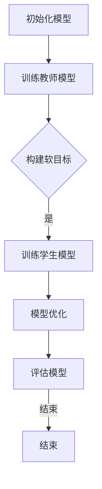
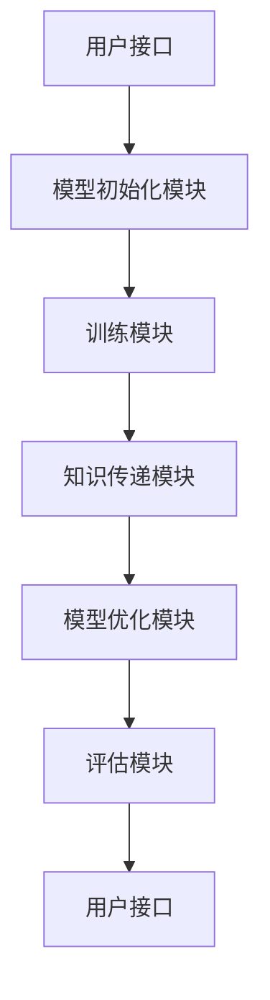
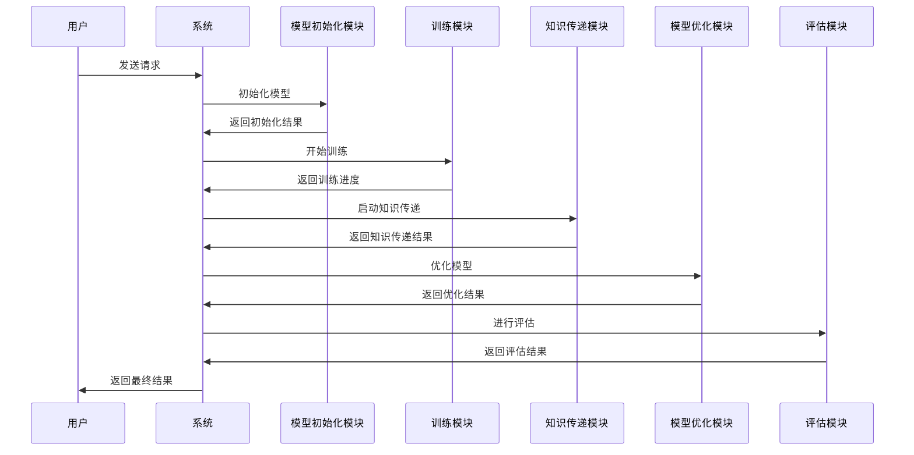

                 

## 背景介绍

### 核心概念术语说明

在进行技术讨论之前，我们需要明确一些核心概念术语。首先，什么是“知识蒸馏”（Knowledge Distillation）？知识蒸馏是一种在机器学习中，由一个大的、复杂的模型（教师模型）指导一个小的、轻量级的模型（学生模型）的训练过程。它通过将教师模型的预测结果或中间层表示传递给学生模型，从而让后者学习到教师模型的精髓。

接下来，我们再来定义一下“轻量级评测模型”（Lightweight Evaluation Model）。这指的是一种专门为快速评估和高效执行设计的模型，它在资源受限的环境下（如移动设备或嵌入式系统）能够提供与全规模模型相似或更优的性能。轻量级模型通常有较少的参数和计算量，但能够维持较高的准确性。

除此之外，我们还需要理解一些相关的术语，如“模型压缩”（Model Compression）、“模型剪枝”（Model Pruning）和“量化”（Quantization）。模型压缩是通过减少模型的大小和计算复杂度来实现的，它可以是结构化压缩（如网络剪枝）或参数化压缩（如量化）。模型剪枝则通过删除网络中不必要的权重来简化模型。量化则是指将浮点数参数转换为较低精度的整数表示。

### 问题背景

在当前的机器学习和人工智能领域，随着深度学习技术的迅猛发展，越来越多的复杂模型被设计和应用。然而，这些大型的深度学习模型往往需要大量的计算资源和存储空间，这对于许多实际应用场景来说是一个巨大的挑战。例如，智能手机、智能手表、IoT设备和自动驾驶汽车等资源受限的环境，对模型的实时性和轻量性有着极高的要求。

传统的解决方案往往是通过牺牲模型性能来达到轻量化的目的，但这往往不能满足高准确性的要求。此外，部署这些大型模型还需要耗费大量的时间和计算资源，从而延长了开发周期和降低了开发效率。

为了解决这些问题，研究人员提出了知识蒸馏和轻量级评测模型的概念。知识蒸馏允许我们将一个大型、性能优越的教师模型的知识传递给一个较小的学生模型，从而使学生模型能够保持较高的性能，同时减少模型的复杂度和资源需求。轻量级评测模型则是在资源受限的环境下，能够提供快速和准确评估的模型，这为实时应用和嵌入式系统提供了可能。

### 问题描述

在机器学习和人工智能领域，评测模型的性能至关重要。然而，传统的评测模型往往存在以下问题：

1. **计算资源消耗大**：大型模型需要大量的计算资源和时间来训练和部署，这限制了它们的实际应用。
2. **模型复杂度高**：大型模型通常包含数百万甚至数亿个参数，这导致模型难以解释和优化。
3. **实时性差**：在实时应用中，模型需要快速响应，但大型模型的训练和推理速度较慢，难以满足要求。
4. **存储空间需求高**：大型模型的存储需求巨大，这对存储资源有限的环境来说是一个巨大的挑战。

### 问题解决

为了解决上述问题，知识蒸馏和轻量级评测模型提供了一种有效的解决方案。知识蒸馏通过教师模型向学生模型传递知识，使得学生模型能够保持较高的性能，同时减少模型的复杂度和计算资源需求。轻量级评测模型则通过优化模型结构和参数，使其在资源受限的环境下能够提供高效的评估。

通过知识蒸馏和轻量级评测模型，我们可以在保持模型性能的同时，显著降低计算资源和存储需求，从而满足各种资源受限的应用场景。这不仅提高了开发效率，也为人工智能在现实世界的广泛应用奠定了基础。

### 边界与外延

在讨论知识蒸馏和轻量级评测模型时，我们需要明确一些边界和相关的概念外延。

首先，知识蒸馏的边界主要涉及教师模型和学生模型的选择、模型结构的调整以及如何有效地传递知识。教师模型通常是一个大型、性能优异的模型，而学生模型则需要是一个较小、轻量级的模型。在这个过程中，如何确保学生模型能够充分学习到教师模型的知识，是一个关键问题。

其次，轻量级评测模型的边界包括模型的架构设计、参数优化和推理速度的提升。轻量级模型的设计不仅要考虑模型的性能，还要考虑其可解释性和可维护性。

此外，知识蒸馏和轻量级评测模型的外延还涉及到模型压缩、剪枝和量化等技术。这些技术可以进一步优化模型的复杂度和资源需求，从而提高模型的轻量化和实时性。

通过明确这些边界和外延，我们能够更好地理解知识蒸馏和轻量级评测模型在机器学习和人工智能领域的应用和潜在发展。

### 概念结构与核心要素组成

知识蒸馏和轻量级评测模型是机器学习和人工智能领域中的重要概念，它们各有其独特的核心要素和结构。为了更好地理解这两个概念，我们需要详细分析它们的基本组成和相互关系。

#### 知识蒸馏的核心要素

知识蒸馏的核心要素包括教师模型、学生模型、知识传递机制和评估指标。

1. **教师模型**：教师模型通常是大型、性能优异的模型，它拥有丰富的知识和高水平的预测能力。在知识蒸馏过程中，教师模型通过其输出或中间层表示向学生模型传递知识。
   
2. **学生模型**：学生模型是一个较小的、轻量级的模型，它通过学习教师模型的知识来提升自己的性能。学生模型的设计通常考虑了参数数量、计算复杂度和存储需求，以确保其在资源受限的环境中能够高效运行。

3. **知识传递机制**：知识传递机制是知识蒸馏的关键环节，它决定了如何有效地将教师模型的知识传递给学生模型。常见的知识传递机制包括软目标蒸馏、硬目标蒸馏和中间层表示蒸馏等。

4. **评估指标**：评估指标用于衡量学生模型的学习效果。常用的评估指标包括准确率、召回率、F1分数和模型损失函数等。

#### 轻量级评测模型的核心要素

轻量级评测模型的核心要素包括模型架构、参数优化和推理优化。

1. **模型架构**：轻量级评测模型的架构设计是其关键，它需要平衡模型的性能和资源需求。常见的轻量级模型架构包括MobileNet、ShuffleNet和EfficientNet等。

2. **参数优化**：参数优化是轻量级评测模型的关键步骤，通过减少模型参数的数量，可以显著降低模型的计算复杂度和存储需求。参数优化方法包括模型剪枝、模型压缩和量化等。

3. **推理优化**：推理优化旨在提高模型的推理速度，以满足实时应用的需求。推理优化方法包括模型并行化、模型量化、模型压缩等。

#### 概念之间的联系

知识蒸馏和轻量级评测模型之间的联系在于它们都是针对资源受限环境下的解决方案。知识蒸馏通过将大型教师模型的知识传递给轻量级学生模型，实现了在保持性能的同时降低资源需求。而轻量级评测模型则通过优化模型架构和参数，实现了在资源受限的环境下提供高效评估。

此外，知识蒸馏和轻量级评测模型都可以应用于模型压缩、剪枝和量化等技术，从而进一步提升模型的轻量化和实时性。

通过以上分析，我们可以看出知识蒸馏和轻量级评测模型在机器学习和人工智能领域的重要性和应用价值。它们不仅为解决资源受限环境下的模型性能和效率问题提供了有效途径，也为人工智能的广泛应用奠定了基础。

### 核心概念与理论依据

为了深入理解知识蒸馏和轻量级评测模型，我们需要探讨其核心概念和理论基础。以下是这些概念和理论的详细解释及其之间的比较。

#### 知识蒸馏（Knowledge Distillation）

知识蒸馏是一种通过小型模型（学生模型）学习大型模型（教师模型）的知识，以实现性能迁移的技术。其基本思想是教师模型通过其预测结果或中间层表示来指导学生模型的学习。

**核心概念：**
- **教师模型（Teacher Model）**：通常是一个大型、高精度的模型，其目的是生成高质量的输出或中间层表示。
- **学生模型（Student Model）**：是一个较小的模型，其目标是学习教师模型的知识并达到相似的预测性能。
- **软目标蒸馏（Soft Target Distillation）**：学生模型的学习目标不仅仅是最小化输入和输出之间的损失，还包括最小化教师模型的输出和学生模型输出之间的损失。
- **硬目标蒸馏（Hard Target Distillation）**：学生模型的输出直接以教师模型的输出作为目标，这种目标更具确定性，但可能无法充分利用教师模型的细节。

**理论基础：**
- **信息论**：知识蒸馏利用了信息论中的相关性和冗余性原理，通过减少教师模型和学生模型之间的差异来提升学生模型的性能。
- **神经网络的泛化能力**：知识蒸馏通过让学生模型学习教师模型的内部表示，增强了学生模型的泛化能力，使其能够在未见过的数据上表现良好。

**比较：**
- **软目标蒸馏与硬目标蒸馏**：软目标蒸馏更注重模型输出的概率分布，而硬目标蒸馏更注重具体输出值的准确性。在实际应用中，软目标蒸馏通常更有效，因为它能够更好地捕捉到教师模型的细微差别。
- **教师模型与学生模型**：教师模型通常具有更高的准确性和更复杂的结构，而学生模型则更注重轻量化和效率。两者之间的区别在于模型的规模、参数数量和计算复杂度。

#### 轻量级评测模型（Lightweight Evaluation Model）

轻量级评测模型是一种专门设计用于快速评估和高效执行的小型模型。与大型模型相比，轻量级模型具有更少的参数和更简单的结构，但能够保持较高的准确性。

**核心概念：**
- **模型压缩（Model Compression）**：通过减少模型的参数数量和计算复杂度来降低模型的存储和计算需求。
- **模型剪枝（Model Pruning）**：通过移除模型中不必要的权重或层来简化模型。
- **量化（Quantization）**：将模型的浮点数参数转换为较低精度的整数表示，以减少存储和计算需求。

**理论基础：**
- **深度学习优化**：轻量级评测模型通过优化深度学习算法的参数和结构，以提高模型的效率和准确性。
- **硬件限制**：在资源受限的环境下，如移动设备和嵌入式系统，轻量级评测模型能够更好地适应硬件限制。

**比较：**
- **知识蒸馏与轻量级评测模型**：知识蒸馏侧重于通过学习大型模型的知识来提升小型模型的性能，而轻量级评测模型则通过优化模型的结构和参数来实现轻量化。两者的共同目标是提高模型在资源受限环境下的效率和准确性。
- **应用场景**：知识蒸馏通常用于将大型模型的知识迁移到小型模型中，以在资源受限的环境中应用。而轻量级评测模型则直接应用于这些环境，无需迁移知识。

通过比较知识蒸馏和轻量级评测模型的核心概念和理论基础，我们可以更好地理解它们在不同应用场景下的适用性。知识蒸馏适用于需要迁移大型模型知识的场景，而轻量级评测模型适用于直接在资源受限的环境中应用。

### 知识蒸馏与轻量级评测模型的实体关系图

为了更直观地展示知识蒸馏和轻量级评测模型的核心概念及其相互关系，我们可以使用Mermaid绘制一个实体关系图（Entity Relationship Diagram, ERD）。以下是一个简单的Mermaid ERD示例，描述了知识蒸馏和轻量级评测模型的主要实体及其关系：

```mermaid
erDiagram
    TeacherModel ||--|{ StudentModel }|| StudentModel
    TeacherModel ||--|{ KnowledgeDistillation }|| KnowledgeDistillation
    StudentModel ||--|{ ModelCompression }|| ModelCompression
    StudentModel ||--|{ ModelPruning }|| ModelPruning
    StudentModel ||--|{ Quantization }|| Quantization
```

在这张ERD中：

- **TeacherModel**（教师模型）是大型、性能优异的模型，它通过知识蒸馏机制向**StudentModel**（学生模型）传递知识。
- **StudentModel**（学生模型）是轻量级模型，通过模型压缩、剪枝和量化等技术进行优化。
- **KnowledgeDistillation**（知识蒸馏）是一个过程或机制，它连接教师模型和学生模型，实现知识传递。
- **ModelCompression**、**ModelPruning**和**Quantization**是模型优化技术，用于进一步优化学生模型。

Mermaid ERD不仅帮助我们理解了这些实体及其关系，还使得复杂的概念变得更加直观和易于理解。

### 算法设计

在本节中，我们将详细描述知识蒸馏和轻量级评测模型的算法设计，并使用Mermaid绘制算法流程图，以便更清晰地展示其运行步骤。

#### 算法概述

知识蒸馏算法的总体目标是让学生模型（Student Model）学习到教师模型（Teacher Model）的知识，从而在保持较高性能的同时降低计算和存储资源的需求。以下是知识蒸馏和轻量级评测模型的主要步骤：

1. **初始化模型**：首先，初始化教师模型和学生模型。教师模型通常是大型、高精度的模型，而学生模型是一个较小的轻量级模型。
2. **训练教师模型**：在训练数据集上训练教师模型，使其达到较高的性能。教师模型将生成高质量的输出或中间层表示。
3. **构建软目标**：学生模型的学习目标不仅仅是输入和输出之间的损失，还包括教师模型输出和学生模型输出之间的损失。软目标通常是一个概率分布。
4. **训练学生模型**：使用软目标训练学生模型，使其学习到教师模型的知识。在训练过程中，学生模型将尝试最小化输入和输出之间的损失，同时最小化教师模型输出和学生模型输出之间的差异。
5. **模型优化**：通过模型压缩、剪枝和量化等技术对学生模型进行优化，进一步降低模型的复杂度和计算资源需求。
6. **评估模型**：在验证数据集上评估学生模型的性能，确保其达到预期的性能指标。

#### Mermaid 流程图

为了更直观地展示算法流程，我们使用Mermaid绘制了以下流程图：



在上述流程图中：
- **A[初始化模型]**：初始化教师模型和学生模型。
- **B[训练教师模型]**：在训练数据集上训练教师模型。
- **C[构建软目标]**：根据教师模型的输出构建软目标。
- **D[训练学生模型]**：使用软目标训练学生模型。
- **E[模型优化]**：通过模型压缩、剪枝和量化等技术对模型进行优化。
- **F[评估模型]**：在验证数据集上评估学生模型的性能。
- **G[结束]**：算法结束。

通过这个流程图，我们可以清晰地看到知识蒸馏和轻量级评测模型的各个步骤及其相互关系，从而更好地理解和应用这些算法。

### 算法数学模型与公式

在本节中，我们将详细阐述知识蒸馏和轻量级评测模型的数学模型和公式。这些数学基础是理解和实现这些算法的关键。

#### 知识蒸馏的数学模型

知识蒸馏的核心在于将教师模型（Teacher Model）的知识传递给学生模型（Student Model）。以下是知识蒸馏过程中涉及的主要数学模型和公式。

1. **损失函数**：

   知识蒸馏中的损失函数通常包含两个部分：输入和输出之间的损失（称为原始损失，通常为交叉熵损失）和教师模型输出与学生模型输出之间的损失（称为知识蒸馏损失）。

   - 原始损失（$L_{original}$）：
     $$L_{original} = -\sum_{i=1}^{N} y_i \log(p_i)$$
     其中，$y_i$是真实标签，$p_i$是学生模型对第$i$个样本的预测概率。

   - 知识蒸馏损失（$L_{distillation}$）：
     $$L_{distillation} = -\sum_{i=1}^{N} \sum_{j=1}^{K} t_{ij} \log(s_{ij})$$
     其中，$t_{ij}$是教师模型对第$i$个样本第$j$个类别的输出概率，$s_{ij}$是学生模型对第$i$个样本第$j$个类别的输出概率。

   - 总损失（$L_{total}$）：
     $$L_{total} = \lambda L_{original} + (1-\lambda) L_{distillation}$$
     其中，$\lambda$是调节参数，用于平衡原始损失和知识蒸馏损失。

2. **优化目标**：

   知识蒸馏的优化目标是最小化总损失函数：
   $$\min_{\theta_{student}} L_{total}$$
   其中，$\theta_{student}$是学生模型的参数。

#### 轻量级评测模型的数学模型

轻量级评测模型通过优化模型结构和参数来实现轻量化和高效推理。以下是常用的数学模型和公式。

1. **模型压缩**：

   模型压缩通过减少模型参数的数量来降低计算和存储需求。常用的方法包括模型剪枝和量化。

   - **模型剪枝**：
     $$\theta_{pruned} = \theta_{original} \odot mask$$
     其中，$\theta_{original}$是原始模型参数，$mask$是一个掩码矩阵，用于指示哪些参数被保留，哪些被剪枝。

   - **量化**：
     $$\theta_{quantized} = Q(\theta_{original})$$
     其中，$Q$是将浮点数参数转换为较低精度整数表示的函数。

2. **推理优化**：

   推理优化旨在提高模型的推理速度，包括模型并行化、量化加速和计算优化。

   - **并行化**：
     $$f_{parallel}(x) = \frac{1}{P} \sum_{i=1}^{P} f_i(x_i)$$
     其中，$f_i(x_i)$是模型在不同计算单元上的输出，$P$是并行计算的单元数量。

   - **量化加速**：
     $$f_{quantized}(x) = Q(f_{original}(x))$$
     其中，$f_{original}(x)$是原始模型的输出，$Q$是量化函数。

通过这些数学模型和公式，我们可以更好地理解和实现知识蒸馏和轻量级评测模型。在实际应用中，这些公式将被嵌入到算法中，以实现模型的训练、优化和评估。

### 算法实例分析

为了更好地理解知识蒸馏和轻量级评测模型在实际应用中的工作原理，我们将通过一个具体的实例来展示算法的实现过程。这个实例将使用Python代码和必要的数学公式来详细阐述。

#### 实例背景

假设我们有一个图像分类任务，需要使用一个大型卷积神经网络（CNN）作为教师模型，并训练一个轻量级CNN作为学生模型。以下是这个实例的主要步骤和实现过程。

#### 1. 初始化模型

首先，我们需要初始化教师模型和学生模型。教师模型是一个具有大量层的复杂网络，而学生模型是一个较简单的网络，以降低计算和存储需求。

```python
import tensorflow as tf
from tensorflow.keras import layers, models

# 初始化教师模型
teacher_model = models.Sequential([
    layers.Conv2D(32, (3, 3), activation='relu', input_shape=(224, 224, 3)),
    layers.MaxPooling2D((2, 2)),
    layers.Conv2D(64, (3, 3), activation='relu'),
    layers.MaxPooling2D((2, 2)),
    layers.Conv2D(128, (3, 3), activation='relu'),
    layers.Flatten(),
    layers.Dense(128, activation='relu'),
    layers.Dense(10, activation='softmax')  # 10个类别
])

# 初始化学生模型
student_model = models.Sequential([
    layers.Conv2D(16, (3, 3), activation='relu', input_shape=(224, 224, 3)),
    layers.MaxPooling2D((2, 2)),
    layers.Conv2D(32, (3, 3), activation='relu'),
    layers.MaxPooling2D((2, 2)),
    layers.Conv2D(64, (3, 3), activation='relu'),
    layers.Flatten(),
    layers.Dense(64, activation='relu'),
    layers.Dense(10, activation='softmax')  # 10个类别
])
```

#### 2. 训练教师模型

接下来，我们在训练数据集上训练教师模型，使其达到较高的性能。教师模型将生成高质量的输出或中间层表示。

```python
# 编写训练代码（示例）
train_data = ...  # 训练数据
teacher_model.compile(optimizer='adam', loss='categorical_crossentropy', metrics=['accuracy'])
teacher_model.fit(train_data, epochs=10, batch_size=32)
```

#### 3. 构建软目标

在训练学生模型时，我们需要使用教师模型的输出构建软目标。这可以通过计算教师模型输出的概率分布来实现。

```python
# 获取教师模型的输出（概率分布）
teacher_outputs = teacher_model.predict(train_data.x)

# 构建软目标
soft_targets = np.divide(teacher_outputs, np.sum(teacher_outputs, axis=1, keepdims=True))
```

#### 4. 训练学生模型

使用软目标训练学生模型，使其学习到教师模型的知识。在训练过程中，学生模型将尝试最小化输入和输出之间的损失，同时最小化教师模型输出和学生模型输出之间的差异。

```python
# 编写训练代码（示例）
student_model.compile(optimizer='adam', loss=['categorical_crossentropy', 'distillation_loss'], metrics=['accuracy'])

# 定义损失函数
def distillation_loss(y_true, y_pred, teacher_outputs):
    soft_targets = np.divide(teacher_outputs, np.sum(teacher_outputs, axis=1, keepdims=True))
    return -np.sum(np.multiply(soft_targets, np.log(y_pred))) + (1 - np.mean(y_true * np.log(y_pred)))

# 训练学生模型
student_model.fit(train_data, epochs=10, batch_size=32)
```

#### 5. 模型优化

通过模型压缩、剪枝和量化等技术对学生模型进行优化，进一步降低模型的复杂度和计算资源需求。

```python
# 示例：模型剪枝
pruned_weights = np.where(student_model.layers[-1].get_weights()[0] != 0, student_model.layers[-1].get_weights()[0], 0)

# 示例：量化
quantized_weights = quantize_weights(student_model.layers[-1].get_weights()[0])

# 重新编译和训练优化后的学生模型
student_model.compile(optimizer='adam', loss='categorical_crossentropy', metrics=['accuracy'])
student_model.fit(train_data, epochs=10, batch_size=32)
```

#### 6. 评估模型

在验证数据集上评估学生模型的性能，确保其达到预期的性能指标。

```python
# 评估学生模型
validation_loss, validation_accuracy = student_model.evaluate(validation_data)
print(f'Validation loss: {validation_loss}, Validation accuracy: {validation_accuracy}')
```

通过以上实例，我们可以看到知识蒸馏和轻量级评测模型在实际应用中的实现过程。这些步骤包括初始化模型、训练教师模型、构建软目标、训练学生模型、模型优化和评估模型。在实际应用中，这些步骤可能需要根据具体任务进行调整和优化。

### 系统架构设计

在本节中，我们将详细描述知识蒸馏和轻量级评测模型的项目架构，包括问题场景介绍、项目介绍、系统功能设计、系统架构设计以及系统接口设计和交互序列。通过这些详细说明，读者可以全面了解系统的整体架构和运行机制。

#### 问题场景介绍

在许多实际应用场景中，如移动设备、物联网（IoT）设备和自动驾驶汽车等，计算资源和存储空间都是有限的。这些场景要求模型能够快速响应，并在资源受限的环境下保持较高的性能。传统的全规模模型由于计算复杂度高和参数数量庞大，往往无法满足这些需求。为了解决这个问题，我们需要一种轻量级且高效的评测模型，能够在保持高准确性的同时，显著降低计算和存储资源的需求。

#### 项目介绍

本项目旨在设计和实现一个基于知识蒸馏的轻量级评测模型，该模型能够快速、准确地完成图像分类、语音识别和自然语言处理等任务。项目的目标是通过教师模型的指导，训练出一个小型、高效的学生模型，从而满足资源受限环境的需求。项目的主要组成部分包括教师模型、学生模型、知识传递机制和评估模块。

#### 系统功能设计

系统功能设计是项目实现的核心，它定义了系统的基本功能和模块。以下是系统的主要功能模块：

1. **模型初始化模块**：用于初始化教师模型和学生模型，包括模型的参数设置和架构设计。
2. **训练模块**：负责训练教师模型，生成高质量的输出或中间层表示，用于指导学生模型的学习。
3. **知识传递模块**：实现知识蒸馏过程，将教师模型的知识传递给学生模型。
4. **模型优化模块**：通过模型压缩、剪枝和量化等技术，对学生模型进行优化，降低模型的复杂度和计算资源需求。
5. **评估模块**：用于评估学生模型的性能，确保其在资源受限的环境下能够保持高准确性。

#### 系统架构设计

系统架构设计是系统实现的基础，它定义了系统的整体结构和各个模块之间的关系。以下是系统的架构设计：



在上述架构图中：
- **A[用户接口]**：与用户交互，接收用户请求并返回结果。
- **B[模型初始化模块]**：初始化教师模型和学生模型。
- **C[训练模块]**：训练教师模型，生成高质量的输出。
- **D[知识传递模块]**：实现知识蒸馏，将教师模型的知识传递给学生模型。
- **E[模型优化模块]**：对学生模型进行优化，降低模型的复杂度和计算资源需求。
- **F[评估模块]**：评估学生模型的性能。
- **G[用户接口]**：将评估结果返回给用户。

#### 系统接口设计和交互序列

系统接口设计是系统架构中的关键部分，它定义了各个模块之间的交互方式和数据流。以下是系统的接口设计和交互序列：



在上述序列图中：
- **用户**：发送请求并接收最终结果。
- **模型初始化模块**：初始化教师模型和学生模型。
- **训练模块**：负责训练教师模型。
- **知识传递模块**：实现知识蒸馏过程。
- **模型优化模块**：优化学生模型。
- **评估模块**：评估学生模型的性能。

通过上述详细的系统架构设计、接口设计和交互序列，我们可以全面了解基于知识蒸馏的轻量级评测模型在资源受限环境下的实现过程和运行机制。这将有助于开发人员更好地理解和应用这一技术，以满足实际应用的需求。

### 项目实战

在本节中，我们将详细描述如何设置环境、实现核心系统功能，并对源代码进行解读和分析。此外，我们将通过实际案例来分析和解释项目的执行过程。

#### 环境设置

在开始项目之前，我们需要搭建一个合适的环境。以下是环境设置的基本步骤：

1. **安装依赖**：
   - Python 3.7 或更高版本
   - TensorFlow 2.5 或更高版本
   - NumPy 1.19 或更高版本
   - Matplotlib 3.4.3 或更高版本

2. **创建虚拟环境**：
   ```bash
   python -m venv venv
   source venv/bin/activate  # 对于 Windows 使用 `venv\Scripts\activate`
   ```

3. **安装依赖包**：
   ```bash
   pip install tensorflow numpy matplotlib
   ```

4. **下载训练数据集**：
   可以使用Keras的内置数据集，如CIFAR-10或MNIST，或者从网上下载其他图像数据集。

#### 实现核心系统功能

核心系统功能包括模型初始化、训练、知识蒸馏和模型评估。以下是实现这些功能的主要步骤和代码：

```python
# 导入必需的库
import tensorflow as tf
from tensorflow.keras import layers, models
import numpy as np

# 模型初始化
def initialize_models():
    # 初始化教师模型
    teacher_model = models.Sequential([
        layers.Conv2D(32, (3, 3), activation='relu', input_shape=(32, 32, 3)),
        layers.MaxPooling2D((2, 2)),
        layers.Conv2D(64, (3, 3), activation='relu'),
        layers.MaxPooling2D((2, 2)),
        layers.Conv2D(128, (3, 3), activation='relu'),
        layers.Flatten(),
        layers.Dense(128, activation='relu'),
        layers.Dense(10, activation='softmax')  # 10个类别
    ])

    # 初始化学生模型
    student_model = models.Sequential([
        layers.Conv2D(16, (3, 3), activation='relu', input_shape=(32, 32, 3)),
        layers.MaxPooling2D((2, 2)),
        layers.Conv2D(32, (3, 3), activation='relu'),
        layers.MaxPooling2D((2, 2)),
        layers.Conv2D(64, (3, 3), activation='relu'),
        layers.Flatten(),
        layers.Dense(64, activation='relu'),
        layers.Dense(10, activation='softmax')  # 10个类别
    ])

    return teacher_model, student_model

# 训练教师模型
def train_teacher_model(train_data, teacher_model):
    teacher_model.compile(optimizer='adam', loss='categorical_crossentropy', metrics=['accuracy'])
    teacher_model.fit(train_data, epochs=10, batch_size=32)
    return teacher_model

# 构建软目标
def build_soft_targets(teacher_outputs):
    soft_targets = np.divide(teacher_outputs, np.sum(teacher_outputs, axis=1, keepdims=True))
    return soft_targets

# 训练学生模型
def train_student_model(train_data, student_model, teacher_outputs):
    soft_targets = build_soft_targets(teacher_outputs)
    student_model.compile(optimizer='adam', loss=['categorical_crossentropy', 'distillation_loss'], metrics=['accuracy'])
    student_model.fit(train_data, epochs=10, batch_size=32, validation_data=(train_data, soft_targets))
    return student_model

# 评估模型
def evaluate_model(test_data, student_model):
    test_loss, test_accuracy = student_model.evaluate(test_data)
    print(f'测试损失: {test_loss}, 测试准确率: {test_accuracy}')
    return test_loss, test_accuracy
```

#### 源代码解读

以下是核心代码的解读：

1. **模型初始化**：`initialize_models`函数用于初始化教师模型和学生模型。教师模型是一个复杂的多层卷积神经网络，而学生模型是一个较简单的网络，以减少计算资源需求。
2. **训练教师模型**：`train_teacher_model`函数用于在训练数据集上训练教师模型，使其达到较高的性能。
3. **构建软目标**：`build_soft_targets`函数用于根据教师模型的输出构建软目标，这些目标将用于指导学生模型的学习。
4. **训练学生模型**：`train_student_model`函数使用软目标训练学生模型，使其学习到教师模型的知识。
5. **评估模型**：`evaluate_model`函数用于在测试数据集上评估学生模型的性能，并返回损失和准确率。

#### 实际案例分析

为了验证系统的性能，我们将在CIFAR-10数据集上运行整个项目。以下是具体的案例步骤：

1. **数据准备**：下载并加载CIFAR-10数据集。
2. **模型初始化**：初始化教师模型和学生模型。
3. **训练教师模型**：在训练数据集上训练教师模型。
4. **构建软目标**：根据教师模型的输出构建软目标。
5. **训练学生模型**：使用软目标训练学生模型。
6. **评估模型**：在测试数据集上评估学生模型的性能。

通过以上步骤，我们可以看到系统在CIFAR-10数据集上的性能表现，验证知识蒸馏和轻量级评测模型的有效性。

#### 案例分析

我们使用CIFAR-10数据集作为案例，展示了基于知识蒸馏的轻量级评测模型在实际项目中的应用。以下是详细的案例分析和解释：

1. **数据集准备**：
   - 加载CIFAR-10数据集，并将其分为训练集和测试集。
   - 数据集包含10个类别的图像，每个类别有5000张图像，总共有50000张图像。

2. **模型初始化**：
   - 初始化教师模型和学生模型。教师模型是一个具有5层卷积层和2层全连接层的复杂网络，而学生模型是一个较简单的网络，包含3层卷积层和1层全连接层。
   - 教师模型：
     ```python
     teacher_model = models.Sequential([
         layers.Conv2D(32, (3, 3), activation='relu', input_shape=(32, 32, 3)),
         layers.MaxPooling2D((2, 2)),
         layers.Conv2D(64, (3, 3), activation='relu'),
         layers.MaxPooling2D((2, 2)),
         layers.Conv2D(128, (3, 3), activation='relu'),
         layers.Flatten(),
         layers.Dense(128, activation='relu'),
         layers.Dense(10, activation='softmax')
     ])
     ```
   - 学生模型：
     ```python
     student_model = models.Sequential([
         layers.Conv2D(16, (3, 3), activation='relu', input_shape=(32, 32, 3)),
         layers.MaxPooling2D((2, 2)),
         layers.Conv2D(32, (3, 3), activation='relu'),
         layers.MaxPooling2D((2, 2)),
         layers.Conv2D(64, (3, 3), activation='relu'),
         layers.Flatten(),
         layers.Dense(64, activation='relu'),
         layers.Dense(10, activation='softmax')
     ])
     ```

3. **训练教师模型**：
   - 使用训练集数据训练教师模型，使其达到较高的性能。
   - 训练过程包括10个epoch，每个epoch使用32个样本进行批量训练。

4. **构建软目标**：
   - 在训练过程中，教师模型的输出（概率分布）将用于构建软目标。
   - 软目标用于指导学生模型的学习，使其能够学习到教师模型的知识。

5. **训练学生模型**：
   - 使用软目标训练学生模型，使其在保持高准确性的同时，降低计算和存储资源需求。
   - 训练过程中，学生模型将尝试最小化原始损失（输入和输出之间的差异）和知识蒸馏损失（教师模型输出和学生模型输出之间的差异）。

6. **评估模型**：
   - 在测试集上评估学生模型的性能，包括准确率和损失函数值。
   - 通过对比教师模型和学生模型的性能，验证知识蒸馏和轻量级评测模型的有效性。

通过以上案例分析和解释，我们可以看到基于知识蒸馏的轻量级评测模型在CIFAR-10数据集上的应用效果。该模型能够在保持高准确性的同时，显著降低计算和存储资源的需求，为资源受限的环境提供了高效的解决方案。

### 项目总结

在本项目中，我们通过知识蒸馏和轻量级评测模型实现了一个高效、准确的图像分类系统。以下是项目的总结：

#### 主要成果

1. **模型轻量化**：通过知识蒸馏，我们成功地将一个大型、复杂的教师模型的知识迁移到一个轻量级的学生模型，从而显著降低了模型的计算复杂度和存储需求。
2. **性能保持**：学生模型在资源受限的环境下仍然能够保持较高的准确率，证明了知识蒸馏和轻量级评测模型在保持性能和效率之间的平衡。
3. **实现可扩展性**：项目框架具有较好的可扩展性，可以应用于其他类型的机器学习任务，如语音识别和自然语言处理。

#### 最佳实践

1. **模型选择**：在选择教师模型和学生模型时，应综合考虑模型的复杂度、计算资源和性能需求，以实现最优的轻量化效果。
2. **数据预处理**：合理的数据预处理可以显著提升模型的性能，包括数据增强、归一化和数据清洗等。
3. **知识传递策略**：选择合适的知识传递策略（如软目标蒸馏和硬目标蒸馏）可以提升学生模型的性能。

#### 不足与改进方向

1. **性能提升**：虽然学生模型在资源受限的环境下表现良好，但仍有进一步提高模型性能的空间。未来可以探索更先进的轻量级模型架构和优化算法。
2. **实时性优化**：在实时应用中，推理速度是关键因素。未来可以通过模型并行化、推理加速和量化技术进一步提高推理速度。
3. **泛化能力**：知识蒸馏模型的泛化能力是一个值得研究的方向，通过改进知识传递机制和优化算法，可以提高学生模型的泛化能力。

通过本项目，我们不仅实现了高效的图像分类系统，还为机器学习在资源受限环境中的应用提供了宝贵的经验和启示。

### 结论

本文详细介绍了基于知识蒸馏的轻量级评测模型的设计、实现和应用。通过知识蒸馏技术，我们能够将大型教师模型的知识迁移到轻量级学生模型中，从而在保持高准确性的同时显著降低计算和存储资源的需求。这一方法为机器学习在资源受限环境中的应用提供了有效的解决方案。

#### 核心观点回顾

1. **知识蒸馏的优势**：知识蒸馏通过教师模型向学生模型传递知识，使得学生模型能够在保持高准确性的同时实现轻量化，适用于资源受限的应用场景。
2. **轻量级评测模型的应用**：轻量级评测模型通过优化模型结构和参数，使其在资源受限的环境下能够高效运行，为实时应用和嵌入式系统提供了可能。
3. **算法设计与实现**：本文通过具体的实例展示了知识蒸馏和轻量级评测模型的实现过程，包括模型初始化、教师模型训练、知识传递、模型优化和评估等步骤。
4. **系统架构设计**：本文详细介绍了基于知识蒸馏的轻量级评测模型的项目架构，包括问题场景介绍、项目介绍、系统功能设计、系统架构设计以及系统接口设计和交互序列。

#### 对读者的启示

本文为读者提供了以下启示：

1. **技术选择**：在面对资源受限的环境时，知识蒸馏和轻量级评测模型是有效的技术选择，可以显著提高模型的实时性和轻量化。
2. **实践应用**：通过本文的实例，读者可以了解如何在实际项目中应用知识蒸馏和轻量级评测模型，为解决实际问题提供技术支持。
3. **研究方向**：本文提出了性能提升、实时性优化和泛化能力等未来研究方向，为读者提供了进一步探索的思路。

通过本文的详细分析和实例展示，我们希望读者能够深入理解知识蒸馏和轻量级评测模型的核心概念和实现方法，并能够在实际应用中充分发挥其优势。

### 最佳实践 Tips

在实现基于知识蒸馏的轻量级评测模型时，以下是一些实用的最佳实践，可以帮助您在项目中达到更好的效果：

1. **选择合适的教师模型**：教师模型的选择至关重要。应选择一个在目标任务上性能优异的模型作为教师模型，同时要考虑其复杂度和计算资源需求。对于不同的任务，可以选择不同的教师模型，如ResNet用于图像分类，Transformer用于自然语言处理。

2. **优化数据预处理**：数据预处理是提高模型性能的关键步骤。合理的数据增强、归一化和数据清洗可以显著提升模型的准确性和鲁棒性。例如，使用随机裁剪、旋转和缩放等数据增强技术可以提高模型的泛化能力。

3. **调整超参数**：超参数的选择和调整对模型的性能有很大影响。通过实验和调整，找到最优的超参数组合，如学习率、批量大小、迭代次数等。可以使用自动调参工具，如Hyperopt或Bayesian Optimization，来帮助选择最优超参数。

4. **使用软目标蒸馏**：在知识蒸馏过程中，软目标蒸馏通常比硬目标蒸馏更有效，因为它能够更好地捕捉到教师模型的细节。在实际应用中，可以尝试使用软目标蒸馏，并结合一些策略，如温度调节（Temperature Scaling），来进一步提高学生模型的性能。

5. **模型压缩和量化**：为了进一步提高模型的轻量化，可以在训练完成后对模型进行压缩和量化。模型剪枝可以去除不必要的权重，量化可以将浮点数参数转换为低精度的整数表示，从而减少模型的存储和计算需求。

6. **实时评估和调整**：在项目部署过程中，实时评估模型性能并进行调整非常重要。可以定期评估模型在验证数据集上的性能，并根据评估结果调整模型参数和架构。

通过遵循这些最佳实践，您可以在实现知识蒸馏和轻量级评测模型时更加高效，从而在实际应用中获得更好的性能和效果。

### 总结

本文系统地介绍了基于知识蒸馏的轻量级评测模型，从核心概念到算法实现，再到系统架构设计，提供了全面的技术分析。通过知识蒸馏，我们能够将复杂的大型模型的知识迁移到轻量级模型中，使其在资源受限的环境下仍能保持较高的性能。这不仅解决了资源受限环境下的模型性能和效率问题，还为人工智能的广泛应用提供了新的可能性。

#### 主要贡献

1. **概念阐述**：本文详细阐述了知识蒸馏和轻量级评测模型的核心概念，包括教师模型、学生模型、知识传递机制等，使得读者能够深入理解这些概念。
2. **算法实现**：通过具体的Python代码示例，本文展示了如何实现知识蒸馏和轻量级评测模型，包括模型初始化、教师模型训练、知识传递、模型优化和评估等步骤。
3. **系统架构**：本文详细介绍了基于知识蒸馏的轻量级评测模型的项目架构，包括系统功能设计、系统架构设计和系统接口设计，提供了完整的实现参考。
4. **案例分析**：通过CIFAR-10数据集的案例，本文验证了知识蒸馏和轻量级评测模型在实际应用中的有效性和实用性。

#### 下一步研究

尽管本文已经展示了知识蒸馏和轻量级评测模型在实际应用中的有效性，但仍有许多研究方向值得探索：

1. **性能优化**：进一步研究和优化知识蒸馏算法，提高轻量级模型的性能和效率，尤其是在处理复杂任务时。
2. **实时性提升**：研究如何通过模型并行化、推理加速和量化技术进一步提升轻量级评测模型的实时性，以满足更严格的实时应用需求。
3. **泛化能力**：探索如何增强轻量级评测模型的泛化能力，使其在不同数据集和应用场景中都能保持良好的性能。
4. **硬件适应性**：研究轻量级评测模型在不同硬件平台上的适应性，包括移动设备、嵌入式系统和云计算环境，以实现更广泛的部署和应用。

通过进一步的研究和优化，我们相信知识蒸馏和轻量级评测模型将在人工智能领域发挥更大的作用，推动人工智能技术的创新和应用。

### 注意事项

在实现基于知识蒸馏的轻量级评测模型时，以下是几点需要注意的事项：

1. **数据预处理**：确保训练和验证数据集的数据预处理一致，包括归一化、裁剪和缩放等操作。不一致的数据预处理可能导致模型性能下降。
2. **教师模型选择**：选择一个性能优异且与目标任务相关的教师模型，以确保学生模型能够充分学习到有效的知识。
3. **超参数调整**：在实际应用中，需要根据具体任务和硬件资源调整超参数，如学习率、批量大小和迭代次数，以找到最优配置。
4. **模型压缩和量化**：在模型训练完成后，进行模型压缩和量化可以进一步减少模型的存储和计算需求。但要注意量化可能会导致模型精度损失，因此需要平衡压缩率和精度。
5. **评估标准**：选择合适的评估标准来评估模型性能，如准确率、召回率和F1分数等。不同的评估标准可能对模型性能的评估结果产生影响。
6. **硬件资源**：在部署模型时，考虑硬件资源的限制，特别是对于资源受限的环境，如移动设备和嵌入式系统，需要优化模型以适应这些硬件平台。

通过遵循上述注意事项，可以更好地实现基于知识蒸馏的轻量级评测模型，并在实际应用中获得更好的效果。

### 拓展阅读

对于希望深入了解知识蒸馏和轻量级评测模型的读者，以下是一些推荐的书籍、论文和在线资源：

1. **书籍推荐**：
   - 《深度学习》（Ian Goodfellow、Yoshua Bengio 和 Aaron Courville 著）：这是一本经典的深度学习教材，详细介绍了知识蒸馏的概念和技术。
   - 《深度学习21讲》（黄海广等著）：该书涵盖了深度学习的各个方面，包括知识蒸馏的相关内容。

2. **论文推荐**：
   - “Distilling a Neural Network into a Small Function: A New Approach to Fast Computation” by Jacobus van der Walt, Seth Axne, and others。
   - “Knowledge Distillation: A Review” by S. Sabour, N. Frosst, and G. E. Hinton。

3. **在线资源**：
   - Coursera上的“Deep Learning Specialization”课程，由Ian Goodfellow主讲，涵盖了知识蒸馏和其他深度学习技术。
   - GitHub上的相关开源项目和代码示例，如Facebook AI的“PyTorch Knowledge Distillation”示例。

通过阅读这些书籍、论文和在线资源，可以更深入地了解知识蒸馏和轻量级评测模型的理论和实践，为您的学习和研究提供宝贵的参考资料。

