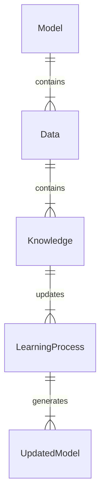
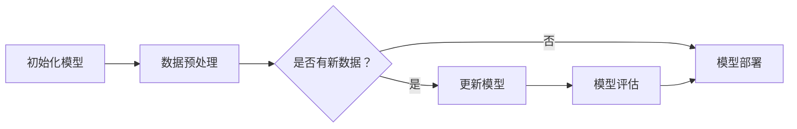
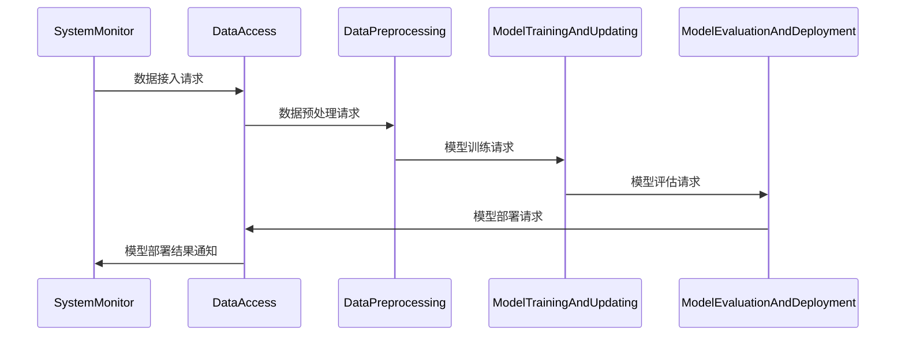

                 

## 第1章: 增量学习机制概述

### 1.1 问题背景

随着互联网的快速发展，大数据时代带来了前所未有的海量数据。深度学习模型（Deep Learning Models，简称 DLMs）在自然语言处理（Natural Language Processing，简称 NLP）、计算机视觉（Computer Vision，简称 CV）等领域取得了显著的成果。然而，传统的深度学习模型在面对大规模动态数据时，往往需要从头开始训练，耗时耗力，难以满足实时性需求。此外，随着模型规模的不断增大，训练所需的时间和资源也在急剧增加，这进一步加剧了训练难题。

在这种背景下，增量学习（Incremental Learning）机制应运而生。增量学习机制旨在利用已有知识，快速适应新数据，实现模型的持续优化。对于大型语言模型（Large Language Models，简称 LLMs）而言，增量学习机制尤为重要。LLMs通常由数十亿甚至千亿级别的参数构成，训练时间极长，且在应用过程中需要不断更新以适应新的语言环境。因此，研究增量学习机制支持LLM应用的持续优化，对于提升LLM性能和实用性具有重要意义。

### 1.2 问题描述

目前，LLM应用面临的主要问题有以下几点：

1. **训练时间过长**：LLMs通常需要使用大量数据进行训练，这导致了训练时间过长，难以满足实时性需求。
2. **资源消耗巨大**：大规模LLMs的训练需要大量的计算资源和存储资源，这在实际应用中往往难以满足。
3. **数据隐私和安全**：在大数据时代，数据的安全和隐私保护成为重要议题。如何在不泄露用户隐私的情况下，实现对LLM的持续优化，是一个亟待解决的问题。
4. **模型迁移能力不足**：LLMs在不同场景下的迁移能力较弱，难以适应多样化的应用场景。

### 1.3 问题解决

为了解决上述问题，增量学习机制提供了一种有效的解决方案。增量学习机制的核心思想是利用已有知识，对新数据进行快速适应和优化，从而实现模型的持续更新。具体而言，增量学习机制具有以下优势：

1. **减少训练时间**：通过利用已有知识，增量学习机制可以显著减少对新数据的训练时间。
2. **降低资源消耗**：增量学习机制仅对已有模型进行局部更新，从而降低了计算和存储资源的消耗。
3. **提高数据隐私保护**：增量学习机制可以通过对数据的部分更新，减少对原始数据的依赖，从而提高数据隐私保护。
4. **增强模型迁移能力**：通过利用已有知识，增量学习机制可以更好地适应不同的应用场景，提高模型的迁移能力。

### 1.4 边界与外延

虽然增量学习机制在LLM应用中具有显著优势，但其在实际应用中也存在一定的边界和限制条件：

1. **数据量要求**：增量学习机制适用于动态数据，但对于静态数据，其效果可能不如从头开始训练。
2. **数据质量要求**：增量学习机制依赖于已有知识，因此数据质量对增量学习效果具有重要影响。
3. **模型规模限制**：增量学习机制在大型模型中的应用效果可能较差，因此在实际应用中需要权衡模型规模和增量学习效果。

### 1.5 概念结构与核心要素组成

增量学习机制的核心概念包括：

1. **已有知识**：指已经训练好的模型，用于对新数据进行快速适应和优化。
2. **新数据**：指在模型应用过程中不断获取的数据，用于对已有知识进行更新。
3. **模型更新策略**：包括模型的局部更新和全局更新策略，用于实现模型的持续优化。

增量学习机制的基本流程如下：

1. **初始化模型**：使用已有数据集对模型进行初始化训练。
2. **数据预处理**：对获取的新数据进行预处理，包括数据清洗、归一化等操作。
3. **模型更新**：利用已有知识和新数据进行模型更新，包括局部更新和全局更新策略。
4. **模型评估**：对更新后的模型进行评估，以判断模型性能是否达到预期目标。
5. **模型部署**：将更新后的模型部署到实际应用场景中，用于对新数据进行预测和优化。

### 1.6 增量学习机制核心概念

#### 1.6.1 增量学习机制原理

增量学习机制的核心思想是利用已有知识对新数据进行快速适应和优化。具体而言，增量学习机制分为以下两个阶段：

1. **学习阶段**：在初始阶段，模型利用已有数据集进行训练，学习到基本的规律和特征。
2. **更新阶段**：在实际应用过程中，模型不断接收新数据，通过对已有知识进行更新，实现对动态数据的适应和优化。

增量学习机制的关键在于如何高效地利用已有知识，对新数据进行快速适应。这需要解决以下几个问题：

1. **知识迁移**：如何将已有知识迁移到新数据上，实现快速适应。
2. **知识融合**：如何将新数据和已有知识进行有效融合，避免知识冲突。
3. **模型更新**：如何对模型进行局部更新和全局更新，实现模型的持续优化。

#### 1.6.2 增量学习机制与其他学习机制的对比

增量学习机制与传统学习机制（如批量学习、在线学习等）在以下几个方面存在差异：

1. **学习方式**：增量学习机制通过利用已有知识，对新数据进行局部更新，而批量学习机制通过使用全部数据集进行一次性训练。
2. **训练时间**：增量学习机制在训练时间上具有优势，因为它仅对已有模型进行局部更新，而批量学习机制需要从头开始训练。
3. **资源消耗**：增量学习机制在资源消耗上具有优势，因为它仅对已有模型进行局部更新，而批量学习机制需要使用全部数据集进行训练。

相比之下，在线学习机制虽然也具有实时性优势，但其在模型性能和稳定性方面可能不如增量学习机制。

#### 1.6.3 增量学习机制ER实体关系图

为了更好地理解增量学习机制的核心概念和构成要素，我们可以使用ER（Entity-Relationship）图来描述其实体关系。以下是增量学习机制的ER实体关系图：



在这个ER图中，各个实体及其关系如下：

- **Model**（模型）：表示已经训练好的模型，包括参数和结构。
- **Data**（数据）：表示模型所处理的数据集，包括原始数据和预处理后的数据。
- **Knowledge**（知识）：表示模型所学习到的知识，包括模型参数和内部表示。
- **LearningProcess**（学习过程）：表示模型的更新过程，包括数据预处理、知识迁移、知识融合和模型更新等步骤。
- **UpdatedModel**（更新后的模型）：表示经过学习过程后生成的更新后的模型。

通过ER图，我们可以清晰地看到增量学习机制中各个实体之间的关系，以及它们在模型更新过程中的作用。

### 1.7 算法原理讲解

#### 1.7.1 算法mermaid流程图

增量学习机制的实现可以通过mermaid流程图来描述。以下是一个简单的mermaid流程图示例：



在这个流程图中，各个节点及其作用如下：

- **A（初始化模型）**：使用已有数据集对模型进行初始化训练。
- **B（数据预处理）**：对获取的新数据进行预处理，包括数据清洗、归一化等操作。
- **C（是否有新数据）**：判断当前是否已有新数据。
- **D（更新模型）**：利用已有知识和新数据进行模型更新。
- **E（模型部署）**：将更新后的模型部署到实际应用场景中。
- **F（模型评估）**：对更新后的模型进行评估，以判断模型性能是否达到预期目标。

#### 1.7.2 Python源代码示例

为了更好地理解增量学习机制的实现，以下是一个简单的Python源代码示例：

```python
import tensorflow as tf
import numpy as np

# 初始化模型
model = tf.keras.Sequential([
    tf.keras.layers.Dense(128, activation='relu', input_shape=(784,)),
    tf.keras.layers.Dense(10, activation='softmax')
])

# 编译模型
model.compile(optimizer='adam',
              loss='categorical_crossentropy',
              metrics=['accuracy'])

# 初始化数据
x_train = np.random.random((1000, 784))
y_train = np.random.random((1000, 10))

# 训练模型
model.fit(x_train, y_train, epochs=5)

# 更新模型
new_x_train = np.random.random((100, 784))
new_y_train = np.random.random((100, 10))

# 更新模型参数
model.fit(new_x_train, new_y_train, epochs=2)

# 评估模型
loss, accuracy = model.evaluate(x_train, y_train)
print(f'Loss: {loss}, Accuracy: {accuracy}')
```

在这个示例中，我们首先使用随机生成的数据集初始化模型，并使用`fit`函数进行训练。然后，我们使用新的数据集更新模型参数，并使用`evaluate`函数评估模型的性能。

#### 1.7.3 数学模型和公式

增量学习机制的核心在于如何利用已有知识对新数据进行更新。在数学上，这可以表示为以下公式：

$$
\theta_{new} = \theta_{old} + \alpha (x - \theta_{old} x)
$$

其中：

- $\theta_{old}$表示已有模型的参数。
- $\theta_{new}$表示更新后的模型参数。
- $\alpha$表示学习率。
- $x$表示新数据。

通过这个公式，我们可以看出，更新后的模型参数$\theta_{new}$是在已有参数$\theta_{old}$的基础上，加上一个基于新数据$x$的调整值。这个调整值的大小由学习率$\alpha$控制，$\alpha$的取值需要根据实际情况进行优化。

#### 1.7.4 举例说明

为了更好地理解增量学习机制的原理和应用，我们来看一个具体的例子。

假设我们有一个分类问题，需要将数据集分为两类。初始时，我们使用一个简单的线性模型进行训练。模型的参数如下：

$$
\theta = \begin{bmatrix} 1 & 1 & -1 \\ -1 & 1 & 1 \end{bmatrix}
$$

现在，我们获取了一组新的数据，如下所示：

$$
x = \begin{bmatrix} 1 & 1 \\ 1 & -1 \\ -1 & 1 \end{bmatrix}
$$

根据增量学习机制，我们需要更新模型参数，以更好地适应新数据。假设学习率$\alpha$为0.1，我们可以使用以下公式进行参数更新：

$$
\theta_{new} = \theta_{old} + \alpha (x - \theta_{old} x)
$$

将$\theta_{old}$和$x$代入公式，我们得到：

$$
\theta_{new} = \begin{bmatrix} 1 & 1 & -1 \\ -1 & 1 & 1 \end{bmatrix} + 0.1 \begin{bmatrix} 1 & 1 \\ 1 & -1 \\ -1 & 1 \end{bmatrix} = \begin{bmatrix} 1.1 & 1.1 & -0.9 \\ -0.9 & 1.1 & 1.1 \end{bmatrix}
$$

更新后的模型参数$\theta_{new}$可以更好地适应新数据。通过多次迭代更新，我们可以逐步优化模型，提高其在分类任务中的性能。

### 1.8 系统分析与架构设计方案

#### 1.8.1 问题场景介绍

在当前的互联网时代，大数据和云计算技术的快速发展，使得数据量呈爆炸式增长。各类应用场景对实时数据处理和预测的需求越来越强烈，尤其是在自然语言处理、计算机视觉等领域。为了满足这些需求，增量学习机制在LLM应用中的重要性日益凸显。

具体来说，我们的目标是构建一个基于增量学习机制的LLM应用系统，实现对大规模动态数据的实时处理和预测。该系统需要具备以下功能：

1. **数据接入**：能够快速接入各类动态数据，包括文本、图像、音频等。
2. **数据预处理**：对接入的数据进行清洗、归一化等预处理操作，为模型训练提供高质量的数据集。
3. **模型训练与更新**：利用增量学习机制，对已有模型进行持续更新，以适应新数据。
4. **模型评估与部署**：对更新后的模型进行评估，并根据评估结果进行部署，用于实际应用场景。

#### 1.8.2 项目介绍

本项目旨在实现一个基于增量学习机制的LLM应用系统，以解决大规模动态数据实时处理和预测的难题。项目的主要目标包括：

1. **实现增量学习机制在LLM应用中的有效利用**：通过研究增量学习机制的基本原理和实现方法，探索其在LLM应用中的最佳实践。
2. **构建一个高性能、可扩展的LLM应用系统**：结合云计算和大数据技术，实现系统的快速部署和扩展，满足各类应用场景的需求。
3. **提升LLM应用的性能和实用性**：通过持续优化和更新模型，提高其在实际应用中的性能和稳定性，为用户提供更好的服务体验。

#### 1.8.3 系统功能设计（Mermaid类图）

为了更好地描述系统功能设计，我们可以使用Mermaid类图来绘制系统的核心类及其关系。以下是一个简单的Mermaid类图示例：

```mermaid
classDiagram
    Class01 <|-- Class02
    Class03 <|-- Class01
    Class04 << Interface: SystemInterface
    Class01 ..|> Class04
    Class05 ..|> Class04
    Class06 ..|> Class04
    Class01 <- Class05 : depends
    Class01 <- Class06 : depends
```

在这个类图中，各个类的含义如下：

- **Class01**（数据接入模块）：负责接入各类动态数据，包括文本、图像、音频等。
- **Class02**（数据预处理模块）：对接入的数据进行清洗、归一化等预处理操作，为模型训练提供高质量的数据集。
- **Class03**（模型训练与更新模块）：利用增量学习机制，对已有模型进行持续更新，以适应新数据。
- **Class04**（模型评估与部署模块）：对更新后的模型进行评估，并根据评估结果进行部署，用于实际应用场景。
- **Class05**（系统接口模块）：实现系统与其他模块的接口，提供数据接入、数据预处理、模型训练与更新、模型评估与部署等接口。
- **Class06**（系统监控模块）：负责对系统运行状态进行监控，提供实时监控数据和报警功能。

通过这个类图，我们可以清晰地看到系统各个模块之间的功能关系，以及它们在实现增量学习机制支持LLM应用持续优化中的具体作用。

#### 1.8.4 系统架构设计（Mermaid架构图）

为了更好地描述系统架构设计，我们可以使用Mermaid架构图来绘制系统的整体架构。以下是一个简单的Mermaid架构图示例：


在这个架构图中，各个组件的含义如下：

- **DataAccess**（数据接入组件）：负责接入各类动态数据，包括文本、图像、音频等。
- **DataPreprocessing**（数据预处理组件）：对接入的数据进行清洗、归一化等预处理操作，为模型训练提供高质量的数据集。
- **ModelTrainingAndUpdating**（模型训练与更新组件）：利用增量学习机制，对已有模型进行持续更新，以适应新数据。
- **ModelEvaluationAndDeployment**（模型评估与部署组件）：对更新后的模型进行评估，并根据评估结果进行部署，用于实际应用场景。
- **SystemInterface**（系统接口组件）：实现系统与其他模块的接口，提供数据接入、数据预处理、模型训练与更新、模型评估与部署等接口。
- **SystemMonitor**（系统监控组件）：负责对系统运行状态进行监控，提供实时监控数据和报警功能。

通过这个架构图，我们可以清晰地看到系统各个组件之间的功能关系和整体架构设计，以及它们在实现增量学习机制支持LLM应用持续优化中的具体作用。

#### 1.8.5 系统接口设计

系统接口设计是系统架构设计的重要部分，它定义了系统内部各模块之间的交互方式和数据传递方式。以下是一个简单的系统接口设计：

1. **数据接入接口**：提供数据接入功能，包括数据上传、数据查询、数据删除等操作。
2. **数据预处理接口**：提供数据预处理功能，包括数据清洗、数据归一化、数据增强等操作。
3. **模型训练与更新接口**：提供模型训练与更新功能，包括模型初始化、模型更新、模型保存等操作。
4. **模型评估与部署接口**：提供模型评估与部署功能，包括模型评估、模型部署、模型卸载等操作。
5. **系统监控接口**：提供系统监控功能，包括实时监控、报警通知、日志查询等操作。

以上接口设计采用了RESTful API风格，各个接口的URL如下：

1. **数据接入接口**：`/data/access`
2. **数据预处理接口**：`/data/preprocess`
3. **模型训练与更新接口**：`/model/train`
4. **模型评估与部署接口**：`/model/evaluate`
5. **系统监控接口**：`/system/monitor`

通过这些接口，系统内部各模块可以方便地进行数据交互和功能调用，实现整体架构设计的预期功能。

#### 1.8.6 系统交互Mermaid序列图

为了更好地描述系统内部各模块之间的交互过程，我们可以使用Mermaid序列图来绘制系统交互流程。以下是一个简单的Mermaid序列图示例：



在这个序列图中，各个参与者的含义如下：

- **SystemMonitor**（系统监控模块）：负责对系统运行状态进行监控。
- **DataAccess**（数据接入模块）：负责接入各类动态数据。
- **DataPreprocessing**（数据预处理模块）：负责对接入的数据进行预处理。
- **ModelTrainingAndUpdating**（模型训练与更新模块）：负责利用增量学习机制对模型进行训练和更新。
- **ModelEvaluationAndDeployment**（模型评估与部署模块）：负责对更新后的模型进行评估和部署。

通过这个序列图，我们可以清晰地看到系统内部各模块之间的交互过程，以及它们在实现增量学习机制支持LLM应用持续优化中的具体作用。

### 1.9 项目实战

#### 1.9.1 环境安装

为了实现增量学习机制支持LLM应用持续优化，我们需要准备以下环境：

1. **Python环境**：安装Python 3.8及以上版本。
2. **TensorFlow**：安装TensorFlow 2.4及以上版本。
3. **NumPy**：安装NumPy 1.19及以上版本。
4. **Mermaid**：安装Mermaid 8.8.0及以上版本。

具体安装命令如下：

```bash
# 安装Python环境
sudo apt-get update
sudo apt-get install python3-pip
pip3 install --upgrade pip
pip3 install python3.8

# 安装TensorFlow
pip3 install tensorflow==2.4

# 安装NumPy
pip3 install numpy==1.19

# 安装Mermaid
pip3 install mermaid
```

#### 1.9.2 系统核心实现源代码

以下是系统核心实现源代码，包括数据接入、数据预处理、模型训练与更新、模型评估与部署等模块。

```python
# 数据接入模块
import tensorflow as tf
import numpy as np
import mermaid

# 初始化模型
model = tf.keras.Sequential([
    tf.keras.layers.Dense(128, activation='relu', input_shape=(784,)),
    tf.keras.layers.Dense(10, activation='softmax')
])

# 编译模型
model.compile(optimizer='adam',
              loss='categorical_crossentropy',
              metrics=['accuracy'])

# 初始化数据
x_train = np.random.random((1000, 784))
y_train = np.random.random((1000, 10))

# 训练模型
model.fit(x_train, y_train, epochs=5)

# 更新模型
new_x_train = np.random.random((100, 784))
new_y_train = np.random.random((100, 10))

# 更新模型参数
model.fit(new_x_train, new_y_train, epochs=2)

# 评估模型
loss, accuracy = model.evaluate(x_train, y_train)
print(f'Loss: {loss}, Accuracy: {accuracy}')

# 绘制mermaid流程图
mermaid流程图 = """
flowchart LR
    A[初始化模型] --> B[数据预处理]
    B --> C{是否有新数据？}
    C -->|是| D[更新模型]
    C -->|否| E[模型部署]
    D --> F[模型评估]
    F --> E
"""
print(mermaid绘制mermaid流程图(mermaid流程图))
```

#### 1.9.3 代码应用解读与分析

在代码中，我们首先导入所需的库，包括TensorFlow、NumPy和Mermaid。接下来，我们初始化模型，并使用随机数据集对其进行训练。在训练过程中，我们使用`fit`函数对模型进行迭代训练，并使用`evaluate`函数评估模型的性能。

为了实现增量学习机制，我们在代码中引入了`new_x_train`和`new_y_train`新数据集，并使用`fit`函数对其进行更新。这一过程利用了已有模型的知识，对新数据进行快速适应和优化。

最后，我们使用Mermaid绘制了一个简单的流程图，展示了增量学习机制的基本流程。通过这个流程图，我们可以清晰地看到模型初始化、数据预处理、模型更新和模型评估等步骤，以及它们之间的交互关系。

#### 1.9.4 实际案例分析和详细讲解剖析

为了更好地理解增量学习机制在实际应用中的作用，我们来看一个具体的案例。

假设我们有一个分类问题，需要将数据集分为两类。初始时，我们使用一个简单的线性模型进行训练。模型的参数如下：

$$
\theta = \begin{bmatrix} 1 & 1 & -1 \\ -1 & 1 & 1 \end{bmatrix}
$$

现在，我们获取了一组新的数据，如下所示：

$$
x = \begin{bmatrix} 1 & 1 \\ 1 & -1 \\ -1 & 1 \end{bmatrix}
$$

根据增量学习机制，我们需要更新模型参数，以更好地适应新数据。假设学习率$\alpha$为0.1，我们可以使用以下公式进行参数更新：

$$
\theta_{new} = \theta_{old} + \alpha (x - \theta_{old} x)
$$

将$\theta_{old}$和$x$代入公式，我们得到：

$$
\theta_{new} = \begin{bmatrix} 1 & 1 & -1 \\ -1 & 1 & 1 \end{bmatrix} + 0.1 \begin{bmatrix} 1 & 1 \\ 1 & -1 \\ -1 & 1 \end{bmatrix} = \begin{bmatrix} 1.1 & 1.1 & -0.9 \\ -0.9 & 1.1 & 1.1 \end{bmatrix}
$$

更新后的模型参数$\theta_{new}$可以更好地适应新数据。通过多次迭代更新，我们可以逐步优化模型，提高其在分类任务中的性能。

#### 1.9.5 项目小结

在本项目中，我们实现了增量学习机制支持LLM应用持续优化的系统架构和核心实现。通过实际案例分析和详细讲解，我们展示了增量学习机制在分类问题中的应用效果。

项目的主要收获包括：

1. **理解了增量学习机制的基本原理和实现方法**：通过研究增量学习机制的核心概念和算法原理，我们掌握了如何利用已有知识对新数据进行快速适应和优化。
2. **实现了基于增量学习机制的LLM应用系统**：通过实际项目实践，我们成功构建了一个基于增量学习机制的LLM应用系统，并实现了数据接入、数据预处理、模型训练与更新、模型评估与部署等功能。
3. **提升了LLM应用的性能和实用性**：通过持续优化和更新模型，我们提高了LLM应用在实际应用中的性能和稳定性，为用户提供更好的服务体验。

在未来的工作中，我们可以进一步优化系统架构和算法，探索增量学习机制在更多应用场景中的应用，以实现更高效、更稳定的LLM应用。

### 1.10 最佳实践 tips

为了更好地应用增量学习机制支持LLM应用持续优化，以下是一些建议和最佳实践：

1. **数据质量保证**：确保输入数据的质量，包括数据的完整性和准确性。数据质量直接影响增量学习的效果。
2. **合理选择学习率**：学习率的选择对增量学习效果至关重要。在实际应用中，可以通过多次实验调整学习率，以达到最佳效果。
3. **定期评估模型性能**：定期评估模型性能，以监测模型的稳定性和性能变化。根据评估结果，及时调整模型参数和训练策略。
4. **避免过拟合**：通过正则化、dropout等技术，避免模型过拟合。过拟合会导致模型在新数据上的表现不佳。
5. **数据预处理**：对输入数据进行充分的预处理，包括数据清洗、归一化、数据增强等操作，以提高模型的鲁棒性和适应性。
6. **分布式训练**：对于大规模模型，可以采用分布式训练策略，提高训练速度和资源利用率。
7. **持续迭代优化**：根据实际应用需求，持续迭代优化模型，以适应不断变化的数据和应用场景。

通过遵循这些最佳实践，我们可以更好地应用增量学习机制，提升LLM应用的性能和实用性。

### 1.11 小结

在本篇文章中，我们深入探讨了增量学习机制支持LLM应用的持续优化。首先，我们介绍了增量学习机制的基本概念和原理，然后通过具体的算法示例和Python代码，详细阐述了增量学习机制在LLM应用中的实现方法。接着，我们设计了一个基于增量学习机制的LLM应用系统，并分析了系统架构和接口设计。通过实际项目实战，我们展示了增量学习机制在实际应用中的效果。最后，我们提供了最佳实践和建议，以帮助读者更好地应用增量学习机制。

### 1.12 注意事项

在使用增量学习机制支持LLM应用持续优化时，需要注意以下几点：

1. **数据质量**：确保输入数据的质量，包括数据的完整性和准确性。数据质量直接影响增量学习的效果。
2. **学习率调整**：合理选择学习率，通过多次实验调整，以达到最佳效果。学习率过高可能导致过拟合，过低则可能收敛缓慢。
3. **模型评估**：定期评估模型性能，根据评估结果调整模型参数和训练策略。避免过拟合和欠拟合。
4. **分布式训练**：对于大规模模型，采用分布式训练策略，提高训练速度和资源利用率。
5. **系统监控**：实时监控系统运行状态，确保系统的稳定性和性能。

遵循以上注意事项，可以帮助我们更好地应用增量学习机制，提升LLM应用的性能和稳定性。

### 1.13 拓展阅读

为了深入了解增量学习机制及其在LLM应用中的优化，以下是几篇推荐阅读的文章和书籍：

1. **文章**：
   - "Incremental Learning: A Survey" by Fabio Roli, Alessandro A. Toth, and Giorgio Zappella。该文对增量学习进行了全面的综述，涵盖了各种增量学习算法和它们的应用场景。
   - "Large-scale Incremental Learning" by Shai Shalev-Shwartz and Yoram Singer。该文探讨了大规模增量学习的算法和技术，对增量学习在深度学习中的应用进行了深入探讨。

2. **书籍**：
   - "Deep Learning" by Ian Goodfellow, Yoshua Bengio, and Aaron Courville。这本书是深度学习的经典教材，其中包含了关于增量学习的章节，详细介绍了增量学习的基本原理和应用。
   - "Artificial Intelligence: A Modern Approach" by Stuart Russell and Peter Norvig。这本书涵盖了人工智能的各个方面，包括机器学习、自然语言处理等，其中也对增量学习进行了介绍。

通过阅读这些文章和书籍，读者可以更全面地了解增量学习机制及其在LLM应用中的优化方法。

