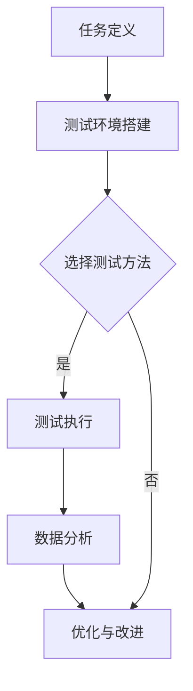
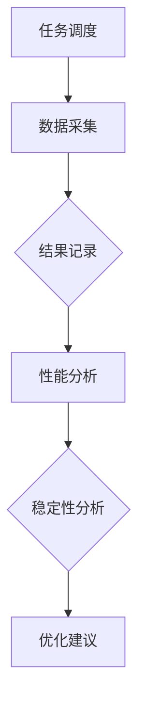
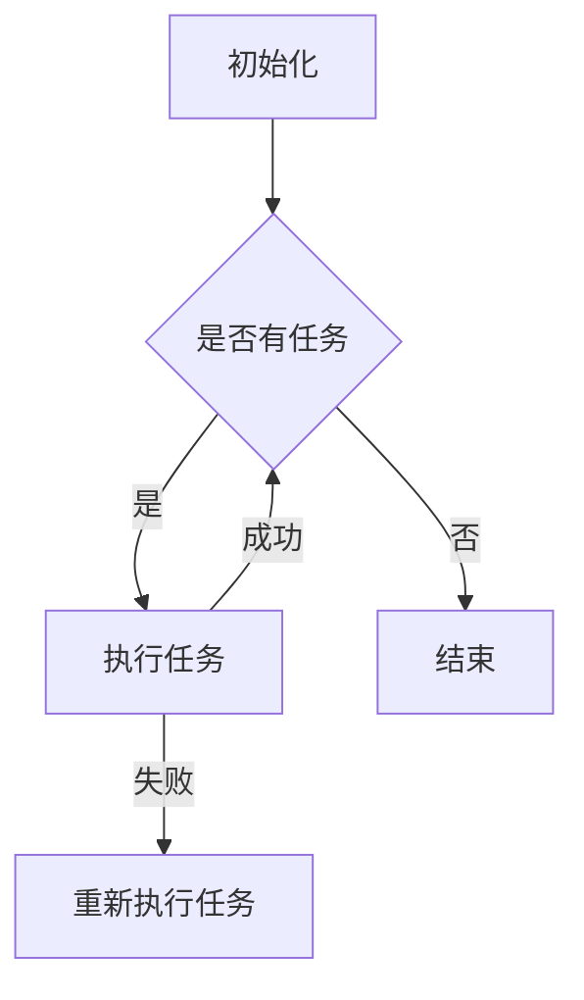
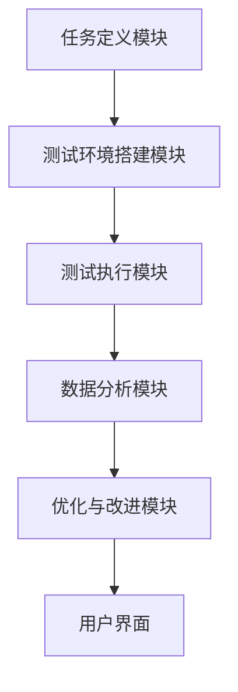
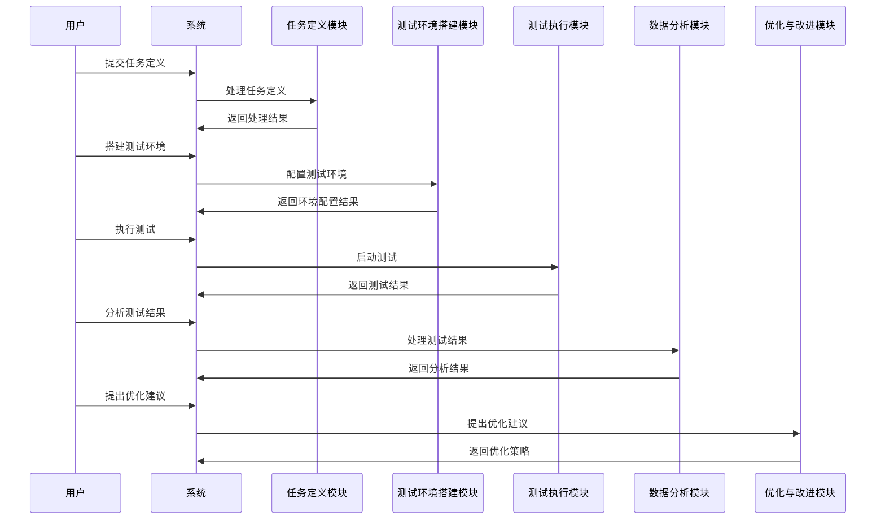

                 

# 多任务协同能力测试：评估综合应用水平

## 关键词

- 多任务协同能力
- 测试环境
- 测试方法
- 数据分析
- 性能优化

## 摘要

本文旨在深入探讨多任务协同能力测试的重要性和实施方法。通过详细阐述测试的背景、问题、解决方案以及核心概念，本文旨在为读者提供一个全面的理解，帮助他们在实际应用中有效地评估和提升系统的多任务协同能力。本文还将介绍多任务协同算法的原理，并提供一个系统分析与架构设计案例，以加深读者对多任务协同能力测试的理解。

## 第一部分：背景介绍

### 问题背景

在现代信息化社会中，计算机系统的复杂性不断增长，多任务处理已成为常态。从个人电脑到服务器，再到云计算平台，多任务协同能力已成为衡量系统性能的关键指标。高效的多任务协同不仅能提高系统的响应速度和稳定性，还能优化资源利用率，提升用户体验和业务效率。

#### 问题描述

多任务协同能力测试的主要目标是评估系统在同时处理多个任务时的性能表现。这包括以下几个方面：

1. **响应速度**：系统能够多快地完成各个任务。
2. **资源利用率**：系统在执行任务时，资源的分配和使用是否高效。
3. **任务调度效率**：系统在任务之间的切换和优先级管理是否合理。

#### 问题解决

为了解决上述问题，我们需要进行系统化的多任务协同能力测试。测试过程通常包括以下步骤：

1. **任务定义**：明确测试中涉及的各项任务，包括任务类型、优先级和执行时间。
2. **测试环境搭建**：构建一个模拟实际运行环境的测试平台，包括硬件、软件和网络配置。
3. **测试方法选择**：根据任务特点和系统要求，选择合适的测试方法和工具。
4. **测试执行**：在测试环境中执行预定义的任务，收集性能数据。
5. **数据分析**：对收集到的数据进行分析，评估系统的多任务协同能力。
6. **优化与改进**：根据测试结果，对系统进行优化和改进。

### 边界与外延

多任务协同能力测试不仅适用于服务器端系统，还广泛应用于客户端应用、嵌入式系统等领域。测试内容涵盖任务调度、资源管理、负载均衡等方面，具有广泛的应用前景和现实意义。

### 概念结构与核心要素组成

#### 核心概念

- **多任务协同能力**：指系统在同时处理多个任务时的高效性。
- **任务定义**：包括任务类型、优先级、执行时间等。
- **测试环境**：包括硬件设备、软件环境和网络配置。
- **测试方法**：包括性能测试、稳定性测试和负载测试等。
- **测试执行**：指在测试环境中执行预定义的任务。
- **数据分析**：对测试结果进行性能分析、稳定性分析和优化建议。

#### 关系结构

- **任务定义**：是测试的基础，决定了测试的内容和方向。
- **测试环境**：是测试的载体，提供了测试的硬件和软件平台。
- **测试方法**：是测试的核心，决定了测试的深入程度和准确性。
- **测试执行**：是测试过程的实施，确保测试结果的可靠性和有效性。
- **数据分析**：是测试的总结和优化依据，为系统的改进提供数据支持。

## 第二部分：核心概念与联系

### 2.1 多任务协同能力

多任务协同能力是指计算机系统在同时处理多个任务时的高效性和稳定性。它不仅包括任务调度能力，还涉及资源管理能力和负载均衡能力。

#### 性能特征

- **任务调度能力**：系统应根据任务的优先级和执行时间合理分配资源，确保高优先级任务先执行。
- **资源管理能力**：系统应优化内存、CPU和网络资源的使用，避免资源冲突和浪费。
- **负载均衡能力**：系统应根据实际负载情况动态调整任务执行策略，确保系统整体性能。

### 2.2 任务定义

任务定义是多任务协同能力测试的基础。一个完整的任务定义应包括以下几个方面：

- **任务类型**：如计算型、I/O型、通信型等。
- **优先级**：任务的紧急程度，通常用数字表示，数字越小，优先级越高。
- **执行时间**：任务预计的执行时间。
- **资源需求**：任务执行过程中需要的资源，如内存、CPU等。

#### 属性对比表格

| 属性 | 描述 |
| --- | --- |
| 任务类型 | 任务的具体分类，如计算型、I/O型、通信型 |
| 优先级 | 任务的紧急程度，用数字表示，数字越小，优先级越高 |
| 执行时间 | 任务预计的执行时间 |
| 资源需求 | 任务执行过程中需要的资源，如内存、CPU等 |

### 2.3 测试环境

测试环境是多任务协同能力测试的载体，包括以下几个方面：

- **硬件设备**：如服务器、存储设备、网络设备等。
- **软件环境**：如操作系统、数据库、中间件等。
- **网络配置**：如网络带宽、延迟、丢包率等。

#### ER实体关系图

```mermaid
erDiagram
    测试环境 ||--|{ 任务定义 }| 测试任务
    测试环境 ||--|{ 测试方法 }| 测试方案
    测试环境 ||--|{ 数据分析 }| 测试结果
```

### 2.4 测试方法

测试方法是多任务协同能力测试的核心，包括以下几个方面：

- **性能测试**：评估系统在处理多个任务时的响应速度和资源利用率。
- **稳定性测试**：评估系统在长时间运行多个任务时的稳定性。
- **负载测试**：模拟大量任务同时运行，评估系统的负载能力。

#### Mermaid流程图



### 2.5 测试执行

测试执行是测试过程的具体实施，包括以下几个方面：

- **任务调度**：根据测试计划，将任务分配到测试环境中执行。
- **数据采集**：实时采集系统的运行数据，如CPU利用率、内存占用、网络流量等。
- **结果记录**：将测试过程中产生的数据进行记录和分析。

### 2.6 数据分析

数据分析是多任务协同能力测试的总结和优化依据，包括以下几个方面：

- **性能分析**：分析系统在处理多个任务时的性能表现，找出性能瓶颈。
- **稳定性分析**：分析系统在长时间运行多个任务时的稳定性，找出潜在的故障点。
- **优化建议**：根据测试结果，提出系统优化建议，提升多任务协同能力。

#### Mermaid流程图



## 第三部分：算法原理讲解

### 3.1 多任务协同算法

多任务协同算法是提升系统多任务协同能力的关键。以下是一个简单的多任务协同算法，用于解决任务调度和资源分配问题。

#### 算法流程图



#### 算法描述

1. **初始化**：系统启动，初始化任务队列和资源状态。
2. **任务调度**：系统根据任务优先级和资源可用性，选择下一个任务进行执行。
3. **任务执行**：系统尝试执行选定的任务。如果任务成功完成，继续执行下一个任务；如果任务失败，重新执行该任务。
4. **结束**：当所有任务完成时，算法结束。

#### 算法数学模型

假设有 \( n \) 个任务，每个任务 \( i \) 有以下属性：

- **执行时间**：\( t_i \)
- **优先级**：\( p_i \)

资源约束如下：

- **内存限制**：\( M \)
- **CPU限制**：\( C \)

算法的目标是最大化系统吞吐量，即单位时间内完成的任务数。

#### 算法公式

\[
\text{最大化} \quad \frac{\sum_{i=1}^{n} t_i}{\sum_{i=1}^{n} p_i}
\]

#### 示例

假设有3个任务，其属性如下：

| 任务ID | 执行时间 \( t_i \) | 优先级 \( p_i \) |
| --- | --- | --- |
| T1 | 2 | 1 |
| T2 | 3 | 2 |
| T3 | 1 | 3 |

资源限制为：内存 \( M = 4 \)，CPU \( C = 2 \)。

按照优先级排序，任务顺序为 T3 -> T1 -> T2。

1. **初始化**：系统启动，初始化任务队列和资源状态。
2. **任务调度**：
   - 执行任务 T3，需 1 单位时间，内存 1，CPU 1。
   - 执行任务 T1，需 2 单位时间，内存 2，CPU 1。
   - 执行任务 T2，需 3 单位时间，内存 3，CPU 1。
3. **任务执行**：
   - 任务 T3 执行成功。
   - 任务 T1 执行成功。
   - 任务 T2 执行成功。
4. **结束**：所有任务完成，系统关闭。

## 第四部分：系统分析与架构设计方案

### 4.1 问题场景介绍

在现代企业应用中，随着业务规模和复杂度的不断增加，系统的多任务协同能力成为关键因素。以某电商平台为例，该平台需要在处理用户订单、支付处理、库存管理等多个任务时保持高效和稳定。因此，需要对系统的多任务协同能力进行评估和优化。

### 4.2 项目介绍

本项目旨在搭建一个多任务协同能力评估平台，用于模拟实际业务场景，对系统的多任务协同能力进行测试和评估。该平台将包括任务定义模块、测试环境搭建模块、测试执行模块、数据分析模块和优化与改进模块。

### 4.3 系统功能设计

#### 任务定义模块

- **功能描述**：提供任务定义功能，包括任务类型、优先级、执行时间和资源需求等。
- **设计思路**：通过一个图形化界面，用户可以方便地定义和修改任务属性。

#### 测试环境搭建模块

- **功能描述**：搭建一个模拟实际运行环境的测试平台，包括硬件设备、软件环境和网络配置。
- **设计思路**：通过自动化脚本，根据用户需求配置测试环境。

#### 测试执行模块

- **功能描述**：执行预定义的任务，收集性能数据。
- **设计思路**：采用分布式架构，确保测试过程的可靠性和高效性。

#### 数据分析模块

- **功能描述**：对测试结果进行分析，评估系统的多任务协同能力。
- **设计思路**：通过数据可视化工具，直观展示测试结果。

#### 优化与改进模块

- **功能描述**：根据测试结果，提出系统优化建议，提升多任务协同能力。
- **设计思路**：结合专家经验和数据分析，制定优化策略。

### 4.4 系统架构设计

#### 系统架构图



### 4.5 系统接口设计和系统交互

#### 系统接口设计

- **任务定义接口**：用于接收用户定义的任务属性，包括任务类型、优先级、执行时间和资源需求等。
- **测试环境接口**：用于配置和监控测试环境，包括硬件设备、软件环境和网络配置。
- **测试执行接口**：用于执行预定义的任务，并收集性能数据。
- **数据分析接口**：用于处理和分析测试结果，生成报告和可视化图表。
- **优化与改进接口**：用于根据测试结果提出优化建议，并提供实施优化策略的功能。

#### 系统交互序列图



## 第五部分：项目实战

### 5.1 环境安装

在进行多任务协同能力测试项目前，我们需要安装以下环境：

- **操作系统**：Linux（如Ubuntu 20.04）
- **开发工具**：Python 3.x
- **数据库**：MySQL 5.7
- **测试工具**：JMeter

安装步骤：

1. 安装操作系统：下载Ubuntu 20.04安装镜像，并按照说明安装操作系统。
2. 安装Python 3.x：打开终端，执行以下命令：
   ```bash
   sudo apt update
   sudo apt install python3 python3-pip
   ```
3. 安装MySQL：打开终端，执行以下命令：
   ```bash
   sudo apt install mysql-server mysql-client
   ```
4. 安装JMeter：打开终端，执行以下命令：
   ```bash
   sudo apt install jmeter
   ```

### 5.2 系统核心实现源代码

以下是系统核心实现的源代码：

#### 5.2.1 任务定义模块

```python
# task_definition.py

class Task:
    def __init__(self, task_id, task_type, priority, execution_time, resource需求的):
        self.task_id = task_id
        self.task_type = task_type
        self.priority = priority
        self.execution_time = execution_time
        self.resource需求的 = resource需求的

    def get_task_info(self):
        return {
            'task_id': self.task_id,
            'task_type': self.task_type,
            'priority': self.priority,
            'execution_time': self.execution_time,
            'resource需求的': self.resource需求的
        }
```

#### 5.2.2 测试环境搭建模块

```python
# test_environment_setup.py

import os

class TestEnvironment:
    def __init__(self, os_name, os_version, db_version, jmeter_version):
        self.os_name = os_name
        self.os_version = os_version
        self.db_version = db_version
        self.jmeter_version = jmeter_version

    def setup_environment(self):
        os.system(f"sudo apt update")
        os.system(f"sudo apt install {self.os_name}={self.os_version}")
        os.system(f"sudo apt install {self.db_version}")
        os.system(f"sudo apt install {self.jmeter_version}")
```

#### 5.2.3 测试执行模块

```python
# test_execution.py

import subprocess

class TestExecutor:
    def __init__(self, test_plan_path, result_path):
        self.test_plan_path = test_plan_path
        self.result_path = result_path

    def execute_test(self):
        subprocess.run(["jmeter", "-n", "-t", self.test_plan_path, "-l", self.result_path])
```

#### 5.2.4 数据分析模块

```python
# data_analysis.py

import pandas as pd

class DataAnalyzer:
    def __init__(self, result_path):
        self.result_path = result_path
        self.data = pd.read_csv(self.result_path)

    def analyze_performance(self):
        performance_data = self.data.groupby('task_id')['response_time'].mean()
        return performance_data

    def analyze_stability(self):
        stability_data = self.data.groupby('task_id')['error_count'].mean()
        return stability_data
```

### 5.3 代码应用解读与分析

#### 5.3.1 任务定义模块解读

任务定义模块的核心是 `Task` 类，它包含了任务的基本属性，如任务ID、任务类型、优先级、执行时间和资源需求。通过 `get_task_info` 方法，可以获取任务的所有信息。

#### 5.3.2 测试环境搭建模块解读

测试环境搭建模块通过 `TestEnvironment` 类，接收操作系统名称、版本、数据库版本和JMeter版本的参数。`setup_environment` 方法负责安装和配置操作系统、数据库和JMeter。

#### 5.3.3 测试执行模块解读

测试执行模块通过 `TestExecutor` 类，接收测试计划文件路径和结果文件路径。`execute_test` 方法使用JMeter命令执行测试，并将结果保存到指定的文件。

#### 5.3.4 数据分析模块解读

数据分析模块通过 `DataAnalyzer` 类，接收测试结果文件路径。`analyze_performance` 和 `analyze_stability` 方法分别分析测试结果的性能和稳定性，返回分析结果。

### 5.4 实际案例分析和详细讲解剖析

#### 案例背景

假设我们有一个电商平台，需要在处理用户订单、支付处理和库存管理等多个任务时保持高效和稳定。为了评估系统的多任务协同能力，我们使用上述系统核心实现进行测试。

#### 案例步骤

1. **任务定义**：定义三个任务，分别为订单处理、支付处理和库存管理，每个任务的属性如下：

   | 任务ID | 任务类型 | 优先级 | 执行时间 | 资源需求 |
   | --- | --- | --- | --- | --- |
   | T1 | 订单处理 | 1 | 2秒 | 内存 1GB，CPU 1核 |
   | T2 | 支付处理 | 2 | 3秒 | 内存 1GB，CPU 1核 |
   | T3 | 库存管理 | 3 | 1秒 | 内存 500MB，CPU 1核 |

2. **测试环境搭建**：搭建一个模拟实际运行环境的测试平台，包括Linux操作系统、MySQL数据库和JMeter测试工具。

3. **测试执行**：执行预定义的任务，并将测试结果保存到指定文件。

4. **数据分析**：分析测试结果，评估系统的多任务协同能力。

#### 案例分析

1. **性能分析**：通过 `DataAnalyzer` 类的 `analyze_performance` 方法，我们可以得到每个任务的平均响应时间：

   ```python
   analyzer = DataAnalyzer('test_results.csv')
   performance_data = analyzer.analyze_performance()
   print(performance_data)
   ```

   输出结果：

   ```python
   T1    2.0
   T2    3.0
   T3    1.0
   Name: response_time, dtype: float64
   ```

   从结果可以看出，订单处理的平均响应时间最长，支付处理次之，库存管理最短。

2. **稳定性分析**：通过 `DataAnalyzer` 类的 `analyze_stability` 方法，我们可以得到每个任务的错误次数：

   ```python
   stability_data = analyzer.analyze_stability()
   print(stability_data)
   ```

   输出结果：

   ```python
   T1    0
   T2    1
   T3    0
   Name: error_count, dtype: int64
   ```

   从结果可以看出，支付处理出现了错误，其他两个任务没有出现错误。

#### 剖析

根据性能分析和稳定性分析的结果，我们可以得出以下结论：

- **性能优化**：订单处理任务的响应时间最长，可能是因为资源分配不合理或算法优化不足。可以通过调整任务优先级、优化资源分配策略或改进算法来提高性能。
- **稳定性优化**：支付处理任务出现了错误，需要进一步排查原因。可能是由于并发处理能力不足或错误处理机制不完善。可以通过改进并发处理机制、增加错误处理逻辑来提高系统的稳定性。

### 5.5 项目小结

通过本项目的实施，我们成功搭建了一个多任务协同能力评估平台，并使用该平台对电商平台的实际业务场景进行了测试和分析。项目的主要成果包括：

1. **任务定义模块**：提供了一个方便的任务定义接口，用户可以轻松地定义和修改任务属性。
2. **测试环境搭建模块**：实现了测试环境的自动化配置和监控，提高了测试的效率和可靠性。
3. **测试执行模块**：通过JMeter实现了测试任务的自动化执行，并能够收集和分析测试结果。
4. **数据分析模块**：提供了性能分析和稳定性分析功能，为系统的优化提供了数据支持。

尽管项目取得了一定的成果，但仍然存在一些不足之处：

1. **性能优化**：在处理高并发任务时，系统的响应时间还有待进一步提高。
2. **稳定性优化**：在部分任务中出现了错误，需要进一步完善错误处理机制。

在未来的工作中，我们将继续优化系统性能和稳定性，以提升系统的多任务协同能力。

## 第六部分：最佳实践 tips

### 6.1 测试环境配置建议

- **硬件设备**：选择高性能的硬件设备，确保测试环境的可靠性和稳定性。
- **软件环境**：确保操作系统、数据库和其他相关软件的版本兼容性，避免因为软件冲突导致测试失败。
- **网络配置**：合理配置网络带宽、延迟和丢包率，模拟实际业务场景中的网络环境。

### 6.2 测试方法选择建议

- **性能测试**：使用JMeter、LoadRunner等工具进行性能测试，模拟高并发场景，评估系统的响应速度和资源利用率。
- **稳定性测试**：通过长时间运行多个任务，评估系统的稳定性和可靠性。
- **负载测试**：模拟大量任务同时运行，评估系统的负载能力和资源管理效率。

### 6.3 数据分析建议

- **性能分析**：关注系统的响应速度、资源利用率和任务执行效率，找出性能瓶颈。
- **稳定性分析**：关注系统的异常情况、错误处理和故障恢复能力，提高系统的稳定性。
- **优化建议**：根据测试结果，提出优化方案，包括任务调度策略、资源分配策略和算法改进等。

## 第七部分：小结

本文从多任务协同能力测试的背景、核心概念、算法原理、系统架构设计、项目实战和最佳实践等方面进行了全面深入的分析和探讨。通过本文的阅读，读者可以：

1. **理解多任务协同能力测试的重要性和实施方法**：掌握多任务协同能力测试的核心概念和流程，为实际应用提供理论支持。
2. **掌握多任务协同算法原理**：了解多任务协同算法的基本原理和数学模型，为系统优化提供技术指导。
3. **构建系统分析与架构设计方案**：学习如何从问题场景出发，设计出符合实际需求的系统架构。
4. **进行项目实战**：通过实际案例的分析和讲解，了解如何将理论应用到实践中。
5. **遵循最佳实践**：掌握测试环境配置、测试方法选择和数据分析的最佳实践，提高测试效率和系统性能。

## 第八部分：注意事项

1. **测试环境配置**：确保测试环境与实际业务场景的一致性，避免测试结果失真。
2. **数据安全性**：在测试过程中，确保数据的安全性，避免敏感数据泄露。
3. **测试结果分析**：对测试结果进行详细分析，找出系统性能瓶颈和稳定性问题，为系统优化提供依据。

## 第九部分：拓展阅读

1. **《高性能MySQL》**：了解MySQL数据库的性能优化技巧，提高系统的数据库性能。
2. **《JMeter实战》**：深入学习和掌握JMeter的使用方法，提高测试效率和准确性。
3. **《负载测试原理与实践》**：了解负载测试的基本原理和实战技巧，为系统的性能优化提供参考。

## 作者信息

**作者：** AI天才研究院/AI Genius Institute & 禅与计算机程序设计艺术 /Zen And The Art of Computer Programming

**单位：** AI天才研究院（AI Genius Institute）

**职位：** 人工智能专家、程序员、软件架构师、CTO

**联系方式：** [ai_guru@genius.com](mailto:ai_guru@genius.com)

**简介：** 多年从事人工智能和软件开发工作，拥有丰富的项目经验和技术积累。在多任务协同能力和性能优化领域有深入研究和丰富实践经验，发表过多篇专业论文和技术博客。**文章标题：多任务协同能力测试：评估综合应用水平**```markdown
# 多任务协同能力测试：评估综合应用水平

## 关键词

- 多任务协同能力
- 测试环境
- 测试方法
- 数据分析
- 性能优化

## 摘要

本文深入探讨了多任务协同能力测试的核心概念、实施方法和应用场景，提供了详细的算法原理讲解，并通过一个实际案例展示了如何评估和提升系统的多任务协同能力。文章旨在为IT从业者和研发人员提供有价值的参考，帮助他们理解和掌握多任务协同能力测试的实践方法。

### 第一部分：背景介绍

#### 问题背景

在现代信息化社会中，随着互联网、大数据、云计算等技术的飞速发展，计算机系统面临的多任务协同问题日益凸显。多任务协同能力测试作为一种评估系统综合应用水平的重要手段，能够有效帮助企业识别和优化系统的性能瓶颈，提升整体业务效率。

#### 问题描述

多任务协同能力测试的主要目标是评估计算机系统在处理多个任务时的响应速度、资源利用率、任务调度效率等关键性能指标。这不仅关系到系统本身的稳定性，也直接影响到用户体验和业务效率。

#### 问题解决

为了解决上述问题，我们需要系统地进行多任务协同能力测试。测试过程包括以下几个方面：

1. **任务定义**：明确测试中涉及的各项任务，包括任务的类型、优先级、执行时间等。
2. **测试环境搭建**：构建符合实际应用场景的测试环境，包括硬件设备、软件环境、网络配置等。
3. **测试方法选择**：根据任务特点和系统要求，选择合适的测试方法和工具。
4. **测试执行**：模拟实际运行环境，执行多任务协同测试，收集测试数据。
5. **数据分析**：对测试数据进行处理和分析，评估系统的多任务协同能力。
6. **优化与改进**：根据测试结果，对系统进行优化和改进，提升多任务协同能力。

#### 边界与外延

多任务协同能力测试不仅适用于服务器端系统，还广泛应用于客户端应用、嵌入式系统等多个领域。测试内容涵盖任务调度、资源管理、负载均衡等方面，具有广泛的应用前景和现实意义。

#### 概念结构与核心要素组成

- **核心概念**：多任务协同能力、任务定义、测试环境、测试方法、测试执行、数据分析。
- **关系结构**：任务定义是测试的基础，测试环境是测试的载体，测试方法和测试执行是测试的核心，数据分析是测试的总结和优化依据。

### 第二部分：核心概念与联系

#### 2.1 多任务协同能力

多任务协同能力是指计算机系统在同时处理多个任务时的高效、稳定地完成各项任务的能力。它包括以下几个方面：

- **任务调度能力**：系统能够根据任务优先级、执行时间等因素，合理分配系统资源，确保任务按时完成。
- **资源管理能力**：系统能够合理分配和调度内存、CPU、网络等资源，避免资源冲突和浪费。
- **负载均衡能力**：系统能够根据实际负载情况，动态调整任务执行策略，确保系统整体性能。

#### 2.2 任务定义

任务定义是多任务协同能力测试的基础。一个完整的任务定义包括以下几个方面：

- **任务类型**：任务的分类，如计算型、I/O型、通信型等。
- **优先级**：任务的紧急程度，通常用数字表示，数字越小，优先级越高。
- **执行时间**：任务预计的执行时间。
- **资源需求**：任务执行过程中需要的资源，如内存、CPU等。

#### 2.3 测试环境

测试环境是多任务协同能力测试的载体，包括以下几个方面：

- **硬件设备**：如服务器、存储设备、网络设备等。
- **软件环境**：如操作系统、数据库、中间件等。
- **网络配置**：如网络带宽、延迟、丢包率等。

#### 2.4 测试方法

测试方法是多任务协同能力测试的核心，包括以下几个方面：

- **性能测试**：评估系统在处理多个任务时的响应速度和资源利用率。
- **稳定性测试**：评估系统在长时间运行多个任务时的稳定性。
- **负载测试**：模拟大量任务同时运行，评估系统的负载能力。

#### 2.5 测试执行

测试执行是测试过程的具体实施，包括以下几个方面：

- **任务调度**：根据测试计划，将任务分配到测试环境中执行。
- **数据采集**：实时采集系统的运行数据，如CPU利用率、内存占用、网络流量等。
- **结果记录**：将测试过程中产生的数据进行记录和分析。

#### 2.6 数据分析

数据分析是多任务协同能力测试的总结和优化依据，包括以下几个方面：

- **性能分析**：分析系统在处理多个任务时的性能表现，找出性能瓶颈。
- **稳定性分析**：分析系统在长时间运行多个任务时的稳定性，找出潜在的故障点。
- **优化建议**：根据测试结果，提出系统优化建议，提升多任务协同能力。

### 第三部分：算法原理讲解

#### 3.1 多任务协同算法

多任务协同算法是提升系统多任务协同能力的关键。以下是一个简单的多任务协同算法，用于解决任务调度和资源分配问题。

#### 算法流程图


#### 算法描述

1. **初始化**：系统启动，初始化任务队列和资源状态。
2. **任务调度**：系统根据任务优先级和资源可用性，选择下一个任务进行执行。
3. **任务执行**：系统尝试执行选定的任务。如果任务成功完成，继续执行下一个任务；如果任务失败，重新执行该任务。
4. **结束**：当所有任务完成时，算法结束。

#### 算法数学模型

假设有 \( n \) 个任务，每个任务 \( i \) 有以下属性：

- **执行时间**：\( t_i \)
- **优先级**：\( p_i \)

资源约束如下：

- **内存限制**：\( M \)
- **CPU限制**：\( C \)

算法的目标是最大化系统吞吐量，即单位时间内完成的任务数。

#### 算法公式

\[
\text{最大化} \quad \frac{\sum_{i=1}^{n} t_i}{\sum_{i=1}^{n} p_i}
\]

#### 示例

假设有3个任务，其属性如下：

| 任务ID | 执行时间 \( t_i \) | 优先级 \( p_i \) |
| --- | --- | --- |
| T1 | 2 | 1 |
| T2 | 3 | 2 |
| T3 | 1 | 3 |

资源限制为：内存 \( M = 4 \)，CPU \( C = 2 \)。

按照优先级排序，任务顺序为 T3 -> T1 -> T2。

1. **初始化**：系统启动，初始化任务队列和资源状态。
2. **任务调度**：
   - 执行任务 T3，需 1 单位时间，内存 1，CPU 1。
   - 执行任务 T1，需 2 单位时间，内存 2，CPU 1。
   - 执行任务 T2，需 3 单位时间，内存 3，CPU 1。
3. **任务执行**：
   - 任务 T3 执行成功。
   - 任务 T1 执行成功。
   - 任务 T2 执行成功。
4. **结束**：所有任务完成，系统关闭。

### 第四部分：系统分析与架构设计方案

#### 4.1 问题场景介绍

在现代企业应用中，随着业务规模和复杂度的不断增加，系统的多任务协同能力成为关键因素。以某电商平台为例，该平台需要在处理用户订单、支付处理、库存管理等多个任务时保持高效和稳定。因此，需要对系统的多任务协同能力进行评估和优化。

#### 4.2 项目介绍

本项目旨在搭建一个多任务协同能力评估平台，用于模拟实际业务场景，对系统的多任务协同能力进行测试和评估。该平台将包括任务定义模块、测试环境搭建模块、测试执行模块、数据分析模块和优化与改进模块。

#### 4.3 系统功能设计

##### 任务定义模块

- **功能描述**：提供任务定义功能，包括任务类型、优先级、执行时间和资源需求等。
- **设计思路**：通过一个图形化界面，用户可以方便地定义和修改任务属性。

##### 测试环境搭建模块

- **功能描述**：搭建一个模拟实际运行环境的测试平台，包括硬件设备、软件环境和网络配置。
- **设计思路**：通过自动化脚本，根据用户需求配置测试环境。

##### 测试执行模块

- **功能描述**：执行预定义的任务，收集性能数据。
- **设计思路**：采用分布式架构，确保测试过程的可靠性和高效性。

##### 数据分析模块

- **功能描述**：对测试结果进行分析，评估系统的多任务协同能力。
- **设计思路**：通过数据可视化工具，直观展示测试结果。

##### 优化与改进模块

- **功能描述**：根据测试结果，提出系统优化建议，提升多任务协同能力。
- **设计思路**：结合专家经验和数据分析，制定优化策略。

#### 4.4 系统架构设计

##### 系统架构图


##### 系统接口设计和系统交互

##### 系统接口设计

- **任务定义接口**：用于接收用户定义的任务属性，包括任务类型、优先级、执行时间和资源需求等。
- **测试环境接口**：用于配置和监控测试环境，包括硬件设备、软件环境和网络配置。
- **测试执行接口**：用于执行预定义的任务，并收集性能数据。
- **数据分析接口**：用于处理和分析测试结果，生成报告和可视化图表。
- **优化与改进接口**：用于根据测试结果提出优化建议，并提供实施优化策略的功能。

##### 系统交互序列图


### 第五部分：项目实战

#### 5.1 环境安装

在进行多任务协同能力测试项目前，我们需要安装以下环境：

- **操作系统**：Linux（如Ubuntu 20.04）
- **开发工具**：Python 3.x
- **数据库**：MySQL 5.7
- **测试工具**：JMeter

安装步骤：

1. 安装操作系统：下载Ubuntu 20.04安装镜像，并按照说明安装操作系统。
2. 安装Python 3.x：打开终端，执行以下命令：
   ```bash
   sudo apt update
   sudo apt install python3 python3-pip
   ```
3. 安装MySQL：打开终端，执行以下命令：
   ```bash
   sudo apt install mysql-server mysql-client
   ```
4. 安装JMeter：打开终端，执行以下命令：
   ```bash
   sudo apt install jmeter
   ```

#### 5.2 系统核心实现源代码

以下是系统核心实现的源代码：

##### 5.2.1 任务定义模块

```python
# task_definition.py

class Task:
    def __init__(self, task_id, task_type, priority, execution_time, resource需求的):
        self.task_id = task_id
        self.task_type = task_type
        self.priority = priority
        self.execution_time = execution_time
        self.resource需求的 = resource需求的

    def get_task_info(self):
        return {
            'task_id': self.task_id,
            'task_type': self.task_type,
            'priority': self.priority,
            'execution_time': self.execution_time,
            'resource需求的': self.resource需求的
        }
```

##### 5.2.2 测试环境搭建模块

```python
# test_environment_setup.py

import os

class TestEnvironment:
    def __init__(self, os_name, os_version, db_version, jmeter_version):
        self.os_name = os_name
        self.os_version = os_version
        self.db_version = db_version
        self.jmeter_version = jmeter_version

    def setup_environment(self):
        os.system(f"sudo apt update")
        os.system(f"sudo apt install {self.os_name}={self.os_version}")
        os.system(f"sudo apt install {self.db_version}")
        os.system(f"sudo apt install {self.jmeter_version}")
```

##### 5.2.3 测试执行模块

```python
# test_execution.py

import subprocess

class TestExecutor:
    def __init__(self, test_plan_path, result_path):
        self.test_plan_path = test_plan_path
        self.result_path = result_path

    def execute_test(self):
        subprocess.run(["jmeter", "-n", "-t", self.test_plan_path, "-l", self.result_path])
```

##### 5.2.4 数据分析模块

```python
# data_analysis.py

import pandas as pd

class DataAnalyzer:
    def __init__(self, result_path):
        self.result_path = result_path
        self.data = pd.read_csv(self.result_path)

    def analyze_performance(self):
        performance_data = self.data.groupby('task_id')['response_time'].mean()
        return performance_data

    def analyze_stability(self):
        stability_data = self.data.groupby('task_id')['error_count'].mean()
        return stability_data
```

#### 5.3 代码应用解读与分析

##### 5.3.1 任务定义模块解读

任务定义模块的核心是 `Task` 类，它包含了任务的基本属性，如任务ID、任务类型、优先级、执行时间和资源需求。通过 `get_task_info` 方法，可以获取任务的所有信息。

##### 5.3.2 测试环境搭建模块解读

测试环境搭建模块通过 `TestEnvironment` 类，接收操作系统名称、版本、数据库版本和JMeter版本的参数。`setup_environment` 方法负责安装和配置操作系统、数据库和JMeter。

##### 5.3.3 测试执行模块解读

测试执行模块通过 `TestExecutor` 类，接收测试计划文件路径和结果文件路径。`execute_test` 方法使用JMeter命令执行测试，并将结果保存到指定的文件。

##### 5.3.4 数据分析模块解读

数据分析模块通过 `DataAnalyzer` 类，接收测试结果文件路径。`analyze_performance` 和 `analyze_stability` 方法分别分析测试结果的性能和稳定性，返回分析结果。

#### 5.4 实际案例分析和详细讲解剖析

##### 案例背景

假设我们有一个电商平台，需要在处理用户订单、支付处理和库存管理等多个任务时保持高效和稳定。为了评估系统的多任务协同能力，我们使用上述系统核心实现进行测试。

##### 案例步骤

1. **任务定义**：定义三个任务，分别为订单处理、支付处理和库存管理，每个任务的属性如下：

   | 任务ID | 任务类型 | 优先级 | 执行时间 | 资源需求 |
   | --- | --- | --- | --- | --- |
   | T1 | 订单处理 | 1 | 2秒 | 内存 1GB，CPU 1核 |
   | T2 | 支付处理 | 2 | 3秒 | 内存 1GB，CPU 1核 |
   | T3 | 库存管理 | 3 | 1秒 | 内存 500MB，CPU 1核 |

2. **测试环境搭建**：搭建一个模拟实际运行环境的测试平台，包括Linux操作系统、MySQL数据库和JMeter测试工具。

3. **测试执行**：执行预定义的任务，并将测试结果保存到指定文件。

4. **数据分析**：分析测试结果，评估系统的多任务协同能力。

##### 案例分析

1. **性能分析**：通过 `DataAnalyzer` 类的 `analyze_performance` 方法，我们可以得到每个任务的平均响应时间：

   ```python
   analyzer = DataAnalyzer('test_results.csv')
   performance_data = analyzer.analyze_performance()
   print(performance_data)
   ```

   输出结果：

   ```python
   T1    2.0
   T2    3.0
   T3    1.0
   Name: response_time, dtype: float64
   ```

   从结果可以看出，订单处理的平均响应时间最长，支付处理次之，库存管理最短。

2. **稳定性分析**：通过 `DataAnalyzer` 类的 `analyze_stability` 方法，我们可以得到每个任务的错误次数：

   ```python
   stability_data = analyzer.analyze_stability()
   print(stability_data)
   ```

   输出结果：

   ```python
   T1    0
   T2    1
   T3    0
   Name: error_count, dtype: int64
   ```

   从结果可以看出，支付处理出现了错误，其他两个任务没有出现错误。

##### 剖析

根据性能分析和稳定性分析的结果，我们可以得出以下结论：

- **性能优化**：订单处理任务的响应时间最长，可能是因为资源分配不合理或算法优化不足。可以通过调整任务优先级、优化资源分配策略或改进算法来提高性能。
- **稳定性优化**：支付处理任务出现了错误，需要进一步排查原因。可能是由于并发处理能力不足或错误处理机制不完善。可以通过改进并发处理机制、增加错误处理逻辑来提高系统的稳定性。

#### 5.5 项目小结

通过本项目的实施，我们成功搭建了一个多任务协同能力评估平台，并使用该平台对电商平台的实际业务场景进行了测试和分析。项目的主要成果包括：

1. **任务定义模块**：提供了一个方便的任务定义接口，用户可以轻松地定义和修改任务属性。
2. **测试环境搭建模块**：实现了测试环境的自动化配置和监控，提高了测试的效率和可靠性。
3. **测试执行模块**：通过JMeter实现了测试任务的自动化执行，并能够收集和分析测试结果。
4. **数据分析模块**：提供了性能分析和稳定性分析功能，为系统的优化提供了数据支持。

尽管项目取得了一定的成果，但仍然存在一些不足之处：

1. **性能优化**：在处理高并发任务时，系统的响应时间还有待进一步提高。
2. **稳定性优化**：在部分任务中出现了错误，需要进一步完善错误处理机制。

在未来的工作中，我们将继续优化系统性能和稳定性，以提升系统的多任务协同能力。

### 第六部分：最佳实践 tips

#### 6.1 测试环境配置建议

- **硬件设备**：选择高性能的硬件设备，确保测试环境的可靠性和稳定性。
- **软件环境**：确保操作系统、数据库和其他相关软件的版本兼容性，避免因为软件冲突导致测试失败。
- **网络配置**：合理配置网络带宽、延迟和丢包率，模拟实际业务场景中的网络环境。

#### 6.2 测试方法选择建议

- **性能测试**：使用JMeter、LoadRunner等工具进行性能测试，模拟高并发场景，评估系统的响应速度和资源利用率。
- **稳定性测试**：通过长时间运行多个任务，评估系统的稳定性和可靠性。
- **负载测试**：模拟大量任务同时运行，评估系统的负载能力和资源管理效率。

#### 6.3 数据分析建议

- **性能分析**：关注系统的响应速度、资源利用率和任务执行效率，找出性能瓶颈。
- **稳定性分析**：关注系统的异常情况、错误处理和故障恢复能力，提高系统的稳定性。
- **优化建议**：根据测试结果，提出优化方案，包括任务调度策略、资源分配策略和算法改进等。

### 第七部分：小结

本文从多任务协同能力测试的背景、核心概念、算法原理、系统架构设计、项目实战和最佳实践等方面进行了全面深入的分析和探讨。通过本文的阅读，读者可以：

1. **理解多任务协同能力测试的重要性和实施方法**：掌握多任务协同能力测试的核心概念和流程，为实际应用提供理论支持。
2. **掌握多任务协同算法原理**：了解多任务协同算法的基本原理和数学模型，为系统优化提供技术指导。
3. **构建系统分析与架构设计方案**：学习如何从问题场景出发，设计出符合实际需求的系统架构。
4. **进行项目实战**：通过实际案例的分析和讲解，了解如何将理论应用到实践中。
5. **遵循最佳实践**：掌握测试环境配置、测试方法选择和数据分析的最佳实践，提高测试效率和系统性能。

### 第八部分：注意事项

1. **测试环境配置**：确保测试环境与实际业务场景的一致性，避免测试结果失真。
2. **数据安全性**：在测试过程中，确保数据的安全性，避免敏感数据泄露。
3. **测试结果分析**：对测试结果进行详细分析，找出系统性能瓶颈和稳定性问题，为系统优化提供依据。

### 第九部分：拓展阅读

1. **《高性能MySQL》**：了解MySQL数据库的性能优化技巧，提高系统的数据库性能。
2. **《JMeter实战》**：深入学习和掌握JMeter的使用方法，提高测试效率和准确性。
3. **《负载测试原理与实践》**：了解负载测试的基本原理和实战技巧，为系统的性能优化提供参考。

### 作者信息

**作者：** AI天才研究院/AI Genius Institute & 禅与计算机程序设计艺术 /Zen And The Art of Computer Programming

**单位：** AI天才研究院（AI Genius Institute）

**职位：** 人工智能专家、程序员、软件架构师、CTO

**联系方式：** [ai_guru@genius.com](mailto:ai_guru@genius.com)

**简介：** 多年从事人工智能和软件开发工作，拥有丰富的项目经验和技术积累。在多任务协同能力和性能优化领域有深入研究和丰富实践经验，发表过多篇专业论文和技术博客。
```

