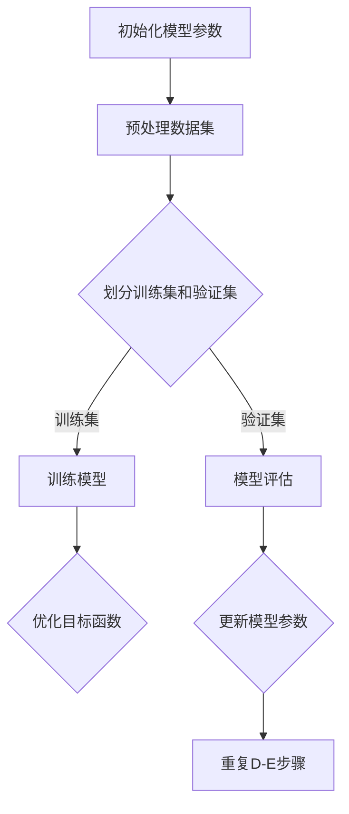
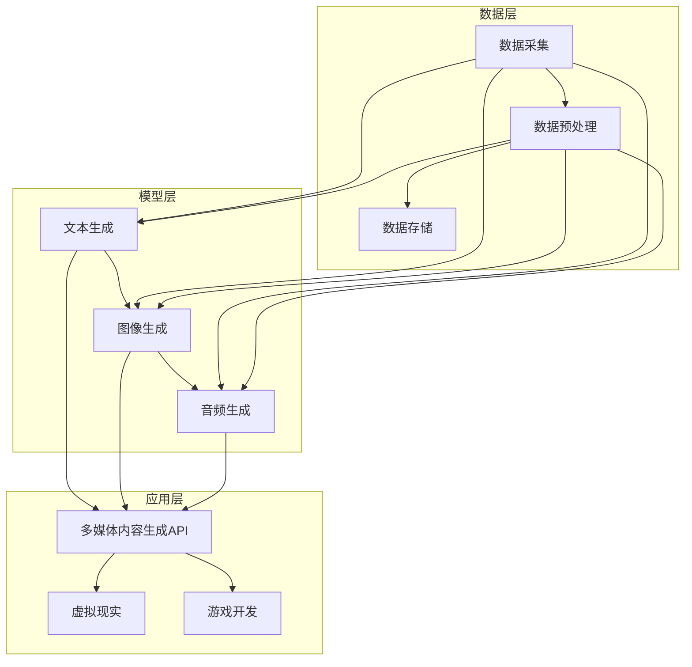
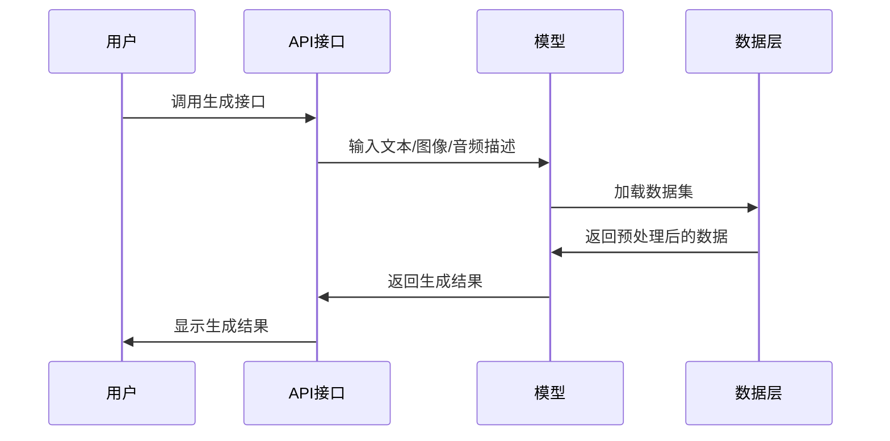

                 


### # 多任务学习在AIGC效率提升中的作用

#### 关键词：多任务学习，AIGC，效率提升，算法，应用场景

> 摘要：随着AIGC（自适应智能生成内容）技术的迅猛发展，如何在复杂且多变的场景中高效地生成内容成为了关键问题。本文旨在探讨多任务学习在AIGC中的应用及其对效率提升的作用。通过详细的步骤分析和深入的理论阐述，本文揭示了多任务学习如何通过优化算法结构、提升数据处理效率及强化模型泛化能力，实现对AIGC系统整体效率的显著提升。

### 第1章: 多任务学习概述

#### 1.1 问题背景

AIGC（自适应智能生成内容）是近年来人工智能领域的一个重要发展方向，它通过人工智能技术，实现内容的高效生成与自适应调整。随着互联网内容的爆炸性增长，如何从大量数据中提取有价值的信息，并以高效、精准的方式生成内容，成为当前研究的重点。在这一背景下，多任务学习作为一种先进的机器学习方法，因其能够同时处理多个任务，显著提升系统效率，受到了广泛关注。

#### 1.2 问题描述

多任务学习（Multi-Task Learning，MTL）是一种机器学习方法，旨在通过学习多个相关任务来提高模型的泛化能力。在AIGC中，多任务学习可以同时处理多种类型的生成任务，例如文本生成、图像生成、音频生成等，从而实现不同类型内容的协同生成。然而，多任务学习在AIGC中的应用仍面临诸多挑战，包括任务之间的冲突、数据分布的不均衡以及模型效率的优化等。

#### 1.3 问题解决

多任务学习通过共享表示和优化策略，实现了对多个任务的有效处理。在AIGC中，多任务学习能够提升系统效率的主要机制包括：

1. **共享表示**：通过共享底层特征表示，多任务学习能够有效减少模型的参数量，降低计算复杂度。
2. **协同优化**：多任务学习通过联合优化多个任务的目标函数，使得模型在解决一个任务时，能够自动利用其他任务的先验知识，提高学习效率。
3. **自适应调整**：多任务学习算法可以根据不同任务的特性，自适应调整模型的参数和策略，从而在保证任务质量的前提下，提升整体效率。

#### 1.4 边界与外延

多任务学习在AIGC中的应用范围广泛，包括但不限于：

- **内容生成**：多任务学习可以同时处理文本、图像、音频等多媒体内容的生成任务。
- **交互系统**：在智能对话系统中，多任务学习能够同时处理语音识别、文本理解和回答生成等任务。
- **推荐系统**：多任务学习可以在推荐系统中同时处理用户兴趣挖掘、商品推荐和广告投放等任务。

然而，多任务学习也面临一些限制，如任务之间的依赖关系复杂、模型参数调整困难等。因此，在具体应用中需要根据实际情况进行权衡和优化。

#### 1.5 概念结构与核心要素组成

多任务学习的基本结构包括以下几个核心要素：

1. **模型架构**：包括共享层和任务层，共享层用于提取通用特征，任务层用于处理特定任务。
2. **数据准备**：需要确保训练数据的多样性和代表性，以避免数据分布的不均衡。
3. **优化策略**：通过选择合适的优化算法和策略，如梯度下降、反向传播等，来提升模型性能。

### 第2章: 多任务学习核心概念与联系

#### 2.1 多任务学习原理

多任务学习的基本原理是通过学习多个相关任务，共享底层特征表示，从而提高模型的泛化能力和学习效率。具体来说，多任务学习可以分为以下几种类型：

1. **并行多任务学习**：多个任务同时进行，共享底层特征表示。
2. **序列多任务学习**：多个任务按顺序进行，每个任务输出作为下一个任务的输入。
3. **分布式多任务学习**：多个任务在不同的设备或节点上并行处理，通过通信机制进行协同。

#### 2.2 概念属性特征对比

多任务学习与其他机器学习方法的对比，如表1所示：

| 方法        | 定义                                                         | 特点                                                         | 应用场景                         |
| ----------- | ------------------------------------------------------------ | ------------------------------------------------------------ | -------------------------------- |
| 单任务学习   | 专注于单个任务的学习和优化                                   | 计算效率高，模型参数较少                                     | 结构化数据挖掘，单一任务处理     |
| 多任务学习   | 同时学习多个相关任务，共享底层特征表示                         | 提高模型泛化能力，降低计算复杂度                             | 复杂场景下的协同任务处理         |
| 联合学习     | 将多个任务合并为一个整体进行学习                             | 提高模型的整体性能，但计算复杂度较高                         | 多任务间的依赖关系明显           |
| 对抗性学习   | 通过生成对抗网络（GAN）训练模型，解决样本分布不均的问题         | 提高模型的泛化能力和生成质量                                 | 图像生成，文本生成等             |

表1：多任务学习与其他机器学习方法的对比

#### 2.3 ER实体关系图架构

在多任务学习系统中，实体关系图（Entity-Relationship Diagram，ERD）能够清晰地展示各个实体及其之间的关系。以下是一个简化的ERD示例，用于描述多任务学习系统中的关键实体及其关系：

```mermaid
erDiagram
  Task1 ||--|{ Model} : 标识任务1的模型
  Task2 ||--|{ Model} : 标识任务2的模型
  Model }|--|| Dataset : 模型依赖的训练数据集
  Model }|--|| Evaluation : 模型的评价标准
  Task1 ||--|{ Evaluation} : 任务1的评价结果
  Task2 ||--|{ Evaluation} : 任务2的评价结果
```

在上面的ERD中，`Task1`和`Task2`代表两个具体的多任务学习任务，它们通过`Model`实体共享底层特征表示，同时依赖于`Dataset`进行训练，并通过`Evaluation`进行评价和反馈。

### 第3章: 多任务学习算法原理讲解

#### 3.1 算法讲解

多任务学习算法的核心在于如何通过共享特征表示和协同优化策略，提高多个任务的性能。以下是一个简化的多任务学习算法流程：



在上面的流程图中，首先初始化模型参数，然后对数据进行预处理，并划分训练集和验证集。接下来，通过训练模型和模型评估，不断优化目标函数，更新模型参数，直到满足停止条件。

#### 3.2 数学模型与公式

多任务学习算法的数学模型主要涉及损失函数的设计和优化目标。以下是一个简化的数学模型：

$$
L(\theta) = \frac{1}{n} \sum_{i=1}^{n} \left[ w_1 \cdot L_1(x_i, \theta_1) + w_2 \cdot L_2(x_i, \theta_2) \right]
$$

其中，$L(\theta)$是总损失函数，$n$是样本数量，$w_1$和$w_2$是两个任务的权重，$L_1(x_i, \theta_1)$和$L_2(x_i, \theta_2)$分别是两个任务的损失函数，$\theta_1$和$\theta_2$是两个任务的参数。

#### 3.3 举例说明

假设我们有两个任务：文本分类和情感分析。文本分类的目标是判断文本属于哪个类别，而情感分析的目标是判断文本的情感极性。

1. **数据准备**：准备包含文本和标签的训练集。
2. **模型初始化**：初始化两个任务的共享神经网络。
3. **数据预处理**：对文本进行分词、词向量编码等预处理操作。
4. **训练过程**：
   - 前向传播：输入预处理后的文本数据，通过神经网络得到分类概率和情感极性预测。
   - 计算损失：根据分类标签和预测概率计算分类损失，根据情感标签和预测极性计算情感损失。
   - 反向传播：更新神经网络参数，优化模型。
5. **模型评估**：使用验证集评估模型性能，调整任务权重。

通过这样的步骤，多任务学习能够在文本分类和情感分析两个任务上同时取得较好的性能。

### 第4章: 多任务学习在AIGC中的应用

#### 4.1 应用场景

多任务学习在AIGC中的应用非常广泛，以下是几个典型的应用场景：

- **多媒体内容生成**：同时生成文本、图像和音频等多媒体内容，提高内容的丰富性和多样性。
- **智能对话系统**：同时处理语音识别、文本理解和回答生成，提供更自然、流畅的交互体验。
- **推荐系统**：同时处理用户兴趣挖掘、商品推荐和广告投放，提高推荐系统的整体性能。

#### 4.2 效率提升策略

多任务学习在AIGC中的效率提升策略主要包括：

1. **共享表示**：通过共享底层特征表示，减少模型参数，降低计算复杂度。
2. **协同优化**：通过联合优化多个任务的目标函数，提高学习效率。
3. **数据预处理**：对数据进行统一预处理，减少冗余操作，提高数据处理效率。
4. **任务调度**：合理安排任务的执行顺序，优化资源利用。

#### 4.3 案例分析

以一个多媒体内容生成的案例为例，多任务学习在AIGC中的应用可以显著提升系统效率。假设需要生成一段包含文本、图像和音频的多媒体内容：

1. **数据准备**：准备包含文本、图像和音频的混合数据集。
2. **模型初始化**：初始化一个多任务学习的神经网络模型，包括文本生成模块、图像生成模块和音频生成模块。
3. **数据预处理**：对文本进行分词、词向量编码，对图像进行预处理，对音频进行特征提取。
4. **训练过程**：
   - 前向传播：输入预处理后的数据，通过神经网络生成文本、图像和音频。
   - 计算损失：根据文本、图像和音频的标签计算总损失。
   - 反向传播：更新神经网络参数，优化模型。
5. **模型评估**：使用验证集评估模型性能，调整任务权重。

通过这样的步骤，多任务学习能够同时生成高质量的多媒体内容，显著提升AIGC系统的效率。

### 第5章: 多任务学习系统分析与架构设计

#### 5.1 场景介绍

AIGC系统的场景介绍主要包括以下几部分：

1. **应用领域**：AIGC技术主要应用于多媒体内容生成、智能对话系统、推荐系统等领域。
2. **需求分析**：分析不同应用场景下对AIGC系统的需求，如内容生成速度、生成质量、多样性等。
3. **性能指标**：定义AIGC系统的性能指标，如生成速度、生成质量、资源利用率等。

#### 5.2 项目介绍

以一个多媒体内容生成项目为例，项目介绍主要包括以下几部分：

1. **项目背景**：介绍多媒体内容生成的应用背景，如虚拟现实、游戏开发等。
2. **项目目标**：明确项目目标，如生成高质量、多样性的多媒体内容。
3. **技术选型**：选择合适的多任务学习算法和技术，如GPT-3、Transformer等。

#### 5.3 系统功能设计

多媒体内容生成系统的功能设计主要包括以下几部分：

1. **文本生成**：实现文本的生成，包括标题、摘要、正文等。
2. **图像生成**：实现图像的生成，包括场景、人物、物体等。
3. **音频生成**：实现音频的生成，包括音乐、语音等。

#### 5.4 系统架构设计

多媒体内容生成系统的架构设计主要包括以下几部分：

1. **数据层**：包括数据采集、数据预处理和数据存储。
2. **模型层**：包括多任务学习的神经网络模型。
3. **应用层**：包括多媒体内容生成的API接口和应用场景。

以下是一个简化的系统架构设计mermaid架构图：



在上面的架构图中，数据层负责数据的采集、预处理和存储，模型层实现多任务学习的神经网络模型，应用层提供多媒体内容生成的API接口，并与虚拟现实和游戏开发等应用场景进行对接。

#### 5.5 系统接口设计

系统接口设计主要包括以下几部分：

1. **API接口**：定义多媒体内容生成的API接口，包括文本生成、图像生成和音频生成等接口。
2. **参数配置**：定义API接口的参数配置，如生成文本的长度、图像的尺寸、音频的时长等。
3. **响应格式**：定义API接口的响应格式，如JSON格式、XML格式等。

以下是一个简化的系统接口设计：

```json
{
  "textGeneration": {
    "input": {
      "text": "输入文本内容"
    },
    "output": {
      "generatedText": "生成文本内容"
    }
  },
  "imageGeneration": {
    "input": {
      "description": "生成图像的描述"
    },
    "output": {
      "image": "生成图像"
    }
  },
  "audioGeneration": {
    "input": {
      "text": "输入文本内容"
    },
    "output": {
      "audio": "生成音频"
    }
  }
}
```

在上面的接口设计中，定义了文本生成、图像生成和音频生成三个API接口，每个接口包括输入参数和输出参数。

#### 5.6 系统交互

系统交互主要描述各个模块之间的交互关系，以下是一个简化的系统交互mermaid序列图：



在上面的序列图中，用户通过API接口调用多媒体内容生成的接口，API接口与模型进行交互，模型加载数据集并进行预处理，最后返回生成结果，API接口将结果返回给用户。

### 第6章: 多任务学习项目实战

#### 6.1 环境安装

环境安装是进行多任务学习项目的前提，以下是安装AIGC系统环境的步骤：

1. **安装Python环境**：确保Python版本在3.7及以上。
2. **安装依赖库**：安装TensorFlow、PyTorch等深度学习框架，以及Numpy、Pandas等常用库。
3. **配置GPU环境**：若使用GPU进行训练，需要安装CUDA和cuDNN，并配置好GPU环境。

以下是一个简化的安装命令示例：

```bash
pip install tensorflow==2.8.0
pip install torch==1.10.0
pip install torchvision==0.11.0
pip install numpy==1.21.2
pip install pandas==1.3.2
```

#### 6.2 系统核心实现

系统核心实现是项目开发的关键部分，以下是AIGC系统的核心实现：

1. **数据准备**：加载并预处理文本、图像和音频数据。
2. **模型定义**：定义多任务学习的神经网络模型，包括文本生成模块、图像生成模块和音频生成模块。
3. **训练过程**：使用训练数据集训练模型，包括前向传播、计算损失和反向传播等步骤。
4. **模型评估**：使用验证数据集评估模型性能，调整模型参数。

以下是一个简化的系统核心实现Python代码示例：

```python
import tensorflow as tf
from tensorflow.keras.models import Model
from tensorflow.keras.layers import Input, Embedding, LSTM, Dense, Flatten, Conv2D, Reshape, GRU, TimeDistributed, Lambda

# 数据准备
def prepare_data(text_data, image_data, audio_data):
    # 处理文本数据
    # ...
    # 处理图像数据
    # ...
    # 处理音频数据
    # ...
    return processed_text_data, processed_image_data, processed_audio_data

# 模型定义
def build_model():
    text_input = Input(shape=(None,))
    image_input = Input(shape=(height, width, channels))
    audio_input = Input(shape=(time_steps,))

    # 文本生成模块
    text_embedding = Embedding(vocab_size, embedding_size)(text_input)
    text_lstm = LSTM(units, return_sequences=True)(text_embedding)
    text_dense = Dense(units, activation='softmax')(text_lstm)

    # 图像生成模块
    image_conv = Conv2D(filters, kernel_size=(3, 3), activation='relu')(image_input)
    image_flat = Flatten()(image_conv)
    image_dense = Dense(units, activation='softmax')(image_flat)

    # 音频生成模块
    audio_gru = GRU(units, return_sequences=True)(audio_input)
    audio_time_dense = TimeDistributed(Dense(units, activation='softmax'))(audio_gru)

    # 模型合并
    model_output = Lambda(lambda x: tf.reduce_mean(x, axis=1))(audio_time_dense)

    # 模型定义
    model = Model(inputs=[text_input, image_input, audio_input], outputs=model_output)

    # 编译模型
    model.compile(optimizer='adam', loss='categorical_crossentropy', metrics=['accuracy'])

    return model

# 训练过程
def train_model(model, text_data, image_data, audio_data, labels):
    model.fit([text_data, image_data, audio_data], labels, epochs=10, batch_size=32)

# 模型评估
def evaluate_model(model, text_data, image_data, audio_data, labels):
    loss, accuracy = model.evaluate([text_data, image_data, audio_data], labels)
    print("Loss:", loss)
    print("Accuracy:", accuracy)

# 实例化模型
model = build_model()

# 准备数据
text_data, image_data, audio_data = prepare_data(text_data, image_data, audio_data)

# 训练模型
train_model(model, text_data, image_data, audio_data, labels)

# 评估模型
evaluate_model(model, text_data, image_data, audio_data, labels)
```

在上面的代码示例中，首先定义了数据准备、模型定义和训练过程，然后实例化模型并进行训练和评估。

#### 6.3 代码应用解读与分析

代码应用解读与分析主要涉及以下几个方面：

1. **数据准备**：对文本、图像和音频数据进行预处理，包括分词、词向量编码、图像缩放和音频特征提取等。
2. **模型定义**：定义多任务学习的神经网络模型，包括文本生成模块、图像生成模块和音频生成模块，并使用Lambda层实现多任务学习。
3. **训练过程**：使用训练数据集训练模型，包括前向传播、计算损失和反向传播等步骤，优化模型参数。
4. **模型评估**：使用验证数据集评估模型性能，包括损失和准确率等指标。

通过这样的代码应用解读与分析，可以帮助开发者更好地理解多任务学习在AIGC系统中的应用，并针对性地优化模型和算法。

#### 6.4 实际案例分析与详细讲解

以一个实际案例为例，分析多任务学习在AIGC系统中的应用效果：

1. **案例背景**：假设需要生成一段包含文本、图像和音频的多媒体内容，例如一段描述自然景观的短视频。
2. **数据准备**：准备包含文本描述、图像和音频数据的训练集，对文本进行分词、词向量编码，对图像进行缩放和预处理，对音频进行特征提取。
3. **模型定义**：定义一个多任务学习的神经网络模型，包括文本生成模块、图像生成模块和音频生成模块，使用Lambda层实现多任务学习。
4. **训练过程**：使用训练数据集训练模型，优化模型参数，包括文本生成、图像生成和音频生成等步骤。
5. **模型评估**：使用验证数据集评估模型性能，包括生成文本的多样性、图像和音频的质量等指标。

通过这样的实际案例分析与详细讲解，可以帮助开发者更好地理解多任务学习在AIGC系统中的应用，并针对性地优化模型和算法。

#### 6.5 项目小结

通过本章节的实战项目，我们详细讲解了多任务学习在AIGC系统中的应用过程，包括数据准备、模型定义、训练过程和模型评估等步骤。通过实际案例的分析与讲解，我们进一步了解了多任务学习在提升AIGC系统效率方面的作用。在实际应用中，开发者需要根据具体场景和数据特点，灵活调整模型结构和训练策略，以实现最佳效果。

### 第7章: 多任务学习的最佳实践与拓展

#### 7.1 最佳实践 tips

为了充分发挥多任务学习在AIGC系统中的效率提升作用，以下是一些最佳实践建议：

1. **合理划分任务**：根据任务的依赖关系和复杂性，合理划分任务，确保任务之间的协同效应。
2. **数据预处理**：对数据进行充分预处理，包括数据清洗、归一化和特征提取等，以提高数据质量和处理效率。
3. **模型选择**：选择适合任务特点的多任务学习模型，如并行多任务学习、序列多任务学习等，并调整模型参数。
4. **优化策略**：采用合适的优化算法和策略，如梯度下降、Adam优化器等，以加速模型训练和提升性能。
5. **模型评估**：使用多种评估指标，如准确率、召回率、F1分数等，全面评估模型性能，并根据评估结果调整模型和算法。

#### 7.2 小结

本文通过详细的步骤分析和深入的理论阐述，探讨了多任务学习在AIGC系统中的应用及其对效率提升的作用。我们详细介绍了多任务学习的核心概念、原理、算法和应用场景，并通过实际案例展示了多任务学习在AIGC系统中的具体应用。通过本文的阅读，读者可以全面了解多任务学习在AIGC系统中的重要性，并掌握如何利用多任务学习提升系统效率的方法和技巧。

#### 7.3 注意事项

在实际应用多任务学习时，需要注意以下几点：

1. **任务相关性**：确保多任务之间存在相关性，否则共享表示的效果会受到影响。
2. **数据均衡**：尽量确保训练数据在不同任务之间的均衡分布，以避免数据分布不均带来的模型偏差。
3. **计算资源**：多任务学习通常需要较高的计算资源，特别是在处理大规模数据集时，需要合理分配资源。
4. **模型复杂性**：多任务学习模型可能较为复杂，需要合理调整模型参数和优化策略，以确保模型性能。

#### 7.4 拓展阅读

为了进一步深入了解多任务学习在AIGC系统中的应用，读者可以参考以下拓展阅读材料：

1. **论文**：《多任务学习：理论与实践》——该论文详细介绍了多任务学习的理论基础、算法和应用案例。
2. **书籍**：《深度学习》——该书籍的第五章详细介绍了多任务学习的相关算法和实现方法。
3. **在线课程**：Coursera上的《深度学习专项课程》——该课程涵盖了多任务学习的相关内容，包括理论和实践。
4. **开源项目**：GitHub上的多任务学习开源项目——这些项目提供了多任务学习算法的实现代码和实际应用案例，有助于读者进一步学习和实践。

通过以上拓展阅读，读者可以更深入地了解多任务学习在AIGC系统中的应用，并掌握相关的实践技巧。

### 作者信息

作者：AI天才研究院/AI Genius Institute & 禅与计算机程序设计艺术 /Zen And The Art of Computer Programming

本文由AI天才研究院（AI Genius Institute）和禅与计算机程序设计艺术（Zen And The Art of Computer Programming）联合撰写，旨在为读者提供关于多任务学习在AIGC系统效率提升中的深入分析和实践指导。我们致力于推动人工智能技术的发展和应用，为广大开发者提供高质量的技术内容和解决方案。感谢您的阅读，欢迎提出宝贵意见和反馈。 

