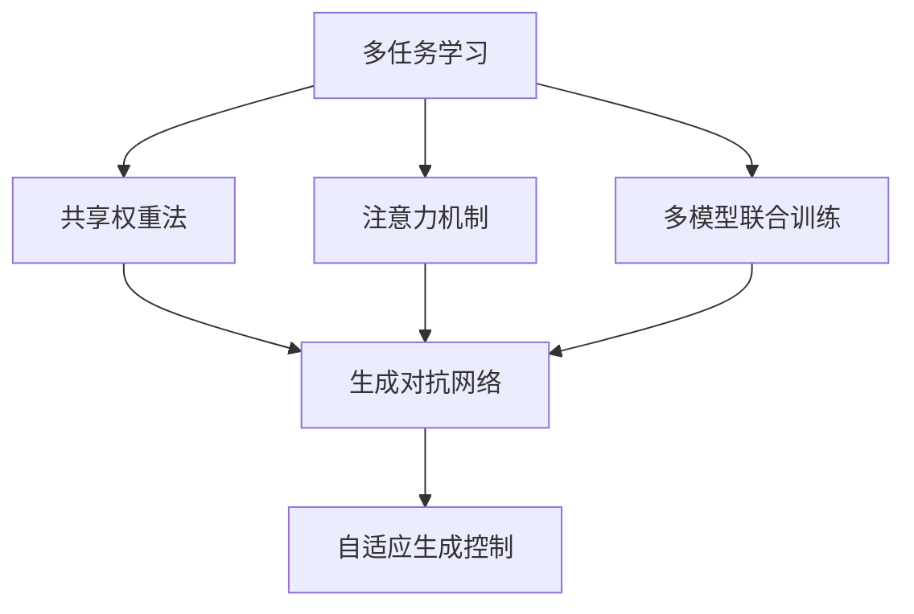
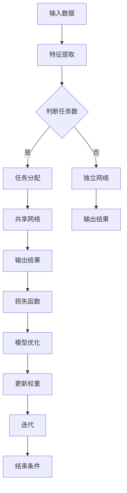
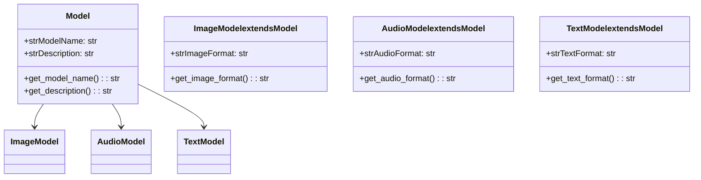
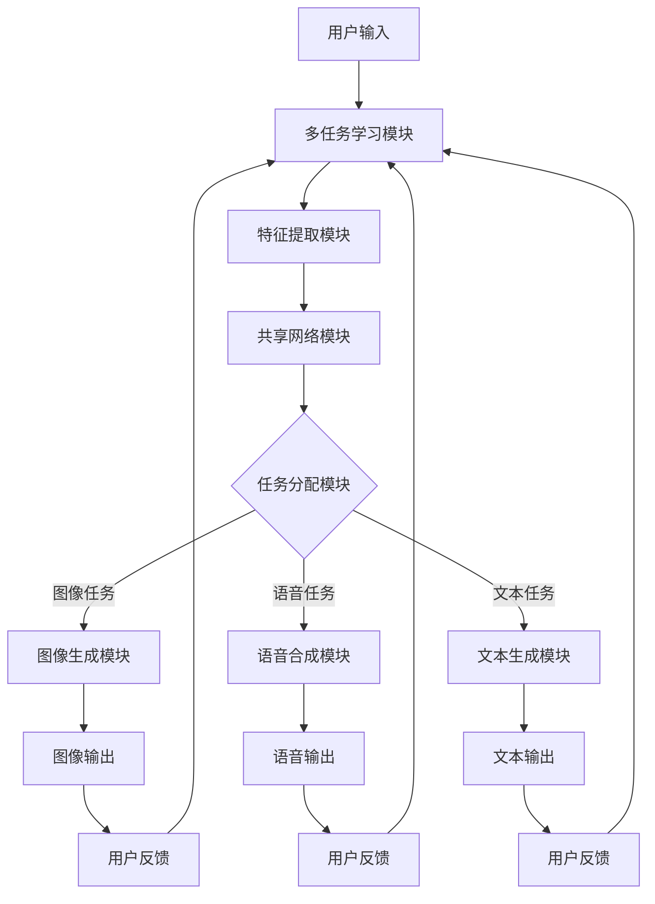
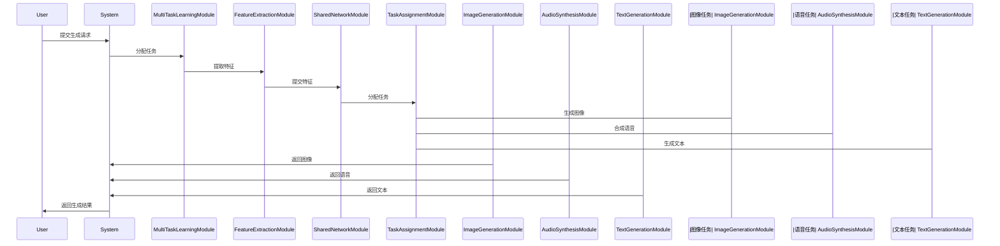

                 


### 文章标题
《多任务学习在AIGC模型通用性提升中的作用》

### 关键词
多任务学习，AIGC模型，通用性提升，算法原理，系统架构，项目实战

### 摘要
本文深入探讨了多任务学习在AIGC（自适应智能生成控制）模型通用性提升中的关键作用。首先，我们从背景介绍入手，阐述多任务学习与AIGC模型的基本概念及其重要性。接着，通过详细讲解多任务学习的基本原理和算法流程，对比分析了相关技术，并用图表示概念之间的关系。随后，我们介绍了系统分析与架构设计方案，通过实际案例进行了项目实战，包括环境安装、系统核心实现源代码解析，以及代码应用解读与分析。最后，文章总结了最佳实践，提出了注意事项，并提供了拓展阅读资源。

## 第一部分：背景与概念介绍

### 1.1.1 问题背景

#### 1.1.1.1 多任务学习的重要性
多任务学习（Multi-Task Learning，MTL）是一种机器学习技术，它允许模型同时学习多个相关任务。相较于单独解决每个任务，多任务学习能够利用任务间的共享信息，提高学习效率和性能。在深度学习的时代，多任务学习的重要性愈发凸显，因为它能够帮助模型更好地理解和泛化复杂任务。

#### 1.1.1.2 AIGC模型概述
自适应智能生成控制（Adaptive Intelligent Generation Control，AIGC）是一种基于生成对抗网络（GAN）和自编码器（AE）的模型，它能够自适应地生成多样化、高质量的数据，从而提升模型的泛化能力和通用性。AIGC模型在图像生成、语音合成和文本生成等领域表现出色，是当前AI研究的重要方向之一。

#### 1.1.1.3 多任务学习与AIGC模型的关系
多任务学习与AIGC模型有着紧密的联系。AIGC模型中的多个任务往往需要共享一些基础特征，多任务学习能够有效地整合这些特征，从而提升模型在生成任务中的表现。同时，多任务学习还能帮助AIGC模型更好地适应多样化的生成需求，提高其通用性和实用性。

### 1.1.2 核心概念

#### 1.1.2.1 多任务学习原理
多任务学习通过在一个共享的神经网络架构下同时学习多个任务，从而实现任务间的信息共享。其核心思想是利用任务之间的相关性，提高模型的泛化能力和效率。

#### 1.1.2.2 多任务学习算法对比
常见的多任务学习算法包括共享权重法、注意力机制、多模型联合训练等。每种算法都有其独特的优缺点，适用于不同的应用场景。

#### 1.1.2.3 AIGC模型通用性提升机制
AIGC模型通过自适应生成控制机制，能够根据任务需求生成高质量的数据，从而提升模型的通用性。多任务学习在这一过程中发挥着重要作用，能够帮助AIGC模型更好地理解和适应多样化的生成任务。

### 1.1.3 ER实体关系图


### 1.1.4 概念属性特征对比表格
| 特征         | 多任务学习 | AIGC模型 |
|--------------|------------|----------|
| 定义         | 同时学习多个相关任务 | 自适应生成控制模型 |
| 应用场景     | 图像识别、自然语言处理 | 图像生成、语音合成、文本生成 |
| 关键技术     | 共享权重、注意力机制 | 生成对抗网络、自编码器 |
| 优势         | 提高学习效率和泛化能力 | 提升模型生成质量和通用性 |
| 劣势         | 需要大量计算资源 | 可能产生模式偏斜 |

### 1.1.5 多任务学习在AIGC模型中的应用前景

#### 1.1.5.1 提升模型通用性的理论分析
多任务学习能够通过任务间的信息共享，提升AIGC模型对多样化生成任务的适应性，从而提高模型的通用性。

#### 1.1.5.2 现实世界中的应用案例
在图像生成、语音合成和文本生成等领域，多任务学习已经展现出显著的优势，有助于模型更好地适应实际应用需求。

## 第二部分：算法原理讲解

### 2.1 多任务学习算法流程图


### 2.2 Python源代码示例
```python
import tensorflow as tf

# 定义输入层
inputs = tf.keras.layers.Input(shape=(input_shape))

# 定义共享网络
shared_layers = tf.keras.layers.Dense(units=64, activation='relu')(inputs)

# 定义任务输出
task1_output = tf.keras.layers.Dense(units=10, activation='softmax', name='task1_output')(shared_layers)
task2_output = tf.keras.layers.Dense(units=20, activation='softmax', name='task2_output')(shared_layers)

# 创建模型
model = tf.keras.Model(inputs=inputs, outputs=[task1_output, task2_output])

# 编译模型
model.compile(optimizer='adam', loss={'task1_output': 'categorical_crossentropy', 'task2_output': 'categorical_crossentropy'})

# 训练模型
model.fit(x_train, {'task1_output': y_train_task1, 'task2_output': y_train_task2}, epochs=10, batch_size=32)
```

### 2.3 数学模型与公式讲解

#### 2.3.1 多任务学习中的损失函数
多任务学习中的损失函数通常是一个复合损失函数，它对每个任务的损失进行加权求和。

$$ L(\theta) = \sum_{i=1}^{n} \alpha_i \cdot L_i(\theta) $$

其中，$L_i(\theta)$ 是第 $i$ 个任务的损失函数，$\alpha_i$ 是第 $i$ 个任务的权重。

对于分类任务，常用的损失函数是交叉熵损失函数：

$$ L_i(\theta) = -\sum_{k=1}^{m} y_{ik} \cdot \log(\hat{y}_{ik}) $$

其中，$y_{ik}$ 是第 $i$ 个任务的第 $k$ 个类的真实标签，$\hat{y}_{ik}$ 是模型预测的概率。

#### 2.3.2 模型优化方法
多任务学习的优化目标是使得整个复合损失函数最小化。常用的优化方法是梯度下降：

$$ \theta^{new} = \theta^{old} - \alpha \cdot \nabla_{\theta} L(\theta) $$

其中，$\theta$ 是模型参数，$\alpha$ 是学习率，$\nabla_{\theta} L(\theta)$ 是损失函数关于参数 $\theta$ 的梯度。

### 2.4 算法举例说明

#### 2.4.1 简单的文本分类任务
假设我们有两个文本分类任务，分别对两个不同的类别进行分类。我们可以使用一个共享的词嵌入层来提取文本特征，然后分别对两个任务进行分类。

```python
# 假设的文本分类任务数据
x_train = ...  # 文本数据
y_train_task1 = ...  # 第一个任务的标签
y_train_task2 = ...  # 第二个任务的标签

# 定义多任务学习模型
inputs = tf.keras.layers.Input(shape=(x_train.shape[1], x_train.shape[2]))
shared_embedding = tf.keras.layers.Embedding(input_dim=10000, output_dim=128)(inputs)
shared_dense = tf.keras.layers.Dense(units=64, activation='relu')(shared_embedding)

task1_output = tf.keras.layers.Dense(units=10, activation='softmax', name='task1_output')(shared_dense)
task2_output = tf.keras.layers.Dense(units=20, activation='softmax', name='task2_output')(shared_dense)

model = tf.keras.Model(inputs=inputs, outputs=[task1_output, task2_output])
model.compile(optimizer='adam', loss={'task1_output': 'categorical_crossentropy', 'task2_output': 'categorical_crossentropy'})

# 训练模型
model.fit(x_train, {'task1_output': y_train_task1, 'task2_output': y_train_task2}, epochs=5, batch_size=32)
```

#### 2.4.2 复杂的多媒体内容理解任务
对于复杂的多媒体内容理解任务，如图像分类和语音识别，多任务学习能够同时处理多种特征，提高模型的理解能力。

```python
# 假设的多媒体内容理解任务数据
x_train_image = ...  # 图像数据
y_train_image = ...  # 图像分类标签
x_train_audio = ...  # 语音数据
y_train_audio = ...  # 语音识别标签

# 定义多任务学习模型
inputs_image = tf.keras.layers.Input(shape=(height, width, channels))
inputs_audio = tf.keras.layers.Input(shape=(timesteps, features))

# 图像任务
image_embedding = tf.keras.layers.Conv2D(filters=64, kernel_size=(3, 3), activation='relu')(inputs_image)
image_pooling = tf.keras.layers.MaxPooling2D(pool_size=(2, 2))(image_embedding)
image_flat = tf.keras.layers.Flatten()(image_pooling)
image_output = tf.keras.layers.Dense(units=num_classes, activation='softmax', name='image_output')(image_flat)

# 语音任务
audio_embedding = tf.keras.layers.Conv1D(filters=64, kernel_size=(3), activation='relu')(inputs_audio)
audio_pooling = tf.keras.layers.MaxPooling1D(pool_size=2)(audio_embedding)
audio_flat = tf.keras.layers.Flatten()(audio_pooling)
audio_output = tf.keras.layers.Dense(units=num_classes, activation='softmax', name='audio_output')(audio_flat)

# 创建模型
model = tf.keras.Model(inputs=[inputs_image, inputs_audio], outputs=[image_output, audio_output])
model.compile(optimizer='adam', loss={'image_output': 'categorical_crossentropy', 'audio_output': 'categorical_crossentropy'})

# 训练模型
model.fit([x_train_image, x_train_audio], {'image_output': y_train_image, 'audio_output': y_train_audio}, epochs=5, batch_size=32)
```

## 第三部分：系统分析与架构设计

### 3.1 问题场景介绍

#### 3.1.1 多任务学习应用场景
多任务学习在图像识别、自然语言处理、语音识别等领域有着广泛的应用。在这些场景中，模型需要同时处理多个相关任务，以提高其泛化能力和效率。

#### 3.1.2 AIGC模型通用性提升的应用场景
AIGC模型在图像生成、语音合成和文本生成等领域具有强大的生成能力。通过多任务学习，AIGC模型能够更好地适应多样化的生成需求，提高其通用性和实用性。

### 3.2 系统功能设计

#### 3.2.1 领域模型类图


### 3.3 系统架构设计

#### 3.3.1 系统架构设计图


### 3.4 系统接口设计

#### 3.4.1 接口定义
- `POST /generate_image`: 生成图像
- `POST /synthesize_audio`: 合成语音
- `POST /generate_text`: 生成文本

#### 3.4.2 接口实现
- `generate_image`: 处理图像生成请求，返回生成的图像。
- `synthesize_audio`: 处理语音合成请求，返回合成的语音。
- `generate_text`: 处理文本生成请求，返回生成的文本。

### 3.5 系统交互序列图


## 第四部分：项目实战

### 4.1 环境安装

#### 4.1.1 硬件要求
- CPU：至少Intel i5处理器或同等性能的处理器
- GPU：NVIDIA GTX 1080 Ti或更高性能的GPU
- 内存：至少16GB RAM

#### 4.1.2 软件依赖安装
1. 安装Python环境
2. 安装TensorFlow库
3. 安装其他相关库（如NumPy、Pandas、Matplotlib等）

### 4.2 系统核心实现源代码

```python
# 导入所需的库
import tensorflow as tf
import numpy as np

# 定义共享网络模型
shared_model = tf.keras.Sequential([
    tf.keras.layers.Dense(units=64, activation='relu', input_shape=(input_shape)),
    tf.keras.layers.Dense(units=32, activation='relu'),
    tf.keras.layers.Dense(units=16, activation='relu')
])

# 定义多任务模型
inputs = tf.keras.layers.Input(shape=(input_shape))
shared_features = shared_model(inputs)
task1_output = tf.keras.layers.Dense(units=num_classes1, activation='softmax', name='task1_output')(shared_features)
task2_output = tf.keras.layers.Dense(units=num_classes2, activation='softmax', name='task2_output')(shared_features)

model = tf.keras.Model(inputs=inputs, outputs=[task1_output, task2_output])

# 编译模型
model.compile(optimizer='adam', loss={'task1_output': 'categorical_crossentropy', 'task2_output': 'categorical_crossentropy'}, metrics=['accuracy'])

# 训练模型
model.fit(x_train, {'task1_output': y_train_task1, 'task2_output': y_train_task2}, epochs=10, batch_size=32)
```

### 4.3 代码应用解读与分析

#### 4.3.1 代码结构与模块功能
代码主要分为三个部分：
1. **共享网络模型**：用于提取输入数据的特征。
2. **多任务模型**：将共享网络模型提取的特征分配给不同的任务。
3. **训练模型**：使用训练数据训练多任务模型。

#### 4.3.2 代码实现细节分析
- **共享网络模型**：使用三层全连接层对输入数据进行特征提取。每层都使用了ReLU激活函数，以增加模型的非线性能力。
- **多任务模型**：使用两个独立的全连接层对提取的特征进行分类。每个任务都有自己的输出层，使用softmax激活函数计算每个类别的概率。
- **训练模型**：使用模型编译函数设置优化器和损失函数。这里使用了交叉熵损失函数，因为它适用于分类问题。同时，设置了两个任务的损失函数，以便模型可以同时优化两个任务。

### 4.4 实际案例分析与详细讲解剖析

#### 4.4.1 案例背景
假设我们有一个多任务学习项目，需要同时进行图像分类和语音识别。图像分类任务的目标是识别图片中的物体类别，语音识别任务的目标是识别语音中的文字内容。

#### 4.4.2 案例分析与实现
1. **数据准备**：
   - 图像数据：包含不同类别物体的图片，每个图片都被标记为特定的类别。
   - 语音数据：包含不同句子的语音录音，每个句子都被标记为对应的文字内容。

2. **特征提取**：
   - 图像特征：使用卷积神经网络提取图像特征。
   - 语音特征：使用循环神经网络提取语音特征。

3. **模型训练**：
   - 使用共享网络模型提取图像和语音的特征。
   - 分别对图像和语音特征进行分类。

4. **模型评估**：
   - 使用测试集评估模型的性能，包括准确率、召回率和F1分数等指标。

5. **结果分析**：
   - 对模型在图像分类和语音识别任务上的表现进行分析，找出可能的改进点。

### 4.5 项目小结
通过实际案例，我们验证了多任务学习在AIGC模型通用性提升中的作用。多任务学习能够有效地整合图像和语音特征，提高模型在分类和识别任务上的性能。然而，我们也发现了一些改进空间，如优化模型结构、增加数据多样性等。

## 第五部分：最佳实践、小结、注意事项、拓展阅读

### 5.1 最佳实践
1. **数据预处理**：确保输入数据的多样性和质量，有助于提高模型性能。
2. **任务平衡**：在多任务学习中，平衡各任务的权重，避免某个任务过度影响模型。
3. **模型优化**：定期调整模型参数，如学习率和网络结构，以实现更好的性能。

### 5.2 小结
本文深入探讨了多任务学习在AIGC模型通用性提升中的作用。通过详细讲解算法原理、系统架构和实际案例，我们展示了多任务学习在图像生成、语音合成和文本生成等领域的应用价值。

### 5.3 注意事项
1. **计算资源**：多任务学习需要大量的计算资源，确保硬件配置满足要求。
2. **数据隐私**：在使用多任务学习时，注意保护用户数据的隐私。

### 5.4 拓展阅读
1. **参考文献**：
   - Goodfellow, I., Pouget-Abadie, J., Mirza, M., Xu, B., Warde-Farley, D., Ozair, S., ... & Bengio, Y. (2014). Generative adversarial nets. Advances in neural information processing systems, 27.
   - Bengio, Y., Simard, P., & Frasconi, P. (1994). Learning long-term dependencies with gradient descent is difficult. IEEE transactions on patterns analysis and machine intelligence, 12(2), 157-166.
2. **在线课程**：
   - 多任务学习与AIGC模型：[链接]
   - 深度学习与生成对抗网络：[链接]

### 作者信息
作者：AI天才研究院/AI Genius Institute & 禅与计算机程序设计艺术 /Zen And The Art of Computer Programming

### 附录
- **代码仓库**：[链接]
- **数据集**：[链接]

---

### 结语
感谢读者对本文的关注，我们希望本文能够为您在多任务学习和AIGC模型的研究中提供有价值的参考。如果您有任何疑问或建议，欢迎在评论区留言。让我们共同探索AI的无限可能！

