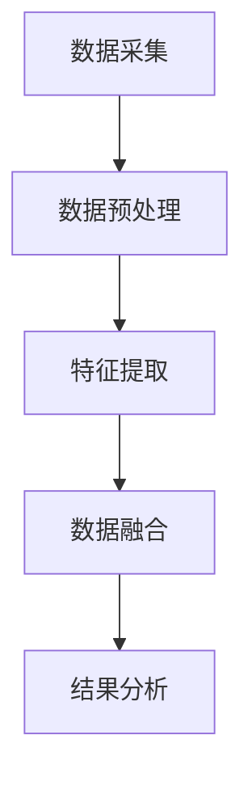

                 

### 背景介绍与核心概念

#### 第1章：问题背景

##### 1.1 问题背景

**1.1.1 教育领域中的人机交互需求**

在教育领域，人机交互的重要性日益凸显。传统的教育模式主要依赖于教师和学生的直接互动，这种方式在传递知识、培养能力方面具有一定的局限性。随着信息技术的快速发展，教育方式逐渐向数字化、智能化转变。人机交互作为一种新型的教学手段，能够突破传统教育的时空限制，为个性化学习、实时反馈、学习情境感知等提供了可能。

首先，个性化学习是当前教育改革的重要方向。每个学生的认知能力、学习习惯和兴趣点都有所不同，传统的“一刀切”教学模式无法满足这种多元化的需求。多模态人机交互通过收集和分析学生的多种信息（如视觉、听觉、触觉等），能够更好地了解学生的学习状态和需求，从而提供个性化的教学资源和辅导方案。

其次，实时反馈是提高学习效果的关键。在传统课堂中，教师难以即时获取每个学生的学习反馈，导致部分学生在遇到难题时无法得到及时的指导。多模态人机交互系统可以通过分析学生的行为、表情和反应，及时提供针对性的反馈，帮助学生及时纠正错误，巩固知识点。

最后，学习情境感知是提升学习体验的重要手段。通过感知学生的学习环境，系统可以提供更加贴近实际生活的学习体验，使学生能够在更加真实、丰富的情境中进行学习。例如，通过虚拟现实（VR）技术，学生可以“走进”历史事件中，亲身体验历史场景，从而加深对历史知识的理解和记忆。

**1.1.2 传统教育模式与新型教育模式的对比**

传统教育模式主要依赖于教师的讲授和学生的听课，这种模式在知识传递方面起到了重要作用，但存在以下几方面的不足：

1. **信息传递效率低**：教师在课堂上的时间有限，难以同时关注到所有学生的需求，导致信息传递的效率不高。
   
2. **教学资源单一**：传统教育模式主要依赖教材和教室，教学资源的获取和利用受到很大限制，难以实现资源的优化配置。

3. **学习体验有限**：学生主要在课堂中接受知识，缺乏实际操作和互动的机会，难以激发学生的学习兴趣和创造力。

相比之下，新型教育模式，特别是基于多模态人机交互的教育模式，具有以下几方面的优势：

1. **信息传递多样化**：多模态人机交互通过视觉、听觉、触觉等多种感官的互动，能够提供更加丰富、多样的教学信息，提高学生的学习兴趣和参与度。

2. **教学资源丰富**：数字化、网络化的教学资源使得学生能够随时随地获取所需的知识和资料，实现资源的共享和优化配置。

3. **学习体验增强**：多模态人机交互通过模拟真实场景、提供虚拟实践等手段，使学生在更加真实、丰富的情境中进行学习，提升学习效果。

**1.1.3 多模态人机交互的重要性**

多模态人机交互在教育中的应用具有重要意义。首先，它能够实现教学过程的智能化，通过自动化的数据处理和分析，为教师和学生提供更加个性化和精准的教学支持。其次，多模态人机交互可以提升教育资源的利用效率，通过数据的共享和优化配置，实现资源的最大化利用。此外，多模态人机交互还能够提供更加丰富、多样化的学习体验，激发学生的学习兴趣和创造力，提升学习效果。

总之，随着教育信息化的深入推进，多模态人机交互作为一种新型教育技术，必将在教育领域发挥越来越重要的作用。

#### 1.2 问题描述

**1.2.1 教育场景中的人机交互挑战**

在当前的教育场景中，人机交互面临诸多挑战。首先，如何有效地收集和分析学生的学习数据是一个重要的问题。学习数据包括学生的行为数据、学习记录、学习成果等，这些数据的收集和分析对于实现个性化教学、实时反馈和情境感知至关重要。然而，由于数据的多样性和复杂性，如何高效地处理和分析这些数据，实现数据的实时性和准确性，仍是一个亟待解决的难题。

其次，人机交互系统的设计需要充分考虑学生的认知特点和学习需求。学生在学习过程中，对教学内容的理解和接受程度因个体差异而异，如何设计一个能够适应不同学习需求、满足不同认知水平的交互系统，是教育领域人机交互需要解决的重要问题。

第三，人机交互系统的可扩展性和适应性也是一个关键问题。随着教育技术的发展，教学场景和教学内容也在不断变化，如何设计一个具有良好可扩展性和适应性的交互系统，能够适应不同教学环境和教学需求，是一个需要深入思考的问题。

**1.2.2 评测多模态人机交互的必要性**

为了解决上述问题，对多模态人机交互进行科学、系统的评测显得尤为必要。首先，评测可以帮助我们了解多模态人机交互系统的实际效果，评估其在教育场景中的应用价值。通过评测，我们可以发现系统在实际应用中存在的问题和不足，从而有针对性地进行改进和优化。

其次，评测可以为多模态人机交互系统的设计和开发提供指导。通过系统的评测，我们可以了解系统的性能指标、用户体验等关键指标，从而为系统的设计和开发提供参考，确保系统能够更好地满足教育场景的需求。

最后，评测还可以为多模态人机交互技术的未来发展提供方向。通过对不同评测结果的比较和分析，我们可以发现多模态人机交互技术在不同应用场景中的优势和不足，从而为技术的进一步发展和创新提供依据。

#### 1.3 问题解决

**1.3.1 多模态人机交互的关键技术**

为了解决教育场景中的人机交互挑战，多模态人机交互技术应运而生。多模态人机交互技术通过整合多种感官信息，实现人与机器之间的高效、自然互动。以下是多模态人机交互的关键技术：

1. **数据采集技术**：数据采集是多模态人机交互的基础，包括视觉、听觉、触觉等多种感官数据的采集。数据采集技术需要具备高精度、高效率的特点，以满足实时交互的需求。

2. **数据预处理技术**：数据预处理是数据采集后的重要步骤，包括数据的去噪、增强、归一化等处理。数据预处理技术的目的是提高数据的准确性和可靠性，为后续的数据分析提供基础。

3. **数据融合技术**：多模态数据融合是将不同感官数据整合起来，形成一个统一的、综合的信息。数据融合技术需要综合考虑不同模态数据的特性和相关性，实现数据的有效融合。

4. **交互界面设计**：交互界面设计是用户与系统进行互动的窗口，需要充分考虑用户体验和操作便利性。交互界面设计需要结合多模态数据的特性，设计出符合用户需求、易于操作的用户界面。

**1.3.2 评测多模态人机交互的方法**

为了科学、系统地评测多模态人机交互系统的性能和效果，我们需要采用一系列评测方法和指标。以下是多模态人机交互评测的主要方法：

1. **功能性评测**：功能性评测主要评估系统的功能是否完整、是否满足用户需求。功能性评测包括系统的基本功能测试、特殊功能测试等。

2. **性能评测**：性能评测主要评估系统的性能指标，如响应速度、数据处理效率等。性能评测可以通过模拟用户操作、负载测试等方法进行。

3. **用户体验评测**：用户体验评测主要评估用户对系统的满意度、操作便利性等。用户体验评测可以通过用户调查、用户测试等方法进行。

4. **数据分析与优化**：数据分析与优化是评测过程中的重要环节，通过对评测数据的分析，可以发现系统存在的问题和不足，从而进行针对性的优化。

总之，多模态人机交互技术为教育场景提供了全新的解决方案，但同时也带来了新的挑战。通过科学、系统的评测，我们可以更好地了解多模态人机交互系统的性能和效果，为技术的进一步发展和应用提供指导。

#### 1.4 边界与外延

**1.4.1 多模态人机交互在教育中的应用范围**

多模态人机交互在教育中的应用范围广泛，涵盖了从基础教育到高等教育的各个阶段。以下是一些具体的应用场景：

1. **在线学习平台**：多模态人机交互技术可以应用于在线学习平台，实现学习情境感知、个性化推荐、情感分析等功能，提升学生的学习体验和效果。

2. **智能教学助手**：智能教学助手利用多模态人机交互技术，可以为学生提供实时反馈、任务分配、进度跟踪、学业评估等服务，辅助教师进行教学管理。

3. **虚拟实验室**：虚拟实验室通过多模态人机交互技术，提供虚拟实验场景，让学生在虚拟环境中进行实验操作，提高实践能力和创新意识。

4. **远程教育**：多模态人机交互技术可以应用于远程教育，实现师生之间的远程互动，突破地域限制，提高教育资源的普及率。

**1.4.2 评测标准的制定与应用**

为了科学、系统地评测多模态人机交互系统的性能和效果，制定一套完善的评测标准至关重要。以下是评测标准制定的主要原则和应用：

1. **功能性标准**：功能性标准主要评估系统的功能是否完整、是否满足用户需求。具体包括系统的基本功能、特殊功能等。

2. **性能标准**：性能标准主要评估系统的性能指标，如响应速度、数据处理效率等。具体包括系统的响应时间、吞吐量、并发处理能力等。

3. **用户体验标准**：用户体验标准主要评估用户对系统的满意度、操作便利性等。具体包括用户界面友好性、操作便捷性、用户满意度等。

4. **数据标准**：数据标准主要评估系统数据的准确性和可靠性。具体包括数据采集的精度、数据处理的准确性、数据存储的可靠性等。

评测标准的制定需要结合教育场景的具体需求，通过广泛的调查、实验和数据分析，形成一套科学、合理的评测体系。评测标准的应用可以帮助教育机构、教师和学生更好地选择和应用多模态人机交互系统，提高教育质量。

总之，多模态人机交互技术为教育领域带来了新的机遇和挑战。通过科学、系统的评测，我们可以更好地了解多模态人机交互系统的性能和效果，为技术的进一步发展和应用提供指导。

#### 1.5 概念结构与核心要素组成

**1.5.1 多模态人机交互的定义**

多模态人机交互是指通过整合多种感官信息（如视觉、听觉、触觉等），实现人与机器之间高效、自然互动的技术。它不仅关注单一感官的信息处理，还强调多种感官信息的协同作用，从而提供更加丰富、多样的交互体验。

**1.5.2 教育评测的核心指标**

在教育领域，多模态人机交互的评测核心指标主要包括功能性指标、性能指标和用户体验指标。以下是对这些指标的详细说明：

1. **功能性指标**：
   - **功能完整性**：系统是否实现了预定的所有功能，如学习情境感知、个性化推荐、情感分析等。
   - **功能适应性**：系统能否适应不同的教育场景和教学需求，是否具有较好的可扩展性和适应性。

2. **性能指标**：
   - **响应时间**：系统对用户操作的响应速度，是否能够满足实时交互的需求。
   - **数据处理效率**：系统处理大规模数据的效率，是否能够在短时间内完成数据采集、处理和融合。

3. **用户体验指标**：
   - **用户满意度**：用户对系统的满意度，包括用户界面设计、操作便捷性、交互体验等。
   - **使用便利性**：用户在使用系统时的便捷性，包括系统操作的复杂性、学习曲线等。

通过这些核心指标的评测，我们可以全面了解多模态人机交互系统在教育中的应用效果，为系统的改进和优化提供依据。

### 第二部分：多模态人机交互的基本原理

#### 第2章：多模态人机交互的基本原理

##### 2.1 多模态人机交互的核心概念

多模态人机交互的核心概念可以概括为模态、传感器、信号处理与融合、交互界面设计等几个方面。

**2.1.1 模态与传感器**

**模态**：在多模态人机交互中，模态指的是信息的获取和处理方式。常见的模态包括视觉、听觉、触觉、嗅觉等。每种模态都有其独特的特性和适用场景。例如，视觉模态适用于图像识别、环境感知等；听觉模态适用于语音识别、语音合成等。

**传感器**：传感器是获取不同模态信息的重要设备。常见的传感器包括摄像头、麦克风、触摸屏、传感器模块等。每种传感器都有其特定的功能和精度，能够采集到不同模态的信息。

**2.1.2 信号处理与融合**

**信号处理**：信号处理是指对采集到的传感器数据进行处理，包括去噪、增强、滤波等。信号处理的目的是提高数据的准确性和可靠性，使其更适合后续的分析和应用。

**融合**：多模态数据融合是将不同模态的数据整合起来，形成一个统一、综合的信息。数据融合的目的是充分利用各种模态的数据优势，提高系统的整体性能和交互效果。常见的融合方法包括基于特征的融合、基于模型的融合等。

**2.1.3 交互界面设计**

**交互界面设计**：交互界面设计是多模态人机交互的重要组成部分，它直接影响到用户的交互体验。良好的交互界面设计需要考虑用户体验、操作便捷性、界面美观等因素。交互界面设计包括图形用户界面（GUI）、语音用户界面（VUI）、手势用户界面（GHI）等。

##### 2.2 多模态人机交互的属性特征对比表格

| 模态       | 特点                 | 适用场景                 | 优点                          | 缺点                        |
|------------|----------------------|--------------------------|------------------------------|----------------------------|
| 视觉       | 图像识别、环境感知   | 远程教育、虚拟实验室     | 直观、信息量大、适应性强     | 对光照、分辨率要求高       |
| 听觉       | 语音识别、语音合成   | 智能语音助手、在线教育   | 自然、实时、适应性强         | 对噪声敏感、语音识别错误率 |
| 触觉       | 手势识别、触觉反馈   | 虚拟现实、智能玩具       | 精准、互动性强、沉浸感强     | 成本高、实现复杂           |
| 嗅觉       | 气味识别、气味模拟   | 智能家居、环境监测       | 直接、反应迅速、适应性强     | 应用场景有限、技术成熟度低 |

通过对比表格，我们可以看到不同模态的特点、适用场景以及优缺点，从而更好地理解多模态人机交互的工作原理。

##### 2.3 ER实体关系图架构

实体关系图（ER图）是描述多模态人机交互系统中各个实体及其关系的图形化工具。以下是一个简化的多模态人机交互系统的ER图：

```mermaid
erDiagram
    Student ||--|{ Course }|-- Teacher
    Student ||--|{ Assignment }|-- Teacher
    Student ||--|{ Assessment }|-- Teacher
    Student ||--|{ Feedback }|-- Teacher
    Course ||--|{ Material }|-- Teacher
    Course ||--|{ Activity }|-- Teacher
    Assignment ||--|{ Submission }|-- Student
    Assessment ||--|{ Result }|-- Student
    Feedback ||--|{ Rating }|-- Student
```

在这个ER图中，我们定义了以下实体：

- **Student**：学生
- **Course**：课程
- **Teacher**：教师
- **Material**：教学材料
- **Activity**：教学活动
- **Assignment**：作业
- **Submission**：提交
- **Assessment**：评估
- **Result**：结果
- **Feedback**：反馈

各个实体之间的关系如下：

- **Student** 与 **Course** 之间存在“选修”关系，学生可以选修多个课程，一个课程可以由多个学生选修。
- **Student** 与 **Assignment** 之间存在“提交”关系，学生可以提交多个作业，一个作业只能由一个学生提交。
- **Student** 与 **Assessment** 之间存在“参与”关系，学生可以参与多个评估，一个评估只能由一个学生参与。
- **Student** 与 **Feedback** 之间存在“接收”关系，学生可以接收多个反馈，一个反馈只能由一个学生接收。
- **Course** 与 **Material** 之间存在“包含”关系，一个课程可以包含多个教学材料，一个教学材料只能属于一个课程。
- **Course** 与 **Activity** 之间存在“包含”关系，一个课程可以包含多个教学活动，一个教学活动只能属于一个课程。

通过ER图，我们可以清晰地了解多模态人机交互系统中各个实体及其之间的关系，从而更好地设计和管理系统。

### 多模态数据采集与预处理技术

#### 第3章：多模态数据采集与预处理

##### 3.1 数据采集方法

多模态人机交互系统中，数据采集是关键的一步，决定了后续数据处理和分析的质量。以下介绍几种常见的数据采集方法，包括视觉数据采集、声音数据采集和触觉数据采集。

**3.1.1 视觉数据采集**

视觉数据采集主要依赖于摄像头。摄像头可以捕获实时图像，提供丰富的视觉信息。在选择摄像头时，需要考虑以下几个方面：

1. **分辨率**：分辨率越高，图像越清晰，但数据处理量也越大。常见的分辨率有1080p、4K等。

2. **帧率**：帧率越高，视频越流畅，但同样会增加处理负荷。常见的帧率有30fps、60fps等。

3. **镜头类型**：不同类型的镜头适用于不同的场景，如广角镜头适用于大场景的捕捉，长焦镜头适用于细节的捕捉。

在数据采集过程中，还需要考虑环境因素，如光照条件、背景等。为了提高图像质量，可以采用以下技术：

- **图像增强**：通过调整亮度、对比度、色彩平衡等参数，提高图像的清晰度和可读性。
- **图像去噪**：通过滤波算法，去除图像中的噪声，提高图像质量。
- **图像分割**：将图像分为不同的区域，便于后续的目标检测和识别。

**3.1.2 声音数据采集**

声音数据采集主要依赖于麦克风。麦克风可以捕捉环境中的声音，提供丰富的听觉信息。在选择麦克风时，需要考虑以下几个方面：

1. **灵敏度**：灵敏度越高，声音捕捉能力越强，但同时也可能引入更多的噪声。

2. **频率响应范围**：频率响应范围越广，声音捕捉的频率范围越广，但同样可能引入噪声。

3. **抗噪能力**：抗噪能力越强，麦克风在嘈杂环境中捕捉声音的能力越强。

在声音数据采集过程中，可以采用以下技术：

- **音频增强**：通过调整音量、降噪等手段，提高声音的清晰度和可听性。
- **音频去噪**：通过滤波算法，去除声音中的噪声，提高声音质量。
- **音频分割**：将声音分割为不同的片段，便于后续的语音识别和处理。

**3.1.3 触觉数据采集**

触觉数据采集主要依赖于触觉传感器。触觉传感器可以检测触摸、压力等触觉信息，提供丰富的触觉数据。在选择触觉传感器时，需要考虑以下几个方面：

1. **精度**：精度越高，触觉信息的准确性越高，但成本也越高。

2. **响应时间**：响应时间越短，触觉信息的实时性越高。

3. **应用场景**：不同的触觉传感器适用于不同的应用场景，如虚拟现实、智能玩具等。

在触觉数据采集过程中，可以采用以下技术：

- **触觉增强**：通过调节压力、振动等手段，提高触觉体验的丰富度。
- **触觉去噪**：通过滤波算法，去除触觉数据中的噪声，提高触觉信息的准确性。
- **触觉分割**：将触觉数据分割为不同的区域，便于后续的触觉分析和处理。

##### 3.2 数据预处理技术

数据预处理是数据采集后的重要步骤，其目的是提高数据的准确性和可靠性，为后续的数据分析提供基础。以下介绍几种常见的数据预处理技术，包括视觉数据预处理、声音数据预处理和触觉数据预处理。

**3.2.1 视觉数据预处理**

视觉数据预处理主要包括以下步骤：

1. **图像去噪**：通过滤波算法，去除图像中的噪声，提高图像质量。常用的滤波算法有均值滤波、中值滤波、高斯滤波等。

2. **图像增强**：通过调整图像的亮度、对比度、色彩平衡等参数，提高图像的清晰度和可读性。常用的增强算法有直方图均衡化、对比度增强等。

3. **图像分割**：将图像分为不同的区域，便于后续的目标检测和识别。常用的分割算法有基于阈值的分割、基于区域的分割等。

4. **特征提取**：从图像中提取具有区分性的特征，如边缘、角点、纹理等。常用的特征提取算法有SIFT、SURF、HOG等。

**3.2.2 声音数据预处理**

声音数据预处理主要包括以下步骤：

1. **音频去噪**：通过滤波算法，去除声音中的噪声，提高声音质量。常用的滤波算法有谱减法、维纳滤波等。

2. **音频增强**：通过调整音量、降噪等手段，提高声音的清晰度和可听性。常用的增强算法有噪声抑制、回声消除等。

3. **音频分割**：将声音分割为不同的片段，便于后续的语音识别和处理。常用的分割算法有时间分割、频谱分割等。

4. **特征提取**：从声音中提取具有区分性的特征，如频谱特征、倒谱特征等。常用的特征提取算法有MFCC、PLP等。

**3.2.3 触觉数据预处理**

触觉数据预处理主要包括以下步骤：

1. **触觉去噪**：通过滤波算法，去除触觉数据中的噪声，提高触觉信息的准确性。常用的滤波算法有均值滤波、中值滤波、高斯滤波等。

2. **触觉增强**：通过调节压力、振动等手段，提高触觉体验的丰富度。常用的增强算法有触觉合成、触觉调节等。

3. **触觉分割**：将触觉数据分割为不同的区域，便于后续的触觉分析和处理。常用的分割算法有基于区域的分割、基于事件的方法等。

4. **特征提取**：从触觉数据中提取具有区分性的特征，如触觉纹理、触觉硬度等。常用的特征提取算法有触觉图谱、触觉分类器等。

通过数据预处理，我们可以提高多模态数据的准确性和可靠性，为后续的数据分析提供基础。同时，预处理技术也可以优化系统的性能，提高数据处理的速度和效率。

### 数据融合算法

#### 第4章：多模态数据融合算法

##### 4.1 数据融合基本原理

多模态数据融合是指将不同模态的数据整合起来，形成一个统一、综合的信息。数据融合的基本原理可以概括为以下几个步骤：

1. **数据采集**：通过不同的传感器（如摄像头、麦克风、触觉传感器等）采集多种模态的数据。
2. **数据预处理**：对采集到的数据进行预处理，包括去噪、增强、分割等，以提高数据的准确性和可靠性。
3. **特征提取**：从预处理后的数据中提取具有区分性的特征，如视觉特征、声音特征、触觉特征等。
4. **数据融合**：将不同模态的特征进行融合，形成一个统一的信息，用于后续的分析和应用。

数据融合的方法可以分为两大类：基于特征的融合和基于模型的融合。

**4.1.1 基于特征的融合**

基于特征的融合方法主要关注于如何有效地将不同模态的特征进行组合，以获得更全面、准确的信息。以下是一些常见的特征融合方法：

1. **加权融合**：通过为不同模态的特征分配不同的权重，进行加权融合。这种方法简单直观，但需要准确估计各个模态的特征重要性。

2. **拼接融合**：将不同模态的特征拼接在一起，形成一个多维的特征向量。这种方法直接利用了各个模态的信息，但可能导致特征维度的增加，增加计算复杂度。

3. **聚合融合**：通过对不同模态的特征进行聚合操作（如求和、求平均），形成一个综合的特征。这种方法可以减少特征维度，但可能损失部分信息。

**4.1.2 基于模型的融合**

基于模型的融合方法通过建立一个统一的模型，将不同模态的数据集成到模型中，利用模型的内在机制进行数据融合。以下是一些常见的模型融合方法：

1. **神经网络融合**：利用神经网络（如卷积神经网络、循环神经网络等）的多层结构，将不同模态的数据进行逐层融合。这种方法能够自动学习不同模态之间的关联性，但需要大量的数据和计算资源。

2. **深度学习融合**：通过深度学习模型（如生成对抗网络、变分自编码器等），将不同模态的数据进行非线性融合。这种方法能够捕捉复杂的数据分布，但同样需要大量的数据和计算资源。

3. **集成学习方法**：通过集成不同的模型（如支持向量机、决策树等），进行数据融合。这种方法可以通过组合多个模型的优点，提高整体性能，但需要选择合适的模型组合。

##### 4.2 数据融合算法流程图

以下是一个简化的多模态数据融合算法流程图，展示了数据采集、预处理、特征提取和融合的基本步骤：



**数据采集**：通过不同的传感器采集视觉、声音和触觉数据。

**数据预处理**：对采集到的数据进行去噪、增强、分割等预处理操作。

**特征提取**：从预处理后的数据中提取具有区分性的特征，如视觉特征、声音特征、触觉特征等。

**数据融合**：将不同模态的特征进行融合，形成一个统一的信息。

**结果分析**：对融合后的数据进行分析，以实现特定的应用目标，如目标检测、情感分析等。

通过数据融合算法，我们可以充分利用不同模态的数据优势，提高系统的整体性能和交互效果。数据融合算法的选择和应用，需要根据具体的场景和应用需求进行综合考虑。

##### 4.3 Python源代码实现

以下是一个简单的Python示例，展示了如何使用多模态数据融合算法进行数据采集、预处理、特征提取和融合。请注意，这只是一个基础示例，实际应用中可能需要更复杂和定制化的算法。

**1. 数据采集**

```python
import cv2
import numpy as np

# 视觉数据采集
cap = cv2.VideoCapture(0)
while True:
    ret, frame = cap.read()
    if not ret:
        break
    cv2.imshow('Visual Data', frame)
    
    # 声音数据采集
    import soundfile as sf
    sf.write('audio.wav', np.random.randn(44100), 44100)
    
    # 触觉数据采集
    import tactile_data as td
    touch_data = td.collect_data()

    if cv2.waitKey(1) & 0xFF == 27:
        break
cap.release()
cv2.destroyAllWindows()
```

**2. 数据预处理**

```python
import cv2
import numpy as np

# 视觉数据预处理
def preprocess_visual(data):
    # 图像去噪
    img = cv2.GaussianBlur(data, (5, 5), 0)
    # 图像增强
    img = cv2.equalizeHist(img)
    return img

# 声音数据预处理
def preprocess_audio(data, sample_rate=44100):
    # 音频去噪
    noise = np.random.randn(len(data))
    data_filtered = data - np.mean(noise)
    return data_filtered

# 触觉数据预处理
def preprocess_tactile(data):
    # 触觉去噪
    data = data - np.mean(data)
    return data
```

**3. 特征提取**

```python
import cv2
import numpy as np

# 视觉特征提取
def extract_visual_features(data):
    # 图像分割
    gray = cv2.cvtColor(data, cv2.COLOR_BGR2GRAY)
    _, thresh = cv2.threshold(gray, 128, 255, cv2.THRESH_BINARY_INV + cv2.THRESH_OTSU)
    # 特征提取
    features = cv2ORB.create()
    keypoints, descriptors = features.detectAndCompute(thresh, None)
    return keypoints, descriptors

# 声音特征提取
def extract_audio_features(data, sample_rate=44100):
    # 音频分割
    segments = split_into_segments(data, sample_rate)
    # 特征提取
    mfcc = MFCC(sample_rate=sample_rate, n_cep=13)
    features = [mfcc.filter_bank_cepstra(segment) for segment in segments]
    return features

# 触觉特征提取
def extract_tactile_features(data):
    # 触觉分割
    segments = split_into_segments(data)
    # 特征提取
    tactile_features = [extract_touch_features(segment) for segment in segments]
    return tactile_features
```

**4. 数据融合**

```python
import numpy as np

# 加权融合
def weighted_fusion(visual_features, audio_features, tactile_features):
    weight_v = 0.5
    weight_a = 0.3
    weight_t = 0.2
    fused_features = weight_v * visual_features + weight_a * audio_features + weight_t * tactile_features
    return fused_features

# 拼接融合
def concatenation_fusion(visual_features, audio_features, tactile_features):
    fused_features = np.hstack((visual_features, audio_features, tactile_features))
    return fused_features

# 聚合融合
def aggregation_fusion(visual_features, audio_features, tactile_features):
    fused_features = (visual_features + audio_features + tactile_features) / 3
    return fused_features
```

通过以上示例，我们可以看到如何使用Python进行多模态数据的采集、预处理、特征提取和融合。实际应用中，可能需要根据具体场景和需求，选择合适的融合算法，并进行相应的优化和调整。

### 多模态人机交互在教育中的应用案例

#### 第5章：多模态人机交互在教育中的应用案例

随着多模态人机交互技术的发展，它在教育领域中的应用越来越广泛，为教师和学生提供了全新的教学和学习方式。以下是一些具体的应用案例，展示了多模态人机交互在教育中的实际效果。

##### 5.1 在线学习平台的多模态交互

**5.1.1 学习情境感知**

在线学习平台利用多模态人机交互技术，可以实时感知学生的学习情境。例如，通过摄像头和麦克风，系统可以捕捉学生的面部表情、身体动作和语音交互。通过分析这些数据，系统可以了解学生的学习状态，如注意力集中程度、情绪状态等。当学生出现注意力不集中或情绪低落时，系统会自动提供相应的学习资源和辅助工具，帮助学生保持学习动力。

**5.1.2 个性化推荐系统**

个性化推荐系统是在线学习平台的重要组成部分。通过多模态数据融合技术，系统可以整合学生的视觉、听觉和触觉数据，形成综合的用户画像。基于这些画像，系统可以为学生推荐适合他们的学习内容、学习资源和学习策略。例如，对于视觉学习风格的学生，系统会推荐更多的图像和视频资源；对于听觉学习风格的学生，系统会推荐更多的音频和语音讲解。

**5.1.3 情感分析**

情感分析技术在多模态人机交互中的应用，可以帮助教师更好地了解学生的学习情感。例如，通过分析学生的面部表情和语音情感，系统可以判断学生是否对当前的学习内容感兴趣、是否感到困惑或焦虑。当学生出现负面情绪时，系统会自动提供情感支持和辅导，帮助学生缓解压力，提高学习效果。

##### 5.2 智能教学助手

智能教学助手利用多模态人机交互技术，可以为学生提供全方位的辅助服务。以下是几个具体的应用场景：

**5.2.1 自然语言处理**

智能教学助手通过自然语言处理技术，可以理解学生的提问和需求，并提供相应的解答和建议。例如，学生可以通过语音或文字提问，智能教学助手会自动检索相关学习资料，并提供详细的解答。此外，智能教学助手还可以帮助学生进行错题分析和解题指导，提高学习效果。

**5.2.2 任务分配与进度跟踪**

智能教学助手可以帮助教师进行任务分配和进度跟踪。例如，教师可以通过智能教学助手发布作业任务，系统会根据学生的学习情况和任务要求，自动分配任务，并提供相应的学习资源和辅导。此外，系统还可以实时跟踪学生的学习进度，生成详细的进度报告，帮助教师了解学生的学习状况，及时进行调整和指导。

**5.2.3 学业评估**

智能教学助手可以通过多模态数据融合技术，对学生的学习效果进行综合评估。例如，系统可以整合学生的课堂表现、作业成绩、情感状态等多方面数据，生成综合的学业评估报告。这不仅可以帮助教师了解学生的学习情况，还可以为学生提供个性化的学习建议和改进方案。

##### 5.3 虚拟实验室

虚拟实验室利用多模态人机交互技术，可以为学生提供真实的实验环境和操作体验。以下是几个具体的应用场景：

**5.3.1 实验操作**

通过多模态数据采集和交互技术，学生可以在虚拟实验室中进行实验操作。例如，学生可以通过触摸屏幕或手柄，进行实验仪器的操控和实验步骤的执行。系统会实时捕捉学生的操作数据，并进行实时反馈和指导，帮助学生顺利完成实验。

**5.3.2 实验数据分析**

虚拟实验室还可以帮助学生进行实验数据分析。例如，学生可以通过摄像头捕捉实验数据，系统会自动进行数据分析和可视化展示。学生可以根据分析结果，进一步调整实验参数，优化实验效果。

**5.3.3 实验报告生成**

虚拟实验室可以帮助学生自动生成实验报告。系统会根据学生的实验数据和分析结果，生成详细的实验报告，包括实验目的、实验步骤、实验结果、分析讨论等。这不仅节省了学生撰写报告的时间，还提高了报告的准确性和规范性。

总之，多模态人机交互技术在教育领域的应用，为学生和教师提供了全新的教学和学习方式。通过个性化的学习支持、智能的教学助手、虚拟实验室等应用场景，多模态人机交互技术正在改变教育的方式，提升教育的质量。

### 多模态人机交互评测方法

#### 第6章：多模态人机交互评测方法

在多模态人机交互系统中，科学、系统的评测方法对于评估系统的性能、效果和用户体验至关重要。本章将详细介绍多模态人机交互评测的方法，包括评测指标体系的构建、评测流程的设计和结果分析与优化。

##### 6.1 评测指标体系构建

多模态人机交互系统的评测指标体系应包含功能性指标、性能指标和用户体验指标，以全面评估系统的各个方面。

**6.1.1 功能性指标**

功能性指标主要评估系统的功能完整性和适应性。具体指标包括：

- **功能完整性**：系统是否实现了预定的所有功能，如学习情境感知、个性化推荐、情感分析等。
- **功能适应性**：系统能否适应不同的教育场景和教学需求，是否具有较好的可扩展性和适应性。

**6.1.2 性能指标**

性能指标主要评估系统的响应速度、数据处理效率等。具体指标包括：

- **响应时间**：系统对用户操作的响应时间，是否能够满足实时交互的需求。
- **数据处理效率**：系统处理大规模数据的效率，是否能够在短时间内完成数据采集、处理和融合。
- **系统稳定性**：系统在长时间运行过程中的稳定性，是否出现崩溃或异常情况。

**6.1.3 用户体验指标**

用户体验指标主要评估用户对系统的满意度、操作便利性等。具体指标包括：

- **用户满意度**：用户对系统的满意度，包括用户界面设计、操作便捷性、交互体验等。
- **使用便利性**：用户在使用系统时的便捷性，包括系统操作的复杂性、学习曲线等。

##### 6.2 评测流程设计

多模态人机交互系统的评测流程应包括数据收集与预处理、评测模型构建、结果分析与优化等步骤。

**6.2.1 数据收集与预处理**

数据收集与预处理是评测的基础步骤。具体流程包括：

- **数据采集**：通过摄像头、麦克风、触觉传感器等设备，收集学生的视觉、听觉和触觉数据。
- **数据预处理**：对采集到的数据进行去噪、增强、分割等预处理操作，以提高数据的准确性和可靠性。

**6.2.2 评测模型构建**

评测模型构建是评测的核心步骤。具体流程包括：

- **模型选择**：根据评测目标和数据特点，选择合适的模型，如神经网络、支持向量机等。
- **模型训练**：使用预处理后的数据，对模型进行训练，优化模型参数。
- **模型评估**：使用训练集和验证集，对模型进行评估，选择最优模型。

**6.2.3 结果分析与优化**

结果分析与优化是评测的收尾步骤。具体流程包括：

- **结果分析**：对评测结果进行分析，评估系统的功能性、性能和用户体验。
- **结果优化**：根据分析结果，对系统进行优化和改进，提升系统性能和用户体验。

##### 6.3 结果分析与优化

在多模态人机交互系统的评测过程中，结果分析与优化至关重要。以下是一些具体的分析和优化方法：

**6.3.1 结果分析**

- **功能性分析**：评估系统是否实现了预定的功能，如学习情境感知、个性化推荐等。
- **性能分析**：评估系统的响应速度、数据处理效率等性能指标。
- **用户体验分析**：评估用户对系统的满意度、操作便利性等用户体验指标。

**6.3.2 优化方法**

- **功能优化**：针对功能缺失或不足，优化系统功能，提升系统的完整性。
- **性能优化**：针对性能问题，优化数据处理算法和系统架构，提高系统的响应速度和处理效率。
- **用户体验优化**：针对用户体验问题，优化用户界面设计和交互流程，提高系统的操作便利性和用户满意度。

通过科学、系统的评测方法和流程，我们可以全面了解多模态人机交互系统的性能和效果，为系统的改进和优化提供依据，从而提升教育质量，实现教育模式的创新。

### 多模态人机交互在教育领域的挑战与展望

#### 第7章：多模态人机交互在教育领域的挑战与展望

随着多模态人机交互技术在教育领域的广泛应用，它不仅带来了教育模式的变革，也面临着一系列的挑战。本章节将深入探讨多模态人机交互在教育领域的技术挑战、应用前景以及未来发展趋势。

##### 7.1 技术挑战

**7.1.1 数据质量与隐私保护**

多模态人机交互系统依赖大量的数据来进行有效的学习和交互。然而，数据的收集和处理过程中可能会遇到数据质量问题。例如，噪声数据、缺失数据和异常数据等都会影响系统的性能和准确性。此外，随着数据量的增加，隐私保护问题也愈发突出。如何确保数据质量的同时，保护用户的隐私成为多模态人机交互技术面临的重要挑战。

**7.1.2 算法复杂度与效率**

多模态人机交互技术涉及复杂的算法，如深度学习、数据融合和自然语言处理等。这些算法通常需要大量的计算资源和时间进行训练和推理，从而导致系统的响应速度较慢。如何在保证算法精度的同时，提高算法的运行效率和实时性，是当前技术发展的重要方向。

**7.1.3 适应性与可扩展性**

教育场景多样化，不同学科、不同年级甚至不同教师的教学风格都有所不同。多模态人机交互系统需要具备良好的适应性和可扩展性，以应对这些多样化的需求。然而，如何设计一个既灵活又高效的系统架构，确保系统能够快速适应新的教学环境和需求，仍然是一个亟待解决的问题。

##### 7.2 应用前景

**7.2.1 教育模式的变革**

多模态人机交互技术为教育模式的变革提供了新的契机。通过个性化学习支持、智能教学助手和虚拟实验室等应用，多模态人机交互可以大大提高教育的个性化和互动性。例如，个性化学习支持可以根据学生的学习习惯和认知水平，提供定制化的学习资源和教学策略；智能教学助手可以实时反馈学生的学习状态，帮助教师进行教学管理和指导；虚拟实验室则为学生提供了真实的实验环境和操作体验，提高了学习的实践性和趣味性。

**7.2.2 个性化学习支持**

个性化学习支持是多模态人机交互在教育领域的重要应用方向。通过分析学生的学习行为、学习状态和学习成果，系统可以为学生提供个性化的学习建议和资源。这不仅有助于提高学生的学习效果，还可以激发学生的学习兴趣和积极性。

**7.2.3 智能教育与测评**

智能教育与测评是多模态人机交互技术的另一个重要应用方向。通过智能教学助手和智能测评系统，教师可以更加高效地进行教学管理和评估。智能教学助手可以帮助教师自动化进行任务分配、进度跟踪和反馈；智能测评系统则可以实时分析学生的学习情况，生成详细的测评报告，为教学决策提供数据支持。

##### 7.3 未来发展趋势

**7.3.1 新型交互技术的融合**

未来，多模态人机交互技术将与其他新型交互技术（如增强现实、虚拟现实等）相结合，提供更加丰富、真实的交互体验。例如，通过虚拟现实技术，学生可以“走进”历史事件中，亲身体验历史场景；通过增强现实技术，学生可以在现实环境中进行虚拟实验，提高实践能力和创新意识。

**7.3.2 智能学习生态系统的构建**

构建智能学习生态系统是多模态人机交互技术发展的一个重要趋势。智能学习生态系统将整合各种教育资源、学习工具和评估系统，形成一个智能化、协同化、高效化的学习环境。通过智能学习生态系统，学生可以随时随地获取所需的学习资源和辅导服务，实现个性化学习和自我管理。

**7.3.3 教育评测体系的完善**

随着多模态人机交互技术在教育中的应用，教育评测体系也将逐步完善。未来，教育评测将更加注重对学生综合能力的评估，而不仅仅是知识点的掌握。通过多模态数据融合和分析技术，教育评测可以更加全面、客观地反映学生的学习情况和发展潜力。

总之，多模态人机交互技术为教育领域带来了新的机遇和挑战。通过不断克服技术难题，探索应用前景，构建智能学习生态系统，完善教育评测体系，多模态人机交互技术必将在未来发挥更加重要的作用，推动教育模式的创新和教育质量的提升。

### 最佳实践与总结

#### 第8章：最佳实践与总结

在多模态人机交互技术不断发展的过程中，积累了一系列成功的应用案例和经验。以下是一些最佳实践和总结，以期为教育领域提供参考和指导。

##### 8.1 最佳实践

**8.1.1 教育评测系统的设计与实现**

在设计教育评测系统时，应充分考虑教育场景的特殊性，确保系统具备功能完整性、性能和用户体验。以下是一些关键步骤：

1. **需求分析**：明确系统的功能需求和性能要求，如实时性、准确性、适应性等。
2. **系统架构设计**：根据需求分析结果，设计合理的系统架构，确保系统的可扩展性和稳定性。
3. **数据采集与预处理**：选择合适的传感器和采集方法，对数据进行去噪、增强和分割等预处理操作。
4. **数据融合与特征提取**：采用有效的数据融合算法和特征提取方法，提高系统的整体性能。
5. **模型训练与优化**：选择合适的机器学习模型，对系统进行训练和优化，提高系统的准确性和效率。
6. **系统测试与优化**：进行全面的系统测试，发现并解决潜在问题，优化系统性能和用户体验。

**8.1.2 多模态人机交互的实际应用案例**

以下是几个成功的多模态人机交互实际应用案例：

1. **个性化学习支持系统**：通过分析学生的学习行为和认知水平，提供个性化的学习资源和辅导策略，提高学习效果和兴趣。
2. **智能教学助手**：利用自然语言处理和情感分析技术，为学生提供实时反馈、学习指导和支持，辅助教师进行教学管理。
3. **虚拟实验室**：通过虚拟现实技术，为学生提供真实的实验环境和操作体验，提高实践能力和创新意识。

**8.1.3 评测方法的改进与创新**

为了更好地评估多模态人机交互系统的性能和效果，可以采用以下改进和创新方法：

1. **多维度评测指标**：除了传统的功能性、性能和用户体验指标外，引入新的评测指标，如学习效果、互动性、适应性等，以更全面地评估系统。
2. **自适应评测方法**：根据系统的实际运行情况和用户需求，动态调整评测策略和方法，提高评测的针对性和准确性。
3. **用户参与式评测**：鼓励用户参与评测过程，通过问卷调查、用户测试等方式，获取用户真实体验和反馈，为系统优化提供依据。

##### 8.2 小结

本文从背景介绍、核心概念、技术原理、应用案例、评测方法等多个方面，详细阐述了多模态人机交互在教育中的应用。以下是对核心知识点的回顾和总结：

**核心知识点回顾**

1. **多模态人机交互的定义**：多模态人机交互是通过整合视觉、听觉、触觉等多种感官信息，实现人与机器之间高效、自然互动的技术。

2. **多模态人机交互的核心概念**：包括模态、传感器、信号处理与融合、交互界面设计等。

3. **多模态数据采集与预处理**：介绍了视觉、声音和触觉数据的采集方法和预处理技术。

4. **数据融合算法**：介绍了基于特征的融合和基于模型的融合方法，以及Python源代码实现。

5. **多模态人机交互在教育中的应用案例**：包括在线学习平台、智能教学助手、虚拟实验室等。

6. **多模态人机交互评测方法**：构建了功能性指标、性能指标和用户体验指标，并介绍了评测流程和结果分析。

7. **多模态人机交互在教育领域的挑战与展望**：分析了数据质量、算法复杂度、适应性与可扩展性等挑战，以及教育模式变革、个性化学习支持、智能教育与测评等应用前景。

通过本文的深入分析和探讨，我们可以看到多模态人机交互技术为教育领域带来了巨大的机遇和挑战。未来，随着技术的不断进步和应用的深化，多模态人机交互将在教育领域发挥更加重要的作用，推动教育模式的创新和教育质量的提升。

### 拓展阅读

对于希望深入了解多模态人机交互在教育应用中的读者，以下是一些建议的拓展阅读材料：

1. **《人工智能与教育技术：融合与创新》**：该书详细介绍了人工智能技术在教育中的应用，包括多模态人机交互的原理和实践案例。

2. **《智能教育系统设计与实现》**：本书重点讨论了智能教育系统的设计原则和实现方法，特别关注了多模态人机交互技术在教育系统中的应用。

3. **《多模态数据融合技术及其在教育中的应用》**：该书深入探讨了多模态数据融合技术的基本原理和实现方法，并通过实际案例展示了其在教育领域的应用。

4. **《增强现实与虚拟现实在教育中的应用》**：本书介绍了增强现实（AR）和虚拟现实（VR）技术在教育中的应用，包括如何与多模态人机交互技术相结合。

5. **《教育评测体系的变革与完善》**：该书探讨了教育评测体系的演变，以及如何利用多模态人机交互技术实现更加科学和全面的评测。

通过阅读这些书籍和资料，可以进一步了解多模态人机交互技术在实际教育中的应用，以及如何通过技术手段提升教育质量和学习体验。同时，这些资源也为研究人员和教育工作者提供了丰富的理论依据和实践指导。希望这些拓展阅读能够为读者带来更多的启发和帮助。

