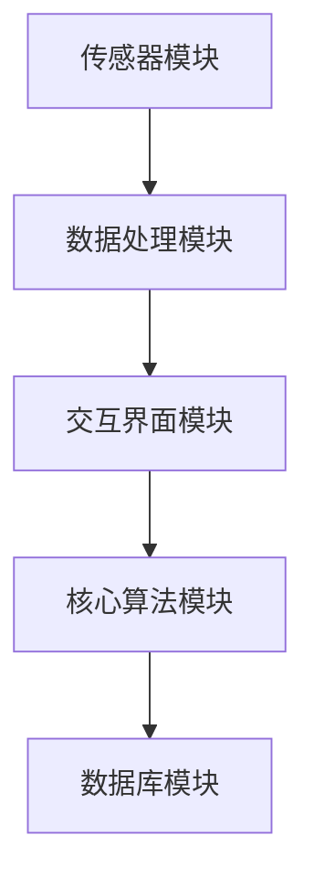
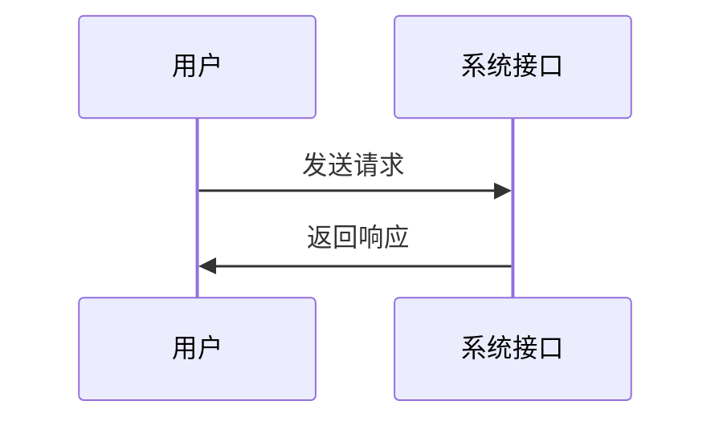

                 

### 目录

1. **引言：多模态人机交互系统的崛起**

2. **核心关键词：多模态、人机交互、系统、体验评测**

3. **摘要：构建一个全面的体验评测框架，推动多模态人机交互系统的发展**

### 引言：多模态人机交互系统的崛起

在数字化时代，人机交互技术不断发展，已经成为现代科技的重要组成部分。然而，传统的单模态人机交互系统在应对复杂、多变的用户需求时，往往显得力不从心。因此，多模态人机交互系统应运而生。

**多模态交互的概念**指的是同时使用两种或两种以上的感官输入和输出，如语音、文本、图像、手势等，以实现更加自然、高效的人机交互。这种交互方式不仅能够提高用户的体验，还能够扩展系统的功能和应用范围。

**问题背景**：随着人工智能、大数据、物联网等技术的发展，用户对交互体验的要求越来越高。他们希望能够在各种场景下，通过最自然、最便捷的方式与系统进行交流。单模态交互系统由于只能处理单一类型的输入输出，很难满足这些需求。因此，多模态交互系统成为了当前研究和应用的热点。

**问题描述**：多模态人机交互系统的设计实现面临诸多挑战。首先是如何有效地融合多种模态的数据，其次是如何设计出能够适应不同用户需求、不同应用场景的交互界面，最后是如何对系统进行有效的评测，以评估其用户体验。

**问题解决**：多模态人机交互系统的设计需要综合考虑多个方面的因素。首先，要明确系统的目标和需求，确定需要融合的模态类型和数据来源。其次，要设计出合适的交互界面，确保用户能够方便、快捷地与系统进行交互。最后，要构建一个全面的体验评测框架，对系统的用户体验进行评估和优化。

**边界与外延**：多模态人机交互系统不仅涉及到计算机科学、人工智能等领域，还与心理学、认知科学等学科密切相关。其应用范围广泛，包括智能家居、智能助手、虚拟现实、医疗健康等多个领域。

**概念结构与核心要素组成**：多模态人机交互系统主要由传感器、数据处理器、交互界面和用户四部分组成。传感器负责收集用户的输入数据，数据处理器对数据进行处理和分析，交互界面用于展示处理结果和反馈信息，用户则是系统的交互主体。

在接下来的章节中，我们将详细探讨多模态人机交互系统的设计实现、体验评测以及应用前景。希望本文能够为读者提供一个全面、系统的了解，推动多模态人机交互系统的进一步发展。

---

### 核心关键词：多模态、人机交互、系统、体验评测

多模态（Multi-modal）：多模态是指同时使用两种或两种以上的感官输入和输出，如语音、文本、图像、手势等，以实现更加自然、高效的人机交互。

人机交互（Human-Computer Interaction, HCI）：人机交互是指人与计算机系统之间的交互过程，涉及到用户与计算机之间的沟通、操作和响应。人机交互的目标是提高系统的易用性和用户体验。

系统（System）：系统是由多个组成部分相互关联、相互作用的整体，用于完成特定的任务。多模态人机交互系统是一个复杂的系统，包括传感器、数据处理、交互界面等多个部分。

体验评测（Experience Evaluation）：体验评测是对用户在使用系统过程中的主观体验进行评估和测量的过程。体验评测的目的是为了了解用户的满意度、易用性、可用性等方面，从而对系统进行优化和改进。

这些核心关键词构成了本文的主要内容，贯穿了多模态人机交互系统的设计、实现、评测和应用。通过详细探讨这些关键词，本文希望能够为读者提供一个全面、深入的了解，推动多模态人机交互系统的进一步发展。

---

### 摘要：构建一个全面的体验评测框架，推动多模态人机交互系统的发展

本文旨在构建一个全面的体验评测框架，以推动多模态人机交互系统的发展。多模态人机交互系统作为一种新兴的交互技术，具有提升用户体验、扩展应用场景等优势。然而，其设计和实现面临诸多挑战，如多模态数据的融合、交互界面的设计以及用户体验的评估等。本文首先介绍了多模态人机交互系统的背景、核心概念和设计实现方法。接着，重点探讨了如何构建一个全面的体验评测框架，包括评测指标、工具和方法。通过具体案例分析，本文展示了如何应用评测框架对多模态人机交互系统进行评估和优化。最后，本文对多模态人机交互系统的应用前景进行了展望，并提出了未来研究和应用的方向。本文的研究成果将为多模态人机交互系统的设计和优化提供重要参考，有助于推动该领域的进一步发展。

---

### 第一部分：背景介绍与核心概念

#### 第1章：多模态人机交互系统的背景

##### 1.1.1 问题背景

**人类交互需求的多样性**

随着信息技术的快速发展，人类对交互的需求越来越多样化。用户希望能够在各种场景下，通过不同的方式与系统进行交流。例如，在智能家居场景中，用户可能希望通过语音、手势、触摸等多种方式控制家电；在医疗健康领域，用户可能希望通过面部表情、语音、文字等多种方式与医生进行沟通。

**计算机技术的发展与瓶颈**

计算机技术的发展极大地推动了人机交互的进步。然而，传统的单模态人机交互系统在处理复杂、多变的用户需求时，往往存在一定的局限性。例如，语音识别系统在嘈杂环境下识别率较低，手势识别系统对精度和速度要求较高。因此，如何设计一个能够灵活应对多种交互需求的系统，成为了当前研究的热点。

**多模态交互的优势**

多模态交互系统通过融合多种感官输入和输出，可以实现更加自然、高效的人机交互。以下是一些多模态交互的优势：

1. **提高交互准确性**：通过融合多种感官输入，可以有效地提高系统的识别准确率。例如，在语音识别中，结合视觉信息可以减少环境噪音对识别结果的影响。

2. **增强用户体验**：多模态交互可以提供更加丰富的交互方式，让用户可以选择最适合自己的交互方式。例如，在智能助手场景中，用户可以通过语音、文本、手势等多种方式与系统进行交互。

3. **扩展应用场景**：多模态交互系统可以应用于更广泛的应用场景，如智能家居、智能医疗、智能交通等。

##### 1.1.2 问题描述

**多模态交互的概念**

多模态交互是指同时使用两种或两种以上的感官输入和输出，如语音、文本、图像、手势等，以实现更加自然、高效的人机交互。

**多模态交互的应用场景**

多模态交互系统可以应用于多种场景，包括但不限于：

1. **智能家居**：通过语音、手势等多种方式控制家电，实现智能化家居环境。
2. **智能医疗**：通过面部表情、语音等多种方式与医生进行沟通，提高诊断和治疗的准确性。
3. **智能交通**：通过视觉、语音等多种方式实现智能交通管理，提高交通效率。

**多模态交互系统的设计实现**

多模态交互系统的设计实现涉及多个方面，包括多模态数据采集、数据处理、交互界面设计等。以下是一些关键问题：

1. **多模态数据采集**：如何有效地采集多种感官输入数据，如语音、图像、手势等。
2. **数据处理**：如何对多模态数据进行处理，包括数据融合、特征提取等。
3. **交互界面设计**：如何设计一个适应多种交互方式的界面，提供良好的用户体验。

##### 1.1.3 问题解决

**多模态人机交互系统设计的关键**

1. **需求分析**：明确系统的目标和需求，确定需要融合的模态类型和数据来源。
2. **系统架构设计**：设计一个合理的系统架构，确保各模块之间的高效协作。
3. **用户体验设计**：设计一个适应多种交互方式的界面，提供良好的用户体验。

**系统设计与实现的挑战**

1. **多模态数据融合**：如何有效地融合多种模态数据，提高系统的整体性能。
2. **实时性能**：如何在保证实时性的同时，提供高质量的交互体验。
3. **系统可靠性**：如何提高系统的可靠性，减少故障和误操作。

##### 1.1.4 边界与外延

**多模态交互的技术分类**

多模态交互可以按照不同的分类标准进行划分，如按照模态类型（语音、文本、图像、手势等）、按照交互方式（输入、输出、输入输出等）等。

**多模态交互的应用领域**

多模态交互系统可以应用于多个领域，如智能家居、智能医疗、智能交通、教育、娱乐等。不同领域的应用对多模态交互系统有着不同的需求和要求。

##### 1.1.5 概念结构与核心要素组成

**多模态交互系统的组成部分**

多模态交互系统主要由以下部分组成：

1. **传感器模块**：负责采集多种感官输入数据，如语音、图像、手势等。
2. **数据处理模块**：负责对多模态数据进行处理，包括数据融合、特征提取等。
3. **交互界面模块**：负责与用户进行交互，提供交互界面和反馈。
4. **用户**：多模态交互系统的核心，通过多种方式与系统进行交互。

**各组成部分的功能与关系**

- **传感器模块**：采集多种感官输入数据，如语音、图像、手势等。
- **数据处理模块**：对多模态数据进行处理，包括数据融合、特征提取等。
- **交互界面模块**：提供交互界面和反馈，与用户进行交互。
- **用户**：通过多种方式与系统进行交互，如语音、手势、触摸等。

通过以上内容，我们初步了解了多模态人机交互系统的背景、核心概念和设计实现方法。在接下来的章节中，我们将进一步探讨多模态交互系统的核心概念和设计实现细节。

---

### 第2章：多模态人机交互系统的核心概念

#### 2.1.1 多模态交互原理

**多模态交互的基础知识**

多模态交互（Multi-modal Interaction）是基于人类日常交流模式的模拟和扩展。人类在进行交流时，会同时使用多种感官系统，如视觉、听觉、触觉等。这种多感官的协同工作使得人类能够更有效地理解和传达信息。因此，多模态交互系统的核心在于如何模拟和利用这种协同机制，以提高人机交互的自然性和效率。

**多模态数据融合的方法**

多模态交互系统的一个关键挑战在于如何有效地融合来自不同感官的数据。数据融合的方法可以分为以下几个步骤：

1. **数据采集**：通过多种传感器（如摄像头、麦克风、触摸屏等）收集不同模态的数据。
2. **数据预处理**：对采集到的数据进行滤波、去噪等处理，以提高数据质量。
3. **特征提取**：从预处理后的数据中提取具有区分性的特征，如语音信号的频谱特征、图像的边缘特征等。
4. **特征融合**：将不同模态的特征进行整合，形成统一的特征表示。常用的融合方法包括基于加权融合、投票融合和深度学习等方法。

**多模态交互的优势**

多模态交互具有以下优势：

- **提高准确性**：通过融合多种感官数据，可以有效地提高系统对用户意图的理解和识别准确性。
- **增强自然性**：多模态交互使得系统可以更自然地模拟人类的交流方式，提高用户体验。
- **扩展应用场景**：多模态交互系统可以应用于更加复杂和多样化的场景，如智能家居、智能医疗、智能交通等。

#### 2.1.2 多模态数据收集与处理

**数据采集技术**

多模态数据采集是构建多模态交互系统的基础。常见的数据采集技术包括：

- **语音采集**：使用麦克风进行语音信号的采集。为了提高采集质量，可以使用降噪技术和高质量的录音设备。
- **图像采集**：使用摄像头进行图像的采集。为了获取高质量图像，可以使用高分辨率摄像头，并进行图像增强处理。
- **手势采集**：使用深度摄像头或手势传感器进行手势的采集。为了提高采集精度，可以结合运动捕捉技术和计算机视觉算法。

**数据处理方法**

数据处理是多模态交互系统的核心环节，主要包括以下几个步骤：

1. **特征提取**：从采集到的多模态数据中提取具有区分性的特征。例如，从语音信号中提取频谱特征，从图像中提取边缘特征等。
2. **特征融合**：将不同模态的特征进行整合，形成统一的特征表示。常用的特征融合方法包括基于加权融合、投票融合和深度学习等方法。
3. **意图识别**：使用机器学习算法对融合后的特征进行分类，以识别用户的意图。常见的算法包括支持向量机（SVM）、决策树、神经网络等。

**多模态数据处理的挑战**

- **数据质量**：由于传感器设备的限制，采集到的数据可能存在噪声、缺失等问题，影响数据处理的效果。
- **实时性**：多模态数据处理需要在保证实时性的同时，提供高质量的结果。
- **准确性**：如何有效地融合不同模态的数据，以提高系统的识别准确性。

#### 2.1.3 多模态交互算法

**语音识别与合成**

语音识别是将语音信号转换为文本信息的技术，语音合成则是将文本信息转换为语音信号。多模态交互系统中，语音识别和合成是重要的组成部分。常见的语音识别算法包括隐马尔可夫模型（HMM）、循环神经网络（RNN）和深度神经网络（DNN）等。语音合成的算法则包括基于规则的方法、基于统计的方法和基于数据的生成模型。

**视觉识别与追踪**

视觉识别是将图像或视频中的对象识别出来，并确定其位置和属性。视觉追踪则是持续地跟踪一个或多个对象，即使对象在图像中发生遮挡或移动。常见的视觉识别算法包括卷积神经网络（CNN）和循环神经网络（RNN）等。视觉追踪算法则包括基于运动模型的方法、基于深度学习的方法和基于概率图模型的方法。

**多模态融合算法**

多模态融合算法是将不同模态的数据进行整合，以获得更准确和全面的信息。常见的融合方法包括基于加权融合、投票融合和深度学习等方法。基于加权融合的方法通过给不同模态的数据分配不同的权重来整合信息。投票融合方法则通过让不同模态的数据独立地处理信息，然后通过投票机制来确定最终的决策。深度学习方法通过构建多模态神经网络模型，直接学习多模态数据的融合方式。

通过以上内容，我们对多模态人机交互系统的核心概念有了更深入的了解。接下来，我们将探讨多模态人机交互系统的设计与实现，进一步探索其技术细节和应用。

---

### 第3章：多模态人机交互系统的设计与实现

#### 3.1.1 系统设计与架构

**系统设计原则**

多模态人机交互系统的设计应遵循以下原则：

1. **模块化设计**：系统应被设计为多个独立的模块，每个模块负责特定的功能。这样可以提高系统的可维护性和扩展性。
2. **用户中心设计**：系统设计应始终以用户为中心，确保系统易于使用、易于理解，并提供良好的用户体验。
3. **灵活性**：系统应具有足够的灵活性，以适应不同用户的需求和应用场景。

**系统架构设计**

多模态人机交互系统的架构通常包括以下几个主要组成部分：

1. **传感器模块**：负责采集多种感官输入，如语音、图像、手势等。
2. **数据处理模块**：负责对传感器采集到的数据进行处理，包括数据预处理、特征提取、数据融合等。
3. **交互界面模块**：负责与用户进行交互，提供用户操作的接口和反馈信息。
4. **核心算法模块**：负责处理用户的交互请求，进行意图识别、决策和反馈。
5. **数据库模块**：负责存储系统的数据，包括用户数据、系统配置和日志等。

系统架构设计的关键在于如何合理地组织这些模块，并确保它们之间的高效协作。以下是一个简化的多模态人机交互系统架构示例：



**模块化设计与协作**

在模块化设计中，每个模块都应独立实现其功能，并通过接口与系统中的其他模块进行通信。这种设计方式可以提高系统的可扩展性和可维护性。以下是一个模块化设计的示例：

- **传感器模块**：实现数据采集功能，包括语音、图像、手势等。
- **数据处理模块**：实现数据预处理、特征提取和融合功能。
- **交互界面模块**：实现用户交互功能，包括显示用户界面和处理用户输入。
- **核心算法模块**：实现意图识别、决策和反馈功能。
- **数据库模块**：实现数据存储和管理功能。

这些模块之间通过标准化的接口进行通信，如RESTful API、消息队列等。这样可以确保系统在不同模块之间的高效协作，并方便模块的替换和升级。

#### 3.1.2 系统功能设计

**功能模块划分**

多模态人机交互系统的功能模块划分应基于系统的核心功能和用户需求。以下是一个常见的功能模块划分示例：

1. **用户身份验证**：确保系统只能被授权用户访问和使用。
2. **语音识别与合成**：实现语音输入和输出的功能。
3. **图像识别与追踪**：实现图像输入的处理和识别。
4. **手势识别与操作**：实现手势输入的处理和识别。
5. **自然语言处理**：实现自然语言的理解和生成。
6. **用户界面**：提供友好的用户交互界面。
7. **系统配置与管理**：实现系统的配置和管理功能。

**功能实现细节**

每个功能模块的实现细节应满足系统的设计原则和功能需求。以下是一些具体的实现细节：

- **用户身份验证**：可以使用基于令牌的认证机制，如OAuth 2.0，确保用户身份的安全和隐私。
- **语音识别与合成**：可以使用开源语音识别库（如Mozilla TTS）和语音合成库（如Google Text-to-Speech）。
- **图像识别与追踪**：可以使用计算机视觉库（如OpenCV）实现图像处理和识别。
- **手势识别与操作**：可以使用基于深度学习的手势识别算法，如使用TensorFlow或PyTorch。
- **自然语言处理**：可以使用自然语言处理库（如NLTK或spaCy）实现文本分析和生成。
- **用户界面**：可以使用Web技术（如HTML、CSS和JavaScript）或原生应用开发框架（如React Native或Flutter）。
- **系统配置与管理**：可以使用配置文件（如JSON或YAML）进行系统配置，并使用管理后台实现系统管理功能。

通过以上内容，我们详细探讨了多模态人机交互系统的设计与架构设计原则、功能模块划分以及功能实现细节。在下一部分，我们将继续探讨系统接口设计，确保各模块之间的高效协作和数据传递。

---

### 第3章：多模态人机交互系统的设计与实现（续）

#### 3.1.3 系统接口设计

**接口规范**

系统接口设计是确保多模态人机交互系统各模块之间高效协作和数据传递的关键。接口规范应明确各模块的输入输出要求，并定义数据格式和传输协议。

1. **数据格式**：系统内部的数据格式应保持一致性，以便于数据处理和交换。常用的数据格式包括JSON、XML和Protocol Buffers。
2. **传输协议**：系统接口的传输协议应支持高效的数据传输和远程过程调用（RPC）。常用的传输协议包括HTTP/HTTPS、gRPC和WebSockets。

**接口实现方法**

以下是系统接口的实现方法：

1. **RESTful API**：使用RESTful设计风格，通过HTTP方法（如GET、POST、PUT、DELETE）实现数据的增删改查操作。RESTful API具有简单、易用、可扩展等优点。
2. **gRPC**：基于Google的gRPC框架，使用Protocol Buffers定义服务接口和消息格式，实现高效、可靠的远程过程调用。gRPC适用于高性能、跨语言的分布式系统。
3. **WebSocket**：使用WebSocket协议，实现双向、全双工的实时通信。WebSocket适用于实时性要求较高的应用，如在线聊天、实时监控等。

**接口设计示例**

以下是一个简单的接口设计示例：



**接口实现**

以下是使用Python和Flask框架实现的一个简单RESTful API接口示例：

```python
from flask import Flask, request, jsonify

app = Flask(__name__)

@app.route('/api/voice', methods=['POST'])
def handle_voice():
    voice_data = request.json
    # 处理语音数据
    result = process_voice(voice_data)
    return jsonify(result)

def process_voice(voice_data):
    # 语音数据处理逻辑
    return "处理完成"

if __name__ == '__main__':
    app.run(debug=True)
```

通过以上内容，我们详细探讨了多模态人机交互系统的接口设计规范、实现方法以及示例。在下一部分，我们将介绍如何通过具体的系统功能设计和实现，提高系统的整体性能和用户体验。

---

### 第4章：多模态人机交互系统的体验评测

#### 4.1.1 评测框架

**评测指标体系**

为了全面评估多模态人机交互系统的用户体验，我们需要建立一套完善的评测指标体系。以下是一些常见的评测指标：

1. **易用性（Usability）**：评估系统是否易于使用，包括用户对系统的学习成本、操作准确性和效率。
2. **可用性（Accessibility）**：评估系统是否能够满足不同用户的需求，包括老年人、残障人士和不同文化背景的用户。
3. **满意度（Satisfaction）**：评估用户对系统的整体满意度，包括对系统的功能、性能和交互体验的评价。
4. **学习曲线（Learning Curve）**：评估用户学习使用系统的难易程度，学习曲线较缓的系统通常更容易被用户接受。
5. **错误率（Error Rate）**：评估用户在操作过程中出现的错误次数和类型，错误率较低的系统通常更可靠。
6. **响应时间（Response Time）**：评估系统对用户操作的响应速度，响应时间较短的系统通常用户体验更好。

**评测流程设计**

一个完整的评测流程应包括以下步骤：

1. **定义评测目标**：明确评测的目标和范围，确定需要评估的系统功能、用户群体和评测指标。
2. **设计评测任务**：根据评测目标，设计模拟用户操作的评测任务，如语音命令识别、手势操作等。
3. **招募评测人员**：选择合适数量的评测人员，确保他们具有代表性和经验。
4. **执行评测任务**：让评测人员按照设计的任务进行操作，记录用户的操作过程和反馈。
5. **数据收集与分析**：收集评测过程中的数据，包括用户的操作记录、错误日志、用户反馈等，并对数据进行统计分析。
6. **报告生成**：根据分析结果，生成评测报告，包括评测指标的数据统计、用户反馈总结和改进建议。

通过以上评测流程，可以全面评估多模态人机交互系统的用户体验，发现存在的问题，并提出改进方案。

#### 4.1.2 评测工具与方法

**常用评测工具**

以下是一些常用的评测工具：

1. **用户体验测试工具**：如UsabilityHub、UserTesting等，用于进行在线用户测试和远程用户观察。
2. **性能测试工具**：如LoadRunner、JMeter等，用于评估系统的响应时间和稳定性。
3. **错误日志分析工具**：如Splunk、ELK堆栈等，用于收集和分析系统运行过程中的错误日志。
4. **用户反馈收集工具**：如SurveyMonkey、Typeform等，用于收集用户的反馈和建议。

**评测方法比较**

以下是一些常见的评测方法及其优缺点：

1. **用户测试**：通过观察用户在实际使用系统时的操作过程，收集用户反馈和错误记录。优点是能够真实反映用户的实际体验，缺点是需要大量时间和资源。
2. **可用性测试**：在实验室环境下，让用户按照预定的任务进行操作，评估系统的易用性和可用性。优点是可控性强，缺点是需要专业的评测人员。
3. **问卷调查**：通过在线问卷或纸质问卷收集用户的反馈和建议。优点是成本较低，缺点是数据可能不够真实和全面。
4. **A/B测试**：将用户分为两组，一组使用旧系统，另一组使用新系统，比较两组用户的体验和满意度。优点是能够直接比较不同版本的系统，缺点是用户群体可能存在偏差。

通过选择合适的评测工具和方法，可以有效地评估多模态人机交互系统的用户体验，为系统的改进提供有力支持。

#### 4.1.3 评测案例分析

**真实案例解析**

以下是一个多模态人机交互系统的评测案例分析：

**案例背景**：某智能家居系统采用多模态交互方式，支持语音、手势和触摸控制。为了评估系统的用户体验，进行了一项用户测试和问卷调查。

**评测任务**：让用户完成以下任务：
1. 通过语音控制智能灯光的开关。
2. 通过手势控制电视的开关和频道切换。
3. 通过触摸屏调整空调的温度。

**评测结果**：

1. **易用性**：用户对语音控制的满意度较高，认为语音识别准确、响应迅速。但部分用户对手势控制的准确性有担忧，认为在某些情况下，手势识别容易出现误操作。
2. **可用性**：用户对触摸屏控制的可用性表示满意，认为界面直观、操作方便。但部分老年用户认为手势控制较为复杂，需要更多时间学习。
3. **满意度**：整体上，用户对系统的满意度较高，认为多模态交互方式提供了更多选择，提高了交互体验。
4. **学习曲线**：用户对语音控制的接受度较高，学习曲线较缓。但对手势控制，部分用户表示需要更多时间熟悉。
5. **错误率**：用户在使用过程中，错误率较低，主要原因是操作不够熟练。

**评测结果分析**：

根据评测结果，我们可以得出以下结论：

1. **优势**：语音控制具有较高的准确性和用户体验，手势控制和触摸屏控制也受到了用户的认可。
2. **劣势**：手势控制存在一定的误操作风险，需要进一步优化识别算法和提高用户体验。
3. **改进建议**：为了提高系统的整体用户体验，建议优化手势识别算法，增加用户操作提示，降低学习曲线。

通过以上案例分析，我们可以看到如何通过具体的评测方法和工具，全面评估多模态人机交互系统的用户体验，发现存在的问题并提出改进方案。接下来，我们将继续探讨多模态人机交互系统的应用与展望。

---

### 第5章：多模态人机交互系统的应用与展望

#### 5.1.1 应用场景分析

多模态人机交互系统具有广泛的应用前景，可以应用于多个领域，包括但不限于：

**智能家居**：通过多模态交互系统，用户可以通过语音、手势和触摸等多种方式控制家电设备，实现智能家居的自动化和智能化。例如，通过语音控制灯光的开关、调整空调的温度、设置安防系统等。

**智能医疗**：多模态交互系统可以用于辅助医疗诊断和治疗。医生可以通过语音、图像和手势等多种方式与患者进行沟通，获取患者的病历信息、进行体检和诊断。此外，多模态交互系统还可以用于远程医疗，帮助医生跨越地域限制，为偏远地区的患者提供医疗服务。

**智能交通**：在智能交通领域，多模态交互系统可以用于交通管理、自动驾驶和智能导航。通过语音、手势和图像等多种方式，驾驶员可以与车辆进行交互，获取交通信息、控制车辆功能和进行导航。

**教育**：多模态交互系统可以用于教育领域，提供个性化、互动式的学习体验。学生可以通过语音、图像和手势等多种方式与教育系统进行交互，进行在线学习、互动讨论和模拟实验。

**娱乐**：多模态交互系统可以用于游戏、虚拟现实和增强现实等领域，提供沉浸式、互动式的娱乐体验。用户可以通过语音、手势和图像等多种方式与虚拟世界进行互动，创造丰富的娱乐体验。

#### 5.1.2 技术挑战与解决方案

**实时性能**：多模态交互系统需要在保证实时性能的同时，提供高质量的用户体验。这要求系统具有高效的算法和优化的硬件支持。解决方案包括使用并行计算、优化算法和数据结构、采用高性能处理器和图形处理器（GPU）等。

**数据融合**：多模态交互系统需要有效融合来自不同模态的数据，以提高系统的识别准确性和用户体验。这涉及到多种算法和技术，如特征提取、匹配和融合。解决方案包括使用深度学习模型、神经网络和传统机器学习方法等。

**用户体验**：多模态交互系统的用户体验取决于系统的设计、交互界面和反馈机制。为了提高用户体验，需要关注以下几个方面：

1. **界面设计**：设计直观、易用的界面，确保用户能够快速理解和使用系统。
2. **反馈机制**：提供及时、准确的反馈信息，帮助用户了解系统的状态和响应。
3. **个性化**：根据用户的需求和行为，提供个性化的交互方式和功能。

**隐私保护**：多模态交互系统涉及到用户的多种敏感信息，如语音、图像和生物特征等。因此，隐私保护成为重要的技术挑战。解决方案包括数据加密、访问控制和安全审计等。

#### 5.1.3 未来趋势与展望

随着人工智能、物联网和大数据等技术的发展，多模态人机交互系统将迎来更多的机遇和挑战。以下是一些未来趋势与展望：

**智能化**：多模态交互系统将越来越智能化，通过深度学习和强化学习等技术，系统能够更好地理解用户的意图和行为，提供更加个性化的交互体验。

**多语言支持**：多模态交互系统将支持更多语言，跨越语言障碍，实现全球范围内的应用。

**跨平台融合**：多模态交互系统将跨平台融合，集成到不同的设备和应用中，如智能手机、智能手表、智能家居设备和汽车等。

**个性化定制**：多模态交互系统将根据用户的需求和偏好，提供个性化的交互方案，提高用户体验。

**隐私安全**：随着用户对隐私保护的重视，多模态交互系统将加强隐私保护措施，确保用户信息的安全和隐私。

通过以上内容，我们探讨了多模态人机交互系统的应用场景、技术挑战、解决方案以及未来趋势。多模态人机交互系统的发展将为人类带来更加自然、高效、智能的交互体验，推动人工智能技术的进一步发展。

---

### 第6章：多模态人机交互系统的最佳实践

#### 6.1.1 设计最佳实践

在多模态人机交互系统的设计过程中，最佳实践可以大大提升系统的易用性、用户体验和可维护性。以下是一些关键的设计最佳实践：

**用户中心设计**：设计过程中始终以用户为中心，深入了解用户需求和行为，确保系统的交互界面和功能能够满足用户期望。可以通过用户访谈、问卷调查和用户测试等方式收集用户反馈，持续优化设计。

**模块化设计**：采用模块化设计，将系统划分为独立的模块，每个模块负责特定的功能。这种设计方式不仅提高了系统的可维护性，还便于模块的替换和升级。模块之间通过标准化的接口进行通信，确保系统的高效协作。

**灵活性设计**：设计时应考虑系统的灵活性和可扩展性，以应对未来可能的变化和新的需求。例如，在系统架构中预留扩展接口，以便于添加新的模态或功能模块。

**界面设计**：界面设计应简洁、直观，遵循一致性原则，使用户能够快速理解和使用系统。可以使用信息架构图和线框图等工具，对界面布局和交互流程进行可视化设计。

**反馈机制**：设计良好的反馈机制，及时响应用户的操作，提供明确的反馈信息。反馈可以是视觉、听觉或触觉形式，如弹出提示框、声音提示或振动等。

**错误处理**：设计合理的错误处理机制，确保系统在遇到错误时能够优雅地处理，避免用户困惑和系统崩溃。可以提供详细的错误信息和操作指南，帮助用户解决问题。

**可访问性**：确保系统对残障人士和不同文化背景的用户都具有良好的可访问性。可以使用无障碍设计原则，如高对比度、可定制化界面和语音导航等。

通过以上最佳实践，可以显著提升多模态人机交互系统的设计质量，为用户提供更好的使用体验。

#### 6.1.2 评测最佳实践

在多模态人机交互系统的评测过程中，最佳实践可以确保评测的全面性、准确性和有效性。以下是一些关键的评测最佳实践：

**定义明确的目标**：在评测前，明确评测的目标和范围，确定需要评估的系统功能、用户群体和评测指标。这有助于确保评测的针对性和有效性。

**设计合理的评测任务**：根据评测目标，设计模拟用户操作的评测任务，确保任务能够全面覆盖系统的各项功能。评测任务应具有代表性，能够真实反映用户的使用场景和操作行为。

**选择合适的评测方法**：根据系统的特点和评测需求，选择合适的评测方法，如用户测试、问卷调查、A/B测试等。不同的评测方法具有各自的优缺点，应结合实际情况进行选择。

**招募合适的评测人员**：选择具有代表性和经验丰富的评测人员，确保他们能够客观、准确地评估系统的用户体验。评测人员应具备相关的知识和技能，能够理解和执行评测任务。

**收集详细的数据**：在评测过程中，详细记录用户的操作行为、错误日志和用户反馈等信息。这些数据是分析评估结果的重要依据。

**数据分析与报告**：对收集到的数据进行分析，总结评测结果，形成详细的评测报告。报告应包括评测指标的数据统计、用户反馈总结和改进建议。

**持续迭代优化**：根据评测结果，对系统进行优化和改进。持续迭代优化，不断提高系统的用户体验。

通过以上最佳实践，可以确保多模态人机交互系统的评测过程科学、系统、有效，为系统的改进提供有力支持。

---

### 第6章：多模态人机交互系统的最佳实践（续）

#### 6.1.3 未来趋势与展望

随着科技的不断发展，多模态人机交互系统将在多个领域迎来新的机遇和挑战。以下是一些未来的趋势和展望：

**人工智能与机器学习的深入融合**：未来，多模态人机交互系统将更加依赖于人工智能和机器学习技术，特别是在语音识别、图像处理和自然语言理解等方面。通过深度学习、强化学习等算法的优化，系统将能够更准确地理解用户的意图，提供更加智能化的交互体验。

**跨平台与跨设备的融合**：多模态人机交互系统将不仅仅局限于单一设备或平台，而是实现跨平台和跨设备的融合。例如，用户可以在手机、平板、电脑、智能手表等多种设备上无缝切换，继续进行之前的交互任务。

**个性化与自适应**：未来，多模态人机交互系统将更加注重个性化与自适应。通过收集和分析用户的行为数据，系统将能够根据用户的需求和偏好，提供个性化的交互方案和体验。

**隐私保护与安全性**：随着用户对隐私和安全的重视，多模态人机交互系统将加强隐私保护和安全措施。例如，使用加密技术保护用户数据，实现用户身份验证和访问控制。

**人机协同工作**：多模态人机交互系统将不仅仅是一个独立的交互界面，而是成为人类工作的一部分。通过与用户的协同工作，系统将能够协助用户完成复杂任务，提高工作效率。

**新兴应用场景**：多模态人机交互系统将在新的应用场景中发挥作用，如智能农业、智慧城市、远程医疗等。在这些领域中，系统将能够通过多种交互方式，提供更加智能化和人性化的服务。

通过以上趋势和展望，我们可以看到多模态人机交互系统在未来的发展方向和潜在应用。随着技术的不断进步，多模态人机交互系统将为人们带来更加智能、便捷和个性化的交互体验。

---

### 第7章：小结与拓展阅读

#### 7.1.1 本书要点回顾

本书围绕多模态人机交互系统的设计与实现，全面探讨了其核心概念、设计原则、实现方法以及体验评测。以下是本书的主要要点回顾：

1. **多模态交互概念**：介绍了多模态交互的定义、优势和挑战。
2. **系统设计**：详细阐述了多模态交互系统的架构、功能模块划分和接口设计。
3. **数据采集与处理**：探讨了多模态数据采集技术、数据处理方法和特征提取。
4. **交互算法**：介绍了语音识别与合成、视觉识别与追踪等关键技术。
5. **体验评测**：建立了体验评测框架，包括评测指标体系、评测工具和方法。
6. **应用场景**：分析了多模态交互系统的应用领域和技术挑战。
7. **最佳实践**：提出了设计最佳实践和评测最佳实践，以及未来发展趋势。

通过本书的阅读，读者可以全面了解多模态人机交互系统的构建和优化，为实际应用和研究提供指导。

#### 7.1.2 拓展阅读

为了进一步深入了解多模态人机交互系统的相关技术和应用，读者可以参考以下书籍和研究论文：

1. **《多模态人机交互技术》**：本书详细介绍了多模态交互的理论基础、关键技术以及应用实例，适合对多模态交互感兴趣的读者。
2. **《人工智能与人机交互》**：本书探讨了人工智能技术在人机交互领域的应用，包括多模态交互、自然语言处理和计算机视觉等。
3. **论文《A Survey on Multi-modal Interaction in Human-Computer Interaction》**：该论文对多模态交互在人机交互领域的应用进行了系统综述，适合希望深入了解多模态交互技术的读者。
4. **《智能交互系统设计与实现》**：本书介绍了智能交互系统的设计方法、实现技术和实际应用，适合对智能交互系统感兴趣的读者。

通过阅读这些书籍和论文，读者可以进一步拓展对多模态人机交互系统的理解，为实际应用和研究提供更多参考。

---

### 作者信息

**作者：** AI天才研究院/AI Genius Institute & 禅与计算机程序设计艺术 /Zen And The Art of Computer Programming

---

**全文总结**

本文以《多模态人机交互系统体验评测框架》为标题，系统地探讨了多模态人机交互系统的背景、核心概念、设计与实现、体验评测、应用与展望以及最佳实践。通过深入分析多模态交互的优势和应用场景，本文介绍了多模态交互系统的设计与架构设计原则，详细阐述了数据采集与处理、交互算法、体验评测框架以及实际应用场景。此外，本文还提出了设计最佳实践和评测最佳实践，并展望了多模态人机交互系统的未来发展趋势。通过本文的阅读，读者可以全面了解多模态人机交互系统的构建和优化，为实际应用和研究提供指导。本文旨在推动多模态人机交互系统的发展，提升用户体验，为人工智能领域的发展贡献力量。

