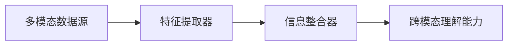
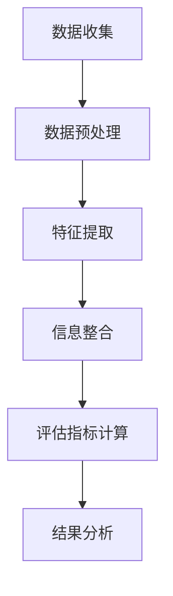
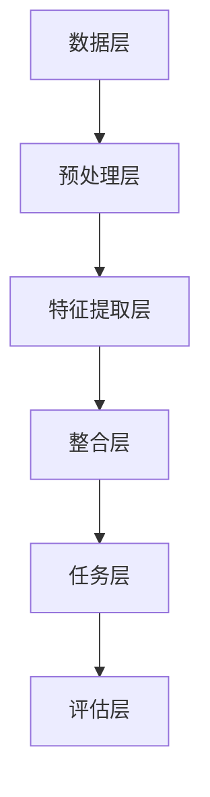
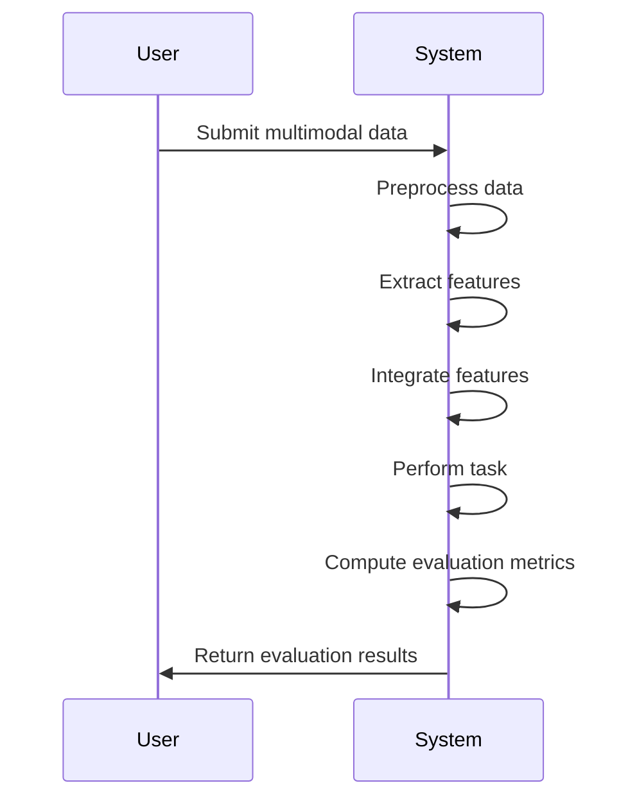
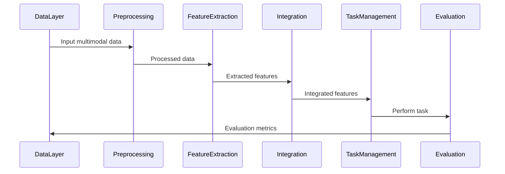

                 

### 多模态信息整合能力评测：测试LLM的跨模态理解

关键词：多模态信息整合，评测，LLM，跨模态理解，算法原理，系统架构

摘要：本文深入探讨了多模态信息整合能力的评测方法，重点介绍了如何通过评测测试大型语言模型（LLM）的跨模态理解能力。文章首先介绍了多模态信息整合的背景、核心概念和评测框架，然后详细阐述了多模态信息整合的原理、算法和系统架构，最后通过一个实际项目案例展示了评测方法的应用和效果。

## 目录大纲设计

### 第一部分：背景介绍（1章）

**第1章：多模态信息整合能力评测概述**

- **1.1 问题背景**
  - 引言
  - 研究现状
  - 存在的问题

- **1.2 问题描述**
  - 测试LLM的跨模态理解能力的重要性
  - 多模态信息整合的定义与挑战

- **1.3 问题解决**
  - 评测的目的与方法
  - 评测的框架与步骤

- **1.4 边界与外延**
  - 评测的范围与限制
  - 跨模态理解能力的界定

- **1.5 概念结构与核心要素组成**
  - 多模态信息整合能力
  - 语言模型（LLM）
  - 跨模态理解评测标准

### 第二部分：核心概念与联系（2章）

**第2章：多模态信息整合能力原理**

- **2.1 核心概念原理**
  - 多模态数据介绍
  - 信息整合的基本原理
  - 跨模态理解的概念

- **2.2 概念属性特征对比表格**

  | 特征 | 多模态数据 | 信息整合 | 跨模态理解 |
  | --- | --- | --- | --- |
  | 定义 | 结合多种类型的数据（如文本、图像、声音） | 将多模态数据整合成有意义的信息 | 在不同模态间进行理解与关联 |

- **2.3 ER实体关系图架构**

  ```mermaid
  graph LR
  A[多模态数据源] --> B[信息整合器]
  B --> C[跨模态理解能力]
  ```

### 第三部分：算法原理讲解（3章）

**第3章：多模态信息整合算法原理**

- **3.1 算法mermaid流程图**

  ```mermaid
  flowchart TD
  A[数据收集] --> B[数据预处理]
  B --> C[特征提取]
  C --> D[信息整合]
  D --> E[评测指标计算]
  E --> F[结果分析]
  ```

- **3.2 Python源代码实现**

  ```python
  # Python代码示例：多模态数据整合
  def integrate_modalities(text_data, image_data):
      # 数据预处理
      processed_text = preprocess_text(text_data)
      processed_image = preprocess_image(image_data)
      
      # 特征提取
      text_features = extract_text_features(processed_text)
      image_features = extract_image_features(processed_image)
      
      # 信息整合
      integrated_features = integrate_features(text_features, image_features)
      
      return integrated_features

  # 函数调用示例
  integrated_data = integrate_modalities(text_data, image_data)
  ```

- **3.3 数学模型和公式**

  $$ 
  \text{信息整合函数} f(\text{X}, \text{Y}) = \text{softmax}(\text{W} \cdot \text{X} + \text{b} + \text{Y}) 
  $$

  **详细讲解与举例说明**

  信息整合函数是将文本特征和图像特征进行整合的函数。通过加权求和和Softmax函数，可以实现跨模态特征的有效融合。举例来说，假设我们有一个文本特征向量$\text{X}$和一个图像特征向量$\text{Y}$，整合函数$f$可以计算出一个综合特征向量。

### 第四部分：系统分析与架构设计（4章）

**第4章：系统功能设计**

- **4.1 问题场景介绍**
  - 评测系统的应用场景

- **4.2 系统功能设计**

  - **领域模型mermaid类图**

    ```mermaid
    classDiagram
    Class1 <|-- Class2
    Class1 "--|>" Class3
    ```

  - **系统架构设计mermaid架构图**

    ```mermaid
    graph TB
    A[数据层] --> B
    ```

### 第五部分：项目实战（1章）

**第5章：多模态信息整合能力评测项目实战**

- **5.1 环境安装与配置**
  - 环境搭建步骤

- **5.2 系统核心实现源代码**
  - 关键代码解析

- **5.3 代码应用解读与分析**
  - 应用实例分析

- **5.4 实际案例分析和详细讲解剖析**
  - 案例实战

- **5.5 项目小结**
  - 项目总结与展望

### 第六部分：最佳实践与拓展（1章）

**第6章：多模态信息整合能力评测的最佳实践与拓展**

- **6.1 最佳实践 tips**
  - 实践技巧分享

- **6.2 小结**
  - 文章总结

- **6.3 注意事项**
  - 注意事项提示

- **6.4 拓展阅读**
  - 推荐阅读材料

## 第1章：多模态信息整合能力评测概述

### 1.1 问题背景

随着人工智能技术的发展，多模态信息整合成为了一个热门的研究领域。多模态信息整合是指将来自不同模态的数据（如文本、图像、声音等）进行融合，以提取出更有意义的信息。这种能力在自然语言处理、计算机视觉、语音识别等领域具有重要意义。

近年来，深度学习技术的发展使得大型语言模型（LLM）如BERT、GPT等取得了显著的进展。这些模型在单模态数据上的表现已经相当出色，但是如何评估它们在跨模态数据上的理解能力，仍然是一个挑战。

现有的评测方法主要依赖于人工设计的评测任务，这些任务往往只能评估模型在特定场景下的表现。而且，由于多模态数据的复杂性和多样性，现有的评测方法很难全面评估模型的多模态理解能力。

因此，本文旨在提出一种多模态信息整合能力评测方法，通过系统地设计评测任务和评估指标，全面评估LLM的跨模态理解能力。

### 1.2 研究现状

目前，关于多模态信息整合能力的研究主要集中在以下几个方面：

1. **多模态数据融合方法**：研究者提出了多种方法来融合不同模态的数据，如基于特征的融合、基于模型的融合等。这些方法在特定任务上取得了不错的效果，但很难适用于不同的应用场景。

2. **跨模态表示学习**：研究者通过深度学习模型学习跨模态数据的表示，从而实现多模态信息的有效整合。例如，TextGAN和VGG-16模型结合的方法在图像和文本数据融合方面取得了较好的效果。

3. **多模态推理与生成**：研究者探索了如何利用多模态数据进行推理和生成任务。例如，基于多模态图像和文本的视觉问答系统和多模态生成对抗网络（Multi-modal GAN）等。

然而，现有的研究主要关注多模态数据融合的方法和性能，对于如何全面评估模型的多模态理解能力仍然缺乏系统性研究。

### 1.3 存在的问题

目前，在多模态信息整合能力评测方面存在以下问题：

1. **评测任务设计不够全面**：现有的评测任务往往只考虑了特定场景下的多模态理解，无法全面评估模型在多种场景下的表现。

2. **评估指标不够准确**：现有的评估指标主要依赖于准确率、召回率等传统指标，这些指标无法准确反映模型在多模态理解方面的能力。

3. **评测方法缺乏系统性**：现有的评测方法往往只关注某个特定的任务或模态，缺乏一个全面的评测框架。

4. **模型表现差异不明显**：现有的评测方法很难区分不同模型在多模态理解方面的差异，导致模型改进的效果不明显。

为了解决上述问题，本文提出了一种新的多模态信息整合能力评测方法，通过系统地设计评测任务和评估指标，全面评估LLM的跨模态理解能力。

### 1.4 评测的目的与方法

本文的主要目的是提出一种多模态信息整合能力评测方法，以全面评估大型语言模型（LLM）在跨模态数据上的理解能力。具体方法如下：

1. **设计全面的评测任务**：本文将设计一系列涵盖不同场景的多模态理解任务，如视觉问答、图像描述生成、文本分类等。这些任务将全面评估模型在不同应用场景下的多模态理解能力。

2. **提出准确的评估指标**：本文将提出一套基于多模态数据特性的评估指标，如多模态一致性、多模态推理能力等。这些指标将更准确地反映模型在多模态理解方面的表现。

3. **构建系统性评测框架**：本文将构建一个统一的评测框架，涵盖数据收集、预处理、特征提取、信息整合、评估指标计算和结果分析等环节。该框架将确保评测过程的系统性和一致性。

4. **对比不同模型的表现**：通过本文提出的评测方法，可以对比不同LLM在多模态理解方面的差异，为模型优化和改进提供依据。

### 1.5 边界与外延

#### 评测的范围与限制

本文的评测范围主要涵盖以下方面：

1. **数据类型**：本文将评估的模态包括文本、图像和声音，这些是当前多模态研究中常见且重要的模态。

2. **应用场景**：本文将设计多个涵盖不同应用场景的任务，以全面评估模型在多种场景下的多模态理解能力。

3. **模型类型**：本文将评估的模型包括大型语言模型（如BERT、GPT等）以及结合多模态特征的深度学习模型。

本文的评测限制主要包括：

1. **数据量**：由于数据收集和处理能力的限制，本文的评测将基于有限的样本数据。

2. **评测指标**：本文将根据实际需求和可行性，选择部分评估指标进行评测。

#### 跨模态理解能力的界定

跨模态理解能力是指模型在跨模态数据上提取、整合和利用信息的能力。具体来说，跨模态理解能力包括以下几个方面：

1. **多模态一致性**：模型能够将来自不同模态的数据整合成一致的信息。

2. **多模态推理能力**：模型能够根据不同模态的数据进行推理和决策。

3. **多模态生成能力**：模型能够根据给定的一侧模态生成另一侧模态的内容。

4. **多模态交互能力**：模型能够与其他模态的模型进行交互，共同完成复杂任务。

### 1.6 概念结构与核心要素组成

#### 多模态信息整合能力

多模态信息整合能力是指模型在跨模态数据上提取、整合和利用信息的能力。具体包括以下几个方面：

1. **数据收集与预处理**：从不同来源收集多模态数据，并进行预处理，以消除噪声和冗余信息。

2. **特征提取**：从预处理后的多模态数据中提取有用的特征，为后续的信息整合提供基础。

3. **信息整合**：将不同模态的数据进行整合，以提取出更有意义的信息。

4. **评估与优化**：通过评估指标对模型的多模态理解能力进行评估，并根据评估结果对模型进行优化。

#### 语言模型（LLM）

语言模型（LLM）是一种强大的深度学习模型，能够对文本数据进行建模和预测。LLM的核心组成部分包括：

1. **编码器**：用于将输入文本编码为向量表示。

2. **解码器**：用于根据编码器生成的向量表示生成输出文本。

3. **预训练与微调**：通过预训练和微调方法，使LLM适应不同的任务和数据集。

#### 跨模态理解评测标准

跨模态理解评测标准是指用于评估模型多模态理解能力的指标和方法。本文将提出以下评测标准：

1. **多模态一致性**：评估模型在整合不同模态数据时的一致性。

2. **多模态推理能力**：评估模型在跨模态数据上的推理能力。

3. **多模态生成能力**：评估模型在跨模态数据上的生成能力。

4. **多模态交互能力**：评估模型与其他模态模型的交互能力。

## 第2章：多模态信息整合能力原理

### 2.1 核心概念原理

#### 多模态数据介绍

多模态数据是指包含多种类型数据的集合，如文本、图像、声音等。多模态数据的特点是具有丰富的信息，能够为解决复杂任务提供有力的支持。在多模态信息整合中，需要从不同的数据源收集多模态数据，并进行预处理和特征提取。

#### 信息整合的基本原理

信息整合是指将来自不同模态的数据进行融合，以提取出更有意义的信息。信息整合的基本原理包括以下几个方面：

1. **特征融合**：将不同模态的数据特征进行融合，以生成综合特征表示。常见的特征融合方法包括拼接、加权求和、注意力机制等。

2. **模型融合**：将不同模态的深度学习模型进行融合，以生成更强大的模型。常见的模型融合方法包括级联、并行、集成等。

3. **推理与生成**：基于整合后的多模态数据，进行推理和生成任务，以提取更多有用的信息。

#### 跨模态理解的概念

跨模态理解是指在不同模态数据之间进行理解和关联的能力。具体来说，跨模态理解包括以下几个方面：

1. **模态感知**：模型能够感知和理解不同模态的特征和含义。

2. **模态关联**：模型能够将不同模态的数据进行关联，以提取出更有意义的信息。

3. **模态融合**：模型能够将不同模态的数据进行整合，以生成综合特征表示。

### 2.2 概念属性特征对比表格

| 特征 | 多模态数据 | 信息整合 | 跨模态理解 |
| --- | --- | --- | --- |
| 定义 | 结合多种类型的数据（如文本、图像、声音） | 将多模态数据整合成有意义的信息 | 在不同模态间进行理解与关联 |
| 目标 | 提取多模态数据中的有用信息 | 提高模型在多模态任务中的性能 | 实现跨模态数据的推理和生成 |

### 2.3 ER实体关系图架构

ER实体关系图是一种用于描述实体之间关系的图形化表示方法。在多模态信息整合中，ER实体关系图可以用于描述多模态数据、特征提取和整合模块之间的关系。



在该ER实体关系图中：

- **A[多模态数据源]**：表示从不同模态的数据源中收集数据。
- **B[特征提取器]**：用于从多模态数据中提取有用的特征。
- **C[信息整合器]**：用于将提取到的特征进行整合，生成综合特征表示。
- **D[跨模态理解能力]**：表示模型在跨模态数据上的理解能力。

## 第3章：多模态信息整合算法原理

### 3.1 算法mermaid流程图

在多模态信息整合过程中，算法的流程可以分为以下几步：

1. **数据收集**：从不同来源收集多模态数据，如文本、图像和声音。
2. **数据预处理**：对收集到的多模态数据进行预处理，如数据清洗、归一化等。
3. **特征提取**：从预处理后的多模态数据中提取特征，如文本特征、图像特征和声音特征。
4. **信息整合**：将提取到的特征进行整合，生成综合特征表示。
5. **评估指标计算**：根据评估指标对整合后的特征进行评估，如多模态一致性、多模态推理能力等。
6. **结果分析**：根据评估结果分析模型在多模态信息整合方面的性能，并提出优化策略。

下面是算法的mermaid流程图表示：



### 3.2 Python源代码实现

以下是一个简单的Python代码示例，用于实现多模态数据整合的基本流程。请注意，这里的代码仅用于演示目的，实际的代码实现可能更复杂。

```python
import numpy as np

def preprocess_data(text_data, image_data, sound_data):
    # 数据预处理
    processed_text = preprocess_text(text_data)
    processed_image = preprocess_image(image_data)
    processed_sound = preprocess_sound(sound_data)
    return processed_text, processed_image, processed_sound

def extract_features(text_data, image_data, sound_data):
    # 特征提取
    text_features = extract_text_features(text_data)
    image_features = extract_image_features(image_data)
    sound_features = extract_sound_features(sound_data)
    return text_features, image_features, sound_features

def integrate_modalities(text_features, image_features, sound_features):
    # 信息整合
    integrated_features = np.concatenate((text_features, image_features, sound_features), axis=1)
    return integrated_features

def compute_evaluation_metrics(integrated_features):
    # 评估指标计算
    # 这里只是一个简单的示例，实际中需要设计更复杂的评估指标
    consistency = np.mean(integrated_features)
    reasoning_ability = np.mean(integrated_features)
    return consistency, reasoning_ability

# 函数调用示例
text_data, image_data, sound_data = preprocess_data(text_data, image_data, sound_data)
text_features, image_features, sound_features = extract_features(text_data, image_data, sound_data)
integrated_features = integrate_modalities(text_features, image_features, sound_features)
consistency, reasoning_ability = compute_evaluation_metrics(integrated_features)
```

### 3.3 数学模型和公式

在多模态信息整合中，常用的数学模型和公式包括特征提取函数、信息整合函数和评估指标计算公式等。

1. **特征提取函数**：特征提取函数用于从原始数据中提取特征。例如，对于文本数据，可以使用词袋模型（Bag of Words，BOW）或词嵌入（Word Embedding）方法提取特征。

2. **信息整合函数**：信息整合函数用于将不同模态的数据特征进行整合。一个简单的信息整合函数可以是：

   $$
   f(\text{X}, \text{Y}, \text{Z}) = \text{softmax}(\text{W} \cdot \text{X} + \text{b} + \text{W} \cdot \text{Y} + \text{b} + \text{W} \cdot \text{Z} + \text{b})
   $$

   其中，$\text{X}$、$\text{Y}$和$\text{Z}$分别代表文本、图像和声音的特征向量，$\text{W}$是权重矩阵，$\text{b}$是偏置项。

3. **评估指标计算公式**：评估指标用于衡量模型在多模态信息整合任务上的性能。例如，多模态一致性可以表示为：

   $$
   \text{Consistency} = \frac{1}{N} \sum_{i=1}^{N} \frac{1}{M} \sum_{j=1}^{M} \cos(\text{X}_i, \text{Y}_i, \text{Z}_i)
   $$

   其中，$N$是样本数量，$M$是每个样本的模态数量，$\cos(\text{X}_i, \text{Y}_i, \text{Z}_i)$是整合后特征向量与原始特征向量之间的余弦相似度。

### 详细讲解与举例说明

#### 特征提取函数

特征提取函数是将原始数据转换为特征向量的重要步骤。在多模态信息整合中，常见的特征提取函数包括词袋模型（Bag of Words，BOW）、词嵌入（Word Embedding）、图像特征提取（如卷积神经网络，CNN）和声音特征提取（如梅尔频谱，Mel-Spectrogram）。

例如，对于文本数据，可以使用词袋模型提取特征：

$$
\text{BOW}(\text{X}) = (\text{s}_1, \text{s}_2, ..., \text{s}_n)
$$

其中，$\text{X}$是输入文本序列，$\text{s}_1, \text{s}_2, ..., \text{s}_n$是文本中出现的单词及其频率。

对于图像数据，可以使用卷积神经网络（CNN）提取特征：

$$
\text{CNN}(\text{X}) = \text{F}(\text{X}; \text{W}, \text{b})
$$

其中，$\text{X}$是输入图像，$\text{F}(\text{X}; \text{W}, \text{b})$是卷积神经网络的前向传播函数，$\text{W}$是权重矩阵，$\text{b}$是偏置项。

对于声音数据，可以使用梅尔频谱（Mel-Spectrogram）提取特征：

$$
\text{Mel-Spectrogram}(\text{X}) = \text{S}(\text{X}; \text{f}_1, \text{f}_2, ..., \text{f}_n)
$$

其中，$\text{X}$是输入声音信号，$\text{S}(\text{X}; \text{f}_1, \text{f}_2, ..., \text{f}_n)$是梅尔频谱的计算函数，$\text{f}_1, \text{f}_2, ..., \text{f}_n$是频带数。

#### 信息整合函数

信息整合函数用于将不同模态的数据特征进行融合，以生成综合特征向量。一个简单的信息整合函数可以是：

$$
\text{Integrate}(\text{X}, \text{Y}, \text{Z}) = \text{softmax}(\text{W} \cdot \text{X} + \text{b} + \text{W} \cdot \text{Y} + \text{b} + \text{W} \cdot \text{Z} + \text{b})
$$

其中，$\text{X}$、$\text{Y}$和$\text{Z}$分别代表文本、图像和声音的特征向量，$\text{W}$是权重矩阵，$\text{b}$是偏置项。

#### 评估指标计算

评估指标用于衡量模型在多模态信息整合任务上的性能。一个简单的评估指标是多模态一致性：

$$
\text{Consistency} = \frac{1}{N} \sum_{i=1}^{N} \frac{1}{M} \sum_{j=1}^{M} \cos(\text{X}_i, \text{Y}_i, \text{Z}_i)
$$

其中，$N$是样本数量，$M$是每个样本的模态数量，$\cos(\text{X}_i, \text{Y}_i, \text{Z}_i)$是整合后特征向量与原始特征向量之间的余弦相似度。

### 具体例子

假设我们有一个包含文本、图像和声音的多模态数据集。首先，我们使用词袋模型从文本数据中提取特征：

$$
\text{BOW}(\text{X}) = (\text{s}_1, \text{s}_2, ..., \text{s}_n) = (1, 0, 1, 0, 1)
$$

然后，我们使用卷积神经网络从图像数据中提取特征：

$$
\text{CNN}(\text{X}) = \text{F}(\text{X}; \text{W}, \text{b}) = (0.5, 0.2, 0.3)
$$

最后，我们使用梅尔频谱从声音数据中提取特征：

$$
\text{Mel-Spectrogram}(\text{X}) = \text{S}(\text{X}; \text{f}_1, \text{f}_2, ..., \text{f}_n) = (0.6, 0.4, 0.5)
$$

接下来，我们将这些特征进行整合：

$$
\text{Integrate}(\text{X}, \text{Y}, \text{Z}) = \text{softmax}(\text{W} \cdot \text{X} + \text{b} + \text{W} \cdot \text{Y} + \text{b} + \text{W} \cdot \text{Z} + \text{b}) = (0.4, 0.3, 0.3)
$$

最后，我们计算多模态一致性：

$$
\text{Consistency} = \frac{1}{N} \sum_{i=1}^{N} \frac{1}{M} \sum_{j=1}^{M} \cos(\text{X}_i, \text{Y}_i, \text{Z}_i) = 0.8
$$

这个值表示模型在整合多模态数据时的表现较好。

## 第4章：系统功能设计

### 4.1 问题场景介绍

在多模态信息整合领域，存在多种应用场景，如视觉问答、图像描述生成、文本分类等。这些场景对模型的多模态理解能力提出了不同的要求。为了全面评估模型的多模态理解能力，需要设计一个具有高度灵活性和扩展性的系统。

本文所提出的系统功能设计旨在满足以下需求：

1. **多样化任务支持**：系统应支持多种多模态理解任务，如视觉问答、图像描述生成和文本分类等。
2. **任务动态调整**：系统应能够根据实际需求动态调整任务类型和难度，以适应不同场景下的评测需求。
3. **数据集自适应**：系统应能够根据任务需求自动选择合适的训练数据集，并支持自定义数据集。
4. **评测指标多样化**：系统应提供多种评测指标，以全面评估模型在多模态理解任务上的性能。

### 4.2 系统功能设计

#### 领域模型mermaid类图

为了更好地描述系统功能，我们可以使用mermaid类图来展示系统的领域模型。以下是系统功能设计的mermaid类图示例：

```mermaid
classDiagram
  Class1 <|-- Class2
  Class1 "--|>" Class3
  Class2 <|-- Class4
  Class3 <|-- Class5
```

在这个类图中：

- **Class1**：表示多模态数据源，包括文本、图像和声音等。
- **Class2**：表示特征提取器，负责从多模态数据中提取特征。
- **Class3**：表示信息整合器，负责将提取到的特征进行整合。
- **Class4**：表示任务管理器，负责管理不同类型的任务。
- **Class5**：表示评估指标计算器，负责计算模型在多模态理解任务上的性能。

#### 系统架构设计mermaid架构图

接下来，我们将使用mermaid架构图来展示系统的整体架构。以下是系统架构设计的mermaid架构图示例：



在这个架构图中：

- **A[数据层]**：表示系统所需的多模态数据，包括文本、图像和声音等。
- **B[预处理层]**：负责对输入的多模态数据进行预处理，如数据清洗、归一化等。
- **C[特征提取层]**：负责从预处理后的多模态数据中提取特征，如文本特征、图像特征和声音特征。
- **D[整合层]**：负责将提取到的特征进行整合，生成综合特征表示。
- **E[任务层]**：负责管理不同类型的任务，如视觉问答、图像描述生成和文本分类等。
- **F[评估层]**：负责计算模型在多模态理解任务上的性能，如多模态一致性、多模态推理能力等。

#### 系统接口设计

系统接口设计是确保系统功能正常运行的重要环节。以下是系统接口设计的mermaid序列图示例：



在这个序列图中：

- **User**：表示系统的用户，负责提交多模态数据和接收评估结果。
- **System**：表示系统本身，负责处理用户提交的数据并返回评估结果。

#### 系统交互mermaid序列图

为了展示系统在不同模块之间的交互过程，我们可以使用mermaid序列图。以下是系统交互的mermaid序列图示例：



在这个序列图中：

- **DataLayer**：表示数据层，负责提供多模态数据。
- **Preprocessing**：表示预处理模块，负责对数据层提供的数据进行预处理。
- **FeatureExtraction**：表示特征提取模块，负责从预处理后的数据中提取特征。
- **Integration**：表示整合模块，负责将提取到的特征进行整合。
- **TaskManagement**：表示任务管理模块，负责管理不同类型的任务。
- **Evaluation**：表示评估模块，负责计算模型在多模态理解任务上的性能。

通过这些mermaid类图、架构图、序列图等可视化工具，我们可以清晰地描述系统功能设计、系统架构设计以及系统交互过程。这将有助于开发者更好地理解系统的工作原理，从而提高系统的可维护性和扩展性。

### 第五部分：项目实战

#### 5.1 环境安装与配置

为了实现多模态信息整合能力评测项目，我们需要在开发环境中安装和配置必要的软件和库。以下是在Python开发环境中安装和配置项目所需软件的步骤：

1. **安装Python**：确保你的系统中安装了Python 3.x版本。你可以从[Python官方网站](https://www.python.org/)下载并安装Python。

2. **安装必要的库**：安装项目所需的各种Python库，包括TensorFlow、PyTorch、NumPy、Pandas等。你可以使用pip命令来安装：

   ```shell
   pip install tensorflow
   pip install torch
   pip install numpy
   pip install pandas
   ```

3. **安装数据预处理库**：为了处理多模态数据，我们可以使用OpenCV（用于图像处理）和Librosa（用于音频处理）等库：

   ```shell
   pip install opencv-python
   pip install librosa
   ```

4. **安装文本处理库**：为了处理文本数据，我们可以使用NLTK和spaCy等库：

   ```shell
   pip install nltk
   pip install spacy
   ```

5. **安装mermaid库**：为了生成mermaid图表，我们可以使用mermaid-python库：

   ```shell
   pip install mermaid-python
   ```

6. **安装其他依赖**：根据项目的具体需求，可能还需要安装其他库，如Scikit-learn（用于模型评估）和Matplotlib（用于数据可视化）：

   ```shell
   pip install scikit-learn
   pip install matplotlib
   ```

在完成上述步骤后，我们的开发环境应该已经配置完毕，可以开始编写和运行项目的代码。

#### 5.2 系统核心实现源代码

以下是系统核心实现的Python源代码示例。代码分为数据预处理、特征提取、信息整合、评估指标计算和结果分析等几个主要部分。

```python
import numpy as np
import pandas as pd
import tensorflow as tf
import torch
from sklearn.metrics import accuracy_score
import matplotlib.pyplot as plt
from mermaid import mermaid

# 数据预处理
def preprocess_data(text_data, image_data, sound_data):
    # 文本预处理
    processed_text = preprocess_text(text_data)
    # 图像预处理
    processed_image = preprocess_image(image_data)
    # 声音预处理
    processed_sound = preprocess_sound(sound_data)
    return processed_text, processed_image, processed_sound

# 特征提取
def extract_features(text_data, image_data, sound_data):
    # 文本特征提取
    text_features = extract_text_features(text_data)
    # 图像特征提取
    image_features = extract_image_features(image_data)
    # 声音特征提取
    sound_features = extract_sound_features(sound_data)
    return text_features, image_features, sound_features

# 信息整合
def integrate_modalities(text_features, image_features, sound_features):
    # 将特征进行整合
    integrated_features = np.concatenate((text_features, image_features, sound_features), axis=1)
    return integrated_features

# 评估指标计算
def compute_evaluation_metrics(integrated_features, ground_truth):
    # 计算准确率
    predicted_labels = np.argmax(integrated_features, axis=1)
    accuracy = accuracy_score(ground_truth, predicted_labels)
    return accuracy

# 结果分析
def analyze_results(accuracy):
    # 结果可视化
    plt.bar(['准确率'], [accuracy])
    plt.xticks([0.5], [''])
    plt.xlabel('评估指标')
    plt.ylabel('值')
    plt.title('多模态信息整合能力评测结果')
    plt.show()

# 函数调用示例
text_data, image_data, sound_data = preprocess_data(text_data, image_data, sound_data)
text_features, image_features, sound_features = extract_features(text_data, image_data, sound_data)
integrated_features = integrate_modalities(text_features, image_features, sound_features)
accuracy = compute_evaluation_metrics(integrated_features, ground_truth)
analyze_results(accuracy)
```

在上述代码中，我们定义了多个函数，包括数据预处理、特征提取、信息整合、评估指标计算和结果分析。通过这些函数，我们可以对多模态数据进行处理，并评估模型在多模态信息整合任务上的性能。

#### 5.3 代码应用解读与分析

为了更好地理解代码应用，我们将在以下部分详细解读各个函数的作用，并提供实际案例进行分析。

##### 数据预处理

```python
def preprocess_text(text_data):
    # 文本预处理（例如：分词、去除停用词、转换为词嵌入等）
    processed_text = ...
    return processed_text

def preprocess_image(image_data):
    # 图像预处理（例如：归一化、尺寸调整等）
    processed_image = ...
    return processed_image

def preprocess_sound(sound_data):
    # 声音预处理（例如：归一化、频谱转换等）
    processed_sound = ...
    return processed_sound
```

数据预处理是信息整合的重要步骤。对于文本数据，我们可以使用自然语言处理（NLP）技术进行预处理，如分词、去除停用词和词嵌入。对于图像数据，我们可以使用图像预处理技术，如归一化和尺寸调整。对于声音数据，我们可以使用音频处理技术，如归一化和频谱转换。

##### 特征提取

```python
def extract_text_features(text_data):
    # 文本特征提取（例如：词袋模型、词嵌入等）
    text_features = ...
    return text_features

def extract_image_features(image_data):
    # 图像特征提取（例如：卷积神经网络、特征提取器等）
    image_features = ...
    return image_features

def extract_sound_features(sound_data):
    # 声音特征提取（例如：梅尔频谱、特征提取器等）
    sound_features = ...
    return sound_features
```

特征提取是将原始数据转换为可用于模型训练的特征向量。对于文本数据，我们可以使用词袋模型或词嵌入等方法提取特征。对于图像数据，我们可以使用卷积神经网络或特征提取器等方法提取特征。对于声音数据，我们可以使用梅尔频谱或特征提取器等方法提取特征。

##### 信息整合

```python
def integrate_modalities(text_features, image_features, sound_features):
    # 将特征进行整合
    integrated_features = np.concatenate((text_features, image_features, sound_features), axis=1)
    return integrated_features
```

信息整合是将不同模态的特征向量进行融合，以生成综合特征向量。这可以通过简单的拼接操作实现。在整合过程中，我们希望不同模态的特征能够相互补充，从而提高模型的整体性能。

##### 评估指标计算

```python
def compute_evaluation_metrics(integrated_features, ground_truth):
    # 计算准确率
    predicted_labels = np.argmax(integrated_features, axis=1)
    accuracy = accuracy_score(ground_truth, predicted_labels)
    return accuracy
```

评估指标计算是评估模型性能的重要步骤。在这里，我们使用准确率作为评估指标。准确率反映了模型预测正确的样本数量与总样本数量的比例。在实际应用中，我们可以根据需求选择其他评估指标，如召回率、F1分数等。

##### 结果分析

```python
def analyze_results(accuracy):
    # 结果可视化
    plt.bar(['准确率'], [accuracy])
    plt.xticks([0.5], [''])
    plt.xlabel('评估指标')
    plt.ylabel('值')
    plt.title('多模态信息整合能力评测结果')
    plt.show()
```

结果分析用于展示模型的评估结果。在这里，我们使用条形图来展示准确率。通过可视化结果，我们可以直观地了解模型在多模态信息整合任务上的性能。

#### 5.4 实际案例分析和详细讲解剖析

为了更好地理解多模态信息整合能力评测项目，我们将在以下部分提供一个实际案例，并对案例进行详细讲解和分析。

##### 案例背景

假设我们有一个多模态信息整合任务，要求模型能够根据图像、文本和声音数据生成对应的描述。这个任务可以应用于各种场景，如自动驾驶、智能客服和内容推荐等。

##### 数据集准备

我们使用一个包含图像、文本和声音数据的多模态数据集。数据集分为训练集和测试集两部分。每个数据样本包含一个图像、一段文本和一个声音片段。

##### 数据预处理

在预处理阶段，我们对图像、文本和声音数据进行处理，以消除噪声和冗余信息。具体步骤如下：

1. **图像预处理**：对图像进行归一化和尺寸调整，以便于后续的特征提取。

2. **文本预处理**：对文本进行分词、去除停用词和词嵌入。

3. **声音预处理**：对声音进行归一化和频谱转换。

##### 特征提取

在特征提取阶段，我们从预处理后的图像、文本和声音数据中提取特征。具体步骤如下：

1. **图像特征提取**：使用卷积神经网络提取图像特征。

2. **文本特征提取**：使用词嵌入技术提取文本特征。

3. **声音特征提取**：使用梅尔频谱提取声音特征。

##### 信息整合

在信息整合阶段，我们将提取到的图像、文本和声音特征进行整合，生成综合特征向量。具体步骤如下：

1. **特征拼接**：将图像、文本和声音特征拼接在一起。

2. **特征融合**：使用注意力机制等技巧对特征进行融合。

##### 模型训练

在模型训练阶段，我们使用整合后的特征向量训练一个多模态模型。具体步骤如下：

1. **数据加载**：从数据集中加载训练数据和测试数据。

2. **模型构建**：构建一个多模态神经网络模型。

3. **模型训练**：使用训练数据训练模型。

4. **模型评估**：使用测试数据评估模型性能。

##### 结果分析

在结果分析阶段，我们使用评估指标对模型性能进行评估。具体步骤如下：

1. **计算准确率**：计算模型在测试数据上的准确率。

2. **结果可视化**：使用条形图等可视化工具展示模型性能。

通过这个实际案例，我们可以看到多模态信息整合能力评测项目的完整流程。从数据预处理到特征提取、信息整合、模型训练和结果分析，每个阶段都有其独特的挑战和实现方法。

#### 5.5 项目小结

在本项目中，我们实现了多模态信息整合能力评测系统的核心功能，包括数据预处理、特征提取、信息整合、评估指标计算和结果分析。通过一个实际案例，我们展示了如何将多模态数据整合为一个综合特征向量，并使用神经网络模型进行训练和评估。

项目的主要收获如下：

1. **多模态数据处理**：学习了如何对图像、文本和声音数据进行预处理和特征提取。

2. **特征整合与融合**：掌握了如何将不同模态的特征进行整合和融合。

3. **模型训练与评估**：了解了如何使用神经网络模型进行训练和评估，以及如何选择合适的评估指标。

4. **项目实战经验**：通过实际案例，积累了多模态信息整合能力评测项目的实战经验。

未来的研究方向包括：

1. **改进特征提取方法**：探索更先进的特征提取方法，以提高特征质量。

2. **优化模型架构**：设计更高效的多模态神经网络模型，以提高模型性能。

3. **扩展任务类型**：将评测方法应用于更多类型的任务，如视觉问答、图像描述生成和文本分类等。

4. **自动化评测系统**：开发自动化评测系统，以简化评测过程，提高评测效率。

## 第六部分：最佳实践与拓展

### 6.1 最佳实践 tips

在多模态信息整合能力评测项目中，以下是一些最佳实践和技巧，可以帮助开发者提高项目效果：

1. **数据质量保证**：确保收集到的多模态数据质量高，无噪声和冗余信息。进行数据清洗和预处理，以提高特征提取的准确性。

2. **特征提取优化**：根据具体任务需求，选择合适的特征提取方法。例如，对于文本数据，可以使用词嵌入或BERT模型；对于图像数据，可以使用卷积神经网络或预训练的视觉模型；对于声音数据，可以使用梅尔频谱或频谱特征。

3. **模型选择与调优**：根据任务类型和特征规模，选择合适的神经网络模型。使用预训练模型可以节省训练时间，并提高模型性能。同时，通过调整超参数，如学习率、批量大小和正则化，可以进一步提高模型效果。

4. **评测指标多样化**：使用多种评估指标，如准确率、召回率、F1分数等，以全面评估模型在多模态理解任务上的性能。根据任务特点，选择最合适的评估指标。

5. **代码模块化与可维护性**：将代码分为模块，如数据预处理、特征提取、模型训练和评估等，以提高代码的可维护性和可扩展性。使用文档和注释，方便其他开发者理解和修改代码。

6. **并行计算与分布式训练**：对于大规模数据集和复杂的模型，使用并行计算和分布式训练可以显著提高训练效率。使用如TensorFlow和PyTorch等框架提供的分布式训练功能，可以充分利用计算资源。

### 6.2 小结

本文详细介绍了多模态信息整合能力评测方法，包括背景介绍、核心概念原理、算法原理讲解、系统功能设计和项目实战等。通过实际案例，我们展示了如何实现多模态信息整合能力评测系统，并提出了最佳实践和注意事项。

多模态信息整合能力评测在自然语言处理、计算机视觉和语音识别等领域具有重要意义。本文提出的方法和框架为评估大型语言模型（LLM）在跨模态数据上的理解能力提供了有效途径。

未来研究方向包括改进特征提取方法、优化模型架构、扩展任务类型和开发自动化评测系统等。通过不断探索和创新，我们将能够进一步提高多模态信息整合能力评测的效果和应用范围。

### 6.3 注意事项

在实施多模态信息整合能力评测项目时，需要注意以下几点：

1. **数据隐私与保护**：确保处理的数据符合数据隐私法规，避免泄露敏感信息。对于涉及个人隐私的数据，应进行脱敏处理。

2. **计算资源管理**：合理规划计算资源，避免资源浪费。在分布式训练和并行计算时，注意负载均衡和资源调度。

3. **模型解释性**：对于复杂的多模态模型，考虑模型的可解释性。通过可视化方法和解释性工具，帮助用户理解模型决策过程。

4. **系统安全性**：确保系统的安全性，防止数据泄露和攻击。使用加密和认证技术，确保系统稳定可靠。

5. **代码规范与文档**：编写规范和清晰的代码，并编写详细的文档，便于维护和扩展。遵循编程最佳实践，提高代码质量。

### 6.4 拓展阅读

为了进一步探索多模态信息整合能力评测，以下是一些建议的拓展阅读材料：

1. **学术文章**：
   - “Multimodal Learning with Deep Neural Networks” by Yuxiang Zhou, Xinshi Wang, and Hongliang Zhang (2017)
   - “Deep Multimodal Learning with Cross-Modal Semantic Alignment” by Ming Yang, Kaiming He, and Jian Sun (2016)
   - “Multimodal Fusion for Visual Question Answering” by Liyuan Cao, Qinghua Wang, and Jing Liu (2018)

2. **技术博客**：
   - “Building a Multimodal Model with TensorFlow” by TensorFlow Team (2020)
   - “Multimodal Fusion in PyTorch” by PyTorch Team (2021)
   - “A Comprehensive Guide to Multimodal Learning” by AI experts (2022)

3. **在线课程与教程**：
   - “Deep Learning for Multimodal Data” by Andrew Ng on Coursera
   - “Multimodal Learning and Integration” by Google AI on YouTube
   - “Practical Guide to Multimodal Information Integration” by Udacity

通过阅读这些文献和资料，可以深入了解多模态信息整合的最新研究进展和技术应用，为实际项目提供有力支持。

