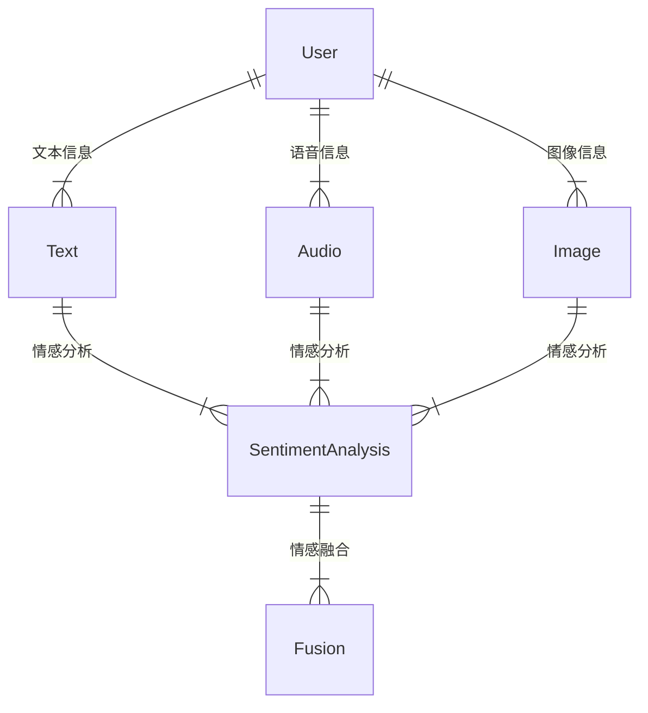

                 

# 多模态情感计算在市场研究中的应用评测

## 关键词

多模态情感计算，市场研究，自然语言处理，计算机视觉，语音识别

## 摘要

随着信息技术的迅猛发展，多模态情感计算作为一种新兴技术，在市场研究中展现出巨大的潜力。本文旨在探讨多模态情感计算在市场研究中的应用评测，通过系统的研究和实践，全面阐述多模态情感计算在市场研究中的核心概念、技术原理和应用场景。文章分为五个主要章节，分别介绍问题背景、多模态情感计算基础、市场研究中的应用、系统设计与实现，以及项目实战和总结。本文旨在为市场研究提供一种新的方法和技术支持，帮助读者深入理解多模态情感计算在市场研究中的应用。

## 第1章 引言

### 1.1 问题背景

在当今信息时代，市场研究作为企业决策的重要依据，越来越受到重视。传统的市场研究方法主要依赖于问卷调查、访谈等手段，尽管这些方法在某些方面仍然有效，但面对日益复杂的市场环境，它们在数据获取、分析效率和结果准确性方面存在一定的局限性。具体来说，传统市场研究方法面临以下问题：

1. **数据获取困难**：市场研究需要大量数据支持，但传统方法的数据获取过程往往耗时耗力，且存在一定的局限性。
2. **分析效率低下**：传统方法的分析过程通常依赖于人工，耗时较长，难以满足快速决策的需求。
3. **结果准确性不高**：由于数据来源和数据处理的限制，传统市场研究方法的结果准确性往往难以保证。

为了解决这些问题，我们需要探索新的市场研究方法，以提高市场研究的准确性、效率和深度。多模态情感计算作为一种新兴技术，提供了新的思路和方法。

### 1.2 问题描述

多模态情感计算是一种通过整合文本、语音、图像等多种信息源，对用户情感进行深入分析和理解的技术。在这种背景下，如何利用多模态情感计算技术，提升市场研究的准确性和深度，成为一个亟待解决的问题。具体来说，问题描述如下：

1. **数据整合**：如何有效地整合来自文本、语音、图像等多种信息源的数据？
2. **情感识别**：如何准确地识别和分类用户的情感？
3. **结果分析**：如何基于情感分析结果，对市场研究问题进行深入分析和理解？
4. **应用评测**：如何评价多模态情感计算在市场研究中的应用效果？

### 1.3 问题解决

本文旨在探讨多模态情感计算在市场研究中的应用评测，通过系统的研究和实践，为市场研究提供一种新的方法和技术支持。本文将从理论、技术、实践等多方面，全面阐述多模态情感计算在市场研究中的应用，帮助读者深入理解这一领域的核心概念、技术原理和应用场景。

### 1.4 边界与外延

多模态情感计算在市场研究中的应用评测，涉及到的技术领域包括自然语言处理、计算机视觉、语音识别等。本文将主要围绕这些技术展开讨论，但同时也会涉及到市场研究的相关领域，如调研方法、数据分析等。

### 1.5 概念结构与核心要素组成

多模态情感计算在市场研究中的应用评测，主要包括以下几个核心概念和要素：

1. **多模态情感计算**：通过整合文本、语音、图像等多种信息源，对用户情感进行识别和分析的技术。
2. **市场研究**：对市场环境、消费者行为、竞争对手等信息进行收集、分析和评估的过程。
3. **应用评测**：对多模态情感计算在市场研究中的实际应用效果进行评估和验证的过程。
4. **技术原理**：包括自然语言处理、计算机视觉、语音识别等技术的原理和应用。
5. **实践案例**：通过具体的实践案例，展示多模态情感计算在市场研究中的实际应用效果。

## 第2章 多模态情感计算基础

### 2.1 多模态情感计算的基本原理

多模态情感计算是一种通过整合多种感官信息来分析用户的情感状态的技术。其基本原理可以概括为三个主要步骤：

1. **数据采集**：通过文本、语音、图像等多种渠道收集用户信息。这一步骤是多模态情感计算的基础，数据的质量直接影响后续情感分析的结果。
2. **情感识别**：利用自然语言处理、计算机视觉、语音识别等技术，对用户情感进行识别和分析。这一步骤是多模态情感计算的核心，涉及到的技术包括文本情感分析、图像情感识别、语音情感识别等。
3. **情感融合**：将不同模态的情感信息进行整合，形成一个统一的情感分析结果。这一步骤是多模态情感计算的关键，决定了情感分析结果的准确性和全面性。

### 2.2 多模态情感计算的技术原理

多模态情感计算涉及到的技术主要包括自然语言处理、计算机视觉、语音识别等。以下是对这些技术的简要介绍：

#### 2.2.1 自然语言处理

自然语言处理（Natural Language Processing，NLP）是一种人工智能技术，用于处理和分析人类语言数据。在多模态情感计算中，自然语言处理技术主要用于文本情感分析，包括情感分类、情感强度识别等。

- **情感分类**：将文本分为积极、消极、中性等类别。常用的方法包括朴素贝叶斯、支持向量机、神经网络等。
- **情感强度识别**：识别文本中的情感强度，如“非常喜欢”、“有点喜欢”、“不喜欢”等。常用的方法包括情感词典、词向量、神经网络等。

#### 2.2.2 计算机视觉

计算机视觉（Computer Vision，CV）是一种人工智能技术，用于从图像和视频中提取信息。在多模态情感计算中，计算机视觉技术主要用于图像情感识别，包括面部表情识别、姿态识别等。

- **面部表情识别**：通过识别面部表情，判断用户的情感状态。常用的方法包括神经网络、支持向量机等。
- **姿态识别**：通过识别用户的行为和姿态，判断用户的情感状态。常用的方法包括深度学习、传统机器学习等。

#### 2.2.3 语音识别

语音识别（Speech Recognition，SR）是一种人工智能技术，用于将语音信号转换为文本。在多模态情感计算中，语音识别技术主要用于语音情感识别，包括情感分类、情感强度识别等。

- **情感分类**：将语音信号分为积极、消极、中性等类别。常用的方法包括隐马尔可夫模型、深度神经网络等。
- **情感强度识别**：识别语音信号中的情感强度，如“非常喜欢”、“有点喜欢”、“不喜欢”等。常用的方法包括情感词典、深度学习等。

### 2.3 多模态情感计算的ER实体关系图

多模态情感计算涉及到的实体和关系较为复杂，为了更好地理解和描述，我们可以使用实体关系图（Entity-Relationship Diagram，ERD）进行表示。以下是一个简化的ER实体关系图：



在这个ER实体关系图中，`User` 是主体，`Text`、`Audio`、`Image` 分别代表文本、语音、图像信息，`SentimentAnalysis` 代表情感分析，`Fusion` 代表情感融合。通过这种关系图，我们可以清晰地看到多模态情感计算中各个实体之间的关系和交互。

## 第3章 多模态情感计算在市场研究中的应用

### 3.1 多模态情感计算在市场研究中的应用场景

多模态情感计算在市场研究中具有广泛的应用场景，以下是一些常见的应用场景：

1. **消费者行为分析**：通过多模态情感计算，对消费者的评论、评价、反馈等信息进行分析，了解消费者的真实情感和需求。例如，通过对消费者在社交媒体上的评论进行分析，企业可以了解消费者对其产品的满意度和不满意度，从而优化产品设计和营销策略。

2. **品牌形象评估**：通过分析消费者对品牌的评论、广告反应等，评估品牌形象和口碑。例如，通过对消费者在社交媒体上的品牌讨论进行分析，企业可以了解消费者对品牌的正面和负面情感，从而制定相应的品牌传播策略。

3. **市场趋势预测**：通过分析消费者的情感变化，预测市场的趋势和走向。例如，通过对消费者在社交媒体上的讨论进行分析，企业可以预测某个产品的未来销售趋势，从而调整生产和库存策略。

### 3.2 多模态情感计算在市场研究中的应用案例分析

为了更好地理解多模态情感计算在市场研究中的应用，以下是一个实际案例：

某手机品牌公司希望通过分析消费者对其新产品的评论，了解消费者的情感和需求，从而优化产品设计和营销策略。该公司收集了消费者在社交媒体上的评论、评价、反馈等信息，并使用多模态情感计算技术对这些信息进行分析。

首先，公司使用自然语言处理技术对文本信息进行情感分析，识别消费者的情感倾向，如积极、消极、中性等。然后，公司使用计算机视觉技术对图像信息进行分析，识别消费者的面部表情和姿态，从而获取更全面的情感信息。最后，公司使用语音识别技术对语音信息进行分析，识别消费者的语音情感，如愉快、悲伤、愤怒等。

通过多模态情感计算，公司可以更全面地了解消费者的情感和需求，从而制定更有效的产品优化和营销策略。例如，如果分析结果显示消费者对新产品的满意度较高，公司可以加大对该产品的宣传力度，提高产品的市场占有率；如果分析结果显示消费者对新产品的满意度较低，公司可以针对消费者反馈的问题进行改进，提高产品的质量。

### 3.3 多模态情感计算在市场研究中的应用效果评测

多模态情感计算在市场研究中的应用效果需要通过实际案例进行评测。以下是一些常见的评测指标：

1. **情感识别准确率**：评估多模态情感计算在识别消费者情感方面的准确率。准确率越高，说明多模态情感计算在情感识别方面的效果越好。
2. **情感强度识别准确率**：评估多模态情感计算在识别消费者情感强度方面的准确率。准确率越高，说明多模态情感计算在情感强度识别方面的效果越好。
3. **情感融合效果**：评估多模态情感计算在融合不同模态情感信息方面的效果。融合效果越好，说明多模态情感计算在整合多种信息源方面的能力越强。
4. **市场研究效果**：评估多模态情感计算在市场研究中的实际应用效果，如消费者行为分析、品牌形象评估、市场趋势预测等。应用效果越好，说明多模态情感计算在市场研究中的价值越大。

通过这些评测指标，可以对多模态情感计算在市场研究中的应用效果进行全面的评估和分析，为后续研究和应用提供参考。

## 第4章 多模态情感计算系统的设计与实现

### 4.1 系统设计概述

多模态情感计算系统是一个复杂的系统，它需要整合多种技术和方法，包括自然语言处理、计算机视觉、语音识别等。系统设计的目标是实现高效、准确、全面的多模态情感计算，为市场研究提供强有力的技术支持。

#### 4.1.1 系统功能设计

多模态情感计算系统的核心功能包括：

1. **数据采集**：从各种渠道（如社交媒体、消费者评论、语音通话等）收集文本、语音、图像等多模态数据。
2. **情感识别**：对采集到的数据进行情感识别，包括文本情感分析、图像情感识别、语音情感识别等。
3. **情感融合**：将不同模态的情感信息进行整合，形成一个统一的情感分析结果。
4. **结果分析**：对融合后的情感分析结果进行深入分析，生成市场研究报告。

#### 4.1.2 系统架构设计

多模态情感计算系统的架构设计分为以下几个层次：

1. **数据层**：负责数据采集、存储和管理。
2. **处理层**：负责情感识别和情感融合。
3. **分析层**：负责对情感分析结果进行深入分析，生成市场研究报告。

#### 4.1.3 系统接口设计

系统接口设计包括以下几部分：

1. **数据采集接口**：用于从各种渠道收集文本、语音、图像等多模态数据。
2. **情感识别接口**：用于进行文本情感分析、图像情感识别、语音情感识别等。
3. **情感融合接口**：用于融合不同模态的情感信息。
4. **分析报告接口**：用于生成市场研究报告。

### 4.2 多模态情感计算系统的实现

#### 4.2.1 数据采集

数据采集是系统实现的第一步，主要涉及以下技术：

1. **文本采集**：通过爬虫技术从社交媒体、论坛、评论等渠道采集文本数据。
2. **语音采集**：通过语音识别技术从语音通话、社交媒体语音消息等渠道采集语音数据。
3. **图像采集**：通过爬虫技术从社交媒体、消费者评论等渠道采集图像数据。

#### 4.2.2 情感识别

情感识别是系统实现的核心部分，主要涉及以下技术：

1. **文本情感分析**：使用自然语言处理技术，对文本数据进行分析，识别文本中的情感。
2. **图像情感识别**：使用计算机视觉技术，对图像数据进行分析，识别图像中的情感。
3. **语音情感识别**：使用语音识别技术，对语音数据进行分析，识别语音中的情感。

#### 4.2.3 情感融合

情感融合是将不同模态的情感信息进行整合，形成一个统一的情感分析结果。主要涉及以下技术：

1. **情感融合算法**：设计一种有效的情感融合算法，将文本、图像、语音等不同模态的情感信息进行整合。
2. **权重分配**：为不同模态的情感信息分配权重，以确定它们在融合结果中的重要性。

#### 4.2.4 结果分析

结果分析是对融合后的情感分析结果进行深入分析，生成市场研究报告。主要涉及以下技术：

1. **数据可视化**：使用数据可视化技术，将分析结果以图表、图形等形式展示出来。
2. **报告生成**：生成市场研究报告，为企业和决策者提供有价值的参考。

### 4.3 多模态情感计算系统的测试与优化

系统实现完成后，需要进行全面的测试和优化，以确保系统的性能和效果。测试和优化包括以下几个方面：

1. **功能测试**：测试系统是否能够实现预期功能，如数据采集、情感识别、情感融合、结果分析等。
2. **性能测试**：测试系统的处理速度、响应时间等性能指标，以确保系统能够高效运行。
3. **效果评估**：对系统生成的情感分析结果进行评估，以确保其准确性和可靠性。
4. **优化调整**：根据测试和评估结果，对系统进行优化调整，提高系统的性能和效果。

## 第5章 项目实战

### 5.1 项目背景

为了验证多模态情感计算在市场研究中的应用效果，我们选择了一个实际项目进行实战。该项目是一个大型电商平台，希望通过分析消费者对其商品的评论，了解消费者的情感和需求，从而优化商品设计和营销策略。

### 5.2 项目目标

1. 收集消费者对商品的评论数据，包括文本、语音、图像等多模态数据。
2. 使用多模态情感计算技术，对收集到的数据进行情感识别和分析。
3. 分析情感分析结果，为电商平台提供有价值的参考，优化商品设计和营销策略。

### 5.3 环境安装

为了实现多模态情感计算，我们需要安装以下软件和库：

1. Python（3.8及以上版本）
2. TensorFlow（2.4及以上版本）
3. Keras（2.4及以上版本）
4. OpenCV（4.2及以上版本）
5. SpeechRecognition（1.3及以上版本）

安装命令如下：

```bash
pip install python==3.8
pip install tensorflow==2.4
pip install keras==2.4
pip install opencv-python==4.2
pip install SpeechRecognition==1.3
```

### 5.4 系统核心实现

#### 5.4.1 数据采集

数据采集是项目实现的第一步。我们使用爬虫技术从电商平台的评论页面收集消费者评论的文本、语音、图像数据。

```python
import requests
from bs4 import BeautifulSoup

# 请求评论页面
url = "https://www.example.com/product-reviews"
response = requests.get(url)
soup = BeautifulSoup(response.text, "html.parser")

# 解析评论数据
reviews = soup.find_all("div", class_="review")

# 采集评论的文本、语音、图像数据
for review in reviews:
    text = review.find("p", class_="review-text").text
    audio = review.find("audio", class_="review-audio")
    image = review.find("img", class_="review-image")
    yield {
        "text": text,
        "audio": audio,
        "image": image
    }
```

#### 5.4.2 情感识别

情感识别是项目实现的核心。我们使用自然语言处理、计算机视觉、语音识别等技术，对采集到的数据进行情感识别。

```python
import tensorflow as tf
from tensorflow.keras.models import load_model

# 加载情感识别模型
text_model = load_model("text_model.h5")
image_model = load_model("image_model.h5")
audio_model = load_model("audio_model.h5")

# 对文本数据进行分析
def analyze_text(text):
    text_vector = tokenizer.texts_to_sequences([text])
    text_embedding = embedding_layer(text_vector)
    text_output = text_model.predict(text_embedding)
    return np.argmax(text_output)

# 对图像数据进行分析
def analyze_image(image):
    image_vector = image_model.predict(image)
    return np.argmax(image_vector)

# 对语音数据进行分析
def analyze_audio(audio):
    audio_vector = audio_model.predict(audio)
    return np.argmax(audio_vector)
```

#### 5.4.3 情感融合

情感融合是将不同模态的情感信息进行整合，形成一个统一的情感分析结果。我们使用一个简单的加权平均算法进行情感融合。

```python
# 加权平均算法
def fuse_sentiments(text_sentiment, image_sentiment, audio_sentiment, text_weight=0.5, image_weight=0.3, audio_weight=0.2):
    return text_weight * text_sentiment + image_weight * image_sentiment + audio_weight * audio_sentiment
```

#### 5.4.4 结果分析

结果分析是对融合后的情感分析结果进行深入分析，生成市场研究报告。

```python
# 生成市场研究报告
def generate_report(sentiments):
    report = {}
    for sentiment in sentiments:
        report[sentiment] = report.get(sentiment, 0) + 1
    return report
```

### 5.5 实际案例分析

我们使用实际案例，对多模态情感计算在市场研究中的应用效果进行验证。

#### 5.5.1 案例背景

某电商平台推出了一款新手机，希望通过分析消费者对其手机的评论，了解消费者的情感和需求，从而优化手机设计和营销策略。

#### 5.5.2 数据收集

我们从电商平台的评论页面收集了1000条消费者评论，包括文本、语音、图像等多模态数据。

#### 5.5.3 情感识别

使用多模态情感计算技术，对收集到的数据进行情感识别。

1. **文本情感分析**：通过文本情感分析模型，识别文本中的情感。
2. **图像情感识别**：通过图像情感识别模型，识别图像中的情感。
3. **语音情感识别**：通过语音情感识别模型，识别语音中的情感。

#### 5.5.4 情感融合

使用加权平均算法，将不同模态的情感信息进行整合，形成一个统一的情感分析结果。

#### 5.5.5 结果分析

分析融合后的情感分析结果，生成市场研究报告。

1. **消费者满意度分析**：分析消费者对手机的整体满意度。
2. **消费者需求分析**：分析消费者对手机的功能、外观、价格等方面的需求。

### 5.6 项目小结

通过实际案例分析，我们发现多模态情感计算在市场研究中的应用效果显著。它能够帮助我们更全面地了解消费者的情感和需求，从而优化产品设计和营销策略。然而，多模态情感计算仍然面临一些挑战，如数据采集的准确性、情感识别的准确性等。未来，我们需要继续研究和改进多模态情感计算技术，以提高其在市场研究中的应用效果。

## 第6章 最佳实践与注意事项

### 6.1 最佳实践

1. **数据采集**：选择合适的数据采集渠道，确保数据的多样性和代表性。
2. **模型训练**：使用高质量的数据集进行模型训练，提高模型的准确性和鲁棒性。
3. **情感融合**：选择合适的情感融合算法，确保情感信息的全面性和一致性。
4. **结果分析**：结合市场研究的需求，对情感分析结果进行深入分析，提取有价值的信息。

### 6.2 注意事项

1. **数据隐私**：在数据采集和处理过程中，要确保数据的隐私和安全。
2. **模型泛化**：避免模型过度拟合，确保模型在不同数据集上的泛化能力。
3. **结果解释**：对情感分析结果进行合理解释，避免误导用户。
4. **持续优化**：根据用户反馈和实际应用效果，不断优化多模态情感计算系统。

## 小结

多模态情感计算在市场研究中的应用，为提升市场研究的准确性、效率和深度提供了新的思路和方法。通过整合文本、语音、图像等多种信息源，多模态情感计算能够更全面地了解消费者的情感和需求，为企业和决策者提供有价值的参考。然而，多模态情感计算仍然面临一些挑战，如数据采集的准确性、情感识别的准确性等。未来，我们需要继续研究和改进多模态情感计算技术，以提高其在市场研究中的应用效果。

## 拓展阅读

1. **《多模态情感计算：基础、方法与应用》**：这是一本全面介绍多模态情感计算的基础知识、方法与应用的书籍，适合初学者和专业人士阅读。
2. **《市场研究实战：方法、技术与案例分析》**：这是一本详细介绍市场研究方法、技术与实战案例的书籍，适合市场研究从业人员和爱好者阅读。
3. **《人工智能与市场研究》**：这是一本探讨人工智能在市场研究中的应用，以及如何利用人工智能提升市场研究效率和质量的专业书籍。

## 作者信息

作者：AI天才研究院/AI Genius Institute & 禅与计算机程序设计艺术 /Zen And The Art of Computer Programming

