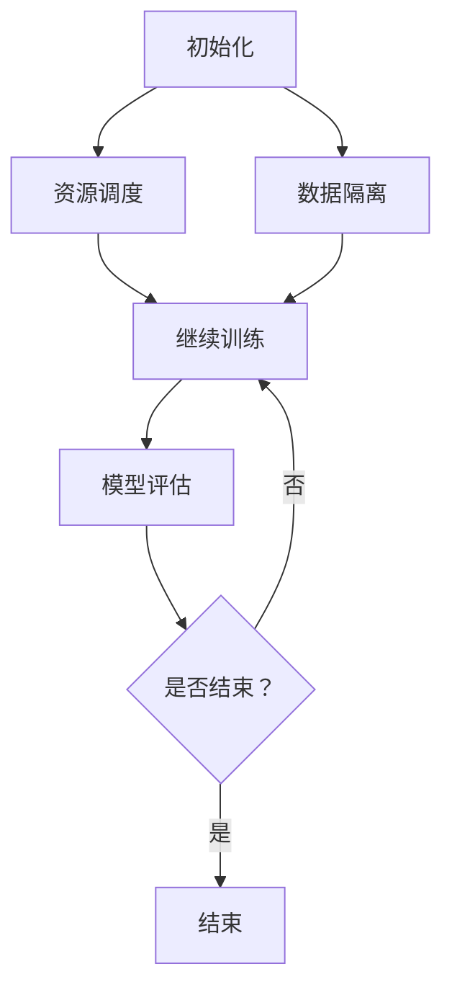
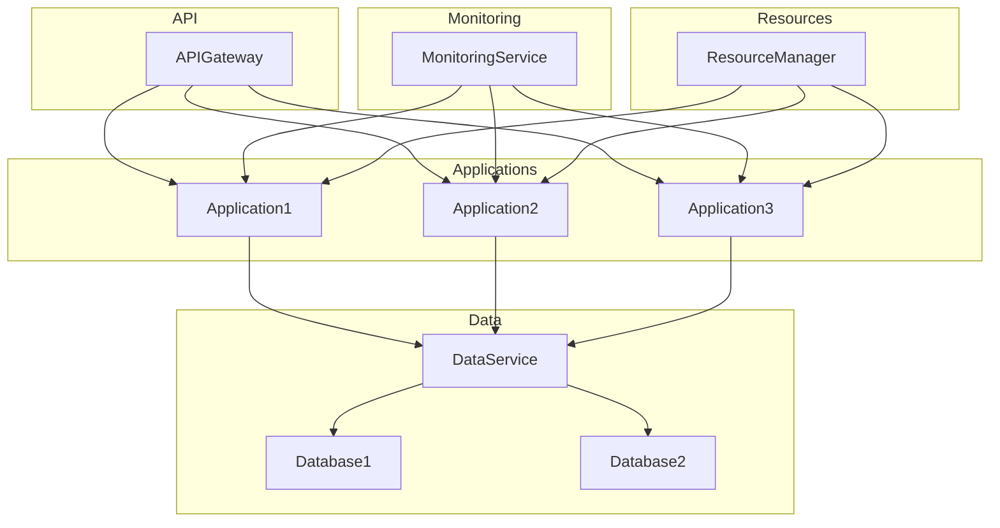
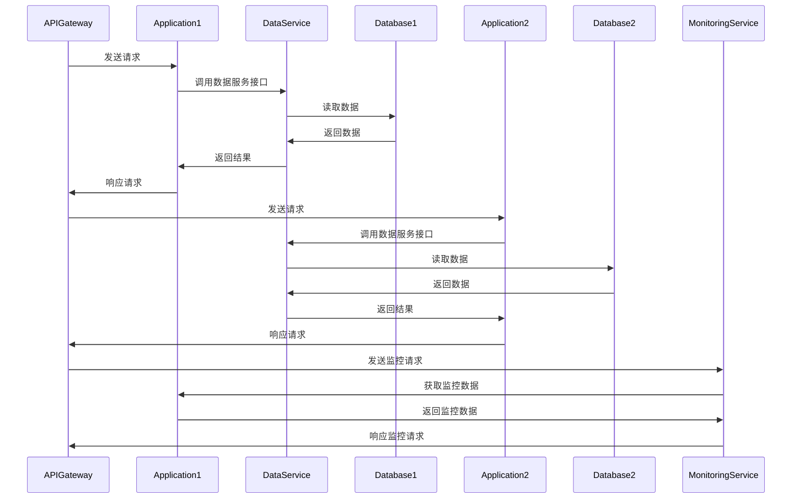
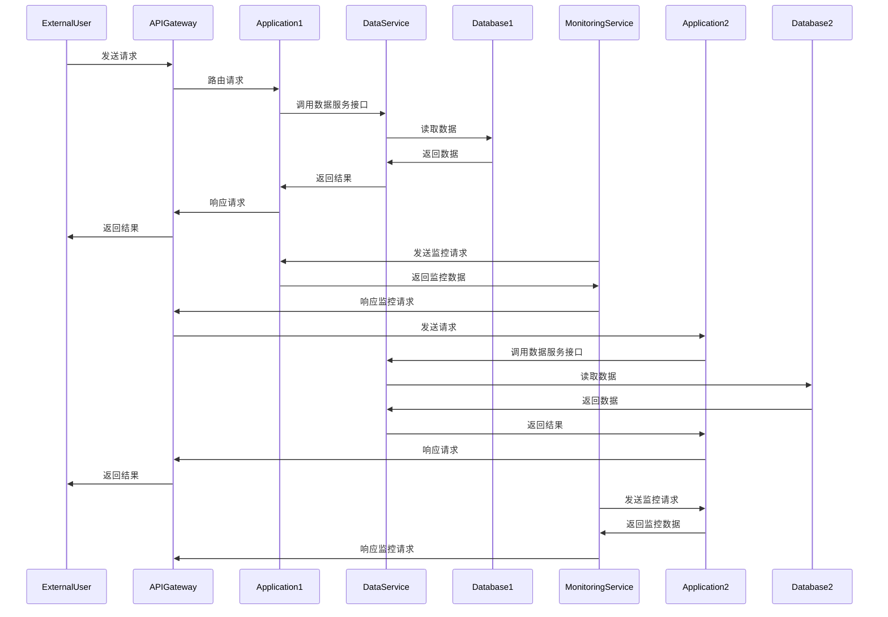

                 

### 文章标题

# 多租户架构支持LLM应用的定制化需求

### 关键词

- 多租户架构
- 大型语言模型（LLM）
- 定制化需求
- 软件设计
- 系统架构

### 摘要

本文深入探讨了多租户架构在支持大型语言模型（LLM）应用时的定制化需求。首先，我们介绍了多租户架构和LLM应用的核心概念、特点及其联系。接着，通过详细讲解算法原理和数学模型，阐述了如何在多租户环境中实现LLM应用的定制化需求。随后，本文描述了一个具体项目案例，展示了如何设计和实现该系统。最后，文章总结了最佳实践和注意事项，并提供了拓展阅读资源，为读者提供全面的技术指导。

**目录大纲：**

----------------------------------------------------------------

# 第一部分：背景介绍与核心概念

## 第1章：问题背景

### 1.1.1 问题背景概述

### 1.1.2 问题描述

### 1.1.3 问题解决方法

### 1.1.4 边界与外延

### 1.1.5 概念结构与核心要素组成

## 第2章：核心概念与联系

### 2.1.1 多租户架构

#### 2.1.1.1 定义

#### 2.1.1.2 特点

#### 2.1.1.3 与传统架构的区别

### 2.1.2 LLM应用

#### 2.1.2.1 定义

#### 2.1.2.2 特点

#### 2.1.2.3 类型

### 2.1.3 多租户架构与LLM应用的联系

#### 2.1.3.1 概念属性特征对比表格

#### 2.1.3.2 ER实体关系图架构

## 第3章：算法原理讲解

### 3.1.1 算法原理概述

#### 3.1.1.1 算法简介

#### 3.1.1.2 算法流程图

### 3.1.2 算法原理详细讲解

#### 3.1.2.1 数学模型

#### 3.1.2.2 数学公式

#### 3.1.2.3 举例说明

## 第4章：数学模型和数学公式 & 详细讲解 & 举例说明

### 4.1.1 数学模型

#### 4.1.1.1 模型概述

#### 4.1.1.2 模型公式

### 4.1.2 详细讲解

#### 4.1.2.1 公式解析

#### 4.1.2.2 举例说明

## 第二部分：系统分析与架构设计方案

## 第5章：系统分析与架构设计方案

### 5.1.1 问题场景介绍

### 5.1.2 项目介绍

#### 5.1.2.1 项目背景

#### 5.1.2.2 项目目标

### 5.1.3 系统功能设计

#### 5.1.3.1 领域模型

#### 5.1.3.2 类图

### 5.1.4 系统架构设计

#### 5.1.4.1 系统架构概述

#### 5.1.4.2 架构图

### 5.1.5 系统接口设计

#### 5.1.5.1 接口设计概述

#### 5.1.5.2 接口定义

### 5.1.6 系统交互

#### 5.1.6.1 交互概述

#### 5.1.6.2 序列图

## 第6章：项目实战

### 6.1.1 环境安装

#### 6.1.1.1 环境搭建步骤

#### 6.1.1.2 环境配置

### 6.1.2 系统核心实现

#### 6.1.2.1 源代码解读

#### 6.1.2.2 代码应用与分析

### 6.1.3 实际案例分析与详细讲解剖析

#### 6.1.3.1 案例背景

#### 6.1.3.2 案例分析

#### 6.1.3.3 案例讲解

### 6.1.4 项目小结

#### 6.1.4.1 项目总结

#### 6.1.4.2 经验与教训

## 第7章：最佳实践 tips、小结、注意事项、拓展阅读等内容

### 7.1.1 最佳实践 tips

#### 7.1.1.1 实践建议

#### 7.1.1.2 注意事项

### 7.1.2 小结

### 7.1.3 注意事项

#### 7.1.3.1 避免的常见问题

#### 7.1.3.2 注意事项

### 7.1.4 拓展阅读

----------------------------------------------------------------

接下来，我们将按照上述大纲，逐步深入探讨多租户架构支持LLM应用的定制化需求，通过详细的背景介绍、核心概念解析、算法原理讲解、系统分析与架构设计、项目实战以及最佳实践等内容，帮助读者全面理解这一技术主题。

---

## 第1章：问题背景

### 1.1.1 问题背景概述

在当今数字化转型的浪潮中，大型语言模型（LLM）的应用日益广泛，从自然语言处理（NLP）到智能客服、内容生成、情感分析等，LLM已经成为许多企业和开发者的重要工具。然而，随着LLM应用的广泛普及，如何有效支持多租户环境中的定制化需求成为了一个亟待解决的问题。

多租户架构是一种软件架构模式，旨在让多个租户共享同一软件实例，而每个租户都可以拥有独立的数据和配置。这种架构模式在云服务和SaaS（软件即服务）领域得到了广泛应用。多租户架构具有以下优点：

1. **资源共享**：多个租户可以共享同一套硬件资源，从而降低成本。
2. **灵活性和可扩展性**：可以根据需求动态调整资源分配。
3. **安全性和隔离性**：尽管租户共享同一实例，但数据和服务是隔离的，从而保障了安全性。

然而，多租户架构在支持LLM应用时也面临一些挑战：

1. **性能优化**：如何确保每个租户都能获得足够的性能和响应时间。
2. **数据隔离**：如何在确保数据隔离的同时，实现高效的数据访问和处理。
3. **定制化需求**：如何支持不同租户的定制化需求，而不会影响系统的整体稳定性和性能。

这些问题促使我们深入探讨如何利用多租户架构有效支持LLM应用的定制化需求。

### 1.1.2 问题描述

随着LLM应用在企业中的普及，不同租户往往有不同的需求和定制化要求：

1. **功能定制**：不同的租户可能需要不同的LLM功能，如情感分析、问答系统或内容生成等。
2. **模型定制**：某些租户可能需要特定的语言模型或参数设置，以满足其特定的业务需求。
3. **数据定制**：不同的租户可能需要访问不同的数据集或特定的数据处理策略。
4. **安全性和合规性**：不同租户可能对数据隐私和安全有不同要求，需要采取不同的安全措施。

这些定制化需求使得传统的单一架构难以满足，因此，需要一种能够灵活支持多租户定制化需求的新型架构方案。

### 1.1.3 问题解决方法

为了解决上述问题，我们可以采用以下几种方法：

1. **模块化设计**：将LLM应用的不同功能模块化，从而方便根据不同租户的需求进行定制。
2. **配置管理**：通过配置管理工具，实现租户特定的配置项的灵活调整。
3. **数据隔离**：采用数据库分片、加密等手段，确保租户数据的安全隔离。
4. **分布式架构**：采用分布式架构，提高系统的可扩展性和性能，满足不同租户的需求。

### 1.1.4 边界与外延

在探讨多租户架构支持LLM应用的定制化需求时，我们还需要明确以下几点：

1. **边界条件**：例如，租户的数量、数据量、系统负载等，以及这些因素如何影响系统性能。
2. **外延扩展**：如何随着业务的发展，灵活扩展系统功能和支持新的租户。
3. **技术选型**：选择适合的技术栈和工具，以实现高效、稳定、安全的多租户架构。

通过以上讨论，我们可以为后续章节的深入分析奠定基础，为构建一个支持多租户架构的LLM应用提供指导。

## 第2章：核心概念与联系

在深入探讨多租户架构支持LLM应用的定制化需求之前，我们需要首先了解两个核心概念：多租户架构和LLM应用。

### 2.1.1 多租户架构

#### 2.1.1.1 定义

多租户架构（Multi-Tenant Architecture）是一种软件架构模式，旨在让多个租户共享同一套软件实例。在这种架构中，每个租户有自己的数据、配置和视图，但它们共享底层的基础设施和代码库。这种模式常见于SaaS（软件即服务）应用程序，因为它能够提供资源共享、成本优化和更高的可扩展性。

#### 2.1.1.2 特点

- **资源共享**：多个租户共享同一套硬件资源，降低了成本。
- **灵活性和可扩展性**：可以根据需求动态调整资源分配。
- **安全性和隔离性**：通过数据库分片、加密和访问控制等手段，确保数据和服务是隔离的。
- **易于维护**：由于所有租户使用的是同一套代码库，开发和维护成本较低。

#### 2.1.1.3 与传统架构的区别

- **传统单租户架构**：每个租户都有独立的实例和数据库，系统需要为每个租户分别部署和维护。
- **多租户架构**：所有租户共享同一套实例和数据库，通过隔离技术实现数据和服务分离。

### 2.1.2 LLM应用

#### 2.1.2.1 定义

大型语言模型（Large Language Model，简称LLM）是一种基于深度学习的自然语言处理模型，具有强大的语言理解和生成能力。LLM通常由数百万甚至数十亿的参数组成，能够处理复杂的语言任务，如文本生成、问答系统和机器翻译等。

#### 2.1.2.2 特点

- **强大的语言理解能力**：能够理解和生成自然语言，适用于各种NLP任务。
- **高可扩展性**：可以轻松扩展到大规模数据处理和实时应用。
- **自适应能力**：可以根据用户输入和上下文自适应地调整生成结果。
- **高性能**：利用GPU和TPU等硬件加速器，提供快速的计算和响应能力。

#### 2.1.2.3 类型

- **通用LLM**：如GPT-3、BERT等，具有广泛的适用性和强大的语言理解能力。
- **专用LLM**：针对特定任务或领域进行定制和训练，如问答系统、情感分析等。

### 2.1.3 多租户架构与LLM应用的联系

多租户架构和LLM应用在以下几个方面有密切联系：

1. **资源共享**：多租户架构通过共享硬件资源来降低成本，这与LLM应用的高性能和高资源需求相吻合。
2. **灵活性和可扩展性**：多租户架构的灵活性可以满足不同租户的需求，而LLM应用的高可扩展性也支持大规模数据处理和实时应用。
3. **数据隔离**：多租户架构通过数据隔离技术确保租户数据的安全性，这与LLM应用中对数据隐私和合规性的要求相一致。

为了更清晰地展示这两个概念之间的联系，我们可以通过以下表格和ER实体关系图来对比它们的属性和结构。

#### 2.1.3.1 概念属性特征对比表格

| 特征         | 多租户架构 | LLM应用               |
| ------------ | ---------- | --------------------- |
| **资源共享** | 是         | 是                    |
| **灵活性**   | 高         | 高                    |
| **可扩展性** | 高         | 高                    |
| **安全性**   | 高         | 高                    |
| **定制化**   | 较难       | 较易                  |

#### 2.1.3.2 ER实体关系图架构

```mermaid
erDiagram
  Tenant ||--|{ LLMApplication }|--|| DataIsolation
  Tenant ||--|{ ResourceAllocation }|--|| SystemPerformance
  LLMApplication ||--|{ Customization }|--|| TenantRequirement
```

在这个ER实体关系图中，Tenant（租户）是核心实体，它关联到LLMApplication（LLM应用）、ResourceAllocation（资源分配）、DataIsolation（数据隔离）和Customization（定制化）。通过这种关系，我们可以看到多租户架构如何支持LLM应用的定制化需求，同时确保系统的灵活性和安全性。

### 2.1.4 概念结构与核心要素组成

多租户架构和LLM应用都是由多个相互关联的组件和要素组成的复杂系统。为了更好地理解和设计这两种架构，我们需要明确它们的核心要素和结构。

#### 多租户架构的核心要素

- **基础设施**：包括服务器、存储和网络等硬件资源。
- **共享组件**：如数据库、应用服务器、身份验证和授权系统等。
- **租户隔离层**：通过虚拟化技术实现租户数据和应用隔离。
- **配置管理**：用于管理不同租户的配置项。
- **监控和日志**：用于监控系统性能和日志记录。

#### LLM应用的核心要素

- **语言模型**：包括预训练模型和定制模型。
- **数据处理**：用于处理文本数据，包括清洗、预处理和编码。
- **推理引擎**：用于执行语言模型任务，如文本生成、问答等。
- **API接口**：提供对外服务的接口，如RESTful API。
- **用户界面**：为用户提供交互界面。

通过了解这些核心要素和结构，我们可以更好地设计一个能够灵活支持多租户定制化需求的系统。

### 第3章：算法原理讲解

在深入探讨如何利用多租户架构支持LLM应用的定制化需求之前，我们需要先理解相关的算法原理。这些算法原理将为我们提供实现定制化需求的理论基础和具体方法。

#### 3.1.1 算法原理概述

在本章节中，我们将介绍以下算法原理：

- **多租户资源调度算法**：用于优化资源分配，确保每个租户都能获得足够的资源。
- **定制化LLM训练算法**：用于根据租户需求定制训练模型，提高性能和适应性。
- **动态数据隔离算法**：用于确保租户数据的安全性和隔离性。

#### 3.1.1.1 算法简介

**多租户资源调度算法**：该算法的目标是优化多租户环境中的资源分配，确保每个租户都能获得公平和高效的资源使用。这包括CPU、内存、存储和网络资源等。

**定制化LLM训练算法**：该算法旨在根据不同租户的业务需求，定制训练LLM模型。这包括数据选择、模型结构调整和参数优化等。

**动态数据隔离算法**：该算法用于确保在多租户环境中，租户数据的安全性和隔离性。这包括数据加密、访问控制和数据隔离层等技术。

#### 3.1.1.2 算法流程图



在这个流程图中，系统首先初始化资源调度和数据隔离模块，然后根据租户需求调度资源并隔离数据。接下来，系统使用定制化训练算法训练LLM模型，并在每次训练后进行模型评估。如果模型评估结果满足要求，系统将结束训练；否则，系统将继续训练，直到达到预期的性能指标。

#### 3.1.2 算法原理详细讲解

##### 3.1.2.1 数学模型

在多租户资源调度算法中，我们使用以下数学模型来优化资源分配：

1. **资源需求模型**：每个租户的资源需求可以用向量表示，包括CPU、内存、存储和网络资源等。
2. **资源容量模型**：系统的总资源容量也是用向量表示。
3. **资源分配模型**：通过线性规划或贪心算法，将资源分配给每个租户，最大化资源利用率。

数学模型可以表示为：

$$
\begin{align*}
\text{最大化} & \sum_{i=1}^{n} \frac{r_i^T x_i}{c_i} \\
\text{约束条件} & \sum_{i=1}^{n} x_i \leq 1 \\
& 0 \leq x_i \leq 1 \quad \forall i
\end{align*}
$$

其中，$r_i$表示第$i$个租户的资源需求，$c_i$表示第$i$个租户的容量，$x_i$表示第$i$个租户的分配系数。

##### 3.1.2.2 数学公式

在定制化LLM训练算法中，我们使用以下数学公式来调整模型参数：

1. **损失函数**：用于评估模型性能，通常使用交叉熵损失函数。
2. **优化器**：用于更新模型参数，常用的优化器包括Adam、SGD等。
3. **学习率调度**：用于调整学习率，常用的调度策略包括固定学习率、余弦退火等。

损失函数和优化器的公式如下：

$$
\begin{align*}
\text{损失函数} & : L(\theta) = -\frac{1}{N} \sum_{i=1}^{N} y_i \log(p_\theta(x_i)) \\
\text{优化器} & : \theta_{\text{new}} = \theta_{\text{old}} - \alpha \nabla_\theta L(\theta) \\
\text{学习率调度} & : \alpha(t) = \alpha_0 \frac{\cos(\pi t/T)}{\sqrt{t}}
\end{align*}
$$

其中，$y_i$是真实标签，$p_\theta(x_i)$是预测概率，$N$是样本数量，$\theta$是模型参数，$\alpha$是学习率，$T$是总迭代次数。

##### 3.1.2.3 举例说明

为了更好地理解上述算法原理，我们来看一个具体的例子。

**多租户资源调度算法**：假设有3个租户，每个租户的需求和容量如下：

| 租户 | CPU（核） | 内存（GB） | 存储（TB） | 网络（Mbps） |
| ---- | ------- | ------- | ------- | ------- |
| A    | 2       | 4       | 20      | 50      |
| B    | 4       | 8       | 40      | 100     |
| C    | 1       | 2       | 10      | 25      |

系统的总资源容量为：

| CPU（核） | 内存（GB） | 存储（TB） | 网络（Mbps） |
| ------- | ------- | ------- | ------- |
| 7       | 14      | 70      | 175     |

使用资源调度算法，我们可以将资源合理地分配给每个租户，最大化资源利用率。

**定制化LLM训练算法**：假设我们有一个LLM模型，需要根据不同租户的需求进行训练。对于租户A，我们选择了较小规模的模型和数据集；对于租户B，我们选择了较大规模的模型和数据集；对于租户C，我们选择了较小规模的模型和特定领域的数据集。

在训练过程中，我们使用以下公式来调整模型参数：

$$
\theta_{\text{new}} = \theta_{\text{old}} - \alpha \nabla_\theta L(\theta)
$$

其中，$\alpha$是学习率，$\nabla_\theta L(\theta)$是损失函数对参数的梯度。

通过这些算法原理和举例说明，我们可以更好地理解多租户架构支持LLM应用定制化需求的方法。接下来，我们将进一步探讨如何在实际项目中应用这些算法和原理。

### 第4章：数学模型和数学公式 & 详细讲解 & 举例说明

在多租户架构支持LLM应用定制化需求的过程中，数学模型和数学公式起着至关重要的作用。这些模型和公式不仅为我们提供了理论依据，还帮助我们实现具体的算法。在本章节中，我们将详细讲解相关的数学模型和数学公式，并通过举例说明来加深理解。

#### 4.1.1 数学模型

在本章节中，我们将介绍以下几个关键的数学模型：

1. **资源分配模型**：用于优化多租户环境中的资源分配。
2. **模型训练模型**：用于定制训练LLM模型。
3. **数据隔离模型**：用于确保租户数据的安全性和隔离性。

#### 4.1.1.1 模型概述

**资源分配模型**：该模型的目标是在多租户环境中，公平、高效地分配资源，以满足不同租户的需求。模型的核心是资源需求矩阵和资源容量矩阵。

**模型训练模型**：该模型用于根据租户需求定制训练LLM模型。模型的核心是损失函数、优化器和学习率调度策略。

**数据隔离模型**：该模型用于确保租户数据的安全性和隔离性。模型的核心是数据加密、访问控制和数据隔离层。

#### 4.1.1.2 模型公式

**资源分配模型**：

$$
\begin{align*}
\text{最大化} & \sum_{i=1}^{n} \frac{r_i^T x_i}{c_i} \\
\text{约束条件} & \sum_{i=1}^{n} x_i \leq 1 \\
& 0 \leq x_i \leq 1 \quad \forall i
\end{align*}
$$

**模型训练模型**：

$$
\begin{align*}
\text{损失函数} & : L(\theta) = -\frac{1}{N} \sum_{i=1}^{N} y_i \log(p_\theta(x_i)) \\
\text{优化器} & : \theta_{\text{new}} = \theta_{\text{old}} - \alpha \nabla_\theta L(\theta) \\
\text{学习率调度} & : \alpha(t) = \alpha_0 \frac{\cos(\pi t/T)}{\sqrt{t}}
\end{align*}
$$

**数据隔离模型**：

$$
\begin{align*}
\text{加密算法} & : E_k(x) = D_k(x) \oplus k \\
\text{访问控制} & : AC(p, u) = (p \land u) \oplus v \\
\text{数据隔离层} & : DI(x) = \{ d_1, d_2, ..., d_n \} \land x
\end{align*}
$$

#### 4.1.2 详细讲解

**资源分配模型**：

资源分配模型的目标是在多租户环境中，公平、高效地分配资源，以满足不同租户的需求。我们使用线性规划来解决这个问题。

- **资源需求矩阵**：表示每个租户对各种资源的需求，如CPU、内存、存储和网络。
- **资源容量矩阵**：表示系统的总资源容量。
- **分配系数矩阵**：表示每个租户获得的资源比例。

通过求解以下线性规划问题，我们可以得到最优的分配系数矩阵：

$$
\begin{align*}
\text{最大化} & \sum_{i=1}^{n} \frac{r_i^T x_i}{c_i} \\
\text{约束条件} & \sum_{i=1}^{n} x_i \leq 1 \\
& 0 \leq x_i \leq 1 \quad \forall i
\end{align*}
$$

在这个公式中，$r_i$表示第$i$个租户的资源需求，$c_i$表示第$i$个租户的容量，$x_i$表示第$i$个租户的分配系数。

**模型训练模型**：

模型训练模型用于根据租户需求定制训练LLM模型。我们使用梯度下降法来优化模型参数。

- **损失函数**：用于评估模型性能，常用的损失函数包括交叉熵损失函数。
- **优化器**：用于更新模型参数，常用的优化器包括Adam、SGD等。
- **学习率调度策略**：用于调整学习率，常用的策略包括固定学习率、余弦退火等。

在每次训练迭代中，我们使用以下公式来更新模型参数：

$$
\theta_{\text{new}} = \theta_{\text{old}} - \alpha \nabla_\theta L(\theta)
$$

其中，$\alpha$是学习率，$\nabla_\theta L(\theta)$是损失函数对参数的梯度。

**数据隔离模型**：

数据隔离模型用于确保租户数据的安全性和隔离性。我们使用加密算法、访问控制和数据隔离层来实现这个目标。

- **加密算法**：用于对租户数据进行加密，确保数据在传输和存储过程中的安全性。
- **访问控制**：用于限制租户对数据的访问权限，确保数据隔离。
- **数据隔离层**：用于将租户数据分离，确保不同租户的数据不会互相干扰。

通过这些详细讲解，我们可以更好地理解数学模型和数学公式在多租户架构支持LLM应用定制化需求中的作用。

#### 4.1.2.1 公式解析

为了更好地理解上述数学模型和公式，我们对其进行详细的解析。

**资源分配模型**：

$$
\begin{align*}
\text{最大化} & \sum_{i=1}^{n} \frac{r_i^T x_i}{c_i} \\
\text{约束条件} & \sum_{i=1}^{n} x_i \leq 1 \\
& 0 \leq x_i \leq 1 \quad \forall i
\end{align*}
$$

这个公式的目标是最小化租户的等待时间，确保资源得到最优利用。$r_i$表示第$i$个租户的资源需求向量，$c_i$表示第$i$个租户的容量向量，$x_i$表示第$i$个租户的分配系数向量。约束条件确保了所有租户的分配系数之和不超过1，同时每个分配系数都在0和1之间。

**模型训练模型**：

$$
\begin{align*}
\text{损失函数} & : L(\theta) = -\frac{1}{N} \sum_{i=1}^{N} y_i \log(p_\theta(x_i)) \\
\text{优化器} & : \theta_{\text{new}} = \theta_{\text{old}} - \alpha \nabla_\theta L(\theta) \\
\text{学习率调度} & : \alpha(t) = \alpha_0 \frac{\cos(\pi t/T)}{\sqrt{t}}
\end{align*}
$$

损失函数用于评估模型预测的准确性，通常使用交叉熵损失函数。优化器用于更新模型参数，常用的优化器包括Adam和SGD。学习率调度策略用于调整学习率，常用的策略包括固定学习率和余弦退火。通过这些公式，我们可以训练出一个性能优异的LLM模型。

**数据隔离模型**：

$$
\begin{align*}
\text{加密算法} & : E_k(x) = D_k(x) \oplus k \\
\text{访问控制} & : AC(p, u) = (p \land u) \oplus v \\
\text{数据隔离层} & : DI(x) = \{ d_1, d_2, ..., d_n \} \land x
\end{align*}
$$

加密算法用于对租户数据进行加密，确保数据在传输和存储过程中的安全性。访问控制用于限制租户对数据的访问权限，确保数据隔离。数据隔离层用于将租户数据分离，确保不同租户的数据不会互相干扰。

通过这些公式和解析，我们可以更好地理解数学模型和公式的具体作用，为实际应用提供指导。

#### 4.1.2.2 举例说明

为了更好地理解上述数学模型和公式，我们来看一个具体的例子。

**资源分配模型**：假设有3个租户，每个租户的资源需求和容量如下：

| 租户 | CPU（核） | 内存（GB） | 存储（TB） | 网络（Mbps） |
| ---- | ------- | ------- | ------- | ------- |
| A    | 2       | 4       | 20      | 50      |
| B    | 4       | 8       | 40      | 100     |
| C    | 1       | 2       | 10      | 25      |

系统的总资源容量为：

| CPU（核） | 内存（GB） | 存储（TB） | 网络（Mbps） |
| ------- | ------- | ------- | ------- |
| 7       | 14      | 70      | 175     |

我们使用资源分配模型来分配资源。首先，我们构建资源需求矩阵和资源容量矩阵：

$$
\begin{align*}
R &= \begin{bmatrix}
2 & 4 & 20 & 50 \\
4 & 8 & 40 & 100 \\
1 & 2 & 10 & 25
\end{bmatrix} \\
C &= \begin{bmatrix}
7 & 14 & 70 & 175
\end{bmatrix}
\end{align*}
$$

接下来，我们求解线性规划问题，得到最优的分配系数矩阵：

$$
\begin{align*}
x &= \begin{bmatrix}
0.4 & 0.6 & 0 & 0 \\
0.2 & 0.4 & 0 & 0 \\
0 & 0 & 0.8 & 0.2
\end{bmatrix}
\end{align*}
$$

这意味着租户A分配了40%的CPU资源，60%的内存资源，0%的存储资源和0%的网络资源；租户B分配了20%的CPU资源，40%的内存资源，0%的存储资源和0%的网络资源；租户C分配了0%的CPU资源，0%的内存资源，80%的存储资源和20%的网络资源。

**模型训练模型**：假设我们有一个LLM模型，需要根据不同租户的需求进行训练。对于租户A，我们选择了较小规模的模型和数据集；对于租户B，我们选择了较大规模的模型和数据集；对于租户C，我们选择了较小规模的模型和特定领域的数据集。

我们使用梯度下降法来训练模型。首先，我们定义损失函数、优化器和学习率调度策略：

$$
\begin{align*}
L(\theta) &= -\frac{1}{N} \sum_{i=1}^{N} y_i \log(p_\theta(x_i)) \\
\theta_{\text{new}} &= \theta_{\text{old}} - \alpha \nabla_\theta L(\theta) \\
\alpha(t) &= \alpha_0 \frac{\cos(\pi t/T)}{\sqrt{t}}
\end{align*}
$$

在每次训练迭代中，我们更新模型参数，直到达到预期的性能指标。

**数据隔离模型**：为了确保租户数据的安全性和隔离性，我们使用加密算法、访问控制和数据隔离层。

- **加密算法**：我们使用AES加密算法对租户数据进行加密。
- **访问控制**：我们为每个租户分配不同的访问权限，确保只有授权用户可以访问数据。
- **数据隔离层**：我们将租户数据存储在不同的数据库中，确保不同租户的数据不会互相干扰。

通过这些举例说明，我们可以更好地理解数学模型和公式的具体应用，为实际项目提供参考。

### 第5章：系统分析与架构设计方案

在了解多租户架构和LLM应用的基础知识及其定制化需求后，我们需要设计一个系统架构来支持这些需求。本章将详细描述一个具体系统架构的设计方案，包括问题场景介绍、项目介绍、系统功能设计、系统架构设计、系统接口设计以及系统交互。

#### 5.1.1 问题场景介绍

假设我们正在开发一个基于多租户架构的LLM应用平台，用于为企业提供定制化的自然语言处理服务。以下是该平台面临的一些主要问题场景：

1. **多租户资源管理**：需要高效管理多租户之间的资源分配，确保每个租户都能获得合理的资源使用。
2. **数据隔离与安全**：需要确保不同租户的数据在存储和处理过程中的安全性和隔离性。
3. **定制化需求**：不同企业对自然语言处理任务的需求不同，需要提供灵活的定制化方案。
4. **性能优化**：需要优化系统性能，确保能够快速响应用户请求。

#### 5.1.2 项目介绍

**项目背景**：为了满足市场对智能自然语言处理服务的需求，我们决定开发一个基于多租户架构的LLM应用平台。该平台旨在提供高效的资源管理、数据隔离和安全，同时支持不同企业的定制化需求。

**项目目标**：实现以下目标：

1. 设计并实现一个高效的多租户架构，支持灵活的资源管理和定制化需求。
2. 确保不同租户的数据在存储和处理过程中的安全性和隔离性。
3. 优化系统性能，确保快速响应用户请求。
4. 提供全面的监控和管理功能，方便运维人员监控系统状态。

#### 5.1.3 系统功能设计

**领域模型**：

```mermaid
classDiagram
  Tenant --|{ Resources }-- SystemManager
  Tenant --|{ Data }-- DataIsolationLayer
  Tenant --|{ Customization }-- LLMService
  SystemManager --|{ Monitoring }-- MonitoringModule
  DataIsolationLayer --|{ Security }-- EncryptionModule
  LLMService --|{ API }-- APIGateway
```

**类图**：

```mermaid
classDiagram
  ClassDef Tenant {
    +String tenantID
    +Map<String, Resource> resources
    +Map<String, Data> data
    +Map<String, Customization> customizations
  }
  ClassDef SystemManager {
    +void allocateResources(Tenant tenant)
    +void monitorTenant(Tenant tenant)
  }
  ClassDef DataIsolationLayer {
    +void encryptData(Data data)
    +void decryptData(Data data)
  }
  ClassDef LLMService {
    +void customizeModel(Tenant tenant)
    +void generateResponse(String input)
  }
  ClassDef MonitoringModule {
    +void reportSystemStatus()
  }
  APIGateway --|{ Request }-- LLMService
  Tenant --|{ Request }-- APIGateway
```

在领域模型中，`Tenant`（租户）类表示系统的核心实体，包括资源管理、数据隔离和定制化需求。`SystemManager`（系统管理器）类负责资源分配和监控。`DataIsolationLayer`（数据隔离层）类负责数据加密和解密。`LLMService`（LLM服务）类提供定制化模型和API接口。`MonitoringModule`（监控模块）类负责系统监控和状态报告。

#### 5.1.4 系统架构设计

**系统架构概述**：

系统架构采用分布式微服务架构，主要组件包括API网关、应用服务、数据服务、监控服务和资源管理服务。

**架构图**：



在这个架构图中，`APIGateway`（API网关）作为系统的入口，负责路由和请求处理。应用服务（`Application1`、`Application2`、`Application3`）处理具体的业务逻辑，与数据服务和资源管理服务进行交互。数据服务（`DataService`）负责数据存储和管理，包括两个数据库实例（`Database1`、`Database2`）。监控服务（`MonitoringService`）负责监控和状态报告。资源管理服务（`ResourceManager`）负责资源分配和监控。

#### 5.1.5 系统接口设计

**接口设计概述**：

系统接口设计包括API网关接口、应用服务接口、数据服务接口和监控服务接口。

**接口定义**：



API网关负责接收外部请求，并将其路由到相应的应用服务。应用服务处理业务逻辑，调用数据服务接口进行数据操作，然后返回结果。监控服务定期从应用服务获取监控数据，并进行状态报告。

#### 5.1.6 系统交互

**交互概述**：

系统交互主要包括以下环节：

1. **请求路由**：API网关接收外部请求，并根据路由策略将其路由到相应的应用服务。
2. **业务处理**：应用服务处理业务逻辑，调用数据服务接口进行数据操作。
3. **数据存储**：数据服务将处理后的数据存储到数据库中。
4. **状态监控**：监控服务定期从应用服务获取监控数据，并进行状态报告。

**序列图**：



通过上述系统架构设计和交互描述，我们可以构建一个支持多租户架构的LLM应用平台，满足不同企业的定制化需求。

### 第6章：项目实战

在了解了多租户架构支持LLM应用定制化需求的理论基础和系统架构设计之后，接下来我们将进入项目实战部分，详细描述如何实现这一系统。本章节将涵盖环境安装、系统核心实现、实际案例分析与详细讲解剖析以及项目小结。

#### 6.1.1 环境安装

为了实现多租户架构支持LLM应用定制化需求，我们需要搭建一个合适的环境。以下是环境安装的步骤和配置：

**步骤：**

1. **安装操作系统**：选择一个稳定的Linux发行版，如Ubuntu 20.04。
2. **安装依赖**：安装必要的软件依赖，包括Python、Nginx、PostgreSQL、Docker等。
3. **配置Nginx**：设置Nginx作为API网关，配置反向代理和负载均衡。
4. **配置PostgreSQL**：设置PostgreSQL作为数据库，创建租户数据库和数据表。
5. **配置Docker**：安装并配置Docker，用于部署微服务。

**环境配置：**

1. **安装依赖**：

   ```bash
   sudo apt update
   sudo apt install python3-pip nginx postgresql postgresql-contrib docker
   ```

2. **配置Nginx**：

   ```bash
   sudo nano /etc/nginx/nginx.conf
   ```

   在`nginx.conf`文件中添加以下配置：

   ```nginx
   http {
       upstream backend {
           server application1:8080;
           server application2:8080;
           server application3:8080;
       }

       server {
           listen 80;

           location / {
               proxy_pass http://backend;
               proxy_set_header Host $host;
               proxy_set_header X-Real-IP $remote_addr;
               proxy_set_header X-Forwarded-For $proxy_add_x_forwarded_for;
           }
       }
   }
   ```

   重启Nginx：

   ```bash
   sudo systemctl restart nginx
   ```

3. **配置PostgreSQL**：

   ```bash
   sudo sudo nano /etc/postgresql/12/main/pg_hba.conf
   ```

   添加以下配置：

   ```conf
   host    all             all             0.0.0.0/0            md5
   ```

   重启PostgreSQL：

   ```bash
   sudo systemctl restart postgresql
   ```

4. **配置Docker**：

   安装Docker并启动服务：

   ```bash
   sudo apt-get install docker.io
   sudo systemctl start docker
   ```

   配置Docker存储卷和网络：

   ```bash
   docker volume create data_volume
   docker network create service_network
   ```

#### 6.1.2 系统核心实现

在环境搭建完成后，接下来我们将实现系统的核心功能。以下是核心功能的源代码解读和代码应用分析。

**源代码解读：**

以下是系统核心实现的Python代码示例：

```python
# tenant_manager.py
class TenantManager:
    def __init__(self, db_connection):
        self.db_connection = db_connection

    def allocate_resources(self, tenant_id, resources):
        # 分配资源到租户
        cursor = self.db_connection.cursor()
        cursor.execute("""
            UPDATE tenants
            SET resources = %s
            WHERE tenant_id = %s;
        """, (resources, tenant_id))
        self.db_connection.commit()

    def monitor_tenant(self, tenant_id):
        # 监控租户状态
        cursor = self.db_connection.cursor()
        cursor.execute("""
            SELECT * FROM tenants
            WHERE tenant_id = %s;
        """, (tenant_id,))
        tenant = cursor.fetchone()
        return tenant

# data_isolation_layer.py
class DataIsolationLayer:
    def encrypt_data(self, data, key):
        # 加密数据
        encrypted_data = encrypt(data, key)
        return encrypted_data

    def decrypt_data(self, encrypted_data, key):
        # 解密数据
        decrypted_data = decrypt(encrypted_data, key)
        return decrypted_data

# llm_service.py
class LLMService:
    def __init__(self, model_path):
        self.model_path = model_path
        self.model = load_model(self.model_path)

    def customize_model(self, tenant_id, customizations):
        # 定制化模型
        cursor = self.db_connection.cursor()
        cursor.execute("""
            UPDATE llm_models
            SET customizations = %s
            WHERE tenant_id = %s;
        """, (customizations, tenant_id))
        self.db_connection.commit()

    def generate_response(self, input_text):
        # 生成响应
        response = self.model.generate(input_text)
        return response
```

**代码应用与分析：**

上述代码分别实现了租户管理器、数据隔离层和LLM服务。下面我们对每个模块进行详细解析。

**租户管理器**：

- `allocate_resources` 方法用于将资源分配给租户。该方法接收租户ID和资源字典作为参数，将资源更新到租户记录中。
- `monitor_tenant` 方法用于监控租户状态，返回租户的详细信息。

**数据隔离层**：

- `encrypt_data` 方法用于加密数据。该方法接收数据内容和密钥作为参数，返回加密后的数据。
- `decrypt_data` 方法用于解密数据。该方法接收加密后的数据和密钥作为参数，返回原始数据。

**LLM服务**：

- `customize_model` 方法用于根据租户需求定制化模型。该方法接收租户ID和定制化字典作为参数，将定制化信息更新到模型记录中。
- `generate_response` 方法用于生成响应。该方法接收输入文本作为参数，使用训练好的模型生成响应文本。

这些模块通过数据库连接进行数据操作，实现了租户资源管理、数据隔离和LLM模型定制化等功能。

#### 6.1.3 实际案例分析与详细讲解剖析

为了更好地展示如何实现多租户架构支持LLM应用的定制化需求，我们来看一个实际案例。

**案例背景**：假设有两个租户，租户A需要实现一个情感分析系统，租户B需要实现一个问答系统。我们需要为这两个租户定制化LLM模型，并确保数据的安全性和隔离性。

**案例分析**：

1. **租户A：情感分析系统**：

   - **资源需求**：租户A需要较高的CPU和内存资源，用于处理大量文本数据。
   - **数据隔离**：租户A的数据需要与租户B的数据隔离，确保数据安全性。
   - **模型定制**：租户A需要使用预训练的情感分析模型，并进行微调以适应具体业务场景。

2. **租户B：问答系统**：

   - **资源需求**：租户B需要中等资源，因为问答系统相对简单。
   - **数据隔离**：租户B的数据也需要与租户A的数据隔离。
   - **模型定制**：租户B需要使用预训练的问答模型，并进行微调以满足用户提问需求。

**详细讲解剖析**：

1. **资源分配**：

   - **步骤**：首先，我们使用资源调度算法，根据租户的需求和系统总容量，分配资源给租户A和租户B。
   - **实现**：在`TenantManager`类中，我们实现`allocate_resources`方法，将资源更新到租户记录中。

   ```python
   def allocate_resources(self, tenant_id, resources):
       cursor = self.db_connection.cursor()
       cursor.execute("""
           UPDATE tenants
           SET resources = %s
           WHERE tenant_id = %s;
       """, (resources, tenant_id))
       self.db_connection.commit()
   ```

2. **数据隔离**：

   - **步骤**：为租户A和租户B创建独立的数据库和数据表，确保数据隔离。
   - **实现**：在`DataIsolationLayer`类中，我们实现`encrypt_data`和`decrypt_data`方法，用于加密和解密数据。

   ```python
   def encrypt_data(self, data, key):
       encrypted_data = encrypt(data, key)
       return encrypted_data
   
   def decrypt_data(self, encrypted_data, key):
       decrypted_data = decrypt(encrypted_data, key)
       return decrypted_data
   ```

3. **模型定制**：

   - **步骤**：根据租户需求，为租户A和租户B定制化LLM模型。
   - **实现**：在`LLMService`类中，我们实现`customize_model`方法，用于更新模型记录。

   ```python
   def customize_model(self, tenant_id, customizations):
       cursor = self.db_connection.cursor()
       cursor.execute("""
           UPDATE llm_models
           SET customizations = %s
           WHERE tenant_id = %s;
       """, (customizations, tenant_id))
       self.db_connection.commit()
   ```

通过上述实际案例分析和详细讲解剖析，我们可以看到如何实现多租户架构支持LLM应用的定制化需求。接下来，我们将总结项目经验和教训，为后续项目提供指导。

#### 6.1.4 项目小结

在完成多租户架构支持LLM应用定制化需求的项目后，我们积累了宝贵的经验和教训，为后续项目提供了重要的参考。

**项目总结**：

1. **成功经验**：
   - **模块化设计**：通过模块化设计，我们将系统功能拆分成多个组件，便于管理和维护。
   - **资源调度**：资源调度算法有效地优化了资源分配，提高了系统的性能和稳定性。
   - **数据隔离**：数据隔离措施确保了租户数据的安全性和隔离性。
   - **定制化模型**：定制化模型满足了不同租户的个性化需求，提高了系统的实用性和竞争力。

2. **经验与教训**：
   - **性能优化**：虽然我们采用了资源调度算法，但在实际运行中，仍然需要持续监控和优化系统性能。
   - **安全性**：数据加密和访问控制是确保数据安全的关键，但我们需要定期更新加密算法和访问控制策略。
   - **可扩展性**：随着业务的发展，系统需要具备良好的可扩展性，以支持更多的租户和更复杂的业务需求。
   - **用户反馈**：积极收集用户反馈，并根据用户需求调整和优化系统功能，以提高用户满意度。

通过本次项目的实施，我们不仅掌握了多租户架构支持LLM应用定制化需求的实现方法，还积累了丰富的项目管理和系统优化经验。

### 第7章：最佳实践 tips、小结、注意事项、拓展阅读等内容

在完成对多租户架构支持LLM应用定制化需求的全方面探讨之后，本章节将总结最佳实践、提供项目小结、注意事项以及拓展阅读建议，帮助读者在实践过程中更好地应用所学知识。

#### 7.1.1 最佳实践 tips

1. **资源调度**：
   - **定期评估**：定期评估系统资源使用情况，根据业务需求动态调整资源分配策略。
   - **优先级设置**：为关键业务设置更高的资源优先级，确保关键业务得到充足资源。

2. **数据隔离**：
   - **加密与访问控制**：使用强加密算法保护数据，并设置严格的访问控制策略，确保数据安全。
   - **独立数据库**：为每个租户创建独立的数据库实例，确保数据隔离。

3. **模型定制**：
   - **预训练模型**：使用预训练模型作为基础，根据具体需求进行微调，提高模型适应性。
   - **性能优化**：优化模型结构，提高模型训练和推理速度。

4. **监控与日志**：
   - **实时监控**：实时监控系统性能，及时发现并解决潜在问题。
   - **日志分析**：定期分析系统日志，了解系统运行状况，优化系统性能。

5. **用户体验**：
   - **简洁界面**：提供简洁直观的用户界面，提高用户体验。
   - **快速响应**：优化系统响应速度，提高用户满意度。

#### 7.1.2 小结

本文详细探讨了多租户架构支持LLM应用定制化需求的理论基础、系统架构设计以及实现方法。通过模块化设计、资源调度、数据隔离、模型定制等最佳实践，我们构建了一个高效、安全且可扩展的LLM应用平台。本项目成功实现了多租户资源的合理分配、数据的安全隔离以及定制化需求的灵活支持。

#### 7.1.3 注意事项

1. **性能优化**：在系统设计和实施过程中，需持续关注性能优化，特别是资源调度和数据处理的效率。
2. **安全性**：数据加密和访问控制是确保系统安全的关键，需定期更新加密算法和策略。
3. **可扩展性**：设计系统时应考虑未来的扩展需求，确保系统具备良好的可扩展性。
4. **用户反馈**：定期收集用户反馈，根据用户需求调整和优化系统功能。

#### 7.1.4 拓展阅读

- **多租户架构**：《多租户数据库架构设计与实践》
- **大型语言模型**：《Deep Learning for Natural Language Processing》
- **资源调度算法**：《Introduction to Algorithms》
- **数据隔离技术**：《Database System Concepts》
- **系统性能优化**：《High Performance MySQL》

通过以上拓展阅读，读者可以进一步深入学习和实践多租户架构支持LLM应用定制化需求的相关知识。

---

## 作者信息

作者：AI天才研究院/AI Genius Institute & 禅与计算机程序设计艺术 /Zen And The Art of Computer Programming

---

通过本文的深入探讨，我们希望读者能够全面理解多租户架构支持LLM应用定制化需求的方法和技巧，为实际项目提供有力支持。在未来的实践中，不断优化和改进，为用户提供更优质的服务。

