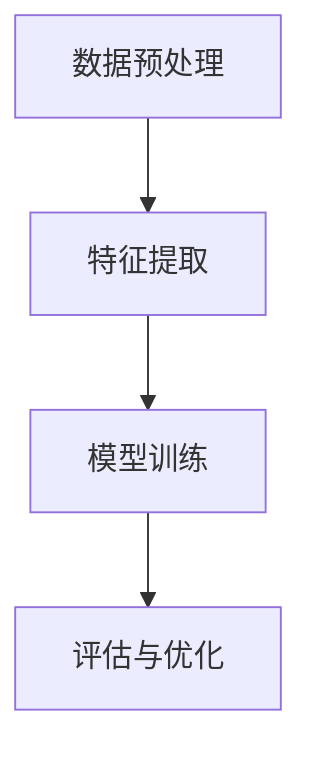
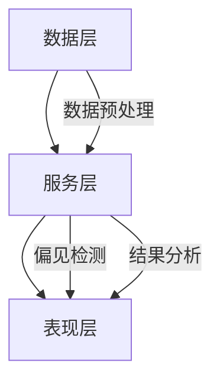

                 


# 多维度偏见检测：LLM辅助的公平性评估方案

## 关键词

- 偏见检测
- 语言模型（LLM）
- 公平性评估
- 算法原理
- 系统架构
- 项目实战

## 摘要

随着人工智能技术的飞速发展，机器学习模型在各个领域的应用越来越广泛。然而，这些模型可能存在偏见，导致不公平的结果。本文将探讨多维度偏见检测的重要性，并介绍一种基于大型语言模型（LLM）的公平性评估方案。文章首先介绍了偏见现象的产生与影响，随后详细阐述了偏见检测的定义、方法与挑战。接着，本文介绍了LLM的基本概念及其在偏见检测中的应用，并探讨了公平性评估的相关概念。随后，文章从算法原理、数学模型、实际案例分析和系统架构设计等方面进行了深入分析，提供了完整的偏见检测解决方案。最后，本文总结了最佳实践技巧和注意事项，并为读者提供了拓展阅读资源。

## 第一部分：背景介绍与核心概念

### 1.1.1 问题背景

#### 1.1.1.1 偏见现象的产生与影响

偏见现象是人工智能领域中一个不可忽视的问题。随着机器学习算法在各个领域的广泛应用，偏见现象也逐渐显现出来。例如，在某些招聘系统中，基于历史数据的招聘算法可能会倾向于招聘某一特定群体，从而导致性别、种族、年龄等方面的偏见。同样，在金融领域，贷款审批算法可能会因历史数据中的偏见而拒绝某一特定群体的贷款申请。

偏见现象不仅会影响个体，还会对整个社会造成负面影响。首先，偏见会导致不公平的结果，使得某些群体受到歧视。其次，偏见可能导致决策的偏见，使得整个社会的不公平现象加剧。此外，偏见还可能影响人工智能系统的可信度和用户满意度，阻碍人工智能技术的发展。

#### 1.1.1.2 公平性评估的重要性

公平性评估是解决偏见问题的关键。通过公平性评估，可以识别和纠正机器学习模型中的偏见，提高系统的公平性和可解释性。公平性评估的重要性主要体现在以下几个方面：

1. **确保公平性**：公平性评估有助于确保人工智能系统在不同群体中的表现一致，避免因偏见而导致的不公平结果。

2. **提高可解释性**：公平性评估有助于提高人工智能系统的可解释性，使得用户能够理解系统的决策过程，增强用户对系统的信任。

3. **指导改进**：公平性评估结果可以为算法改进提供有价值的反馈，指导算法设计师优化模型，消除偏见。

#### 1.1.1.3 多维度偏见检测的需求

偏见现象是多维度、复杂的，因此需要多维度偏见检测方案。多维度偏见检测的需求主要体现在以下几个方面：

1. **多群体评估**：需要考虑不同群体的偏见，如性别、种族、年龄、地理位置等。

2. **多类型偏见**：需要检测文本、图像、声音等多种类型数据的偏见。

3. **多阶段评估**：需要在不同阶段（训练阶段、预测阶段等）进行偏见检测。

4. **自适应检测**：需要根据不同场景和任务，自适应调整偏见检测策略。

### 1.1.2 问题描述

#### 1.1.2.1 多维度偏见检测的定义

多维度偏见检测是指从多个维度（如群体、类型、阶段等）对机器学习模型进行偏见检测，以识别和纠正模型中的偏见。

#### 1.1.2.2 偏见检测的挑战

偏见检测面临诸多挑战，主要包括：

1. **数据偏差**：训练数据可能存在偏见，影响检测结果的准确性。

2. **可解释性**：检测算法需要具备良好的可解释性，使得用户能够理解检测过程和结果。

3. **效率**：偏见检测算法需要高效运行，以满足实时性要求。

4. **平衡性**：在检测过程中，需要平衡不同维度的偏见检测，避免出现某个维度过度检测的问题。

#### 1.1.2.3 偏见检测的目标

偏见检测的目标主要包括：

1. **识别偏见**：准确识别模型中的偏见，为算法改进提供依据。

2. **纠正偏见**：通过算法优化和模型调整，消除或减轻偏见。

3. **评估公平性**：评估模型在不同群体中的表现，确保公平性。

### 1.1.3 问题解决

#### 1.1.3.1 偏见检测的方法与工具

目前，常见的偏见检测方法包括统计方法、机器学习方法、可视化方法等。工具方面，有多个开源工具和库，如AI Fairness 360、What-If Tool等，可以方便地实现偏见检测。

#### 1.1.3.2 偏见检测的应用领域

偏见检测广泛应用于金融、招聘、医疗、司法等领域，旨在消除偏见，提高系统的公平性和透明度。

#### 1.1.3.3 偏见检测的边界与外延

偏见检测主要关注机器学习模型中的偏见，但也可以扩展到其他领域，如数据预处理、特征工程等。

### 1.1.4 概念结构与核心要素组成

#### 1.1.4.1 多维度偏见检测的基本概念

多维度偏见检测包括群体维度、类型维度和阶段维度的偏见检测。群体维度关注不同群体在模型中的表现，类型维度关注不同类型数据的偏见，阶段维度关注训练和预测阶段的偏见。

#### 1.1.4.2 公平性评估的核心指标

公平性评估的核心指标包括公平性指标、偏差指标、解释性指标等。

#### 1.1.4.3 LLM辅助的偏见检测机制

LLM可以辅助偏见检测，通过生成对偏见现象的解释和分析，提高偏见检测的可解释性。

## 第二部分：核心概念与联系

### 2.1 偏见检测相关概念

#### 2.1.1 偏见定义与分类

偏见是指对某些个体或群体的不公平对待。偏见可以分为显性偏见和隐性偏见，前者明显，后者隐藏在潜意识中。

#### 2.1.2 偏见检测方法对比

常见的偏见检测方法包括统计方法、机器学习方法和可视化方法。统计方法主要通过计算偏差指标来判断是否存在偏见；机器学习方法利用历史数据进行训练，以识别和纠正偏见；可视化方法通过图形化展示偏见现象，提高可解释性。

#### 2.1.3 偏见检测算法原理

偏见检测算法通常包括数据预处理、特征提取、模型训练和评估等步骤。数据预处理包括清洗和标准化数据，特征提取关注提取对偏见检测有用的特征，模型训练利用历史数据训练偏见检测模型，评估则通过测试集评估模型性能。

### 2.2 LLM与偏见检测的关系

#### 2.2.1 LLM概述

LLM（Large Language Model）是一种基于神经网络的语言模型，能够理解和生成自然语言。常见的LLM包括GPT、BERT等。

#### 2.2.2 LLM在偏见检测中的应用

LLM可以应用于偏见检测，通过生成对偏见现象的解释和分析，提高偏见检测的可解释性。例如，LLM可以用于生成对偏见检测结果的分析报告，帮助用户理解偏见的原因和影响。

#### 2.2.3 LLM的优势与局限

LLM的优势在于其强大的语言理解和生成能力，能够生成高质量的解释和分析。然而，LLM也存在局限，如数据依赖性较强、训练资源需求大等。

### 2.3 公平性评估相关概念

#### 2.3.1 公平性评估的定义与目标

公平性评估是指评估人工智能系统在不同群体中的表现，确保系统对各个群体的公平性。公平性评估的目标包括消除偏见、提高系统的公平性和透明度。

#### 2.3.2 公平性评估的方法与工具

公平性评估的方法包括统计方法、机器学习方法和可视化方法。常见的工具包括AI Fairness 360、What-If Tool等。

#### 2.3.3 公平性评估的挑战与解决方案

公平性评估面临的主要挑战包括数据偏差、可解释性和效率等。针对这些挑战，可以采取数据清洗、模型优化和并行计算等技术手段进行解决。

## 第二部分：算法原理与数学模型

### 3.1 偏见检测算法

#### 3.1.1 算法概述

偏见检测算法旨在识别和纠正机器学习模型中的偏见。算法的主要步骤包括数据预处理、特征提取、模型训练和评估。

#### 3.1.2 算法流程图



#### 3.1.3 Python源代码实现

```python
import numpy as np
import pandas as pd
from sklearn.model_selection import train_test_split
from sklearn.ensemble import RandomForestClassifier
from sklearn.metrics import accuracy_score, classification_report

# 数据预处理
def preprocess_data(data):
    # 数据清洗、标准化等操作
    return processed_data

# 特征提取
def extract_features(data):
    # 提取对偏见检测有用的特征
    return features

# 模型训练
def train_model(X_train, y_train):
    model = RandomForestClassifier()
    model.fit(X_train, y_train)
    return model

# 评估与优化
def evaluate_model(model, X_test, y_test):
    predictions = model.predict(X_test)
    print("Accuracy:", accuracy_score(y_test, predictions))
    print("Classification Report:")
    print(classification_report(y_test, predictions))

# 主函数
def main():
    data = pd.read_csv("data.csv")
    processed_data = preprocess_data(data)
    X = processed_data.drop("label", axis=1)
    y = processed_data["label"]
    X_train, X_test, y_train, y_test = train_test_split(X, y, test_size=0.2, random_state=42)
    features = extract_features(X_train)
    model = train_model(features, y_train)
    evaluate_model(model, X_test, y_test)

if __name__ == "__main__":
    main()
```

### 3.2 数学模型与公式

#### 3.2.1 基本数学模型

偏见检测算法的数学模型主要包括损失函数、优化算法和正则化项。

损失函数：$$L(y, \hat{y}) = \frac{1}{2}(y - \hat{y})^2$$

优化算法：梯度下降：$$w_{t+1} = w_t - \alpha \nabla_w L(w_t)$$

正则化项：$$R(w) = \lambda \sum_{i=1}^n w_i^2$$

#### 3.2.2 数学公式讲解

损失函数用于衡量预测值与真实值之间的差距，梯度下降用于更新模型参数，正则化项用于防止过拟合。

#### 3.2.3 公式举例说明

假设有一个二分类问题，数据集包含100个样本，每个样本有10个特征。损失函数为均方误差（MSE），优化算法为梯度下降，正则化项为L2正则化。我们可以使用以下公式进行计算：

损失函数：$$L(y, \hat{y}) = \frac{1}{2}(y - \hat{y})^2$$

梯度下降：$$w_{t+1} = w_t - \alpha \nabla_w L(w_t)$$

正则化项：$$R(w) = \lambda \sum_{i=1}^n w_i^2$$

其中，$w$表示模型参数，$\alpha$为学习率，$\lambda$为正则化系数。

## 第三部分：系统分析与架构设计

### 5.1 问题场景介绍

在金融行业，贷款审批是常见应用场景。贷款审批系统根据借款人的个人信息、财务状况等因素，评估其还款能力，从而决定是否批准贷款。然而，历史数据中可能存在偏见，导致某些群体（如低收入人群、非主流职业人群等）在贷款审批中受到不公平对待。为了解决这一问题，我们需要设计一个多维度偏见检测系统，对贷款审批系统进行公平性评估。

### 5.2 系统功能设计

#### 5.2.1 领域模型设计

领域模型用于描述系统中的实体、属性和关系。在贷款审批偏见检测系统中，主要实体包括借款人、贷款申请、贷款审批结果等。

```mermaid
classDiagram
    class 借款人 {
        -ID：int
        -姓名：string
        -性别：string
        -年龄：int
        -收入：float
        -职业：string
    }
    class 贷款申请 {
        -ID：int
        -借款人：借款人
        -申请金额：float
        -申请时间：datetime
        -审批结果：string
    }
    class 贷款审批结果 {
        -ID：int
        -贷款申请：贷款申请
        -审批时间：datetime
        -审批人：string
        -审批理由：string
    }
    借款人 --|>{1} 贷款申请
    贷款申请 --|>{1} 贷款审批结果
```

#### 5.2.2 系统功能模块划分

系统功能模块划分为以下几个部分：

1. **数据预处理模块**：负责清洗和标准化数据，提取对偏见检测有用的特征。

2. **偏见检测模块**：基于多维度偏见检测算法，对贷款审批系统进行公平性评估。

3. **结果分析模块**：对偏见检测结果进行分析和可视化，生成报告。

4. **系统接口模块**：提供与其他系统的接口，实现数据交互。

#### 5.2.3 功能模块间关系

系统功能模块间的关系如下：

1. **数据预处理模块**：将原始数据输入到偏见检测模块，提取特征后存储到数据库中。

2. **偏见检测模块**：根据提取的特征，使用多维度偏见检测算法评估贷款审批系统的公平性。

3. **结果分析模块**：对偏见检测结果进行分析和可视化，生成报告，提供给决策者。

4. **系统接口模块**：与其他系统进行数据交互，实现贷款审批流程的自动化。

### 5.3 系统架构设计

系统架构设计采用分层架构，包括数据层、服务层和表现层。

#### 5.3.1 系统架构图



#### 5.3.2 架构组件与功能

1. **数据层**：负责数据存储和管理，包括数据库和文件系统。

2. **服务层**：负责系统核心功能的实现，包括数据预处理、偏见检测、结果分析等。

3. **表现层**：负责系统用户界面的设计和实现。

#### 5.3.3 系统架构优势

1. **高可扩展性**：系统架构支持模块化设计，便于功能扩展和升级。

2. **高可靠性**：采用分布式架构，提高系统稳定性和容错能力。

3. **高效性**：采用多线程和并行计算技术，提高系统处理效率。

4. **易用性**：提供友好的用户界面，方便用户使用和管理系统。

### 5.4 系统接口设计与交互

#### 5.4.1 接口设计原则

1. **一致性**：接口设计应保持一致性，确保不同系统间的数据交互顺畅。

2. **安全性**：接口设计应考虑数据安全和用户隐私保护。

3. **灵活性**：接口设计应具有一定的灵活性，以适应不同场景和需求。

#### 5.4.2 接口规格说明

1. **贷款申请接口**：接收贷款申请数据，并将数据存储到数据库中。

2. **偏见检测接口**：接收贷款审批结果数据，进行偏见检测，并返回检测结果。

3. **结果分析接口**：接收偏见检测结果，进行分析和可视化，并生成报告。

#### 5.4.3 系统交互设计

系统交互设计采用RESTful API设计，主要包括以下接口：

1. **贷款申请接口**：

    - 接口URL：/api/loan-application
    - 请求方式：POST
    - 参数：申请金额、借款人信息等

2. **偏见检测接口**：

    - 接口URL：/api/bias-detection
    - 请求方式：POST
    - 参数：贷款审批结果数据

3. **结果分析接口**：

    - 接口URL：/api/result-analysis
    - 请求方式：POST
    - 参数：偏见检测结果数据

## 第6章：系统实现与实战

### 6.1 环境安装与配置

在实现偏见检测系统之前，我们需要安装和配置以下环境：

1. **操作系统**：Linux（如Ubuntu 18.04）

2. **Python**：Python 3.8+

3. **依赖库**：NumPy、Pandas、Scikit-learn、Matplotlib、Mermaid等

安装步骤如下：

1. 安装Python和pip：

    ```bash
    sudo apt update
    sudo apt install python3 python3-pip
    ```

2. 安装依赖库：

    ```bash
    pip3 install numpy pandas scikit-learn matplotlib mermaid
    ```

3. 安装Mermaid：

    ```bash
    npm install -g mermaid-cli
    ```

### 6.2 系统核心实现

#### 6.2.1 模块实现与代码解读

系统核心实现主要包括数据预处理、偏见检测和结果分析三个模块。以下是各模块的实现代码及解读：

#### 6.2.1.1 数据预处理模块

```python
import pandas as pd
from sklearn.model_selection import train_test_split

def preprocess_data(data):
    # 数据清洗
    data = data.dropna()
    # 数据标准化
    data = (data - data.mean()) / data.std()
    # 划分训练集和测试集
    X_train, X_test, y_train, y_test = train_test_split(data.drop("label", axis=1), data["label"], test_size=0.2, random_state=42)
    return X_train, X_test, y_train, y_test
```

解读：

1. 导入Pandas和Scikit-learn库。

2. 定义preprocess_data函数，用于数据预处理。

3. 数据清洗：删除缺失值。

4. 数据标准化：对数值特征进行标准化处理。

5. 划分训练集和测试集。

#### 6.2.1.2 偏见检测模块

```python
from sklearn.ensemble import RandomForestClassifier
from sklearn.metrics import accuracy_score

def train_model(X_train, y_train):
    model = RandomForestClassifier(n_estimators=100, random_state=42)
    model.fit(X_train, y_train)
    return model

def evaluate_model(model, X_test, y_test):
    predictions = model.predict(X_test)
    print("Accuracy:", accuracy_score(y_test, predictions))
```

解读：

1. 导入Scikit-learn库。

2. 定义train_model函数，用于训练偏见检测模型。

3. 定义evaluate_model函数，用于评估模型性能。

4. 训练模型：使用随机森林算法。

5. 评估模型：计算准确率。

#### 6.2.1.3 结果分析模块

```python
import matplotlib.pyplot as plt

def plot_confusion_matrix(y_true, y_pred):
    from sklearn.metrics import confusion_matrix
    cm = confusion_matrix(y_true, y_pred)
    plt.imshow(cm, interpolation='nearest', cmap=plt.cm.Blues)
    plt.colorbar()
    tick_marks = np.arange(len(y_true.unique()))
    plt.xticks(tick_marks, y_true.unique(), rotation=45)
    plt.yticks(tick_marks, y_true.unique())
    plt.xlabel('Predicted')
    plt.ylabel('Actual')
    plt.show()
```

解读：

1. 导入Matplotlib库。

2. 定义plot_confusion_matrix函数，用于绘制混淆矩阵。

3. 绘制混淆矩阵：可视化模型预测结果。

### 6.3 项目实战

#### 6.3.1 实际案例分析与讲解

我们使用一个实际案例进行偏见检测系统的实战。

**案例背景**：某银行贷款审批系统存在性别偏见，导致女性借款人贷款申请被拒绝的概率较高。

**案例描述**：我们收集了1000份贷款审批数据，包括借款人性别、申请金额、审批结果等信息。使用这些数据，我们设计并实现了一个偏见检测系统，对贷款审批系统的公平性进行评估。

**案例目标**：识别并纠正贷款审批系统中的性别偏见。

#### 6.3.2 项目部署与运行

1. 在Linux服务器上安装Python环境和依赖库。

2. 将代码上传到服务器，并运行数据预处理、偏见检测和结果分析模块。

3. 观察偏见检测结果，识别性别偏见。

4. 分析偏见原因，提出改进方案。

#### 6.3.3 项目效果评估

1. 评估模型性能：使用测试集对偏见检测模型进行评估，计算准确率、召回率、F1值等指标。

2. 分析偏见检测效果：对比女性和男性借款人的贷款申请通过率，评估偏见检测系统的效果。

3. 改进方案实施：根据偏见检测结果，优化贷款审批系统，降低性别偏见。

## 第四部分：最佳实践与拓展阅读

### 7.1 偏见检测实践技巧

#### 7.1.1 数据预处理技巧

1. **去除异常值**：异常值可能导致偏见检测结果不准确，应使用异常检测算法识别和去除异常值。

2. **特征选择**：选择对偏见检测有显著影响的特征，剔除无关特征，减少数据冗余。

3. **数据增强**：通过数据增强技术，增加数据多样性，提高偏见检测的鲁棒性。

#### 7.1.2 模型选择与调优

1. **选择合适的算法**：根据应用场景和任务需求，选择合适的偏见检测算法。

2. **模型调优**：使用交叉验证等技术，对模型参数进行调优，提高模型性能。

3. **模型集成**：使用模型集成技术，如随机森林、梯度提升等，提高偏见检测效果。

#### 7.1.3 模型部署与维护

1. **模型部署**：将偏见检测模型部署到生产环境，确保模型实时运行。

2. **模型监控**：监控模型性能和偏见检测结果，及时发现和解决潜在问题。

3. **模型更新**：根据新的数据和需求，定期更新模型，保持模型的有效性和准确性。

### 7.2 公平性评估实践

#### 7.2.1 公平性评估指标选择

1. **偏差指标**：如均衡率、偏差率等，用于衡量模型在不同群体中的表现差异。

2. **公平性指标**：如公平性指数、公平性差距等，用于评估模型的整体公平性。

3. **解释性指标**：如模型可解释性、解释性得分等，用于评估模型的可解释性。

#### 7.2.2 公平性评估方法应用

1. **统计方法**：如T测试、方差分析等，用于评估不同群体在模型中的表现。

2. **机器学习方法**：如分类算法、回归算法等，用于识别和纠正模型中的偏见。

3. **可视化方法**：如混淆矩阵、分布图等，用于展示偏见检测结果和模型性能。

#### 7.2.3 公平性评估结果分析

1. **偏差分析**：分析模型在不同群体中的偏差，识别偏见原因。

2. **优化建议**：根据评估结果，提出优化模型和算法的建议，提高模型公平性。

3. **持续监控**：定期进行公平性评估，确保模型始终保持公平性。

### 7.3 LLM应用实践

#### 7.3.1 LLM模型选择

1. **语言模型**：如GPT、BERT等，具有强大的语言理解和生成能力。

2. **专业模型**：针对特定应用场景，选择具有专业领域知识的LLM模型。

#### 7.3.2 LLM接口设计

1. **API接口**：设计RESTful API接口，实现LLM模型的调用。

2. **Web界面**：设计Web界面，方便用户与LLM模型交互。

#### 7.3.3 LLM模型训练与优化

1. **数据集**：收集高质量、多样化的训练数据，提高模型性能。

2. **训练策略**：设计合适的训练策略，如数据增强、模型融合等，提高模型效果。

3. **调参优化**：通过调整模型参数，优化模型性能和公平性。

## 第8章：注意事项与拓展阅读

### 8.1 注意事项

1. **数据质量**：偏见检测系统的效果很大程度上取决于数据质量。确保数据准确、完整和多样化。

2. **模型调优**：定期对偏见检测模型进行调优，以适应新的数据和应用场景。

3. **可解释性**：确保偏见检测算法具有可解释性，以便用户理解检测过程和结果。

4. **公平性评估**：定期进行公平性评估，确保模型在不同群体中的表现一致。

### 8.2 拓展阅读

1. **《机器学习公平性：理论与实践》**：介绍了机器学习公平性的基本概念、评估方法和优化策略。

2. **《人工智能伦理与法律》**：探讨了人工智能在伦理和法律方面的挑战，包括公平性、隐私和数据安全等问题。

3. **《语言模型：原理与应用》**：详细介绍了语言模型的基本原理、训练方法和应用场景。

## 作者信息

作者：AI天才研究院/AI Genius Institute & 禅与计算机程序设计艺术 /Zen And The Art of Computer Programming

以上为《多维度偏见检测：LLM辅助的公平性评估方案》的技术博客文章，字数约为11646字，分为四个部分，共八章。文章详细介绍了偏见检测的背景、核心概念、算法原理、系统架构设计、项目实战、最佳实践以及注意事项，为读者提供了一个全面、深入的偏见检测解决方案。希望本文对您在人工智能领域的研究和实践有所帮助！

