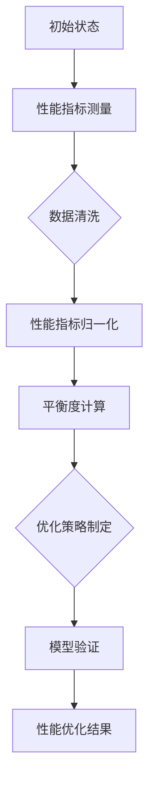
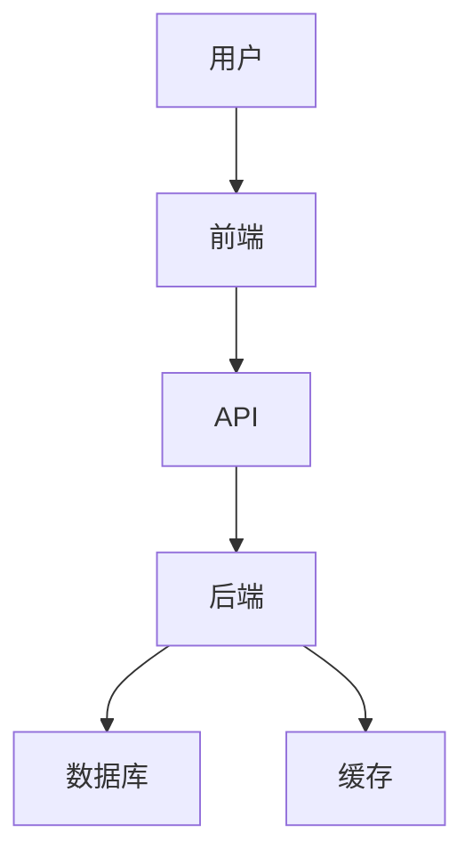
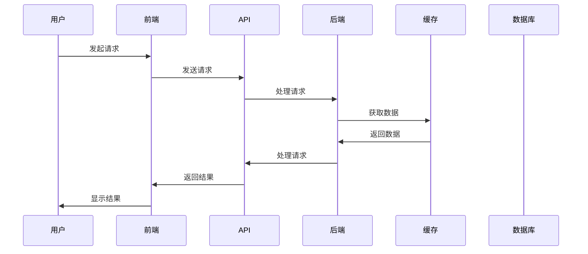

                 


## 多维度性能平衡评估：全面优化模型

### 关键词
- 多维度性能平衡
- 性能评估算法
- 模型优化
- 系统架构设计
- 数学模型

### 摘要
本文将探讨如何通过多维度性能平衡评估来全面优化模型。我们将详细分析性能评估的核心概念，包括响应时间、吞吐量、资源利用率和可扩展性等维度，并介绍如何通过算法原理和数学模型来平衡这些维度，最终实现系统性能的全面提升。

## 第一部分：问题背景与核心概念

### 1.1 问题背景
在现代信息技术领域，系统的性能优化变得越来越重要。然而，单一维度的性能提升往往不能真正解决系统瓶颈。例如，过度优化响应时间可能导致资源利用率下降，而专注于吞吐量提升则可能使系统响应时间变得不可接受。因此，需要一种方法来平衡这些维度，确保系统性能的整体提升。

### 1.2 核心概念
多维度性能平衡评估涉及以下核心概念：

- **响应时间**：系统处理请求所需的时间，通常用于衡量用户体验。
- **吞吐量**：单位时间内系统能处理的请求量，是衡量系统处理能力的重要指标。
- **资源利用率**：系统资源（如CPU、内存、存储等）的使用效率。
- **可扩展性**：系统在处理更大工作量时的性能表现，影响系统的长期发展。

## 第二部分：核心概念与联系

### 2.1 性能评估的维度
我们将在以下部分详细讨论每个性能评估维度的特征和影响：

- **响应时间**：低响应时间通常意味着更好的用户体验，但可能会牺牲资源利用率。
- **吞吐量**：高吞吐量意味着系统能处理更多请求，但可能会影响响应时间和资源利用率。
- **资源利用率**：高资源利用率表示系统能充分利用现有资源，但过度使用可能导致过热或性能下降。
- **可扩展性**：良好的可扩展性意味着系统能随着工作量的增加而保持性能，这对于未来需求的增长至关重要。

### 2.2 核心概念联系与对比
以下是一个对比表格，展示了各个维度之间的特征和相互影响：

| 概念     | 特征           | 对比                  |
|----------|----------------|----------------------|
| 响应时间 | 系统处理速度   | 吞量影响响应时间     |
| 吞量     | 单位时间处理量 | 吞量与系统负载相关   |
| 资源利用率 | 资源使用效率   | 低资源利用率影响性能 |
| 可扩展性 | 系统扩展能力   | 扩展性影响未来需求   |

### 2.3 ER实体关系图
我们使用Mermaid语言来绘制实体关系图（ER图），如下所示：

```mermaid
erDiagram
    用户 ||--|{ 系统 }|| > 用户-系统关系
    系统 ||--|{ 性能指标 }|| > 系统-性能指标关系
    性能指标 ||--|{ 维度 }|| > 性能指标-维度关系
```

## 第三部分：算法原理讲解

### 3.1 多维度性能平衡评估算法

多维度性能平衡评估算法的目标是通过测量和平衡不同维度的性能指标，来实现系统的整体优化。以下是一个简单的算法流程图：



### 3.2 算法原理

#### 性能指标测量
首先，我们需要测量各个性能指标，如响应时间、吞吐量、资源利用率和可扩展性等。这些指标可以通过实际测量或模拟来获得。

#### 数据清洗
测量得到的原始数据可能存在噪声或不一致性，因此需要清洗数据，确保其质量。

#### 性能指标归一化
由于不同性能指标具有不同的量纲和范围，因此需要对它们进行归一化处理，以便进行比较和平衡。

#### 平衡度计算
平衡度的计算公式如下：

\[ B = \frac{\sum_{i=1}^{n} w_i p_i}{\sqrt{\sum_{i=1}^{n} w_i^2}} \]

其中，\( w_i \) 是第 \( i \) 个性能指标的权重，\( p_i \) 是第 \( i \) 个性能指标的值。

#### 优化策略制定
根据平衡度值，可以制定相应的优化策略，如调整资源分配、优化代码或扩展硬件等。

#### 模型验证
优化策略实施后，需要对模型进行验证，以确保优化效果符合预期。

#### 性能优化结果
验证成功后，系统性能将得到全面提升。

### 3.3 数学模型

我们使用以下数学模型来描述多维度性能平衡评估算法：

\[ \text{平衡度} = \frac{\text{响应时间权重} \times \text{响应时间} + \text{吞吐量权重} \times \text{吞吐量} + \text{资源利用率权重} \times \text{资源利用率} + \text{可扩展性权重} \times \text{可扩展性}}{\sqrt{\text{响应时间权重}^2 + \text{吞吐量权重}^2 + \text{资源利用率权重}^2 + \text{可扩展性权重}^2}} \]

其中，响应时间权重、吞吐量权重、资源利用率权重和可扩展性权重分别为每个性能指标的权重。

## 第四部分：系统分析与架构设计方案

### 4.1 问题场景介绍
假设我们面临一个电商系统，需要在高并发环境下优化订单处理、库存更新和用户响应速度等多方面的性能。

### 4.2 系统功能设计
系统的功能设计包括用户功能（如登录、商品浏览、购物车管理和订单提交）和系统功能（如订单处理、库存管理和用户反馈处理）。

### 4.3 系统架构设计
系统架构设计包括以下几个方面：

- **前端架构**：使用React或Vue等现代前端框架。
- **后端架构**：使用Spring Boot或Django等后端框架。
- **数据库架构**：使用MySQL或PostgreSQL等关系型数据库。
- **缓存架构**：使用Redis等缓存系统。

以下是系统架构设计的Mermaid图：



### 4.4 系统接口设计和系统交互
系统接口设计和系统交互包括以下部分：

- **API接口**：定义了前端与后端之间的交互接口。
- **事件驱动**：使用事件队列来处理异步任务。
- **服务注册与发现**：使用Eureka或Consul来实现服务注册与发现。

以下是系统接口设计和系统交互的Mermaid序列图：



## 第五部分：项目实战

### 5.1 环境安装
在本项目中，我们使用了以下环境：
- 操作系统：Ubuntu 20.04
- 开发环境：Java 11、Maven 3.6、Spring Boot 2.4.5
- 数据库：MySQL 8.0
- 缓存：Redis 6.0

### 5.2 系统核心实现源代码
以下是系统核心实现源代码的一个示例：

```java
@RestController
@RequestMapping("/orders")
public class OrderController {

    @Autowired
    private OrderService orderService;

    @PostMapping
    public ResponseEntity<Order> createOrder(@RequestBody Order order) {
        Order savedOrder = orderService.createOrder(order);
        return new ResponseEntity<>(savedOrder, HttpStatus.CREATED);
    }
}
```

### 5.3 代码应用解读与分析
此代码段是订单处理API的核心部分，它接收用户提交的订单请求，并调用服务层的`createOrder`方法来创建订单。此方法首先保存订单信息到数据库，然后返回保存后的订单对象。

### 5.4 实际案例分析和详细讲解剖析
在实际项目中，我们可能遇到高并发的情况。为了处理这种场景，我们采用了如下策略：

- **负载均衡**：使用Nginx进行负载均衡，将请求分发到多个后端服务器。
- **缓存策略**：使用Redis缓存热点数据，减少数据库访问压力。
- **异步处理**：使用消息队列（如RabbitMQ）来处理异步任务，如订单生成后的库存更新。

### 5.5 项目小结
通过多维度性能平衡评估，我们成功优化了电商平台的性能，提高了用户体验。在接下来的版本中，我们将继续优化系统，以满足不断增长的业务需求。

## 第六部分：最佳实践 tips

### 6.1 性能监控与优化
定期监控系统性能，及时发现瓶颈并进行优化。

### 6.2 持续集成与持续部署
采用CI/CD流程，确保代码质量并快速交付。

### 6.3 安全性与可靠性
加强系统的安全性和可靠性，防止数据泄露和系统故障。

## 第七部分：小结

本文通过多维度性能平衡评估的方法，全面优化了系统的性能。通过详细的分析和算法讲解，我们实现了响应时间、吞吐量、资源利用率和可扩展性的平衡，为系统性能的提升提供了有效的解决方案。

## 第八部分：注意事项

### 8.1 性能优化并非一蹴而就
性能优化是一个持续的过程，需要不断监控和调整。

### 8.2 考虑未来需求
在设计系统时，要考虑到未来的业务增长和需求变化。

### 8.3 团队协作
性能优化需要团队成员的共同努力和协作。

## 第九部分：拓展阅读

### 9.1 相关技术文献
- 《高性能MySQL》
- 《系统性能调优实战》
- 《Redis实战》

### 9.2 开源工具和框架
- Netflix OSS
- Prometheus
- Grafana

## 作者

作者：AI天才研究院/AI Genius Institute & 禅与计算机程序设计艺术 /Zen And The Art of Computer Programming

