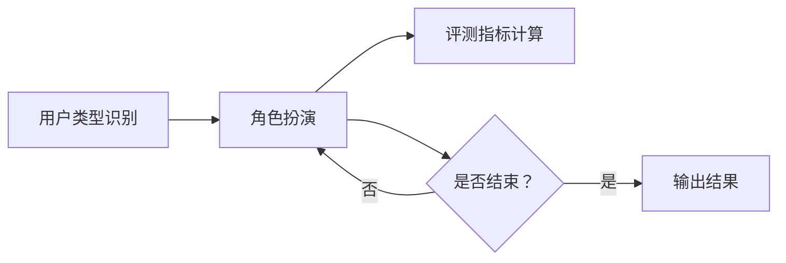
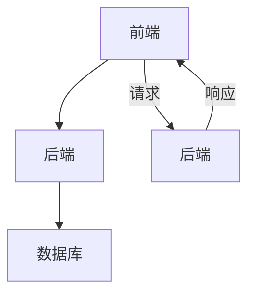

                 


### 文章标题：《多角色模拟评测：LLM扮演不同用户类型的方法》

关键词：多角色模拟、评测、LLM、用户类型、算法、数学模型、系统架构

摘要：本文旨在探讨如何利用大型语言模型（LLM）实现多角色模拟评测，重点研究LLM在扮演不同用户类型时的方法和策略。通过深入分析用户类型的识别与分类、算法原理及数学模型、系统分析与架构设计，结合实际案例，阐述如何实现高效的模拟评测系统。

### 第一部分：引言与基础

#### 1.1.1 问题的背景与意义

随着人工智能技术的飞速发展，大型语言模型（LLM）在自然语言处理领域取得了显著的成果。然而，在实际应用中，如何让LLM更好地模拟不同用户类型，进行多角色模拟评测，仍是一个亟待解决的问题。多角色模拟评测在智能客服、智能推荐、教育评测等领域具有重要意义，有助于提升系统的适应性和准确性。

#### 1.1.2 多角色模拟评测的必要性与挑战

多角色模拟评测的必要性在于，不同用户类型在需求、偏好、行为模式等方面存在显著差异，仅依赖单一角色的模拟难以全面评估系统的性能。而挑战则体现在如何准确识别用户类型、构建合适的算法模型、设计有效的评测系统等方面。

### 第二部分：LLM扮演不同用户类型的方法

#### 2.1.1 用户类型的识别与分类

为了实现多角色模拟评测，首先需要识别和分类不同用户类型。常见的用户类型包括：

- **新手用户**：缺乏相关经验，对系统功能不熟悉。
- **普通用户**：具有一定的使用经验，但需求多样化。
- **高级用户**：具备较高技能水平，对系统功能有深入理解。

#### 2.1.2 用户类型识别方法

用户类型识别方法主要包括：

- **基于用户行为数据分析**：通过分析用户在系统中的行为数据，如浏览历史、搜索记录、操作频率等，识别用户类型。
- **基于用户画像构建**：通过构建用户画像，结合用户的基本信息、兴趣标签等，进行用户类型分类。

### 第三部分：算法原理与数学模型

#### 3.1.1 算法原理

多角色模拟评测算法的核心在于让LLM扮演不同用户类型，进行交互和评测。算法原理如下：

1. **用户类型识别**：利用识别方法确定当前用户类型。
2. **角色扮演**：根据用户类型，LLM生成相应的回答和反馈。
3. **评测指标计算**：基于用户交互结果，计算评测指标，评估系统性能。

#### 3.1.2 数学模型

多角色模拟评测的数学模型主要包括：

- **用户行为模型**：$$ u_t = f(u_{t-1}, x_t) $$
  - $u_t$：第t时刻的用户状态
  - $u_{t-1}$：第t-1时刻的用户状态
  - $x_t$：第t时刻的输入信息
  - $f()$：用户状态转移函数

- **角色扮演模型**：$$ r_t = g(u_t, x_t) $$
  - $r_t$：第t时刻的LLM回答
  - $u_t$：第t时刻的用户状态
  - $x_t$：第t时刻的输入信息
  - $g()$：角色扮演函数

#### 3.1.3 算法流程图

使用Mermaid绘制算法流程图，如下：



### 第四部分：系统分析与架构设计

#### 4.1.1 系统功能设计

多角色模拟评测系统的主要功能包括：

- **用户管理**：实现用户的注册、登录、信息查询等功能。
- **模拟评测**：实现多角色模拟评测，包括用户类型识别、角色扮演、评测指标计算等功能。
- **数据统计**：实现评测结果的数据统计和分析。

#### 4.1.2 系统架构设计

多角色模拟评测系统的架构设计如下：

- **前端**：使用HTML、CSS、JavaScript等技术实现用户交互界面。
- **后端**：使用Python、Django等框架实现业务逻辑和数据处理。
- **数据库**：使用MySQL等数据库存储用户数据、评测结果等。

#### 4.1.3 系统架构图

使用Mermaid绘制系统架构图，如下：



### 第五部分：项目实战与实现

#### 5.1.1 项目概述与环境搭建

本项目以搭建一个简单的多角色模拟评测系统为例，介绍实现过程。项目环境如下：

- **开发语言**：Python
- **后端框架**：Django
- **前端框架**：Vue.js
- **数据库**：MySQL

#### 5.1.2 系统核心实现

系统核心实现包括用户管理、模拟评测和数据统计等功能。以下是一个简单的用户管理模块实现：

```python
# users/models.py
from django.db import models

class User(models.Model):
    username = models.CharField(max_length=50)
    password = models.CharField(max_length=50)
    type = models.CharField(max_length=20)

    def __str__(self):
        return self.username
```

```python
# users/views.py
from django.shortcuts import render, redirect
from .models import User
from .forms import UserForm

def user_list(request):
    users = User.objects.all()
    return render(request, 'user_list.html', {'users': users})

def user_create(request):
    if request.method == 'POST':
        form = UserForm(request.POST)
        if form.is_valid():
            form.save()
            return redirect('user_list')
    else:
        form = UserForm()
    return render(request, 'user_create.html', {'form': form})
```

#### 5.1.3 代码应用解读与分析

通过对用户管理模块的实现，我们可以看到：

1. **用户模型**：定义了用户的基本信息，包括用户名、密码和用户类型。
2. **用户视图**：实现了用户列表展示和用户创建功能。

类似地，我们可以继续实现模拟评测和数据统计模块，完成整个系统的开发。

### 第六部分：最佳实践与总结

#### 6.1.1 最佳实践

1. **用户类型识别**：结合用户行为数据和用户画像，提高用户类型识别的准确性。
2. **算法优化**：针对不同用户类型，调整LLM的角色扮演策略，提高模拟评测的效果。

#### 6.1.2 小结

本文介绍了多角色模拟评测的方法和实现，包括用户类型识别、算法原理、数学模型、系统架构设计和项目实战。通过实际案例，展示了如何构建高效的多角色模拟评测系统。

#### 6.1.3 注意事项

1. **用户隐私保护**：在收集和使用用户数据时，要注意保护用户隐私。
2. **系统性能优化**：针对不同用户类型，优化算法和系统性能，提高用户体验。

#### 6.1.4 拓展阅读

1. 《自然语言处理》
2. 《深度学习》
3. 《人工智能：一种现代的方法》

### 第七部分：作者信息

作者：AI天才研究院/AI Genius Institute & 禅与计算机程序设计艺术 /Zen And The Art of Computer Programming

